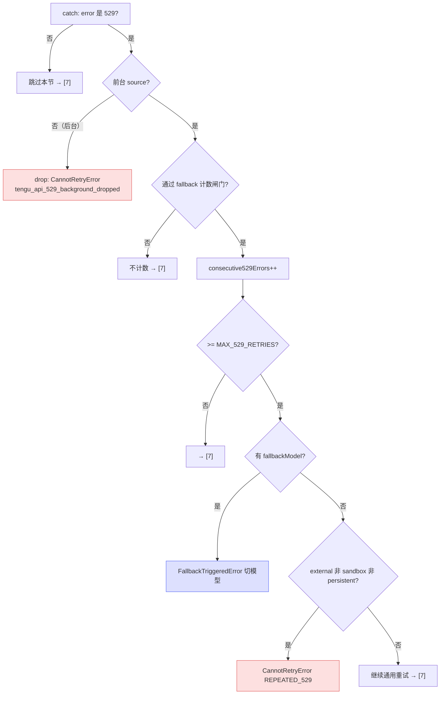

# [6] 529 处理与模型 fallback

> 接 `[5]`，catch 继续处理 **529（服务过载）专属逻辑**。这是暗线 A（容量错误）最关键的一段：决定后台请求直接放弃、前台请求累计几次后切换到 fallback 模型（`withRetry.ts:313-362`）。

---

## 一、后台 source 立即 drop

```typescript
if (is529Error(error) && !shouldRetry529(options.querySource)) {
  logEvent('tengu_api_529_background_dropped', {
    query_source: options.querySource as ...,
  })
  throw new CannotRetryError(error, retryContext)
}
```

紧扣 `[1]` 的白名单设计：如果是 529 **且** 这个 `querySource` 不在前台白名单里（摘要/标题/分类器…），**不重试**——打一个 `tengu_api_529_background_dropped` 埋点，直接 `throw CannotRetryError`。

> **为什么放在这么前面**：在做任何重试准备（计数、退避计算）之前就 drop，最大化"省容量"的效果。容量级联时这条路径会拦掉大量后台请求。

---

## 二、连续 529 追踪闸门

```typescript
if (
  is529Error(error) &&
  // 若 FALLBACK_FOR_ALL_PRIMARY_MODELS 未设置，则仅当主模型是非自定义 Opus 模型时才进入。
  (process.env.FALLBACK_FOR_ALL_PRIMARY_MODELS ||
    (!isClaudeAISubscriber() && isNonCustomOpusModel(options.model)))
) {
  consecutive529Errors++
  // …（达阈值处理，见三）
}
```

不是所有 529 都计入 fallback 计数——要先过这道闸门：

| 闸门条件 | 含义 |
|---|---|
| `FALLBACK_FOR_ALL_PRIMARY_MODELS` 已设置 | 强制对所有主模型启用 fallback 计数 |
| 或：非订阅用户 **且** `isNonCustomOpusModel(model)` | 只有 PAYG 用户用非自定义 Opus 时才计数 |

> **`isNonCustomOpusModel` 的历史包袱**（源码 TODO）：这个检查源自 Claude Code 早期硬编码用 Opus 的时代。注释明确说"重新审视它是否还应该存在，或只是陈旧遗留"。理解时把它当作"是否对当前模型启用 Opus→fallback 降级"的历史门槛即可。

通过闸门 → `consecutive529Errors++`。

---

## 三、达 `MAX_529_RETRIES` 后的两条分叉

```typescript
if (consecutive529Errors >= MAX_529_RETRIES) {   // MAX_529_RETRIES = 3
  // 分叉 A：配了 fallback 模型
  if (options.fallbackModel) {
    logEvent('tengu_api_opus_fallback_triggered', {
      original_model: options.model as ...,
      fallback_model: options.fallbackModel as ...,
      provider: getAPIProviderForStatsig(),
    })
    throw new FallbackTriggeredError(options.model, options.fallbackModel)
  }

  // 分叉 B：external 非 sandbox 非 persistent → 彻底放弃
  if (
    process.env.USER_TYPE === 'external' &&
    !process.env.IS_SANDBOX &&
    !isPersistentRetryEnabled()
  ) {
    logEvent('tengu_api_custom_529_overloaded_error', {})
    throw new CannotRetryError(new Error(REPEATED_529_ERROR_MESSAGE), retryContext)
  }
}
```

连续 3 次 529 后（结合 `[2]` 的 `initialConsecutive529Errors` 预置——流式已发生的 529 也计入），两条出路：

### 分叉 A：有 fallback 模型 → 切模型

抛 `FallbackTriggeredError(原模型, fallback模型)`。这个**控制信号**上抛到 `query.ts`，由它换模型重发整个请求（见 `[0]` 三类退出、`[2]` 错误类）。埋点叫 `tengu_api_opus_fallback_triggered`——名字里的 "opus" 同样是历史遗留。

### 分叉 B：无 fallback + external 用户 → 放弃

没配 fallback 时，**外部用户**（非 sandbox、非 persistent）连续 3 次 529 就彻底放弃——抛 `CannotRetryError`，消息是用户友好的 `REPEATED_529_ERROR_MESSAGE`（"服务持续过载，请稍后再试"之类）。

> **为什么排除 sandbox / persistent**：sandbox 是测试环境，persistent 是无人值守要无限重试——这两种都不该因为 3 次 529 就放弃。它们会落到下面的通用重试路径（`[7]` `[8]`）继续等。
>
> **注意分叉 A、B 不互斥但有优先级**：先判 fallbackModel（有就切模型）；没有才判 external 放弃。若两者都不满足（如 ant 用户无 fallback），代码**继续往下**走通用重试逻辑，不在这里退出。

---

## 四、529 处理流程图



---

## 速记口诀

- **后台 529 立即 drop**：!shouldRetry529 → CannotRetryError（最前面，省容量）。
- **计数闸门**：FALLBACK_FOR_ALL_PRIMARY_MODELS 或（非订阅 + 非自定义 Opus）才 ++。
- **MAX_529=3 后**：有 fallbackModel → FallbackTriggeredError 切模型；否则 external 用户 → CannotRetryError(REPEATED_529)。
- **sandbox / persistent / ant 无 fallback** → 不在此退出，落到通用重试 [7][8]。
- **isNonCustomOpusModel / "opus" 埋点名** = Opus 时代历史遗留。
