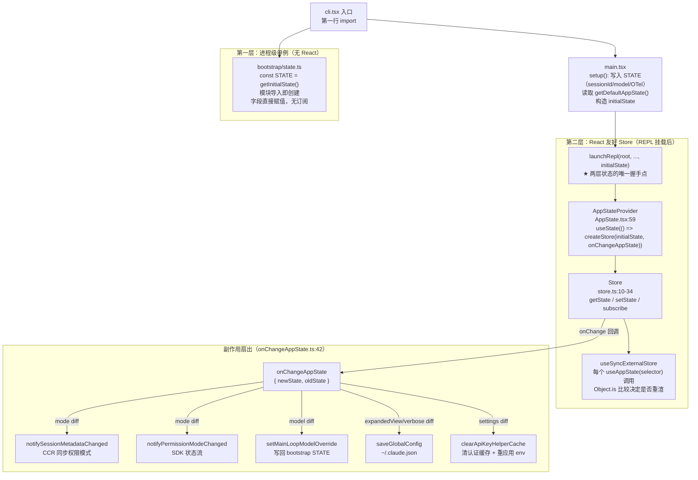
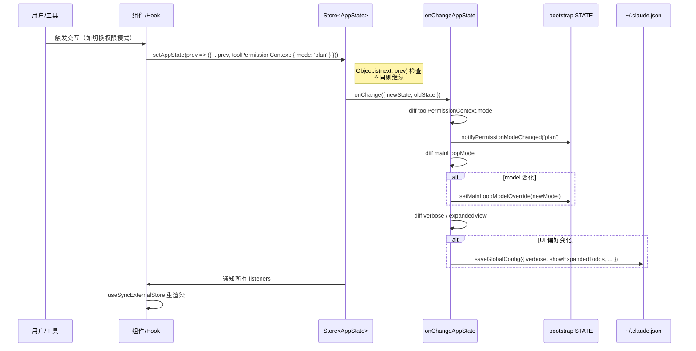

# 状态管理知识总结

> 这是"总结学习"栏目的第四篇。目标：彻底理解 Claude Code 的**状态管理层**——进程级 bootstrap STATE 单例、REPL 挂载后的 React 友好 AppState Store、两者之间的握手机制，以及副作用是如何从单一漏斗 `onChangeAppState` 扇出到 CCR/SDK/磁盘配置的。

---

## 一、状态管理全貌

### 双层状态架构



### 数据更新时序



---

## 二、必须掌握（核心 6 点）

### 1. 两层状态的分工

这是 Claude Code 最重要的架构决策之一。两层状态**不可互换**，理解各自的边界是读懂整个代码库的前提：

| 维度 | `bootstrap STATE`<br/>`src/bootstrap/state.ts:423` | `AppState`<br/>`src/state/AppStateStore.ts:91` |
|---|---|---|
| **创建时机** | 第一次 `import` 时（模块级即创建） | `AppStateProvider` 挂载时（REPL 启动后） |
| **销毁时机** | 进程退出 | REPL 卸载 |
| **可变性** | 直接字段赋值，setter 函数 | 不可变更新 `setState(prev => next)` |
| **可观察性** | 无订阅（唯一信号：`sessionSwitched:475`） | `store.subscribe()` + React `useSyncExternalStore` |
| **React 感知** | 否 | 是 |
| **保存内容** | sessionId、cost 累计、telemetry 计数器、model override、auth 凭证、CLI 输入、文件路径、beta 头 latch | 消息历史、工具列表、权限上下文、MCP 连接、UI 状态、任务列表、插件信息 |
| **访问方式** | `getSessionId()` / `setMainLoopModelOverride()` 等类型化 getter/setter | `useAppState(selector)` / `useSetAppState()` |

**为什么要两层？**

- `bootstrap STATE` 需要在 React 挂载之前就存在（记录启动耗时、处理 CLI flags、初始化 OTel）。
- `AppState` 需要支持 React 渲染（149 个组件订阅它）并支持 `/resume` 序列化。

**握手点**：`main.tsx` 中 `launchRepl(root, ..., initialState)` 把从 bootstrap STATE 汇总出的 `initialState` 传给 `AppStateProvider`，完成唯一一次交接。

### 2. 30 行手写 Store（`src/state/store.ts:10-34`）

Claude Code 没有用 Redux 或 Zustand，而是内联了一个极简 Store：

```ts
export function createStore<T>(
  initialState: T,
  onChange?: OnChange<T>,     // ★ 副作用注入钩子
): Store<T> {
  let state = initialState
  const listeners = new Set<Listener>()

  return {
    getState: () => state,

    setState: (updater: (prev: T) => T) => {
      const prev = state
      const next = updater(prev)
      if (Object.is(next, prev)) return  // ★ 引用相等则跳过
      state = next
      onChange?.({ newState: next, oldState: prev })   // ★ 先通知副作用
      for (const listener of listeners) listener()      // ★ 再通知 React
    },

    subscribe: (listener: Listener) => {
      listeners.add(listener)
      return () => listeners.delete(listener)
    },
  }
}
```

**理解要点**：
- `onChange` 参数就是 `onChangeAppState`，在应用层注入，Store 本身对它一无所知——这是依赖倒置的教科书案例。
- `Object.is(next, prev)` 是整个响应式系统的性能关键：同一个引用 = 无变化 = 跳过所有通知。
- `setState` 接受 **updater 函数**（`prev => next`），不接受值——这强制调用方不捕获旧 state 闭包。

### 3. `AppState` 的 8 个语义组（`src/state/AppStateStore.ts:91-453`）

`AppState` 有 60+ 个顶级字段，不需要逐个记忆，记住 8 个语义组即可：

| 语义组 | 代表字段 | 说明 |
|---|---|---|
| **UI/配置** | `settings`, `verbose`, `mainLoopModel`, `expandedView`, `fastMode`, `effortValue`, `statusLineText` | 用户可调的 UI 和模型配置 |
| **权限/认证** | `toolPermissionContext`, `authVersion`, `denialTracking`, `workerSandboxPermissions` | 三层权限模型的运行时状态 |
| **对话/Agent** | `tasks`, `agentNameRegistry`, `foregroundedTaskId`, `viewingAgentTaskId`, `todos`, `pendingPlanVerification` | 多 Agent 协作和对话流 |
| **MCP/插件** | `mcp.{clients,tools,commands,resources}`, `plugins.{enabled,disabled,commands}`, `sessionHooks` | 扩展点的运行时配置 |
| **文件/归因** | `fileHistory`, `attribution` | undo/diff 基础 + 代码归因 |
| **通知/收件箱** | `notifications.{current,queue}`, `elicitation.queue`, `inbox.messages` | 用户通知和 MCP Elicitation 队列 |
| **Remote Bridge** | `replBridgeEnabled`, `replBridgeConnected`, `remoteSessionUrl`, `channelPermissionCallbacks` | RCS 远程控制会话状态 |
| **Teams/实验** | `teamContext`, `ultraplanLaunching`, `tungsten*`(ant), `bagel*`(ant) | 多工作者协作和内部功能 |

**陷阱提醒**：`mainLoopModel` 和 `mainLoopModelForSession` 是不同字段。前者是用户在 UI 中选择的模型（会写 bootstrap STATE），后者是当前会话实际使用的模型（可被 API 响应头覆盖）。

### 4. React 集成的 3 个 Hook（`src/state/AppState.tsx`）

所有组件都通过这三个 hook 访问状态，不直接操作 Store：

**`useAppState<T>(selector: (s: AppState) => T)`（line 129）**
```ts
// 典型用法
const model = useAppState(s => s.mainLoopModel)
const hasPermission = useAppState(s => s.toolPermissionContext.mode === 'bypassPermissions')
```
- 底层：`useSyncExternalStore(store.subscribe, () => selector(store.getState()))`
- **禁止 selector 返回新对象**（line 136 有 dev 守卫）：`s => ({ a: s.a, b: s.b })` 每次返回新引用 → `Object.is` 永远 false → 无限重渲
- 正确写法：拆成两个 `useAppState` 调用，或用 `useAppStateMaybeOutsideOfProvider`（有特殊需求时）

**`useSetAppState()`（line 153）**
```ts
const setAppState = useSetAppState()
// 用法
setAppState(prev => ({ ...prev, verbose: true }))
```
- 返回稳定的 `store.setState` 引用，不会导致调用组件重渲

**`useAppStateMaybeOutsideOfProvider<T>(selector)`（line 170）**
- 没有 `AppStateProvider` 时返回 `undefined`（不抛错）
- 用于 headless/SSR 场景以及非 REPL 上下文的组件

### 5. `onChangeAppState`：副作用的"单一漏斗"（`src/state/onChangeAppState.ts:42`）

这是 Claude Code 副作用管理最精妙的设计——所有外部副作用都从这一个函数触发，没有散落在各处的 `useEffect`。

**5 个 diff 分支（line 63-156）**：

```
分支 1：toolPermissionContext.mode 变化（line 63-90）
  → toExternalPermissionMode() 转换
  → notifySessionMetadataChanged({ permission_mode }) → CCR Web UI 同步
  → notifyPermissionModeChanged(newMode) → SDK 状态流

分支 2：mainLoopModel 变化（line 96-98）
  → setMainLoopModelOverride(newState.mainLoopModel)
  → 写回 bootstrap STATE（故意不持久化，避免跨 session 泄漏）

分支 3：expandedView 变化（line 101-114）
  → saveGlobalConfig({ showExpandedTodos, showSpinnerTree })
  → 持久化到 ~/.claude.json

分支 4：verbose 变化（line 116-126）
  → saveGlobalConfig({ verbose })

分支 5：settings 变化（line 142-156）
  → clearApiKeyHelperCache() + clearAwsCredentialsCache() + clearGcpCredentialsCache()
  → 若 settings.env 变化 → applyConfigEnvironmentVariables()
```

**为什么用单一漏斗而非分散 `useEffect`？**

`useEffect` 是 React 调度的，可能批量延迟执行、在 StrictMode 下执行两次，且难以在 headless 模式下运行。`onChangeAppState` 是同步注入到 `store.setState` 的 `onChange` 钩子，在每次 state 变化时**同步**执行，与 React 无关——headless 模式（`main.tsx:3236`）同样传入这个函数，保证行为一致。

**注释里有完整的故障历史**（line 49-61）：权限模式曾经有 8+ 个变更路径，其中只有 2 个通知 CCR，导致 Web UI 与 CLI 不同步。引入单一漏斗后，任意路径的 `setAppState` 都会自动触发同步。

### 6. 持久化层级

Claude Code 的持久化分三个独立层，与 AppState 分离：

**层 1：`~/.claude.json`（global config）**
- 管理函数：`saveGlobalConfig` / `getGlobalConfig`（`src/utils/config.ts`）
- 保存：theme、verbose、expandedView、tungstenPanelVisible（ant only）、userID、auth tokens、`showExpandedTodos`、`showSpinnerTree`
- 注意：`mainLoopModel` **不保存**在这里（见上文注释，避免会话间泄漏）

**层 2：每项目 `projectConfig`**
- 保存：project trust、allowed tools、`customApiKeyHelper`
- 每次新 `setProjectConfig()` 调用写回

**层 3：`settings.json`（5 层合并）**
- user / project / local / flag / policy 5 层叠加
- 读取后通过 `getInitialSettings()` → `getDefaultAppState()` → `AppState.settings` 流入 AppState
- 变化时通过 `applySettingsChange()`（AppState.tsx:90）流回 AppState

**AppState 是内存层**：AppState 本身不直接持久化。`onChangeAppState` 是唯一的"选择性写回"桥梁。

**bootstrap STATE 中的"session-only"字段**：`sessionBypassPermissionsMode`、`sessionTrustAccepted`、`sessionCronTasks`、`sessionCreatedTeams`、`lspRecommendationShownThisSession`、各 beta header latch——这些字段被设计为故意不持久化，随进程退出消失。

---

## 三、应该了解（次要 3 点）

### 1. 派生选择器与 view 切换 helper（`src/state/selectors.ts` + `src/state/teammateViewHelpers.ts`）

**`selectors.ts`** 导出计算型选择器：
- `getViewedTeammateTask(appState)` — 解析当前查看的 teammate 任务（:18）
- `ActiveAgentForInput` — 判断 agent 输入路由的歧视联合类型（:46）
- `getActiveAgentForInput(appState)` — 返回 `{type:'leader'}`、`{type:'viewed', task}` 或 `{type:'named_agent', task}`（:59）

这些函数传入整个 `AppState` 而非单个字段——避免在每个调用处手动 join 多个字段。

**`teammateViewHelpers.ts`** 封装视图切换：
- `enterTeammateView(taskId, setAppState)` — 切换到某个 teammate 的视图
- 对应 exit helper

### 2. Headless 模式的 Store 创建（`src/main.tsx:3236-3262`）

非交互 / API headless 模式同样使用同一套 Store 机制，只是不走 React：

```ts
// main.tsx（简化）
const headlessInitialState: AppState = {
  ...getDefaultAppState(),
  mcp: { clients: [], tools: [], commands: [], resources: [], pluginReconnectKey: 0 },
  toolPermissionContext,
  effortValue,
}
const headlessStore = createStore(headlessInitialState, onChangeAppState)
```

这意味着：
- `onChangeAppState` 的副作用（CCR 同步、权限通知）在 headless 下同样有效
- 没有 React，所以没有 `useSyncExternalStore`——headless 消费者直接调 `headlessStore.getState()`

### 3. `sessionSwitched` 信号（bootstrap STATE 的唯一可观察点）

`src/bootstrap/state.ts:475-483`：

```ts
let sessionSwitchCallbacks: Array<(newSessionId: string) => void> = []
export function onSessionSwitch(cb) { sessionSwitchCallbacks.push(cb) }
export function sessionSwitched(newSessionId) {
  STATE.sessionId = newSessionId
  for (const cb of sessionSwitchCallbacks) cb(newSessionId)
}
```

`concurrentSessions.ts` 订阅这个信号：当用户运行 `/resume` 切换到另一个会话时，`sessionSwitched()` 广播新的 sessionId，让 telemetry 计数器和 CCR 连接能正确重绑定。

这是 bootstrap STATE 中**唯一**的事件驱动机制——其余字段全部是"拉取（getter）"而非"推送（订阅）"。

---

## 四、可暂时跳过

- `AppState` 中各 `replBridge*` 字段的含义（远程控制协议细节，与 `packages/remote-control-server/` 相关）
- `ultraplanLaunching` / `ultraplanPendingChoice` 等 Ultraplan 字段（feature-gated）
- `tungsten*` / `bagel*` / `computerUseMcpState` 等 Anthropic 内部字段（`USER_TYPE=ant` 才有意义）
- `resetStateForTests()`（bootstrap STATE 的测试专用重置，只有测试文件会调用）
- `AppStateProvider` 中 `MailboxProvider` 和 `VoiceProvider` 的内部实现（扩展功能，不影响核心 state）
- `externalMetadataToAppState()`（CCR → AppState 的反向转换，只在 `/resume` 恢复会话时用）
- `concurrentSessions.ts` 的并发会话管理细节

---

## 五、关键文件清单（必备书签）

| 文件 | 角色 | 必看行号 |
|---|---|---|
| `src/state/store.ts` | 手写 Store 实现 | `Store<T>:4-8`、`createStore():10-34` |
| `src/state/AppStateStore.ts` | AppState 类型 + 工厂 | `AppState type:91-453`、`getDefaultAppState():457` |
| `src/state/AppState.tsx` | React Context Provider + hooks | `AppStoreContext:49`、`AppStateProvider:59`、`useAppState:129`、`useSetAppState:153`、`useAppStateMaybeOutsideOfProvider:170` |
| `src/state/onChangeAppState.ts` | 副作用扇出漏斗 | `onChangeAppState():42`、5 个 diff 分支 `:63-156`、背景注释 `:49-61` |
| `src/state/selectors.ts` | 派生选择器 | `getActiveAgentForInput():59` |
| `src/state/teammateViewHelpers.ts` | View 切换 helper | `enterTeammateView` |
| `src/bootstrap/state.ts` | 进程级 STATE 单例 | `STATE 单例:423`、`State type:45-252`、getter/setter 函数群、`sessionSwitched():475-483` |
| `src/components/App.tsx` | AppStateProvider 挂载点 | Provider 挂载 + `onChangeAppState` 传入 |
| `src/main.tsx` | 两个 Store 创建路径 | `launchRepl() 交互路径:3765+`、`headless store 创建:3236-3262` |

---

## 六、学习建议

**读代码顺序**：

1. **`src/state/store.ts`**（30 行，全部读完）— 理解 Store 的三件套：getState / setState / subscribe，以及 `onChange` 钩子的位置
2. **`src/state/onChangeAppState.ts`**（157 行，全部读完）— 找到 5 个 `if (newState.xxx !== oldState.xxx)` 块，逐一理解副作用
3. **`src/state/AppState.tsx:129-170`** — 三个 hook 的实现，对比各自的使用场景
4. **`src/state/AppStateStore.ts:91-120`**（仅读开头 30 行的 AppState 类型声明）— 看 8 个语义组的大致分布，不需要读完全部 450 行
5. **`src/bootstrap/state.ts:45-120`** — 读 `State` 类型声明的前 75 行，体会与 AppState 的字段分工
6. **`src/main.tsx`** 中搜索 `launchRepl` — 看 initialState 如何从 bootstrap STATE 汇总出来传给 AppStateProvider

**实验动作**：

1. 在 `store.ts` 的 `setState` 加 `console.error('[STATE]', Object.keys(updater({} as any)))` 日志，运行 `bun run dev` 然后切换权限模式，观察哪些字段被更新
2. 在 `onChangeAppState.ts` 的每个分支头部加 log，触发对应操作（切模型/切 verbose/切权限），验证副作用链路
3. 在 `AppState.tsx:136` 的 dev 守卫上打断点，写一个 selector 返回新对象，亲眼看警告
4. `grep -n "useAppState\(" src/screens/REPL.tsx | head -20` — 看 REPL 订阅了哪些 AppState 切片

---

## 七、与前序知识的衔接

| 前序知识 | 状态管理的对应 |
|---|---|
| `entry-summary` 中的 `bootstrap STATE` 单例 | 完整的 `State` 类型声明（`state.ts:45-252`）+ 数十个 getter/setter 函数群。entry 只是提到"它存在"，这篇告诉你它保存什么、为什么不用 React |
| `core-loop-summary` 中 `QueryEngine` 维护对话历史 | `QueryEngine` 内部通过 `setAppState(s => ({ ...s, tasks: newTasks }))` 写回 AppState，再由 React 重渲 REPL |
| `core-loop-summary` 中 REPL 的消息渲染 | REPL 的 `useAppState(s => s.tasks)` 订阅任务列表，每次 QueryEngine 更新 tasks 就重渲 |
| `tool-system-summary` 中 `assembleToolPool` 的结果 | 工具列表通过 `useMergedTools.ts` 传给 QueryEngine 的 `ToolUseContext`，而 `useMergedTools` 本身读取 `AppState.mcp.tools` |
| `tool-system-summary` 中 `canUseTool` 的权限回调 | `useCanUseTool()` hook 读取 `AppState.toolPermissionContext` —— 权限模式的单一真相来源 |
| `tool-system-summary` 中 `runToolUse` 权限拒绝写入 `QueryEngine.permissionDenials` | 拒绝同时触发 `setAppState(s => ({ ...s, denialTracking: ... }))` 更新 AppState，影响下次权限决策 |

**关键理解**：工具系统讲的是"每次工具调用内部 7 步流水线"，状态管理讲的是"这 7 步的上下文信息（权限模式、模型选择、MCP 工具列表）从哪里来、改变后如何传播"。两者合起来，你才有从用户动作 → AppState 变化 → 副作用扇出 → 工具执行的完整心智模型。

---

## 八、验证清单（学完后自测）

- [ ] 能不查代码说出 bootstrap STATE 和 AppState **各自保存什么类型的数据**，并举出 2 个具体字段例子
- [ ] 能解释为什么 `selector` 不能返回新对象（答：`Object.is` 每次 false → 无限重渲）
- [ ] 能指出 `createStore` 中 `Object.is(next, prev)` 早退的作用（答：相同引用跳过所有通知）
- [ ] 能说出 `onChangeAppState` 中权限模式变化会触发哪两个下游系统（答：CCR `notifySessionMetadataChanged` + SDK `notifyPermissionModeChanged`）
- [ ] 能解释为什么 `mainLoopModel` 不持久化到 `settings.json`（答：避免跨 session 模型选择泄漏，见注释 `state.ts:92-98`）
- [ ] 能说出 `launchRepl(... initialState)` 是两层状态的唯一握手点
- [ ] 能列出 `~/.claude.json` 持久化了哪些 AppState 字段（答：verbose、expandedView→showExpandedTodos/showSpinnerTree、tungstenPanelVisible）
- [ ] 能解释 headless 模式下的 Store 如何创建（答：`createStore(headlessInitialState, onChangeAppState)`，不走 React Provider）

---

## 九、后续学习路线

| 篇序 | 主题 | 为什么是下一篇 |
|---|---|---|
| **第五篇** | 终端 UI 层（Ink）| 149 个组件通过 `useAppState` 消费状态，现在你知道状态从哪来，可以读懂数据流向 |
| **第六篇** | 安全与权限 | `AppState.toolPermissionContext` 是权限系统的运行时根，弄清 state 后读权限代码更顺 |
| **第七篇** | MCP 协议 | `AppState.mcp.{clients,tools,commands}` 是 MCP 连接的状态容器，了解容器后看连接管理更清晰 |
| **第八篇** | 上下文工程 | `AppState.settings` 流入系统 prompt，了解 state 的 settings 字段后能读 context 构建代码 |
