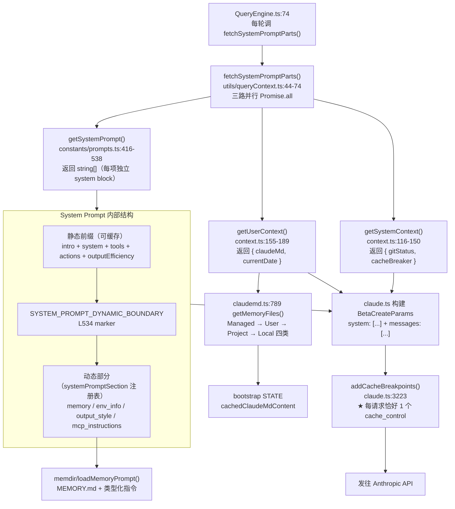
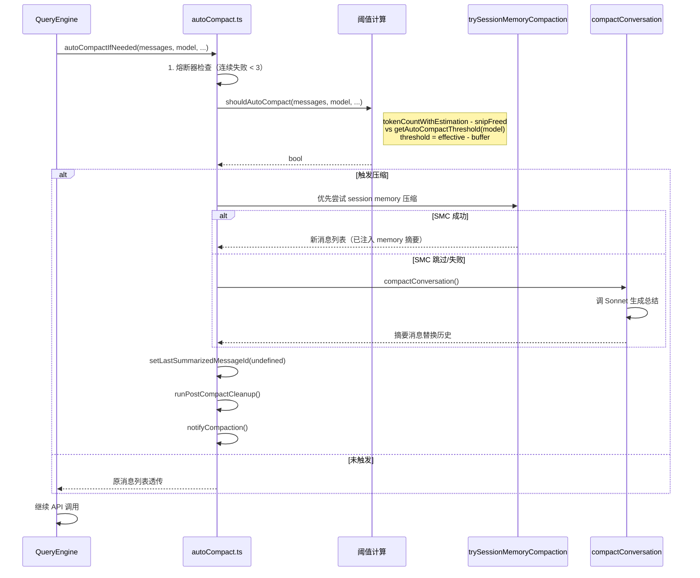

# 上下文工程知识总结

> 这是"总结学习"栏目的第五篇。目标：彻底理解 Claude Code 每一轮 API 调用时，**模型究竟看到了什么**——从静态 system prompt 的装配、CLAUDE.md 的多级合并、memdir 的类型化记忆注入，到 token budget 触发的 auto-compact 算法，再到 prompt cache 的"单一断点"策略。

---

## 一、上下文工程全貌

### 三源汇流：模型看到的世界



### Auto-Compact 决策时序



---

## 二、必须掌握（核心 6 点）

### 1. 上下文的"三源汇流"模型

每次 API 调用前，`QueryEngine.ts:74` 都会调用 `fetchSystemPromptParts()`（`src/utils/queryContext.ts:44-74`），并发拉取**三个互不相干的源**：

| 源 | 函数 | 内容 | 注入位置 |
|---|---|---|---|
| **System Prompt** | `getSystemPrompt()` `prompts.ts:416-538` | 持久化的"角色 + 规则 + 工具"指令 | `system: string[]`（API 字段） |
| **User Context** | `getUserContext()` `context.ts:155-189` | CLAUDE.md 合并内容 + 当前日期 | 拼到首条 user 消息前缀 |
| **System Context** | `getSystemContext()` `context.ts:116-150` | git status 快照 | 拼到首条 user 消息前缀 |

**关键洞察**：CLAUDE.md 与 git status **不进 system prompt**，而是作为**首条 user 消息的前缀**。原因：它们与会话特定的工作目录强相关，无法跨会话复用 prompt cache，放在 user 消息里更便于按需替换。

`fetchSystemPromptParts` 是 customSystemPrompt 与默认 prompt 的分歧点：当传 `customSystemPrompt` 时（如 `claude -p "..."` 模式），default prompt + system context 都被跳过（L62-71），只保留 user context。

### 2. System Prompt 的两段式结构（`src/constants/prompts.ts:416-538`）

`getSystemPrompt(tools, model, additionalDirs, mcpClients)` 返回 `string[]`，**每项独立成一个 system block**（这是 Anthropic API 的多块 system 用法）。

**静态前缀（L522-532，可缓存）**
1. `getSimpleIntroSection()` — persona（"You are Claude Code..."）
2. `getSimpleSystemSection()` — 环境/策略基础
3. `getSimpleDoingTasksSection()`（条件）
4. `getActionsSection()`
5. `getUsingYourToolsSection(enabledTools)` — 工具使用规则（CORE_TOOLS 的 schema 文本）
6. `getOutputEfficiencySection()`

**`SYSTEM_PROMPT_DYNAMIC_BOUNDARY` 标记（L534）** — 一道"水线"，标记静态/动态分界。

**动态部分（通过 `systemPromptSection()` 注册表）**
- `mode_persona` / `session_guidance` / `language` / `output_style`
- `memory`（L468）← **memdir 的注入点**
- `env_info_simple`（L472）— cwd / OS / model / date / additional dirs
- `mcp_instructions`（L486）— **`DANGEROUS_uncachedSystemPromptSection`，每轮重算**
- `scratchpad` / `frc` / `summarize_tool_results` / `token_budget`（feature gate）

**为什么静态/动态分离？** 静态前缀同一进程内只算一次（`resolveSystemPromptSections` 走 bootstrap STATE 的 `systemPromptSectionCache`），动态部分按 `cacheBreak` 标记决定是否复用。`DANGEROUS_uncached*` 是显式的"破坏缓存"标记 —— 用在 mcp_instructions 上是因为 MCP 工具列表会动态变化。

### 3. CLAUDE.md 四级层叠（`src/utils/claudemd.ts`）

`getMemoryFiles()`（L789，memoized）按 **4 种类型**收集 `.md` 文件：

```
1. Managed  — Anthropic 管理的全局规则（managed .claude/rules/*.md）
2. User     — ~/.claude/CLAUDE.md + 用户 rules 目录
3. Project  — 当前 cwd 向上回溯找到的 CLAUDE.md
4. Local    — CLAUDE.local.md（git 忽略的本地覆盖）
```

**层叠规则**：
- 单文件上限 `MAX_MEMORY_CHARACTER_COUNT = 40_000`（L91）
- worktree dedup（L867-874）：检测嵌套 worktree，跳过父仓库的 Project 文件，避免重复
- `@include` 外部引用：`processConditionedMdRules()`（L1353）支持 `@include path/to/file.md`
- glob-conditional rules：通过 `processMdRules()`（L696）实现"当编辑 `*.test.ts` 时才加载这条规则"

**合并产出**（`getClaudeMds()` L1152-1194）：
- 每类前置描述性 header（"project instructions, checked into the codebase" / "user's private global instructions" / ...）
- 顶部插入 `MEMORY_INSTRUCTION_PROMPT` 总指令
- feature flag `tengu_paper_halyard` 可跳过 project-level（A/B 测试控制）

**缓存层**：合并结果写入 bootstrap STATE 的 `cachedClaudeMdContent`（`bootstrap/state.ts:123` 字段、L1201 setter、L1206 getter）。`yoloClassifier.ts` 通过 getter 读取，避免循环 import。

### 4. memdir 类型化记忆系统（`src/memdir/`）

memdir 是 Claude Code 的**持久化、类型化、按需召回**的记忆体系，与 CLAUDE.md 不同：CLAUDE.md 是用户手写的项目指令（每轮全量注入），memdir 是 Claude 自己产生的结构化记忆（按需召回）。

**4 种类型**（`memoryTypes.ts:14`）：
| 类型 | 用途 |
|---|---|
| `user` | 关于用户的事实（角色、偏好、知识背景） |
| `feedback` | 用户给的反馈（"别再这样做"、"这种方式不错"） |
| `project` | 项目状态（正在做的事、决策、deadline） |
| `reference` | 外部资源指针（Slack 频道、Grafana 看板 URL） |

**目录结构**：
```
${CLAUDE_HOME}/projects/{sanitized-cwd}/memory/
├── MEMORY.md              ← 索引文件（≤200 行 / ≤25KB，超出截断 + 警告 footer）
├── user_role.md           ← 单条记忆（带 frontmatter: name/description/type）
├── feedback_testing.md
└── project_xxx.md
```

**路径解析链**（`paths.ts:222`）：`CLAUDE_COWORK_MEMORY_PATH_OVERRIDE` → settings → `{base}/projects/{sanitized-cwd}/memory/`。

**注入方式**（`memdir.ts:415` `loadMemoryPrompt()`）：
- 通过 `systemPromptSection('memory', ...)` 注册到动态部分（L468）
- 内容 = 类型化记忆指令文本 + MEMORY.md 索引
- **不全量加载单条记忆**，只加载索引

**按需召回**（`findRelevantMemories.ts:40`）：
- 用户输入触发时，扫描记忆文件的 frontmatter（`scanMemoryFiles`）
- 调 **Sonnet 做 sideQuery 选择**，最多挑 5 条
- 通过 `SELECT_MEMORIES_SYSTEM_PROMPT`（L19）约束 LLM 只返回相关路径
- 已用过的记忆 + 不匹配当前工具的记忆会被排除

**安全防护**（`teamMemPaths.ts:22` `sanitizePathKey`）：拒绝 null bytes / URL-encoded / NFKC 归一化绕过 / 反斜杠 / 绝对路径键 — 防止 path traversal。

### 5. Auto-Compact 算法（`src/services/compact/autoCompact.ts`）

**核心数学**（L29-101）：
```
effectiveContextWindow = contextWindow - reservedTokensForSummary
                       = 200K - 20K = 180K（默认模型）

bufferTokens（按窗口大小分级）：
  >= 800K window → 50K
  >= 400K window → 30K
  otherwise      → 13K

autoCompactThreshold = effectiveContextWindow - bufferTokens
                     = 180K - 13K = 167K（默认）
```

环境变量旁路：
- `CLAUDE_CODE_AUTO_COMPACT_WINDOW` — 直接覆盖 effective window
- `CLAUDE_AUTOCOMPACT_PCT_OVERRIDE` — 按百分比调整阈值
- `DISABLE_COMPACT` / `DISABLE_AUTO_COMPACT` — 完全禁用

**4 级告警状态**（`calculateTokenWarningState()` L122）：
```
percentLeft = (effective - used) / effective
isAboveWarningThreshold     — 余量警告 UI
isAboveErrorThreshold       — 红色警告 UI
isAboveAutoCompactThreshold — ★ 触发自动压缩
isAtBlockingLimit           — 阻止下次 API 调用
```

**触发流程**（`autoCompactIfNeeded()` L270）：
1. 熔断器：连续失败 ≥ 3 次则放弃（`MAX_CONSECUTIVE_AUTOCOMPACT_FAILURES`）
2. 递归守卫：在 `session_memory` / `compact` / `marble_origami` 等 sideQuery 中跳过
3. **优先**调 `trySessionMemoryCompaction()`（L317）— 利用 forked agent 产出的 session memory 摘要
4. 失败回退 `compactConversation()`（L342）— 标准对话摘要
5. 成功后：`setLastSummarizedMessageId(undefined)` + `runPostCompactCleanup()` + `notifyCompaction()`

**多种压缩策略并存**：
- `autoCompact.ts` — 主路径
- `microCompact.ts` / `apiMicrocompact.ts` — 单工具结果级别的微压缩（如截图/大段文本）
- `snipCompact.ts` — 截掉中间消息保留首尾
- `reactiveCompact.ts` — API 返回 413 时的事后修复
- `sessionMemoryCompact.ts` — 子代理压缩入口

### 6. Prompt Cache 的"单一断点"策略（`src/services/api/claude.ts:3223`）

`addCacheBreakpoints()` 的核心规则：**每个请求恰好一个 message-level `cache_control` 标记**（L3238-3249）。

为什么不能多个？注释（L3238-3248）解释了 KV cache 的本地注意力驱逐机制——多个断点会让 cache 命中率反而下降。

**断点位置规则**：
- 默认：插在最后一条消息上 → 这条之前的所有内容都参与下次请求的 cache 比对
- `skipCacheWrite` 模式（如 fire-and-forget 子任务）：插在倒数第二条 → 让主路径继续延伸 cache，子分叉不污染

**TTL**：
- `{ type: 'ephemeral' }` 默认 5 分钟
- `{ type: 'ephemeral', ttl: '1h' }` 在满足条件时使用（`getPromptCache1hEligible()` 控制 latch，避免每次切换 TTL 反而破坏 cache）

**System prompt 的隐式缓存**：
- 静态前缀（`SYSTEM_PROMPT_DYNAMIC_BOUNDARY` 之上）+ 所有 **非 `cacheBreak` 的 `systemPromptSection`** 形成 cacheable 前缀
- 当前只有 `mcp_instructions` 是 `DANGEROUS_uncached` —— 这是 cache miss 的主要来源之一

**其他 cache_control 使用点**：`sideQuery.ts` / `api.ts` / `promptCacheBreakDetection.ts`（telemetry：意外的 cache break 上报）/ `PromptSuggestion/`。

---

## 三、应该了解（次要 3 点）

### 1. `systemPromptSection` 注册表机制（`src/constants/systemPromptSections.ts`）

两个工厂函数 + 一个 resolver：

```ts
// 默认：缓存（cacheBreak: false）
systemPromptSection('memory', () => loadMemoryPrompt())

// 危险：每轮重算（cacheBreak: true）
DANGEROUS_uncachedSystemPromptSection('mcp_instructions', () => ..., 'MCP 工具列表会变化')
```

`resolveSystemPromptSections(sections)`（L43）按名字查 `getSystemPromptSectionCache()`（bootstrap STATE）：
- 非 cacheBreak → 命中缓存直接返回
- cacheBreak → 强制重算

`clearSystemPromptSections()`（L65）在 `/clear` 和 `/compact` 时调用，同时**重置 beta-header latch**（`afkModeHeaderLatched` / `fastModeHeaderLatched` / `cacheEditingHeaderLatched`）—— 这些 latch 是为了避免 beta 头波动破坏 cache，重置后下一轮才能重新协商。

### 2. `getGitStatus` 的并发与截断（`src/context.ts:36-111`）

- **5 个 git 命令并行**：`getBranch / getDefaultBranch / status --short / log --oneline -n 5 / config user.name`（L61-77）
- **memoized**：同一会话只跑一次（status 是会话开头的快照，注释 L97 明确说"will not update during the conversation"）
- **1000 字符截断**（`MAX_STATUS_CHARS` L20）：超出时追加提示，让模型主动调 BashTool 拿完整状态
- 被 `CLAUDE_CODE_REMOTE` / `shouldIncludeGitInstructions() === false` 跳过

### 3. Token 计数的双轨估算（`src/utils/tokens.ts:251`）

`tokenCountWithEstimation(messages)` 同时使用：
- **API 已报告的 usage**（精确，但只反映上一轮的实际值）
- **本地 tokenizer 估算**（粗糙，但能预测下一轮）

二者相加 → 在请求**发出去之前**就能判断会不会超 context window，触发 auto-compact 而不是让 API 返回 413。

context window 解析（`src/utils/context.ts:56` `getContextWindowForModel`）：
- 默认 `MODEL_CONTEXT_WINDOW_DEFAULT = 200_000`
- 按 model + betas 查能力表（如 1M context beta）
- 钳制超出广告值

---

## 四、可暂时跳过

- `compact.ts` 内部 prompt 的具体措辞（看效果即可，不必逐字读）
- `microCompact` / `cachedMicrocompact` / `apiMicrocompact` 三层缓存的协作细节
- `snipProjection.ts` 的中段截取算法
- `teamMemPaths.ts` / `teamMemPrompts.ts`（feature-gated `TEAMMEM`，未启用时无意义）
- KAIROS daily log（`buildAssistantDailyLogPrompt` `memdir.ts:325`，KAIROS feature 专用）
- `findRelevantMemories.ts` 中 sideQuery 的 prompt 措辞（理解机制即可）
- `compactWarningHook.ts` / `compactWarningState.ts` 的 UI 触发逻辑
- 各 feature flag（`tengu_paper_halyard` / `tengu_moth_copse` / `marble_origami`）的具体 A/B 实验内容

---

## 五、关键文件清单（必备书签）

| 文件 | 角色 | 必看行号 |
|---|---|---|
| `src/context.ts` | 三源汇流的 user/system context | `getSystemContext():116-150`、`getUserContext():155-189`、`getGitStatus():36-111`、`MAX_STATUS_CHARS:20` |
| `src/utils/queryContext.ts` | System prompt 装配入口 | `fetchSystemPromptParts():44-74`、`buildSideQuestionFallbackParams():88-179` |
| `src/constants/prompts.ts` | System prompt 全文模板 | `getSystemPrompt():416-538`、静态前缀 `:522-532`、`SYSTEM_PROMPT_DYNAMIC_BOUNDARY:534`、动态注册块 `:463-517` |
| `src/constants/systemPromptSections.ts` | section 注册表 | `systemPromptSection():20`、`DANGEROUS_uncachedSystemPromptSection():32`、`resolveSystemPromptSections():43`、`clearSystemPromptSections():65` |
| `src/utils/claudemd.ts` | CLAUDE.md 发现 + 合并 | `MAX_MEMORY_CHARACTER_COUNT:91`、`getMemoryFiles():789`、`getClaudeMds():1152-1194`、`worktree dedup:867-874`、`@include 处理:1353` |
| `src/memdir/memdir.ts` | memdir 主接口 | `ENTRYPOINT_NAME:34`、`MAX_ENTRYPOINT_LINES:36`、`MAX_ENTRYPOINT_BYTES:38`、`buildMemoryPrompt():271`、`loadMemoryPrompt():415` |
| `src/memdir/memoryTypes.ts` | 4 种记忆类型 | `MEMORY_TYPES:14`、`parseMemoryType():28` |
| `src/memdir/paths.ts` | 路径解析与安全 | `isAutoMemoryEnabled():30`、`getMemoryBaseDir():85`、`validateMemoryPath():109`、`getAutoMemPath():222` |
| `src/memdir/findRelevantMemories.ts` | LLM 按需召回 | `SELECT_MEMORIES_SYSTEM_PROMPT:19`、`findRelevantMemories():40` |
| `src/services/compact/autoCompact.ts` | 自动压缩主路径 | 阈值常量 `:29-70`、`getEffectiveContextWindowSize():33`、`getAutocompactBufferTokens():77`、`getAutoCompactThreshold():101`、`calculateTokenWarningState():122`、`shouldAutoCompact():189`、`autoCompactIfNeeded():270` |
| `src/services/compact/compact.ts` | 摘要生成主体 | `compactConversation()` 入口 |
| `src/utils/tokens.ts` | token 计数 + 估算 | `tokenCountWithEstimation():251` |
| `src/utils/context.ts` | context window 解析 | `MODEL_CONTEXT_WINDOW_DEFAULT:10`、`getContextWindowForModel():56` |
| `src/services/api/claude.ts` | cache 断点策略 | `addCacheBreakpoints():3223`、规则注释 `:3238-3248`、`cache_reference 位置:3326-3344` |
| `src/services/api/promptCacheBreakDetection.ts` | cache miss 遥测 | 整文件 |
| `src/bootstrap/state.ts` | section/CLAUDE.md 缓存 | `cachedClaudeMdContent:123/1201/1206`、`systemPromptSectionCache` |

---

## 六、学习建议

**读代码顺序**：

1. **`src/utils/queryContext.ts:44-74`**（30 行）— 看清"三源汇流"的入口模型
2. **`src/constants/prompts.ts:416-538`** — 重点理解静态 / `SYSTEM_PROMPT_DYNAMIC_BOUNDARY` / 动态三段式
3. **`src/constants/systemPromptSections.ts`** 全文（69 行）— 注册表机制
4. **`src/context.ts`** 全文（190 行）— user/system context 的产出
5. **`src/utils/claudemd.ts:789` `getMemoryFiles()` + `:1152-1194` `getClaudeMds()`** — 4 级合并
6. **`src/services/compact/autoCompact.ts:29-101`** — 把阈值数学推一遍（200K - 20K - 13K = 167K）
7. **`src/services/api/claude.ts:3223` `addCacheBreakpoints()`** + 上方 10 行注释 — 理解"为什么只能一个断点"
8. **`src/memdir/memdir.ts:415` `loadMemoryPrompt()`** — 看 memdir 如何注入

**实验动作**：

1. 在 `fetchSystemPromptParts` 内 `Promise.all` 后 `console.error` 三路返回值的大小（字符数）— 看真实占比
2. 临时把 `MAX_STATUS_CHARS` 改成 100，触发 git status 截断，观察消息中的"truncated"提示如何出现
3. 在 `~/.claude/CLAUDE.md` 加一条"始终用中文回复"，然后 `console.error(getCachedClaudeMdContent())` 验证它被加载
4. 跑一个会话灌入大量 tool_result，盯 `calculateTokenWarningState` 的 4 个 bool 何时翻 true，验证 `autoCompactIfNeeded` 的触发时机
5. 在 `addCacheBreakpoints` 入口加 log，输出每次的 `cache_control` 落点 index，观察 fire-and-forget 子任务的"倒数第二条"行为
6. 通过 `CLAUDE_CODE_AUTO_COMPACT_WINDOW=50000` 启动，强制制造一个低阈值，看压缩流程跑通

---

## 七、与前序知识的衔接

| 前序知识 | 上下文工程的对应 |
|---|---|
| `entry-summary` 的 `enableConfigs()` 闸门 | 必须在它之后才能调 `getClaudeMds()`（依赖 `getConfig()` 的 settings） |
| `entry-summary` 的 bootstrap STATE 单例 | `cachedClaudeMdContent` + `systemPromptSectionCache` 都存在这里 |
| `core-loop` 中 `QueryEngine.runQuery()` 每轮调 `fetchSystemPromptParts()` | 本篇是这一调用的"展开图" |
| `core-loop` 中 `auto-compact` 一笔带过 | 本篇展开完整的阈值数学 + 多策略回退（session memory → conversation summary → reactive） |
| `core-loop` 中 `claude.ts` 构建 `BetaCreateParams` | 本篇补充 `system: string[]` 字段的来源（`getSystemPrompt` 返回值） + `addCacheBreakpoints` 的断点策略 |
| `tool-system` 中 `CORE_TOOLS` 38 个工具完整 schema 进 system prompt | 在 `getUsingYourToolsSection(enabledTools)`（prompts.ts:528）写入静态前缀，参与 prompt cache |
| `tool-system` 中 MCP 工具动态注入 | `mcp_instructions` 必须 `DANGEROUS_uncached` —— 这是动态部分的"破坏 cache"原因 |
| `state-management` 中 `AppState.settings` | settings 控制 `shouldIncludeGitInstructions()`、CLAUDE.md 路径、memdir 启用 |
| `state-management` 中 `onChangeAppState` 清缓存 | settings 变化时 `clearMemoryFileCaches()` + `clearSystemPromptSections()` 必须连带调 |

**关键理解**：core-loop 讲"循环的形状"，tool-system 讲"工具的执行"，state-management 讲"状态的容器"。本篇讲**"模型在每一轮 API 调用前到底看到了什么 token"**——是从 context 三源、CLAUDE.md 四级、memdir 索引、auto-compact 摘要、prompt cache 断点合力塑造出来的最终输入。

---

## 八、验证清单（学完后自测）

- [ ] 能说出 `fetchSystemPromptParts` 并发拉取的**三个源**（System Prompt / User Context / System Context）以及各自的注入位置
- [ ] 能解释为什么 CLAUDE.md 不放在 system prompt 而放在首条 user 消息（答：与工作目录强相关，无法跨会话复用 cache）
- [ ] 能画出 system prompt 的两段式结构（静态前缀 → `SYSTEM_PROMPT_DYNAMIC_BOUNDARY` → 动态部分）
- [ ] 能说出 `DANGEROUS_uncachedSystemPromptSection` 当前唯一的用户是谁（答：`mcp_instructions`），以及为什么
- [ ] 能列出 CLAUDE.md 的**4 种类型**（Managed / User / Project / Local）和层叠顺序
- [ ] 能解释 worktree dedup 的作用（答：嵌套 worktree 时跳过父仓库的 Project 文件，避免重复）
- [ ] 能说出 memdir 的 **4 种记忆类型**（user / feedback / project / reference）和 MEMORY.md 的作用（索引文件）
- [ ] 能推算出默认模型的 auto-compact 阈值（答：200K - 20K - 13K = 167K）
- [ ] 能说出 auto-compact 触发后**优先**尝试哪种策略（答：sessionMemoryCompact，失败才回退 conversation summary）
- [ ] 能解释为什么每个请求只能有**一个** `cache_control` 标记（答：KV cache 本地注意力驱逐机制；多断点反而降命中率）
- [ ] 能说出 `skipCacheWrite` 时断点落在哪条（答：倒数第二条，让主路径继续延伸 cache）

---

## 九、后续学习路线

| 篇序 | 主题 | 为什么是下一篇 |
|---|---|---|
| **第六篇** | API 通信层 | 已经理解"模型看到什么"（本篇），下一步看"请求是怎么发出去 + 流式响应怎么解析"。7 个 provider 的流适配器模式 |
| **第七篇** | 构建与运行时 | feature() + DCE、MACRO 注入、Bun.build 代码分割。理解整个栈最底层的编译时魔法 |
| **第八篇** | 权限系统 | 三层门控 + bashClassifier + PermissionMode + 3 种 ask handler。算法 + 安全双重底层 |
| **第九篇** | MCP 协议 | 客户端 + OAuth + In-Process Transport。理解扩展点的协议层 |
