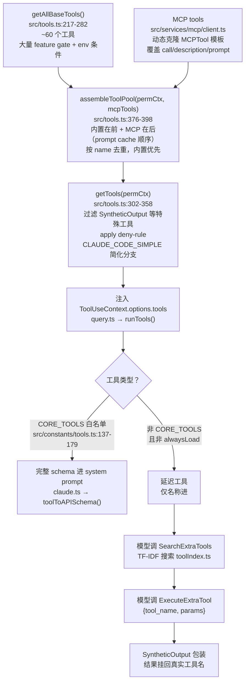
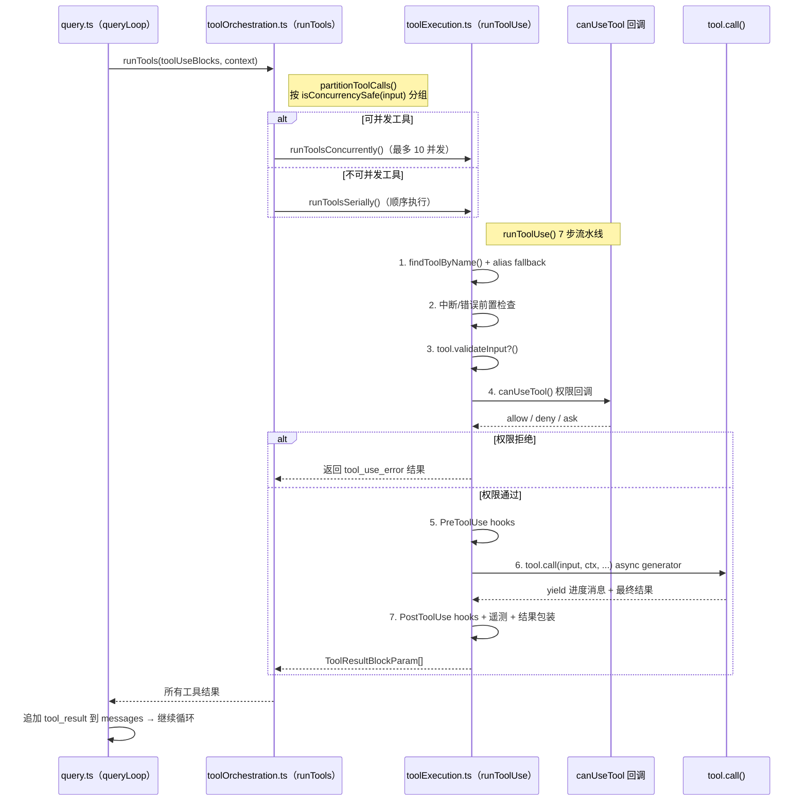

# 工具系统知识总结

> 这是"总结学习"栏目的第三篇。目标：深入理解 Claude Code 的**工具系统**——从 `Tool` 接口定义到注册表组装、执行流水线、延迟工具机制和 MCP 接入的完整架构。工具系统是模型能力的"边界面"，也是核心循环中 `runTools()` 之后实际发生的一切。

> 📖 **逐个工具深入**：本篇是全局架构。想看 59 个内置工具的**逐个详细拆解**（每个工具 9 章节学习报告），请前往 [内置工具学习手册（书签总览）](./tools/index.mdx)——按分类一键跳转，含推荐学习顺序与复杂度标记。建议先读本篇建立全局心智，再按手册逐个深入。

---

## 一、工具系统全貌

### 架构总览



### 单工具执行时序



---

## 二、必须掌握（核心 6 点）

### 1. `Tool` 接口的关键字段（`src/Tool.ts:383-716`）

`Tool<Input, Output, P>` 是整个工具系统的单一真相来源，字段可分为四类：

**标识字段**
| 字段 | 说明 |
|---|---|
| `name` | 工具名（唯一键），如 `"Bash"` |
| `aliases` | 别名数组，`findToolByName` 的 fallback |
| `userFacingName` | UI 显示名，可带格式（如函数名后缀） |
| `searchHint` | TF-IDF 索引的额外关键词，权重 2.5 |

**行为字段**
| 字段 | 说明 |
|---|---|
| `call(input, ctx, canUseTool, parentMsg, onProgress)` | 工具的核心逻辑，**async generator**，yield 进度 |
| `validateInput?(input, ctx)` | 可选的输入校验（第 3 步） |
| `checkPermissions(input, ctx)` | 工具自身的权限规则（在 canUseTool 中被调用）|
| `isConcurrencySafe(input)` | **函数而非布尔**，因为是否可并发取决于 input |
| `isReadOnly()` | 只读工具可被安全地多次并发 |
| `isDestructive` | 是否有破坏性（影响权限 UI 展示） |
| `interruptBehavior` | 中断时的行为（abort / complete-then-stop）|
| `shouldDefer` | 是否延迟到 SearchExtraTools 才暴露 |
| `alwaysLoad` | 即使不在 CORE_TOOLS 也强制进 system prompt |

**模型面字段**
| 字段 | 说明 |
|---|---|
| `description()` | 工具描述（进 API tool schema）|
| `prompt()` | 系统 prompt 片段（工具规则/例子）|
| `inputSchema` | Zod 对象（内部使用）|
| `inputJSONSchema` | JSON Schema（MCP 工具使用）|
| `maxResultSizeChars` | 结果截断阈值 |

**工厂**
- `buildTool(def)` — `src/Tool.ts:804`，填充 `TOOL_DEFAULTS`（`src/Tool.ts:778`）：`isEnabled→true`、`isConcurrencySafe→false`、`isReadOnly→false`、`checkPermissions→{behavior:'allow'}`
- `findToolByName(tools, name)` — `src/Tool.ts:379`，先精确匹配，再按 `aliases` 匹配
- `toolMatchesName(tool, name)` — `src/Tool.ts:369`

### 2. `ToolUseContext` 是工具的"运行时背包"（`src/Tool.ts:160-321`）

每次 `runTools()` 调用时，`query.ts` 会构建并注入一个 `ToolUseContext`。工具的 `call()` 通过它访问所有跨工具共享状态：

```ts
// 关键字段（简化）
interface ToolUseContext {
  abortController: AbortController       // 中断信号
  fileStateCache: FileStateCache         // 文件读取缓存（undo/diff）
  options: { tools: Tool[]; model: string; ... }  // 当前工具列表 + 模型
  mcpClients: Map<string, MCPClient>     // MCP 客户端映射
  agentDefinitions: AgentDefinition[]    // 内置 Agent 定义
  langfuseTrace: LangfuseTrace | null    // 链路追踪
  permissionContext: ToolPermissionContext  // 权限上下文（mode + 规则）
  // ... 还有 onProgress、readFileState、sessionId 等
}
```

**理解要点**：`ToolUseContext` 本身不可变，但 `fileStateCache` 等内部状态是可变的——工具通过这个"背包"读取当前会话全局的文件状态，并把副作用写回去。

### 3. 注册表组装流程（`src/tools.ts`）

工具在运行时通过三层函数组装：

**第一层：`getAllBaseTools()`（`tools.ts:217-282`）**

返回所有已启用的内置工具列表。~60 个工具，条件加载：
- `import` 方式（90%）：直接导入，正常条件判断
- **`require()` 方式（20+个）**：用于 bundle 时死代码消除——Bun 编译器能消除 `require()` 后面的代码，`import` 则不能

```ts
// require() 的典型模式（tools.ts:14-159）
const REPLTool = feature('REPL_TOOL') ? require('./tools/REPLTool').REPLTool : null
const cronTools = feature('CRON') ? require('./tools/cron').cronTools : []
```

条件维度：
- `feature('FLAG')` — Bun feature gate（最常见）
- `process.env.USER_TYPE === 'ant'` — Anthropic 内部工具
- `process.env.ENABLE_LSP_TOOL` — 环境变量
- `CLAUDE_CODE_VERIFY_PLAN`, `CLAUDE_CODE_SIMPLE` — 特殊模式

**第二层：`getTools(permissionContext)`（`tools.ts:302-358`）**

过滤和调整工具列表：
- 移除 `SyntheticOutput`、`ListMcpResources`、`ReadMcpResource` 等特殊内部工具
- 应用 deny-rule：`permissionContext.alwaysDenyRules` 中匹配的工具被移除
- `CLAUDE_CODE_SIMPLE=1` 时只保留 Bash/Read/Edit 三个工具

**第三层：`assembleToolPool(permCtx, mcpTools)`（`tools.ts:376-398`）**

```ts
// 伪代码
const builtin = getTools(permCtx)          // 已过滤的内置工具
const merged = [...builtin, ...mcpTools]   // 内置在前，MCP 在后
return dedup(merged)                        // 按 name 去重，内置优先
```

**内置在前、MCP 在后**是有意设计：保证 system prompt 中工具的排列顺序稳定，提升 prompt cache 命中率（API 端按 tools 数组内容 hash 作为 cache key 的一部分）。

### 4. CORE_TOOLS vs 延迟工具（`src/constants/tools.ts:137-179`）

这是工具系统最精妙的设计之一：

**为什么需要延迟工具？**
60+ 个工具如果全部把 schema 塞进 system prompt，将占用大量 token。`CORE_TOOLS` 白名单只保留 38 个核心工具的完整 schema，其余进入"延迟发现"模式。

**CORE_TOOLS 白名单（38 个）**：Shell 工具（Bash、PowerShell）、文件操作（Read/Write/Edit/Glob/Grep）、Web（WebFetch/WebSearch）、Agent 系统（AgentTool/Task*）、规划（EnterPlanMode/ExitPlanMode）、工具发现三件套（SearchExtraTools/ExecuteExtraTool/SyntheticOutput）等。

**延迟工具调用路径**（两步式）：

```
模型看到 <available-deferred-tools>:
  - CronCreate: 创建定时任务
  - MonitorTool: 监控后台进程
  - WebBrowserTool: 控制浏览器
  ...

1. 模型调用 SearchExtraTools(query="browser control")
   ↓ TF-IDF 搜索 → 返回 WebBrowserTool 的完整 schema

2. 模型调用 ExecuteExtraTool({tool_name: "WebBrowser", params: {...}})
   ↓ 内部解包 → 真正执行 WebBrowserTool.call()
   ↓ SyntheticOutput 把结果挂回 "WebBrowser" 的 tool_use_id

模型 transcript 里看到的是 WebBrowser 调用，不是 ExecuteExtraTool
```

**`isDeferredTool(tool, coreTools)`**：`packages/builtin-tools/src/tools/SearchExtraToolsTool/prompt.ts:63-76` — 判断逻辑：不在 CORE_TOOLS 且 `!tool.alwaysLoad`。

### 5. 工具执行的 7 步流水线（`src/services/tools/toolExecution.ts:runToolUse():391+`）

文件头部有中文注释（line 370-389）完整说明，这里是每步的关键细节：

```
步骤 1：findToolByName(ctx.options.tools, toolName)
        失败 → alias fallback 到 getAllBaseTools()
        仍失败 → emit tool_use_error（"未知工具"）

步骤 2：中断/错误前置检查
        abortController.signal.aborted → 直接 emit abort error
        这是整个流水线的"快速出口"，避免权限/调用被执行

步骤 3：tool.validateInput?(input, ctx)
        部分工具（如 FileEditTool）在这里验证文件路径是否可达
        返回 ToolValidationError → emit tool_use_error（不需要权限）

步骤 4：canUseTool(tool, input, ctx, assistantMessage, toolUseId)
        ★ 权限系统的唯一入口
        返回 { behavior: 'allow' } → 继续
        返回 { behavior: 'deny', message } → emit rejection tool_result
        返回 { behavior: 'ask' } → 暂停等待用户（REPL 弹窗）

步骤 5：PreToolUse hooks（settings.json 中配置的 shell 脚本）
        用户可在任意工具调用前执行自定义逻辑

步骤 6：tool.call(input, ctx, canUseTool, parentMessage, onProgress)
        ★ 工具的核心逻辑，async generator
        yield 进度消息（如 "Reading file..."）
        最后 yield 最终结果
        中途可再次调用 canUseTool（如 BashTool 判断 sed 时）

步骤 7：PostToolUse hooks + 遥测
        用户 PostToolUse hook → 可修改工具结果
        Langfuse span 结束
        analytics 事件（工具名、执行时长、is_error）
        OTel trace span
        → 包装为 ToolResultBlockParam { type:'tool_result', tool_use_id, content, is_error }
```

### 6. 并行 / 串行 / 流式三种执行模式

**`toolOrchestration.ts`** 的 `runTools()` 编排入口：

```ts
// partitionToolCalls() 的分组逻辑
const [concurrent, serial] = partition(
  toolUseBlocks,
  (block) => findTool(block.name)?.isConcurrencySafe(block.input) ?? false
)

// 并发执行（默认上限 10）
await runToolsConcurrently(concurrent, ctx, canUseTool)
// 串行执行（等并发批完成后）
await runToolsSerially(serial, ctx, canUseTool)
```

**为什么 `isConcurrencySafe` 是函数？** 因为是否可并发取决于 input。例如 FileReadTool 读不同文件可并发，但 BashTool 执行 `rm -rf` 就不该并发——工具需要检查 input 内容才能判断。

**`contextModifier`**：某些工具调用会修改 `ToolUseContext`（如更新 fileStateCache）。并发批中所有工具的 contextModifier 被收集，在整批完成后**统一应用**，避免并发写冲突。

**`StreamingToolExecutor`**（`src/services/tools/StreamingToolExecutor.ts:42`）：
- 不等 API 响应全部流完就开始执行工具
- 流到一个完整的 `tool_use` block → 立即开始执行（若可并发）
- 结果按原始 tool_use 顺序缓冲后再 yield（保证 transcript 顺序一致）
- 非并发安全工具：等待独占锁（前一个完成才开始下一个）
- `discard()` 方法（line 73）：当 API 返回重试时清理已开始的执行

---

## 三、应该了解（次要 5 点）

### 1. 三个代表性工具的文件结构

读懂这三个，就能按图索骥读任意工具：

**`BashTool/`（最复杂，带完整安全/权限子系统）**
```
BashTool.tsx          ← buildTool({...}) 主体 + call() 实现
prompt.ts             ← system prompt 片段 + 工具名常量 BASH_TOOL_NAME
bashPermissions.ts    ← BashTool 的 checkPermissions() 逻辑
bashSecurity.ts       ← 安全检查（禁止的命令模式）
shouldUseSandbox.ts   ← 判断是否走 sandbox 执行
sedValidation.ts      ← sed 命令格式校验
commandSemantics.ts   ← 命令语义分析（是否只读/破坏性）
destructiveWarning.tsx ← 破坏性命令 UI 警告
BashToolResultMessage.tsx ← 结果渲染组件
UI.tsx                ← 工具执行进度 UI
__tests__/            ← 单元测试
```

**`FileEditTool/`（最标准，代表典型工具结构）**
```
FileEditTool.ts       ← buildTool({...}) 主体
constants.ts          ← 常量（如 MAX_FILE_SIZE）
prompt.ts             ← system prompt 片段
types.ts              ← 类型定义
utils.ts              ← 工具函数
UI.tsx                ← diff 显示组件
src/                  ← 内部实现子模块
__tests__/            ← 测试
```

**`AgentTool/`（递归载具，最复杂的 Agent 子系统入口）**
```
AgentTool.tsx         ← buildTool({...}) 主体，call() 委托给 runAgent
runAgent.ts           ← 子代理主循环（递归复用 query() + 工具系统）
resumeAgent.ts        ← 恢复已暂停的子代理
forkSubagent.ts       ← 派生子代理（FORK_SUBAGENT feature）
loadAgentsDir.ts      ← 加载 .claude/agents/ 目录中的自定义代理定义
builtInAgents.ts      ← 内置代理（Explore、Plan、code-reviewer 等）
agentMemory.ts        ← 子代理的 memory 读写
agentMemorySnapshot.ts ← memory 快照
agentColorManager.ts  ← 多代理颜色分配（终端显示）
agentDisplay.ts       ← 代理进度显示
UI.tsx                ← 代理执行 UI 组件
__tests__/
```

**共通模板规律**：
- `<Name>Tool.ts(x)` — 导出 `buildTool({...})` 的结果
- `prompt.ts` — 工具名常量（`export const BASH_TOOL_NAME = "Bash"`）+ system prompt 片段函数
- `constants.ts` — 数值/字符串常量
- `UI.tsx` — Ink 终端渲染组件（可选）
- `__tests__/` — `bun:test` 单元测试

### 2. TF-IDF 工具索引（`src/services/searchExtraTools/toolIndex.ts`）

延迟工具的"被搜索"能力靠这里：

**字段权重**（`TOOL_FIELD_WEIGHT` line 33）：
- `name`：3.0（工具名匹配最重要）
- `searchHint`：2.5（工具自定义的额外关键词）
- `description`：1.0（描述文本）

**算法**：复用 `src/services/skillSearch/localSearch.ts` 的：
- `computeWeightedTf()` — 加权词频
- `computeIdf()` — 逆文档频率
- `cosineSimilarity()` — 余弦相似度

**`parseToolName()`**（line 51）：把 `WebBrowserTool`（camelCase）和 `mcp__server__tool_name`（下划线分隔）都归一化为可检索的 token，确保工具名自身就是高质量的搜索 key。

**CJK 回退**（line 43-49）：对中文/日文/韩文 query 用字符级 n-gram 分割，因为这些语言没有空格分词。

**预取**（`prefetch.ts`）：每次用户提交新消息，`extractQueryFromMessages` 提取最新 query 文本，立即跑工具索引搜索。结果通过 `useSyncExternalStore` 暴露给 React 组件，模型调 `SearchExtraTools` 时通常已有缓存结果。

### 3. MCP 工具如何"伪装"成内置 Tool

MCP 工具与内置工具对外完全一致——都是 `Tool` 接口实例，走同一个 `runToolUse` 流水线。差异在于初始化方式：

**模板**（`packages/builtin-tools/src/tools/MCPTool/MCPTool.ts`）：
- `isMcp: true` 标记
- `inputSchema = z.object({}).passthrough()`（MCP 工具 schema 运行时动态注入）
- `checkPermissions` 返回 `{ behavior: 'passthrough' }`（让上层权限系统处理）
- `call`/`description`/`prompt`/`userFacingName` 都是 **stub**，由 `client.ts` 覆盖

**动态注册**（`src/services/mcp/client.ts`）：
- `setupSdkMcpClients()` (`line 3367`)：连接 MCP server，拿到 tool descriptor 列表
- `getMcpToolsCommandsAndResources()` (`line 2238`)：把 descriptor 转为 `Tool` 对象（克隆模板 + 覆盖字段）
- `callMCPToolWithUrlElicitationRetry()` (`line 2893`)：工具调用时如需 OAuth 授权会自动重试

**合并**（`src/hooks/useMergedTools.ts:21-38`）：
```ts
const mergedTools = assembleToolPool(permCtx, mcpTools)
// 内置在前（stable）+ MCP 在后（stable）→ prompt cache 命中率最大化
```

### 4. 延迟工具的三件套

| 工具 | 文件 | 作用 |
|---|---|---|
| `SearchExtraTools` | `SearchExtraToolsTool/` | 模型调用，用自然语言 query 搜索延迟工具，返回匹配工具的完整 schema |
| `ExecuteExtraTool` | `ExecuteTool/` | 模型调用，`{tool_name, params}` → 内部解包调用真实工具 |
| `SyntheticOutput` | `SyntheticOutputTool/` | 内部使用，不暴露给模型；让 ExecuteExtraTool 的结果在 transcript 中显示为真实工具名的 `tool_result` |

三件套都在 `CORE_TOOLS` 白名单中，但只有前两个对模型可见（`getTools()` 过滤掉 `SyntheticOutput`）。

### 5a. `packages/agent-tools/` vs `packages/builtin-tools/` 分包边界

两个 package 都通过 `@claude-code-best/*` 命名空间导出，但分工不同：

| 维度 | `builtin-tools/` | `agent-tools/` |
|---|---|---|
| 定位 | Claude Code 全部内置工具实现（~60 个） | Agent 子系统专用工具集 |
| 导出方式 | `@claude-code-best/builtin-tools` | `@claude-code-best/agent-tools` |
| 典型内容 | BashTool、FileEditTool、AgentTool、SearchExtraTools 等 | Agent 协作、swarm、任务分发相关工具 |
| 依赖关系 | 独立（不依赖 agent-tools） | 可能复用 builtin-tools 中的工具 |

**实际使用**：`src/tools.ts` 的 `getAllBaseTools()` 从 `builtin-tools` 导入；`agent-tools` 包主要在 Agent 模式（`COORDINATOR_MODE`、`FORK_SUBAGENT`）下被加载。修改内置工具时只改 `builtin-tools`；涉及 Agent 协作协议时关注 `agent-tools`。

### 5b. Hook 系统详细机制

PreToolUse / PostToolUse hooks 是工具系统对外暴露的**可编程扩展点**，配置在 `settings.json` 中：

```jsonc
// ~/.claude/settings.json
{
  "hooks": {
    "PreToolUse": [
      {
        "matcher": "Bash",           // 匹配工具名（支持通配符）
        "hooks": [
          {
            "type": "command",
            "command": "echo '[LOG] bash about to run'"
          }
        ]
      }
    ],
    "PostToolUse": [
      {
        "matcher": "*",              // 匹配所有工具
        "hooks": [{ "type": "command", "command": "/usr/local/bin/audit-tool-use.sh" }]
      }
    ]
  }
}
```

**执行时机**（对应 `runToolUse` 流水线）：
- **PreToolUse**：第 5 步（权限通过后、`tool.call()` 前）
- **PostToolUse**：第 7 步（`tool.call()` 返回后、结果包装前）

**PostToolUse 的特殊能力**：hook 脚本可以通过 stdout 输出 JSON 来**修改工具结果**：
```json
{ "type": "modify_result", "content": "替换后的工具结果文本" }
```

**Hook 执行上下文**：shell 脚本在用户 shell 中运行，环境变量包含：
- `CLAUDE_TOOL_NAME` — 当前工具名
- `CLAUDE_TOOL_INPUT` — 工具输入的 JSON 字符串
- `CLAUDE_TOOL_RESULT`（PostToolUse）— 工具输出 JSON

### 5c. 工具结果截断与错误类型

**`maxResultSizeChars` 截断**：每个工具可在 `buildTool` 时声明 `maxResultSizeChars`。`toolExecution.ts` 在步骤 7 中检查结果长度，超出则截断并附加 `[...truncated N chars]` 标记。目的是防止单次工具结果撑爆 context window。

**错误类型体系**（`toolExecution.ts` 内部）：

| 错误类型 | 触发位置 | 结果形式 |
|---|---|---|
| `ToolValidationError` | 步骤 3 `validateInput()` | `is_error: true` + 错误消息 |
| `ToolPermissionError` | 步骤 4 `canUseTool()` deny | `type: 'tool_result'` + rejection 文本 |
| `AbortError` | 步骤 2 中断检查 | `is_error: true` + abort 消息 |
| `UnknownToolError` | 步骤 1 找不到工具 | `is_error: true` + "未知工具名" |
| `tool_use_error`（通用） | 步骤 6 `tool.call()` throw | `is_error: true` + 异常堆栈/消息 |

所有错误最终都包装为 `ToolResultBlockParam`（`type: 'tool_result', is_error: true`），模型可读取错误信息并决定重试或修正。

### 5. 权限系统的接入面（导览）

权限系统的完整机制将在下一篇专题讲解，这里只建立最小认知：

**入口类型**（`src/hooks/useCanUseTool.tsx:37-44`）：
```ts
type CanUseToolFn = (
  tool: Tool,
  input: unknown,
  ctx: ToolPermissionContext,
  assistantMessage: AssistantMessage,
  toolUseId: string,
) => Promise<ToolPermissionResult>
```

**`useCanUseTool()` hook** 把 `tool.checkPermissions()` 串进 `hasPermissionsToUseTool()`（`src/utils/permissions/permissions.ts:68`），返回四种行为之一：

| behavior | 含义 | 后续行为 |
|---|---|---|
| `allow` | 直接通过 | 执行步骤 5+ |
| `deny` | 拒绝 | 返回 rejection tool_result，记录到 permissionDenials |
| `ask` | 暂停等用户确认 | 根据模式分发到 3 个 handler |
| `passthrough` | 让上层权限系统处理（MCP 工具用） | 走通用规则匹配 |

**三个 `ask` handler**：
- `interactiveHandler.ts` — REPL 交互模式：弹 `PermissionDialog`
- `coordinatorHandler.ts` — Coordinator 模式：把请求转发给 coordinator
- `swarmWorkerHandler.ts` — Swarm worker 模式：转发给主进程

**四种权限模式**（`src/utils/permissions/PermissionMode.ts:42-70`）：
- `default` — 默认，需要确认破坏性操作
- `plan` — 计划模式，只允许只读工具
- `acceptEdits` — 自动接受文件编辑，仍询问 Bash
- `bypassPermissions` — 跳过所有权限检查（沙箱/自动化场景）

---

## 四、可暂时跳过

- `StreamingToolExecutor` 的内部 buffer 和 yield-order 对齐算法
- 60+ 个工具的逐一实现细节——本篇只讲 BashTool / FileEditTool / AgentTool 三个代表；**全部 59 个工具的逐个详细拆解见 [内置工具学习手册](./tools/index.mdx)**
- `bashClassifier.ts` / `yoloClassifier.ts` 的分类器算法（auto-mode 自动批准路径）
- 各 `<Tool>PermissionRequest/` 组件的具体渲染逻辑
- MCP OAuth、`SdkControlTransport`、`InProcessTransport` 的协议层细节
- `agent-tools/` 与 `builtin-tools/` 的分包边界和 re-export 关系
- `TerminalCaptureTool`、`CtxInspectTool` 等调试专用工具

---

## 五、关键文件清单（必备书签）

| 文件 | 角色 | 必看行号 |
|---|---|---|
| `src/Tool.ts` | Tool 接口定义 | `Tool<>:383`、`buildTool():804`、`TOOL_DEFAULTS:778`、`ToolUseContext:160`、`checkPermissions():521` |
| `src/tools.ts` | 注册表组装 | `getAllBaseTools():217-282`、`getTools():302-358`、`assembleToolPool():376-398` |
| `src/constants/tools.ts` | CORE_TOOLS / agent disallowed 名单 | `CORE_TOOLS:137-179` |
| `src/services/tools/toolOrchestration.ts` | 分组 + 并行 + 串行编排 | `runTools():42-119`、`partitionToolCalls`、`runToolsConcurrently` / `runToolsSerially` |
| `src/services/tools/toolExecution.ts` | 单工具 7 步执行 | `runToolUse():391+`，注释 `370-389` |
| `src/services/tools/StreamingToolExecutor.ts` | 流式工具执行器 | `class:42`、`discard():73` |
| `src/services/searchExtraTools/toolIndex.ts` | TF-IDF 索引 | `TOOL_FIELD_WEIGHT:33`、`parseToolName():51` |
| `src/services/searchExtraTools/prefetch.ts` | 预取 + useSyncExternalStore | `extractQueryFromMessages` 复用链路 |
| `packages/builtin-tools/src/tools/SearchExtraToolsTool/prompt.ts` | 延迟工具判定 | `isDeferredTool():63-76` |
| `packages/builtin-tools/src/tools/MCPTool/MCPTool.ts` | MCP 工具模板 | 整文件，注意 `isMcp:true` 标记 |
| `src/services/mcp/client.ts` | MCP 工具动态注册 | `getMcpToolsCommandsAndResources():2238`、`setupSdkMcpClients():3367` |
| `src/hooks/useMergedTools.ts` | 内置 + MCP 合并 | `line 21-38` |
| `src/hooks/useCanUseTool.tsx` | 权限回调入口 | `CanUseToolFn:37-44`，`useCanUseTool():46+` |
| `packages/builtin-tools/src/tools/BashTool/` | 代表性工具（复杂，含安全/权限子模块） | `BashTool.tsx` + `bashPermissions.ts` + `bashSecurity.ts` |
| `packages/builtin-tools/src/tools/FileEditTool/` | 代表性工具（标准模板） | `FileEditTool.ts` + `constants.ts` + `UI.tsx` |
| `packages/builtin-tools/src/tools/AgentTool/` | 代表性工具（递归子代理入口） | `AgentTool.tsx` + `runAgent.ts` + `builtInAgents.ts` |

---

## 六、学习建议

**读代码顺序**：

1. **`src/Tool.ts:383-716`** — 把 `Tool` 接口字段快速扫一遍，画一张分类速查卡（标识 / 行为 / 模型面 / 渲染）
2. **`src/tools.ts`** — 重点看 `getAllBaseTools()` 的 feature gate 模式，理解 `import` vs `require()` 的差异
3. **`src/services/tools/toolExecution.ts:runToolUse()`** — 7 步走一遍，配合注释（line 370-389）阅读
4. **挑一个完整工具读通**：推荐 `FileEditTool`（最标准），或 `BashTool`（最复杂，值得对照看 `bashSecurity.ts` 和 `bashPermissions.ts`）
5. **`SearchExtraToolsTool/prompt.ts:isDeferredTool()` + `toolIndex.ts`** — 理解"先搜后调"两步式
6. **`MCPTool/MCPTool.ts` + `useMergedTools.ts:21-38`** — 理解 MCP 工具如何"伪装"成内置工具

**配合动作**：

1. 在 `runToolUse()` 的步骤 4（`canUseTool()`）前后加 `console.error` 日志，跑一次 `Bash` 命令，观察权限决策
2. 启用一个 MCP server，在 `assembleToolPool()` 结尾 console 输出工具名列表，验证内置在前 MCP 在后
3. 设置 `CLAUDE_CODE_SIMPLE=1` 启动，验证只剩 Bash/Read/Edit 三个工具
4. 关掉 `FEATURE_KAIROS=1`，对比 `getAllBaseTools()` 返回的工具数量变化
5. 触发一次延迟工具调用（问 Claude "帮我截个屏"），在 `ExecuteTool` 的 `call()` 打断点，观察 `SearchExtraTools → ExecuteExtraTool → SyntheticOutput` 完整链路

**调试技巧**：

- `CLAUDE_CODE_DEBUG=1` — 启用详细工具日志
- `DEBUG_TOOL_USE=1` — 某些构建中有工具级调试输出
- 查看 `~/.claude/logs/` 下的最新日志，工具调用每步都有记录

---

## 七、与前序知识的衔接

| 前序知识（前两篇） | 工具系统的对应 |
|---|---|
| `core-loop` 中 `runTools(toolUseBlocks, context)` 调用 | 进入 `toolOrchestration.ts` 的 `runTools` → `partitionToolCalls` → 7 步流水线 |
| `claude.ts` 把 `tools` 转成 SDK `ToolUnion`（`toolToAPISchema()`） | tools 来自 `assembleToolPool(permCtx, mcpTools)` 的输出 |
| `fetchSystemPromptParts()` 构建 system prompt | CORE_TOOLS 的完整 schema 在这里被插入；延迟工具走 `<available-deferred-tools>` 块 |
| `QueryEngine.permissionDenials` 记录权限拒绝 | `runToolUse` 第 4 步 `canUseTool` deny 时写入 |
| `ToolUseContext.fileStateCache` 跨工具共享文件状态 | `FileReadTool` / `FileEditTool` 通过它实现 undo/diff 基础 |
| `AppState.tools` / `useMergedTools` | 把 `getAllBaseTools()` + MCP tools 合并后供 REPL/QueryEngine 消费 |
| `query.ts` 的 `queryLoop()` 内 `for-await tool results` | 工具结果由 `runTools` 返回，追加为下一条 `user` 消息的 `tool_result` block |

**关键理解**：核心循环讲的是"每一轮次的形状"（API调用 → 工具执行 → 循环），工具系统讲的是"每次工具执行内部发生的 7 步"。两者合起来，你才有完整的从用户输入到工具调用到结果回传的全链路心智模型。

---

## 八、验证清单（学完后自测）

- [ ] 能不查文档画出 `Tool` 接口的 4 类字段（标识 / 行为 / 模型面 / 渲染）
- [ ] 能解释为什么 `assembleToolPool` 排序时内置在前 MCP 在后（答：prompt cache 命中率）
- [ ] 能说出 `runToolUse` 7 步的顺序，并指出 `canUseTool` 在第 4 步
- [ ] 能用一句话讲清"延迟工具"的三件套（Search → Execute → Synthetic）
- [ ] 能解释 `isConcurrencySafe` 为什么是函数而非布尔字段
- [ ] 能从 `FileEditTool/FileEditTool.ts` 找到 `call()` 入口，指出它处于 7 步的第 6 步
- [ ] 能讲清 `MCPTool` 模板如何被 `client.ts` 克隆并改写（stub → 运行时覆盖）
- [ ] 能说出 CORE_TOOLS 白名单的作用（控制 system prompt 体积 + 长尾工具延迟发现）

---

## 九、后续学习路线

| 篇序 | 主题 | 核心文件 |
|---|---|---|
| **第四篇** | 权限系统专题 | `src/utils/permissions/permissions.ts`、`PermissionMode.ts`、`bashClassifier.ts`、`components/permissions/` |
| **第五篇** | MCP 集成 | `src/services/mcp/client.ts`、`MCPConnectionManager.tsx`、`auth.ts`、`normalization.ts` |
| **第六篇** | 上下文构建与压缩 | `src/utils/queryContext.ts`、`services/compact/autoCompact.ts`、`utils/claudemd.ts`、`memdir/` |
| **第七篇** | Agent 子系统 | `AgentTool/runAgent.ts`、`builtInAgents.ts`、`agentMemory.ts`、`acp/agent.ts` |
| **第八篇** | 多 Provider 兼容层 | `services/api/openai/`、`services/api/gemini/`、`services/api/grok/` |
