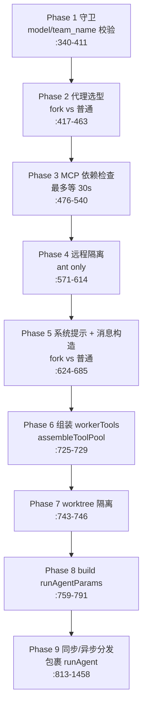
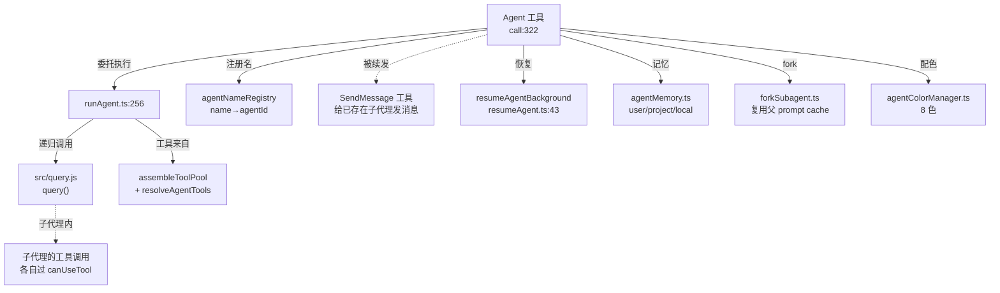

# Agent 工具详解

> 这是工具系统逐个拆解系列中**最复杂**的一篇。`Agent` 不是"调用一个函数"型工具，而是"启动一个完整的子 Claude 会话"。它的 `call()` 本身只做选型与调度，真正的执行委托给 `runAgent()`——而 `runAgent()` 内部**递归调用了主循环的 `query()`**。所以每一个子代理都是一个缩小版的 Claude Code：有自己的 system prompt、自己的工具集、自己的权限上下文、自己的对话历史。理解了 Agent 工具，就理解了 Claude Code 如何把"单轮 CLI"扩展成"多代理协作系统"。

---

## 一、工具定位（一句话总结）

**`Agent` = 递归启动一个子 Claude 会话（子代理），让它独立完成一个子任务后返回结果。**

| 维度 | 值 |
|---|---|
| 工具名 | `Agent`（常量 `AGENT_TOOL_NAME`，`constants.ts:1`）；旧名 `Task`（`LEGACY_AGENT_TOOL_NAME`，`constants.ts:3`）作为 alias |
| 一句话 | 把一段工作委托给一个独立的子代理（subagent）去跑，主循环得到它的最终结论 |
| 是否进 system prompt | ✅ 在 `CORE_TOOLS` 白名单内（`src/constants/tools.ts:147`），核心工具，schema 完整注入 |
| 只读 / 破坏性 | **`isReadOnly() → true`**（`AgentTool.tsx:1468`）——工具本身不改文件，破坏性由子代理内部的具体工具各自承担 |
| 是否可并发 | ✅ `isConcurrencySafe() → true`（`AgentTool.tsx:1469`）——多个 Agent 调用可并发执行 |
| 注册位置 | `src/tools.ts:221`（`getAllBaseTools()`），**注册本身没有 feature() gate**，Agent 永远加载；COORDINATOR_MODE 下额外加入 simple-tools（`tools.ts:337`） |
| 核心依赖 | `runAgent.ts`（执行器）→ `src/query.js` 的 `query()`（真正的大模型对话循环） |
| 定位互补方 | `SendMessage`（给**已存在**的子代理续发消息，而非新建） |

**为什么需要它？** 模型在处理"需要扫很多文件才能下结论""需要多步骤试错""有独立上下文会更好"的任务时，如果全在主对话里做，会污染主上下文、超出 token 预算、也无法并发。`Agent` 把这类工作隔离到一个子代理里——子代理跑完只把结论（和它用了多少 token）汇报回来，主对话保持干净。这是 Claude Code 从"单线程助手"升级为"可调度代理树"的关键。

---

## 二、关键文件清单

AgentTool 是整个工具系统里**文件最多**的工具（17 个真实源码文件，另有若干测试和文档桩）。

```
AgentTool/
├── AgentTool.tsx              ← buildTool 主体（~1612 行）：schema + call() + 权限 + 结果映射
├── runAgent.ts                ← 子代理执行器（~961 行）：async generator，内部调用 query()
├── resumeAgent.ts             ← resumeAgentBackground()：按 agentId 恢复已停止的子代理
├── forkSubagent.ts            ← Fork 实验：FORK_AGENT 定义 + 构造 fork 上下文消息
├── loadAgentsDir.ts           ← AgentDefinition 类型 + 从 agents/ 目录加载自定义代理
├── builtInAgents.ts           ← getBuiltInAgents()：内置代理注册表
├── built-in/                  ← 6 个内置代理定义
│   ├── generalPurposeAgent.ts
│   ├── exploreAgent.ts
│   ├── planAgent.ts
│   ├── claudeCodeGuideAgent.ts
│   ├── verificationAgent.ts   ← feature('VERIFICATION_AGENT') gate
│   └── statuslineSetup.ts
├── agentToolUtils.ts          ← resolveAgentTools / filterToolsForAgent / runAsyncAgentLifecycle
├── agentMemory.ts             ← 子代理持久化记忆目录（user/project/local 三种 scope）
├── agentMemorySnapshot.ts     ← project→local 记忆快照初始化
├── agentColorManager.ts       ← 子代理终端配色（8 色）
├── agentDisplay.ts            ← /agents 命令的展示辅助
├── filterIncompleteToolCalls.ts ← 过滤孤儿 tool_use/tool_result（fork 前清理上下文）
├── prompt.ts                  ← getPrompt()：注入 system prompt 的代理列表说明
├── constants.ts               ← AGENT_TOOL_NAME 等常量
└── UI.tsx                     ← Ink 渲染（~1005 行）
```

| 文件 | 角色 | 必看行号 |
|---|---|---|
| `AgentTool.tsx` | 工具主体：所有 `buildTool` 字段、`call()` 九阶段流程 | `buildTool:309`、`call:322`、`checkPermissions:1477`、`isReadOnly:1468`、`mapToolResultToToolResultBlockParam:1493` |
| `runAgent.ts` | **子代理如何真正运行**——async generator 包裹 `query()` | `runAgent:256`、`query() 调用:777`、清理 finally:845 |
| `builtInAgents.ts` | 内置代理注册 | `getBuiltInAgents:20` |
| `loadAgentsDir.ts` | 代理定义类型 + 加载/合并/去重 | `AgentDefinition 类型:162`、`BaseAgentDefinition:106`、`getAgentDefinitionsWithOverrides:294` |
| `resumeAgent.ts` | 恢复机制 | `resumeAgentBackground:43` |
| `forkSubagent.ts` | Fork 实验 | `isForkSubagentEnabled:31`、`FORK_AGENT:59`、`buildForkedMessages:106` |
| `constants.ts` | 工具名 + 一次性代理集合 | `:1,3,9` |

> **结构特点**：AgentTool 是"多文件协作型"——主体只做调度，真正的执行、工具过滤、记忆、配色、fork、恢复都拆到独立模块。这是因为它的复杂度远超单文件能承载，必须分领域解耦。注意 `built-in/src/**` 下的文件是**反编译残留的文档桩**（每文件 2 行 `export type` + JSDoc），并非可执行源码——真正的 import 走 `@claude-code-best/builtin-tools` workspace 包。

---

## 三、Tool 接口字段实现（`buildTool` 逐字段）

### 标识字段

```ts
name: AGENT_TOOL_NAME,                 // "Agent"（AgentTool.tsx:309）
aliases: [LEGACY_AGENT_TOOL_NAME],     // ["Task"]——旧名，权限规则/hooks/会话恢复兼容（:311）
searchHint: 'delegate work to a subagent',  // TF-IDF 索引关键词（:310）
maxResultSizeChars: 100_000,           // 结果截断阈值（:312）
userFacingName,                        // 来自 UI.tsx 的显示名
userFacingNameBackgroundColor,         // 子代理配色背景
```

> **`aliases: ['Task']`** 是关键设计：早期版本工具叫 `Task`，用户的权限规则、hooks 配置、保存的会话里都写的是 `Task`。通过 alias，升级后这些配置无需迁移依然生效。`toolMatchesName` 会把 `Task` 解析到 Agent 工具。

### 模型面字段

```ts
async description() { return '启动一个新代理' }   // AgentTool.tsx:313
async prompt({ tools, appState, toolPermissionContext }) {
  // 收集 MCP 服务器名 → filterAgentsByMcpRequirements → filterDeniedAgents → getPrompt(...)
  return await getPrompt(filteredAgents, isCoordinator, allowedAgentTypes)   // :307
}
get inputSchema()  { return inputSchema() }   // getter，懒加载（:316）
get outputSchema() { return outputSchema() }  // 输出 schema（:319）
```

**输入 schema**（`AgentTool.tsx:137-206`，`lazySchema` + 动态字段）：
```ts
{
  description: string,          // 必填，给用户看的一句话（也用于 /agents 列表）
  prompt: string,               // 必填，交给子代理的指令
  subagent_type?: string,       // 代理类型，如 "Explore" / "general-purpose" / 自定义代理名
  model?: 'sonnet'|'opus'|'haiku',
  run_in_background?: boolean,  // 后台异步运行（受 CLAUDE_CODE_DISABLE_BACKGROUND_TASKS / fork 抑制）
  // 多代理团队字段（需 isAgentSwarmsEnabled）：
  name?: string,                // 队友名
  team_name?: string,
  mode?: PermissionMode,        // spawn 时的权限模式
  isolation?: 'worktree'|'remote',  // ant 构建额外支持 'remote'
  cwd?: string,                 // KAIROS gate
}
```

**输出 schema**（`:221-241`）是 **union**：
```ts
{ status: 'completed', prompt, ...agentToolResultSchema }      // 同步完成
| { status: 'async_launched', agentId, description, prompt, outputFile, canReadOutputFile? }  // 异步启动
```
另有 `TeammateSpawnedOutput`（`:246`）和 `RemoteLaunchedOutput`（`:268`）是**内部专用**的输出形态，从导出 schema 中剔除以利死代码消除（DCE）。

### 行为字段

| 字段 | 实现 | 说明 |
|---|---|---|
| `call()` | `AgentTool.tsx:322-1459` | 九阶段调度（见下节），主体不直接跑模型 |
| `checkPermissions()` | `:1477` | 默认 `allow`；仅 `auto` 模式（ant）走 `passthrough` 分类器 |
| `validateInput()` | （schema 层） | 主要靠 Zod；团队/team_name 的合法性在 `call()` 内抛错 |
| `isReadOnly()` | `:1468` → `true` | Agent 工具本身无副作用，子代理内部工具各自过权限 |
| `isConcurrencySafe()` | `:1469` → `true` | 多个 Agent 可并发 |
| `getActivityDescription()` | `:1474` | `input.description ?? 'Running task'` |
| `toAutoClassifierInput()` | `:1463` | `(subagent_type, mode, prompt)` 标签 |
| `mapToolResultToToolResultBlockParam()` | `:1493-1595` | 把四种输出形态翻译成模型可读文本 |

### `mapToolResultToToolResultBlockParam` 的 token 优化（`:1571-1577`）

对 **一次性代理**（`ONE_SHOT_BUILTIN_AGENT_TYPES = {'Explore','Plan'}`，`constants.ts:9`），结果文本里**省略** `agentId`、SendMessage 提示、`<usage>` 尾部——注释明说这能省下"约 135 字符 × 每周 3400 万次 Explore 运行"。这是把高频路径的每一点 token 都抠到极致的典型例子。

---

## 四、核心执行流程：`call()`（九阶段）

`AgentTool.tsx:322-1459` 是全工具系统最长的 `call()`。它本身**不调用大模型**，而是选好代理、搭好上下文，然后把执行委托给 `runAgent()`。整体分九个阶段：



### 各阶段要点

**Phase 1 — 守卫（`:340-411`）**
- `model` 在 coordinator 模式下强制 `undefined`（`:345`）。
- `team_name` 必须 `isAgentSwarmsEnabled()`（`:355`），否则抛 `"Agent Teams is not yet available on your plan."`。
- **多代理 spawn 分支**（`:378-411`）：若 `teamName && name` → 调 `spawnTeammate(...)` 走 tmux/分屏队友路径，返回 `TeammateSpawnedOutput`，**提前 return**。

**Phase 2 — 代理选型（`:417-463`）**
```ts
const effectiveType = subagent_type ?? (isForkSubagentEnabled() ? undefined : GENERAL_PURPOSE_AGENT.agentType)
const isForkPath = effectiveType === undefined
```
- **Fork 路径**：递归守卫（`querySource === 'agent:builtin:fork'` 或 `isInForkChild(messages)`），通过后 `selectedAgent = FORK_AGENT`。
- **普通路径**：`filterDeniedAgents(activeAgents)`，并支持 `Agent(x,y)` 语法限制 `allowedAgentTypes`。被 deny 时抛错并附上 deny-rule 来源；找不到时列出现有可用类型。

**Phase 3 — MCP 依赖检查（`:476-540`）**
代理若声明了 `requiredMcpServers`，最多等 30 秒 pending MCP，再确认这些服务器确有工具，否则报错。

**Phase 4 — 远程隔离（`:571-614`，ant only）**
`effectiveIsolation === 'remote'` → `teleportToRemote()` + `registerRemoteAgentTask()`，返回 `RemoteLaunchedOutput`。外部构建因 `USER_TYPE !== 'ant'` 走死代码消除。

**Phase 5 — 系统提示 + 消息构造（`:624-685`）**
- Fork：`forkParentSystemPrompt = toolUseContext.renderedSystemPrompt`（**逐字节复用**父提示以命中 prompt cache）；`promptMessages = buildForkedMessages(prompt, assistantMessage)`。
- 普通：`enhancedSystemPrompt = enhanceSystemPromptWithEnvDetails([agent.getSystemPrompt({toolUseContext})], ...)`；`promptMessages = [createUserMessage({content: prompt})]`。

**Phase 6 — 组装 worker 工具（`:725-729`）**
```ts
const workerPermissionContext = { ...appState.toolPermissionContext, mode: selectedAgent.permissionMode ?? 'acceptEdits' }
const workerTools = assembleToolPool(workerPermissionContext, appState.mcp.tools)
```
> **为什么在 AgentTool 而非 runAgent 里算？** 注释明说是"为了避开与 `tools.ts` 的循环依赖"——`assembleToolPool` 依赖 `tools.ts`，而 `runAgent` 已经被 `query.ts` 依赖，把这一步挪进来会成环。

**Phase 7 — worktree 隔离（`:743-746`）**
`effectiveIsolation === 'worktree'` → `createAgentWorktree(slug)`，子代理在独立 git worktree 里跑，改动与主仓库隔离。

**Phase 8 — 构造 runAgentParams（`:759-791`）**
Fork 路径塞 `override.systemPrompt = forkParentSystemPrompt`、`availableTools = filterParentToolsForFork(...)`、`forkContextMessages = toolUseContext.messages`、`useExactTools: true`。普通路径塞增强后的系统提示（除非 worktree/cwd override 生效）。

**Phase 9 — 同步/异步分发（`:813-1458`）**
`shouldRunAsync` = `run_in_background || selectedAgent.background || isCoordinator || forceAsync(fork) || assistantForceAsync(KAIROS) || proactiveActive`，且未被禁用。

- **异步启动**（`:831-914`）：`registerAsyncAgent` → 把 `name→agentId` 写进 `agentNameRegistry` → `void runWithAgentContext(...runAsyncAgentLifecycle({ makeStream: runAgent(...) }))` → **立即返回** `{ status:'async_launched', agentId, outputFile, ... }`。
- **同步 + 可后台化**（`:915-1457`）：创建 `syncAgentId`，包 `runWithAgentContext` + `wrapWithCwd`，从 `runAgent(...)` 拿 async iterator，循环里把 `agentIterator.next()` 和 `backgroundPromise`（来自 `registerAgentForeground` 的 `autoBackgroundMs`）赛跑：
  - 后台信号触发 → 分离进后台闭包重跑 `runAgent({isAsync:true})`，返回 `async_launched`。
  - 正常完成 → `finalizeAgentTool()` + 可选 `classifyHandoffIfNeeded`（TRANSCRIPT_CLASSIFIER），返回 `{ status:'completed', prompt, ...agentResult, ...worktreeResult }`。
  - `finally` 清理前台任务、skills、dumpState、worktree。

### `runAgent()` 才是真正跑模型的地方（`runAgent.ts:256-891`）

`call()` 把一切搭好后调 `runAgent()`，后者是一个 **async generator**，内部在 `:777` **递归调用主循环的 `query()`**：

```ts
for await (const message of query({
  messages: initialMessages,
  systemPrompt: agentSystemPrompt,
  userContext: resolvedUserContext,
  systemContext: resolvedSystemContext,
  canUseTool,
  toolUseContext: agentToolUseContext,
  querySource,
  maxTurns: maxTurns ?? agentDefinition.maxTurns,
})) { ... }
```

> 这是整个 Agent 系统的**核心洞察**：子代理不是一个特殊的执行器，它就是**又一次 `query()` 调用**——和主对话用的是同一套核心循环。区别只在传给它的 `systemPrompt`、`tools`、`userContext`、`maxTurns` 不同。这种"递归复用主循环"的设计，让子代理自动继承了流式、工具调用、权限、中断等所有能力，零额外代码。

`runAgent()` 在调 `query()` 之前还做了大量准备（`runAgent.ts` 内）：
1. 模型解析（`:347`）、agentId 生成（`:354`）。
2. **Fork 上下文过滤**（`:377`）：`filterIncompleteToolCalls(forkContextMessages)` 去掉孤儿 tool_use/tool_result。
3. **上下文裁剪**（`:392-417`）：Explore/Plan 和 `omitClaudeMd` 代理**丢掉 `claudeMd`**（注释称省 ~5-15 Gtok/周）；Explore/Plan 还丢 `gitStatus`。
4. **权限模式覆盖**（`:419-505`）：`agentGetAppState()` 应用代理的 `permissionMode`，async 代理设 `shouldAvoidPermissionPrompts`，把 `allowedTools` 作为 session 规则。
5. **工具解析**（`:507`）：`useExactTools ? availableTools : resolveAgentTools(...)`。
6. **系统提示**（`:515`）：fork 用 override，普通用 `getAgentSystemPrompt()`。
7. **AbortController**（`:531`）：override/async → 新建不联动；同步 → 复用父级（父中断子也中断）。
8. **SubagentStart hooks**（`:538`）、**frontmatter hooks 注册**（`:570`，把 Stop→SubagentStop）、**skill 预加载**（`:584`）、**代理专属 MCP**（`:654`）。
9. **创建子代理上下文**（`:710`）：`createSubagentContext()`——同步共享父的 setAppState/abortController；async 完全隔离。
10. **录制**（`:745`）：`recordSidechainTranscript` + `writeAgentMetadata`（供 resume 用）。
11. **finally 清理**（`:845`）：endTrace、`mcpCleanup()`、`clearSessionHooks`、`killShellTasksForAgent`、`killMonitorMcpTasksForAgent` 等。

---

## 五、权限与安全

### `checkPermissions`（`AgentTool.tsx:1477-1492`）

```ts
async checkPermissions(input, context): Promise<PermissionResult> {
  const appState = context.getAppState()
  if (process.env.USER_TYPE === 'ant' && appState.toolPermissionContext.mode === 'auto') {
    return { behavior: 'passthrough', message: 'Agent tool requires permission to spawn sub-agents.' }
  }
  return { behavior: 'allow', updatedInput: input }
}
```

**关键设计**：除 `auto` 模式外，**生成子代理本身一律 `allow`**。为什么？因为 Agent 工具 `isReadOnly() → true`——它自己不改任何东西。真正的破坏性操作发生在子代理内部的具体工具（Edit/Write/Bash），**那些工具各自走 `canUseTool`**。这是"权限分层"的典范：每一层只对自己负责的动作鉴权，子代理的权限由子代理的工具各自承担。

`process.env.USER_TYPE === 'ant'` 守卫是**死代码消除开关**——外部构建编译时直接删掉 auto 分支。

### 子代理工具过滤（`agentToolUtils.ts`）

子代理拿到的工具是 `assembleToolPool(workerPermissionContext, appState.mcp.tools)` 再经 `resolveAgentTools()`（`:122-224`）过滤，依次套用：
- `ALL_AGENT_DISALLOWED_TOOLS`：所有子代理都禁的工具（防止递归失控）。
- `CUSTOM_AGENT_DISALLOWED_TOOLS`：特定代理额外禁的。
- `ASYNC_AGENT_ALLOWED_TOOLS`：后台代理的白名单。
- 代理自定义的 `disallowedTools`（如 Explore/Plan 禁 Agent/Edit/Write/NotebookEdit/ExitPlanMode）。

### Fork 递归守卫

`forkSubagent.ts` 的 `isInForkChild(messages)` 检测对话里是否已有 `<fork-boilerplate>` 标签——有就拒绝再次 fork，防止 fork 无限递归。

---

## 六、与其他系统/工具的关系



- **与 `query()` 的关系**：子代理 = 一次 `query()` 调用。这是整个设计的基石。
- **与 `SendMessage` 的关系**：`Agent` **创建**新子代理（一次性任务返回结果）；`SendMessage` **续发**消息给已存在的子代理（按 `agentNameRegistry` 的 name 查找，运行中则入队、已停止则 `resumeAgentBackground`）。两者互补，SendMessage 甚至直接 import `resumeAgentBackground` 复用恢复机制。
- **与 `assembleToolPool`/`tools.ts`**：子代理工具集来自这里，因循环依赖必须在 AgentTool.tsx 里算好再传给 runAgent。
- **与 hooks 系统**：`registerFrontmatterHooks(..., isAgent: true)` 把代理 frontmatter 里的 Stop hooks 改写成 SubagentStop。
- **与权限系统**：Agent 自己 `allow`，子代理内部工具各自鉴权——分层模型。
- **与记忆系统**：`agentMemory.ts` 给代理提供 user/project/local 三级持久化记忆目录，`agentMemorySnapshot.ts` 负责把 project 级快照初始化到 local。

---

## 七、亮点与设计取舍

1. **递归复用 `query()`**（`runAgent.ts:777`）：最核心的设计。子代理不是新引擎，而是带不同上下文的主引擎。这让流式、工具调用、权限、中断全部自动继承，是"用组合代替继承"的教科书案例。
2. **`isReadOnly() → true` 的权限分层**：Agent 自己不鉴权，把责任下推给子代理内部工具。避免了"生成代理要问一次、代理里每个工具又问一次"的双重提示。
3. **`aliases: ['Task']` 向后兼容**（`:311`）：旧名无缝迁移，权限/hooks/会话恢复都不破坏。
4. **一次性代理省 token**（`constants.ts:9` + `:1571`）：Explore/Plan 结果省掉 agentId/usage 尾部，注释量化了收益（~135 字符 × 每周 3400 万次）。
5. **Fork 的 prompt cache 共享**（`forkSubagent.ts`）：fork 逐字节复用父系统提示 + 把父的所有 tool_use 块克隆进子上下文，只为最后一段指令不同——让 fork 能命中父的 prompt cache，极大降低成本。
6. **上下文裁剪省 Gtok**（`runAgent.ts:392`）：Explore/Plan 丢 `claudeMd` 和 `gitStatus`，注释称每周省 5-15 Gtok。高频只读代理必须极致瘦身。
7. **同步可后台化**（`:915`）：前台跑的子代理超过 `autoBackgroundMs` 自动分离进后台，既保留同步体验又避免长任务阻塞——两全其美。
8. **循环依赖规避**（`:725`）：`assembleToolPool` 在 AgentTool 而非 runAgent 里算，注释明说为避环。这类工程细节在多模块系统里至关重要。
9. **ant 守卫 + DCE**（`:1483`）：`USER_TYPE === 'ant'` 分支让内部功能在外部构建时被编译器删除，产物更小。
10. **17 文件分领域解耦**：执行/恢复/fork/加载/记忆/配色/显示/过滤各自独立，AgentTool.tsx 只做调度。复杂度通过结构化拆分变得可控。

---

## 八、源码导航（书签速查）

| 想看什么 | 去哪里 |
|---|---|
| 工具名常量 | `AgentTool/constants.ts:1,3,9` |
| `buildTool` 字段填充 | `AgentTool.tsx:309-1602` |
| 输入/输出 schema | `AgentTool.tsx:137-275` |
| `call()` 九阶段 | `AgentTool.tsx:322-1459` |
| 同步/异步分发 | `AgentTool.tsx:813-1458` |
| `checkPermissions` | `AgentTool.tsx:1477-1492` |
| `mapToolResultToToolResultBlockParam` | `AgentTool.tsx:1493-1595` |
| **子代理如何真正跑（query 调用）** | `runAgent.ts:256, 777` |
| 工具过滤 resolveAgentTools | `agentToolUtils.ts:122-224` |
| 内置代理注册 | `builtInAgents.ts:20` |
| 代理定义类型 | `loadAgentsDir.ts:106-184` |
| 恢复机制 | `resumeAgent.ts:43` |
| Fork 上下文构造 | `forkSubagent.ts:106` |
| 记忆目录路径 | `agentMemory.ts:49-62` |
| CORE_TOOLS 白名单项 | `src/constants/tools.ts:147` |
| 注册位置 | `src/tools.ts:221` |

---

## 九、学习建议与验证清单

**怎么读这章**：这是全系列最难的一篇。建议三遍读：
1. **第一遍**只看"一、定位"和"四、call() 九阶段"的流程图，建立"Agent = 调度器 + runAgent"的心智。
2. **第二遍**精读 `runAgent.ts:256-891`，重点看 `:777` 的 `query()` 调用——理解"子代理就是一次主循环"。
3. **第三遍**对照"五、权限"和 `agentToolUtils.ts` 的工具过滤，理解权限如何分层下推。

**验证清单（读完自测）**：
- [ ] 能说出 Agent 工具 `isReadOnly()` 为何返回 `true`（破坏性由子代理内部工具各自承担）
- [ ] 能指出子代理真正调用大模型的位置（`runAgent.ts:777` 的 `query()`）
- [ ] 能解释 `checkPermissions` 为何默认 `allow`（权限分层，子代理工具各自鉴权）
- [ ] 能说出 `aliases: ['Task']` 的作用（向后兼容旧权限规则/hooks/会话）
- [ ] 能找到一次性代理省 token 的集合（`constants.ts:9` `ONE_SHOT_BUILTIN_AGENT_TYPES`）
- [ ] 能解释为什么 workerTools 在 AgentTool 而非 runAgent 里算（避循环依赖）
- [ ] 能说出 SendMessage 与 Agent 的分工（创建新代理 vs 续发已有代理）
- [ ] 能指出 Fork 如何命中父 prompt cache（逐字节复用父系统提示 + 克隆父 tool_use 块）

**配合动作**：
1. 让 Claude `Agent(subagent_type='Explore', ...)` 跑一次，观察 UI 里子代理的独立对话流和最终汇报。
2. 在 `runAgent.ts:777` 加日志，确认子代理确实走了 `query()`。
3. 构造一条 deny-rule 禁掉某代理类型，验证 `filterDeniedAgents` 抛错并列出可用类型。
4. 对比 Explore（丢 claudeMd）和 general-purpose（保留）的 system prompt 长度差异。
