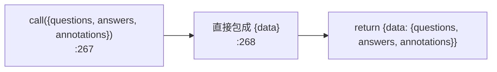
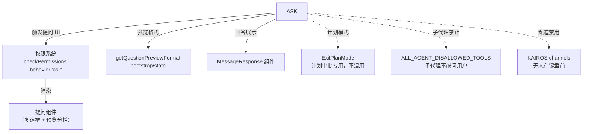

# AskUserQuestionTool 工具详解

> 这是工具系统逐个拆解系列的一篇。`AskUserQuestion` 是一个**中等复杂度**的交互式工具：它让模型能向用户提出结构化的多选问题（2-4 选项、最多 4 个问题、支持 multiSelect 和 preview）。它的特殊之处在于 `call()` 几乎不做事——真正的提问 UI 在权限组件里渲染，工具本身只负责 schema 校验和回答格式化。这是理解"工具结果如何由 UI 组件回填"的关键样本。

---

## 一、工具定位（一句话总结）

**`AskUserQuestion` = 模型向用户提结构化多选问题的交互通道。**

| 维度 | 值 |
|---|---|
| 工具名 | `AskUserQuestion`（常量 `ASK_USER_QUESTION_TOOL_NAME`，`prompt.ts:3`） |
| 一句话 | 让模型提 1-4 个多选问题（每题 2-4 选项），收集用户澄清/偏好/决策 |
| 是否进 system prompt | ✅ **在** `CORE_TOOLS` 白名单（`src/constants/tools.ts:148`） |
| 只读 / 破坏性 | **只读**（`isReadOnly: true`，`:213`） |
| 是否可并发 | ✅ **可并发**（`isConcurrencySafe: true`，`:210`） |
| 需要用户交互 | ✅ **是**（`requiresUserInteraction: true`，`:219`）——这是它最关键的标记 |
| 子代理禁止 | ✅ 在 `ALL_AGENT_DISALLOWED_TOOLS`（`src/constants/tools.ts:50`）——子代理不能问用户 |
| 核心依赖 | 权限组件渲染提问 UI、`MessageResponse` 组件展示回答 |

**为什么需要它？** 模型在执行中常遇到歧义——"用哪个库？""要走方案 A 还是 B？""启用哪些功能？"。如果让模型用纯文本提问，用户体验差且回答难解析。`AskUserQuestion` 把提问结构化：每题固定 2-4 选项 + 自动"其他"入口，UI 渲染成可导航的多选框，回答以 `{question: answer}` 字典形式回填到工具结果。

---

## 二、关键文件清单

```
AskUserQuestionTool/
├── AskUserQuestionTool.tsx   ← buildTool({...}) 主体（314 行），含 schema + HTML 校验
├── prompt.ts                 ← ASK_USER_QUESTION_TOOL_NAME + DESCRIPTION + PREVIEW_FEATURE_PROMPT
└── src/                      ← 内联的辅助模块（bootstrap/components/constants/utils 子集）
```

| 文件 | 角色 | 必看行号 |
|---|---|---|
| `AskUserQuestionTool.tsx` | 工具主体：复杂 schema + `requiresUserInteraction` + HTML 预览校验 | `buildTool:173`、`inputSchema:119`、`checkPermissions:240`、`call:267`、`validateHtmlPreview:298` |
| `prompt.ts` | 工具名、chip 宽度常量、预览格式说明（markdown/html 两版） | `ASK_USER_QUESTION_TOOL_NAME:3`、`PREVIEW_FEATURE_PROMPT:10`、`ASK_USER_QUESTION_TOOL_PROMPT:32` |

> **结构特点**：单 `.tsx` 主体（因为含 JSX 渲染），但 `call()` 反而极简——复杂度全在 schema 定义（嵌套 lazySchema）和 UI 校验上。`src/` 子目录是辅助模块的局部副本（bootstrap/state、components/MessageResponse 等），不展开。

---

## 三、Tool 接口字段实现（`buildTool` 逐字段）

### 标识字段

```ts
name: ASK_USER_QUESTION_TOOL_NAME,             // "AskUserQuestion"
searchHint: '向用户提出多选问题',
maxResultSizeChars: 100_000,
shouldDefer: true,                             // 延迟工具，但又在 CORE_TOOLS——见下方说明
```

> **`shouldDefer: true` 与 `CORE_TOOLS` 并存**：`AskUserQuestion` 在 `CORE_TOOLS` 白名单内（始终注入完整 schema），但 `shouldDefer` 标记让它在 TF-IDF 索引里也能被命中。两套机制不冲突——CORE_TOOLS 决定"是否初始注入 schema"，shouldDefer 影响"是否参与延迟发现"。

### 模型面字段

```ts
async description() { return DESCRIPTION }
async prompt() {
  const format = getQuestionPreviewFormat()       // SDK 消费者可选预览格式
  if (format === undefined) return ASK_USER_QUESTION_TOOL_PROMPT
  return ASK_USER_QUESTION_TOOL_PROMPT + PREVIEW_FEATURE_PROMPT[format]   // markdown 或 html
}
userFacingName() { return '' }                    // 空字符串——不显示工具名
```

> **`prompt()` 动态拼接**：根据 `getQuestionPreviewFormat()`（来自 `bootstrap/state`）决定是否追加预览指南。SDK 消费者可能不渲染 preview 字段，此时省略指导。这是"工具描述随宿主能力自适应"的设计。

### 输入 schema（`:119-128`，嵌套 lazySchema）

```ts
{
  questions: [{                          // 1-4 个问题
    question: string,                    // 完整问题文本
    header: string,                      // ≤12 字符的 chip 标签
    options: [{                          // 2-4 个选项
      label: string,                     // 选项显示文本
      description: string,               // 选项含义说明
      preview?: string,                  // 可选预览（代码/图/HTML 片段）
    }],
    multiSelect?: boolean,               // 默认 false
  }],
  answers?: Record<string, string>,      // 由权限组件回填的用户回答
  annotations?: Record<string, {         // 每问题用户注释
    preview?: string,
    notes?: string,
  }>,
  metadata?: { source?: string },        // 分析跟踪用
}
```

**关键约束**（`:86-101` `UNIQUENESS_REFINE`）：
- 问题文本必须唯一（不能问两次相同的问题）
- 每题选项 label 必须唯一

**输出 schema**（`:131-141`）：`{ questions, answers, annotations }`——和输入同构（answers 由权限组件填充）。

### 行为字段

| 字段 | 实现 | 说明 |
|---|---|---|
| `call()` | `:267` | **极简**：直接把输入的 `questions/answers/annotations` 包成 `{data}` 返回 |
| `validateInput({questions})` | `:222` | 仅当 `previewFormat === 'html'` 时校验每个选项的 preview 是合法 HTML 片段 |
| `checkPermissions(input)` | `:240` | 返回 `{ behavior: 'ask', message: '回答问题？' }`——触发提问 UI |
| `isEnabled()` | `:199` | KAIROS channels 激活时返回 false（用户可能在 Telegram/Discord，多选框会挂死） |
| `isReadOnly()` | `:213` | `true` |
| `isConcurrencySafe()` | `:210` | `true` |
| `requiresUserInteraction()` | `:219` | **`true`**——标记此工具必须有用户参与 |
| `toAutoClassifierInput(input)` | `:216` | 拼接所有问题文本 |

### 渲染字段

```ts
renderToolUseMessage() { return null }                    // 调用时不显示（提问 UI 会自己渲染）
renderToolUseProgressMessage() { return null }
renderToolResultMessage({answers}) { return <AskUserQuestionResultMessage .../> }
renderToolUseRejectedMessage() { return <...用户拒绝回答...> }
renderToolUseErrorMessage() { return null }
```

> **`renderToolUseMessage` 返回 null**：因为提问 UI（多选框、预览分栏）由权限组件在 `checkPermissions` 的 `ask` 路径里渲染，工具自身的"调用消息"不需要重复显示。

---

## 四、核心执行流程：`call()`

`call()` 是系列里**最反直觉**的一个——它几乎不做事：



**为什么 `call()` 这么空？** 因为真正的提问交互发生在**权限阶段**：

```mermaid
flowchart TD
    M["模型调用 AskUserQuestion"] --> VI["validateInput\n:222\nHTML 预览校验"]
    VI --> CP["checkPermissions\n:240\n返回 behavior:'ask'"]
    CP --> UI["权限组件渲染提问 UI\n（多选框 + 预览分栏）"]
    UI --> U["用户选择 / 输入'其他'"]
    U --> RB["UI 把 answers 回填到 input.answers"]
    RB --> CALL["call()\n:267\n把回填的 answers 包成结果"]
    CALL --> MAP["mapToolResultToToolResultBlockParam\n:272\n格式化为 '\"问题\"=\"回答\"' 文本"]
```

**关键设计**：`answers` 字段在模型发出的 input 里是空的，由**权限组件**在用户回答后回填到 `updatedInput`，然后 `call()` 收到带 answers 的 input 直接透传。这就是为什么 `checkPermissions` 返回 `{ behavior: 'ask', updatedInput: input }`——`ask` 触发 UI，UI 完成后修改 `input.answers`，再继续走流水线到 `call()`。

### `mapToolResultToToolResultBlockParam`（`:272-292`）

把回答格式化成模型可读文本：
- `"问题"="回答"` 形式
- 若有 annotation.preview → 追加 `selected preview:\n<...>`
- 若有 annotation.notes → 追加 `user notes: <...>`
- 多个回答用 `, ` 连接
- 整体包装："用户已回答你的问题：<...>。你现在可以根据用户的回答继续工作。"

---

## 五、权限与安全

### `checkPermissions`（`:240-246`）—— 不是权限，是提问触发器

```ts
async checkPermissions(input) {
  return { behavior: 'ask', message: '回答问题？', updatedInput: input }
}
```

返回 `behavior: 'ask'` 让权限系统弹出提问 UI。`updatedInput` 把 input 原样传回——UI 组件会**修改这个 input 的 answers 字段**，然后流水线带着修改后的 input 继续到 `call()`。

> **这是"权限组件充当 UI 容器"的设计**：提问 UI 复用权限系统的渲染管道，省去单独的交互机制。

### `validateInput`（`:222-239`）—— 仅 HTML 预览校验

只在 `getQuestionPreviewFormat() === 'html'` 时生效，对每个选项的 `preview` 调用 `validateHtmlPreview`（`:298-313`）：
- 禁止 `<html>/<body>/<!DOCTYPE>`（必须是片段，非完整文档）
- 禁止 `<script>/<style>`（防代码执行/样式污染宿主页）
- 必须包含至少一个 HTML 标签（确认确实是 HTML）

> **`validateHtmlPreview` 的注释**（`:295-297`）明确说"不是解析器"——HTML5 解析器按规范是错误恢复的，接受任何内容。这里检查的是**模型意图**，捕获它"不该做"的事（完整文档/脚本）。

### `requiresUserInteraction`（`:219`）—— 渠道中继的信号

返回 `true` 让频道权限中继（Telegram/Discord 等）跳过此工具——因为没人在键盘前，多选框会挂死。

### `isEnabled` 门控（`:199-209`）

```ts
isEnabled() {
  if ((feature('KAIROS') || feature('KAIROS_CHANNELS')) && getAllowedChannels().length > 0) {
    return false   // 用户在频道上，不在看 TUI
  }
  return true
}
```

---

## 六、与其他系统/工具的关系



- **与权限系统的关系**：这是最深的耦合——提问 UI 完全复用权限渲染管道。`checkPermissions` 返回 `ask` 触发 UI，UI 修改 `input.answers`，再流转到 `call()`。
- **与 `ExitPlanMode` 的关系**：`prompt.ts:43` 明确划界——计划审批用 `ExitPlanMode`，**不要**用 `AskUserQuestion` 问"计划好了吗"。两者都是交互工具，但职责分离。
- **与子代理系统的关系**：在 `ALL_AGENT_DISALLOWED_TOOLS`（`src/constants/tools.ts:50`）——子代理不能问用户（用户在主线程交互）。
- **与 SDK 消费者的关系**：`prompt()` 根据 `getQuestionPreviewFormat()` 动态裁剪——SDK 宿主可以配置是否支持 preview、支持哪种格式（markdown/html）。

---

## 七、亮点与设计取舍

1. **`call()` 的"空"是有意的**（`:267-271`）：提问交互在权限阶段完成，`call()` 只做透传。这是"工具结果由 UI 组件回填"模式的典范——复杂度在 UI 层，工具层保持极简。
2. **`checkPermissions` 兼任 UI 触发器**（`:240-246`）：复用权限渲染管道省去独立的交互机制，但代价是"提问"和"权限确认"在代码上耦合——读代码时要知道这里的 `ask` 不是在问"允不允许"，而是在展示问题。
3. **动态 prompt 拼接**（`:182-189`）：`prompt()` 根据 SDK 宿主的 preview 能力裁剪描述。markdown/html 两套 `PREVIEW_FEATURE_PROMPT`（`prompt.ts:10-30`）让工具描述随宿主自适应。
4. **HTML 预览的安全校验**（`:298-313`）：禁止 `<script>/<style>` 防代码执行和样式污染，禁止完整文档标签。注释坦承"这不是解析器"，检查的是模型意图。
5. **唯一性 refine**（`:86-101`）：问题文本唯一 + 选项 label 唯一——防止模型生成重复或歧义的问题集。
6. **渠道感知的 `isEnabled`**（`:199-209`）：KAIROS channels 激活时直接禁用，避免多选框在无人环境下挂死。这是"工具按运行环境启停"的范例。
7. **`requiresUserInteraction` 标记**（`:219`）：让频道中继能识别并跳过——元数据字段驱动的运行时行为。
8. **chip 宽度常量**（`prompt.ts:5` `ASK_USER_QUESTION_TOOL_CHIP_WIDTH = 12`）：header 字段长度限制硬编码为常量，schema describe 里引用——保证 UI 一致性。

---

## 八、源码导航（书签速查）

| 想看什么 | 去哪里 |
|---|---|
| 工具名常量 + chip 宽度 | `AskUserQuestionTool/prompt.ts:3,5` |
| `buildTool` 字段填充 | `AskUserQuestionTool.tsx:173-293` |
| 输入 schema（嵌套 lazySchema） | `AskUserQuestionTool.tsx:119-128` |
| 唯一性约束 | `AskUserQuestionTool.tsx:86-101` |
| `call()`（极简透传） | `AskUserQuestionTool.tsx:267-271` |
| `checkPermissions`（提问触发器） | `AskUserQuestionTool.tsx:240-246` |
| `validateHtmlPreview` | `AskUserQuestionTool.tsx:298-313` |
| `requiresUserInteraction` | `AskUserQuestionTool.tsx:219-221` |
| `isEnabled` 渠道门控 | `AskUserQuestionTool.tsx:199-209` |
| 结果格式化 | `AskUserQuestionTool.tsx:272-292` |
| 预览格式 prompt | `prompt.ts:10-30` |
| 子代理禁止 | `src/constants/tools.ts:50` |

---

## 九、学习建议与验证清单

**怎么读这章**：先看"一、工具定位"理解它是交互通道，再重点读"四、call() 的空"和"五、checkPermissions"——理解"提问 UI 在权限阶段渲染、answers 由 UI 回填"这一反直觉流程。

**验证清单（读完自测）**：
- [ ] 能解释为什么 `call()` 几乎是空的（提问在权限阶段，call 只透传回填的 answers）
- [ ] 能说出 `checkPermissions` 返回 `behavior: 'ask'` 的真实作用（触发提问 UI，不是问"允不允许"）
- [ ] 能指出 `answers` 字段如何从空变成有值（权限组件修改 `updatedInput.answers`）
- [ ] 能解释 `requiresUserInteraction: true` 的作用（让频道中继跳过此工具）
- [ ] 能说出 `isEnabled` 在什么条件下返回 false（KAIROS channels 激活且用户有频道）
- [ ] 能指出 `validateHtmlPreview` 禁止哪些标签（`<script>/<style>` + 完整文档标签）
- [ ] 能解释唯一性 refine 检查什么（问题文本唯一 + 选项 label 唯一）
- [ ] 能说出它与 `ExitPlanMode` 的职责分界（计划审批用 ExitPlanMode，不用 AskUserQuestion）

**配合动作**：
1. 让 Claude 在有歧义时调 `AskUserQuestion`，观察提问 UI（多选框、chip、可选预览）
2. 在提问时选"其他"输入自定义文本，验证 answers 字典正确回填
3. 启用 multiSelect，观察 UI 切换为多选模式
4. 在 `checkPermissions:240` 加日志，确认 answers 字段在权限阶段被修改、call 阶段已带值
