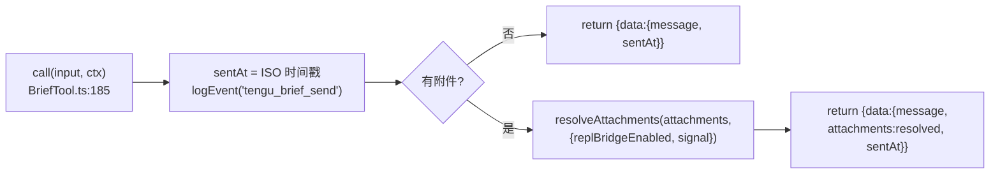
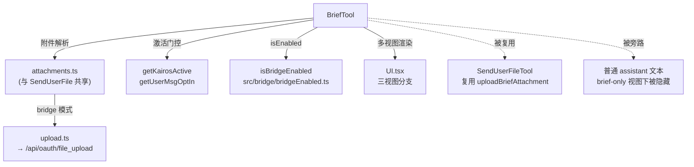

# SendUserMessage（Brief）工具详解

> 这是工具系统逐个拆解系列的一篇。`Brief`（对外工具名 `SendUserMessage`，旧名 `Brief`）是 KAIROS 助手模式 / chat 视图下的**用户面消息出口**：在 brief-only 视图里，工具调用之外的 assistant 文本会被 UI 隐藏，真正能被用户读到的只有通过本工具投递的消息。它结构完整（含附件解析、bridge 上传、多视图渲染），是观察"面向用户的副作用型工具"如何与 feature gate、bridge、多视图渲染协作的好例子。

---

## 一、工具定位（一句话总结）

**`SendUserMessage` = assistant/chat 模式下模型回复用户的唯一可见出口（支持 markdown + 文件附件）。**

| 维度 | 值 |
|---|---|
| 工具名 | `SendUserMessage`（常量 `BRIEF_TOOL_NAME`，`prompt.ts:1`），别名 `Brief`（`LEGACY_BRIEF_TOOL_NAME`，`prompt.ts:2`） |
| 一句话 | 把模型的回答（+可选附件）投递给用户；在 brief-only 视图里这是唯一可见文本 |
| 是否进 system prompt | ❌ 不在 `CORE_TOOLS` 白名单；在 `tools.ts:266` 无条件注册，但运行时受 `isBriefEnabled()` / bridge 门控 |
| 只读 / 破坏性 | 标注为**只读**（`isReadOnly() → true`，`BriefTool.ts:156`），但它产生用户可见副作用 |
| 是否可并发 | ✅ **可并发**（`isConcurrencySafe() → true`，`:153`） |
| 激活门控 | `feature('KAIROS'||'KAIROS_BRIEF')` + `isBriefEnabled()` + `isBridgeEnabled()`（`tools.ts` 无显式 feature gate，运行时 `isEnabled` 决定） |
| 核心依赖 | `attachments.ts`（解析）、`upload.ts`（bridge 上传）、`UI.tsx`（多视图渲染） |

**为什么需要它？** 在普通 CLI 视图，模型的文本就是答案。但在 KAIROS 助手模式（`--brief`、`defaultView:'chat'`、SDK `tools:[SendUserMessage]`）下，UI 会隐藏工具调用之外的 assistant 文本（`UI.tsx:64-69` 注释），用户只能看到通过本工具显式投递的消息。没有它，助手模式下的回答对用户不可见。

---

## 二、关键文件清单

```
BriefTool/
├── BriefTool.ts      ← buildTool({...}) 主体（203 行），含权限/激活门控
├── prompt.ts         ← 工具名常量 + DESCRIPTION + BRIEF_TOOL_PROMPT + BRIEF_PROACTIVE_SECTION
├── UI.tsx            ← 三视图渲染（默认 / brief-only / transcript）
├── attachments.ts    ← 附件校验 + 解析（stat + 并行上传）
└── upload.ts         ← bridge 附件上传到 private_api（multipart）
```

| 文件 | 角色 | 必看行号 |
|---|---|---|
| `BriefTool.ts` | 主体：schema + 激活门控 + call() | `isBriefEntitled:87`、`isBriefEnabled:125`、`buildTool:135`、`call:185` |
| `prompt.ts` | 工具名 + 描述 + 主动沟通段落 | `BRIEF_TOOL_NAME:1`、`BRIEF_TOOL_PROMPT:6`、`BRIEF_PROACTIVE_SECTION:12` |
| `UI.tsx` | 三种视图的渲染分支 | `renderToolResultMessage:16`、brief-only 分支 `:48`、transcript 分支 `:31` |
| `attachments.ts` | 附件路径校验与解析（与 SendUserFile 共享） | `validateAttachmentPaths:26`、`resolveAttachments:63` |
| `upload.ts` | bridge 模式下上传到 `/api/oauth/file_upload` | `uploadBriefAttachment:91`、`MAX_UPLOAD_BYTES:32` |

> **结构特点**：BriefTool 是本批中文件最多、逻辑最完整的工具。附件/上传拆成独立模块，是因为它们需要被 `SendUserFileTool` 复用（`attachments.ts:1-6` 注释说明放在 BriefTool 目录是为了让 `./upload.js` 的动态导入保持相对路径，同时让 upload.ts 在非 bridge 构建中可被 tree-shaking 移除）。

---

## 三、Tool 接口字段实现（`buildTool` 逐字段）

### 标识字段

```ts
name: BRIEF_TOOL_NAME,                // "SendUserMessage"
aliases: [LEGACY_BRIEF_TOOL_NAME],    // ["Brief"] —— 旧会话恢复兼容
searchHint: '向用户发送消息 —— 你的主要可见输出渠道',
maxResultSizeChars: 100_000,
userFacingName() { return '' },       // 关键：返回空串
```

> **`userFacingName()` 返回 `''`**（`:141`）：这是一个精心设计的副作用——让 `UserToolSuccessMessage` 放弃 `columns-5` 宽度约束，`AssistantToolUseMessage` 渲染为 null（无工具外壳）。注释 `UI.tsx:67-69` 明确：这样 SendUserMessage 在默认视图里看起来就是普通文本，没有"工具调用"的视觉边框。

### 模型面字段

```ts
async description() { return DESCRIPTION }   // "向用户发送消息"
async prompt()      { return BRIEF_TOOL_PROMPT }
get inputSchema()   // lazySchema + z.strictObject
get outputSchema()  // lazySchema + z.object
```

**输入 schema**（`:21-38`）：
```ts
{
  message: string,                    // markdown 消息
  attachments?: string[],             // 文件路径数组（绝对/相对 cwd）
  status: 'normal' | 'proactive',     // 意图标注，下游路由使用
}
```

**输出 schema**（`:43-65`）：
```ts
{
  message: string,
  attachments?: { path, size, isImage, file_uuid? }[],
  sentAt?: string,   // ISO 时间戳（可选，会话恢复兼容）
}
```

> **`attachments` 与 `sentAt` 必须可选**（`:42`、`:59-62` 注释）：恢复的旧会话会原样重放这些字段引入之前的输出，若为必填会导致 UI 渲染器崩溃。这是"向前兼容旧输出"的典型 schema 设计。

### 行为字段

| 字段 | 实现 | 说明 |
|---|---|---|
| `call()` | `:185` | 核心逻辑（见下节） |
| `isEnabled()` | `:150` → `isBridgeEnabled()` | 运行时门控 |
| `validateInput()` | `:162` → `validateAttachmentPaths` | 校验附件路径存在且是普通文件 |
| `isConcurrencySafe()` | `:153` → `true` | 多次发送互不干扰 |
| `isReadOnly()` | `:156` → `true` | 标注只读（虽有副作用） |
| `toAutoClassifierInput()` | `:159` → `input.message` | 自动审批分类器看消息文本 |
| `mapToolResultToToolResultBlockParam` | `:174` | 返回"消息已发送给用户。(N attachments included)" |

### 渲染字段

`renderToolUseMessage` 返回 `''`（不在调用时显示），`renderToolResultMessage`（`UI.tsx:16`）有三视图分支（见第六节）。

---

## 四、核心执行流程：`call()`

`call()`（`BriefTool.ts:185-202`）非常简洁，因为它把重活都委托给了 `attachments.ts`：



**关键点逐条**：

1. **遥测先记**（`:187`）：`logEvent('tengu_brief_send', {proactive, attachment_count})`——每次发送都上报，`status` 字段（normal/proactive）进入遥测用于路由分析。
2. **无附件快路径**（`:191`）：直接返回 `{message, sentAt}`，不触发任何 IO。
3. **附件解析委托**（`:195`）：`resolveAttachments` 做 stat（本地、串行）+ 上传（网络、并行），上传失败仍保留 `{path,size,isImage}` 供本地渲染（`attachments.ts:66-69`）。
4. **bridge 信号透传**：`replBridgeEnabled` 来自 `appState`，决定是否上传；`abortController.signal` 传入上传以支持中断。

---

## 五、权限与安全

BriefTool 的权限模型比较特殊——**它没有 `checkPermissions`**，而是用**双层激活门控**控制可用性：

### `isBriefEntitled()`（`:87`，资格判定）

判断用户是否"有资格"使用 Brief，用于决定是否尊重 `--brief` / `defaultView` / `--tools` 等激活动作：
- 构建期：`feature('KAIROS') || feature('KAIROS_BRIEF')`（OR 门控，注释 `:75-78`）
- 运行时：`getKairosActive()`（assistant 模式）|| `CLAUDE_CODE_BRIEF` 环境变量（开发绕过）|| GrowthBook 开关 `tengu_kairos_brief`（5 分钟刷新缓存）

### `isBriefEnabled()`（`:125`，会话激活）

判断工具在当前会话是否真正激活，控制工具可用性、system prompt 段落、延迟加载绕过：
- 需要 `getKairosActive() || getUserMsgOptIn()`（显式 opt-in）
- **AND** `isBriefEntitled()`（GB kill-switch 会中途关闭，`:118-119`）
- opt-in 来源（注释 `:106-112`）：`--brief` 标志、`defaultView:'chat'`、`/brief` 命令、`/config` 选择器、`--tools` 列表、`CLAUDE_CODE_BRIEF` 环境变量

### 附件校验 `validateAttachmentPaths`（`attachments.ts:26`）

- `stat` 检查每个路径：非普通文件 → 报错；ENOENT → 友好提示含 cwd；EACCES/EPERM → 权限拒绝
- 注释 `attachments.ts:74-76` 承认 TOCTOU（validateInput 与 resolveAttachments 之间文件可能被移动），但选择让错误冒泡

### `upload.ts` 的安全细节

- 上传大小硬上限 30MB（`MAX_UPLOAD_BYTES:32`）
- Bearer token 鉴权（`getBridgeAccessToken`）
- `validateStatus: () => true` + 手动检查 201，任何失败都优雅降级返回 undefined（`:150`）

> **为什么用正向三元而非 early-return**（`upload.ts:96-97`、`BriefTool.ts:88-90`）：CLAUDE.md 明确，Bun 编译器只能对 `feature() ? a : b` 形式做死代码消除（DCE）。反向写法 `if(!feature()) return` 无法消除函数体，会把 axios/crypto 等依赖留在非 bridge 构建里。

---

## 六、与其他系统/工具的关系



- **与 `SendUserFileTool`**：SendUserFile 直接 `import('.../BriefTool/upload.js')` 复用上传逻辑（`SendUserFileTool.ts:106`）。
- **与 bridge 系统**：附件上传、推送都依赖 bridge token 与 base URL。
- **与 UI 渲染**：`renderToolResultMessage` 的 `options` 参数（`UI.tsx:19-22`）由上层 `Messages.tsx` 根据 `isTranscriptMode` / `isBriefOnly` 传入，驱动三视图分支。

### 三视图渲染（`UI.tsx:16-79`）

| 视图 | 触发 | 渲染 |
|---|---|---|
| **transcript**（ctrl+o） | `options.isTranscriptMode` | 保留 `⏺` 黑圆点 gutter（`:31-43`），使 SendUserMessage 在文本块中视觉可辨 |
| **brief-only**（chat） | `options.isBriefOnly` | "Claude" 标签 + 时间戳 + 2 列缩进（`:48-62`），与用户输入的 "You" 标签对称 |
| **默认** | 无 options | 空 `minWidth={2}` box 占位（`:70-78`），无 gutter，纯文本阅读 |

`AttachmentList`（`:85`）渲染附件列表：`› [image]/[file] <路径> (<大小>)`。

---

## 七、亮点与设计取舍

1. **`userFacingName()` 返回空串的视觉副作用**（`:141`）：一个看似奇怪的字段值，实则是让工具在默认视图里"隐形"为普通文本的关键——精巧的 UI 协同。
2. **双层激活门控**（entitled vs enabled）：把"是否有资格"与"本会话是否激活"分开，支持 GB kill-switch 中途关闭已 opt-in 会话（`:118`）。
3. **附件模块拆分 + 动态导入**（`attachments.ts:83-88`）：`import('./upload.js')` 包在 `feature('BRIDGE_MODE')` 守卫内，确保 axios/crypto 在非 bridge 构建中被 tree-shaking。注释明确指出静态导入会破坏这一优化。
4. **向前兼容旧输出**：`attachments` / `sentAt` 都设为可选，schema 设计直接服务会话恢复（`:42,59`）。
5. **`status` 字段驱动路由**：`normal` vs `proactive` 不只是标注，下游用它决定通知行为（`prompt.ts:10`）。
6. **upload 优雅降级**：任何上传失败都返回 undefined，本地渲染不受影响（`upload.ts:90` 注释 "best-effort"）。
7. **正向三元保证 DCE**：贯穿全模块的编码纪律，是反编译代码库对 Bun 编译器的适配。

---

## 八、源码导航（书签速查）

| 想看什么 | 去哪里 |
|---|---|
| 工具名常量 + 别名 | `BriefTool/prompt.ts:1-2` |
| 资格门控 `isBriefEntitled` | `BriefTool.ts:87-99` |
| 会话激活 `isBriefEnabled` | `BriefTool.ts:125-133` |
| `buildTool` 字段填充 | `BriefTool.ts:135-203` |
| 输入/输出 schema | `BriefTool.ts:21-65` |
| `call()` 核心 | `BriefTool.ts:185-202` |
| 附件校验 | `attachments.ts:26-61` |
| 附件解析（含上传） | `attachments.ts:63-110` |
| bridge 上传实现 | `upload.ts:91-173` |
| 三视图渲染 | `UI.tsx:16-79` |
| 主动沟通 prompt 段落 | `prompt.ts:12-22`（`BRIEF_PROACTIVE_SECTION`） |

---

## 九、学习建议与验证清单

**怎么读这章**：先看"一、定位"理解为什么需要"唯一可见出口"，再跳到"五、权限"理解双层门控，最后对照"六、三视图渲染"看 UI 如何配合。

**验证清单（读完自测）**：
- [ ] 能说出 `SendUserMessage` 与 `Brief` 是同一工具的现名/别名
- [ ] 能解释 `userFacingName()` 返回 `''` 的视觉作用（让工具隐形为普通文本）
- [ ] 能区分 `isBriefEntitled`（资格）与 `isBriefEnabled`（会话激活）的职责
- [ ] 能说出 `attachments.ts` 为什么放在 BriefTool 目录（让 SendUserFile 复用 + upload.ts 可 tree-shaking）
- [ ] 能解释为什么 `attachments` / `sentAt` 设为可选（会话恢复向前兼容）
- [ ] 能找到上传大小硬上限（30MB，`upload.ts:32`）
- [ ] 能说出三视图（transcript / brief-only / 默认）各自的渲染特征

**配合动作**：
1. 用 `CLAUDE_CODE_BRIEF=1 bun run dev -- --brief` 启动，观察 brief-only 视图里 "Claude" 标签
2. 让 Claude 发送带图片附件的消息，观察 `AttachmentList` 渲染
3. 在 `call()` 的 `:187` 加日志，确认 `tengu_brief_send` 遥测字段
