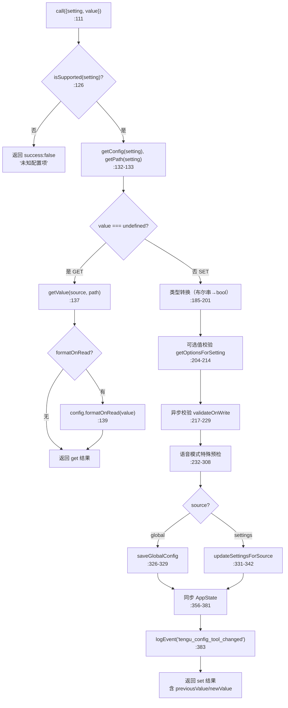
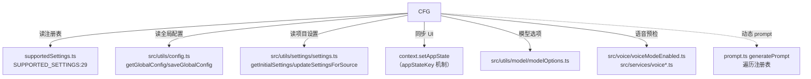

# ConfigTool 工具详解

> 这是工具系统逐个拆解系列的一篇。`ConfigTool` 是一个**复杂**的注册表驱动型工具：它本身不硬编码任何配置项，所有可配置的 setting 都在 `supportedSettings.ts` 的 `SUPPORTED_SETTINGS` 注册表里声明（source/type/options/校验/格式化）。工具的 `call()` 根据注册表元数据动态决定读写路径、类型转换、校验、AppState 同步。这是理解"如何用一个工具服务 N 种异构配置项"的关键样本。

---

## 一、工具定位（一句话总结）

**`ConfigTool` = 统一的 Claude Code 配置读写工具，由注册表驱动。**

| 维度 | 值 |
|---|---|
| 工具名 | `Config`（常量 `CONFIG_TOOL_NAME`，`constants.ts:1`） |
| 一句话 | 获取（省略 value）或设置（带 value）配置项，支持全局配置（`~/.claude.json`）和项目设置（`settings.json`） |
| 是否进 system prompt | ❌ 不在 `CORE_TOOLS`（延迟工具，`shouldDefer: true`） |
| 注册门控 | `process.env.USER_TYPE === 'ant'`（`src/tools.ts:242`）—— **仅 ant 用户注册** |
| 只读 / 破坏性 | **动态**：`isReadOnly(input)` 返回 `input.value === undefined`（`:90`） |
| 是否可并发 | ✅ **可并发**（`:87`） |
| 核心依赖 | `SUPPORTED_SETTINGS` 注册表（`supportedSettings.ts`）、`saveGlobalConfig`/`updateSettingsForSource` |

**为什么需要它？** 用户常想"换个主题""切到 opus""启用 vim 模式"。如果让模型自己改配置文件，容易写错路径、漏校验、不同步 UI。`ConfigTool` 把所有配置项的"读/写/校验/同步"统一成一套注册表驱动的管道，模型只需 `{setting, value}` 两个参数。

---

## 二、关键文件清单

```
ConfigTool/
├── ConfigTool.ts          ← buildTool({...}) 主体（468 行），含 GET/SET 全流程
├── supportedSettings.ts   ← SUPPORTED_SETTINGS 注册表：所有可配置项的元数据
├── prompt.ts              ← generatePrompt()：从注册表动态生成配置文档
├── UI.tsx                 ← Ink 渲染（get/set/失败三种展示）
└── constants.ts           ← CONFIG_TOOL_NAME = 'Config'
```

| 文件 | 角色 | 必看行号 |
|---|---|---|
| `ConfigTool.ts` | 工具主体：schema + checkPermissions + call() + GET/SET 分支 + getValue/buildNestedObject 辅助 | `buildTool:67`、`inputSchema:36`、`checkPermissions:98`、`call:111`、`getValue:436`、`buildNestedObject:455` |
| `supportedSettings.ts` | **注册表**：每项的 source/type/options/校验/格式化/appStateKey | `SUPPORTED_SETTINGS:29`、`SettingConfig:15` |
| `prompt.ts` | 从注册表遍历生成模型可见的配置列表 + 模型选项段落 | `generatePrompt:14`、`generateModelSection:79` |
| `UI.tsx` | get 显示 `setting = value`，set 显示"已将 X 设置为 Y" | `renderToolResultMessage:19` |

> **结构特点**：5 个文件中 `supportedSettings.ts` 是真正的"数据"——它定义了工具能做什么。`ConfigTool.ts` 是"引擎"，根据注册表元数据执行。两者分离让新增配置项只需改注册表，不动工具逻辑。

---

## 三、Tool 接口字段实现（`buildTool` 逐字段）

### 标识字段

```ts
name: CONFIG_TOOL_NAME,                          // "Config"
searchHint: '获取或设置 Claude Code 配置项（主题、模型等）',
maxResultSizeChars: 100_000,
shouldDefer: true,
```

### 模型面字段

```ts
async description() { return DESCRIPTION }       // prompt.ts:9 '获取或设置 Claude Code 配置项。'
async prompt()      { return generatePrompt() }   // 动态遍历注册表生成文档
userFacingName()    { return 'Config' }
```

> **`prompt()` 动态生成**：`generatePrompt()`（`prompt.ts:14-77`）遍历 `SUPPORTED_SETTINGS`，按 source（global/settings）分组，附加每项的 options 或 `true/false`，再拼接模型选项段落。这意味着新增配置项会**自动出现在模型可见的 prompt 里**——无需改工具代码。

### 输入 schema（`:36-48`）

```ts
{
  setting: string,                    // 配置项键名，如 "theme"/"model"/"permissions.defaultMode"
  value?: string | boolean | number,  // 省略 = GET，提供 = SET
}
```

**输出 schema**（`:51-61`）：
```ts
{
  success: boolean,
  operation?: 'get' | 'set',
  setting?: string,
  value?: unknown,           // GET 的当前值
  previousValue?: unknown,   // SET 的旧值
  newValue?: unknown,        // SET 的新值
  error?: string,
}
```

### 行为字段

| 字段 | 实现 | 说明 |
|---|---|---|
| `call()` | `:111` | 核心逻辑（见下节） |
| `checkPermissions(input)` | `:98` | **读自动允许，写需确认** |
| `isReadOnly(input)` | `:90` | `input.value === undefined`（GET 只读，SET 非只读） |
| `isConcurrencySafe()` | `:87` | `true` |
| `toAutoClassifierInput(input)` | `:93` | GET 返回 setting 名，SET 返回 `setting = value` |

### `checkPermissions`（`:98-107`）—— 读写差异化

```ts
async checkPermissions(input) {
  if (input.value === undefined) {
    return { behavior: 'allow', updatedInput: input }   // GET 自动放行
  }
  return {
    behavior: 'ask',
    message: `将 ${input.setting} 设置为 ${jsonStringify(input.value)}`,
  }
}
```

> **读不问、写要问**：读取配置无副作用，直接 allow；写入配置会改持久化状态，必须 ask。这是 `isReadOnly` + `checkPermissions` 配合实现"动态权限"的范例。

---

## 四、核心执行流程：`call()`

`call()`（`:111-411`）按 GET / SET 分叉，SET 内部又有 5 个阶段：



### GET 分支（`:136-144`）

1. `getValue(config.source, path)`（`:436-453`）按 source 从 `getGlobalConfig()` 或 `getInitialSettings()` 取值。settings 源支持嵌套路径遍历。
2. 若注册表项有 `formatOnRead`（如 `model` 把 `null` 显示成 `'default'`，`:105`），格式化后返回。

### SET 分支的 5 个阶段

**阶段 1：类型转换**（`:185-201`）
注册表 `type === 'boolean'` 时，把字符串 `'true'/'false'` 转成布尔值。非布尔值返回错误。

**阶段 2：可选值校验**（`:204-214`）
`getOptionsForSetting(setting)` 返回注册表的静态 `options` 或动态 `getOptions()`（如 `model` 调 `getModelOptions()`）。值不在选项内 → 错误。

**阶段 3：异步校验**（`:217-229`）
注册表 `validateOnWrite`（如 `model` 用 `validateModel`，`:104`）做异步校验（如 API 可达性检查）。

**阶段 4：特殊预检**（仅 `voiceEnabled`，`:232-308`）
语音模式启用前做 5 项预检：GrowthBook 门控、Anthropic 登录、录音可用性、语音流可用、依赖、麦克风权限。任一失败返回具体错误。

**阶段 5：写入 + 同步**（`:313-389`）
- 按 source 写入：global 用 `saveGlobalConfig`，settings 用 `updateSettingsForSource` + `buildNestedObject`（`:455-466` 把 `['permissions','defaultMode']` 构造成嵌套对象）
- 同步 AppState：
  - 注册表有 `appStateKey`（如 `verbose`/`mainLoopModel`/`thinkingEnabled`）→ `setAppState` 即时更新 UI
  - `voiceEnabled` 特殊触发 `settingsChangeDetector.notifyChange`
  - `remoteControlAtStartup` 特殊同步到 `replBridgeEnabled`（键名不一致，通用机制处理不了）
- `logEvent('tengu_config_tool_changed')` 埋点

---

## 五、权限与安全

### 读写差异化权限（`:98-107`）

GET 自动 allow（无副作用），SET 必须 ask（改持久化状态）。`isReadOnly(input)` 返回 `input.value === undefined` 配合权限系统区分。

### 注册表白名单（`:126-130`）

`isSupported(setting)`（`supportedSettings.ts:188`）检查 `setting in SUPPORTED_SETTINGS`。未注册的 setting 直接返回"未知配置项"——**模型无法写入任意配置键**。

### 类型与选项校验

SET 分支三重校验：类型转换（布尔串→bool）、静态/动态选项、异步 `validateOnWrite`。任何一关失败都返回结构化错误，不写入。

### `voiceEnabled` 的特殊安全（`:116-125, 232-308`）

- 构建期注册（`feature('VOICE_MODE')`），运行期还要再过 GrowthBook 门控（`isVoiceGrowthBookEnabled`）——kill-switch 打开时当作"未知 setting"，不泄露语音字符串
- 启用前 5 项预检，包括麦克风权限（按平台给出不同引导文案，`:293-300`）

### `mapToolResultToToolResultBlockParam`（`:412-433`）

成功 GET → `setting = value`；成功 SET → `已将 setting 设置为 newValue`；失败 → `Error: ...` 带 `is_error: true`。

---

## 六、与其他系统/工具的关系



- **与配置存储系统的关系**：双源——`global`（`~/.claude.json`，扁平键）和 `settings`（`settings.json`，嵌套对象，用 `buildNestedObject` 构造）。`getValue`/写入都按 source 分叉。
- **与 AppState 的关系**：`appStateKey` 机制让配置变更即时反映到 UI（如 `verbose`/`mainLoopModel`/`thinkingEnabled`）。键名不一致的特殊情况（`remoteControlAtStartup` → `replBridgeEnabled`）单独处理。
- **与模型系统的关系**：`model` 配置项的 `getOptions` 调 `getModelOptions()`、`validateOnWrite` 调 `validateModel`——动态选项 + 异步校验。
- **与语音系统的关系**：`voiceEnabled` 是最复杂的配置项，启用前做 5 项预检，写入后触发 `settingsChangeDetector.notifyChange` 重同步。
- **与 prompt 生成的关系**：`generatePrompt` 遍历注册表，新增配置项自动出现在模型可见文档里。

---

## 七、亮点与设计取舍

1. **注册表驱动**（`supportedSettings.ts:29`）：所有配置项的元数据（source/type/options/校验/格式化/appStateKey）集中声明。新增配置只改注册表，工具逻辑、prompt 文档、权限行为全部自动跟进。这是"数据驱动工具"的典范。
2. **动态 prompt 生成**（`prompt.ts:14-77`）：`generatePrompt` 遍历注册表，按 source 分组、附加 options、拼接模型段落。注册表变了模型文档自动更新——避免"代码改了 prompt 忘改"的漂移。
3. **读写差异化权限**（`:90, 98-107`）：`isReadOnly(input)` 返回 `value === undefined`，`checkPermissions` 据此决定 allow/ask。一个工具同时服务读和写，权限按输入动态切换。
4. **类型转换 + 三重校验**（`:185-229`）：布尔串自动转 bool，选项校验，异步 `validateOnWrite`。层层过滤保证写入值合法。
5. **`appStateKey` 即时同步**（`:356-362`）：配置变更通过 `setAppState` 即时反映到 UI，无需重启。键名不一致的特殊情况单独硬编码（`:367-381`）。
6. **`buildNestedObject` 处理嵌套路径**（`:455-466`）：`permissions.defaultMode` 这样的点分键被构造成 `{permissions:{defaultMode:value}}`，让 `updateSettingsForSource` 能深合并。
7. **`formatOnRead` 与 `formatOnWrite` 不对称**：读时格式化（`model` 的 null→'default'，`:105`），写时校验（`validateOnWrite`）。读面向用户展示，写面向存储合法性。
8. **voiceEnabled 的双重门控**（`:116-125, 232-308`）：构建期 feature flag + 运行期 GrowthBook + 5 项预检。最敏感的配置项得到最严的保护。
9. **ant 用户专属注册**（`src/tools.ts:242`）：`process.env.USER_TYPE === 'ant'` 才注册——这是内部工具，不对普通用户暴露。

---

## 八、源码导航（书签速查）

| 想看什么 | 去哪里 |
|---|---|
| 工具名常量 | `ConfigTool/constants.ts:1` |
| `buildTool` 字段填充 | `ConfigTool.ts:67-434` |
| 输入/输出 schema | `ConfigTool.ts:36-62` |
| `call()` GET 分支 | `ConfigTool.ts:136-144` |
| `call()` SET 五阶段 | `ConfigTool.ts:182-411` |
| `checkPermissions`（读写差异） | `ConfigTool.ts:98-107` |
| `getValue`（双源读取） | `ConfigTool.ts:436-453` |
| `buildNestedObject` | `ConfigTool.ts:455-466` |
| 注册表定义 | `supportedSettings.ts:29-186` |
| `SettingConfig` 类型 | `supportedSettings.ts:15-27` |
| 动态 prompt 生成 | `prompt.ts:14-77` |
| 注册门控（ant 专属） | `src/tools.ts:242` |

---

## 九、学习建议与验证清单

**怎么读这章**：先读"一、工具定位"理解它是注册表驱动，再读 `supportedSettings.ts:29` 看注册表结构，最后回 `ConfigTool.ts:111` 的 `call()` 看引擎如何根据注册表元数据分叉执行。

**验证清单（读完自测）**：
- [ ] 能说出为什么 `ConfigTool` 不硬编码任何配置项（注册表驱动，新增只改 `SUPPORTED_SETTINGS`）
- [ ] 能解释 `isReadOnly(input)` 为何返回 `input.value === undefined`（GET 只读，SET 非只读）
- [ ] 能指出 `checkPermissions` 如何差异化对待读写（GET allow，SET ask）
- [ ] 能说出 SET 分支的 5 个阶段（类型转换/选项校验/异步校验/特殊预检/写入同步）
- [ ] 能解释 `appStateKey` 机制的作用（配置变更即时同步 UI）
- [ ] 能指出 `buildNestedObject` 解决什么问题（点分键构造嵌套对象深合并）
- [ ] 能说出 `generatePrompt` 如何工作（遍历注册表按 source 分组）
- [ ] 能指出注册门控（`USER_TYPE === 'ant'`，仅内部用户）
- [ ] 能解释 voiceEnabled 的双重门控（构建期 feature + 运行期 GrowthBook + 5 项预检）

**配合动作**：
1. 让 Claude `Config { setting: 'theme' }`（GET），观察返回当前主题
2. 让 Claude `Config { setting: 'theme', value: 'dark' }`（SET），观察权限确认提示 + UI 即时变化
3. 传一个非法 setting 名，验证"未知配置项"错误
4. 在 `supportedSettings.ts` 末尾加一个测试项，观察 `generatePrompt` 输出是否自动包含它
5. 追一个带 `appStateKey` 的配置（如 `verbose`），确认 `setAppState` 触发 UI 更新
