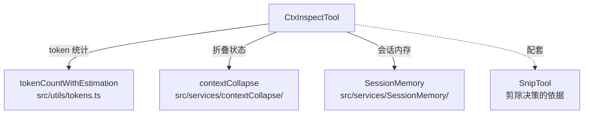

# CtxInspect 工具详解

> 这是工具系统逐个拆解系列的一篇。`CtxInspect` 是一个**简单**的调试专用工具：让模型（或调试者）查看当前上下文窗口的"健康度"——总令牌数、消息数、prompt 缓存是否启用、会话内存、上下文折叠（context collapse）状态与统计。它是只读的纯诊断工具，帮助模型在裁剪历史前评估上下文预算。

---

## 一、工具定位（一句话总结）

**`CtxInspect` = 检查当前上下文窗口内容与令牌使用的只读诊断工具（调试专用）。**

| 维度 | 值 |
|---|---|
| 工具名 | `CtxInspect`（常量内联 `:12`） |
| 一句话 | 返回 total_tokens / message_count / 缓存状态 / 折叠统计 |
| 是否进 system prompt | ❌ 不在 `CORE_TOOLS`；`tools.ts:125-127` 受 `feature('CONTEXT_COLLAPSE')` 门控，`:251` 条件注册 |
| 只读 / 破坏性 | **只读**（`:59`） |
| 是否可并发 | ✅ **可并发**（`:56`） |
| 激活门控 | `feature('CONTEXT_COLLAPSE')`（构建期） |
| 核心依赖 | `tokenCountWithEstimation`、`contextCollapse`、`SessionMemory` |

**为什么需要它？** 模型在长会话中需要感知"我还剩多少上下文预算"。本工具提供这份体检报告，让模型在调用 Snip（剪除）或调整策略前有数据支撑。它是 context collapse 功能的配套诊断面板。

> **注**：CLAUDE.md 列出 `CONTEXT_COLLAPSE` 为"已禁用"feature，故本工具在默认构建中不启用，属调试/实验性质。

---

## 二、关键文件清单

```
CtxInspectTool/
├── CtxInspectTool.ts          ← buildTool({...}) 主体（125 行）
└── __tests__/
    └── CtxInspectTool.test.ts ← 单元测试
```

| 文件 | 角色 | 必看行号 |
|---|---|---|
| `CtxInspectTool.ts` | 主体：schema + call() + 上下文统计 | `buildTool:37`、`call:82`、token 统计 `:85`、折叠统计 `:86-87` |
| `__tests__/CtxInspectTool.test.ts` | 单元测试 | 覆盖 call() 各字段 |

> **结构特点**：单文件主体 + 配套测试（本批少数有测试的工具）。无独立 prompt.ts（描述内联）。是 context collapse 系统的诊断出口。

---

## 三、Tool 接口字段实现（`buildTool` 逐字段）

### 标识字段

```ts
name: CTX_INSPECT_TOOL_NAME,   // "CtxInspect"
searchHint: 'context inspect tokens usage messages window collapse',
maxResultSizeChars: 50_000,
strict: true,
```

### 模型面字段

```ts
async description() { return '检查当前上下文窗口内容和令牌使用情况' }
async prompt()      { return `检查当前的对话上下文...` }
get inputSchema()   // lazySchema + z.strictObject
```

**输入 schema**（`:14-23`）：
```ts
{
  query?: string,   // 可选，过滤上下文条目；省略返回全部摘要
}
```

**输出类型**（`:27-35`）：
```ts
{
  total_tokens: number,
  message_count: number,
  context_window_model: string,
  prompt_caching_enabled: boolean,
  session_memory_enabled: boolean,
  context_collapse_enabled: boolean,
  summary: string,
}
```

### 行为字段

| 字段 | 实现 | 说明 |
|---|---|---|
| `call()` | `:82` | 统计上下文（见下节） |
| `isConcurrencySafe()` | `:56` → `true` | 只读 |
| `isReadOnly()` | `:59` → `true` | 纯诊断 |
| `userFacingName()` | `:63` → `'CtxInspect'` | |
| `renderToolUseMessage` | `:67` → `'Context Inspect'` | |
| `mapToolResultToToolResultBlockParam` | `:71` | `Context: N tokens, M messages\n<summary>` |

> **注意**：没有 `isEnabled` / `checkPermissions` / `validateInput`。可见性由 `feature('CONTEXT_COLLAPSE')` 决定。

---

## 四、核心执行流程：`call()`

`call()`（`:82-124`）收集上下文各项指标并组装报告：

```mermaid
flowchart LR
    A["call(input, ctx)\n:82"] --> B["messages = ctx.messages ?? []\n:83"]
    B --> C["model = ctx.options.mainLoopModel\n:84"]
    C --> D["totalTokens =\ntokenCountWithEstimation(messages)\n:85"]
    D --> E["collapseEnabled =\nisContextCollapseEnabled()\n:86"]
    E --> F["collapseStats = getStats()\n:87"]
    F --> G["sessionMemoryEnabled =\nisSessionMemoryInitialized()\n:90"]
    G --> H["promptCachingEnabled =\n非 openai/grok/gemini 前缀\n:94"]
    H --> I["组装 summaryParts\n:99-111"]
    I --> J["return data\n:113"]
```



**关键点逐条**：

1. **消息来源**（`:83`）：`context.messages`——即当前对话历史。`?? []` 防御空值。
2. **模型来源**（`:84`）：`context.options?.mainLoopModel ?? 'unknown'`。
3. **令牌估算**（`:85`）：`tokenCountWithEstimation`——带估算的 token 计数（精确计数成本高，用估算）。
4. **折叠状态与统计**（`:86-87`）：`isContextCollapseEnabled()` 判开关，`getStats()` 取 `{collapsedSpans, stagedSpans, collapsedMessages}`。这些是 context collapse 系统的核心指标。
5. **会话内存**（`:90`）：`isSessionMemoryInitialized()` 判 SessionMemory 是否就绪。
6. **prompt 缓存判定**（`:94-97`）：注释 `:91-93` 说明——prompt 缓存是 provider 控制的 API 级特性，非用户开关。仅对支持 Anthropic 风格缓存的 provider（firstParty/Bedrock/Vertex）报为 enabled；`openai/`、`grok/`、`gemini/` 前缀的模型报为 disabled。
7. **summary 组装**（`:99-111`）：根据 `query` 是否提供决定标题（Focus vs Overall），追加模型、缓存、会话内存、折叠状态；折叠启用时再追加 span 统计。

---

## 五、权限与安全

- **无 `checkPermissions` / `validateInput`**：只读诊断，无副作用。
- **`isReadOnly: true` + `isConcurrencySafe: true`**：纯查询，可安全并发。
- **无敏感信息泄露风险**：返回的是聚合统计（token 数、消息数），不导出消息内容。

---

## 六、与其他系统/工具的关系



- **与 context collapse 系统**：核心关系。`isContextCollapseEnabled` + `getStats` 直接反映该系统的运行状态，本工具是它的诊断面板。
- **与 `SnipTool`**：配套——先 CtxInspect 看预算，再 Snip 剪除冗余。两者都是上下文管理工具族。
- **与 token 计数**：依赖 `tokenCountWithEstimation` 做令牌估算。
- **与多 provider**：prompt 缓存判定体现了对 firstParty vs openai/grok/gemini 差异的感知。

---

## 七、亮点与设计取舍

1. **provider 感知的缓存判定**（`:94-97`）：不简单布尔，而是按模型前缀区分——体现对多 API 兼容层（CLAUDE.md 的 OpenAI/Gemini/Grok 兼容层）的认知。
2. **Focus vs Overall 标题**（`:88,100`）：`query` 参数当前仅影响标题，注释说"用于过滤上下文条目"但实现未做过滤——是预留的扩展点。
3. **折叠统计详尽**（`:108-110`）：`collapsedSpans` / `stagedSpans` / `collapsedMessages` 三个维度，完整反映折叠进度。
4. **`tokenCountWithEstimation` 而非精确计数**：性能与精度的权衡——诊断工具用估算足够。
5. **调试专用定位**：feature gate `CONTEXT_COLLAPSE` 在默认构建禁用，明确其调试/实验性质。

---

## 八、源码导航（书签速查）

| 想看什么 | 去哪里 |
|---|---|
| 工具名常量 | `CtxInspectTool/CtxInspectTool.ts:12` |
| `buildTool` 字段填充 | `CtxInspectTool.ts:37-125` |
| 输入 schema | `CtxInspectTool.ts:14-23` |
| 输出类型 | `CtxInspectTool.ts:27-35` |
| `call()` 统计逻辑 | `CtxInspectTool.ts:82-124` |
| prompt 缓存判定 | `CtxInspectTool.ts:91-97` |
| 折叠统计追加 | `CtxInspectTool.ts:107-111` |
| 单元测试 | `CtxInspectTool/__tests__/CtxInspectTool.test.ts` |
| feature gate 注册 | `src/tools.ts:125-127, 251` |

---

## 九、学习建议与验证清单

**怎么读这章**：核心是"四、call()"的统计组装。重点理解 prompt 缓存的 provider 感知判定与折叠统计的字段含义。

**验证清单（读完自测）**：
- [ ] 能说出本工具是调试专用（feature `CONTEXT_COLLAPSE` 默认禁用）
- [ ] 能解释 prompt 缓存为何按模型前缀判定（provider 控制的 API 特性）
- [ ] 能列出折叠统计的三个字段（collapsedSpans / stagedSpans / collapsedMessages）
- [ ] 能指出 `query` 参数当前的实际作用（仅影响标题，未真过滤）
- [ ] 能说出它与 SnipTool 的配套关系（先 inspect 再 snip）
- [ ] 能找到配套单元测试（`__tests__/CtxInspectTool.test.ts`）

**配合动作**：
1. 启用 `FEATURE_CONTEXT_COLLAPSE=1`，让模型在长会话中调用 CtxInspect
2. 对比 firstParty 与 openai provider 下 `prompt_caching_enabled` 的差异
3. 阅读 `__tests__/CtxInspectTool.test.ts` 确认各字段的测试覆盖
