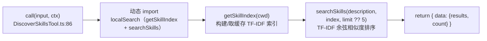
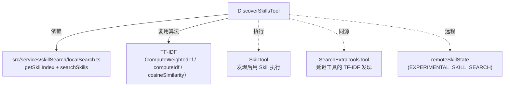

# DiscoverSkillsTool 工具详解

> 这是工具系统逐个拆解系列之一。`DiscoverSkills` 是一个**简单**的只读检索工具：模型用自然语言描述"我想做什么"，工具用 TF-IDF 关键词匹配在所有已注册 skill（bundled/user/MCP）里搜索，返回按相关度排序的 skill 名 + 描述 + 分数。它是 SkillTool 的"发现面"——SkillTool 负责"执行"，DiscoverSkills 负责"找到该执行哪个"。

---

## 一、工具定位（一句话总结）

**`DiscoverSkills` = 按任务描述做 TF-IDF 检索的 skill 发现工具。**

| 维度 | 值 |
|---|---|
| 工具名 | `DiscoverSkills`（常量 `DISCOVER_SKILLS_TOOL_NAME`，`prompt.ts:1`） |
| 一句话 | 输入任务描述，TF-IDF 检索所有 skill，返回 name/description/score 排序列表 |
| 是否进 system prompt | ❌ 不在 `CORE_TOOLS` 白名单（延迟加载） |
| 注册条件 | ⚠️ **feature-gated**：`feature('EXPERIMENTAL_SKILL_SEARCH')`（`src/tools.ts:144-147`） |
| 只读 / 破坏性 | **只读**（`isReadOnly() → true`） |
| 是否可并发 | ✅ **可并发**（`isConcurrencySafe() → true`） |
| 核心依赖 | `src/services/skillSearch/localSearch.ts` 的 `getSkillIndex` + `searchSkills` |
| 定位互补方 | `Skill`（执行找到的 skill）、`SearchExtraTools`（延迟工具的 TF-IDF 发现） |

**为什么需要它？** Claude Code 默认只在 system prompt 里列出少量 skill（受 1% 上下文预算限制，见 SkillTool 的 `formatCommandsWithinBudget`）。当用户任务超出自动呈现的 skill 范围、对话中途切换工作类型、或需要冷门专业 skill 时，模型需要一个**主动搜索**入口。DiscoverSkills 就是这个入口——用 TF-IDF 在全量 skill 索引里找匹配项。

---

## 二、关键文件清单

```
DiscoverSkillsTool/
├── DiscoverSkillsTool.ts   ← buildTool({...}) 主体（107 行，极简）
└── prompt.ts               ← 工具名 + DESCRIPTION + DISCOVER_SKILLS_PROMPT
```

| 文件 | 角色 | 必看行号 |
|---|---|---|
| `DiscoverSkillsTool.ts` | 工具主体：schema + call + 渲染全在这 | `buildTool:32`、`call:86`、`mapToolResultToToolResultBlockParam:64` |
| `prompt.ts` | 工具名 + 描述 + 进 system prompt 的使用说明 | `DISCOVER_SKILLS_TOOL_NAME:1`、`DESCRIPTION:3`、`DISCOVER_SKILLS_PROMPT:6` |

> **结构特点**：这是本系列里**最精简**的工具之一——单文件 107 行，没有独立 UI.tsx（`renderToolUseMessage` 内联在主体里）、没有 validateInput、没有 checkPermissions。所有复杂度都被推到了底层 `localSearch.ts`。

---

## 三、Tool 接口字段实现（`buildTool` 逐字段）

### 标识字段

```ts
name: DISCOVER_SKILLS_TOOL_NAME,        // "DiscoverSkills"
searchHint: 'find search discover skills commands tools capabilities',
maxResultSizeChars: 10_000,
strict: true,                           // 严格模式标记
```

> **`strict: true`**（`:36`）：这是 GlobTool 没有的字段，标记此工具为"严格"——通常意味着 schema 用 `z.strictObject` 且不接受多余字段。

### 模型面字段

```ts
async description() { return DESCRIPTION }          // → API tool schema 描述
async prompt()      { return DISCOVER_SKILLS_PROMPT } // → system prompt 片段
get inputSchema()  { return inputSchema() }          // Zod schema（getter，懒加载）
```

**输入 schema**（`DiscoverSkillsTool.ts:11-23`，`z.strictObject`）：
```ts
{
  description: string   // 必填，任务描述，如"将 Next.js 应用部署到 Cloudflare Workers"
  limit?:     number    // 可选，返回最大结果数，默认 5
}
```

> **无 `outputSchema` getter**：与 GlobTool 不同，DiscoverSkills 没声明 outputSchema。输出结构靠 `mapToolResultToToolResultBlockParam` 直接转文本给模型。

### 行为字段

| 字段 | 实现 | 说明 |
|---|---|---|
| `call()` | `:86` | 核心逻辑（见下节） |
| `isConcurrencySafe()` | `:49` → `true` | 只读检索，可安全并发 |
| `isReadOnly()` | `:52` → `true` | 无副作用 |
| `userFacingName()` | `:56` → `'Discover Skills'` | 用户可见名 |
| 无 `validateInput` | — | 输入极简（只需非空字符串），靠 schema 兜底 |
| 无 `checkPermissions` | — | 只读、无敏感数据，默认允许 |

### 渲染字段

```ts
renderToolUseMessage(input) {
  return `Searching skills: ${input.description?.slice(0, 80) ?? '...'}`
},
mapToolResultToToolResultBlockParam(content, toolUseID) { ... }  // 见下节
```

---

## 四、核心执行流程：`call()`

`call()`（`:86-106`）极简，4 步：



**关键点逐条**：

1. **动态 import**（`:87-89`）：`getSkillIndex` 和 `searchSkills` 用 `await import(...)` 而非静态 import。这是延迟加载策略——避免 skill 搜索模块（含索引构建逻辑）在工具未使用时就被解析。
2. **cwd 获取**（`:90-91`）：`getCwd()` 取当前工作目录，作为索引构建的上下文（不同项目可能有不同的 user-defined skill）。
3. **默认 limit**（`:94`）：`input.limit ?? 5`——未指定时返回前 5 个最相关 skill。
4. **返回结构**（`:96-105`）：`{ data: { results: [{name, description, score}], count } }`——同步返回 `{data}`，不是 async generator。

**`mapToolResultToToolResultBlockParam`**（`:64-84`）：把结构化输出翻译成模型可读文本：
- 空结果（`count === 0`）→ `"No matching skills found for that description."`
- 有结果 → `"Found N relevant skill(s):\n\n1. **name** (score: 0.42)\n   description..."`，用 markdown 编号列表 + 加粗 skill 名 + 分数。

---

## 五、权限与安全

**DiscoverSkills 没有显式的 `validateInput` 和 `checkPermissions`。**

这是合理的，因为：
- **输入极简**：只有一个 `description` 字符串，schema 的 `z.string()` 已足够约束。
- **只读、无敏感数据**：只读 skill 名和描述（这些本就在 system prompt 的 skill 列表里），不读取 skill 内容、不执行任何东西。
- **无副作用**：不修改任何状态。

底层 `getSkillIndex`（`src/services/skillSearch/localSearch.ts:298`）构建索引时也只扫 skill 元数据（name + description + whenToUse），不加载 skill 的完整 markdown 内容。

> **与 SkillTool 的安全对比**：SkillTool 会展开/执行 skill，因此有复杂的权限 cascade + `SAFE_SKILL_PROPERTIES` 白名单。DiscoverSkills 只返回元数据，安全等级低得多，无需权限层。

---

## 六、与其他系统/工具的关系



- **与 SkillTool 的关系**：互补——Discover 找到 skill 名，Skill 执行它。`DISCOVER_SKILLS_PROMPT`（`prompt.ts:6-13`）明确说"当自动呈现的 skill 不够用时"调用本工具，找到后再用 Skill。
- **与 SearchExtraTools 的关系**：同源——两者都用 TF-IDF 检索，只是一个搜 skill、一个搜延迟工具。CLAUDE.md 明确指出 `prefetch.ts` 的 `extractQueryFromMessages` 在 skill prefetch 和工具 prefetch 间复用。
- **与 EXPERIMENTAL_SKILL_SEARCH 的关系**：本工具的注册受此 feature 控制（`src/tools.ts:144`）。该 feature 还控制 SkillTool 的远程 canonical skill 路径（`_canonical_<slug>`）。两者共同构成"skill 搜索"实验功能集。
- **与 TF-IDF 算法的关系**：复用 `localSearch.ts` 的 `computeWeightedTf`/`computeIdf`/`cosineSimilarity`（CLAUDE.md 指出这些函数也被 `toolIndex.ts` 复用，修改时需同步检查）。

---

## 七、亮点与设计取舍

1. **极简单文件设计**（107 行）：所有复杂度下推到 `localSearch.ts`，工具层只做"调 API + 格式化输出"。这是"薄包装"模式的典范——当底层服务已经完善时，工具应该尽可能薄。

2. **动态 import 延迟加载**（`:87-89`）：skill 搜索模块只在 `call()` 真正执行时才加载，减少启动开销。对于一个 feature-gated 的实验工具，这种惰性尤其重要。

3. **feature-gated 注册**（`src/tools.ts:144`）：用 `feature('EXPERIMENTAL_SKILL_SEARCH')` 守卫 + `require()`，非实验构建里这个工具完全不存在。这让实验功能可以安全迭代而不影响稳定版。

4. **`searchHint` 英文关键词**（`:34`）：`'find search discover skills commands tools capabilities'`——虽然本工具 feature-gated，但 searchHint 仍写入，一旦启用就进 TF-IDF 索引提升自然语言命中率。

5. **markdown 格式化的 tool_result**（`:75-83`）：用 `**name**` 加粗、`(score: 0.42)` 显示分数、缩进描述，让模型在 tool_result 里就能清晰看到候选 skill 的相关度排序，便于后续决策调用哪个。

6. **默认 limit=5**（`:94`）：平衡"给够候选"和"不撑爆 context"。skill 列表本就受 1% 预算限制（见 SkillTool prompt.ts），Discover 返回 5 个候选足够模型决策。

---

## 八、源码导航（书签速查）

| 想看什么 | 去哪里 |
|---|---|
| 工具名 + 描述 | `DiscoverSkillsTool/prompt.ts:1,3,6` |
| `buildTool` 字段填充 | `DiscoverSkillsTool/DiscoverSkillsTool.ts:32-107` |
| 输入 schema | `DiscoverSkillsTool.ts:11-23` |
| `call()` 核心逻辑 | `DiscoverSkillsTool.ts:86-106` |
| tool_result 格式化 | `DiscoverSkillsTool.ts:64-84` |
| TF-IDF 索引构建 | `src/services/skillSearch/localSearch.ts:298`（getSkillIndex） |
| TF-IDF 搜索 | `src/services/skillSearch/localSearch.ts:383`（searchSkills） |
| 注册（feature-gated） | `src/tools.ts:144-147` |

---

## 九、学习建议与验证清单

**怎么读这章**：这是本系列最简单的工具之一，5 分钟就能读完。重点理解它**为什么这么薄**——因为复杂度都在 `localSearch.ts`。读完顺便去看 `localSearch.ts` 的 `getSkillIndex` 和 `searchSkills`，能理解 TF-IDF 在 Claude Code 里的复用模式。

**验证清单（读完自测）**：
- [ ] 能说出 DiscoverSkills 与 SkillTool 的分工（发现 vs 执行）
- [ ] 能指出本工具是 feature-gated 的（`EXPERIMENTAL_SKILL_SEARCH`，`src/tools.ts:144`）
- [ ] 能解释为什么没有 `checkPermissions`（只读元数据、无副作用）
- [ ] 能说出默认 limit 是 5（`:94`）
- [ ] 能指出 TF-IDF 算法与 SearchExtraTools 的复用关系

**配合动作**：
1. 启用 `FEATURE_EXPERIMENTAL_SKILL_SEARCH=1`，让 Claude `DiscoverSkills` 描述一个任务，观察返回的 score 排序
2. 在 `call()` 的 `:94` 加日志，观察 `searchSkills` 返回的原始结果结构
3. 阅读 `src/services/skillSearch/localSearch.ts:298` 的 `getSkillIndex`，理解索引如何按 cwd 构建
4. 对比 `SearchExtraToolsTool`，确认两者 TF-IDF 算法函数的复用
