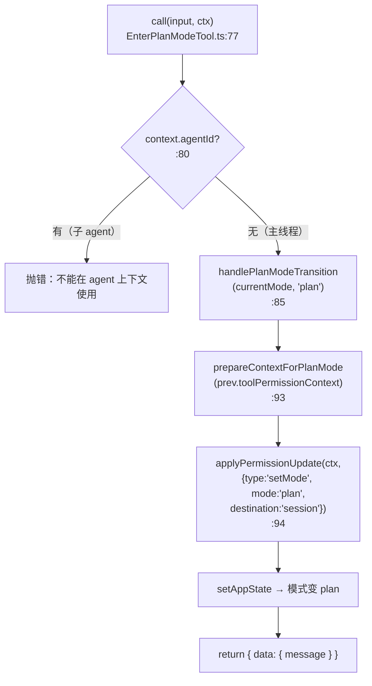
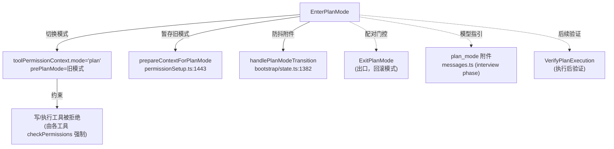

# EnterPlanMode 工具详解

> 这是规划类工具三件套（EnterPlanMode / ExitPlanMode / VerifyPlanExecution）的**入口**。它本身不写任何文件、不执行任何代码，唯一的副作用是**翻转会话的权限模式到 `plan`**，从而在后续整轮对话里把 Claude 关进"只能读、只能想、不能改"的笼子。理解它的关键是把"工具"与"权限模式"解耦：工具只是触发器，真正的约束来自 `plan` 模式下的权限管道。

---

## 一、工具定位（一句话总结）

**`EnterPlanMode` = 把权限模式切换到 `plan` 的只读、可并发的开关型工具。**

| 维度 | 值 |
|---|---|
| 工具名 | `EnterPlanMode`（常量 `ENTER_PLAN_MODE_TOOL_NAME`，`constants.ts:1`） |
| 一句话 | 请求用户批准进入计划模式，进入后 Claude 只能探索和设计，不能写文件 |
| 是否进 system prompt | ✅ 在 `CORE_TOOLS` 白名单内（`src/constants/tools.ts:158`） |
| 只读 / 破坏性 | **只读**（`isReadOnly() → true`，`EnterPlanModeTool.ts:71`） |
| 是否可并发 | ✅ **可并发**（`isConcurrencySafe() → true`，`:68`） |
| 是否延迟加载 | ✅ `shouldDefer: true`（`:55`）——按需注册 |
| 输入参数 | **无**（`z.strictObject({})`，`:21-25`） |
| 启用条件 | 非 channels 模式（`:56-67`）；非 agent 上下文（`:80` 抛错） |
| 协作方 | `ExitPlanMode`（提交计划、退出 plan 模式）、`VerifyPlanExecution`（执行后验证） |

**为什么需要它？** Claude 默认是"边想边写"的——遇到模糊任务容易直接动手改代码，改完才发现方向错了。`EnterPlanMode` 强制在动手前插入一个"探索 + 设计 + 用户签字"的阶段：进入 plan 模式后，写/编辑类工具会被权限管道拒绝，Claude 只能 Glob/Grep/Read 并把方案写到计划文件，再用 `ExitPlanMode` 请求审批。这把"先对齐再实施"固化为工具流程。

---

## 二、关键文件清单

```
EnterPlanModeTool/
├── EnterPlanModeTool.ts   ← buildTool({...}) 主体（128 行），含 call() + mapToolResultToToolResultBlockParam
├── prompt.ts              ← 外部/ant 两版 prompt 工厂（93 行）
├── UI.tsx                 ← Ink 渲染：进入/被拒两种状态（40 行）
├── constants.ts           ← ENTER_PLAN_MODE_TOOL_NAME 常量
└── src/
    ├── constants/figures.ts            ← 类型桩（BLACK_CIRCLE）
    └── utils/permissions/PermissionMode.ts ← 类型桩（getModeColor）
```

| 文件 | 角色 | 必看行号 |
|---|---|---|
| `EnterPlanModeTool.ts` | 主体：schema + call() + 模式切换 + 结果翻译 | `buildTool:36`、`call:77`、`mapToolResultToToolResultBlockParam:105`、`isEnabled:56` |
| `prompt.ts` | 外部用户/ant 内部两套不同的"何时使用"指引 | `getEnterPlanModeToolPromptExternal:16`、`...Ant:53`、`getEnterPlanModeToolPrompt:88` |
| `UI.tsx` | 终端渲染（计划模式小圆点 + 副标题） | `renderToolResultMessage:14`、`renderToolUseRejectedMessage:32` |
| `constants.ts` | 工具名常量 | `:1` |

> **结构特点**：`src/` 下两个文件都是反编译留下的**类型桩**（`export type X = any`），真实实现来自 `src/constants/figures.js` 和 `src/utils/permissions/PermissionMode.js`。读源码时忽略桩，直接看主体文件即可。

---

## 三、Tool 接口字段实现（`buildTool` 逐字段）

EnterPlanModeTool 是一个**无参数、无 `checkPermissions`、无 `validateInput`** 的极简工具——它的"权限"体现在"进入后改变了整个会话的权限模式"，而不是单次调用要审批。

### 标识字段

```ts
name: ENTER_PLAN_MODE_TOOL_NAME,                       // "EnterPlanMode"
searchHint: 'switch to plan mode to design an approach before coding',  // TF-IDF 索引关键词
maxResultSizeChars: 100_000,
shouldDefer: true,                                       // 延迟注册，按需加载
```

> **`shouldDefer: true` 的含义**：本工具不在启动时全量注入 schema，而是放进延迟工具池，由 `SearchExtraTools`/`SyntheticOutput` 的 TF-IDF 搜索按需激活。但它仍在 `CORE_TOOLS` 白名单里（`src/constants/tools.ts:158`），意味着一旦激活就享有核心工具待遇。

### 模型面字段

```ts
async description() { return '请求权限以进入计划模式，用于需要探索和设计的复杂任务' }
async prompt()      { return getEnterPlanModeToolPrompt() }   // 按 USER_TYPE 分流（prompt.ts:88）
get inputSchema()   { return inputSchema() }                  // 空对象 schema
get outputSchema()  { return outputSchema() }                 // { message: string }
userFacingName()    { return '' }                             // 不在 UI 显示工具名
```

**输入 schema**（`:21-25`）——严格空对象：
```ts
z.strictObject({})   // 不接受任何参数
```

**输出 schema**（`:28-32`）：
```ts
{ message: string }   // "已进入计划模式。现在请专注于探索代码库并设计实现方案。"
```

### 行为字段

| 字段 | 实现 | 说明 |
|---|---|---|
| `call()` | `:77-104` | 核心逻辑（见下节） |
| `isEnabled()` | `:56-67` | channels 模式下禁用（防止"进得去出不来"的陷阱） |
| `isConcurrencySafe()` | `:68` → `true` | 无文件副作用，可并发 |
| `isReadOnly()` | `:71` → `true` | 不写盘 |
| **无** `validateInput` | — | 无输入，无需校验 |
| **无** `checkPermissions` | — | **关键设计**：见第五节 |

> 注意 `call()` 第一行（`:80-82`）就检查 `context.agentId`——**子 agent 不允许进入计划模式**，否则会抛错。计划模式是"主线程抽象"（`src/constants/tools.ts:111` 注释）。

### 渲染字段

```ts
renderToolUseMessage,          // 返回 null（调用时不显示）
renderToolResultMessage,       // "● 已进入计划模式"（UI.tsx:14）
renderToolUseRejectedMessage,  // "● 用户拒绝进入计划模式"（UI.tsx:32）
mapToolResultToToolResultBlockParam,  // 给模型下发 plan 模式工作流指引（:105）
```

---

## 四、核心执行流程：`call()`

`call()`（`:77-104`）只做**一件事**——把权限模式翻转到 `plan`，但中间涉及三个协同的状态更新：



**关键点逐条**：

1. **agent 上下文硬拦截**（`:80-82`）：子 agent 调用直接 `throw`。这是因为 plan 模式依赖主线程的审批 UI（`ExitPlanModePermissionRequest`）和会话级 `pendingPlanVerification` 状态，子 agent 没有这些基础设施。

2. **`handlePlanModeTransition`（`:85`）**（`src/bootstrap/state.ts:1382`）：纯会话级状态机维护——切换到 `plan` 时**清除**待处理的 `plan_mode_exit` 附件，防止用户快速进出导致同时下发 `plan_mode` 和 `plan_mode_exit` 两个系统消息。这是过渡状态的"防抖"。

3. **`prepareContextForPlanMode`（`:93`）**（`src/utils/permissions/permissionSetup.ts:1443`）：**真正复杂的部分**。它决定"进入 plan 模式时，原来的权限上下文要怎么暂存"：
   - 若当前已是 `plan`：原样返回（幂等）。
   - 若当前是 `auto`（TRANSCRIPT_CLASSIFIER 启用时）：决定计划期间是否继续用 auto 模式（`shouldPlanUseAutoMode()`）。若用，仅记 `prePlanMode='auto'`；若不用，先 `restoreDangerousPermissions`（auto 模式会剥离危险权限），再记 `prePlanMode='auto'`。
   - 普通 default/acceptEdits：记 `prePlanMode=当前模式`，供 `ExitPlanMode` 恢复。
   
   它会把"进 plan 之前的模式"存进 `toolPermissionContext.prePlanMode`——这是 `ExitPlanMode` 能正确回滚的依据。

4. **`applyPermissionUpdate(... setMode: 'plan')`（`:94`）**（`src/utils/permissions/PermissionUpdate.ts:55`）：把 `context.mode` 字段实际改成 `'plan'`，destination 是 `'session'`（会话级，不持久化到 settings）。

5. **返回**（`:98-103`）：`{ data: { message } }`——同步返回，不是 async generator（没有中间进度）。

**`mapToolResultToToolResultBlockParam`（`:105-127`）**：这个函数才是"给模型戴枷锁"的地方。它把简短的 `message` 翻译成一段**带行为约束的 tool_result**：
- **interview phase 启用时**（`isPlanModeInterviewPhaseEnabled()`）：只附一句 `DO NOT write or edit any files except the plan file. Detailed workflow instructions will follow.`——详细工作流改由 `messages.ts` 里的 `plan_mode` 附件下发（5 阶段访谈式流程）。
- **未启用时**：直接附 6 条工作流（探索→找相似→权衡→AskUserQuestion→设计→ExitPlanMode），并强调 `DO NOT write or edit any files yet`。

> 这段 tool_result 是模型"知道自己在 plan 模式该怎么做事"的唯一来源——它替代了 system prompt 里写死的工作流，因为是否启用 interview phase 是运行时配置。

---

## 五、权限与安全

EnterPlanMode 的权限模型**反直觉地简单**：它本身**没有 `checkPermissions`**。为什么？

### 为什么不需要 `checkPermissions`？

因为这个工具**本身的副作用是良性的**（只是改会话状态，不碰文件、不执行命令），真正的约束发生在**进入 plan 模式之后**——那时所有写/执行类工具的 `checkPermissions` 会因为 `mode === 'plan'` 而被拒绝。换句话说，EnterPlanMode 是"开锁的钥匙"，开完锁之后笼子才关上。

### 进入 plan 模式后的约束（由权限管道强制）

进入 plan 后，`plan` 模式下：
- 写文件工具（FileWrite/FileEdit）→ 被权限管道拒绝
- 执行工具（Bash/PowerShell）→ 被拒绝
- 唯一允许的写入是**计划文件**（`getPlanFilePath()`，`src/utils/plans.ts:123`）

### `isEnabled` 的安全门（`:56-67`）

```ts
if ((feature('KAIROS') || feature('KAIROS_CHANNELS')) && getAllowedChannels().length > 0) {
  return false
}
```

当 `--channels` 启用（用户在 Telegram/Discord 而非 TUI 前）时，**禁用进入**。原因在注释里说得很直白（`:57-59`）：ExitPlanMode 的审批对话框需要终端，channels 模式下用户看不到，会变成"模型能进 plan 但永远出不去"的陷阱。所以入口和出口必须**成对门控**。

### agent 上下文硬拒绝（`:80-82`）

子 agent 调用直接抛错（不是返回错误，是 throw）。这是**编译期 + 运行期双重保险**：理论上延迟工具列表不应该给子 agent 暴露这个工具，但即便暴露了，call 里也会兜底。

### `isReadOnly: true` 的含义

虽然 `call()` 会改 `appState`，但从"是否产生不可逆的外部副作用"角度看它是只读的——不写盘、不联网、不执行命令。标记为只读让它能和其他只读工具并发，也能在更宽的权限模式下被调用。

---

## 六、与其他系统/工具的关系



- **与 `ExitPlanMode` 的关系**：入口与出口**必须成对**。ExitPlanMode 读取 `prePlanMode` 回滚模式（`ExitPlanModeV2Tool.ts:367`）；两者共享同一套 channels 门控（`:60-65` ↔ `:171-178`），否则会形成陷阱。
- **与 `VerifyPlanExecution` 的关系**：弱关联。Verify 是"实施完成后"的验证工具，与 EnterPlanMode 不直接交互，但同属"计划三件套"。
- **与权限管道的关系**：EnterPlanMode 不做权限判定，但它**改写**了权限管道的输入（`mode` 字段），间接决定了后续每个工具的审批行为。
- **与 `planModeV2` 的关系**：`isPlanModeInterviewPhaseEnabled()`（`src/utils/planModeV2.ts:50`）控制 prompt 和 tool_result 的措辞——interview phase 是 5 阶段交互式规划流程，对 ant 用户始终开启，对外部用户由 `tengu_plan_mode_interview_phase` feature flag 控制。
- **与 `Agent` 工具的互斥**：子 agent 不能进 plan（`:80`），所以 plan 模式是**主线程独占**的工作流。

---

## 七、亮点与设计取舍

1. **"工具即模式切换器"的范式**：EnterPlanMode 把"进入一种工作模式"建模成一个工具调用，而不是一个 slash command 或一个配置项。好处是模型可以**自主决定**何时进入（prompt 引导它"对模糊任务主动用"），而不是等用户敲 `/plan`。
2. **入口/出口成对门控**：`isEnabled` 里同时考虑了 ExitPlanMode 的可用性（注释 `:57-59`）。这是一个容易遗漏的健壮性细节——单独门控入口会制造死锁状态。
3. **`prepareContextForPlanMode` 的 auto 模式协调**：进入 plan 时不是简单存 `prePlanMode`，而是要处理"原 auto 模式期间被剥离的危险权限是否要恢复"的复杂情况（`permissionSetup.ts:1443-1474`）。这让 plan 模式与 auto 模式可以正交组合。
4. **interview phase 的运行时分流**：prompt 和 tool_result 都按 `isPlanModeInterviewPhaseEnabled()` 分两套文案，避免硬编码工作流。新增规划流程变体时只改 `planModeV2.ts` 的门控，不动工具代码。
5. **无 `checkPermissions` 的取舍**：简化了工具，但意味着用户无法用 deny rule 单独阻止"进入计划模式"——只能通过拒绝整个工具调用来表达"我不想用 plan"。这是有意的：plan 模式的进入本身不危险，没必要拦。
6. **`mapToolResultToToolResultBlockParam` 承载行为约束**：plan 模式的工作流指引不在 system prompt 里写死，而是作为 tool_result 动态下发，让 ant/external 用户看到不同详细度的指引。

---

## 八、源码导航（书签速查）

| 想看什么 | 去哪里 |
|---|---|
| 工具名常量 | `EnterPlanModeTool/constants.ts:1` |
| `buildTool` 字段填充 | `EnterPlanModeTool.ts:36-128` |
| 输入/输出 schema（空对象 / message） | `EnterPlanModeTool.ts:21-33` |
| `call()` 模式切换核心 | `EnterPlanModeTool.ts:77-104` |
| agent 上下文拦截 | `EnterPlanModeTool.ts:80-82` |
| channels 门控 `isEnabled` | `EnterPlanModeTool.ts:56-67` |
| 模型工作流指引下发 | `EnterPlanModeTool.ts:105-127` |
| prompt 外部版 / ant 版 | `prompt.ts:16` / `prompt.ts:53` |
| prompt 分流入口 | `prompt.ts:88` |
| 进入时权限上下文准备 | `src/utils/permissions/permissionSetup.ts:1443` |
| 模式切换防抖 | `src/bootstrap/state.ts:1382` |
| `applyPermissionUpdate(setMode)` | `src/utils/permissions/PermissionUpdate.ts:55` |
| interview phase 门控 | `src/utils/planModeV2.ts:50` |
| 计划文件路径 | `src/utils/plans.ts:123` |
| CORE_TOOLS 注册 | `src/constants/tools.ts:158` |
| 工具注册（导入） | `src/tools.ts:86` |

---

## 九、学习建议与验证清单

**怎么读这章**：先看"一、工具定位"理解"工具 = 模式切换器"这个不寻常的定位，再跳到"四、call()"看三步状态更新，最后对照"五、权限"理解为什么它没有 `checkPermissions`。

**验证清单（读完自测）**：
- [ ] 能说出 EnterPlanMode 唯一的副作用是什么（把 `mode` 翻到 `plan`，暂存 `prePlanMode`）
- [ ] 能解释为什么 `call()` 要在 `:80` 拦截 agent 上下文（plan 是主线程抽象）
- [ ] 能指出 `handlePlanModeTransition` 解决了什么竞态（快速进出导致 plan_mode / plan_mode_exit 附件同发）
- [ ] 能说出 channels 模式下为什么要禁用进入（ExitPlanMode 审批对话框需要终端，否则形成陷阱）
- [ ] 能找到 `prePlanMode` 存在哪里（`toolPermissionContext.prePlanMode`，由 `prepareContextForPlanMode` 写入）
- [ ] 能解释 interview phase 启用/未启用时 tool_result 下发的差异（精简指引 vs 6 条工作流）

**配合动作**：
1. 让 Claude 对一个模糊任务调用 `EnterPlanMode`，观察 UI 出现"● 已进入计划模式"，然后尝试让它写文件——应被权限管道拒绝。
2. 在 `call()` 的 `:85` 加日志，对比 `prePlanMode` 在 default/acceptEdits/auto 三种起始模式下的值。
3. 设置 `USER_TYPE=ant` 重跑，对比 prompt（`prompt.ts:53`）和 tool_result（`:105`）措辞的变化。
4. 开启 channels（`feature('KAIROS_CHANNELS')`），确认 `isEnabled()` 返回 false、工具不出现。
