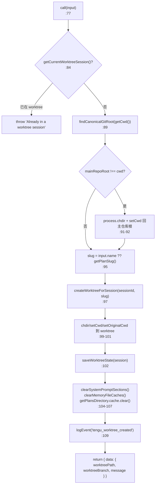
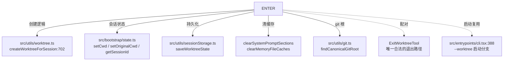

# EnterWorktreeTool 工具详解

> 这是工具系统逐个拆解系列的一篇。`EnterWorktree` 是一个**中等复杂度**的会话级状态变更工具：它不是简单地跑一条 `git worktree add`，而是会重写会话的工作目录、清空依赖 CWD 的各类缓存、并把"当前处于哪个 worktree"记到会话存储里。它和 `ExitWorktree` 是一对——前者负责"进入隔离环境"，后者负责"干净地退出"。读完这篇你会理解 Claude Code 是怎么把 git worktree 包装成"会话级沙箱"的。

---

## 一、工具定位（一句话总结）

**`EnterWorktree` = 创建隔离 worktree 并把会话切进去的入口工具。**

| 维度 | 值 |
|---|---|
| 工具名 | `EnterWorktree`（常量 `ENTER_WORKTREE_TOOL_NAME`，`constants.ts:1`） |
| 一句话 | 用户显式要求"在 worktree 里工作"时，创建 `.claude/worktrees/<name>` 并切换会话工作目录 |
| 是否进 system prompt | ❌ **不在** `CORE_TOOLS` 白名单（延迟工具，`shouldDefer: true`） |
| 注册门控 | `isWorktreeModeEnabled()`（`src/tools.ts:254`）—— 目前在 `worktreeModeEnabled.ts:9` 里**无条件返回 `true`**，对所有用户启用 |
| 只读 / 破坏性 | **有副作用**（创建目录、改动会话全局 CWD），但非破坏性 |
| 是否可并发 | 未声明（默认非并发安全）—— 因为它会改 `process.cwd()` 和会话全局状态 |
| 核心依赖 | `src/utils/worktree.ts` 的 `createWorktreeForSession` |
| 配对工具 | `ExitWorktree`（退出，keep 或 remove） |

**为什么需要它？** 当用户说"开个 worktree 干活"时，模型不应自己拼接 `git worktree add` 命令（容易出错、还忘记同步会话状态）。`EnterWorktree` 一次性完成"创建 worktree + 切目录 + 清缓存 + 记状态"，保证后续所有工具（Read/Bash/Edit）自动落到新 worktree 里。

---

## 二、关键文件清单

```
EnterWorktreeTool/
├── EnterWorktreeTool.ts   ← buildTool({...}) 主体（133 行），全部逻辑都在这
├── prompt.ts              ← getEnterWorktreeToolPrompt()：何时用 / 何时不用 / 参数说明
├── UI.tsx                 ← Ink 渲染（renderToolUseMessage / renderToolResultMessage）
└── constants.ts           ← ENTER_WORKTREE_TOOL_NAME = 'EnterWorktree'
```

| 文件 | 角色 | 必看行号 |
|---|---|---|
| `EnterWorktreeTool.ts` | 工具主体：schema + call() + 结果序列化全在这 | `buildTool:52`、`inputSchema:23`、`call:77`、`mapToolResultToToolResultBlockParam:125` |
| `prompt.ts` | 进 system prompt 的使用指南（中英混合） | `getEnterWorktreeToolPrompt:1` |
| `UI.tsx` | 终端渲染：调用时显示"正在创建 worktree…"，结果展示分支与路径 | `renderToolUseMessage:8`、`renderToolResultMessage:12` |
| `constants.ts` | 工具名常量 | `ENTER_WORKTREE_TOOL_NAME:1` |

> **结构特点**：典型的"单文件主体"型工具——4 个文件、总共约 130 行。复杂度不在工具本身，而在它调用的 `src/utils/worktree.ts`（1518 行，承载真正的 worktree 创建/hook 分发/tmux 挂接逻辑）。

---

## 三、Tool 接口字段实现（`buildTool` 逐字段）

### 标识字段

```ts
name: ENTER_WORKTREE_TOOL_NAME,                       // "EnterWorktree"
searchHint: 'create an isolated git worktree and switch into it',
maxResultSizeChars: 100_000,
shouldDefer: true,                                    // 延迟工具：非核心，按需发现
```

> **`shouldDefer: true`**：虽然 `isWorktreeModeEnabled()` 无条件注册了它，但它不在 `CORE_TOOLS`，因此默认走延迟发现管道（TF-IDF 索引命中"worktree"语义时才进 prompt）。`searchHint` 用英文写就是为了喂给 TF-IDF 索引。

### 模型面字段

```ts
async description() { return '创建一个隔离的 worktree…' }   // → API tool schema 的描述
async prompt()      { return getEnterWorktreeToolPrompt() } // → system prompt 片段（命中后注入）
get inputSchema()   { return inputSchema() }               // Zod schema（getter，懒加载）
get outputSchema()  { return outputSchema() }
userFacingName()    { return '正在创建 worktree' }
```

**输入 schema**（`EnterWorktreeTool.ts:23-39`，`lazySchema` + `z.strictObject`）：
```ts
{
  name?: string   // 可选，worktree 名字；校验器 validateWorktreeSlug 限制字符集与 64 字符上限
}
```

**输出 schema**（`:42-49`）：
```ts
{
  worktreePath:   string,           // 新 worktree 的绝对路径
  worktreeBranch: string?,          // 新建的分支名（hook 模式可能没有）
  message:        string,           // 给模型看的总结
}
```

### 行为字段

| 字段 | 实现 | 说明 |
|---|---|---|
| `call()` | `:77` | 核心逻辑（见下节） |
| `toAutoClassifierInput(input)` | `:72` | 返回 `input.name ?? ''`——自动审批分类器的输入 |
| `renderToolUseMessage` / `renderToolResultMessage` | 来自 `UI.tsx` | 终端展示 |
| `mapToolResultToToolResultBlockParam` | `:125` | 只把 `message` 字段塞进 `tool_result`——路径/分支走 UI 渲染 |

> **注意缺失**：没有 `validateInput`、没有 `checkPermissions`、没有 `isReadOnly`/`isConcurrencySafe`。这是有意为之——`EnterWorktree` 的"权限"是模型自律（prompt 里写明"仅在用户显式说 worktree 时才用"），加上运行时的 `getCurrentWorktreeSession()` 幂等守卫。

---

## 四、核心执行流程：`call()`

`call()` 处于 7 步流水线的**第 6 步**。EnterWorktreeTool 的 `call()`（`:77-124`）：



**关键点逐条**：

1. **幂等守卫**（`:84`）：`getCurrentWorktreeSession()` 来自 `worktree.ts:158`，返回当前会话的 worktree 记录。如果非空说明已经进过 worktree，直接 `throw`——防止嵌套创建。
2. **先回到主仓库根**（`:89-93`）：`findCanonicalGitRoot()` 解析 cwd 的真实 git 根。如果当前 cwd 不在根上（比如用户先 cd 进了子目录），就 `process.chdir` + `setCwd` 回到根。**原因**：`git worktree add` 必须从主仓库执行，即使你已经在某个 worktree 内部。
3. **名字回退**（`:95`）：`input.name ?? getPlanSlug()`——用户没给名字就用 plan 系统生成的随机 slug。`validateWorktreeSlug`（`worktree.ts:66`）在 schema 层就把非法字符挡掉了。
4. **会话状态重写**（`:99-101`）：三连 `process.chdir` → `setCwd` → `setOriginalCwd(getCwd())`。**`setOriginalCwd` 是关键**——它把"原始目录"记成 worktree 路径，这样 `ExitWorktree` 才能知道从哪儿来回哪儿去（详见 `state.ts` 的 `getProjectRoot` 注释）。
5. **持久化 + 清缓存**（`:102-107`）：`saveWorktreeState` 写会话存储；然后清三类缓存——
   - `clearSystemPromptSections()`：让 `env_info_simple` 用新 CWD 重算
   - `clearMemoryFileCaches()`：CLAUDE.md 等记忆文件按 CWD 分层，必须重读
   - `getPlansDirectory.cache.clear?.()`：plans 目录也依赖 CWD
6. **埋点**（`:109`）：`tengu_worktree_created` 带 `mid_session: true`——区分"会话中途进入"与"`--worktree` 启动时进入"。

---

## 五、权限与安全

EnterWorktreeTool **没有 `validateInput` 也没有 `checkPermissions`**——它把安全寄托在三道防线上：

### 1. 模型自律（prompt 约束）

`prompt.ts:2-12` 用强语气限制调用时机：

> Use this tool ONLY when the user explicitly asks to work in a worktree.
> Never use this tool unless the user explicitly mentions "worktree".

明确禁止在"用户要切分支""修 bug"等场景误用——这类需求该走 `git` 命令。

### 2. 幂等守卫（运行时）

`call()` 第一行（`:84`）检查 `getCurrentWorktreeSession()`，已存在 worktree 会话就直接抛错。这是**唯一的硬性运行时门控**。

### 3. 前置条件声明（prompt）

`prompt.ts:16-17` 声明：
- 必须在 git 仓库里，**或**配置了 `WorktreeCreate/WorktreeRemove` hooks
- 不能已经处于 worktree 中

真正的 git 仓库校验、hook 分发都在 `createWorktreeForSession`（`worktree.ts:702`）内部——git 仓库存在性、分支可用性、`.claude/worktrees/` 目录创建都在那里。

> **设计取舍**：把权限/校验下沉到底层 `worktree.ts` 而非工具层，是因为 `--worktree` 启动路径（`cli.tsx:388` / `main.tsx:1642`）也复用同一套逻辑。工具层只负责"会话级编排"。

---

## 六、与其他系统/工具的关系



- **与 `ExitWorktree` 的关系**：这是**强配对**。`ExitWorktree` 的 `validateInput` 用 `getCurrentWorktreeSession()` 做"是否在 worktree 里"的判据——只有 `EnterWorktree`（更准确地说是 `createWorktreeForSession`）会设置这个值。手动 `git worktree add` 不会触发它，因此 `ExitWorktree` 对手动 worktree 是空操作。
- **与 `--worktree` 启动的关系**：CLI 启动时的 `--worktree` 分支（`cli.tsx:388`）走的是同一套底层函数，但路径不同——启动时由 `setup.ts` 直接 `setCwd` + `setProjectRoot`，而工具走的是会话中途的编排逻辑。
- **与会话状态系统**：直接写 `setCwd` / `setOriginalCwd`，这是会话全局可变状态。`setOriginalCwd` 的值会被 `ExitWorktree` 读出来作为"回去的路"。
- **与缓存系统**：三类 CWD 相关缓存都要清，否则后续工具会读到旧目录的 CLAUDE.md / plans。

---

## 七、亮点与设计取舍

1. **`shouldDefer: true` + 无条件注册的张力**：`isWorktreeModeEnabled()` 无条件返回 `true`（`worktreeModeEnabled.ts:9`，注释提到早期 GrowthBook 门控导致首启缓存未就绪时 `--worktree` 被静默吞掉的 bug #27044），所以工具一定被注册；但仍标记 `shouldDefer`，让它在不需要时不占 prompt token。
2. **`setOriginalCwd(worktreePath)` 的反直觉设计**：进入时把"原始目录"记成 worktree 自己的路径——这是为了让 `ExitWorktree` 能区分"会话中途进入"与"`--worktree` 启动"两种场景（详见 `ExitWorktreeTool.ts:244-251` 长注释）。
3. **缓存清理是进入的一部分**：不清 `clearSystemPromptSections` / `clearMemoryFileCaches`，模型下一轮就会基于旧 CWD 推理。把缓存失效放进 `call()` 而非依赖调用方，是健壮性设计。
4. **权限下沉到 `worktree.ts`**：工具层没有 `checkPermissions`，看似"裸奔"，实则因为底层 `createWorktreeForSession` 已经处理了 git 仓库校验、hook 分发、tmux 挂接——工具层加一道权限只会重复。
5. **prompt 的强语气**：用"ONLY when explicitly asks""Never use unless explicitly mentions"——这是用 prompt 约束模型行为，而非运行时拦截。代价是模型偶尔会误判，但收益是体验顺滑（不需要每次确认）。

---

## 八、源码导航（书签速查）

| 想看什么 | 去哪里 |
|---|---|
| 工具名常量 | `EnterWorktreeTool/constants.ts:1` |
| `buildTool` 字段填充 | `EnterWorktreeTool.ts:52-132` |
| 输入/输出 schema | `EnterWorktreeTool.ts:23-50` |
| `call()` 核心逻辑 | `EnterWorktreeTool.ts:77-124` |
| 幂等守卫 | `EnterWorktreeTool.ts:84` |
| 会话状态重写 | `EnterWorktreeTool.ts:99-101` |
| 缓存清理 | `EnterWorktreeTool.ts:104-107` |
| 进 prompt 的使用指南 | `prompt.ts:1-30` |
| 注册门控 | `src/tools.ts:254`（`isWorktreeModeEnabled()`） |
| 门控实现 | `src/utils/worktreeModeEnabled.ts:9` |
| 底层创建逻辑 | `src/utils/worktree.ts:702`（`createWorktreeForSession`） |

---

## 九、学习建议与验证清单

**怎么读这章**：先看"一、工具定位"理解它为什么存在，再看"四、call()"理解它做了什么会话级副作用，最后对照"六、关系图"理解它和 `ExitWorktree` 的强配对。

**验证清单（读完自测）**：
- [ ] 能说出为什么 `shouldDefer: true` 但工具仍然一定被注册（`isWorktreeModeEnabled` 无条件 true）
- [ ] 能解释 `call()` 第一行为什么要先查 `getCurrentWorktreeSession()`（幂等守卫，防嵌套）
- [ ] 能指出 `setOriginalCwd(worktreePath)` 看似反直觉但服务于 `ExitWorktree` 的区分逻辑
- [ ] 能列出 `call()` 清空的三类缓存（system prompt sections / memory files / plans directory）
- [ ] 能说出为什么没有 `checkPermissions`（权限下沉到 `worktree.ts` + prompt 自律）
- [ ] 能指出 prompt 里"ONLY when user explicitly asks"的强语气约束作用

**配合动作**：
1. 在 git 仓库里让 Claude `EnterWorktree`，观察 `.claude/worktrees/<name>` 是否被创建、cwd 是否切换
2. 连续调用两次 `EnterWorktree`，验证第二次抛 "Already in a worktree session"
3. 调用后让 Claude `Read` 一个 CLAUDE.md，确认读到的是 worktree 内的版本（验证缓存清理生效）
4. 对照阅读 `ExitWorktreeTool.ts:174-224` 的 `validateInput`，理解配对工具如何识别"这是 EnterWorktree 创建的"
