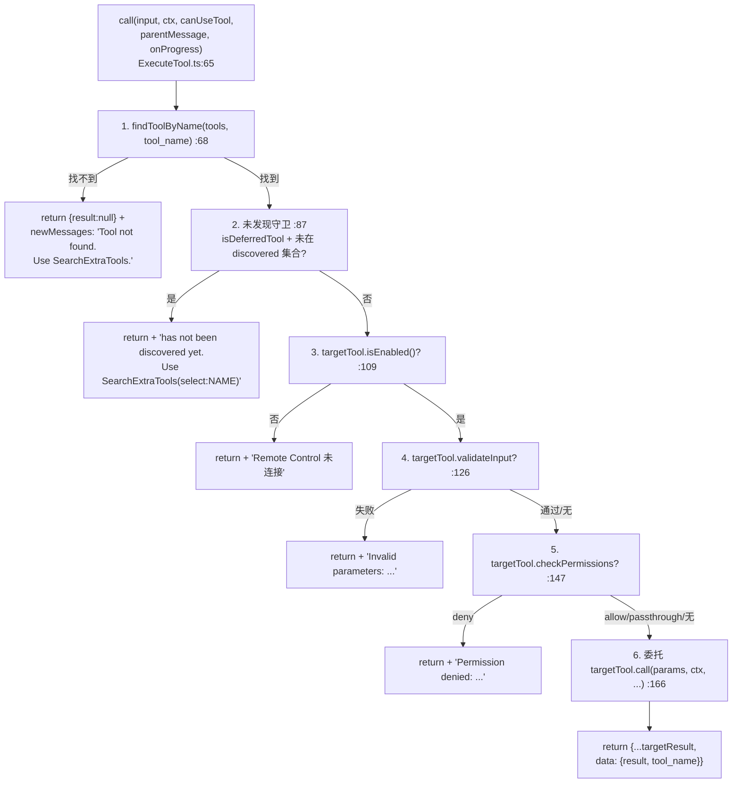
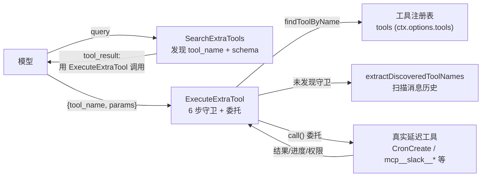

# ExecuteExtraTool（ExecuteTool）详解

> 这是**延迟工具发现三件套**的第二件（Search → **Execute** → Synthetic）。`ExecuteExtraTool` 是一个**中等复杂度**的委托型工具：它本身是核心工具（始终加载），但自己**不做任何实际工作**——它的全部职责是按 `{tool_name, params}` 在工具注册表里找到目标延迟工具，把执行（连同权限、校验、进度）**原样委托**过去。它是模型与延迟工具之间的**唯一桥梁**。

---

## 一、工具定位（一句话总结）

**`ExecuteExtraTool` = 延迟工具的统一执行代理，模型调用延迟工具的唯一合法通道。**

| 维度 | 值 |
|---|---|
| 工具名 | `ExecuteExtraTool`（常量 `EXECUTE_TOOL_NAME`，`constants.ts:1`） |
| 一句话 | 接收 `{tool_name, params}`，查注册表找到目标工具，原样委托执行 |
| 是否进 system prompt | ✅ 在 `CORE_TOOLS` 白名单内（`src/constants/tools.ts:177`），**始终注册**（`tools.ts:282`） |
| 只读 / 破坏性 | **取决于目标工具**（自身 `isReadOnly` 未设，`isConcurrencySafe → false` 保守） |
| 是否可并发 | ❌ **不可并发**（`isConcurrencySafe() → false`，保守起见——目标工具可能有副作用） |
| 核心依赖 | `findToolByName`（注册表查找）+ 目标工具自身的 `call/validateInput/checkPermissions` |
| 定位互补方 | `SearchExtraTools`（先发现）、`StructuredOutput`（独立的结构化输出工具） |

**为什么需要它？** 延迟工具（非核心内置 + 所有 MCP 工具）默认对模型不可见——它们不在 API 请求的 tools 数组里（见 `claude.ts:1252`）。模型无法直接调用它们。解法是：模型先用 `SearchExtraTools` 发现工具名和 schema，再用 `ExecuteExtraTool` 把参数打包传进来，由 ExecuteExtraTool 在本地查注册表、走完整权限/校验/执行流水线后委托给真实工具。这样既省了 context（延迟工具定义不进 prompt），又保留了完整的权限和安全控制。

---

## 二、关键文件清单

```
ExecuteTool/
├── ExecuteTool.ts   ← buildTool({...}) 主体（201 行），委托流水线全在这
├── prompt.ts        ← DESCRIPTION（API schema 描述）+ getPrompt()（system prompt 片段）
├── constants.ts     ← EXECUTE_TOOL_NAME 常量（仅 1 行）
└── __tests__/       ← 测试目录
```

| 文件 | 角色 | 必看行号 |
|---|---|---|
| `ExecuteTool.ts` | 主体：schema + 委托 call() + 权限透传 + 结果包装 | `buildTool:46`、`call:65`、守卫链 68-163、委托 `:166`、`checkPermissions:182` |
| `prompt.ts` | 描述 + 两步工作流教学提示 | `DESCRIPTION:3`、`getPrompt:6-37` |
| `constants.ts` | 工具名常量 | `:1` |

> **结构特点**：单文件主体型。逻辑虽然只有 201 行，但 `call()` 里有一条**6 步守卫链**（找不到/未发现/未启用/校验失败/权限拒绝/委托），是理解"委托型工具如何保证安全"的范本。

---

## 三、Tool 接口字段实现（`buildTool` 逐字段）

### 标识字段

```ts
name: EXECUTE_TOOL_NAME,              // "ExecuteExtraTool"
searchHint: 'execute run invoke call a deferred tool by name with parameters',
maxResultSizeChars: 100_000,
userFacingName() { return 'ExecuteExtraTool' }
```

> **`searchHint` 的作用**：虽然 ExecuteExtraTool 是核心工具（不延迟），但 `searchHint` 仍会进 TF-IDF 索引——当模型用"执行/调用某个工具"类自然语言描述时，提升命中本工具的概率（权重 2.5，见 `toolIndex.ts:33`）。

### 并发与权限字段

```ts
isConcurrencySafe() { return false }   // 保守：目标工具可能有副作用
```

注意：**没有** `isReadOnly`、`isEnabled`、`validateInput`、`getPath` 字段——这些都由**目标工具**自己负责。ExecuteExtraTool 只做透传。

### 模型面字段

```ts
async description() { return DESCRIPTION }   // → API tool schema 描述
async prompt()      { return getPrompt() }    // → system prompt 片段
get inputSchema()   { return inputSchema() }
get outputSchema()  { return outputSchema() }
```

**输入 schema**（`:22-33`）：
```ts
{
  tool_name: string                    // 必填，目标工具名（如 "CronCreate"、"mcp__slack__send_message"）
  params: Record<string, unknown>      // 必填，传给目标工具的参数对象
}
```

> `params` 用 `z.record(z.string(), z.unknown())`——**任意键值对**，因为目标工具的 schema 是动态的，ExecuteExtraTool 在静态层面无法预知。真正的参数校验发生在委托前的 `targetTool.validateInput`（`:126`）。

**输出 schema**（`:36-41`）：
```ts
{
  result: unknown,     // 目标工具的原始 data
  tool_name: string    // 回显目标工具名
}
```

### 行为字段（重点）

| 字段 | 实现 | 说明 |
|---|---|---|
| `call()` | `:65` | 6 步守卫 + 委托（见下节） |
| `checkPermissions()` | `:182` | 返回 `passthrough`——**权限下放给目标工具** |
| `renderToolUseMessage` | `:188` | 显示 `${tool_name}` |
| `mapToolResultToToolResultBlockParam` | `:194` | `JSON.stringify(content)`——原始 JSON 返回 |

---

## 四、核心执行流程：`call()`

`call()`（`:65-181`）是委托型工具的教科书实现。它不是"做事"，而是"**把事安全地交给对的人做**"。6 步守卫链 + 1 步委托：



**6 步守卫逐条**：

1. **工具查找**（`:68-81`）：`findToolByName(tools, input.tool_name)` 在完整工具注册表里找。找不到 → 返回空结果 + `newMessages`（一条 `createUserMessage` 引导模型去 SearchExtraTools）。注意：返回的是 `{data, newMessages}` 结构，`newMessages` 会被注入对话流，让模型看到错误提示。
2. **未发现守卫**（`:87-106`）：这是**核心安全设计**。只有当三个条件全满足时才拦截——`isSearchExtraToolsEnabledOptimistic()`（搜索启用）+ `isSearchExtraToolsToolAvailable(tools)`（SearchExtraTools 在列表里）+ `isDeferredTool(targetTool)`（目标是延迟工具）。然后用 `extractDiscoveredToolNames(context.messages)` 扫描消息历史，看这个工具有没有被 SearchExtraTools 发现过。**没发现就拒绝**——因为模型根本没见过它的 schema，直接调几乎必因参数错误崩溃。注释（`:83-86`）明确说明这是防"参数校验错误"的护栏。
3. **启用检查**（`:109-121`）：`targetTool.isEnabled()`——有些工具（如 Remote Control 相关）可能在运行时不可用。
4. **输入校验**（`:126-144`）：`targetTool.validateInput`——**委托前先校验**，避免把脏参数喂给目标工具导致崩溃。注释（`:123-125`）举了真实 bug 例子：`TeamCreate` 缺 `team_name` → `sanitizeName(undefined).replace()` 抛 TypeError。
5. **权限检查**（`:147-163`）：`targetTool.checkPermissions`——**权限下放给目标工具**自己判。返回 `deny` 就拒绝。
6. **委托执行**（`:166-180`）：`await targetTool.call(params, context, canUseTool, parentMessage, onProgress)`——把 ExecuteExtraTool 收到的 `context`、`canUseTool`、`parentMessage`、`onProgress` **原样透传**给目标工具，保证进度回调、权限回调、上下文完全一致。返回 `{...targetResult, data: {result, tool_name}}`——保留目标工具的 `newMessages` 等字段，只重写 `data`。

> **关键洞察**：步骤 2-5 的任何失败都**不抛异常**，而是返回 `{data: {result: null, tool_name}, newMessages: [...]}`——把错误信息作为新的 user message 注入对话。这让模型能自然地在下一轮看到错误并纠正，而不是触发顶层错误处理。

---

## 五、权限与安全

ExecuteExtraTool 的权限设计是**"透传 + 护栏"**的典范：

### `checkPermissions` 返回 `passthrough`（`:182-187`）

```ts
async checkPermissions() {
  return {
    behavior: 'passthrough',
    message: 'ExecuteExtraTool delegates permission to the target tool.',
  }
}
```

**`passthrough` 的含义**：ExecuteExtraTool 自己不做权限决策，告诉调用方"权限请去找目标工具"。配合 `call()` 内部的步骤 5（`:147` 主动调 `targetTool.checkPermissions`），形成**双重保险**——即便外层权限管道放行了 ExecuteExtraTool，内层还会再问一次目标工具。

### 未发现守卫（`:87-106`）—— 最重要的安全设计

延迟工具必须先被发现才能执行。这条守卫防止模型绕过 SearchExtraTools 直接盲调延迟工具（例如从记忆里"猜"工具名）。`extractDiscoveredToolNames`（`searchExtraTools.ts:489`）扫描消息历史，支持三种发现来源：旧版 `tool_reference` 块、`SearchExtraTools` 的文本输出（正则 `^Found \d+ deferred tool\(s\): (.+)\.$`）、以及 `deferred_tools_delta` 附件。

### 输入校验前置（`:126`）

委托前先跑目标的 `validateInput`——这是防御性编程，避免目标工具因参数错误崩溃（注释里的 `TeamCreate` 例子是真实踩坑）。

### `isConcurrencySafe → false` 的保守选择

ExecuteExtraTool 不知道目标工具有没有副作用，索性标记不可并发——宁可损失并发性，也不冒险让两个有副作用的工具调用交织。

---

## 六、与其他系统/工具的关系（三件套协作链路）



- **与 `SearchExtraTools` 的关系（强耦合，二步工作流）**：Search 发现 → Execute 执行。`prompt.ts:15-29` 反复强调这个工作流。Search 的 `mapToolResultToToolResultBlockParam` 输出文本会明确引导 `"请使用 ExecuteExtraTool"`。Execute 的步骤 2 守卫**强制**要求工具必须先被 Search 发现。
- **与 `extractDiscoveredToolNames`（`searchExtraTools.ts:489`）的关系**：这是"发现集"的唯一来源。Execute 用它判断工具是否已被发现；`claude.ts` 用它决定哪些延迟工具在后续请求里重新可见。
- **与工具注册表（`ctx.options.tools`）的关系**：Execute 从 `context.options.tools`（`:66`）拿完整工具列表——注意是**完整列表**（含延迟工具），不是模型可见的精简列表。延迟工具虽然对模型不可见，但确实在进程内的注册表里，Execute 靠 `findToolByName` 找到它们。
- **与 `StructuredOutput`（SyntheticOutputTool）的关系**：**独立**。StructuredOutput 是 SDK 结构化输出的动态工具，与延迟工具发现链路无关（详见 SyntheticOutputTool 报告）。
- **与 `claude.ts` 请求层的关系**：`claude.ts:1244-1252` 注释明确——延迟工具永远不进 API tools 数组，"改用 ExecuteExtraTool"。Execute 是它们进入执行的唯一入口。

---

## 七、亮点与设计取舍

1. **"不做实事，只做安全委托"**（`:166`）：`call()` 的核心就一行 `targetTool.call(...)`，但前面 100 行都是守卫。这是委托型工具的正确姿态——价值在护栏，不在逻辑。
2. **`passthrough` 权限 + 内层再校验的双重保险**（`:147` + `:182`）：外层管道放行后，内层还会主动调目标工具的 `checkPermissions`。即便某个调用路径绕过了外层，内层仍兜底。
3. **未发现守卫强制两步工作流**（`:87-106`）：这是把"两步工作流"从**文档约定**升级为**代码强制**——模型不能跳过 Search 直接盲调延迟工具。注释（`:83-86`）点出真实动机：防参数校验崩溃。
4. **错误用 `newMessages` 而非异常**（步骤 1-5）：所有失败都返回 `{data: {result:null}, newMessages: [createUserMessage(...)]}`。错误信息作为新 user message 注入对话，模型在下一轮自然能看到并纠正——比抛异常更友好，不会触发顶层错误处理的中断逻辑。
5. **完整透传 context/canUseTool/onProgress**（`:166-172`）：目标工具拿到的上下文和"被直接调用时"完全一致——进度回调、权限回调、父消息都不丢失。这让 ExecuteExtraTool 对目标工具是**透明**的。
6. **`params` 用 `z.record(z.string(), z.unknown())`**（`:30`）：静态层面不约束参数（因为目标 schema 动态），把校验责任下放给 `targetTool.validateInput`——职责清晰。
7. **`isConcurrencySafe → false` 的保守取舍**：牺牲并发性换安全。如果未来能给目标工具加"是否可并发"的标记，这里可以优化为动态判断。
8. **`userFacingName` 显示 `ExecuteExtraTool`**（`:191`）：与工具目录名 `ExecuteTool` 不同——这是历史命名，对模型/用户统一展示为 `ExecuteExtraTool`。

---

## 八、源码导航（书签速查）

| 想看什么 | 去哪里 |
|---|---|
| 工具名常量 | `ExecuteTool/constants.ts:1` |
| API 描述 + system prompt | `ExecuteTool/prompt.ts:3`、`:6-37` |
| `buildTool` 字段填充 | `ExecuteTool/ExecuteTool.ts:46-201` |
| 输入/输出 schema | `ExecuteTool.ts:22-44` |
| `call()` 6 步守卫链 | `ExecuteTool.ts:65-181` |
| 工具查找（步骤 1） | `:68-81` |
| 未发现守卫（步骤 2） | `:87-106` |
| 启用检查（步骤 3） | `:109-121` |
| 输入校验（步骤 4） | `:126-144` |
| 权限检查（步骤 5） | `:147-163` |
| 委托执行（步骤 6） | `:166-180` |
| `checkPermissions` passthrough | `:182-187` |
| 发现集提取逻辑 | `src/utils/searchExtraTools.ts:489-556` |
| 延迟工具排除出 API | `src/services/api/claude.ts:1244-1331` |

---

## 九、学习建议与验证清单

**怎么读这章**：先看"一、工具定位"建立"委托型工具"的心智，再顺着"四、call()"的 6 步守卫链读下来——每一步都是一个安全检查点。最后对照"五、权限"理解 `passthrough` + 内层校验的双重保险。

**验证清单（读完自测）**：
- [ ] 能说出三件套协作链路：Search 发现 → **Execute 执行**（StructuredOutput 独立）
- [ ] 能按顺序列出 `call()` 的 6 步守卫（查找/未发现/启用/校验/权限/委托）
- [ ] 能解释为什么未发现守卫要满足三个条件才拦截（搜索启用 + SearchExtraTools 可用 + 目标是延迟工具）
- [ ] 能说出 `checkPermissions` 返回 `passthrough` 的含义（权限下放给目标工具）
- [ ] 能解释为什么失败用 `newMessages` 而非抛异常（友好注入对话，不中断）
- [ ] 能指出 `params` 用 `z.record` 的原因（目标 schema 动态，校验下放）
- [ ] 能说出 `isConcurrencySafe → false` 的保守动机（不知目标有无副作用）

**配合动作**：
1. 让 Claude 走完整两步：`SearchExtraTools(select:CronCreate)` → `ExecuteExtraTool(CronCreate, {...})`，观察 ExecuteExtraTool 的 tool_result
2. 尝试让模型跳过 Search 直接 `ExecuteExtraTool(CronCreate, {})`，验证未发现守卫拦截（步骤 2）
3. 在 `call()` 的 `:166` 委托前后加日志，对比 ExecuteExtraTool 透传的 context 与目标工具直接调用时是否一致
4. 故意传错参数（如 CronCreate 缺 schedule），验证步骤 4 的 `validateInput` 前置校验生效
