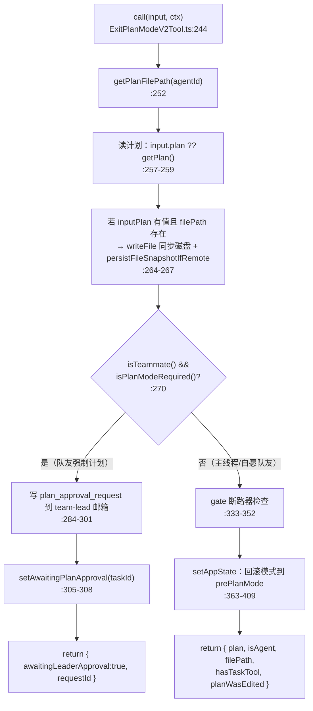
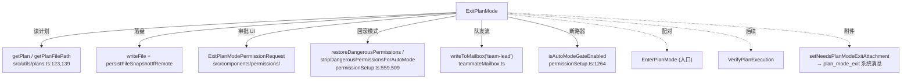

# ExitPlanMode 工具详解

> 这是规划三件套中**最复杂**的一个（主体 `ExitPlanModeV2Tool.ts` 共 499 行）。它表面上是"退出 plan 模式"，实际要同时处理四件事：从磁盘读计划、请求用户审批、回滚权限模式（含 auto 模式断路器协调）、以及"队友向团队负责人提交审批"的多代理协作流。它是少数 `isReadOnly() → false` 且 `requiresUserInteraction() → true` 的工具——因为它会写计划文件、且必须等用户点"批准"。

---

## 一、工具定位（一句话总结）

**`ExitPlanMode` = 提交计划请求审批、并在批准后把权限模式从 `plan` 回滚到 `prePlanMode` 的工具。**

| 维度 | 值 |
|---|---|
| 工具名 | `ExitPlanMode`（常量 `EXIT_PLAN_MODE_V2_TOOL_NAME`，`constants.ts:2`） |
| 一句话 | 从计划文件读计划→请求用户审批→批准则回滚模式、拒绝则留在 plan |
| 是否进 system prompt | ✅ 在 `CORE_TOOLS` 白名单内（`src/constants/tools.ts:159`） |
| 只读 / 破坏性 | **非只读**（`isReadOnly() → false`，`:182`——会写计划文件到磁盘） |
| 是否可并发 | ✅ **可并发**（`:179`） |
| 是否延迟加载 | ✅ `shouldDefer: true`（`:166`） |
| 是否需要用户交互 | ✅ `requiresUserInteraction() → true`（`:185`——需用户批准，队友除外） |
| 核心依赖 | `getPlan` / `getPlanFilePath`（`src/utils/plans.ts`）、`prepareContextForPlanMode` 的逆操作 |
| 协作方 | `EnterPlanMode`（入口）、`VerifyPlanExecution`（实施后验证） |

**为什么需要它？** Plan 模式是一个"笼子"——进去后只能探索不能改。必须有一个明确的"出口"仪式：Claude 把方案写到计划文件，调用 ExitPlanMode 把内容呈现给用户，用户批准后才解锁写权限、进入实施阶段。没有这个出口，Claude 会永远困在只读模式里。

---

## 二、关键文件清单

```
ExitPlanModeTool/
├── ExitPlanModeV2Tool.ts   ← buildTool({...}) 主体（499 行），所有逻辑集中于此
├── prompt.ts               ← EXIT_PLAN_MODE_V2_TOOL_PROMPT（外部存根版，23 行）
├── UI.tsx                  ← Ink 渲染：批准/空计划/等负责人/被拒四种状态（87 行）
├── constants.ts            ← 两个工具名常量（V1/V2 同名 'ExitPlanMode'）
└── src/
    ├── components/Markdown.ts                          ← 类型桩
    ├── components/MessageResponse.ts                   ← 类型桩
    ├── components/messages/UserToolResultMessage/      ← 类型桩
    │   └── RejectedPlanMessage.ts
    ├── constants/figures.ts                            ← 类型桩
    └── utils/permissions/PermissionMode.ts             ← 类型桩
```

| 文件 | 角色 | 必看行号 |
|---|---|---|
| `ExitPlanModeV2Tool.ts` | 主体：schema + call() + 权限 + 模式回滚 + 队友审批流 | `buildTool:147`、`validateInput:195`、`checkPermissions:222`、`call:244`、`mapToolResultToToolResultBlockParam:425` |
| `prompt.ts` | 外部用户看到的工具描述 | `EXIT_PLAN_MODE_V2_TOOL_PROMPT:6` |
| `UI.tsx` | 终端渲染（四种状态分支） | `renderToolResultMessage:19`、`renderToolUseRejectedMessage:75` |
| `constants.ts` | V1/V2 同名常量 | `:1-2` |

> **结构特点**：`src/` 下五个文件**全部是反编译类型桩**（`export type X = any`），真实实现来自 `src/components/Markdown.js` 等。主体逻辑全部集中在 `ExitPlanModeV2Tool.ts`，文件名带 `V2` 是因为存在过一个 V1 版本（已废弃，但常量保留）。

---

## 三、Tool 接口字段实现（`buildTool` 逐字段）

ExitPlanMode 实现了 `Tool` 接口的**几乎所有字段**，且每个字段都有非平凡逻辑——它是观察"一个完整的、带审批流的工具长什么样"的最佳样本。

### 标识字段

```ts
name: EXIT_PLAN_MODE_V2_TOOL_NAME,                    // "ExitPlanMode"
searchHint: '提交计划等待审批并开始编码（仅计划模式）',
maxResultSizeChars: 100_000,
shouldDefer: true,                                      // 延迟注册
```

### 模型面字段

```ts
async description() { return '提示用户退出计划模式并开始编码' }
async prompt()      { return EXIT_PLAN_MODE_V2_TOOL_PROMPT }
get inputSchema()   { return inputSchema() }
get outputSchema()  { return outputSchema() }
userFacingName()    { return '' }
```

**输入 schema**（`:77-89`）——宽松对象，带 `allowedPrompts`：
```ts
z.strictObject({
  allowedPrompts: z.array({ tool: z.enum(['Bash']), prompt: z.string() }).optional()
}).passthrough()   // ← 注意 passthrough，允许额外字段
```

> `allowedPrompts` 是"基于提示词的语义化权限"——模型可以声明"实现这个计划需要 bash 运行测试、装依赖"，用户批准计划时这些操作类别也被预授权（存进 `appState.allowedPrompts`，见 `AppStateStore.ts:413`）。`.passthrough()` 是为了兼容 SDK/normalizeToolInput 注入的 `plan`/`planFilePath` 字段。

**SDK 专用 schema `_sdkInputSchema`**（`:97-108`）：在内部 schema 基础上 `extend` 出 `plan` 和 `planFilePath`——这两个字段**不来自模型**，而是由 `normalizeToolInput` 从磁盘注入。内部 `inputSchema` 省略它们是因为计划从磁盘读，但 SDK/hooks 看到的是标准化版本。

**输出 schema**（`:110-142`）：
```ts
{
  plan: string | null,              // 呈现给用户的计划
  isAgent: boolean,                 // 是否在 agent 上下文
  filePath?: string,                // 计划保存路径
  hasTaskTool?: boolean,            // 是否可用 Agent 工具（决定是否提示拆团队）
  planWasEdited?: boolean,          // 用户是否编辑过计划（CCR/Ctrl+G）
  awaitingLeaderApproval?: boolean, // 队友已提交给负责人
  requestId?: string,               // 审批请求 ID
}
```

### 行为字段（重点）

| 字段 | 实现 | 说明 |
|---|---|---|
| `call()` | `:244-424` | 核心逻辑（见下节） |
| `validateInput()` | `:195-221` | 校验是否在 plan 模式（非 plan 直接拒绝） |
| `checkPermissions()` | `:222-240` | 非队友 `behavior:'ask'`，队友 `behavior:'allow'` |
| `requiresUserInteraction()` | `:185-194` | 非队友 `true`，队友 `false` |
| `isEnabled()` | `:167-178` | channels 模式禁用（与 EnterPlanMode 成对） |
| `isConcurrencySafe()` | `:179` → `true` | 可并发 |
| `isReadOnly()` | `:182` → `false` | **会写计划文件到磁盘** |
| `mapToolResultToToolResultBlockParam()` | `:425-498` | 四种分支：等审批 / agent / 空计划 / 正常批准 |

---

## 四、核心执行流程：`call()`

`call()`（`:244-424`）是全工具最复杂的函数，按"队友流 vs 主线程流"分两大分支：



**关键点逐条**：

1. **计划来源优先级**（`:257-259`）：
   ```ts
   const inputPlan = 'plan' in input && typeof input.plan === 'string' ? input.plan : undefined
   const plan = inputPlan ?? getPlan(context.agentId)
   ```
   - 优先用 CCR web UI / Ctrl+G 编辑后的 `input.plan`（用户可能改过）
   - 否则从磁盘 `getPlan()` 读
   - 类型收窄是必要的，因为内部 `inputSchema` 用 `.passthrough()` 不保证 `plan` 字段类型

2. **磁盘同步**（`:264-267`）：如果用户编辑过计划（`inputPlan !== undefined`），先 `writeFile` 落盘，再 `persistFileSnapshotIfRemote()`——后者是为远程（CCR）环境快照文件系统，让后续 `VerifyPlanExecution` / `Read` 能看到编辑后的版本。注释 `:261` 解释：这是**第二次**快照，第一次在 `api.ts` 的 `normalizeToolInput` 里（捕获的是旧计划）。

3. **队友负责人审批流**（`:270-319`）：这是多代理协作的核心。当调用者是"强制需要计划的队友"（`isPlanModeRequired()`）时：
   - 生成唯一 `requestId`（`generateRequestId('plan_approval', agentId)`）
   - 构造 `plan_approval_request` 消息（含 planFilePath、planContent、requestId）
   - `writeToMailbox('team-lead', ...)` 发到负责人邮箱
   - 若是进程内队友，`setAwaitingPlanApproval(taskId, true)` 标记任务状态
   - 返回 `awaitingLeaderApproval: true`——模型看到"等待审批，不要继续"

4. **auto 模式断路器协调**（`:333-352`）：主线程流里最微妙的逻辑。如果 `prePlanMode === 'auto'` 但**现在**断路器/设置禁用了 auto（`isAutoModeGateEnabled()` 返回 false），不能直接恢复到 auto——否则 ExitPlanMode 会绕过断路器。于是：
   - 回退到 `'default'`
   - 取回退原因和通知文案
   - `addNotification` 推一条 `plan exit → default · <reason>` 警告给用户

5. **模式回滚（`:363-409`）**：`setAppState` 内部做一整套上下文修复：
   - `setHasExitedPlanMode(true)` + `setNeedsPlanModeExitAttachment(true)`——标记会话已退出，触发 `plan_mode_exit` 系统附件
   - `restoreMode = prePlanMode ?? 'default'`（断路器 fallback 后可能变 `'default'`）
   - auto 模式激活状态同步：`setAutoModeActive(finalRestoringAuto)`，若计划期间用过 auto 但现在不恢复，触发 `setNeedsAutoModeExitAttachment`
   - **权限规则恢复**：恢复到非 auto → `restoreDangerousPermissions`（把进 plan 时剥离的危险 allow 规则加回来）；恢复到 auto → 再次 `stripDangerousPermissionsForAutoMode`
   - 最终 `{ ...baseContext, mode: restoreMode, prePlanMode: undefined }`

6. **`hasTaskTool` 检测**（`:411-413`）：检查当前工具集里有没有 `Agent` 工具——有则在 tool_result 里提示"可拆分为团队并行执行"（`:476-478`）。

**`mapToolResultToToolResultBlockParam`（`:425-498`）** 四分支：
- **等负责人审批**（`:438-456`）：告诉模型"等邮箱、别继续"
- **agent 上下文**（`:458-465`）：`用户已批准，回复 ok`（agent 流程简化）
- **空计划**（`:468-474`）：`用户已批准退出计划模式`
- **正常批准**（`:487-497`）：回显完整计划 + 保存路径 + 团队提示。注意 `:483` 始终回显计划——注释说 Ultraplan CCR 流程的 `extractApprovedPlan()` 会解析 tool_result 取计划文本，所以不能省略。

---

## 五、权限与安全

ExitPlanMode 的权限模型是三件套里最丰富的，因为它涉及用户审批、跨代理通信、模式回滚。

### `validateInput`（`:195-221`，第 3 步）

```ts
if (isTeammate()) return { result: true }              // 队友跳过
const mode = getAppState().toolPermissionContext.mode
if (mode !== 'plan') {
  logEvent('tengu_exit_plan_mode_called_outside_plan', {...})
  return { result: false, message: '你不在计划模式中...', errorCode: 1 }
}
```

- **队友直接放行**（`:199-201`）：因为队友的 AppState 可能显示负责人的模式（`runAgent.ts` 在 acceptEdits/bypassPermissions/auto 下跳过覆盖），`isPlanModeRequired()` 才是真实来源。
- **非 plan 模式硬拒**（`:206-219`）：延迟工具列表无论什么模式都会**宣布**这个工具（这样计划批准后、压缩/清空 context 的新增量里仍能调用），所以必须在 `validateInput` 里（`checkPermissions` 之前）拦截，避免弹审批对话框。同时打 `tengu_exit_plan_mode_called_outside_plan` 埋点。

> 这是 `validateInput` 的典型高级用法：**在权限之前拒绝，避免无意义的审批 UI**。

### `checkPermissions`（`:222-240`，第 4 步）

```ts
if (isTeammate()) return { behavior: 'allow', updatedInput: input }
return { behavior: 'ask', message: '退出计划模式？', updatedInput: input }
```

- 队友 `allow`——因为队友的审批走邮箱（`call()` 里处理），不走本地 UI
- 非队友 `ask`——弹 `ExitPlanModePermissionRequest` 对话框，用户批准/拒绝/编辑（Ctrl+G）计划

### `requiresUserInteraction`（`:185-194`）

返回 `true`（非队友）意味着这个工具**在没有 TUI 的环境（headless/SDK）里需要特殊处理**——通常表现为"挂起等待 API 调用方决议"。队友返回 `false` 因为审批异步走邮箱。

### auto 模式断路器防御（`:333-352`）

这是安全关键设计。注释 `:330-332` 解释得很清楚：如果没有这段防御，ExitPlanMode 会通过直接 `setAutoModeActive(true)` **绕过断路器**——断路器本应在 auto 模式失控时把它打回 default。所以这里主动检测 `isAutoModeGateEnabled()`，gate 关了就强制回退 default 并通知用户。

### 队友邮箱通信安全

`writeToMailbox('team-lead', ...)`（`:293-301`）是跨进程通信——`plan_approval_request` 携带完整计划内容。安全性依赖邮箱机制本身（`src/utils/teammateMailbox.ts`），本工具只负责构造合规消息体。

---

## 六、与其他系统/工具的关系



- **与 `EnterPlanMode` 的关系**：严格的逆操作。Enter 存 `prePlanMode`，Exit 读 `prePlanMode` 回滚；两者共享 channels 门控，缺一会形成"进得去出不来"或"出得去但没人进"的状态。
- **与 `VerifyPlanExecution` 的关系**：ExitPlanMode 批准后，实施完成的验证由 VerifyPlanExecution 做。`ExitPlanModePermissionRequest.tsx:423` 会在批准时提醒模型"实施完后必须调用 VerifyPlanExecution"。
- **与权限管道的关系**：ExitPlanMode 是少数**自己改写 `toolPermissionContext`** 的工具（大部分工具只读不写）。它调用 `restoreDangerousPermissions` / `stripDangerousPermissionsForAutoMode` 直接操纵 allow 规则集。
- **与 `prepareContextForPlanMode` 的镜像**：注释 `:1488` 明确说权限恢复逻辑"镜像 prepareContextForPlanMode 的进入时排除"——进和出必须对称。
- **与 AppState 的关系**：写入 `pendingPlanVerification`（`AppStateStore.ts:417`）、`allowedPrompts`（`:413`）等会话级状态。
- **与 Ultraplan/CCR 的关系**：`mapToolResultToToolResultBlockParam` 的 `:480-482` 注释提到 Ultraplan CCR 流程的 `extractApprovedPlan()` 解析 tool_result——所以计划文本必须始终回显。

---

## 七、亮点与设计取舍

1. **一个工具承载四条流程**：正常用户审批、CCR 编辑后审批、agent 简化流、队友负责人审批——全部塞进一个 `call()`，靠 `isTeammate()` / `isPlanModeRequired()` / `context.agentId` 分支。复杂但避免了拆四个工具的碎片化。
2. **`validateInput` 在 `checkPermissions` 之前拦截**（`:206`）：延迟工具无论模式都宣布，所以必须在审批前判断"你到底在不在 plan 模式"，否则会弹无意义的对话框。这是延迟工具机制的必要补救。
3. **auto 模式断路器防御**（`:333-352`）：体现了"工具不能绕过系统级安全机制"的原则。ExitPlanMode 本可以简单恢复 `prePlanMode`，但主动检测 gate 状态，宁可回退 default 也不破坏断路器。
4. **`.passthrough()` schema**（`:88`）：内部 schema 用 passthrough 是为了接纳 normalizeToolInput 注入的 `plan`/`planFilePath`。同时导出 `_sdkInputSchema`（`:97`）给 SDK/hooks 一个有类型的视图——同一份数据两种 schema 视角。
5. **计划始终回显**（`:480-497`）：看似冗余（用户刚批准，为什么 tool_result 还要全文回显？），实际是为了 Ultraplan CCR 的 `extractApprovedPlan()` 能从 tool_result 解析计划。这是"消费方驱动"的兼容性设计。
6. **队友/主线程分流**：`requiresUserInteraction` 和 `checkPermissions` 都按 `isTeammate()` 分流——队友不需要本地 UI（审批异步走邮箱），主线程必须弹对话框。这让同一个工具既能服务单人规划，又能服务多代理协作。
7. **`isReadOnly: false` 的诚实**：尽管主体是状态切换，但因为 `writeFile` 落盘，诚实标记为非只读。这影响并发调度和权限分类。

---

## 八、源码导航（书签速查）

| 想看什么 | 去哪里 |
|---|---|
| 工具名常量（V1/V2 同名） | `ExitPlanModeTool/constants.ts:1-2` |
| `buildTool` 字段填充 | `ExitPlanModeV2Tool.ts:147-499` |
| 输入 schema（allowedPrompts + passthrough） | `ExitPlanModeV2Tool.ts:64-89` |
| SDK schema（注入 plan/planFilePath） | `ExitPlanModeV2Tool.ts:97-108` |
| 输出 schema（7 字段） | `ExitPlanModeV2Tool.ts:110-142` |
| `call()` 主逻辑 | `ExitPlanModeV2Tool.ts:244-424` |
| 计划来源优先级 | `ExitPlanModeV2Tool.ts:257-259` |
| 队友负责人审批流 | `ExitPlanModeV2Tool.ts:270-319` |
| auto 断路器 fallback | `ExitPlanModeV2Tool.ts:333-361` |
| 模式回滚 + 权限恢复 | `ExitPlanModeV2Tool.ts:363-409` |
| `validateInput`（plan 模式校验） | `ExitPlanModeV2Tool.ts:195-221` |
| `checkPermissions`（ask/allow 分流） | `ExitPlanModeV2Tool.ts:222-240` |
| tool_result 四分支 | `ExitPlanModeV2Tool.ts:425-498` |
| 外部 prompt | `ExitPlanModeTool/prompt.ts:6` |
| 计划文件路径 | `src/utils/plans.ts:123` |
| 计划读取 | `src/utils/plans.ts:139` |
| 权限恢复/剥离 | `src/utils/permissions/permissionSetup.ts:559,509` |
| auto gate 检测 | `src/utils/permissions/permissionSetup.ts:1264` |
| 审批 UI（含 VerifyPlan 提醒） | `src/components/permissions/ExitPlanModePermissionRequest/ExitPlanModePermissionRequest.tsx:423` |
| CORE_TOOLS 注册 | `src/constants/tools.ts:159` |
| 工具注册（导入） | `src/tools.ts:64` |

---

## 九、学习建议与验证清单

**怎么读这章**：先看"一、工具定位"理解"ExitPlanMode 不只是退出，是审批+回滚+协作三合一"，再跳到"四、call()"按两大分支（队友/主线程）分别读，最后对照"五、权限"理解 `validateInput` / `checkPermissions` / `requiresUserInteraction` 三个字段的分工。

**验证清单（读完自测）**：
- [ ] 能说出 ExitPlanMode 的计划来源优先级（input.plan > 磁盘 getPlan）
- [ ] 能解释为什么 `validateInput` 要在 `checkPermissions` 之前拒绝非 plan 调用（延迟工具无论模式都宣布）
- [ ] 能指出 auto 模式断路器 fallback 解决了什么问题（防止 ExitPlanMode 绕过断路器恢复 auto）
- [ ] 能说出队友流和主线程流在 `checkPermissions` 上的差异（队友 allow，主线程 ask）
- [ ] 能解释 `prePlanMode` 在回滚时的作用（决定恢复到哪个模式 + 是否恢复危险权限）
- [ ] 能找到 `mapToolResultToToolResultBlockParam` 的四个分支（等审批/agent/空计划/正常批准）
- [ ] 能说出为什么计划要始终回显（Ultraplan CCR 的 extractApprovedPlan 依赖 tool_result）

**配合动作**：
1. 进 plan 模式写个计划，调用 `ExitPlanMode`，观察审批对话框；批准后确认模式回到 `prePlanMode`。
2. 在 `call()` 的 `:363` 加日志，对比 default/acceptEdits/auto 三种起始模式下的 `restoreMode` 和权限恢复行为。
3. 在 auto 模式 + 断路器关闭的场景下调用 ExitPlanMode，观察 `:353` 的 `addNotification` 警告。
4. 用 Ctrl+G 在审批对话框里编辑计划，确认 `planWasEdited=true` 且磁盘被 `writeFile` 更新（`:264`）。
5. 若启用 teammate 功能，构造一个 `isPlanModeRequired()` 队友调用 ExitPlanMode，确认 `plan_approval_request` 写入 team-lead 邮箱（`:293`）。
