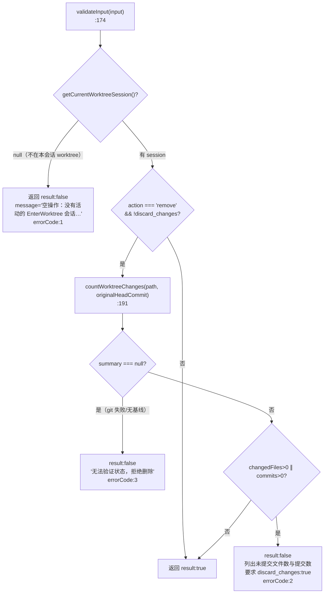
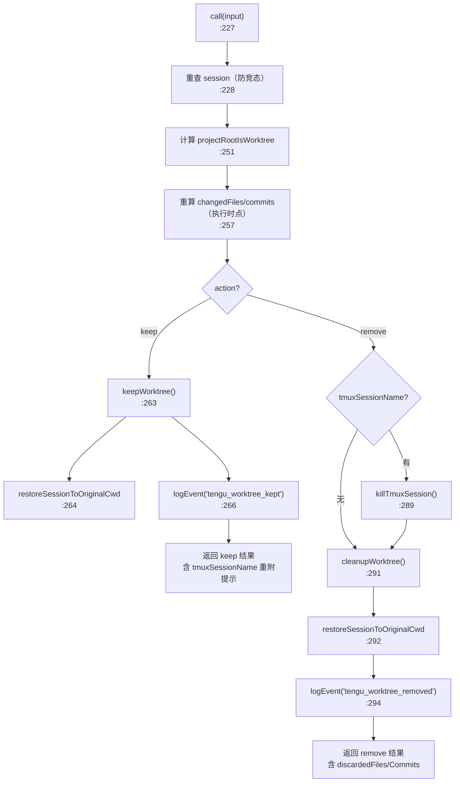
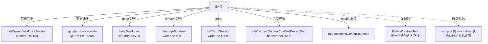

# ExitWorktreeTool 工具详解

> 这是工具系统逐个拆解系列的一篇。`ExitWorktree` 是一个**复杂度较高**的"清理型"工具：它要做的不只是删个目录，还要安全地判定"worktree 里有没有未提交工作"、还原会话状态、处理 tmux 会话、区分"--worktree 启动 vs 会话中期进入"两种进入路径。它的 `validateInput` 是系列里少见的"失败即关闭"安全门控样本。读完这篇你会理解 Claude Code 如何用一道道守卫确保"退出 worktree 不会误删用户工作"。

---

## 一、工具定位（一句话总结）

**`ExitWorktree` = 安全退出当前会话的 worktree，按用户选择保留或删除。**

| 维度 | 值 |
|---|---|
| 工具名 | `ExitWorktree`（常量 `EXIT_WORKTREE_TOOL_NAME`，`constants.ts:1`） |
| 一句话 | 退出本会话由 `EnterWorktree` 创建的 worktree，恢复原始 cwd；`remove` 时按需清理目录/分支/tmux |
| 是否进 system prompt | ❌ 不在 `CORE_TOOLS`（延迟工具，`shouldDefer: true`） |
| 注册门控 | `isWorktreeModeEnabled()`（`src/tools.ts:254`），与 EnterWorktree 同门 |
| 只读 / 破坏性 | `keep` → 非破坏；`remove` → **破坏性**（`isDestructive: action === 'remove'`，`:168`） |
| 异步代理可用 | ✅ 在 `ASYNC_AGENT_ALLOWED_TOOLS` 白名单（`src/constants/tools.ts:87`） |
| 核心依赖 | `src/utils/worktree.ts` 的 `keepWorktree` / `cleanupWorktree` / `killTmuxSession` |
| 配对工具 | `EnterWorktree`（唯一合法的进入路径） |

**为什么需要它？** 进 worktree 容易，干净地退出来难——用户可能在 worktree 里改了文件、提了 commit、开了 tmux。`ExitWorktree` 把这些"善后"全部封装：保留时通知 tmux 还在跑、删除前强制要求 `discard_changes: true`、还原会话状态到进入前的样子。

---

## 二、关键文件清单

```
ExitWorktreeTool/
├── ExitWorktreeTool.ts   ← buildTool({...}) 主体（331 行），含 validateInput 安全门控
├── prompt.ts             ← getExitWorktreeToolPrompt()：范围/何时用/参数/行为
├── UI.tsx                ← Ink 渲染（区分 keep/remove 的结果展示）
└── constants.ts          ← EXIT_WORKTREE_TOOL_NAME = 'ExitWorktree'
```

| 文件 | 角色 | 必看行号 |
|---|---|---|
| `ExitWorktreeTool.ts` | 工具主体：schema + 安全守卫 + call() 全在这 | `buildTool:148`、`validateInput:174`、`call:227`、`countWorktreeChanges:79`、`restoreSessionToOriginalCwd:122` |
| `prompt.ts` | 中文使用指南，明确"仅操作本会话 EnterWorktree 创建的 worktree" | `getExitWorktreeToolPrompt:1` |
| `UI.tsx` | 终端渲染：keep 显示"已保留 worktree"，remove 显示"已删除 worktree" | `renderToolResultMessage:12` |
| `constants.ts` | 工具名常量 | `EXIT_WORKTREE_TOOL_NAME:1` |

> **结构特点**：本目录里行数最多（331 行）的 ExitWorktreeTool.ts 把"变更计数"和"会话状态还原"两个辅助函数也内联了进来——因为它们和工具语义强绑定，不值得拆到 `worktree.ts` 里。

---

## 三、Tool 接口字段实现（`buildTool` 逐字段）

### 标识字段

```ts
name: EXIT_WORKTREE_TOOL_NAME,                    // "ExitWorktree"
searchHint: '退出 worktree 会话并返回原始目录',
maxResultSizeChars: 100_000,
shouldDefer: true,
isDestructive(input) { return input.action === 'remove' },   // ← 动态破坏性
```

> **`isDestructive` 是函数而非常量**：这是系列里少见的"输入相关破坏性"判定。`remove` 才算破坏性，`keep` 不是。这让权限系统可以按输入差异化提示用户。

### 模型面字段

```ts
async description() { return '退出由 EnterWorktree 创建的 worktree 会话…' }
async prompt()      { return getExitWorktreeToolPrompt() }
userFacingName()    { return '退出 worktree' }
```

**输入 schema**（`:30-44`，`z.strictObject`）：
```ts
{
  action: 'keep' | 'remove',       // 必填
  discard_changes?: boolean,       // remove 时若有未提交工作，必须显式 true
}
```

**输出 schema**（`:47-58`）：
```ts
{
  action: 'keep' | 'remove',
  originalCwd: string,             // 进入前的目录（还原目标）
  worktreePath: string,
  worktreeBranch?: string,
  tmuxSessionName?: string,        // keep 时仍存活的 tmux 名
  discardedFiles?: number,         // remove 时丢弃的未提交文件数
  discardedCommits?: number,       // remove 时丢弃的提交数
  message: string,
}
```

### 行为字段

| 字段 | 实现 | 说明 |
|---|---|---|
| `call()` | `:227` | 核心逻辑（见下节） |
| `validateInput(input)` | `:174` | **安全门控**：范围守卫 + 变更守卫（见下节） |
| `isDestructive(input)` | `:168` | `action === 'remove'` 才算破坏 |
| `toAutoClassifierInput(input)` | `:171` | 返回 `input.action`（keep/remove） |
| `mapToolResultToToolResultBlockParam` | `:323` | 只塞 `message`，路径信息走 UI |

> **注意缺失**：没有 `checkPermissions`、没有 `isReadOnly`/`isConcurrencySafe`。安全全部寄托在 `validateInput` 的两道守卫上。

---

## 四、核心执行流程

### `validateInput`（`:174-224`，第 3 步）—— 安全门控

这是 ExitWorktreeTool 最值得学的地方，包含**两道守卫**：



**守卫 1：范围守卫**（`:180-188`）

`getCurrentWorktreeSession()` 为 null 时直接拒绝，`message` 明确写"空操作"——不报错，只是说明没事可做。这是为了**不误伤**手动 `git worktree add` 或先前会话创建的 worktree。

**守卫 2：变更守卫**（`:190-221`）

`action: 'remove'` 且未带 `discard_changes: true` 时，调用 `countWorktreeChanges`：
- 返回 `null`（git 失败 / 无 baseline commit）→ `errorCode: 3`，**失败即关闭**——绝不假设 0/0 就安全（见 `:78` 注释）。
- `changedFiles > 0 || commits > 0` → `errorCode: 2`，列出具体数量，要求显式确认。

### `countWorktreeChanges`（`:79-113`）—— 失败即关闭的计数器

```ts
async function countWorktreeChanges(worktreePath, originalHeadCommit):
  Promise<{ changedFiles, commits } | null>
```

- `git status --porcelain` 非零退出 → `null`
- `originalHeadCommit` 为 undefined（hook 包装的 worktree，`worktree.ts:525-532` 未设置）→ `null`（不能算 commits，保守失败）
- `git rev-list --count <base>..HEAD` 非零 → `null`

> **设计哲学**（`:67-78` 注释）：宁可让用户重试，也不静默 0/0 删掉真实工作。这是"安全门控"的教科书实现。

### `call()`（`:227-322`，第 6 步）

通过 validateInput 后，`call()` 分两路：



**关键点**：

1. **重查 session 防竞态**（`:228-233`）：`validateInput` 与 `call()` 之间模块级可变状态可能变化，再次 `getCurrentWorktreeSession()` 为 null 时 `throw`。
2. **`projectRootIsWorktree` 判定**（`:251`）：`getProjectRoot() === getOriginalCwd()` 用来区分"会话中期进入"（false，不动 projectRoot）与"`--worktree` 启动进入"（true，要还原 projectRoot + 重读 hooks 配置）。`ExitWorktreeTool.ts:244-251` 的长注释详细解释了为什么不能用 `getCwd()`（BashTool 每次改）也不能用 `session.worktreePath`（不是 realpath）。
3. **执行时点重算变更**（`:257`）：validateInput 时的状态可能已过期，`call()` 里再算一次用于埋点和消息。此时 `null` 回退到 0/0 是安全的（守卫已经在 validateInput 做过了）。
4. **tmux 处理差异**：`keep` 时 tmux 继续跑，`message` 带重附命令（`:272-273`）；`remove` 时先 `killTmuxSession` 再 `cleanupWorktree`。

### `restoreSessionToOriginalCwd`（`:122-146`）—— EnterWorktree 的逆操作

5 步还原：
1. `setCwd(originalCwd)`
2. `setOriginalCwd(originalCwd)`（EnterWorktree 把它设成了 worktree，这里重置回真正原始路径）
3. 仅 `projectRootIsWorktree` 时：`setProjectRoot(originalCwd)` + `updateHooksConfigSnapshot()`（对称还原 `--worktree` 启动时的 hooks 重读）
4. `saveWorktreeState(null)`（清掉会话 worktree 记录）
5. 三类缓存清理（system prompt / memory / plans）

---

## 五、权限与安全

ExitWorktreeTool 把安全全部寄托在 `validateInput`，没有 `checkPermissions`：

### 范围安全（防误删他人 worktree）

`getCurrentWorktreeSession()`（`worktree.ts:158`）只在 `createWorktreeForSession` 里被设置。这意味着：
- 手动 `git worktree add` → `ExitWorktree` 空操作（不报错，提示"没有活动会话"）
- 先前会话进入的 worktree → 同样空操作

`prompt.ts:6-11` 明确划清边界：
> 此工具仅操作由本会话中 EnterWorktree 创建的 worktree。它不会触及你手动用 git worktree add 创建的 worktree、来自先前会话的 worktree……

### 数据安全（防误删未提交工作）

`countWorktreeChanges` 的"失败即关闭"策略是核心：
- git 状态读不出来 → 拒绝删除（`errorCode: 3`）
- 有未提交文件或未合并提交 → 要求 `discard_changes: true`（`errorCode: 2`）

`discard_changes` 默认 false，且 prompt（`prompt.ts:23`）要求模型在重设该参数前必须**与用户确认**——这是双重保险。

### 破坏性标记

`isDestructive(input)` 返回 `action === 'remove'`，让权限/UI 系统能对 `remove` 路径特别警示。

---

## 六、与其他系统/工具的关系



- **与 `EnterWorktree` 的关系**：强配对。ExitWorktreeTool.ts:127-129 注释明确指出 `restoreSessionToOriginalCwd` 是 `EnterWorktreeTool.call()` 会话级变更的**逆操作**。
- **与会话状态系统**：直接写 `setCwd`/`setOriginalCwd`/`setProjectRoot`，并触发 `updateHooksConfigSnapshot`——比 EnterWorktree 多动一个 `projectRoot`（条件性）。
- **与 tmux 系统**：keep 时保留 tmux 名字供用户重附，remove 时主动 kill——这是 `--tmux + --worktree` 组合启动的善后。
- **与 `ASYNC_AGENT_ALLOWED_TOOLS`**：两个 worktree 工具都在异步代理白名单（`src/constants/tools.ts:86-87`），说明它们被设计成可被子代理使用。

---

## 七、亮点与设计取舍

1. **"失败即关闭" 的安全门控**（`:67-78` 注释）：`countWorktreeChanges` 返回 null 时**绝不静默 0/0**。这是防数据丢失的关键——注释明确说"静默的 0/0 会让 cleanupWorktree 销毁真实工作"。
2. **`isDestructive` 动态化**（`:168-170`）：把破坏性绑定到 `action` 字段，让权限系统能差异化对待 keep/remove。这是工具接口灵活性的体现。
3. **进入路径区分**（`:244-251`）：用 `projectRoot === originalCwd` 这一招区分"会话中期进入"与"`--worktree` 启动进入"，并据此决定是否还原 projectRoot 和重读 hooks。注释解释了为什么不能用更直观的 `getCwd()`（BashTool 改动）或 `session.worktreePath`（非 realpath）。
4. **重查防竞态**（`:228-233`）：validateInput 通过不代表 call 时 session 还在——模块级可变状态要求关键守卫在 call 里重做一遍。
5. **执行时点重算**（`:257`）：埋点和消息用执行时点的真实变更数，而非 validateInput 时的快照——保证埋点准确。
6. **tmux 善后不对称**：keep 时保留 tmux 名字让用户重附，remove 时主动 kill——符合"保留 = 一切照旧，删除 = 彻底清理"的直觉。
7. **prompt 的范围声明**（`prompt.ts:6-11`）：明确写"不会触及手动创建/先前会话的 worktree"，把工具的"作用域"讲清楚——这是减少模型误用的有效手段。

---

## 八、源码导航（书签速查）

| 想看什么 | 去哪里 |
|---|---|
| 工具名常量 | `ExitWorktreeTool/constants.ts:1` |
| `buildTool` 字段填充 | `ExitWorktreeTool.ts:148-330` |
| 输入/输出 schema | `ExitWorktreeTool.ts:30-60` |
| `validateInput` 安全门控 | `ExitWorktreeTool.ts:174-224` |
| `countWorktreeChanges`（失败即关闭） | `ExitWorktreeTool.ts:79-113` |
| `restoreSessionToOriginalCwd` | `ExitWorktreeTool.ts:122-146` |
| `call()` 核心逻辑 | `ExitWorktreeTool.ts:227-322` |
| 进入路径区分注释 | `ExitWorktreeTool.ts:244-251` |
| 进 prompt 的范围声明 | `prompt.ts:6-11` |
| 注册门控 | `src/tools.ts:254` |
| 底层 keep/cleanup/killTmux | `src/utils/worktree.ts:780,813,693` |

---

## 九、学习建议与验证清单

**怎么读这章**：先读"一、工具定位"理解它为何是 EnterWorktree 的镜像，再精读"四、validateInput"理解两道安全守卫，最后看"四、call()"末尾的进入路径区分注释（这是全文最精妙的设计）。

**验证清单（读完自测）**：
- [ ] 能说出 `validateInput` 的两道守卫（范围守卫 + 变更守卫）
- [ ] 能解释为什么 `countWorktreeChanges` 返回 null 时要拒绝删除（失败即关闭，防静默 0/0 销毁工作）
- [ ] 能指出 `isDestructive` 为何是函数而非常量（绑定 `action === 'remove'`）
- [ ] 能说出 `projectRootIsWorktree` 判定的作用（区分会话中期进入 vs `--worktree` 启动）
- [ ] 能解释为什么 `call()` 里要重查 `getCurrentWorktreeSession()`（防 validateInput 与 call 之间的竞态）
- [ ] 能说出 tmux 在 keep/remove 两种路径下的不同处理（keep 保留+提示重附，remove 主动 kill）
- [ ] 能指出为什么 `discard_changes` 默认 false 且 prompt 要求重设前与用户确认（双重防误删）

**配合动作**：
1. 先 `EnterWorktree`，在 worktree 里改一个文件不提交，再尝试 `ExitWorktree { action: 'remove' }`——验证 `errorCode: 2` 守卫触发
2. 上面场景用 `discard_changes: true` 重试，验证 worktree 被删除、cwd 还原
3. 在非 worktree 会话里直接调 `ExitWorktree`，验证"空操作"提示（`errorCode: 1`）
4. 对照阅读 `EnterWorktreeTool.ts:99-107`，理解"进入时的状态变更"如何对应"退出时的还原步骤"
