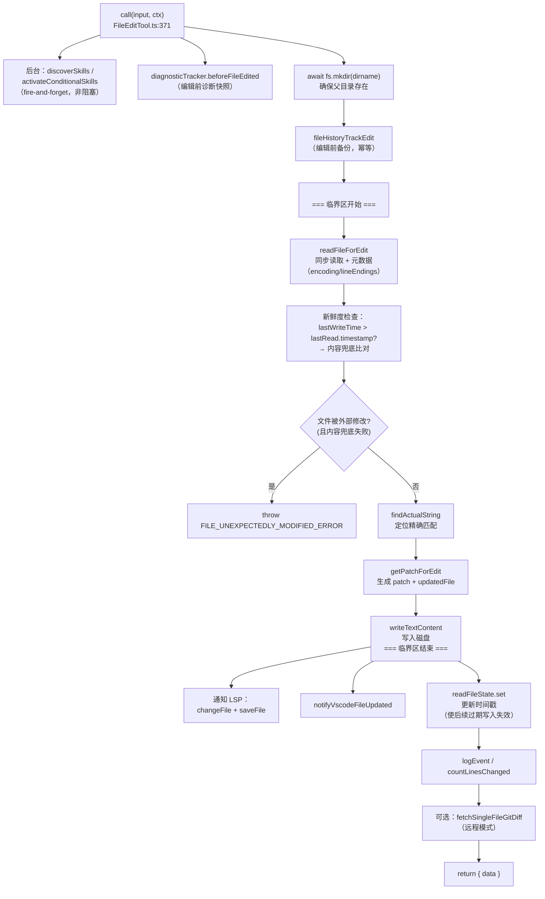
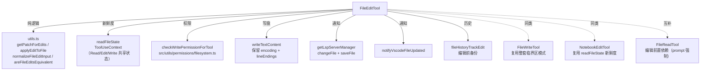

# FileEditTool（Edit）工具详解

> 这是工具系统逐个拆解系列的**写工具旗舰篇**。`Edit`（`FILE_EDIT_TOOL_NAME = 'Edit'`）执行**就地精确字符串替换**：给定 `old_string` 与 `new_string`，在文件中定位并替换。它是所有"修改型"工具的**最标准模板**——`readFileState` 新鲜度检查、原子"读-改-写"临界区、diff 补丁生成、LSP/VSCode 通知、UNC 路径豁免、二进制/超大文件拦截这些模式，几乎被 FileWriteTool、NotebookEditTool 原样复用。读懂这一个，其他写工具就是看差异。

---

## 一、工具定位（一句话总结）

**`Edit` = 按精确字符串在已存在文件中做就地替换的写工具。**

| 维度 | 值 |
|---|---|
| 工具名 | `Edit`（常量 `FILE_EDIT_TOOL_NAME`，`constants.ts:2`） |
| 一句话 | 给定 `old_string`→`new_string`，在文件中做精确字符串替换，返回结构化 diff |
| 是否进 system prompt | ✅ 默认注册且常用（`tools.ts:230`）；名字 `Edit` 未在 `CORE_TOOLS` 白名单数组中显式列出，但 `CLAUDE_CODE_SIMPLE` 模式仅保留 `[Bash, Read, Edit]`（`tools.ts:329`）——地位核心 |
| 只读 / 破坏性 | **破坏性**（写盘，无 `isReadOnly()` → 默认 false） |
| 是否可并发 | ❌ **不可并发**（无 `isConcurrencySafe()` → 默认 false，写操作天然冲突） |
| 核心依赖 | `utils.ts:getPatchForEdit`、`src/utils/fileRead.ts:readFileSyncWithMetadata`、`src/utils/file.ts:writeTextContent` |
| 定位互补方 | `Write`（整文件覆盖）、`NotebookEdit`（.ipynb 单元格）、`Read`（编辑前置依赖） |

**为什么需要它？** 模型修改代码时，发送整个文件内容（用 Write）会浪费大量 token，且容易在大文件上引入无关变更。`Edit` 只发送 **diff**——`old_string`（唯一上下文）+ `new_string`，既省 token 又把变更范围显式约束在模型意图内。这是"修改已有文件"的首选路径；`Write` 仅用于新建或完整重写。

---

## 二、关键文件清单

```
FileEditTool/
├── FileEditTool.ts   ← buildTool({...}) 主体（606 行），call() 心脏在此
├── prompt.ts         ← getEditToolDescription() 动态拼装描述（含行号前缀格式提示）
├── constants.ts      ← 工具名常量 + .claude 目录权限模式 + 意外修改错误文案
├── types.ts          ← inputSchema / outputSchema + FileEdit/FileEditInput/FileEditOutput 类型
├── utils.ts          ← 纯函数库：applyEditToFile、getPatchForEdits、normalizeFileEditInput、areFileEditsEquivalent（633 行）
├── UI.tsx            ← Ink 渲染（userFacingName / renderToolUseMessage / renderToolResultMessage）
├── __tests__/
│   └── utils.test.ts ← utils.ts 纯函数单元测试
└── src/
    ├── components/   ← FileEditToolUseRejectedMessage、MessageResponse（共享组件）
    ├── services/analytics/
    └── utils/        ← log.ts、messages.ts、path.ts、stringUtils.ts（桩文件）
```

| 文件 | 角色 | 必看行号 |
|---|---|---|
| `FileEditTool.ts` | 工具主体：schema + validateInput + call + 权限 + 渲染全在这 | `buildTool:82`、`validateInput:133-346`、`call:371-555`、`checkPermissions:121-128`、`MAX_EDIT_FILE_SIZE:80`、`readFileForEdit:580-606` |
| `types.ts` | 输入/输出 schema + 类型 | `inputSchema:6-19`、`outputSchema:63-80`、`FileEdit:30-34` |
| `utils.ts` | 编辑算法纯函数（不碰磁盘） | `applyEditToFile:66-88`、`getPatchForEdits:122-209`、`normalizeFileEditInput:439-515`、`areFileEditsEquivalent:521-583` |
| `prompt.ts` | 动态描述（行号前缀格式随 feature 切换） | `getEditToolDescription:8-10`、`getDefaultEditDescription:12-28` |
| `constants.ts` | 工具名 + 错误文案 | `FILE_EDIT_TOOL_NAME:2`、`FILE_UNEXPECTEDLY_MODIFIED_ERROR:10-11` |
| `UI.tsx` | 渲染：`userFacingName` 按操作类型显示"创建/更新/已更新计划" | `userFacingName:25-50` |

> **结构特点**：FileEditTool 是"主体 + 纯函数库"型——`FileEditTool.ts` 负责 I/O 与编排，`utils.ts` 把"应用编辑、生成补丁、规范化、等价比较"这些**可测试的纯逻辑**抽离，便于 `__tests__/utils.test.ts` 覆盖。这是写工具的标准拆分范式。

---

## 三、Tool 接口字段实现（`buildTool` 逐字段）

FileEditTool 实现了一个**破坏性写工具的完整字段集**，是观察"写工具如何填充字段"的最佳样板。

### 标识字段

```ts
name: FILE_EDIT_TOOL_NAME,            // "Edit"
searchHint: 'modify file contents in place',  // TF-IDF 索引关键词
maxResultSizeChars: 100_000,          // 结果（含 originalFile + patch）截断阈值
strict: true,                         // 严格模式
```

### 模型面字段

```ts
async description() { return '用于编辑文件的工具' }
async prompt()      { return getEditToolDescription() }  // 动态：含行号前缀格式提示
get inputSchema()   { return inputSchema() }   // 懒加载 getter
get outputSchema()  { return outputSchema() }
```

**输入 schema**（`types.ts:6-19`，`z.strictObject` + `semanticBoolean`）：
```ts
{
  file_path:   string,        // 必填，绝对路径
  old_string:  string,        // 必填，要替换的文本（空串 = 新建文件）
  new_string:  string,        // 必填，替换后文本（必须与 old_string 不同）
  replace_all: boolean?,      // 可选，默认 false；true = 替换所有出现
}
```

> **`semanticBoolean`**：不是裸 `z.boolean()`，而是接受"模糊布尔输入"的预处理器（输入端类型为 `unknown`）。这就是 `types.ts:24` 用 `z.output` 而非 `z.input` 的原因——`FileEditInput` 是解析后类型，`replace_all` 在其中始终有定义。

**输出 schema**（`types.ts:63-80`）：
```ts
{
  filePath:        string,
  oldString:       string,   // 实际匹配到的字符串（可能经规范化）
  newString:       string,
  originalFile:    string,   // 编辑前全文（供 UI 渲染 diff）
  structuredPatch: Hunk[],   // diff 补丁
  userModified:    boolean,  // 用户是否在接受前改了建议
  replaceAll:      boolean,
  gitDiff?:        GitDiff,  // 远程模式下可选的真实 git diff
}
```

### 行为字段（重点）

| 字段 | 实现位置 | 说明 |
|---|---|---|
| `call()` | `:371-555` | 核心逻辑（见下节） |
| `validateInput()` | `:133-346` | 最详尽的校验之一：10 种 errorCode（见下节） |
| `inputsEquivalent()` | `:347-370` | 委托 `areFileEditsInputsEquivalent`，用于去重/幂等判定 |
| `checkPermissions()` | `:121-128` | 委托 `checkWritePermissionForTool` |
| `getPath()` | `:108-110` | 返回 `file_path`（供权限匹配） |
| `backfillObservableInput()` | `:111-117` | `expandPath(file_path)`——防 hook 白名单被 `~`/相对路径绕过 |
| `preparePermissionMatcher()` | `:118-120` | 返回通配匹配闭包 |
| `toAutoClassifierInput()` | `:105-107` | `${file_path}: ${new_string}` |
| `getActivityDescription()` | `:95-98` | "正在编辑 X" |

> **注意缺失的字段**：没有 `isReadOnly()` / `isConcurrencySafe()`（→ 默认 false，写工具正确语义）；没有 `isSearchOrReadCommand()`。对比 Glob/Grep 明确返回 `true`，写工具靠默认值表达"不可并发、有副作用"。

### 渲染字段

```ts
userFacingName,                 // UI.tsx:25：按 old_string 是否为空显示"创建/更新"
renderToolUseMessage,           // 显示 file_path
renderToolResultMessage,        // 渲染结构化 diff（FileEditToolUpdatedMessage）
renderToolUseRejectedMessage,   // 渲染被拒绝的 diff
renderToolUseErrorMessage,
```

---

## 四、核心执行流程：`call()`

`call()` 是写工具的心脏，处于 7 步流水线的**第 6 步**。FileEditTool 的 `call()`（`:371-555`）严格遵循**原子"读-改-写"临界区**模式——这是所有写工具最关键的设计：



**关键点逐条**：

1. **后台 skill 发现**（`:394-410`）：从文件路径发现 skills，`addSkillDirectories(...).catch(() => {})` 不 await——让 skill 在后台加载，不阻塞编辑。`CLAUDE_CODE_SIMPLE` 模式跳过（无 skills）。
2. **临界区外的准备工作**（`:412-427`）：`diagnosticTracker.beforeFileEdited`、`fs.mkdir`、`fileHistoryTrackEdit` 都在临界区**之前**完成。注释（`:414-416`）明确警告："过时检查和 writeTextContent 之间的让步会让并发编辑交错"。
3. **新鲜度检查**（`:439-456`）：`lastWriteTime > lastRead.timestamp` → 时间戳表明被改。但 Windows 上云同步/杀毒会改 mtime 而内容不变，故对**完整读取**（`offset/limit` 均 undefined）做**内容兜底比对**——内容相同则放行，避免误报。
4. **原子性红线**（`:430-431` 注释）："请避免在此处和写入磁盘之间进行异步操作以保持原子性"。`readFileForEdit`→`getPatchForEdit`→`writeTextContent` 全是同步调用。
5. **编码与换行保留**（`:472`）：`writeTextContent(path, updatedFile, encoding, endings)`——读取时记下的 `encoding`（utf8/utf16le）和 `lineEndings`（LF/CRLF）原样写回，不改写文件风格。
6. **写后通知三连**（`:474-498`）：LSP（`changeFile`+`saveFile` 触发诊断）、VSCode（diff 视图）、`readFileState.set`（刷新时间戳使后续过期写入失效）。
7. **返回结构化结果**（`:542-554`）：`originalFile`（编辑前全文）+ `structuredPatch`（diff）+ 可选 `gitDiff`。`originalFile` 让 UI 能渲染完整 diff，但**不进模型 context**——`mapToolResultToToolResultBlockParam`（`:556-575`）只返回精简文案"文件 X 已成功更新"。

---

## 五、权限与安全

FileEditTool 是破坏性工具，`validateInput` 是全工具集中**最详尽之一**——定义了 10 种 errorCode，每一类失败都有针对性文案：

### `validateInput`（`:133-346`，第 3 步）校验矩阵

| errorCode | 触发条件 | 文案要点 |
|---|---|---|
| 0 | `checkTeamMemSecrets` 命中（向团队记忆文件加密钥） | 返回 secret 错误 |
| 1 | `old_string === new_string` | "无变更可做" |
| 2 | deny-rule 匹配（`matchingRuleForInput(...,'edit','deny')`） | "文件在被拒绝的目录中" |
| 3 | 文件存在但 `old_string===''` 且文件非空 | "无法新建——文件已存在" |
| 4 | 文件不存在且 `old_string!==''`（非新建） | "文件不存在"+ `findSimilarFile`/`suggestPathUnderCwd` 建议 |
| 5 | `.ipynb` 文件 | "请用 NotebookEdit 编辑" |
| 7 | `lastWriteTime > readTimestamp` 且内容兜底失败 | "文件自读取后已被修改，请重新读取" |
| 8 | `findActualString` 找不到 `old_string` | "要替换的字符串未找到" |
| 9 | 多处匹配但 `replace_all=false` | "找到 N 处匹配，但 replace_all 为 false" |
| 10 | 文件 > 1 GiB（`MAX_EDIT_FILE_SIZE`） | "文件过大无法编辑" |

> **errorCode 设计哲学**：每个码对应一类可恢复的失败，模型可据码调整下次调用（如 9 → 加上下文或设 replace_all；4 → 用建议路径；7 → 先 Read）。这是"**校验即引导**"——把错误变成对模型的纠正信号。

### 安全细节

- **UNC 路径豁免**（`:175-177`）：`\\` 或 `//` 开头跳过所有 `fs.stat`，交给权限检查处理——防 Windows UNC 路径触发 SMB 认证泄露 NTLM 凭据。注释（`:172-174`）明确这是安全考量。
- **1 GiB 上限**（`:80`，`:182-196`）：`MAX_EDIT_FILE_SIZE = 1024*1024*1024`——V8/Bun 字符串长度限制约 2^30 字符，1 GiB stat 字节是安全的 OOM 防护。注释（`:75-79`）解释了推导。
- **BOM/编码探测**（`:202-210`）：先读字节缓冲区，检测 UTF-16LE BOM（`0xFF 0xFE`）再 toString，避免 `detectFileEncoding` 的多余同步 readSync。
- **`settings.json` 额外校验**（`:329-343`）：编辑 Claude 配置文件时走 `validateInputForSettingsFileEdit`，用"模拟编辑后的内容"做结构校验。

### `checkPermissions`（`:121-128`，第 4 步）

```ts
async checkPermissions(input, context) {
  return checkWritePermissionForTool(FileEditTool, input, appState.toolPermissionContext)
}
```

委托通用 `checkWritePermissionForTool`（`src/utils/permissions/filesystem.ts`）——所有写工具（Edit/Write/NotebookEdit）共用，匹配 allow/deny 规则。注意 `validateInput` 里已先做一次 deny 检查（`:155-170`），这里是**权限管道的正式闸门**。

---

## 六、与其他系统/工具的关系



- **与 `Read` 的强绑定**：`prompt.ts:5` 明确——"在编辑之前，你必须在对话中至少使用过一次 Read 工具。如果你尝试在未读取文件的情况下进行编辑，此工具会报错。" 这通过 `readFileState.get(fullFilePath)` 为空时返回 errorCode 7（NotebookEdit 用 errorCode 9）来强制。**先读后写是契约**，不是建议。
- **与 `Write` 的关系**：`prompt.ts`（FileWriteTool）明确——"修改已有文件时优先使用 Edit 工具，它只发送 diff"。两者共享临界区模式、readFileState、LSP 通知，但 Edit 是"最小 diff"，Write 是"整文件覆盖"。
- **与 `NotebookEdit` 的互斥**：`validateInput` errorCode 5（`:262-269`）拦截 `.ipynb`——notebook 必须用专用工具，因为 JSON 结构化编辑与字符串替换语义不同。
- **与 `readFileState` 的双向交互**：Read 写入（offset/limit 有定义）→ Edit 读取做新鲜度检查 → Edit 写入（offset=undefined）刷新时间戳。注释（FileReadTool.ts:537-540）特别说明：Edit/Write 存的 `offset=undefined` 条目**不能用于 Read 的去重**，否则会把模型指向编辑前的内容。
- **与 `inputsEquivalent`/幂等**：`:347-370` 委托 `areFileEditsInputsEquivalent`（`utils.ts:589`），用于工具调用去重——两次字面不同但语义相同的编辑（应用后结果一致）被视为等价。

---

## 七、亮点与设计取舍

1. **原子"读-改-写"临界区**（`:430-472`）：本工具最重要的设计。注释反复强调临界区内禁止 await，从 `readFileForEdit` 到 `writeTextContent` 全同步，杜绝并发编辑交错。这是所有写工具的**第一守则**。
2. **内容兜底比对**（`:280-294`、`:446-455`）：时间戳表明被改时，对完整读取做内容相等检查。Windows 云同步/杀毒会改 mtime 不改内容——兜底避免了大量误报。这是"**时间戳快、内容准**"的工程权衡。
3. **`readFileState` 作为隐式契约**：Read/Edit/Write 三者通过这个共享 Map 维持"模型认知 vs 磁盘真实"的一致性。没有它，模型会基于过期视图编辑，造成静默数据丢失。
4. **`normalizeFileEditInput` 容错**（`utils.ts:439-515`）：精确匹配失败时尝试 `desanitizeMatchString`（反转义 `<fnr>`→`<function_results>` 等模型常用转义）+ `stripTrailingWhitespace`。对 `.md/.mdx` 跳过尾部空白去除（两个空格是 Markdown 强制换行）。这是对模型输出格式漂移的**务实兜底**。
5. **`getPatchForEdits` 的子串冲突检测**（`utils.ts:157-171`）：依次应用多个编辑时，检查 `old_string` 是否是之前某个 `new_string` 的子串——若是则报错，防止编辑链自相吞噬。
6. **10 种 errorCode 的"校验即引导"**：每个失败码都附带可操作文案（建议路径、提示 replace_all、提示重新 Read），把校验变成对模型的纠正反馈环。
7. **纯函数库分离**（`utils.ts`）：所有可测试逻辑（应用编辑、生成补丁、规范化、等价比较）抽离到无 I/O 的纯函数，`__tests__/utils.test.ts` 直接覆盖。主体文件只管编排。
8. **`mapToolResultToToolResultBlockParam` 精简返回**（`:556-575`）：模型只看到"文件 X 已成功更新"，**看不到** `originalFile`/`patch`（这些仅用于 UI）。这是"模型面 vs UI 面"分离的典型——省 token，防污染。

---

## 八、源码导航（书签速查）

| 想看什么 | 去哪里 |
|---|---|
| 工具名常量 | `FileEditTool/constants.ts:2` |
| 意外修改错误文案 | `constants.ts:10-11` |
| 输入/输出 schema + 类型 | `types.ts:6-19`、`types.ts:63-80` |
| `buildTool` 字段填充 | `FileEditTool.ts:82-576` |
| `validateInput` 10 种 errorCode | `FileEditTool.ts:133-346` |
| `call()` 原子临界区 | `FileEditTool.ts:371-555` |
| `readFileForEdit` 辅助 | `FileEditTool.ts:580-606` |
| 编辑算法纯函数 | `utils.ts:66-209` |
| 输入规范化（反转义/去空白） | `utils.ts:439-515` |
| 编辑等价性比较 | `utils.ts:521-583` |
| 动态描述（行号前缀格式） | `prompt.ts:12-28` |
| 1 GiB 上限常量 | `FileEditTool.ts:80` |
| LSP/VSCode 通知 | `FileEditTool.ts:474-498` |
| 写权限通用管道 | `src/utils/permissions/filesystem.ts:checkWritePermissionForTool` |
| `readFileState` 类型 | `src/Tool.ts`（ToolUseContext） |

---

## 九、学习建议与验证清单

**怎么读这章**：这是写工具的"母版"。先吃透"四、call()"的临界区 mermaid——它是 FileWriteTool/NotebookEditTool 的共同骨架。再对照"五、权限与安全"的 errorCode 表，理解"校验即引导"。最后看 `utils.ts` 的纯函数，体会"逻辑与 I/O 分离"的可测试性收益。

**验证清单（读完自测）**：
- [ ] 能说出为什么 Edit 不可并发（无 `isConcurrencySafe` → 默认 false，写操作天然冲突）
- [ ] 能解释临界区的边界（从 `readFileForEdit` 到 `writeTextContent`，中间禁止 await）
- [ ] 能说出新鲜度检查的"内容兜底"为何只对完整读取生效（部分读取无完整 `content`可比）
- [ ] 能找到 1 GiB 上限的常量名（`MAX_EDIT_FILE_SIZE`）及其推导依据（V8 字符串长度 2^30）
- [ ] 能解释 `readFileState` 为何用 `offset:undefined` 标记 Edit/Write 的条目（破坏 Read 去重匹配）
- [ ] 能指出 `.ipynb` 文件会被哪个 errorCode 拦截（5），引导到哪个工具（NotebookEdit）
- [ ] 能说出 `old_string===''` 的两种合法语义（新建文件 / 替换空文件内容）
- [ ] 能解释 `mapToolResultToToolResultBlockParam` 为何不返回 `originalFile`（省 token + 防污染）

**配合动作**：
1. 让 Claude `Edit` 一个文件，故意不改（old==new），观察 errorCode 1
2. 在 `call()` 的 `:472`（writeTextContent 前）加日志，验证临界区内无 await
3. 手动在磁盘改文件后再让 Edit，观察 errorCode 7 与"内容兜底"行为
4. 构造多处匹配的 old_string 但不设 replace_all，观察 errorCode 9 的引导文案
