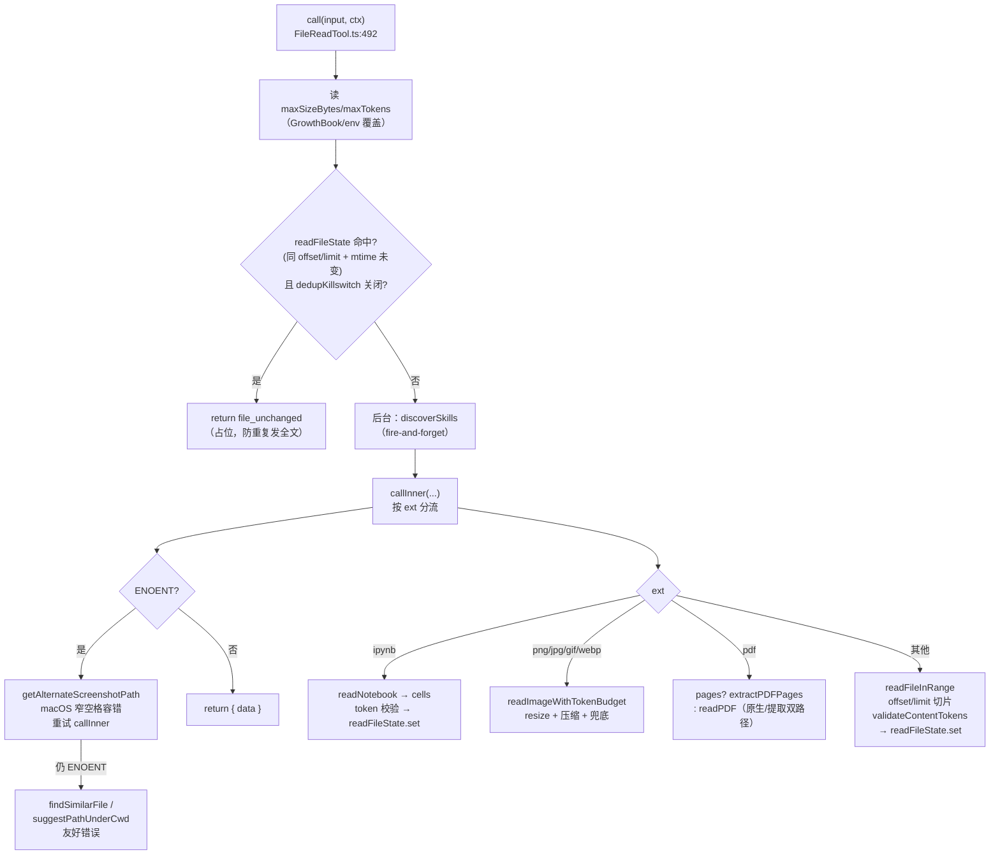
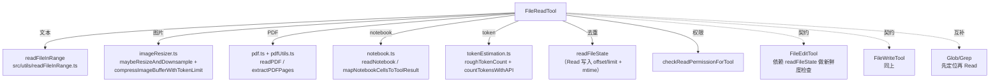

# FileReadTool（Read）工具详解

> 这是工具系统逐个拆解系列的**读工具旗舰篇**。`Read`（`FILE_READ_TOOL_NAME = 'Read'`，主体 **1169 行**）是 Claude Code 最大的内置工具之一。它远不止"读文本"——而是**多模态内容网关**：文本（带 `cat -n` 行号）、图片（PNG/JPG/GIF/WebP，带 token 预算压缩）、PDF（原生 + 页面提取双路径）、Jupyter notebook（结构化单元格）。它还实现了 `readFileState` 去重（同文件同范围不重发）、设备文件拦截（防 `/dev/zero` 挂起）、二进制扩展名拦截、macOS 截图窄空格容错。读懂它，就读懂了"读"的全部复杂度。

---

## 一、工具定位（一句话总结）

**`Read` = 从磁盘读取文件并按类型（文本/图片/PDF/notebook）多模态呈现的只读工具。**

| 维度 | 值 |
|---|---|
| 工具名 | `Read`（常量 `FILE_READ_TOOL_NAME`，`prompt.ts:5`） |
| 一句话 | 按扩展名分流到文本/图片/PDF/notebook 四条路径，文本带行号，图片/PDF 经 token 预算压缩，notebook 返回结构化单元格 |
| 是否进 system prompt | ✅ 默认注册（`tools.ts:229`）；`FILE_READ_TOOL_NAME` 在 `CORE_TOOLS` 白名单（`constants/tools.ts:9`）；`CLAUDE_CODE_SIMPLE` 模式仅保留 `[Bash, Read, Edit]`（`tools.ts:329`） |
| 只读 / 破坏性 | **只读**（`isReadOnly() → true`，`:375-377`） |
| 是否可并发 | ✅ **可并发**（`isConcurrencySafe() → true`，`:372-374`） |
| 核心依赖 | `src/utils/readFileInRange.ts`（文本）、`src/utils/imageResizer.ts`（图片）、`src/utils/pdf.ts`+`pdfUtils.ts`（PDF）、`src/utils/notebook.ts`（notebook）、`src/utils/tokenEstimation.ts`（token 上限） |
| 定位互补方 | `Glob`/`Grep`（先定位再读）、`Edit`/`Write`（读取是编辑前置契约） |

**为什么需要它？** 模型要修改代码，必须先"看见"它。`Read` 是这双眼睛——而且是一双**多模态**的眼睛：能看代码（文本）、看截图（图片）、看文档（PDF）、看数据分析（notebook）。它还是 Edit/Write 的**契约前置**：`readFileState` 记录每次读取的 mtime，后续编辑据此做新鲜度检查。没有 Read，写工具就无法判断"模型认知 vs 磁盘真实"是否一致。

---

## 二、关键文件清单

```
FileReadTool/
├── FileReadTool.ts     ← buildTool({...}) 主体（1169 行），callInner 分流四类内容
├── prompt.ts           ← DESCRIPTION + renderPromptTemplate（动态拼装，含 PDF/notebook 说明）
├── limits.ts           ← getDefaultFileReadingLimits（maxTokens/maxSizeBytes，GrowthBook 可覆盖）
├── imageProcessor.ts   ← 图片处理辅助
├── UI.tsx              ← Ink 渲染（renderToolUseMessage/renderToolResultMessage/renderToolUseTag）
└── src/
    ├── services/analytics/growthbook.ts   ← 桩
    └── utils/
        ├── file.ts      ← 桩
        └── messages.ts  ← 桩
```

| 文件 | 角色 | 必看行号 |
|---|---|---|
| `FileReadTool.ts` | 工具主体：schema + validateInput + call + callInner + 四类分流 + readImageWithTokenBudget | `buildTool:336-707`、`validateInput:415-491`、`call:492-645`、`callInner:791-1072`、`BLOCKED_DEVICE_PATHS:97-114`、`MaxFileReadTokenExceededError:174-184`、`readImageWithTokenBudget:1083-1169` |
| `prompt.ts` | 描述模板 + 常量 | `FILE_READ_TOOL_NAME:5`、`DESCRIPTION:12`、`MAX_LINES_TO_READ:10`、`renderPromptTemplate:26-48`、`FILE_UNCHANGED_STUB:7-8` |
| `limits.ts` | 读取上限（memoized，GrowthBook 可覆盖） | `DEFAULT_MAX_OUTPUT_TOKENS:17`、`getDefaultFileReadingLimits:51-90`、`getEnvMaxTokens:23-32` |
| `imageProcessor.ts` | 图片处理辅助 | — |
| `UI.tsx` | 渲染：`getAgentOutputTaskId`（agent 输出文件特殊处理） | `getAgentOutputTaskId:19-30`、`renderToolUseMessage:32` |

> **结构特点**：FileReadTool 是"单文件巨主体"型——1169 行全在 `FileReadTool.ts`，没有像 FileEditTool 那样拆纯函数库（因为逻辑强 I/O 耦合，难纯化）。复杂度来自**四类内容的分流处理**，而非算法深度。

---

## 三、Tool 接口字段实现（`buildTool` 逐字段）

### 标识字段

```ts
name: FILE_READ_TOOL_NAME,                    // "Read"
searchHint: 'read files, images, PDFs, notebooks',
maxResultSizeChars: 100_000,                  // 超 100KB 持久化到磁盘（减轻长会话内存）
strict: true,
```

### 模型面字段

```ts
async description() { return DESCRIPTION }
async prompt() {
  // 动态：根据 limits（GrowthBook）拼装 maxSizeInstruction + offsetInstruction
  return renderPromptTemplate(pickLineFormatInstruction(), maxSizeInstruction, offsetInstruction)
}
get inputSchema()  { return inputSchema() }
get outputSchema() { return outputSchema() }
```

**输入 schema**（`:226-242`，`semanticNumber` 包裹 offset/limit）：
```ts
{
  file_path: string,          // 必填，绝对路径
  offset?:   number,          // 起始行（semanticNumber 容错）
  limit?:    number,          // 读取行数
  pages?:    string,          // PDF 页面范围，如 "1-5"
}
```

**输出 schema**（`:247-331`）——**判别式联合**（`z.discriminatedUnion('type', ...)`），6 种类型：
```ts
| { type: 'text',     file: { filePath, content, numLines, startLine, totalLines } }
| { type: 'image',    file: { base64, type, originalSize, dimensions? } }
| { type: 'notebook', file: { filePath, cells: any[] } }
| { type: 'pdf',      file: { filePath, base64, originalSize } }
| { type: 'parts',    file: { filePath, originalSize, count, outputDir } }  // PDF 页面提取
| { type: 'file_unchanged', file: { filePath } }                            // 去重命中
```

> **判别式联合的价值**：6 种结果形态差异巨大（文本是字符串、图片是 base64、PDF 是 document block），用 `type` 字段判别让 `mapToolResultToToolResultBlockParam`（`:646-706`）能 switch 分流，每种走不同的序列化路径。

### 行为字段（重点）

| 字段 | 实现位置 | 说明 |
|---|---|---|
| `call()` | `:492-645` | 入口：去重检查 + skill 发现 + 调 callInner + ENOENT 容错 |
| `validateInput()` | `:415-491` | pages 格式、deny 规则、UNC、二进制扩展名、设备文件 |
| `checkPermissions()` | `:397-404` | 委托 `checkReadPermissionForTool` |
| `isConcurrencySafe()` | `:372-374` → `true` | 读不同文件可安全并发 |
| `isReadOnly()` | `:375-377` → `true` | 无副作用 |
| `isSearchOrReadCommand()` | `:381-383` → `{isRead:true}` | 标记为"读取类" |
| `getPath()` | `:384-386` | `file_path || getCwd()` |
| `backfillObservableInput()` | `:387-393` | `expandPath` 防 hook 绕过 |
| `preparePermissionMatcher()` | `:394-396` | 通配匹配闭包 |
| `toAutoClassifierInput()` | `:378-380` | `file_path` |
| `extractSearchText()` | `:411-413` → `''` | UI 只渲染摘要外框，不索引内容 |

### 渲染字段

```ts
userFacingName,
renderToolUseMessage,    // 显示 file_path（agent 输出文件特殊处理）
renderToolUseTag,
renderToolResultMessage, // UI.tsx:140 —— 只渲染摘要外框，不渲染内容
renderToolUseErrorMessage,
```

> **UI 不渲染内容**（`:408-410` 注释）：所有类型只渲染"Read N 行"、"Read image (42KB)"这样的摘要外框。面向模型的内容序列化（行号前缀、base64）走 `mapToolResultToToolResultBlockParam`，**不经过 UI**。这是"模型面 vs 用户面"的彻底分离。

---

## 四、核心执行流程：`call()` 与 `callInner()`

`call()`（`:492-645`）是入口，`callInner()`（`:791-1072`）按扩展名分流。整体流程：



**call() 关键点**：

1. **`readFileState` 去重**（`:519-567`）：若已读过同 `offset/limit` 且磁盘 mtime 未变，返回 `file_unchanged` 占位。注释（`:519-527`）引用实测数据——约 18% 的 Read 调用是同文件冲突，最高占全集群 cache_creation 的 2.64%。**仅对 Read 的条目去重**（`existingState.offset !== undefined`）——Edit/Write 存的 `offset=undefined` 条目反映编辑后 mtime，基于它去重会把模型指向编辑前的内容。可通过 GrowthBook `tengu_read_dedup_killswitch` 熔断。
2. **ENOENT 容错 + macOS 截图窄空格**（`:602-644`）：文件不存在时，先试 `getAlternateScreenshotPath`（`:146-158`）——macOS 截图 AM/PM 前的空格可能是普通空格或窄不换行空格（U+202F），换一种再试。仍失败才用 `findSimilarFile`/`suggestPathUnderCwd` 给友好建议。
3. **skill 发现非阻塞**（`:569-585`）：`addSkillDirectories(...).catch(() => {})` 不 await。

**callInner() 四类分流**（`:791-1072`）：

- **notebook**（`:809-850`）：`readNotebook` 读 JSON，`validateContentTokens` 校验，超 `maxSizeBytes` 则建议用 Bash+jq 读片段。`readFileState.set` 记录 cellsJson。
- **image**（`:853-878`）：`readImageWithTokenBudget`（`:1083-1169`）——单次读文件，标准 resize；若超 token 预算则同 buffer 激进压缩，再失败用 sharp 兜底（400x400, quality 20）。返回 dimensions 供坐标映射。
- **PDF**（`:881-1004`）：双路径——有 `pages` 参数则 `extractPDFPages` 提取页面为 JPG 图片块；无 pages 且页数 ≤ `PDF_AT_MENTION_INLINE_THRESHOLD` 则 `readPDF` 原生读取为 document block。`isPDFSupported()` 为假（旧模型）时强制走页面提取，需 poppler-utils。
- **text**（`:1006-1071`）：`readFileInRange`（单次异步，支持 offset/limit 切片 + maxSizeBytes 上限 + abort signal），`validateContentTokens` 校验，`addLineNumbers` 加 `cat -n` 行号，`readFileState.set` 记录。

**`validateContentTokens`**（`:732-759`）——三级 token 防护：
1. 快速拒绝：字节数 > maxTokens×4 直接抛（最坏 4 字节/token）。
2. 粗估：`roughTokenCountEstimationForFileType` ≤ maxTokens/4 放行。
3. 精确：`countTokensWithAPI` 调 API 精确计数，超限抛 `MaxFileReadTokenExceededError`。

---

## 五、权限与安全

### `validateInput`（`:415-491`，第 3 步）

| 校验项 | 行号 | 说明 |
|---|---|---|
| pages 格式 | `:417-437` | `parsePDFPageRange` 校验，范围超 `PDF_MAX_PAGES_PER_READ` 拒绝（errorCode 7/8） |
| deny 规则 | `:440-455` | `matchingRuleForInput(...,'read','deny')`（errorCode 1） |
| UNC 路径 | `:459-463` | `\\`/`//` 跳过 fs 操作（errorCode 推迟到权限层），防 NTLM 泄露 |
| 二进制扩展名 | `:465-478` | `hasBinaryExtension` 且非 PDF/图片 → 拒绝（errorCode 4） |
| 设备文件 | `:480-488` | `isBlockedDevicePath` → 拒绝（errorCode 9） |

### `BLOCKED_DEVICE_PATHS`（`:97-114`）——防挂起的黑名单

```ts
const BLOCKED_DEVICE_PATHS = new Set([
  '/dev/zero', '/dev/random', '/dev/urandom', '/dev/full',  // 无限输出
  '/dev/stdin', '/dev/tty', '/dev/console',                 // 阻塞等待输入
  '/dev/stdout', '/dev/stderr',                             // 读取无意义
  '/dev/fd/0', '/dev/fd/1', '/dev/fd/2',                    // stdio fd 别名
])
```

`isBlockedDevicePath`（`:116-127`）还拦截 `/proc/<pid>/fd/0-2`（Linux stdio 别名）。注释（`:95-96`）强调：这是**纯路径检查无 I/O**，`/dev/null` 等安全设备故意放行。**没有这个黑名单，读 `/dev/zero` 会让进程永远到不了 EOF 而 OOM 挂起。**

### 安全细节

- **`readFileState` 去重仅限 Read 条目**（`:541-545`）：`existingState.offset !== undefined` 过滤——防止把 Edit/Write 的条目误用于去重（会指向过期内容）。
- **图片单次读取**（`:1089` 注释）：`readFileBytes` 只读一次，后续压缩基于同一 buffer，避免超大文件 OOM。
- **`memoryFileMtimes` WeakMap 侧信道**（`:724-730`）：auto-memory 文件的 mtime 通过 WeakMap 传给 `mapToolResultToToolResultBlockParam`，避免在输出 schema 加仅展示用的字段，也避免 mapper 做同步 fs。data 对象 GC 后 WeakMap 自动回收。
- **会话文件 analytics**（`:194-224`、`:1053-1069`）：`detectSessionFileType` 识别 `~/.claude/session-memory/*.md` 和 `~/.claude/projects/*.jsonl`，记录 `tengu_session_file_read` 事件（含行数/字节统计）。

### `checkPermissions`（`:397-404`，第 4 步）

委托 `checkReadPermissionForTool`——所有只读文件工具（Read/Glob/Grep）共用。

---

## 六、与其他系统/工具的关系



- **与 Edit/Write 的契约关系**（**最重要**）：Read 是编辑的**前置依赖**。`readFileState` 是三者共享的"模型认知账本"——Read 写入（offset/limit 有定义 + mtime），Edit/Write 读取做新鲜度检查、写入（offset=undefined）刷新。Edit 的 prompt 明确："未读取就编辑会报错。" Read 的去重注释（`:537-540`）特别说明：不能基于 Edit/Write 的条目去重，否则指向过期内容。
- **与 Glob/Grep 的互补**：Glob 按名找路径、Grep 按内容找路径、Read 读具体内容。典型流程：Grep 定位 → Read 读全文 → Edit 改。
- **与 Bash 的边界**：`prompt.ts:45` 明确——"本工具只能读文件，不能读目录。要列目录，用 Bash 执行 ls。" notebook 超限时也建议用 Bash+jq（`:817-821`）。
- **与图片坐标映射**：`dimensions`（`:276-295`）返回原始 + 显示尺寸，供 Computer Use 等场景做坐标映射。
- **与 `registerFileReadListener`**（`:164-172`）：暴露监听器注册 API，其他服务可在文件被读时收到通知（content + path）。

---

## 七、亮点与设计取舍

1. **判别式联合输出 schema**（`:256-330`）：6 种结果形态用 `z.discriminatedUnion('type', ...)` 统一，让序列化、UI、类型推导都受益。这是处理"一个工具多种返回"的范本。
2. **`readFileState` 去重**（`:519-567`）：实测驱动——18% 冲突率、2.64% cache_creation 占比。用 GrowthBook killswitch 可熔断，3P（Bedrock/Vertex/Foundry）安全（纯客户端，无需服务端）。
3. **三级 token 防护**（`:732-759`）：快速字节拒绝 → 粗估放行 → API 精确计数。避免了"每次都调 API 计数"的延迟，又防止超大文件漏网。
4. **设备文件黑名单**（`:97-127`）：纯路径检查防 `/dev/zero` 挂起——一个容易被忽略但致命的健壮性细节。
5. **macOS 截图窄空格容错**（`:129-158`）：不同 macOS 版本 AM/PM 前的空格字符不同（普通 vs U+202F），ENOENT 时换一种再试。这是对**平台怪癖**的极致容错。
6. **图片单次读取 + 多级压缩**（`:1083-1169`）：读一次 buffer，标准 resize → 激进压缩 → sharp 兜底，全基于同一 buffer。防 OOM 又保降级。
7. **PDF 双路径**（`:881-1004`）：原生 document block（新模型 + 小文件）vs 页面提取为图片（旧模型/大文件/指定 pages）。`isPDFSupported` + `PDF_EXTRACT_SIZE_THRESHOLD` 决定路径。
8. **`memoryFileMtimes` WeakMap 侧信道**（`:724-730`）：用 WeakMap 把 mtime 从 call 传到 mapper，不污染 schema、不做同步 fs、自动 GC。展示了对"临时跨函数状态"的优雅处理。
9. **UI 与模型面彻底分离**（`:408-413`）：UI 只渲染摘要外框，内容序列化走 mapper。避免大文件内容在终端刷屏，也避免内容进错误的管道。
10. **memoized limits**（`limits.ts:51`）：GrowthBook 值首次调用固定，防止会话中途上限跳变。env 覆盖优先于 GrowthBook（用户意图 > 实验基础设施）。

---

## 八、源码导航（书签速查）

| 想看什么 | 去哪里 |
|---|---|
| 工具名 + 描述常量 | `prompt.ts:5,12` |
| 输入/输出 schema（判别式联合） | `FileReadTool.ts:226-242`、`:247-331` |
| `buildTool` 字段填充 | `FileReadTool.ts:336-707` |
| `validateInput`（pages/deny/UNC/二进制/设备） | `FileReadTool.ts:415-491` |
| `call()` 入口（去重 + ENOENT 容错） | `FileReadTool.ts:492-645` |
| `callInner()` 四类分流 | `FileReadTool.ts:791-1072` |
| `mapToolResultToToolResultBlockParam`（6 种序列化） | `FileReadTool.ts:646-706` |
| 设备文件黑名单 | `FileReadTool.ts:97-127` |
| macOS 截图窄空格容错 | `FileReadTool.ts:129-158` |
| `readFileState` 去重逻辑 | `FileReadTool.ts:519-567` |
| `validateContentTokens`（三级防护） | `FileReadTool.ts:732-759` |
| `readImageWithTokenBudget`（图片多级压缩） | `FileReadTool.ts:1083-1169` |
| `MaxFileReadTokenExceededError` | `FileReadTool.ts:174-184` |
| 读取上限（GrowthBook 可覆盖） | `limits.ts:51-90` |
| 描述模板（PDF/notebook 说明） | `prompt.ts:26-48` |
| 读权限通用管道 | `src/utils/permissions/filesystem.ts:checkReadPermissionForTool` |

---

## 九、学习建议与验证清单

**怎么读这章**：这是读工具的"母版"，也是最复杂的单工具。先看"一、定位"建立"多模态网关"心智，再跳到"四、call/callInner"的分流 mermaid 理解四类路径。然后重点啃"`readFileState` 去重"和"三级 token 防护"——它们体现了实测驱动的工程优化。最后看"五、设备文件黑名单"，体会健壮性细节。

**验证清单（读完自测）**：
- [ ] 能说出 Read 支持的 4 种内容类型（文本/图片/PDF/notebook）及各自分流入口
- [ ] 能解释输出 schema 为何用判别式联合（6 种形态差异大，type 判别让序列化分流）
- [ ] 能说出 `readFileState` 去重的两个前提（同 offset/limit + mtime 未变 + offset 有定义）
- [ ] 能解释为什么不能基于 Edit/Write 的 readFileState 条目去重（offset=undefined 指向编辑后 mtime，会误指向过期内容）
- [ ] 能找到设备文件黑名单（`BLOCKED_DEVICE_PATHS`）并说出它防什么（`/dev/zero` 无限输出挂起）
- [ ] 能说出三级 token 防护的顺序（字节快速拒绝 → 粗估放行 → API 精确计数）
- [ ] 能解释图片为何单次读取（防 OOM，多级压缩基于同一 buffer）
- [ ] 能说出 PDF 的双路径决策依据（`isPDFSupported` + `PDF_EXTRACT_SIZE_THRESHOLD` + pages 参数）
- [ ] 能解释 `memoryFileMtimes` WeakMap 的作用（侧信道传 mtime，不污染 schema，自动 GC）
- [ ] 能指出 Read 与 Edit/Write 的契约关系（readFileState 共享，Read 是编辑前置依赖）

**配合动作**：
1. 让 Claude 连续 `Read` 同一文件两次，观察第二次返回 `file_unchanged` 占位
2. 在 `:553`（去重命中处）加日志，验证去重触发
3. 用一个超 25000 token 的大文件触发 `MaxFileReadTokenExceededError`，观察 errorCode
4. 读一张大图片，对比 `dimensions.originalWidth` 与 `displayWidth`，验证压缩
5. 读 `.ipynb` 文件，观察返回的 `cells` 结构与 `mapNotebookCellsToToolResult` 序列化
