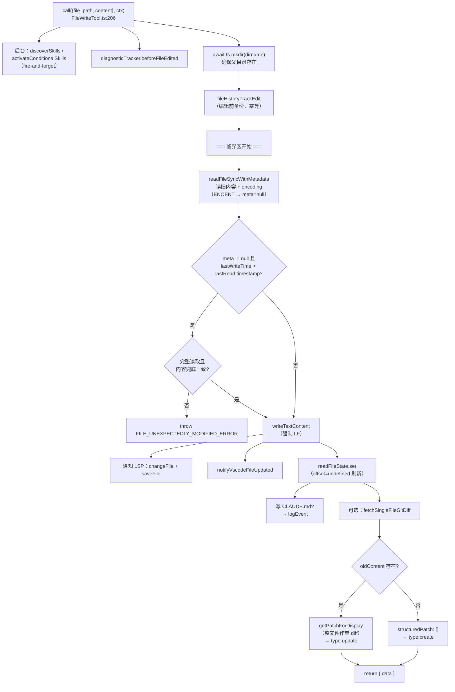
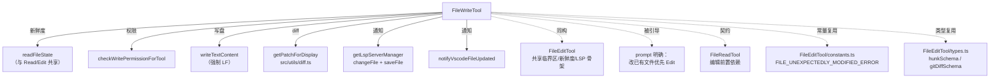

# FileWriteTool（Write）工具详解

> 这是工具系统逐个拆解系列的**写工具篇之二**。`Write`（`FILE_WRITE_TOOL_NAME = 'Write'`）执行**整文件覆盖写**：给定 `file_path` 与 `content`，创建新文件或完全替换已有文件内容。它是 FileEditTool 的"大锤"搭档——Edit 做精确小改，Write 做整文件新建/重写。两者共享同一套原子"读-改-写"临界区、`readFileState` 新鲜度、LSP/VSCode 通知骨架，差异在于**写入粒度**（整内容替换 vs 字符串替换）和**对空文件/新文件的处理**。

---

## 一、工具定位（一句话总结）

**`Write` = 整文件内容覆盖写的工具（新建或完整重写）。**

| 维度 | 值 |
|---|---|
| 工具名 | `Write`（常量 `FILE_WRITE_TOOL_NAME`，`prompt.ts:3`） |
| 一句话 | 给定 `file_path` + `content`，创建新文件或完全覆盖已有文件，返回结构化 diff |
| 是否进 system prompt | ✅ 默认注册（`tools.ts:231`）；`FILE_WRITE_TOOL_NAME` 在 `CORE_TOOLS` 白名单（`constants/tools.ts:17`） |
| 只读 / 破坏性 | **破坏性**（写盘，无 `isReadOnly()` → 默认 false） |
| 是否可并发 | ❌ **不可并发**（无 `isConcurrencySafe()` → 默认 false） |
| 核心依赖 | `src/utils/fileRead.ts:readFileSyncWithMetadata`、`src/utils/file.ts:writeTextContent`、`src/utils/diff.ts:getPatchForDisplay` |
| 定位互补方 | `Edit`（精确小改，首选）、`Read`（编辑前置契约） |

**为什么需要它？** 当模型要**新建文件**或**完全重写**一个内容大变的文件时，发送整份 `content` 比构造一个覆盖全文的 `old_string`→`new_string`（Edit 的做法）更直接。但 prompt 明确警告（`prompt.ts:15`）——"修改已有文件时**优先用 Edit**，它只发 diff。仅在新建或完整重写时用本工具。" 这是因为 Write 的 token 成本与文件大小成正比，而 Edit 只与变更大小成正比。

---

## 二、关键文件清单

```
FileWriteTool/
├── FileWriteTool.ts   ← buildTool({...}) 主体（417 行），逻辑集中
├── prompt.ts          ← FILE_WRITE_TOOL_NAME + getWriteToolDescription（含"先读后写"强制）
├── UI.tsx             ← Ink 渲染（FileWriteToolCreatedMessage / WriteRejectionDiff / isResultTruncated）
└── src/
    ├── components/MessageResponse.ts     ← 桩
    ├── services/analytics/index.ts       ← 桩
    └── utils/messages.ts                 ← 桩
```

| 文件 | 角色 | 必看行号 |
|---|---|---|
| `FileWriteTool.ts` | 工具主体：schema + validateInput + call + 权限 + 渲染 | `buildTool:85-417`、`validateInput:144-205`、`call:206-400`、`checkPermissions:126-133`、`mapToolResultToToolResultBlockParam:401-416` |
| `prompt.ts` | 工具名 + 描述（强制先读后写、优先 Edit、禁 emoji/md） | `FILE_WRITE_TOOL_NAME:3`、`getWriteToolDescription:10-18`、`getPreReadInstruction:6-8` |
| `UI.tsx` | 渲染：`userFacingName`（计划文件特判）、`isResultTruncated`、`FileWriteToolCreatedMessage`、`WriteRejectionDiff` | `countLines:36-39`、`MAX_LINES_TO_RENDER:27`、`isResultTruncated:92-102`、`renderToolResultMessage:255-301`、`loadRejectionDiff:214-239` |

> **结构特点**：FileWriteTool 是"单文件主体"型——417 行全在 `FileWriteTool.ts`，没有独立 utils（编辑逻辑简单，直接用 `getPatchForDisplay` 生成 diff）。与 FileEditTool 的"主体+纯函数库"形成对比，反映了**逻辑复杂度决定拆分粒度**。

---

## 三、Tool 接口字段实现（`buildTool` 逐字段）

### 标识字段

```ts
name: FILE_WRITE_TOOL_NAME,            // "Write"
searchHint: 'create or overwrite files',
maxResultSizeChars: 100_000,
strict: true,
```

### 模型面字段

```ts
async description() { return '将文件写入本地文件系统。' }
async prompt()      { return getWriteToolDescription() }
get inputSchema()   { return inputSchema() }
get outputSchema()  { return outputSchema() }
```

**输入 schema**（`:53-60`）——**极简**，只有两个字段：
```ts
{
  file_path: string,   // 必填，绝对路径
  content:  string,    // 必填，要写入的内容
}
```

**输出 schema**（`:63-79`）——`type` 区分新建/更新：
```ts
{
  type: 'create' | 'update',
  filePath:        string,
  content:         string,
  structuredPatch: Hunk[],     // 整文件作为单个 diff
  originalFile:    string|null,// 新建为 null，更新为旧全文
  gitDiff?:        GitDiff,
}
```

### 行为字段（重点）

| 字段 | 实现位置 | 说明 |
|---|---|---|
| `call()` | `:206-400` | 核心逻辑（见下节） |
| `validateInput()` | `:144-205` | 密钥检查、deny 规则、UNC、新鲜度（mtime 比对） |
| `checkPermissions()` | `:126-133` | 委托 `checkWritePermissionForTool` |
| `getPath()` | `:113-115` | `file_path` |
| `backfillObservableInput()` | `:116-122` | `expandPath` 防 hook 绕过 |
| `preparePermissionMatcher()` | `:123-125` | 通配匹配闭包 |
| `toAutoClassifierInput()` | `:110-112` | `${file_path}: ${content}` |
| `getActivityDescription()` | `:95-98` | "正在写入 X" |
| `extractSearchText()` | `:137-143` → `''` | **故意返回空**（见亮点） |

> **注意缺失**：与 Edit 一样无 `isReadOnly`/`isConcurrencySafe`/`isSearchOrReadCommand`（→ 默认值表达写工具语义）。也无 `inputsEquivalent`（Edit 有，因需去重判定；Write 整文件覆盖语义简单）。

### 渲染字段

```ts
userFacingName,                 // UI.tsx:81：计划文件特判 → "已更新的计划"
getToolUseSummary,
renderToolUseMessage,
isResultTruncated,              // create 模式截断到 MAX_LINES_TO_RENDER(10)
renderToolUseRejectedMessage,   // WriteRejectionDiff（Suspense + 异步加载 diff）
renderToolUseErrorMessage,
renderToolResultMessage,        // create→FileWriteToolCreatedMessage，update→FileEditToolUpdatedMessage
```

---

## 四、核心执行流程：`call()`

`call()`（`:206-400`）复用 FileEditTool 的**原子"读-改-写"临界区**骨架，差异在"整内容替换"而非"字符串替换"：



**关键点逐条**：

1. **后台 skill 发现**（`:215-228`）：同 Edit，`addSkillDirectories(...).catch(() => {})` 不阻塞。
2. **临界区外准备**（`:230-247`）：`beforeFileEdited`、`mkdir`、`fileHistoryTrackEdit` 全在临界区前。注释（`:232-236`）解释 mkdir 必须提前——ENOENT 时的懒加载 mkdir 会在 `writeFileSyncAndFlush_DEPRECATED` 内部触发虚假的 `tengu_atomic_write_error`。
3. **新鲜度检查 + 内容兜底**（`:262-278`）：与 Edit 完全同构。`lastWriteTime > lastRead.timestamp` 时，对完整读取（`offset/limit` 均 undefined）做 `meta.content !== lastRead.content` 兜底。Windows 云同步/杀毒改 mtime 不改内容时放行。
4. **强制 LF 换行**（`:283-288`）：`writeTextContent(fullFilePath, content, enc, 'LF')`——**第四参数硬编码 `'LF'`**。注释（`:283-287`）详述：过去会保留旧文件换行符（或对新文件采样仓库风格），结果覆盖 CRLF 文件、或 cwd 中二进制文件污染样本时，会静默破坏 Linux bash 脚本（混入 `\r`）。模型发送的 `content` 含明确换行且本意如此，**不改写**。这是与 Edit 的关键差异——Edit 保留原 `lineEndings`，Write 强制 LF。
5. **写后通知三连**（`:290-320`）：LSP（`changeFile`+`saveFile`）、VSCode、`readFileState.set`（offset=undefined 刷新，使后续过期写入失效）。
6. **CLAUDE.md 特殊记录**（`:323-325`）：写 `CLAUDE.md` 时 `logEvent('tengu_write_claudemd')`。
7. **diff 生成分叉**（`:342-396`）：有 `oldContent` → `getPatchForDisplay` 把整文件作单个 `old_string=oldContent, new_string=content` 编辑生成 diff（type:update）；无 oldContent → `structuredPatch:[]`（type:create）。`countLinesChanged` 统计增删行。

---

## 五、权限与安全

### `validateInput`（`:144-205`，第 3 步）

| 校验项 | 行号 | 说明 |
|---|---|---|
| 团队密钥检查 | `:148-151` | `checkTeamMemSecrets(fullFilePath, content)` 命中则拒绝（errorCode 0） |
| deny 规则 | `:154-167` | `matchingRuleForInput(...,'edit','deny')`（errorCode 1） |
| UNC 路径 | `:172-174` | `\\`/`//` 跳过 fs，交给权限层（防 NTLM） |
| mtime 新鲜度 | `:176-204` | `stat` 取 mtimeMs，与 `readFileState` 比对；`lastWriteTime > readTimestamp` 则拒绝（errorCode 3） |

> **与 Edit 的 validateInput 差异**：Write 的校验**精简很多**——没有"old_string 找不到"、"多处匹配"、"文件过大"、"ipynb 拦截"这些（因为整文件覆盖不依赖定位特定字符串）。但保留了密钥、deny、UNC、新鲜度这些**所有写工具共有**的校验。

### 安全细节

- **UNC 豁免**（`:172-174`）：注释（`:169-171`）与 Edit 完全一致——防 SMB 认证泄露 NTLM。
- **mtime 复用**（`:191-192` 注释）：新鲜度检查复用上面 `stat` 得到的 `mtimeMs`，避免 `getFileModificationTime` 再做一次多余 `statSync`——微小但一致的 I/O 优化。
- **强制 LF 防脚本破坏**（`:283-288`）：见上节关键点 4。这是 Write 独有的安全考量（Edit 保留原换行）。
- **无文件大小上限**：与 Edit 的 1 GiB 上限不同，Write **没有**显式大小检查——因为整文件覆盖的语义下，大小由模型 `content` 决定，磁盘旧文件大小无关。但 `maxResultSizeChars: 100_000` 限制了返回的 diff 大小。

### `checkPermissions`（`:126-133`，第 4 步）

委托 `checkWritePermissionForTool`——与 Edit/NotebookEdit 共用写权限管道。

---

## 六、与其他系统/工具的关系



- **与 `Edit` 的关系**（**最重要**）：两者是"整文件覆盖 vs 精确字符串替换"的搭档。共享：原子临界区、`readFileState` 新鲜度、LSP/VSCode 通知、UNC 豁免、密钥检查、deny 规则。差异：Write 强制 LF（Edit 保留原换行）、Write 无字符串定位校验、Write 无文件大小上限。Write 甚至**复用 Edit 的常量和类型**——`FILE_UNEXPECTEDLY_MODIFIED_ERROR`（`FileEditTool/constants.ts`）、`hunkSchema`/`gitDiffSchema`（`FileEditTool/types.ts`），见 `:40-41` 导入。
- **prompt 的明确引导**（`prompt.ts:14-15`）："如果路径下已有文件，本工具会覆盖。修改已有文件时**优先用 Edit**——它只发 diff。仅新建或完整重写时用本工具。" 这是工具间的**显式分工契约**。
- **与 `Read` 的契约**：`getPreReadInstruction`（`prompt.ts:6-8`）——"如果这是一个已存在的文件，你必须先用 Read 读取。未先读取会执行失败。" 通过 `readFileState` 为空时 validateInput 的新鲜度检查间接强制（mtime 比对无 readTimestamp 则放行新建，但更新已有文件需先有 read 记录）。
- **与 `CLAUDE.md` 的特殊关系**（`:323-325`）：写 CLAUDE.md 记录 `tengu_write_claudemd` 事件——项目指令文件的修改被单独追踪。
- **与计划文件的特殊渲染**（`UI.tsx:81-86`、`:262-274`）：写 `.claude/plans/` 下的计划文件时，`userFacingName` 返回"已更新的计划"，渲染反转 condensed 行为。

---

## 七、亮点与设计取舍

1. **强制 LF 换行**（`:283-288`）：本工具最重要的独有决策。注释（`:283-287`）详述了历史教训——保留旧换行/采样仓库风格会静默破坏 Linux bash 脚本。模型发的 content 含明确换行且本意如此，不改写。**与 Edit 保留原 lineEndings 形成刻意对比**。
2. **与 Edit 的代码复用**（`:40-41`）：直接导入 Edit 的 `FILE_UNEXPECTEDLY_MODIFIED_ERROR` 常量和 `hunkSchema`/`gitDiffSchema` 类型——避免重复定义，体现"写工具家族"的内聚。
3. **`extractSearchText` 故意返回空**（`:137-143`）：注释解释——create 模式 UI 展示 content，update 模式展示 diff（不展示原始 content）。即便启发式 'content' 白名单键在 update 模式会索引原始内容（幽灵索引），也选择**低估更稳妥**——tool_use 已索引 file_path。这是对 TF-IDF 索引的保守策略。
4. **`isResultTruncated` 的提前退出**（`UI.tsx:92-102`）：create 模式截断到 10 行，但用 `indexOf` 逐行找第 11 行即退出，不切分整段（可能极大的）content。注释（`UI.tsx:88-91`）说明每条可见消息 hover/滚动都调用，性能敏感。
5. **`WriteRejectionDiff` 的 Suspense**（`UI.tsx:141-175`）：被拒绝时异步加载旧内容生成 diff，用 Suspense + createFallback 兜底。文件超 `MAX_SCAN_BYTES` 回退到 create 视图（避免 GB 级文件 diff 导致 OOM，`UI.tsx:226-227`）。
6. **计划文件渲染反转**（`UI.tsx:262-274`）：写计划文件时，常规模式只显示"/plan 预览"提示（用户输 /plan 看全文），condensed 模式（子 agent 视图）才显示完整内容。这是对不同查看场景的定制。
7. **临界区注释的严谨性**（`:232-236`、`:249-250`）：注释精确解释了"mkdir 必须在临界区外、临界区内禁止 await"的原因，与 Edit 的注释风格一致——**把不变量写进注释**，防止后人破坏原子性。

---

## 八、源码导航（书签速查）

| 想看什么 | 去哪里 |
|---|---|
| 工具名 + 描述（强制先读、优先 Edit） | `prompt.ts:3,10-18` |
| 输入/输出 schema | `FileWriteTool.ts:53-80` |
| `buildTool` 字段填充 | `FileWriteTool.ts:85-417` |
| `validateInput`（密钥/deny/UNC/mtime） | `FileWriteTool.ts:144-205` |
| `call()` 原子临界区 | `FileWriteTool.ts:206-400` |
| 强制 LF 写入 | `FileWriteTool.ts:283-288` |
| 新鲜度检查 + 内容兜底 | `FileWriteTool.ts:262-278` |
| `mapToolResultToToolResultBlockParam` | `FileWriteTool.ts:401-416` |
| `userFacingName`（计划文件特判） | `UI.tsx:81-86` |
| `isResultTruncated`（提前退出） | `UI.tsx:92-102` |
| `WriteRejectionDiff`（Suspense） | `UI.tsx:141-239` |
| `loadRejectionDiff`（大文件兜底） | `UI.tsx:214-239` |
| 复用 Edit 的常量/类型 | `FileWriteTool.ts:40-41` |
| 写权限通用管道 | `src/utils/permissions/filesystem.ts:checkWritePermissionForTool` |

---

## 九、学习建议与验证清单

**怎么读这章**：在读完 FileEditTool 后，本篇重点是"**差异**"。先对比"一、定位"的互补关系（整文件 vs 字符串），再跳到"四、call()"与 Edit 的 call() 对照——找 7 处共性与 3 处差异（强制 LF、无字符串定位、无大小上限）。最后看"七、亮点"的"强制 LF"历史教训，体会"看似微小的决策如何避免跨平台脚本破坏"。

**验证清单（读完自测）**：
- [ ] 能说出 Write 与 Edit 的分工（整文件覆盖 vs 精确字符串替换，改已有文件优先 Edit）
- [ ] 能指出 Write 强制 LF 而 Edit 保留原 lineEndings，并解释原因（防 CRLF 污染 Linux 脚本）
- [ ] 能说出 Write 的 validateInput 为何比 Edit 精简（整文件覆盖不依赖字符串定位，无"找不到/多处匹配/过大/ipynb"校验）
- [ ] 能解释 `extractSearchText` 为何故意返回空（保守索引策略，防幽灵索引）
- [ ] 能说出 Write 复用了 Edit 的哪些定义（`FILE_UNEXPECTEDLY_MODIFIED_ERROR`、`hunkSchema`、`gitDiffSchema`）
- [ ] 能解释 `readFileState.set` 的 `offset:undefined` 含义（标记为非 Read 条目，破坏 Read 去重匹配）
- [ ] 能指出计划文件的渲染特殊行为（常规模式只显 /plan 预览，condensed 显全文）
- [ ] 能说出 Write 无显式文件大小上限的原因（整文件覆盖语义下，大小由模型 content 决定）

**配合动作**：
1. 让 Claude `Write` 覆盖一个 CRLF 文件，用 `file <path>` 或 hexdump 验证写入的是 LF
2. 让 Claude 未先 Read 就 `Write` 一个已有文件，观察新鲜度检查行为
3. 写一个 >10 行的新文件，观察 `isResultTruncated` 截断到 10 行 + "+N 行"提示
4. 写一个 `.claude/plans/` 下的计划文件，观察 `userFacingName` 变为"已更新的计划"
5. 对比同一次修改用 Edit vs Write 的 token 消耗，验证"Edit 只发 diff"的优势
