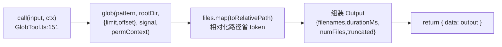
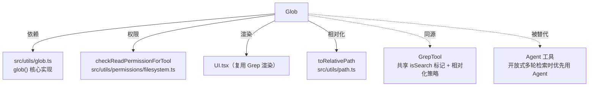

# Glob 工具详解

> 这是工具系统逐个拆解系列的第一篇参考样例。`Glob` 是一个**中等复杂度**的只读检索工具：输入一个 glob 模式（如 `**/*.ts`），返回匹配的文件路径列表。它结构干净、字段齐全，是理解"一个标准工具长什么样"的最佳切入点。读完这一篇，你就能按图索骥阅读其他任何工具。

---

## 一、工具定位（一句话总结）

**`Glob` = 按名称模式查文件路径的只读检索工具。**

| 维度 | 值 |
|---|---|
| 工具名 | `Glob`（常量 `GLOB_TOOL_NAME`，`prompt.ts:1`） |
| 一句话 | 给定 glob 模式，返回按修改时间排序的匹配文件路径 |
| 是否进 system prompt | ✅ 在 `CORE_TOOLS` 白名单内（核心工具，schema 完整注入） |
| 只读 / 破坏性 | **只读**（`isReadOnly() → true`） |
| 是否可并发 | ✅ **可并发**（`isConcurrencySafe() → true`） |
| 核心依赖 | `src/utils/glob.ts` 的 `glob()` 函数 |
| 定位互补方 | `Grep`（按**内容**检索）、`Agent`（开放式、多轮检索） |

**为什么需要它？** 模型（或用户）经常需要"我知道文件名大概叫什么，但不知道在哪"——比如找 `tsconfig.json`、找所有 `*.test.ts`。`Glob` 用通配符模式一次命中，比 `Grep` 逐文件扫内容快得多。

---

## 二、关键文件清单

```
GlobTool/
├── GlobTool.ts      ← buildTool({...}) 主体（195 行），全部逻辑都在这
├── prompt.ts        ← 工具名常量 GLOB_TOOL_NAME + DESCRIPTION 描述文本
├── UI.tsx           ← Ink 渲染组件（renderToolUseMessage / renderToolResultMessage）
└── src/             ← 内部子模块
```

| 文件 | 角色 | 必看行号 |
|---|---|---|
| `GlobTool.ts` | 工具主体：schema + call() + 权限 + 渲染全在这 | `buildTool:54`、`call:151`、`checkPermissions:132`、`validateInput:91` |
| `prompt.ts` | 工具名 + 进 system prompt 的描述 | `GLOB_TOOL_NAME:1`、`DESCRIPTION:3-7` |
| `UI.tsx` | 终端渲染（复用 Grep 的显示逻辑） | `getToolUseSummary`、`renderToolResultMessage` |

> **结构特点**：GlobTool 是"单文件主体"型——所有逻辑集中在 `GlobTool.ts` 一个文件里，没有像 BashTool 那样拆出独立的权限/安全子模块。这是因为它的逻辑足够简单，不需要分文件。

---

## 三、Tool 接口字段实现（`buildTool` 逐字段）

GlobTool 实现了 `Tool` 接口的**几乎所有关键字段**，是观察"一个完整工具如何填充字段"的好例子。下面按字段类别拆解：

### 标识字段

```ts
name: GLOB_TOOL_NAME,              // "Glob"
searchHint: '按名称模式或通配符查找文件',  // TF-IDF 索引额外关键词，权重 2.5
maxResultSizeChars: 100_000,       // 结果截断阈值（10 万字符）
userFacingName,                    // 来自 UI.tsx 的显示名函数
```

> **`searchHint` 的作用**：延迟工具发现靠 TF-IDF 搜索。虽然 Glob 在 `CORE_TOOLS` 里不延迟，但 `searchHint` 仍会进索引，提升模型在自然语言描述时命中"找文件"意图的概率。

### 模型面字段

```ts
async description() { return DESCRIPTION }   // → API tool schema 的描述
async prompt()      { return DESCRIPTION }    // → system prompt 片段（这里与 description 同文）
get inputSchema()  { return inputSchema() }   // Zod schema（getter，懒加载）
get outputSchema() { return outputSchema() }  // 输出 schema（用于 UI / 序列化）
```

**输入 schema**（`GlobTool.ts:23-33`，用 `lazySchema` 懒加载 + `z.strictObject`）：
```ts
{
  pattern: string   // 必填，glob 模式，如 "**/*.js"
  path?:   string   // 可选，搜索目录；省略 = 当前工作目录
}
```

**输出 schema**（`GlobTool.ts:36-49`）：
```ts
{
  durationMs: number,    // 耗时
  numFiles:   number,    // 命中数
  filenames:  string[],  // 相对路径数组
  truncated:  boolean,   // 是否超过 100 个被截断
}
```

### 行为字段（重点）

| 字段 | 实现 | 说明 |
|---|---|---|
| `call()` | `GlobTool.ts:151` | 核心逻辑（见下节） |
| `validateInput()` | `:91` | 校验 `path` 是否存在且是目录 |
| `checkPermissions()` | `:132` | 委托给 `checkReadPermissionForTool` |
| `isConcurrencySafe()` | `:73` → `true` | 读不同目录可安全并发 |
| `isReadOnly()` | `:76` → `true` | 无副作用 |
| `getPath()` | `:85` | 返回搜索根目录（供权限/UI 使用） |
| `preparePermissionMatcher()` | `:88` | 返回一个 `rulePattern => matchWildcardPattern(...)` 闭包，用于 deny-rule 通配匹配 |
| `toAutoClassifierInput()` | `:79` | 自动审批分类器输入 = pattern 文本 |
| `isSearchOrReadCommand()` | `:82` | `{ isSearch: true, isRead: false }` → 标记为"搜索类"操作 |

### 渲染字段

```ts
renderToolUseMessage,         // 渲染工具调用（显示 pattern）
renderToolUseErrorMessage,    // 渲染错误
renderToolResultMessage,      // 渲染结果（复用 Grep 的逻辑）
extractSearchText({filenames}) { return filenames.join('\n') }  // 用于检索历史聚合
```

---

## 四、核心执行流程：`call()`

`call()` 是工具的心脏，处于 7 步流水线的**第 6 步**。GlobTool 的 `call()`（`GlobTool.ts:151-173`）非常简洁：



**关键点逐条**：

1. **限流**（`:154`）：`limit = globLimits?.maxResults ?? 100`——默认最多返回 100 个文件，超出则 `truncated=true`。这是防止超大代码库一次返回成千上万路径撑爆 context。
2. **权限透传**（`:160`）：`glob()` 内部也会做 `toolPermissionContext` 检查，确保 deny-rule 在文件遍历时依然生效。
3. **路径相对化**（`:163`）：`files.map(toRelativePath)`——把绝对路径转成相对 cwd 的路径，**纯粹为了省 token**（绝对路径长得多）。这与 `GrepTool` 的做法一致（注释 `:162` 明确说明）。
4. **中断支持**（`:159`）：传入 `abortController.signal`，用户 ESC 中断时 `glob()` 会终止遍历。
5. **返回形式**：`{ data: output }`——注意 GlobTool 的 `call()` 返回的是 `{ data }` 包裹的对象，**不是** async generator 的 yield。这是因为 Glob 没有中间进度需要 yield（搜索是原子的）。最终结果会通过 `mapToolResultToToolResultBlockParam`（`:174`）转成模型可读的 `tool_result` block。

**`mapToolResultToToolResultBlockParam`**（`:174-194`）：把结构化 `Output` 翻译成给模型看的纯文本：
- 空结果 → `"未找到文件"`
- 有结果 → `filenames.join('\n')`，若 `truncated` 再追加提示"结果已被截断，请用更具体的路径"

---

## 五、权限与安全

GlobTool 是只读工具，权限模型相对简单，但有几个值得学习的细节：

### `validateInput`（`:91-131`，第 3 步）

**先于权限检查**，校验 `path` 参数：
- 跳过 UNC 路径（`:98`）：`\\` 或 `//` 开头的路径不调用 `fs.stat()`，**安全考量——防止 NTLM 凭据泄露**（注释 `:97` 明确）。
- 目录不存在（`:106`）→ 返回 `{ result: false, errorCode: 1 }` + 友好提示，还会调用 `suggestPathUnderCwd()` 建议"你是不是想用 X？"。
- 路径不是目录（`:121`）→ `errorCode: 2`。

> 这是 `validateInput` 的典型用法：**纯输入合法性校验，不需要权限，失败直接 emit `tool_use_error`**，不走 `canUseTool`。

### `checkPermissions`（`:132-139`，第 4 步）

```ts
async checkPermissions(input, context) {
  return checkReadPermissionForTool(GlobTool, input, appState.toolPermissionContext)
}
```

委托给通用的 `checkReadPermissionForTool`（`src/utils/permissions/filesystem.ts`）——所有只读文件工具（Read/Glob/Grep）共用这个权限判定。它会把搜索根目录（来自 `getPath()`）拿去和用户的 allow/deny 规则匹配。

### `preparePermissionMatcher`（`:88-90`）

返回一个匹配器闭包，让权限系统能用**通配符规则**（如 `deny: **/secrets/**`）匹配 glob 模式本身。这让 deny-rule 既能匹配"在哪个目录搜"，也能匹配"搜什么模式"。

---

## 六、与其他系统/工具的关系



- **与 `Grep` 的关系**：两者是文件检索的"名称面 vs 内容面"。共享 `isSearchOrReadCommand() → {isSearch:true}` 标记、`toRelativePath` 路径相对化策略，甚至 `renderToolResultMessage` 都复用。
- **与 `Agent` 的关系**：`prompt.ts:7` 明确写——"当你在进行开放式搜索、可能需要多轮 glob 和 grep 时，请改用 Agent 工具"。单次确定模式用 Glob，探索性搜索交给子代理。
- **与权限系统**：通过 `checkReadPermissionForTool` 接入通用读权限管道。
- **与 TF-IDF 工具索引**：`searchHint` 让"找文件"类自然语言意图更容易命中本工具。

---

## 七、亮点与设计取舍

1. **`lazySchema` 懒加载**（`:23`）：schema 用 `lazySchema(() => z.strictObject(...))` 包裹，避免 Zod 在模块加载时就构造（启动性能优化，60+ 工具累积可观）。
2. **`z.strictObject` 而非 `z.object`**（`:24`）：严格模式——传入 schema 未定义的字段会报错，防止模型幻觉出多余参数。
3. **路径相对化省 token**（`:163`）：看似微小的优化，在大代码库里能显著降低 context 占用。
4. **截断机制 + 友好提示**（`:154` + `:187`）：硬上限 100 文件防 context 爆炸，截断时主动提示"用更具体的路径"，引导模型收敛查询。
5. **UNC 路径安全豁免**（`:98`）：一个容易被忽略的安全细节——防止 Windows UNC 路径触发 NTLM 凭据外泄。
6. **`call()` 返回 `{data}` 而非 yield**：因为搜索是原子的，没有中间进度，用同步返回比 async generator 更直接。对比 `BashTool` 的 `call()` 会多次 yield 进度——选择哪种取决于工具是否有流式中间状态。

---

## 八、源码导航（书签速查）

| 想看什么 | 去哪里 |
|---|---|
| 工具名常量 & 描述 | `GlobTool/prompt.ts:1,3` |
| `buildTool` 字段填充 | `GlobTool/GlobTool.ts:54-195` |
| 输入/输出 schema | `GlobTool.ts:23-50` |
| `call()` 核心逻辑 | `GlobTool.ts:151-173` |
| `validateInput` 校验 | `GlobTool.ts:91-131` |
| `checkPermissions` | `GlobTool.ts:132-139` |
| 结果转 tool_result | `GlobTool.ts:174-194` |
| 底层 glob 实现 | `src/utils/glob.ts` |
| 读权限通用管道 | `src/utils/permissions/filesystem.ts:checkReadPermissionForTool` |

---

## 九、学习建议与验证清单

**怎么读这章**：先扫"一、工具定位"建立心智，再跳到"四、call()"看心脏，最后对照"三、字段实现"理解每个 `buildTool` 字段的含义。

**验证清单（读完自测）**：
- [ ] 能说出 Glob 与 Grep 的分工（名称面 vs 内容面）
- [ ] 能指出 `validateInput` 在 7 步流水线的第 3 步、`checkPermissions` 在第 4 步
- [ ] 能解释为什么 `isConcurrencySafe` 返回 `true`（只读、无副作用、读不同目录互不干扰）
- [ ] 能找到结果截断的硬上限（100）和触发后的友好提示位置
- [ ] 能说出路径相对化（`toRelativePath`）的动机（省 token）
- [ ] 能指出 UNC 路径豁免的安全意义（防 NTLM 凭据泄露）

**配合动作**：
1. 让 Claude `Glob` 一个 `**/*.test.ts`，观察返回的相对路径与截断提示
2. 在 `call()` 的 `:163` 加日志，对比相对化前后的 token 差异
3. 构造一个 deny-rule 拦截某目录，验证 `checkReadPermissionForTool` 生效
