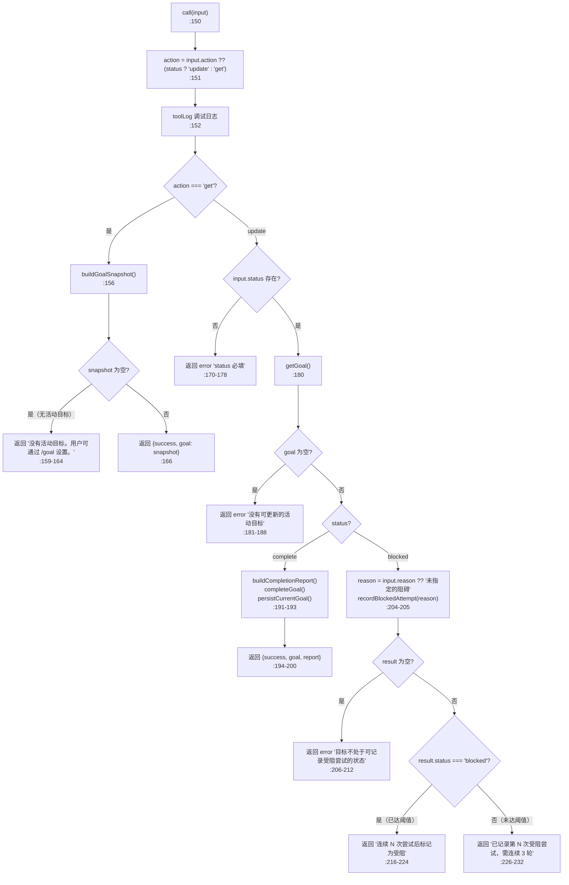
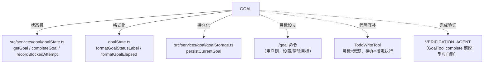

# GoalTool 工具详解

> 这是工具系统逐个拆解系列的一篇。`GoalTool` 是一个**中等复杂度**的目标状态管理工具：它让模型查询当前目标（objective/status/token/elapsed/turns）或把目标标记为终态（complete/blocked）。它的设计哲学很特别——模型**只能**把目标推向终态，不能设置/暂停/清除目标（那是用户的 `/goal` 命令的事）。读完这篇你会理解"如何用受限的工具接口实现目标驱动会话"，以及"受阻需要连续 3 轮"这种防误判机制。

---

## 一、工具定位（一句话总结）

**`GoalTool` = 线程目标的只读查询 + 终态推进工具。**

| 维度 | 值 |
|---|---|
| 工具名 | `GoalTool`（常量 `GOAL_TOOL_NAME`，`constants.ts:1`） |
| 一句话 | `get` 查询当前目标状态；`update` 把目标标记为 complete 或 blocked（模型仅此两种终态权限） |
| 是否进 system prompt | ❌ 不在 `CORE_TOOLS`（延迟工具，`shouldDefer: true`） |
| 注册门控 | `feature('GOAL')`（`src/tools.ts:90-93`）——feature flag 控制注册 |
| 只读 / 破坏性 | **动态**：`isReadOnly(input)` 返回 `action === 'get'`（`:122`） |
| 是否可并发 | ✅ **可并发**（`:119`） |
| 权限 | **自动放行**（`checkPermissions` 返回 `allow`，`:131`） |
| 核心依赖 | `src/services/goal/goalState.ts`（目标状态机）、`goalStorage.ts`（持久化） |

**为什么需要它？** 目标驱动会话里，模型需要一个明确的"目标终态判定"机制。`GoalTool` 提供受控接口：模型能查询进度（token/轮数/时长），也能宣告完成或受阻，但**不能**自己设置目标（防模型偏离用户意图）。目标的设立/清除是用户的 `/goal` 命令的职责。

---

## 二、关键文件清单

```
GoalTool/
├── GoalTool.ts   ← buildTool({...}) 主体（254 行），含 get/update 分支 + 报告生成
├── prompt.ts     ← DESCRIPTION + generatePrompt()：完成审计/受阻审计清单
└── constants.ts  ← GOAL_TOOL_NAME = 'GoalTool'
```

| 文件 | 角色 | 必看行号 |
|---|---|---|
| `GoalTool.ts` | 工具主体：schema + call() + 快照/报告辅助函数 | `buildTool:99`、`inputSchema:26`、`call:150`、`buildGoalSnapshot:71`、`buildCompletionReport:84` |
| `prompt.ts` | DESCRIPTION + 使用指南（完成审计/受阻审计/重要说明） | `DESCRIPTION:1`、`generatePrompt:4` |
| `constants.ts` | 工具名常量 | `GOAL_TOOL_NAME:1` |

> **结构特点**：单文件主体（254 行）。辅助函数（`buildGoalSnapshot`/`buildCompletionReport`/`toolLog`）内联在工具文件里，因为它们和工具语义强绑定。

---

## 三、Tool 接口字段实现（`buildTool` 逐字段）

### 标识字段

```ts
name: GOAL_TOOL_NAME,                        // "GoalTool"
searchHint: '获取或更新当前目标（complete/blocked）',
maxResultSizeChars: 10_000,                  // ★ 比其他工具小（10K vs 100K）
shouldDefer: true,
```

> **`maxResultSizeChars: 10_000`**（`:102`）：系列里独有的小上限。目标状态/报告文本量小，不需要 100K 的缓冲。这是按工具实际输出特征调参的例子。

### 模型面字段

```ts
async description() { return DESCRIPTION }
async prompt()      { return generatePrompt() }
userFacingName()    { return 'Goal' }
```

**输入 schema**（`:26-45`）：
```ts
{
  action?: 'get' | 'update',     // 可选；有 status 默认 update，否则 get
  status?: 'complete' | 'blocked',  // update 时必填
  reason?: string,                // 状态变更说明，update 时必填
}
```

> **`action` 可选 + 智能默认**（`:31-33`）：模型可以省略 action——有 status 就当 update，否则当 get。这是"减少模型负担"的 schema 设计。

**输出 schema**（`:48-65`）：
```ts
{
  success: boolean,
  goal?: {                          // 目标快照
    objective: string,
    status: string,                 // 格式化后的状态标签
    tokensUsed: number,
    tokenBudget: number | null,
    elapsed: string,                // 格式化的时长
    turnsExecuted: number,
  },
  message?: string,
  report?: string,                  // 完成时的使用报告
  error?: string,
}
```

### 行为字段

| 字段 | 实现 | 说明 |
|---|---|---|
| `call()` | `:150` | 核心逻辑（见下节） |
| `checkPermissions(input)` | `:131` | **自动放行**：`{ behavior: 'allow', updatedInput: input }` |
| `isReadOnly(input)` | `:122` | `action === 'get'`——动态只读 |
| `isConcurrencySafe()` | `:119` | `true` |
| `toAutoClassifierInput(input)` | `:126` | get 返回"获取目标状态"，update 返回 `更新目标：status — reason` |
| `renderToolUseMessage(input)` | `:134` | get 显示"正在检查目标状态…"，update 显示"正在更新目标：…" |
| `renderToolResultMessage(output)` | `:139` | 按 error/report/goal/message 优先级渲染 |

> **注意缺失**：没有 `validateInput`。校验逻辑（status 必填、活动目标存在）全在 `call()` 里返回结构化错误。

---

## 四、核心执行流程：`call()`

`call()`（`:150-233`）按 action 分叉：



**关键点逐条**：

1. **action 智能默认**（`:151`）：`input.action ?? (input.status ? 'update' : 'get')`——模型省略 action 也能正确路由。
2. **get 分支**（`:155-167`）：`buildGoalSnapshot()`（`:71-82`）把原始 goal 转成输出格式（status/elapsed 经格式化）。无活动目标返回友好提示（不报错）。
3. **update 前置校验**（`:170-188`）：status 必填 + 活动目标必须存在。任一失败返回结构化 error。
4. **complete 分支**（`:190-201`）：`buildCompletionReport()`（`:84-97`）生成使用报告（token 用量、活跃时长、续作轮数），然后 `completeGoal()` + `persistCurrentGoal()`。
5. **blocked 分支的受阻计数**（`:203-232`）：`recordBlockedAttempt(reason)` 返回 `{ status, attempts }`：
   - 相同受阻条件需**连续保持 3 轮**才标记为 blocked（`:230` 文案明确）
   - 未达阈值时返回"已记录第 N 次，目标仍然有效"
   - 这是为了防模型轻易放弃——"困难"或"缓慢"不算受阻（见 prompt 受阻审计）

### `buildGoalSnapshot`（`:71-82`）

把 `getGoal()` 的原始 goal 转成输出 schema：
- `formatGoalStatusLabel(goal.status)`：状态转人类可读标签
- `formatGoalElapsed(goal)`：时长格式化

### `buildCompletionReport`（`:84-97`）

```ts
['目标已达成 —— 使用报告：',
 `  Token 使用量：${tokensUsed} / ${tokenBudget}`,  // 或无预算时的简化版
 `  活跃时长：${formatGoalElapsed(goal)}`,
 `  续作轮数：${goal.turnsExecuted}`]
```

### `mapToolResultToToolResultBlockParam`（`:234-252`）

- error → `Error: ...` + `is_error: true`
- 成功 → 拼接 message + report + goal（JSON stringify）
- 空则返回"完成"

---

## 五、权限与安全

### `checkPermissions`（`:131-133`）

```ts
async checkPermissions(input) {
  return { behavior: 'allow', updatedInput: input }   // 目标操作不需要权限
}
```

**自动放行**——目标状态变更是模型自管状态，无文件/网络副作用。

### 模型权限的"受限接口"设计

这是 GoalTool 最核心的安全设计。模型对目标只有两种终态权限：
- **complete**：所有需求验证通过（见 prompt 完成审计 6 条）
- **blocked**：受阻条件连续 3+ 轮（见 prompt 受阻审计 3 条）

模型**不能**：
- 设置/创建目标（用户的 `/goal` 命令）
- 暂停/恢复目标
- 清除目标

`prompt.ts:34` 明确："你无法暂停、恢复或清除目标——只有用户可以通过 /goal 这么做。"

### 受阻防误判机制（`:203-232`）

`recordBlockedAttempt` 要求相同受阻条件**连续保持 3 轮**才标记 blocked。这防止模型在遇到"困难"或"缓慢"时轻易放弃——prompt（`prompt.ts:29-32`）的受阻审计明确："困难、缓慢或部分未完成不算受阻。只有真正无法克服的障碍才算数（缺少凭据、外部服务宕机等）。"

### `isReadOnly` 动态化（`:122-125`）

```ts
isReadOnly(input) {
  const action = input.action ?? (input.status ? 'update' : 'get')
  return action === 'get'
}
```

GET 只读，UPDATE 非只读——与 ConfigTool 同样的动态权限模式。

---

## 六、与其他系统/工具的关系



- **与 `goalState.ts` 的关系**：深度依赖——所有状态读写（getGoal/completeGoal/recordBlockedAttempt）和格式化（formatGoalStatusLabel/formatGoalElapsed）都在那里。GoalTool 是它的薄客户端。
- **与 `goalStorage.ts` 的关系**：`persistCurrentGoal()` 持久化目标状态变更（complete/blocked 后都调用）。
- **与 `/goal` 命令的关系**：职责分离。命令负责目标的"生命周期管理"（设置/清除/查看），工具负责"终态推进"（complete/blocked）。模型无法越权设置目标。
- **与 TodoWriteTool 的关系**：层次互补。目标是宏观（"实现 X 功能"），待办是微观执行步骤。模型用 TodoWrite 跟踪步骤，用 GoalTool 推进目标终态。
- **与 VERIFICATION_AGENT 的关系**：prompt 的完成审计（`prompt.ts:21-27`）要求模型在 complete 前自验——与 TodoWrite 的验证提示机制理念一致（防模型自判完成）。

---

## 七、亮点与设计取舍

1. **受限接口设计**（`:26-45`）：模型只能 complete/blocked，不能 set/pause/clear。这是"用工具接口约束模型权限"的范例——把"防模型越权"落实到 schema 层。
2. **action 智能默认**（`:151`）：`input.action ?? (input.status ? 'update' : 'get')` 减少模型负担，省略 action 也能正确路由。
3. **受阻防误判（连续 3 轮）**（`:203-232`）：`recordBlockedAttempt` 要求相同条件持续 3 轮才标记 blocked。防止模型在困难时轻易放弃——这是"防过早终止"的关键机制。
4. **完成审计与受阻审计**（`prompt.ts:21-32`）：prompt 用清单形式强制模型在终态判定前做尽职调查。完成审计 6 条（推导需求/保留范围/识别证据/确认覆盖/间接证据视为未达成/审计必须证明完成），受阻审计 3 条（连续 3 轮/困难不算/真无法克服才算）。
5. **`maxResultSizeChars: 10_000`**（`:102`）：系列里独有的小上限，按工具实际输出（状态/报告文本量小）调参。
6. **动态 `isReadOnly`**（`:122`）：GET 只读，UPDATE 非只读——与 ConfigTool 同模式。
7. **完成报告的"使用量透明"**（`:84-97`）：完成时返回 token 用量、活跃时长、续作轮数。让模型（和用户）看到目标达成的成本。
8. **`buildGoalSnapshot` 双重格式化**（`:71-82`）：status 和 elapsed 都经过格式化函数（`formatGoalStatusLabel`/`formatGoalElapsed`），原始数值不直接暴露给模型。
9. **`toolLog` 内联调试**（`:16-24`）：用 `require` 动态导入 `logForDebugging` 并 try/catch 包裹——调试不可用时不影响工具功能。这是"防御性调试"的写法。

---

## 八、源码导航（书签速查）

| 想看什么 | 去哪里 |
|---|---|
| 工具名常量 | `GoalTool/constants.ts:1` |
| `buildTool` 字段填充 | `GoalTool.ts:99-253` |
| 输入/输出 schema | `GoalTool.ts:26-66` |
| `call()` get 分支 | `GoalTool.ts:155-167` |
| `call()` complete 分支 | `GoalTool.ts:190-201` |
| `call()` blocked 分支（受阻计数） | `GoalTool.ts:203-232` |
| `buildGoalSnapshot` | `GoalTool.ts:71-82` |
| `buildCompletionReport` | `GoalTool.ts:84-97` |
| `checkPermissions`（自动放行） | `GoalTool.ts:131-133` |
| `isReadOnly`（动态） | `GoalTool.ts:122-125` |
| 完成审计/受阻审计 | `prompt.ts:21-32` |
| 注册门控 | `src/tools.ts:90-93`（`feature('GOAL')`） |
| 目标状态机 | `src/services/goal/goalState.ts` |
| 目标持久化 | `src/services/goal/goalStorage.ts` |

---

## 九、学习建议与验证清单

**怎么读这章**：先读"一、工具定位"理解"受限接口"设计哲学，再读"四、call()"的 blocked 分支理解受阻计数机制，最后对照 `prompt.ts` 的完成/受阻审计理解防误判设计。

**验证清单（读完自测）**：
- [ ] 能说出模型对目标的权限边界（只能 complete/blocked，不能 set/pause/clear）
- [ ] 能解释为什么 action 可选（有 status 默认 update，否则 get）
- [ ] 能指出受阻需要"连续 3 轮"的作用（防模型在困难时轻易放弃）
- [ ] 能解释 `isReadOnly` 为何动态（get 只读，update 非只读）
- [ ] 能说出完成报告包含哪些信息（token 用量、活跃时长、续作轮数）
- [ ] 能解释 GoalTool 与 `/goal` 命令的职责分离（命令管生命周期，工具管终态推进）
- [ ] 能指出 `maxResultSizeChars: 10_000` 比其他工具小的原因（输出文本量小）
- [ ] 能说出完成审计的核心原则（审计必须证明完成，而非找不到剩余工作）

**配合动作**：
1. 设置 `FEATURE_GOAL=1`，用 `/goal <objective>` 设目标，让 Claude 调 `GoalTool { action: 'get' }` 观察快照
2. 让 Claude 标记 blocked 但只试 1 轮，验证返回"已记录第 1 次，需连续 3 轮"
3. 让 Claude 标记 complete，观察完成报告（token/时长/轮数）
4. 不设目标直接调 update，验证 error"没有可更新的活动目标"
5. 对照阅读 `src/services/goal/goalState.ts` 的 `recordBlockedAttempt`，理解 3 轮阈值的实现
