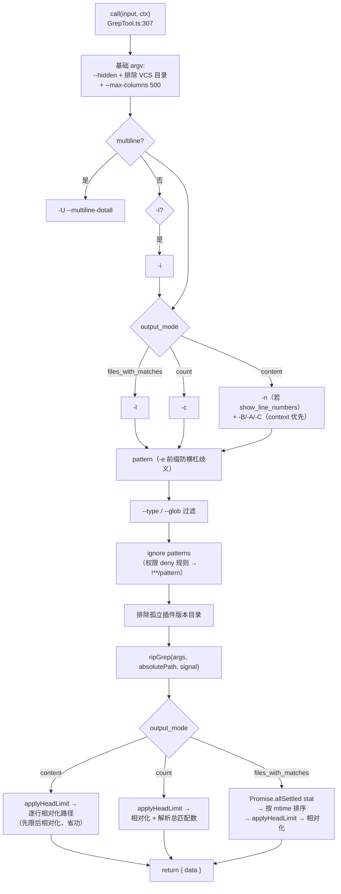
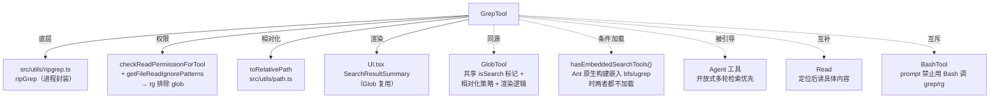

# GrepTool（Grep）工具详解

> 这是工具系统逐个拆解系列的**检索工具篇之二**。`Grep`（`GREP_TOOL_NAME = 'Grep'`）是 Claude Code 文件检索的"**内容面**"——给定正则模式，在文件内容中搜索匹配。它与 `Glob`（"名称面"）互补：Glob 按文件名找路径，Grep 按内容找路径。底层是 **ripgrep**（`rg`），支持三种输出模式（content/files_with_matches/count）、上下文行（-B/-A/-C）、行号（-n）、大小写（-i）、类型过滤（--type）、glob 过滤、多行模式（-U）、head_limit/offset 分页。自动排除 VCS 目录、限制行长 500、路径相对化省 token。

---

## 一、工具定位（一句话总结）

**`Grep` = 按正则在文件内容中搜索匹配的只读检索工具（ripgrep 封装）。**

| 维度 | 值 |
|---|---|
| 工具名 | `Grep`（常量 `GREP_TOOL_NAME`，`prompt.ts:3`） |
| 一句话 | 给定正则模式，用 ripgrep 搜索文件内容，三种输出模式 + head_limit/offset 分页 |
| 是否进 system prompt | ⚠️ **条件加载**（`tools.ts:227`）：`hasEmbeddedSearchTools() ? [] : [GlobTool, GrepTool]`——当 Ant 原生构建把 bfs/ugrep 嵌入 bun 二进制时，shell 的 find/grep 已别名到快速工具，Glob/Grep 不再需要。常规构建下两者都加载。`GREP_TOOL_NAME` 在 `CORE_TOOLS` 白名单（`constants/tools.ts:144`） |
| 只读 / 破坏性 | **只读**（`isReadOnly() → true`，`:183-185`） |
| 是否可并发 | ✅ **可并发**（`isConcurrencySafe() → true`，`:180-182`） |
| 核心依赖 | `src/utils/ripgrep.ts:ripGrep`（ripgrep 进程封装）、`src/utils/permissions/filesystem.ts`（ignore patterns） |
| 定位互补方 | `Glob`（按名称找路径）、`Agent`（开放式多轮检索）、`Read`（读具体内容） |

**为什么需要它？** 模型经常需要"我知道代码里有什么模式，但不知道在哪个文件"——比如找所有 `console.log`、找某个函数的调用点、找 TODO 注释。`Grep` 用正则一次扫遍代码库内容，比逐文件 Read 快几个数量级。prompt 明确（`prompt.ts:10`）——"搜索任务请始终用 Grep。绝不可以通过 Bash 调用 grep 或 rg"——因为 Grep 已针对正确权限和访问做了优化。

---

## 二、关键文件清单

```
GrepTool/
├── GrepTool.ts   ← buildTool({...}) 主体（574 行），schema + validateInput + call（参数→rg args 拼装）
├── prompt.ts     ← GREP_TOOL_NAME + getDescription（含正则语法、多行说明、Agent 引导）
└── UI.tsx        ← Ink 渲染（SearchResultSummary 复用组件，Glob 也复用）
```

> **注意**：GrepTool **无 src/ 子目录**——是 5 个文件操作工具中最精简的结构，所有逻辑在单文件。

| 文件 | 角色 | 必看行号 |
|---|---|---|
| `GrepTool.ts` | 工具主体：schema + validateInput + call（参数→rg argv 拼装）+ mapToolResult | `buildTool:157-574`、`inputSchema:30-87`、`validateInput:198-229`、`call:307-573`、`applyHeadLimit:107-125`、`mapToolResultToToolResultBlockParam:251-306`、`VCS_DIRECTORIES_TO_EXCLUDE:92-99`、`DEFAULT_HEAD_LIMIT:105` |
| `prompt.ts` | 工具名 + 描述（正则语法、多行、Agent 引导） | `GREP_TOOL_NAME:3`、`getDescription:6-18` |
| `UI.tsx` | 渲染（SearchResultSummary，Glob 复用） | `SearchResultSummary:15` |

> **结构特点**：GrepTool 是"单文件精简主体"型——574 行全在 `GrepTool.ts`，无 utils/types/constants 拆分（参数→rg argv 的拼装逻辑强内聚，难拆）。核心复杂度在 `call()` 的**参数到 ripgrep argv 的映射**——14 个输入参数翻译成 rg 命令行。

---

## 三、Tool 接口字段实现（`buildTool` 逐字段）

### 标识字段

```ts
name: GREP_TOOL_NAME,                      // "Grep"
searchHint: '使用正则搜索文件内容（ripgrep）',
maxResultSizeChars: 20_000,                 // ⭐ 20K（其他工具是 100K）—— 工具结果持久化阈值
strict: true,
```

> **`maxResultSizeChars: 20_000` 的特殊性**：其他文件工具是 100_000，Grep 是 20_000。因为重度 grep 会话可能产生 6-24K tokens 的 content 输出，20K 阈值让超限结果**持久化到磁盘**（减轻长会话内存压力），而非无限保留在消息数组。

### 模型面字段

```ts
async description() { return getDescription() }
async prompt()      { return getDescription() }   // 与 description 同文
userFacingName()    { return '搜索' }             // 静态
get inputSchema()   { return inputSchema() }
get outputSchema()  { return outputSchema() }
```

**输入 schema**（`:30-87`）——**14 个参数**，是文件工具中最丰富的：
```ts
{
  pattern:      string,          // 必填，正则
  path?:        string,          // 搜索路径（rg PATH），默认 cwd
  glob?:        string,          // 文件名 glob 过滤（rg --glob）
  output_mode?: 'content'|'files_with_matches'|'count',  // 默认 files_with_matches
  '-B'?:        number,          // 匹配前行数（content 模式）
  '-A'?:        number,          // 匹配后行数
  '-C'?:        number,          // context 别名
  context?:     number,          // 匹配前后行数（优先于 -B/-A）
  '-n'?:        boolean,         // 行号（默认 true）
  '-i'?:        boolean,         // 大小写不敏感
  type?:        string,          // 文件类型（rg --type）
  head_limit?:  number,          // 限制前 N 条（默认 250，0=不限）
  offset?:      number,          // 跳过前 N 条
  multiline?:   boolean,         // 多行模式（rg -U --multiline-dotall）
}
```

> **参数命名设计**：`-B`/`-A`/`-C`/`-n`/`-i` 直接对应 ripgrep 标志名，让模型能映射 CLI 经验。`semanticNumber`/`semanticBoolean` 包裹容错输入。

**输出 schema**（`:141-152`）：
```ts
{
  mode?:          'content'|'files_with_matches'|'count',
  numFiles:       number,
  filenames:      string[],
  content?:       string,         // content/count 模式
  numLines?:      number,         // content 模式
  numMatches?:    number,         // count 模式
  appliedLimit?:  number,         // 实际应用的 limit（截断时才设）
  appliedOffset?: number,
}
```

### 行为字段（重点）

| 字段 | 实现位置 | 说明 |
|---|---|---|
| `call()` | `:307-573` | 参数→rg argv 拼装 + ripGrep 调用 + 三模式后处理 |
| `validateInput()` | `:198-229` | 仅校验 path 存在性（+ UNC 豁免） |
| `checkPermissions()` | `:230-237` | 委托 `checkReadPermissionForTool` |
| `isConcurrencySafe()` | `:180-182` → `true` | 读不同内容可安全并发 |
| `isReadOnly()` | `:183-185` → `true` | 无副作用 |
| `isSearchOrReadCommand()` | `:189-191` → `{isSearch:true}` | 标记为"搜索类"（与 Glob 一致） |
| `getPath()` | `:192-194` | `path || getCwd()` |
| `preparePermissionMatcher()` | `:195-197` | 匹配 **pattern**（非 path）——`matchWildcardPattern(rulePattern, pattern)` |
| `toAutoClassifierInput()` | `:186-188` | `path ? '${pattern} in ${path}' : pattern` |
| `extractSearchText()` | `:247-250` | content 模式返回 content，否则 filenames.join |

> **`preparePermissionMatcher` 的独特性**：其他文件工具匹配 `file_path`/`path`，Grep 匹配 **pattern** 本身。这让 deny-rule 既能匹配"搜什么模式"（如 `deny: password.*`），也能匹配"在哪搜"（通过 getPath）。

### 渲染字段

```ts
userFacingName() { return '搜索' },
getToolUseSummary,
renderToolUseMessage,
renderToolUseErrorMessage,
renderToolResultMessage,   // 复用 SearchResultSummary（Glob 也复用）
```

---

## 四、核心执行流程：`call()`

`call()`（`:307-573`）核心是**把 14 个输入参数翻译成 ripgrep argv**，再按输出模式后处理：



**关键点逐条**：

1. **基础 argv**（`:327-335`）：`--hidden`（含隐藏文件）+ 排除 6 个 VCS 目录（`.git/.svn/.hg/.bzr/.jj/.sl`，`:92-99`）+ `--max-columns 500`（限制行长，防 base64/压缩内容塞满输出）。
2. **context 优先级**（`:360-373`）：`-C`/`context` 优先于 `-B`/`-A`。指定 context 则忽略 -B/-A。
3. **pattern 的 `-e` 前缀**（`:376-381`）：pattern 以横杠开头时用 `-e pattern`，防 ripgrep 解释为命令行选项。
4. **glob 智能拆分**（`:388-406`）：按空格拆分，但保留花括号模式（`*.{ts,tsx}` 不拆）；无花括号的再按逗号拆。支持多 glob 模式。
5. **ignore patterns 转换**（`:408-424`）：权限 deny 规则转成 ripgrep 排除 glob。注意路径前缀——绝对路径直接 `!pattern`，相对路径需 `!**/pattern`（ripgrep 相对 cwd 应用 gitignore 模式）。注释（`:416-417`）引用 ripgrep 讨论。
6. **ripgrep 调用**（`:438`）：`ripGrep(args, absolutePath, abortController.signal)`。注释（`:433-437`）说明——WSL 有 3-5x 性能惩罚；超时由 ripgrep 自身 execFile timeout 处理，**不用 AbortController 超时**以避免打断 agent 循环；超时抛 `RipgrepTimeoutError` 让 Claude 知道搜索未完成。
7. **content 模式后处理**（`:440-473`）：**先 applyHeadLimit 再相对化**（注释 `:444-447`）——相对化逐行处理，宽泛模式可能返 10k+ 行而 head_limit 只留 30-100 行，先限后相对化省功。
8. **count 模式**（`:475-521`）：透传 rg 原始 `filename:count` 格式，相对化后解析总匹配数和文件数。
9. **files_with_matches 模式**（`:523-572`）：`Promise.allSettled` 批量 stat（单文件 ENOENT 不让整批失败）→ 按 mtime 排序（测试环境按文件名保证确定性）→ applyHeadLimit → 相对化。

**`applyHeadLimit`**（`:107-125`）——分页核心：
- `limit === 0` 是**不限的逃生口**（`:113-115`）。
- 默认 `DEFAULT_HEAD_LIMIT = 250`（`:105`）——注释（`:101-104`）说明无界 content 可能填满 20KB 持久化阈值。
- 仅在**确实截断时**设 `appliedLimit`（`:120-123`）——让模型知道可能还有更多结果，可 offset 分页。

---

## 五、权限与安全

### `validateInput`（`:198-229`，第 3 步）——**极简**

| 校验项 | 行号 | 说明 |
|---|---|---|
| path 存在性 | `:200-225` | 仅当提供 path 时 `fs.stat`，ENOENT 则 `suggestPathUnderCwd` 建议（errorCode 1） |
| UNC 豁免 | `:205-207` | `\\`/`//` 跳过 |

> **为何这么简？** Grep 的合法性主要靠**权限系统**（checkPermissions 的 deny 规则→ignore patterns）和 **ripgrep 自身**（正则语法错误由 rg 报）。validateInput 只做最基础的路径存在性检查。

### 安全与健壮性细节

- **VCS 目录自动排除**（`:92-99`）：`.git/.svn/.hg/.bzr/.jj/.sl`——版本控制元数据制造噪音，自动排除。
- **`--max-columns 500`**（`:335`）：限制行长，防 base64/压缩内容/minified JS 塞满输出。
- **ignore patterns 注入**（`:408-424`）：权限 deny 规则转成 rg 排除 glob，确保搜索遵守用户的读限制。
- **`Promise.allSettled` 容错**（`:526-528`）：files_with_matches 模式批量 stat，单文件 ENOENT（ripgrep 扫描与 stat 之间被删）不让整批失败，按 mtime 0 排序。
- **测试环境确定性**（`:539-542`）：`NODE_ENV === 'test'` 时按文件名排序，保证测试结果确定。
- **不用 AbortController 超时**（`:433-437`）：避免打断 agent 循环；超时由 ripgrep execFile timeout 处理，抛 `RipgrepTimeoutError` 让 Claude 知道搜索未完成。

### `checkPermissions`（`:230-237`，第 4 步）

委托 `checkReadPermissionForTool`——与 Read/Glob 共用读权限管道。deny 规则通过 `getFileReadIgnorePatterns` 在 call() 中转成 rg 排除 glob。

---

## 六、与其他系统/工具的关系



- **与 `Glob` 的关系**（**最重要**）：两者是文件检索的"内容面 vs 名称面"。共享：`isSearchOrReadCommand() → {isSearch:true}` 标记、`toRelativePath` 路径相对化策略、`renderToolResultMessage` 的 SearchResultSummary 组件（Glob 的 UI.tsx:65 复用 Grep 的实现）。条件加载时两者绑定——`hasEmbeddedSearchTools() ? [] : [GlobTool, GrepTool]`（`tools.ts:227`）。
- **与 `Agent` 的关系**：`prompt.ts:14` 明确——"对于需要多轮的开放式搜索，请使用 Agent 工具"。单次确定模式用 Grep，探索性多轮搜索交给子代理。
- **与 `Bash` 的互斥**（`prompt.ts:10`）："绝不可以通过 Bash 调用 grep 或 rg"——Grep 已针对权限和访问优化，绕过它会失去这些保障。
- **与 `Read` 的互补**：Grep 定位 → Read 读全文。Grep 只返匹配行/文件，要看完整上下文用 Read。
- **与权限系统的双重集成**：`checkPermissions`（正式闸门）+ `getFileReadIgnorePatterns`（deny 规则→rg 排除 glob，确保搜索本身遵守读限制）。这是"权限即搜索约束"的设计。
- **与条件加载的关系**：`hasEmbeddedSearchTools()` 为真时（Ant 原生构建把 bfs/ugrep 嵌入 bun 二进制，shell 的 find/grep 别名到快速工具），Glob/Grep 都不加载——`tools.ts:224-227` 注释解释了这个优化。

---

## 七、亮点与设计取舍

1. **14 参数到 rg argv 的完备映射**（`:307-432`）：每个输入参数都精确对应 ripgrep 标志，且处理了优先级（context > -B/-A）、歧义（-e 前缀防横杠）、拆分（花括号 glob 保留）。这是"**CLI 工具封装**"的范本。
2. **`maxResultSizeChars: 20_000` 的差异化**：其他文件工具 100K，Grep 20K。重度 grep 会话的 content 输出 6-24K tokens，20K 让超限结果持久化到磁盘。这是对"**搜索工具输出特性**"的针对性调优。
3. **`applyHeadLimit` 的先限后相对化**（`:444-447` 注释）：content 模式先 applyHeadLimit 再逐行相对化——避免处理将被丢弃的行（宽泛模式可能 10k+ 行，head_limit 只留 30-100）。性能优化。
4. **`appliedLimit` 仅截断时设**（`:120-123`）：让模型知道"可能还有更多，可 offset 分页"。这是对模型的**分页信号**——配合 offset 参数实现探索性搜索的逐步收敛。
5. **`limit === 0` 不限逃生口**（`:113-115`）：默认 250 防膨胀，但显式传 0 可获取不限结果。prompt 描述（`:78`）警告"请谨慎使用——过大的结果集会浪费上下文"。
6. **`Promise.allSettled` 容错**（`:526-528`）：批量 stat 单文件失败不让整批失败。注释（`:524-525`）说明——文件在 ripgrep 扫描与 stat 之间被删（ENOENT）按 mtime 0 排序。
7. **测试环境确定性排序**（`:539-542`）：`NODE_ENV === 'test'` 按文件名排序，否则按 mtime。保证测试可复现。
8. **不用 AbortController 超时**（`:433-437`）：避免打断 agent 循环。超时由 ripgrep 自身处理，抛 `RipgrepTimeoutError` 让 Claude 知道搜索未完成（而非误以为无匹配）。这是对"**超时语义**"的精确处理。
9. **VCS 目录自动排除**（`:92-99`）：6 个版本控制目录自动排除——搜索结果去噪，无需用户手动指定。
10. **`--max-columns 500`**（`:335`）：限制行长防 base64/minified 内容污染。一个容易被忽略但重要的输出质量控制。
11. **ignore patterns 的路径前缀处理**（`:416-422`）：绝对路径 `!pattern`，相对路径 `!**/pattern`——注释引用 ripgrep 讨论，正确处理 rg 相对 cwd 应用 gitignore 的语义。

---

## 八、源码导航（书签速查）

| 想看什么 | 去哪里 |
|---|---|
| 工具名 + 描述（正则/多行/Agent 引导） | `prompt.ts:3,6-18` |
| 输入 schema（14 参数） | `GrepTool.ts:30-87` |
| 输出 schema | `GrepTool.ts:141-152` |
| `buildTool` 字段填充 | `GrepTool.ts:157-574` |
| `validateInput`（path 存在性 + UNC） | `GrepTool.ts:198-229` |
| `call()` 参数→rg argv 拼装 | `GrepTool.ts:307-437` |
| 三模式后处理 | `GrepTool.ts:440-572` |
| `applyHeadLimit`（分页核心） | `GrepTool.ts:107-125` |
| `mapToolResultToToolResultBlockParam`（三模式序列化） | `GrepTool.ts:251-306` |
| VCS 目录排除 | `GrepTool.ts:92-99` |
| `DEFAULT_HEAD_LIMIT` | `GrepTool.ts:105` |
| ignore patterns→rg glob | `GrepTool.ts:408-424` |
| context 优先级 | `GrepTool.ts:360-373` |
| 条件加载（hasEmbeddedSearchTools） | `src/tools.ts:227` |
| ripgrep 底层封装 | `src/utils/ripgrep.ts:ripGrep` |
| 读权限 + ignore patterns | `src/utils/permissions/filesystem.ts` |
| 渲染（SearchResultSummary，Glob 复用） | `UI.tsx:15` |

---

## 九、学习建议与验证清单

**怎么读这章**：这是检索工具的"内容面"，与 Glob 对照阅读最佳。先看"一、定位"建立"内容面 vs 名称面"心智，再跳到"四、call()"的参数→argv 映射 mermaid——核心复杂度在这。然后看 `applyHeadLimit` 的分页设计（先限后相对化、appliedLimit 信号、0 不限逃生口）。最后看"六、关系"的条件加载（hasEmbeddedSearchTools），理解工具注册的条件性。

**验证清单（读完自测）**：
- [ ] 能说出 Grep 与 Glob 的分工（内容面 vs 名称面）
- [ ] 能指出 Grep 的 `maxResultSizeChars` 与其他文件工具不同（20K vs 100K）及原因
- [ ] 能解释 `applyHeadLimit` 的先限后相对化为何省功（避免处理将被丢弃的行）
- [ ] 能说出 `appliedLimit` 仅截断时设的作用（分页信号，配合 offset）
- [ ] 能指出 `limit === 0` 的含义（不限逃生口）
- [ ] 能说出 context 与 -B/-A 的优先级（context/-C 优先）
- [ ] 能解释 pattern 以横杠开头时为何用 `-e` 前缀（防 ripgrep 解释为选项）
- [ ] 能说出 VCS 目录自动排除清单（.git/.svn/.hg/.bzr/.jj/.sl）
- [ ] 能解释 `Promise.allSettled` 在 files_with_matches 模式的作用（单文件 ENOENT 不让整批失败）
- [ ] 能说出为何不用 AbortController 超时（避免打断 agent 循环，由 ripgrep 自身超时）
- [ ] 能指出条件加载的条件（`hasEmbeddedSearchTools()`，Ant 原生构建嵌入 bfs/ugrep 时不加载）
- [ ] 能解释 `preparePermissionMatcher` 为何匹配 pattern 而非 path（让 deny-rule 能匹配"搜什么模式"）

**配合动作**：
1. 让 Claude `Grep` 一个宽泛模式（如 `.`），观察 head_limit=250 截断 + appliedLimit 分页信号
2. 传 `head_limit=0`，观察不限结果（注意 prompt 的谨慎警告）
3. 用 offset 分页获取第二批结果
4. 在 content 模式用 `-C 3`，观察上下文行；再同时传 `-B 1 -A 1`，验证 context 优先
5. 构造 deny-rule 拦截某目录，验证 `getFileReadIgnorePatterns` 转 rg 排除 glob 生效
6. 用 `multiline: true` 搜跨行模式（如 `struct\s*\{[^}]*field`），对比单行模式
