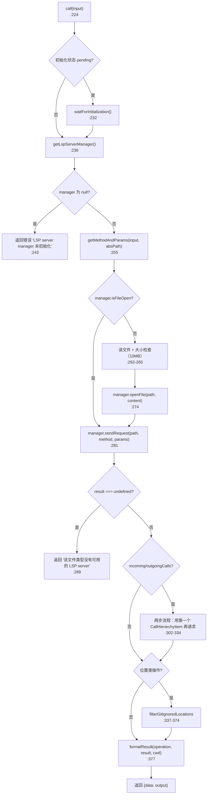
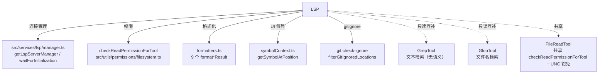

# LSPTool 工具详解

> 这是工具系统逐个拆解系列的一篇。`LSPTool` 是一个**复杂**的多操作工具：一个工具名 (`LSP`) 背后挂了 9 种 LSP 操作（goToDefinition/findReferences/hover/documentSymbol/workspaceSymbol/goToImplementation/prepareCallHierarchy/incomingCalls/outgoingCalls）。它的 `call()` 把"操作名 → LSP 方法 + 参数 → 结果格式化"的完整管道内联在主体文件里。这是理解"如何用一个工具承载多操作、操作间共享预处理与后处理"的关键样本。

---

## 一、工具定位（一句话总结）

**`LSPTool` = 代码智能客户端，9 种 LSP 操作的统一入口。**

| 维度 | 值 |
|---|---|
| 工具名 | `LSP`（常量 `LSP_TOOL_NAME`，`prompt.ts:1`） |
| 一句话 | 对文件某位置执行 9 种 LSP 操作之一（定义/引用/悬停/符号/调用层次等），返回格式化结果 |
| 是否进 system prompt | ✅ **在** `CORE_TOOLS` 白名单（`src/constants/tools.ts:165`） |
| 注册门控 | `isEnvTruthy(process.env.ENABLE_LSP_TOOL)`（`src/tools.ts:253`）——**需显式环境变量启用** |
| 运行时门控 | `isEnabled()` 返回 `isLspConnected()`（`:138`）——LSP 服务器未连时工具自动禁用 |
| 只读 / 破坏性 | **只读**（`isReadOnly: true`，`:149`） |
| 是否可并发 | ✅ **可并发**（`:146`） |
| 核心依赖 | `src/services/lsp/manager.ts` 的 `LspServerManager`（连接管理 + 请求分发） |

**为什么需要它？** `Grep`/`Glob` 是文本检索，不理解代码语义。`LSPTool` 接入 Language Server（如 TypeScript LS、Rust-analyzer），提供"跳转定义""查找引用""悬停文档"这类编辑器级能力。这让模型能精确理解符号关系，而非靠正则猜。

---

## 二、关键文件清单

```
LSPTool/
├── LSPTool.ts        ← buildTool({...}) 主体（861 行）——★ 真正的 buildTool 在这，不是 formatters.ts
├── formatters.ts     ← 9 种操作的格式化函数（把 LSP 返回值转成人类可读文本）
├── schemas.ts        ← 可辨识联合 schema（9 种操作的 discriminated union）
├── symbolContext.ts  ← getSymbolAtPosition：从文件提取位置处的符号名（供 UI 展示）
├── UI.tsx            ← Ink 渲染（含 OPERATION_LABELS 标签表、折叠/展开视图）
├── prompt.ts         ← LSP_TOOL_NAME + DESCRIPTION（9 种操作说明）
└── __tests__/        ← 测试目录
```

| 文件 | 角色 | 必看行号 |
|---|---|---|
| `LSPTool.ts` | **主体**：schema + validateInput + checkPermissions + call() + getMethodAndParams + formatResult + filterGitIgnoredLocations | `buildTool:127`、`call:224`、`getMethodAndParams:427`、`formatResult:636`、`filterGitIgnoredLocations:556`、`MAX_LSP_FILE_SIZE_BYTES:53` |
| `schemas.ts` | 9 种操作的 discriminated union（供 validateInput 严格校验） | `lspToolInputSchema:8`、`isValidLSPOperation:201` |
| `formatters.ts` | 9 个 `format*Result` 函数，把 LSP 类型化结果转文本 | （独立模块，被 `:35-43` 导入） |
| `symbolContext.ts` | `getSymbolAtPosition`：同步读文件前 64KB 提取符号 | `getSymbolAtPosition:20`、`MAX_READ_BYTES:6` |
| `UI.tsx` | `OPERATION_LABELS`（每操作的 singular/plural 标签）+ 折叠/展开渲染 | `OPERATION_LABELS:13`、`renderToolUseMessage:98`、`LSPResultSummary:28` |
| `prompt.ts` | DESCRIPTION：9 种操作 + 参数说明 | `LSP_TOOL_NAME:1`、`DESCRIPTION:3` |

> **结构特点**：`LSPTool.ts` 是绝对主体（861 行），内联了 `getMethodAndParams`/`formatResult`/`filterGitIgnoredLocations` 等大块逻辑。`formatters.ts` 只负责"格式化"这一步，被主体导入。**注意**：`formatters.ts` 不含 `buildTool`，真正的工具主体是 `LSPTool.ts`。

---

## 三、Tool 接口字段实现（`buildTool` 逐字段）

### 标识字段

```ts
name: LSP_TOOL_NAME,                    // "LSP"
searchHint: '代码智能（定义、引用、符号、悬停）',
maxResultSizeChars: 100_000,
isLsp: true,                            // ★ 专属标记：标识这是 LSP 类工具
shouldDefer: true,
```

> **`isLsp: true`**（`:131`）：系列里独有的元数据字段，标记此工具为 LSP 类。可能用于工具分类、统计或特殊调度。

### 模型面字段

```ts
async description() { return DESCRIPTION }
async prompt()      { return DESCRIPTION }     // 与 description 同文
userFacingName,                                     // 来自 UI.tsx:94，返回 'LSP'
```

**输入 schema**（`:59-86`，`z.strictObject`）—— **扁平版本**：
```ts
{
  operation: enum[9种],
  filePath: string,
  line: number,        // 1-based（与编辑器一致）
  character: number,   // 1-based
}
```

> **两套 schema 的设计**（`:56-58` 注释）：对外（API/模型）用扁平 `z.strictObject`（兼容性好），对内（validateInput）用 `schemas.ts` 的 discriminated union（类型安全 + 更好的错误信息）。`validateInput` 在 `:157` 用 `lspToolInputSchema().safeParse(input)` 做严格校验。

### 行为字段

| 字段 | 实现 | 说明 |
|---|---|---|
| `call()` | `:224` | 核心逻辑（见下节） |
| `validateInput(input)` | `:155` | 用 discriminated union 严格校验 + 文件存在性 + UNC 安全豁免 |
| `checkPermissions(input, context)` | `:210` | 委托 `checkReadPermissionForTool`（与 Glob/Grep 同管道） |
| `isEnabled()` | `:137` | `isLspConnected()`——LSP 未连时自动禁用 |
| `isReadOnly()` | `:149` | `true` |
| `isConcurrencySafe()` | `:146` | `true`（多个 LSP 查询可并发） |
| `getPath({filePath})` | `:152` | 返回 `expandPath(filePath)`，供权限/UI 使用 |
| `toAutoClassifierInput` | — | 未自定义（用默认） |

---

## 四、核心执行流程：`call()`

`call()`（`:224-414`）是本工具的核心，处理 9 种操作的完整管道：



**关键点逐条**：

1. **等待初始化**（`:230-233`）：若 LSP server 仍在初始化（`status === 'pending'`），`waitForInitialization()` 阻塞等待，避免过早返回"no server available"。
2. **文件大小守卫**（`:265-272`）：`MAX_LSP_FILE_SIZE_BYTES = 10_000_000`（10MB，`:53`）。超过则拒绝，避免 LSP server 卡在大文件上。
3. **`didOpen` 前置**（`:261-278`）：大多数 LSP server 要求先 `textDocument/didOpen` 才能做其他操作。仅在文件未打开时才读内容并 `openFile`，避免重复 I/O。
4. **两步调用层次**（`:302-334`）：`incomingCalls`/`outgoingCalls` 实际是两步——先 `prepareCallHierarchy` 拿 `CallHierarchyItem`，再用第一个 item 请求 `callHierarchy/incomingCalls` 或 `outgoingCalls`。
5. **gitignore 过滤**（`:337-374`）：`findReferences`/`goToDefinition`/`goToImplementation`/`workspaceSymbol` 的结果会过滤掉 gitignored 文件——用 `git check-ignore` 批量检查（每批 50 路径，`:580`）。
6. **格式化 + 计数**（`:377-381`）：`formatResult`（`:636-829`）按 operation 分支，调用对应 `format*Result`（来自 `formatters.ts`），同时提取 `resultCount`/`fileCount` 供 UI 折叠展示。

### `getMethodAndParams`（`:427-513`）—— 操作 → LSP 方法映射

把 9 种操作映射为 LSP 协议方法和参数：
- 位置类（goToDefinition/findReferences/hover/goToImplementation/prepareCallHierarchy）：用 `textDocument/*` + `{textDocument:{uri}, position}`
- `documentSymbol`：`textDocument/documentSymbol`，无 position
- `workspaceSymbol`：`workspace/symbol` + `{query:''}`（空查询返回所有符号）
- `incomingCalls`/`outgoingCalls`：先映射到 `prepareCallHierarchy`（两步流程的第一步）
- **1-based → 0-based 转换**（`:434-436`）：用户输入 1-based，LSP 协议要 0-based

### `formatResult`（`:636-829`）—— 结果格式化 + 计数

按 operation 分支，调用 `formatters.ts` 的对应函数，同时统计：
- `resultCount`：结果数（定义数/引用数/符号数等）
- `fileCount`：跨文件数（用 `countUniqueFiles` 系列函数）
- 对畸形数据（`uri` 为 undefined）记录 `logError` 但优雅过滤（`:654-662` 等多处）

---

## 五、权限与安全

### `validateInput`（`:155-209`）

**两阶段校验**：
1. **discriminated union 严格校验**（`:157-164`）：用 `lspToolInputSchema().safeParse`，失败返回 `errorCode: 3` + 详细错误信息
2. **文件存在性校验**（`:166-208`）：
   - **UNC 路径豁免**（`:170-173`）：`\\` 或 `//` 开头路径跳过 `fs.stat`，防 NTLM 凭据泄露（与 GlobTool 同安全考量）
   - ENOENT → `errorCode: 1`
   - 非 ENOENT 的 stat 错误 → `logError` + `errorCode: 4`
   - 不是文件（是目录）→ `errorCode: 2`

### `checkPermissions`（`:210-217`）

```ts
async checkPermissions(input, context) {
  const appState = context.getAppState()
  return checkReadPermissionForTool(LSPTool, input, appState.toolPermissionContext)
}
```

委托给通用读权限管道 `checkReadPermissionForTool`（`src/utils/permissions/filesystem.ts`）——与 Glob/Grep/FileRead 共用。用 `getPath()` 返回的 `expandPath(filePath)` 作为权限判据路径。

### 运行时门控

- `isEnabled()` 返回 `isLspConnected()`——LSP 服务器未连接时工具从工具池消失，模型看不到它
- 注册还需 `ENABLE_LSP_TOOL` 环境变量（`src/tools.ts:253`）

### 文件大小守卫（`:265`）

10MB 上限防止 LSP server 处理大文件时卡死，也防止读取超大文件占满内存。

---

## 六、与其他系统/工具的关系



- **与 LSP 管理器的关系**：深度依赖 `src/services/lsp/manager.ts`——连接状态查询（`isLspConnected`/`getInitializationStatus`）、等待初始化（`waitForInitialization`）、获取管理器（`getLspServerManager`）、文件打开（`openFile`/`isFileOpen`）、请求发送（`sendRequest`）。LSPTool 是 manager 的薄客户端。
- **与权限系统的关系**：与 Glob/Grep/FileRead 共享 `checkReadPermissionForTool`——所有只读文件工具同一权限管道，UNC 路径安全豁免策略也一致。
- **与 Grep/Glob 的关系**：语义互补。Grep/Glob 是文本检索（无语义理解），LSP 是代码智能（理解符号关系）。模型按需选择。
- **与 formatters 的关系**：`formatters.ts` 是纯函数模块，9 个 `format*Result` 把类型化 LSP 结果转人类可读文本。LSPTool 导入它们（`:35-43`）。
- **与 UI 的关系**：`symbolContext.ts` 的 `getSymbolAtPosition` 在 `renderToolUseMessage`（`UI.tsx:117`）里被调用，同步读文件提取符号名展示。`OPERATION_LABELS`（`UI.tsx:13`）给每操作定制标签（definition/reference/symbol/caller 等）。

---

## 七、亮点与设计取舍

1. **一个工具承载 9 种操作**（`:62-72`）：用 `operation` enum 字段统一 9 种 LSP 操作，而非 9 个独立工具。代价是 `call()` 较长，收益是模型只需记一个工具名 + 共享的 filePath/line/character 参数。
2. **两套 schema 设计**（`:56-58` 注释）：对外扁平 `z.strictObject`（API 兼容），对内 discriminated union（类型安全）。validateInput 用 union 做严格校验获得更好错误信息——这是"模型友好 vs 类型安全"的平衡。
3. **`isLsp: true` 元数据字段**（`:131`）：系列里独有的工具分类标记，可能用于统计或特殊调度。
4. **两步调用层次**（`:302-334`）：`incomingCalls`/`outgoingCalls` 在 LSP 协议里本就是两步（prepare + actual calls），工具把这层复杂度封装在内部，模型只发一个 operation。
5. **gitignore 过滤**（`:337-374`）：位置类操作的结果过滤掉 gitignored 文件，避免模型看到 node_modules 等噪声。用 `git check-ignore` 批量检查（每批 50 路径）保证性能。
6. **文件大小守卫**（`:53, 265`）：10MB 上限保护 LSP server 和内存。
7. **畸形数据容错**（`:654-662` 等）：LSP server 可能返回 `uri` 为 undefined 的位置，工具记录 `logError` 但优雅过滤，不崩溃。
8. **符号上下文增强**（`symbolContext.ts`）：`renderToolUseMessage` 同步读文件前 64KB 提取符号名（`:34` `readSync`，注释说明从同步 React 渲染调用），让"调用工具"消息展示"符号：xxx"而非裸坐标。
9. **1-based ↔ 0-based 转换**（`:434-436`）：用户/模型输入 1-based（与编辑器一致），内部转 0-based 给 LSP 协议——这层转换藏在 `getMethodAndParams` 里。
10. **等待初始化**（`:230-233`）：避免初始化未完成时过早返回错误，提升首次使用体验。

---

## 八、源码导航（书签速查）

| 想看什么 | 去哪里 |
|---|---|
| 工具名常量 + DESCRIPTION | `LSPTool/prompt.ts:1,3` |
| `buildTool` 字段填充 | `LSPTool.ts:127-422` |
| 输入 schema（扁平版） | `LSPTool.ts:59-86` |
| 输入 schema（discriminated union） | `schemas.ts:8-191` |
| `validateInput`（含 UNC 豁免） | `LSPTool.ts:155-209` |
| `checkPermissions` | `LSPTool.ts:210-217` |
| `call()` 核心管道 | `LSPTool.ts:224-414` |
| `getMethodAndParams`（操作映射） | `LSPTool.ts:427-513` |
| `formatResult`（格式化 + 计数） | `LSPTool.ts:636-829` |
| `filterGitIgnoredLocations` | `LSPTool.ts:556-611` |
| 文件大小守卫常量 | `LSPTool.ts:53` |
| 符号提取（UI 用） | `symbolContext.ts:20` |
| 操作标签表 | `UI.tsx:13-23` |
| 注册门控 | `src/tools.ts:253`（`ENABLE_LSP_TOOL`） |
| LSP 管理器 | `src/services/lsp/manager.ts` |

---

## 九、学习建议与验证清单

**怎么读这章**：先确认主体文件是 `LSPTool.ts`（不是 `formatters.ts`），再看"一、工具定位"理解 9 操作统一入口，然后精读"四、call()"的完整管道，最后看 `getMethodAndParams`/`formatResult` 两个辅助函数理解操作映射。

**验证清单（读完自测）**：
- [ ] 能确认真正的 `buildTool` 主体文件是 `LSPTool.ts`（861 行），`formatters.ts` 只是格式化函数模块
- [ ] 能说出 9 种 LSP 操作（goToDefinition/findReferences/hover/documentSymbol/workspaceSymbol/goToImplementation/prepareCallHierarchy/incomingCalls/outgoingCalls）
- [ ] 能解释为什么有两套 schema（扁平版对外兼容，discriminated union 对内类型安全）
- [ ] 能指出 `isLsp: true` 字段的特殊性（系列独有的工具分类标记）
- [ ] 能解释 incomingCalls/outgoingCalls 为什么是两步流程（LSP 协议要求先 prepare 再 actual calls）
- [ ] 能说出 `filterGitIgnoredLocations` 的作用和实现（git check-ignore 批量过滤，每批 50）
- [ ] 能指出文件大小上限（10MB）和它的作用（保护 LSP server + 内存）
- [ ] 能说出 UNC 路径豁免的安全意义（防 NTLM 凭据泄露）
- [ ] 能解释注册门控（`ENABLE_LSP_TOOL` 环境变量 + `isLspConnected` 运行时门控）
- [ ] 能指出 1-based ↔ 0-based 转换发生在哪（`getMethodAndParams:434-436`）

**配合动作**：
1. 设置 `ENABLE_LSP_TOOL=1`，让 Claude 对某函数调 `LSP { operation: 'findReferences', ... }`，观察返回
2. 对未打开的文件调 LSP，验证 `didOpen` 前置生效
3. 对超大文件（>10MB）调 LSP，验证大小守卫
4. 在 `getMethodAndParams:438` 的 switch 加日志，观察不同 operation 的 method 映射
5. 对照阅读 `formatters.ts` 的某个 `format*Result`，理解类型化结果如何转文本
6. 在 `symbolContext.ts:34` 加日志，验证 `renderToolUseMessage` 同步读文件提取符号
