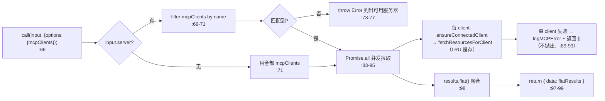
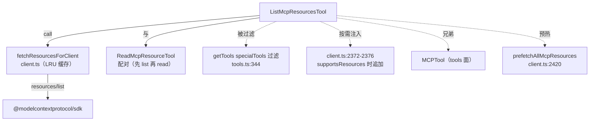

# ListMcpResourcesTool 工具详解

> 这是 MCP 协议**-resources 面**的只读检索工具。MCP 服务器除了提供 tools（可调用函数），还可以提供 resources（静态/动态资源，如配置文件、文档、数据库 schema）。`ListMcpResourcesTool` 让模型列出所有已连接服务器的 resources。它有一个特殊身份：**被 `getTools()` 过滤掉的"特殊内部工具"**（`tools.ts:343-349`）——它不在常规工具池里，只在 `getMcpToolsCommandsAndResources` 检测到至少一个服务器支持 resources 时才手动注入（`client.ts:2372-2376`）。这避免了"没有 resources 服务器时仍暴露无用工具"。

---

## 一、工具定位（一句话总结）

**`ListMcpResourcesTool` = 列出已连接 MCP 服务器 resources 的只读检索工具（按需注入）。**

| 维度 | 值 |
|---|---|
| 工具名 | `'ListMcpResourcesTool'`（`prompt.ts:1` 常量 `LIST_MCP_RESOURCES_TOOL_NAME`） |
| 一句话 | 列出所有（或指定）已连接 MCP 服务器的 resources，每项含 server 字段 |
| 是否进 system prompt | ⚠️ **特殊**：在 `getAllBaseTools()` 里（`tools.ts:275`），但被 `getTools()` 的 `specialTools` 过滤掉（`tools.ts:344`），由 `client.ts` 按需注入 |
| 只读 / 破坏性 | **只读**（`isReadOnly: () => true`，`:45`） |
| 是否可并发 | ✅ **可并发**（`isConcurrencySafe: () => true`，`:42`） |
| 是否延迟 | ✅ `shouldDefer: true`（`:50`）——通过 SearchExtraTools 按需发现 |
| 核心依赖 | `client.ts` 的 `fetchResourcesForClient`（LRU 缓存）+ `ensureConnectedClient` |
| 兄弟工具 | `ReadMcpResourceTool`（读单个 resource）、`MCPTool`（tools 面） |

**为什么需要它？** MCP 协议区分 tools 和 resources：tools 是"可调用的动作"，resources 是"可读取的数据源"。有些服务器只暴露 resources 不暴露 tools（如只读文档库）。没有 ListMcpResourcesTool，模型就无法感知这些数据源的存在。它与 `ReadMcpResourceTool` 配对——先 list 再 read，是 resources 面的标准两步检索模式。

---

## 二、关键文件清单

```
ListMcpResourcesTool/
├── ListMcpResourcesTool.ts ← buildTool({...}) 主体（123 行）
├── prompt.ts              ← 工具名常量 + DESCRIPTION + PROMPT
└── UI.tsx                 ← Ink 渲染（调用展示 + 结果 JSON 展示）
```

| 文件 | 角色 | 必看行号 |
|---|---|---|
| `ListMcpResourcesTool.ts` | 主体：schema + call() + mapToolResult | `buildTool:40`、`call:66`、`mapToolResultToToolResultBlockParam:107` |
| `prompt.ts` | 工具名 + 描述（含用法示例） | `LIST_MCP_RESOURCES_TOOL_NAME:1`、`DESCRIPTION:3-10`、`PROMPT:12-20` |
| `UI.tsx` | 渲染（空结果/有结果两路） | `renderToolUseMessage:10`、`renderToolResultMessage:14` |
| `src/tools.ts` | **过滤逻辑**：`specialTools` set + `getTools` filter | `:343-349`（过滤）、`:275-276`（注册） |
| `src/services/mcp/client.ts` | **注入逻辑**：supportsResources 时追加 | `:2372-2376`（注入）、`fetchResourcesForClient`（LRU 缓存） |

> **结构特点**：标准三文件结构（主体/prompt/UI），逻辑简洁。它的"特殊性"全在注册/过滤/注入的编排上（跨 `tools.ts` 和 `client.ts`），而非工具自身逻辑。

---

## 三、Tool 接口字段实现（`buildTool` 逐字段）

### 标识字段

```ts
name: LIST_MCP_RESOURCES_TOOL_NAME,           // 'ListMcpResourcesTool'（:51）
searchHint: '列出已连接 MCP 服务器的资源',     // :52，TF-IDF 索引关键词
maxResultSizeChars: 100_000,                  // :53
shouldDefer: true,                            // :50，延迟工具
userFacingName: () => 'listMcpResources',     // :102
```

### 模型面字段

```ts
async description() { return DESCRIPTION },  // :54
async prompt()      { return PROMPT },        // :57
get inputSchema()   { return inputSchema() }, // :60
get outputSchema()  { return outputSchema() },// :63
```

**输入 schema**（`:15-22`）：
```ts
{
  server?: string  // 可选，按服务器名过滤；省略 = 所有服务器
}
```

**输出 schema**（`:25-35`）：
```ts
Array<{
  uri: string,           // 资源 URI（如 "config://app"）
  name: string,          // 资源名称
  mimeType?: string,     // MIME 类型
  description?: string,  // 资源描述
  server: string,        // 提供该资源的服务器名（额外字段）
}>
```

> **`server` 字段是额外追加的**：MCP 协议的 resources 响应本身不含 server 名（因为是向单个 server 请求）。本工具在聚合多 server 结果时给每项追加 `server` 字段，让模型知道每个资源属于哪个 server——这对 `ReadMcpResourceTool`（需要 server 名参数）是必要的前置信息。

### 行为字段

| 字段 | 实现 | 说明 |
|---|---|---|
| `call()` | `:66-100` | 核心逻辑（见下节） |
| `isConcurrencySafe()` | `:42` → `true` | 并发读不同服务器安全 |
| `isReadOnly()` | `:45` → `true` | 纯读 |
| `toAutoClassifierInput(input)` | `:48` → `input.server ?? ''` | 自动审批分类器输入 |
| `isResultTruncated(output)` | `:104` | 基于 JSON 序列化长度判截断 |
| `mapToolResultToToolResultBlockParam` | `:107-121` | 空结果给友好提示，非空 JSON 序列化 |

### 渲染字段

```ts
renderToolUseMessage,      // UI.tsx:10 → "列出所有 MCP 资源" 或 "列出服务器 X 的 MCP 资源"
renderToolResultMessage,   // UI.tsx:14 → 空结果灰字提示，非空 pretty JSON
```

---

## 四、核心执行流程：`call()`

`call()`（`:66-100`）聚合多个服务器的 resources，单个服务器失败不拖垮整体。



**关键点逐条**：

1. **从 context 取 mcpClients**（`:66`）：`call(input, { options: { mcpClients } })`——工具从调用上下文拿到当前所有 MCP 连接。这些连接由 `useManageMCPConnections` 维护、通过 QueryEngine 注入。

2. **按 server 过滤**（`:69-71`）：`targetServer` 提供时只处理该 server；未提供时处理全部。过滤后若空（server 名拼错）抛错并列出所有可用服务器名（`:73-77`）——帮模型自我纠正。

3. **并发拉取 + 容错**（`:83-95`）：`Promise.all` 并发拉所有 server。单个 server 失败（重连异常等）只 `logMCPError` + 返回 `[]`，**不抛出**——保证一个 server 挂掉不影响其他 server 的结果聚合。

4. **`ensureConnectedClient`**（`:87`）：确保连接健康。健康时是 no-op（memoize 命中）；`onclose` 后返回新连接以便重新拉取。

5. **`fetchResourcesForClient` 的 LRU 缓存**（注释 `:79-82`）：按服务器名缓存 resources。启动预取时预热，`onclose` 和 `resources/list_changed` 通知时失效——结果从不过期，性能极佳。

6. **`results.flat()`**（`:98`）：把多 server 的二维数组拍平成一维。每个资源项已含 `server` 字段（由 `fetchResourcesForClient` 追加）。

7. **返回 `{ data: flatResults }`**（`:97`）：同步返回（非 async generator yield），因为 list 是原子操作，无中间进度。

### `mapToolResultToToolResultBlockParam`（`:107-121`）

```ts
if (!content || content.length === 0) {
  content: '未找到资源。即使没有资源，MCP 服务器仍可能提供工具。'  // 关键引导
}
content: jsonStringify(content)
```

**空结果的友好提示值得注意**：它主动告诉模型"没有 resources 不代表 server 没用，可能它只提供 tools"。防止模型因空 resources 列表误判 server 无价值。

---

## 五、权限与安全

ListMcpResourcesTool **没有定义 `checkPermissions`**——走默认权限管道（由全局 allow/deny 规则 + 运行时确认处理）。

**安全特性**：

1. **纯只读**（`isReadOnly: true`）：只调 `resources/list`，不修改任何状态。
2. **可并发**（`isConcurrencySafe: true`）：多 server 并发拉取安全。
3. **容错聚合**（`:89-93`）：单 server 失败不影响其他，不会因一个坏 server 阻塞整体。
4. **依赖 MCP 协议的 resources 权限**：MCP 服务器自身控制向 Claude Code 暴露哪些 resources；本工具只能列出服务器主动暴露的，不能越权访问。

> **为何不内置 `checkPermissions`**：resources 是服务器已主动暴露的元数据（URI + name + description），列出它们不涉及敏感内容。读取具体内容（`ReadMcpResourceTool`）才可能涉及敏感数据，由那个工具的调用走权限确认。

---

## 六、与其他系统/工具的关系



- **与 `ReadMcpResourceTool` 的关系**：配对工具。list 提供 `uri` + `server`，read 用这两个参数读具体内容。标准两步检索模式（类似 Glob 找文件 → Read 读文件）。

- **与 `MCPTool` 的关系**：兄弟工具，覆盖 MCP 协议的不同面。MCPTool 处理 tools（动作），ListMcpResourcesTool/ReadMcpResourceTool 处理 resources（数据源）。两者都 `isMcp` 系（但本工具没设 `isMcp: true`，因为它不调用 `tools/call`）。

- **与 `tools.ts` 注册/过滤的关系**（**核心特殊性**）：
  - **注册**：在 `getAllBaseTools()` 里（`:275`），所以它进 `CORE_TOOLS` 相关的延迟判定流程。
  - **过滤**：`getTools()`（`:309`）用 `specialTools` set（`:343-347`）把它从常规工具池**剔除**。同 set 的还有 `ReadMcpResourceTool` 和 `SyntheticOutputTool`。
  - **注入**：`getMcpToolsCommandsAndResources`（`client.ts:2372-2376`）在遍历 server 时，若发现某 server `supportsResources` 且尚未添加资源工具，就把 `ListMcpResourcesTool` + `ReadMcpResourceTool` 追加到该 server 的工具列表里（用 `resourceToolsAdded` 标志保证只加一次）。
  
  这套"注册→过滤→按需注入"的三段式编排，确保：**只有当至少一个 server 提供 resources 时，这两个工具才出现在模型可见的工具池里**。

- **与 `prefetchAllMcpResources`（`client.ts:2420`）的关系**：启动时预热 resources 缓存，让首次 `ListMcpResources` 调用直接命中 LRU、无需等待网络。

- **与 `resources/list_changed` 通知的关系**：MCP 服务器可在运行时通知 resources 列表变化，`fetchResourcesForClient` 的缓存据此失效，保证下次 list 拿到最新结果。

---

## 七、亮点与设计取舍

1. **"注册-过滤-按需注入"三段式**（跨 `tools.ts` + `client.ts`）：避免在没有任何 resources 服务器时仍向模型暴露无用的 list/read 工具。模型看到的工具集始终与实际能力匹配——减少幻觉调用（模型调一个永远空结果的工具）。

2. **`server` 字段额外追加**：MCP resources 响应本身不含 server 名（单 server 请求）。本工具聚合时给每项加 `server`，让模型能直接把结果喂给 `ReadMcpResourceTool({server, uri})`——闭环设计。

3. **容错聚合**（`:89-93`）：单 server 失败返回 `[]` 而非抛出，保证部分可用。这对多 server 场景（用户可能装 10+ MCP server）至关重要——一个 server 挂掉不能让整个 list 工具不可用。

4. **LRU 缓存 + 通知失效**（`fetchResourcesForClient`）：resources 列表变化频率低，缓存命中率高；`onclose` / `list_changed` 主动失效保证不脏。性能与一致性兼顾。

5. **空结果的引导提示**（`:108-114`）：`"未找到资源。即使没有资源，MCP 服务器仍可能提供工具。"`——防止模型误判 server 无价值。细节处见对模型行为的预判与引导。

6. **`shouldDefer: true`**（`:50`）：延迟工具，通过 SearchExtraTools 按需发现。resources 操作不常用，没必要进初始 system prompt 占 token。

7. **并发安全 + 只读标记**：让权限系统/调度器能放心并发执行、自动审批，不阻塞主流程。

---

## 八、源码导航（书签速查）

| 想看什么 | 去哪里 |
|---|---|
| `buildTool` 主体 | `ListMcpResourcesTool/ListMcpResourcesTool.ts:40-122` |
| 工具名常量 + 描述 | `ListMcpResourcesTool/prompt.ts:1-20` |
| `call()` 聚合逻辑 | `ListMcpResourcesTool.ts:66-100` |
| 空结果友好提示 | `ListMcpResourcesTool.ts:108-114` |
| 输入/输出 schema | `ListMcpResourcesTool.ts:15-35` |
| **过滤逻辑**（specialTools） | `src/tools.ts:343-349` |
| **按需注入**（supportsResources） | `src/services/mcp/client.ts:2372-2376` |
| resources 拉取 + LRU 缓存 | `src/services/mcp/client.ts:fetchResourcesForClient` |
| 启动预热 | `src/services/mcp/client.ts:prefetchAllMcpResources:2420` |
| 渲染（调用/结果） | `ListMcpResourcesTool/UI.tsx:10,14` |

---

## 九、学习建议与验证清单

**怎么读这章**：先看"一、工具定位"理解它的**特殊性**（被过滤的内部工具），再跳到"六、关系图"的"注册-过滤-按需注入"三段式——这是它和普通工具最大的不同。`call()` 本身很简单（聚合 + 容错），重点理解它**何时**出现在工具池里。

**验证清单（读完自测）**：
- [ ] 能说出 ListMcpResourcesTool 为什么是"特殊内部工具"（在 `getAllBaseTools` 但被 `getTools` 过滤，由 `client.ts` 按需注入）
- [ ] 能指出 `specialTools` set 里还有谁（`ReadMcpResourceTool`、`SyntheticOutputTool`）
- [ ] 能解释 `server` 字段为什么需要额外追加（MCP resources 响应不含 server 名，但 ReadMcpResourceTool 需要它）
- [ ] 能说出单 server 拉取失败时的行为（返回 `[]` 不抛出，保证容错聚合）
- [ ] 能找到注入这两个资源工具的条件（至少一个 server `supportsResources`，`client.ts:2373`）
- [ ] 能解释空结果提示的作用（防模型误判 server 无价值）
- [ ] 能指出它与 `ReadMcpResourceTool` 的配对关系（list 提供 uri+server，read 消费）

**配合动作**：
1. 装一个支持 resources 的 MCP 服务器（如 `@modelcontextprotocol/server-filesystem`），调用 `ListMcpResourcesTool`，观察返回的 `server` 字段
2. 不装任何 resources 服务器，验证这两个工具**不**出现在工具池（对比 MCP 工具列表）
3. 在 `client.ts:2374` 的 `resourceToolsAdded = true` 处加日志，验证只注入一次
4. 模拟一个 server 重连失败（断开），验证 list 仍返回其他 server 的结果（容错）
