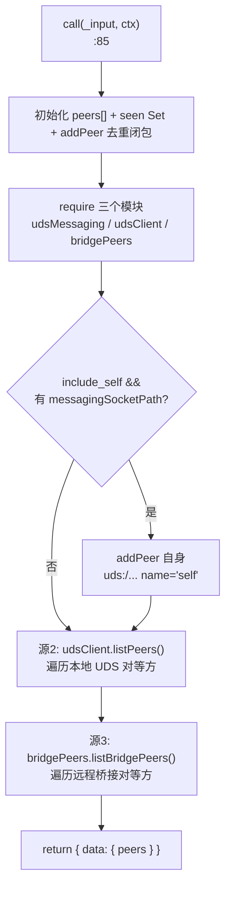
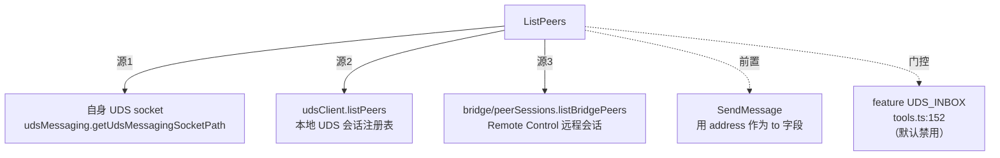

# ListPeers 工具详解

> `ListPeers` 是跨会话消息传递（`SendMessage`）的**前置发现工具**：它扫描当前机器上所有可通过 UDS（Unix Domain Socket）通信的本地 Claude Code 会话，加上通过 Remote Control 桥接的远程会话，返回带地址的对等方列表。这些地址随后作为 `SendMessage` 的 `to` 字段。属于"中等复杂度"的只读发现工具，核心逻辑在聚合三个来源（自身、UDS 客户端、bridge 对等方）并去重。

---

## 一、工具定位（一句话总结）

**`ListPeers` = 发现可接收跨会话消息的对等 Claude Code 会话的只读工具。**

| 维度 | 值 |
|---|---|
| 工具名 | `ListPeers`（常量 `LIST_PEERS_TOOL_NAME`，`:6`） |
| 一句话 | 扫描 UDS 本地会话 + Remote Control 远程会话，返回去重后的 peer 地址列表 |
| 是否进 system prompt | ❌ 受 feature flag `UDS_INBOX` 门控（`tools.ts:152`）；CLAUDE.md 列为"已禁用" |
| 只读 / 破坏性 | **只读**（`isReadOnly() → true`，`:55`）——纯发现，无副作用 |
| 是否可并发 | ✅ **可并发**（`isConcurrencySafe() → true`，`:52`） |
| 启用条件 | `feature('UDS_INBOX')` 为真才注册（`tools.ts:152-155`） |
| 核心依赖 | `src/utils/udsMessaging.ts`、`src/utils/udsClient.ts`、`src/bridge/peerSessions.ts` |
| 定位互补方 | `SendMessage`（用发现的地址发消息） |

**为什么需要它？** 跨会话通信前必须知道"消息发给谁"。Claude Code 会话有两种通信通道：本地 UDS socket（同机进程间）和 Remote Control bridge（跨机远程）。ListPeers 把两个来源的活跃会话聚合，供 `SendMessage` 使用。没有它，模型无法构造有效的 `to` 地址（`uds:/path/to.sock` 或 `bridge:session_...`）。

---

## 二、关键文件清单

```
ListPeersTool/
└── ListPeersTool.ts   ← 全部逻辑（136 行，单文件）
```

| 文件 | 角色 | 必看行号 |
|---|---|---|
| `ListPeersTool.ts` | 工具主体：schema + call（三源聚合去重）+ 渲染全在这 | `buildTool:29`、`call:85`、三源聚合 `:106-130` |

> **结构特点**：单文件工具，内联常量/prompt/渲染。与 SubscribePR/SuggestBackgroundPR 同构，但 call 体有真实逻辑（聚合三源），非 stub。

---

## 三、Tool 接口字段实现（`buildTool` 逐字段）

### 标识字段

```ts
name: LIST_PEERS_TOOL_NAME,       // "ListPeers"（内联，:6）
searchHint: 'list peers sessions discover uds socket messaging',
maxResultSizeChars: 50_000,       // 中等缓冲
strict: true,
```

### 模型面字段

```ts
async description() { return '发现其他 Claude Code 会话以进行跨会话消息传递' }
async prompt()      { return `列出可以通过 SendMessage 接收消息的活动 Claude Code 会话...` }
get inputSchema()  { return inputSchema() }
```

**输入 schema**（`:8-17`）——极简：
```ts
{
  include_self?: boolean,   // 可选，是否在列表中包含当前会话，默认 false
}
```

**输出类型**（`:21-27`）：
```ts
type PeerInfo = {
  address: string,    // 通信地址，如 "uds:/path/to.sock" 或 "bridge:session_..."
  name?: string,
  cwd?: string,
  pid?: number,
}
type ListPeersOutput = { peers: PeerInfo[] }
```

### 行为字段

| 字段 | 实现 | 说明 |
|---|---|---|
| `call()` | `:85` | 三源聚合 + 去重（见下节） |
| `isConcurrencySafe()` | `:52` → `true` | 发现操作可并发 |
| `isReadOnly()` | `:55` → `true` | 纯查询 |
| `userFacingName()` | `:59` → `'ListPeers'` | UI 显示名 |
| `renderToolUseMessage()` | `:63` | 固定显示 `'ListPeers'` |
| `mapToolResultToToolResultBlockParam` | `:67` | 格式化为 `Found N peer(s):\n...` |

> **缺失的字段**：没有 `validateInput`、`checkPermissions`、`isEnabled`、`getPath`、`shouldDefer`。最小可用字段集。

---

## 四、核心执行流程：`call()`

`call()`（`ListPeersTool.ts:85-135`）的核心是**三源聚合 + 去重**：

```ts
async call(_input, context) {
  const peers: PeerInfo[] = []
  const seen = new Set<string>()
  const addPeer = (peer) => {           // 去重闭包
    if (seen.has(peer.address)) return
    seen.add(peer.address)
    peers.push(peer)
  }

  // 源 1：自身（可选）
  const udsMessaging = require('src/utils/udsMessaging.js')
  const udsClient = require('src/utils/udsClient.js')
  const bridgePeers = require('src/bridge/peerSessions.js')

  const messagingSocketPath = udsMessaging.getUdsMessagingSocketPath()
  if (messagingSocketPath && _input.include_self) {
    addPeer({
      address: udsMessaging.formatUdsAddress(messagingSocketPath),
      name: 'self', pid: process.pid,
    })
  }

  // 源 2：UDS 本地对等方
  for (const peer of await udsClient.listPeers()) {
    if (!peer.messagingSocketPath) continue
    addPeer({
      address: udsMessaging.formatUdsAddress(peer.messagingSocketPath),
      name: peer.name ?? peer.kind, cwd: peer.cwd, pid: peer.pid,
    })
  }

  // 源 3：Remote Control 桥接对等方
  for (const peer of await bridgePeers.listBridgePeers()) {
    addPeer(peer)
  }

  return { data: { peers } }
}
```



**关键点逐条**：

1. **去重闭包 `addPeer`**（`:91-95`）：用 `seen: Set<string>` 按 `address` 去重。三个来源可能返回相同会话（如自身既在 UDS 列表又在 bridge 列表），去重保证每个 peer 只出现一次。
2. **延迟 require**（`:97-104`）：三个模块用 `require()` 而非顶层 `import`，且带 `eslint-disable` 注释。原因：这些模块（`udsMessaging`、`udsClient`、`peerSessions`）可能有重副作用或循环依赖，延迟到 `call()` 内加载避免影响启动。
3. **源 1：自身**（`:107-116`）：仅当 `include_self` 为真且有 `messagingSocketPath` 时加入。地址用 `udsMessaging.formatUdsAddress(path)` 格式化为 `uds:/...`。
4. **源 2：UDS 本地对等方**（`:118-126`）：`udsClient.listPeers()` 返回同机所有活跃 UDS 会话。过滤掉无 `messagingSocketPath` 的（`:119`），地址同样格式化。`name` 取 `peer.name ?? peer.kind`（回退到类型）。
5. **源 3：Remote Control 桥接对等方**（`:128-130`）：`bridgePeers.listBridgePeers()` 返回远程会话，地址格式为 `bridge:session_...`。直接 `addPeer(peer)`——桥接 peer 已自带 `address`。
6. **`mapToolResultToToolResultBlockParam`**（`:67-83`）：把 peers 格式化为人类可读文本——`{address} ({name}) @ {cwd}`，空列表返回 `"No peers found."`。

---

## 五、权限与安全

ListPeers 没有自定义 `checkPermissions()`，安全控制体现在：

1. **feature flag 门控**（`tools.ts:152-155`）：`feature('UDS_INBOX')` 为真才注册。CLAUDE.md 明确 `UDS_INBOX` 在"已禁用"列表，故默认环境下工具不存在。
2. **`isReadOnly() → true`**：纯发现，权限管道宽松。
3. **只读 socket 列表**：`udsClient.listPeers()` 和 `bridgePeers.listBridgePeers()` 只读取已注册的会话信息，不发送任何消息、不修改状态。
4. **无敏感数据泄露**：返回的 `PeerInfo` 含 address/name/cwd/pid——这些是会话元数据，不含对话内容或 token。

> **`include_self` 默认 false**：默认不包含自身——因为向自己发消息无意义，排除自身让列表更聚焦于"可通信的对方"。

---

## 六、与其他系统/工具的关系



- **与 `SendMessage`**：严格的前置关系。ListPeers 发现地址，SendMessage 用地址发消息。prompt（`:42-49`）明确两种地址格式：`uds:/path/to.sock`（本地）和 `bridge:session_...`（远程）。
- **与 UDS 消息系统**：依赖 `src/utils/udsMessaging.ts`（socket 路径 + 地址格式化）和 `src/utils/udsClient.ts`（对等方枚举）。UDS 是同机进程间通信的基础设施。
- **与 Remote Control / bridge**：依赖 `src/bridge/peerSessions.ts` 的 `listBridgePeers()`。bridge 模块（`src/bridge/`）处理跨机远程会话，feature-gated by `BRIDGE_MODE`。
- **与会话注册表**：UDS 对等方来自"并发会话 PID 注册表和 UDS socket 目录"（注释 `:86-88`）——每个会话启动时注册自己的 socket 路径，ListPeers 扫描这个目录。

---

## 七、亮点与设计取舍

1. **三源聚合 + 去重**（`:91-130`）：统一的 `addPeer` 闭包按 address 去重，简洁地处理多源重叠。这是发现类工具的常见模式。
2. **延迟 require 破除副作用**（`:97-104`）：三个模块延迟到 `call()` 内加载，避免启动时副作用。`eslint-disable` 注释表明这是有意为之。
3. **`include_self` 可选**（`:8-12`）：默认排除自身（向自己发消息无意义），但保留选项——调试或自测时可能需要。
4. **`name ?? kind` 回退**（`:122`）：peer 名称缺失时回退到类型（kind），保证总有可读标识。
5. **地址格式统一**（`:111,121`）：UDS 地址用 `udsMessaging.formatUdsAddress()` 格式化，bridge 地址自带 `bridge:` 前缀。SendMessage 只需原样使用。
6. **prompt 明确两种地址语义**（`:45-48`）：`uds:` 和 `bridge:` 前缀让模型能区分本地/远程，选择合适的通信预期。
7. **`strict: true`**：严格模式，确保未来扩展时模型不传多余参数。

---

## 八、源码导航（书签速查）

| 想看什么 | 去哪里 |
|---|---|
| 工具名常量（内联） | `ListPeersTool/ListPeersTool.ts:6` |
| `buildTool` 字段填充 | `ListPeersTool.ts:29-136` |
| 输入 schema | `ListPeersTool.ts:8-17` |
| PeerInfo 类型 | `ListPeersTool.ts:21-27` |
| `call()` 三源聚合 | `ListPeersTool.ts:85-135` |
| 去重闭包 addPeer | `ListPeersTool.ts:91-95` |
| UDS 对等方枚举 | `ListPeersTool.ts:118-126` |
| bridge 对等方枚举 | `ListPeersTool.ts:128-130` |
| 结果文本格式化 | `ListPeersTool.ts:67-83` |
| feature flag 注册 | `src/tools.ts:152-155` |
| UDS 底层 | `src/utils/udsMessaging.ts`、`src/utils/udsClient.ts` |

---

## 九、学习建议与验证清单

**怎么读这章**：先看"一、定位"理解 ListPeers 是 SendMessage 的前置发现，再跳到"四、call()"的三源聚合流程图，最后对照"六、关系"理解 UDS 与 bridge 两种通信通道。

**验证清单（读完自测）**：
- [ ] 能说出 ListPeers 的三个来源（自身、UDS 本地、bridge 远程）
- [ ] 能指出 feature flag 门控（`UDS_INBOX`，默认禁用）
- [ ] 能解释去重闭包 `addPeer` 的作用（按 address 去重，防多源重叠）
- [ ] 能说出两种地址格式（`uds:/path/to.sock` 和 `bridge:session_...`）
- [ ] 能解释 `include_self` 默认 false 的原因（向自己发消息无意义）
- [ ] 能说出为何用延迟 require 而非顶层 import（避免启动副作用/循环依赖）
- [ ] 能指出 ListPeers 与 SendMessage 的前置关系

**配合动作**：
1. 设置 `FEATURE_UDS_INBOX=1` 运行 dev 模式，观察工具出现
2. 启动两个 Claude Code 会话，在一个里调用 ListPeers，观察是否发现另一个
3. 读 `src/utils/udsClient.ts` 的 `listPeers()`，理解 UDS socket 目录扫描
4. 对比 `SendMessage` 工具，验证发现的 address 能作为 `to` 字段使用
