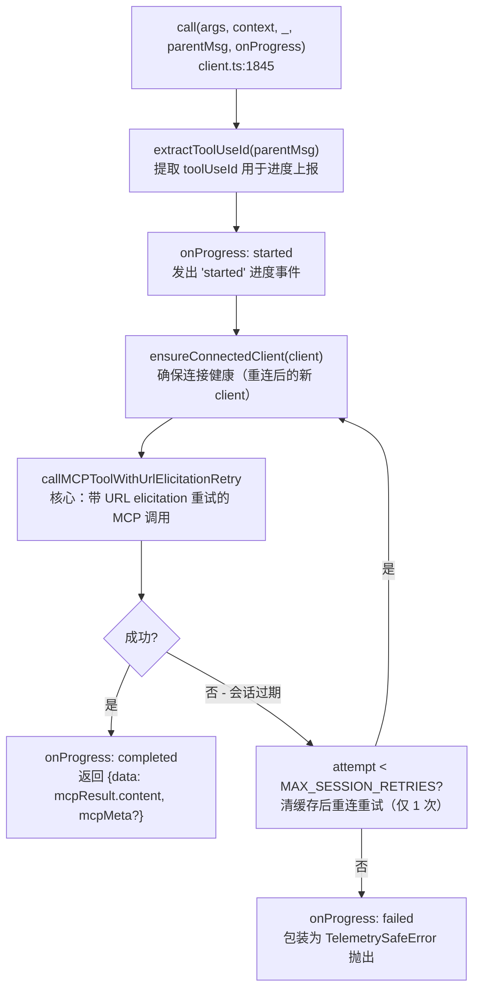
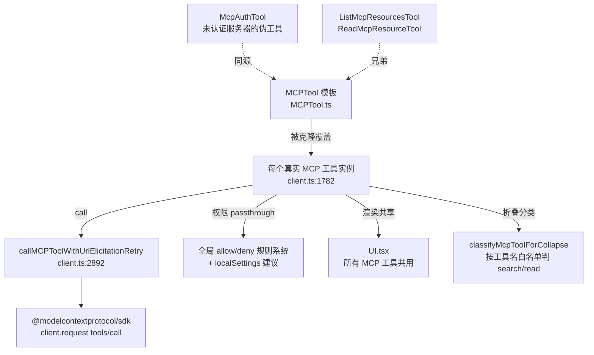

# MCPTool 工具详解

> 这是工具系统里**最特殊的工具**：它本身什么都不会做。`MCPTool.ts` 里的 `call()`、`description()`、`prompt()`、`name`、`userFacingName()` 全是 stub——`call()` 被触发时只会打一条 error 日志（`MCPTool.ts:52-60`）。它的真正身份是一个**原型模板**：`src/services/mcp/client.ts` 在连接每个 MCP 服务器时，`{ ...MCPTool, ...overrides }` 克隆它，用真实工具的 schema/描述/调用逻辑逐字段覆盖。理解了这套"stub → 运行时覆盖"机制，就理解了 Claude Code 如何把任意外部 MCP 服务器动态接入成一组一等工具。

---

## 一、工具定位（一句话总结）

**`MCPTool` = 一个 `isMcp: true` 标记的原型 Tool，被 `client.ts` 克隆改写后变成每个真实 MCP 工具。**

| 维度 | 值 |
|---|---|
| 工具名 | `'mcp'`（`MCPTool.ts:35`，占位名，运行时被 `buildMcpToolName(server, tool)` 覆盖为 `mcp__<server>__<tool>`） |
| 一句话 | MCP 工具的模板原型，所有字段都是 stub，由 `client.ts` 在运行时覆盖 |
| 是否进 system prompt | ❌ 本身**不**注册进 `getAllBaseTools()`，**从不**直接暴露给模型；被克隆改写后的实例才进工具池 |
| 只读 / 破坏性 | 由克隆后的 `tool.annotations?.readOnlyHint` 决定（`client.ts:1810`），模板本身不声明 |
| 是否可并发 | 同上，由 `readOnlyHint` 决定（`client.ts:1807`） |
| 核心依赖 | `src/services/mcp/client.ts` 的 `fetchToolsForClient`（`:1752`）+ `getMcpToolsCommandsAndResources`（`:2238`） |
| 关键标记 | `isMcp: true`（`MCPTool.ts:29`）——权限、渲染、折叠分类都靠它识别"MCP 系"工具 |

**为什么需要它？** Claude Code 不知道用户会装哪些 MCP 服务器、每个服务器提供哪些工具。它需要一个**形状确定、字段齐全的 Tool 骨架**，让 `client.ts` 只负责"填肉"（覆盖 name/schema/call），而不必每次都从头构造一个符合 `Tool` 接口的对象。模板提供渲染组件、进度协议、passthrough 权限骨架这些**所有 MCP 工具共享**的部分。

---

## 二、关键文件清单

```
MCPTool/
├── MCPTool.ts          ← buildTool({...}) 模板主体（83 行）
├── prompt.ts           ← PROMPT/DESCRIPTION 都是空字符串（运行时被覆盖）
├── UI.tsx              ← 渲染组件（唯一不被覆盖的部分：调用展示/进度/结果渲染）
├── classifyForCollapse.ts ← 按工具名白名单分类 search/read，供 UI 折叠
└── __tests__/
    └── classifyForCollapse.test.ts
```

涉及的外部文件（覆盖发生的地方）：

| 文件 | 角色 | 必看行号 |
|---|---|---|
| `MCPTool.ts` | 模板本体：`isMcp` 标记 + stub call + passthrough 权限 + 渲染委托 | `buildTool:28`、`isMcp:29`、`call(stub):52`、`checkPermissions:61` |
| `prompt.ts` | `PROMPT=''`、`DESCRIPTION=''`——明确标注"运行时被覆盖" | `:1-3` |
| `UI.tsx` | 调用展示 + 进度条 + 结果渲染（Slack 解包、JSON 扁平化、大输出警告） | `renderToolUseMessage:41`、`renderToolResultMessage:105`、`tryUnwrapTextPayload:293` |
| `classifyForCollapse.ts` | 600+ 行的 search/read 工具名白名单，UI 折叠用 | `SEARCH_TOOLS:14`、`READ_TOOLS:142`、`classifyMcpToolForCollapse:595` |
| `src/services/mcp/client.ts` | **覆盖核心**：`{...MCPTool, name, mcpInfo, call, ...}` 克隆改写 | `fetchToolsForClient:1752`、克隆体 `:1782-1988`、`getMcpToolsCommandsAndResources:2238` |

> **结构特点**：MCPTool 是"**模板 + 渲染**"双职责。模板逻辑（`MCPTool.ts`）极简，但渲染逻辑（`UI.tsx`）反而是这批 MCP 工具里最复杂的——因为所有 MCP 工具共用这一份渲染器，它必须处理任意 MCP 服务器返回的异构输出（Slack/GitHub/Linear/JSON blob/二进制...）。

---

## 三、Tool 接口字段实现（`buildTool` 逐字段）

MCPTool 实现了 `Tool` 接口，但字段分两类：**A 类 = 模板提供、运行时不覆盖**（渲染相关）；**B 类 = stub、运行时必覆盖**（行为相关）。

### A 类：模板提供，克隆后保留

```ts
isMcp: true,                  // 标记：权限/UI/折叠靠它识别 MCP 系工具（MCPTool.ts:29）
maxResultSizeChars: 100_000,  // 结果截断阈值（:36）
renderToolUseMessage,         // 渲染调用（UI.tsx:41）
renderToolUseProgressMessage, // 渲染进度条（UI.tsx:59）
renderToolResultMessage,      // 渲染结果（UI.tsx:105）
isResultTruncated(output) { return isOutputLineTruncated(output) },  // :72
mapToolResultToToolResultBlockParam(content, id) { return {tool_use_id:id, type:'tool_result', content} },  // :75
```

### B 类：stub，被 `client.ts` 覆盖

```ts
name: 'mcp',                  // :35 → 覆盖为 buildMcpToolName(server, tool) = "mcp__<server>__<tool>"
isOpenWorld() { return false }, // :31 → 覆盖为 tool.annotations?.openWorldHint
async description() { return DESCRIPTION },  // :38 → '' 覆盖为 tool.description
async prompt() { return PROMPT },            // :42 → '' 覆盖为 tool.description（截断）
async call() { /* stub，打 error 日志 */ },   // :52 → 覆盖为真实 MCP 调用
userFacingName: () => 'mcp',  // :69 → 覆盖为 `${client.name} - ${tool.annotations?.title||tool.name} (MCP)`
async checkPermissions() { return {behavior:'passthrough', message:'MCPTool 需要权限。'} },  // :61
get inputSchema() { return inputSchema() },  // :45 → z.object({}).passthrough()，覆盖为 inputJSONSchema
```

**输入 schema 的特殊设计**（`MCPTool.ts:15`）：
```ts
export const inputSchema = lazySchema(() => z.object({}).passthrough())
```
`z.object({}).passthrough()` = **接受任意键、任意值的空对象**。这是刻意的：模板自己不知道每个 MCP 工具的参数，用 passthrough 让任何输入都能通过 Zod 校验。**真实 schema 在覆盖时换成 `tool.inputSchema`**（`client.ts:1825`，原始 JSON Schema，绕过 Zod）。

**输出 schema**（`:18-20`）：`z.string()`——MCP 工具结果序列化为字符串。但实际 `call()` 返回的 `data` 是 `MCPToolResult`（content blocks 数组），渲染层（`UI.tsx:105`）按数组/字符串两路处理。

> **`checkPermissions` 的 passthrough**（`:61-66`）：模板返回 `{behavior:'passthrough', message:'MCPTool 需要权限。'}`——意思是"我不做判定，把决定权交给全局权限系统"。`client.ts:1826` 覆盖时**仍是 passthrough**，但额外塞了 `suggestions`（建议用户加一条 allow 规则到 localSettings）。这是 MCP 工具权限的核心姿态：**不内置判定逻辑，全部依赖用户的 allow/deny 规则 + 运行时确认**。

---

## 四、核心执行流程：`call()`（stub）与运行时覆盖

### 模板的 stub `call()`（`MCPTool.ts:52-60`）

```ts
async call() {
  logForDebugging(
    '[MCP Tool] 警告：stub call() 被触发！说明 MCP client 未正确覆盖此工具，请检查 client.ts',
    { level: 'error' },
  )
  return { data: '' }
}
```

**这个 stub 理论上永远不该被触发**。如果它被调用了，说明 `client.ts` 的克隆覆盖出了 bug——某个 MCP 工具实例没正确替换 `call`。它是一个**运行时断言/护栏**：fail-safe 地返回空数据 + error 日志，而不是崩溃。

### 运行时覆盖的 `call()`（`client.ts:1845-1983`）

这才是真正执行 MCP 工具调用的逻辑。克隆时用这个函数替换模板的 stub：



**关键点逐条**：

1. **进度协议**（`:1857-1907`）：MCP 工具支持流式进度（`MCPProgress` 类型，`MCPTool.ts:26` 重新导出以打破循环依赖）。`call()` 在 started/completed/failed 三个时机发 `onProgress`，UI 层的 `renderToolUseProgressMessage`（`UI.tsx:59`）据此渲染进度条 + 百分比。

2. **会话过期重试**（`:1871`、`:1925-1934`）：`MAX_SESSION_RETRIES = 1`——MCP HTTP/SSE 服务器可能因会话过期抛 `McpSessionExpiredError`，此时连接缓存被清，用新 client 重试一次。这是一个**有限重试**，不是无限循环。

3. **URL elicitation 重试**（`:1875`）：`callMCPToolWithUrlElicitationRetry`（`:2892`）包装了 `callMCPTool`——当 MCP 服务器返回需要 URL elicitation（要求用户输入 URL）的错误时，通过 `context.handleElicitation` 向用户收集后重试。

4. **遥测安全错误包装**（`:1949-1979`）：MCP SDK 的 `McpError` 只含协议级 JSON-RPC 错误（如 `-32000 ConnectionClosed`），**不含用户文件路径或代码**。包装成 `TelemetrySafeError_I_VERIFIED_THIS_IS_NOT_CODE_OR_FILEPATHS`（类名本身就是一道检查清单），确保遥测只上报安全的错误摘要（`error.message.slice(0, 200)` 或 `McpError <code>`），不泄露用户数据。

5. **返回结构**（`:1909-1921`）：`{ data: mcpResult.content }`——`content` 是 MCP 协议的 content blocks 数组（text/image/resource）。若结果带 `_meta` 或 `structuredContent`，额外塞进 `mcpMeta`。

### `mapToolResultToToolResultBlockParam`（`MCPTool.ts:75-81`）

把 `data`（content blocks 或字符串）直接塞进 `tool_result.content`，不做转换。**渲染层**（`UI.tsx:105`）和**模型层**（tool_result block）看到的是同一份原始 content——MCP 工具刻意保持模型可见性与 UI 可见性一致。

---

## 五、权限与安全

### 模板的 `checkPermissions`（`MCPTool.ts:61-66`）

```ts
async checkPermissions(): Promise<PermissionResult> {
  return { behavior: 'passthrough', message: 'MCPTool 需要权限。' }
}
```

`passthrough` = "我授权层不做决定，把请求往上抛给全局权限管道"。这与 `BashTool`（自己有复杂判定逻辑）截然相反——MCP 工具的权限**完全外包**给用户的 allow/deny 规则系统。

### 运行时覆盖的 `checkPermissions`（`client.ts:1826-1844`）

```ts
async checkPermissions() {
  return {
    behavior: 'passthrough' as const,
    message: 'MCPTool requires permission.',
    suggestions: [{
      type: 'addRules',
      rules: [{ toolName: fullyQualifiedName, ruleContent: undefined }],
      behavior: 'allow',
      destination: 'localSettings',
    }],
  }
}
```

仍是 `passthrough`，但**附带建议**：建议用户把 `mcp__<server>__<tool>` 加进 localSettings 的 allow 规则。这驱动了权限确认 UI 里的"允许此 MCP 工具"快捷按钮。

### 安全相关的设计点

1. **`isOpenWorld()` 默认 false**（`MCPTool.ts:31`）：模板保守地声明 MCP 工具不是"开放世界"工具。运行时覆盖为 `tool.annotations?.openWorldHint`（`client.ts:1819`）——让 MCP 服务器自己声明它是否访问外部不可信环境。

2. **`isDestructive()` 由服务器声明**（`client.ts:1816`）：`tool.annotations?.destructiveHint`——MCP 协议允许工具自我标注破坏性，Claude Code 透传这个标记给权限/UI 层。

3. **遥测安全错误**（`call()` 内，见上节）：防用户数据泄露进遥测。

4. **Unicode 清理**（`client.ts:1770`）：`recursivelySanitizeUnicode(result.tools)`——从 MCP 服务器拉到的工具数据先做 Unicode 清理，防止恶意服务器注入异常 Unicode（如零宽字符、RTL 覆盖符）污染工具名/描述。

5. **描述长度截断**（`client.ts:1803-1805`）：`MAX_MCP_DESCRIPTION_LENGTH`（`:218`，从 package 重新导出）——恶意/臃肿的 MCP 工具描述会被截断，防止撑爆 system prompt。

---

## 六、与其他系统/工具的关系



- **与 `client.ts` 的关系**：模板是被 `client.ts` 操作的"对象"。`fetchToolsForClient`（`:1752`）从 MCP 服务器拉 `tools/list`，对每个工具 `{...MCPTool, ...overrides}` 生成实例。`getMcpToolsCommandsAndResources`（`:2238`）编排多服务器并发连接 + 工具汇总。

- **与 `McpAuthTool` 的关系**：兄弟工具。`McpAuthTool`（`McpAuthTool.ts`）也是 `isMcp: true` 的伪工具，但它是**未认证服务器的占位**——当服务器需要 OAuth 时，`client.ts:2330/2343` 用 `createMcpAuthTool(name, config)` 生成一个认证工具代替该服务器的真实工具。认证完成后，前缀替换机制把伪工具换成真实工具（详见 `McpAuthTool` 单篇）。

- **与 `ListMcpResourcesTool` / `ReadMcpResourceTool` 的关系**：兄弟工具，处理 MCP 协议的 resources 面（MCPTool 处理 tools 面）。它们是**被 `getTools()` 过滤掉的"特殊内部工具"**（`tools.ts:343-349`），只在 `getMcpToolsCommandsAndResources` 里**当至少一个服务器支持 resources 时**才手动注入（`client.ts:2372-2376`）。

- **与权限系统的关系**：`filterToolsByDenyRules`（`tools.ts:300`）用 `mcpInfo` + 工具名匹配 deny 规则。`mcp__server` 前缀规则能在模型看到之前就剥离整个服务器的所有工具（注释 `tools.ts:296-298`）。

- **与延迟工具系统的关系**：MCP 工具**全部被延迟**（`constants/tools.ts:134`：「所有 MCP 工具被延迟，必须通过 SearchExtraToolsTool / ExecuteExtraTool 发现」）。模板的 `shouldDefer` 未在 `MCPTool.ts` 显式设置，但运行时克隆体走延迟路径。

- **与 `classifyForCollapse` 的关系**（`classifyForCollapse.ts`）：600 行的硬编码白名单（Slack/GitHub/Linear/Datadog/Sentry/Notion/Jira/Kubernetes...），按工具名（规范化为 snake_case）判定 `isSearch`/`isRead`，驱动 UI 把只读 MCP 调用折叠显示。

---

## 七、亮点与设计取舍

1. **"模板 + 运行时覆盖"模式**：这是 MCPTool 最大的设计亮点。用一个静态 `buildTool({...})` 对象做骨架，所有不确定的字段（name/schema/call/description）留 stub，运行时用对象展开 `{...MCPTool, ...overrides}` 填充。**好处**：新增 MCP 工具零成本（服务器拉到啥就填啥）、共享逻辑（渲染/进度/权限骨架）只写一次、stub 是天然断言（覆盖漏了会 fail-safe 报错）。

2. **`z.object({}).passthrough()` 万能 schema**（`MCPTool.ts:15`）：模板用 passthrough 让任何输入通过 Zod，真实 schema 走 `inputJSONSchema`（原始 JSON Schema，绕过 Zod）。因为 MCP 工具的 schema 来自外部服务器，是动态的 JSON Schema，不可能预先类型化。

3. **passthrough 权限 + 建议**：MCP 工具权限不做内置判定，全部依赖用户规则。`client.ts:1826` 的 `suggestions` 让权限确认 UI 能一键加 allow 规则——既安全（默认每次问）又渐进友好（用户批准一次后免打扰）。

4. **会话过期有限重试**（`MAX_SESSION_RETRIES = 1`）：不是无限重试，避免死循环；清缓存后重连一次能覆盖大多数瞬时失效场景。

5. **遥测安全错误类**（`TelemetrySafeError_I_VERIFIED_THIS_IS_NOT_CODE_OR_FILEPATHS`）：类名本身是一道开发者检查清单——强制你在构造它之前确认"这个错误里没有用户代码/文件路径"。极巧妙的命名即文档。

6. **渲染层三策略解包**（`UI.tsx:198-229`）：`MCPTextOutput` 依次尝试：① 解包占主导地位的文本 payload（如 Slack 的 `{"messages":"..."}`）；② 扁平 JSON 对齐渲染；③ 回退 pretty-print + 截断。专门优化常见 MCP server（Slack/GitHub）的输出可读性，而不是暴力 JSON.stringify。

7. **Slack 发送紧凑渲染**（`UI.tsx:333-356`）：检测到 Slack `message_link` 时，非 verbose 模式下只渲染一行"已向 #channel 发送消息"+ 超链接，而不是整个 JSON。这是针对托管 Slack MCP 的专属优化。

8. **`classifyForCollapse` 的取舍**（`classifyForCollapse.ts:12-16`）：用硬编码白名单而非启发式（如分析工具名动词）。注释明确：工具名跨安装稳定（即使 server 名变），所以只匹配工具名；未知工具保守不折叠。代价是白名单需要持续维护（已含 40+ 服务的数百个工具名）。

---

## 八、源码导航（书签速查）

| 想看什么 | 去哪里 |
|---|---|
| 模板 `buildTool` 字段填充 | `MCPTool/MCPTool.ts:28-82` |
| stub `call()` 护栏 | `MCPTool/MCPTool.ts:52-60` |
| `isMcp: true` 标记 | `MCPTool/MCPTool.ts:29` |
| 空 PROMPT/DESCRIPTION（运行时覆盖） | `MCPTool/prompt.ts:1-3` |
| passthrough 权限骨架 | `MCPTool/MCPTool.ts:61-66` |
| **运行时覆盖核心**（克隆改写） | `src/services/mcp/client.ts:1782-1988` |
| 真实 `call()` 实现 | `src/services/mcp/client.ts:1845-1983` |
| 覆盖后的 `checkPermissions` + suggestions | `src/services/mcp/client.ts:1826-1844` |
| 工具拉取入口 `fetchToolsForClient` | `src/services/mcp/client.ts:1752` |
| 多服务器编排 `getMcpToolsCommandsAndResources` | `src/services/mcp/client.ts:2238` |
| 调用包装 `callMCPToolWithUrlElicitationRetry` | `src/services/mcp/client.ts:2892` |
| 渲染（调用/进度/结果） | `MCPTool/UI.tsx:41,59,105` |
| Slack 紧凑渲染 | `MCPTool/UI.tsx:333` |
| search/read 折叠分类白名单 | `MCPTool/classifyForCollapse.ts:14,142,595` |
| MCP 工具全部延迟（注释） | `src/constants/tools.ts:134` |

---

## 九、学习建议与验证清单

**怎么读这章**：先看"一、工具定位"理解它是**模板不是工具**，再跳到"四、call()"对照 stub（`MCPTool.ts:52`）和运行时实现（`client.ts:1845`）——这是理解"覆盖机制"的关键。最后看"六、关系图"理解它在 MCP 工具家族里的位置。

**验证清单（读完自测）**：
- [ ] 能说出为什么 `MCPTool` 本身不进 `getAllBaseTools()`（它是模板，被克隆后才暴露）
- [ ] 能指出 stub `call()` 触发意味着什么（client 覆盖出 bug，fail-safe 返回空 + error 日志）
- [ ] 能解释 `z.object({}).passthrough()` 的用意（万能 schema，真实 schema 走 inputJSONSchema）
- [ ] 能说出 `checkPermissions` 为什么是 `passthrough`（权限外包给用户规则系统）
- [ ] 能找到运行时覆盖 `call()` 的位置（`client.ts:1845`）及其会话过期重试上限（1 次）
- [ ] 能说出 `TelemetrySafeError_I_VERIFIED_...` 类名的用意（命名即检查清单，防用户数据进遥测）
- [ ] 能指出 `McpAuthTool` / `ListMcpResourcesTool` / `ReadMcpResourceTool` 与 MCPTool 的兄弟关系

**配合动作**：
1. 装 一个 MCP 服务器（如 filesystem），在 `client.ts:1782` 加日志，观察克隆时覆盖了哪些字段
2. 在 `MCPTool.ts:54` 的 stub error 日志处设断点，验证正常路径不会触发
3. 配置一个 `mcp__server` 前缀的 deny 规则，验证 `filterToolsByDenyRules` 在模型看到前剥离整个服务器
4. 调用一个返回大 JSON 的 MCP 工具，观察 `UI.tsx:198` 的三策略解包路径
