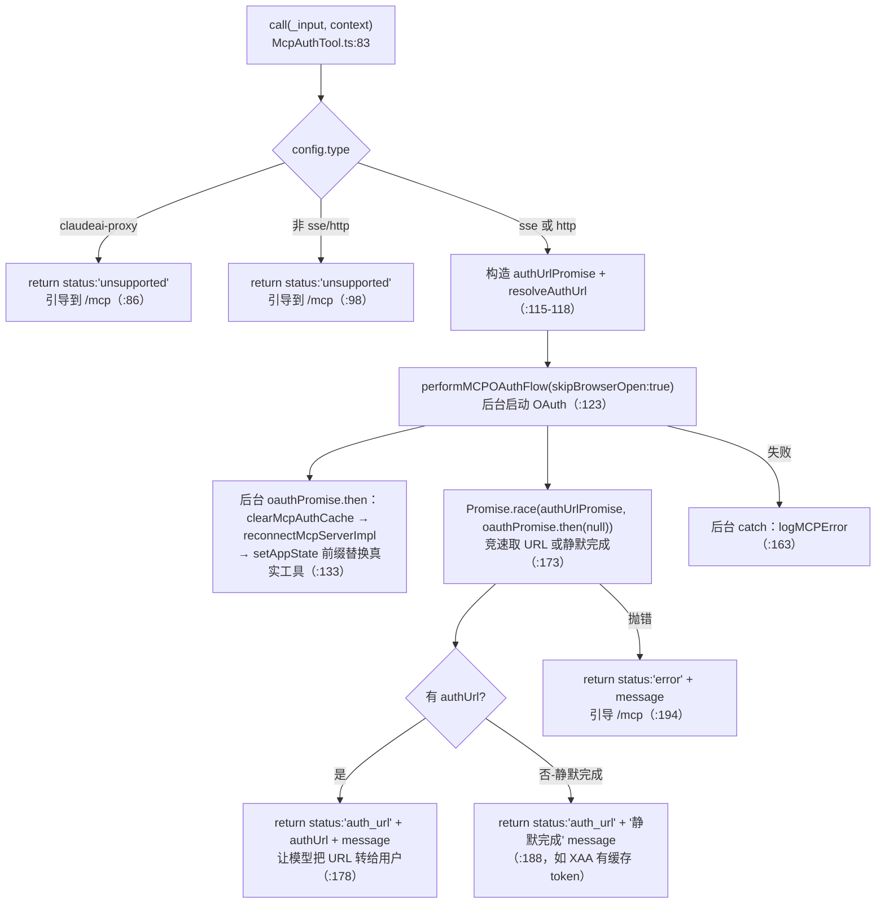
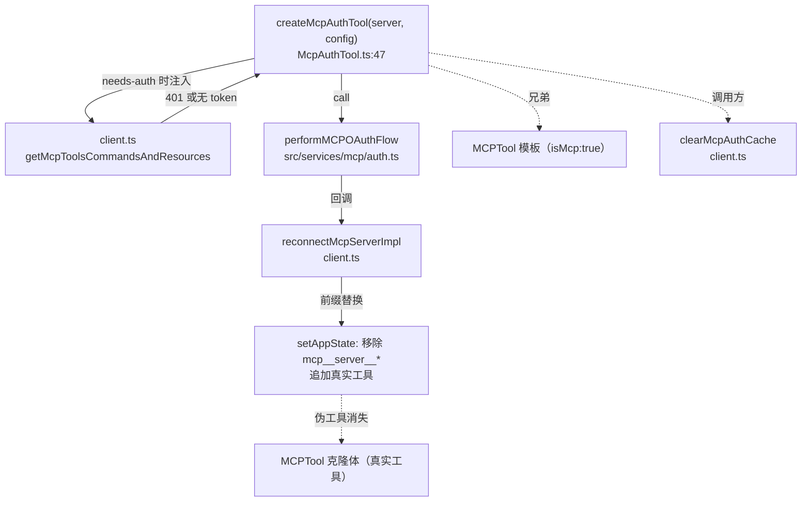

# McpAuthTool 工具详解

> 这是一个**动态生成的伪工具**。它不在 `tools.ts` 里静态注册，也没有 `buildTool`——而是一个**工厂函数** `createMcpAuthTool(serverName, config)`（`McpAuthTool.ts:47`）。当某个 MCP 服务器需要 OAuth（连接时返回 HTTP 401），`client.ts` 不把该服务器的真实工具暴露给模型，而是用这个伪工具代替。模型看到"`<server>` 已安装但需要认证"，调用它就能拿到授权 URL 转给用户；OAuth 回调完成后，前缀替换机制自动把这个伪工具换成真实工具。它是 MCP 接入流程里"未认证态"的用户/模型交互桥梁。

---

## 一、工具定位（一句话总结）

**`McpAuthTool` = 未认证 MCP 服务器的占位工具，由工厂函数动态生成。**

| 维度 | 值 |
|---|---|
| 工具名 | `buildMcpToolName(serverName, 'authenticate')`（`:61`）= `mcp__<server>__authenticate` |
| 一句话 | 未认证 server 的伪工具，让模型代用户启动 OAuth 并返回授权 URL |
| 是否进 system prompt | ❌ 不在 `getAllBaseTools()`；由 `client.ts:2330/2343` 在 needs-auth 状态时动态注入 |
| 只读 / 破坏性 | **非只读**（`isReadOnly: () => false`，`:66`）——会触发网络 OAuth 流程 |
| 是否可并发 | ❌ **不可并发**（`isConcurrencySafe: () => false`，`:65`） |
| 核心依赖 | `src/services/mcp/auth.ts` 的 `performMCPOAuthFlow`；`client.ts` 的 `reconnectMcpServerImpl` |
| 关键标记 | `isMcp: true`（`:62`）+ `mcpInfo: {serverName, toolName:'authenticate'}`（`:63`） |

**为什么需要它？** MCP 服务器（尤其 HTTP/SSE 远程服务器）常用 OAuth 保护。首次连接时返回 401，Claude Code 此刻拿不到任何真实工具。但如果完全隐藏这个 server，模型既不知道它存在、也无法引导用户认证。`McpAuthTool` 解决这个"已安装但未认证"的中间态：**用一个伪工具占位**，让模型能感知该 server 并代用户启动 OAuth，而不是无声失败或要求用户手动跑 `/mcp`。

---

## 二、关键文件清单

```
McpAuthTool/
└── McpAuthTool.ts    ← 工厂函数 createMcpAuthTool + call() 的 OAuth 流程（211 行，单文件）
```

| 文件 | 角色 | 必看行号 |
|---|---|---|
| `McpAuthTool.ts` | 全部逻辑：工厂函数 + description 构造 + call() OAuth 启动 + 回调后重连替换 | `createMcpAuthTool:47`、`description:55`、`call:83`、OAuth 启动 `:123`、重连替换 `:133`、URL 竞速 `:173` |
| `src/services/mcp/auth.ts` | `performMCPOAuthFlow` 真正的 OAuth 实现（被 McpAuthTool 调用） | — |
| `src/services/mcp/client.ts` | 调用方：needs-auth 时 `createMcpAuthTool` 注入；`clearMcpAuthCache`/`reconnectMcpServerImpl` 提供 | `:2330`、`:2343`、`createMcpAuthTool` 导入 `:58` |

> **结构特点**：极简单文件——没有独立的 `prompt.ts` / `UI.tsx`，description 在工厂里动态拼字符串，渲染直接用 `renderToolUseMessage: () => '认证 ${serverName} MCP server'`（`:70`）。因为它是**每个 server 一个独立工具实例**，描述必须含 server 名，无法用静态常量。

---

## 三、Tool 接口字段实现（工厂函数逐字段）

`createMcpAuthTool` 返回一个**直接满足 `Tool` 接口的对象**（不是 `buildTool`，`:60` 的 `satisfies Tool<InputSchema, McpAuthOutput>`），因为它是运行时动态生成的，不需要 `buildTool` 的静态类型推导。

### 标识字段

```ts
name: buildMcpToolName(serverName, 'authenticate'),  // :61 → "mcp__<server>__authenticate"
isMcp: true,                                          // :62
mcpInfo: { serverName, toolName: 'authenticate' },    // :63
isEnabled: () => true,                                // :64
userFacingName: () => `${serverName} - 认证 (MCP)`,   // :68
maxResultSizeChars: 10_000,                           // :69（比常规 100k 小，因为只返回 URL/消息）
```

> **命名共享前缀**：`mcp__<server>__authenticate` 与该 server 的真实工具（`mcp__<server>__<tool>`）共享 `mcp__<server>__` 前缀。这是**刻意的**——OAuth 完成后，前缀替换机制（`useManageMCPConnections.updateServer` + `:146` 的 `reject(..., t => t.name?.startsWith(prefix))`）会自动移除这个伪工具。

### 模型面字段

```ts
async description() { return description },  // :71 → 动态拼接的认证指引
async prompt()      { return description },  // :74 → 同 description
get inputSchema()   { return inputSchema() }, // :77 → z.object({})，无参数
```

**description 文本**（`:55-58`）：
```
`<server>` MCP server（<transport> at <url>）已安装但需要认证。
调用此工具以启动 OAuth 流程 —— 你会收到一个授权 URL，请分享给用户。
用户在浏览器中完成认证后，该 server 的真实工具会自动变为可用。
```
这段描述直接驱动模型行为：**模型读完就知道要调用它、拿到 URL、转给用户、等真实工具上线**。没有额外的 system prompt 片段——description 即指令。

**输入 schema**（`:23`）：`z.object({})`——空对象，无参数。认证工具不需要任何输入。

### 输出类型

```ts
type McpAuthOutput = {
  status: 'auth_url' | 'unsupported' | 'error'  // :27
  message: string
  authUrl?: string  // 仅 status='auth_url' 时有
}
```

### 行为字段

| 字段 | 实现 | 说明 |
|---|---|---|
| `call()` | `:83-202` | OAuth 流程启动 + URL 返回 + 后台重连（见下节） |
| `checkPermissions(input)` | `:80-82` | `{behavior:'allow', updatedInput: input}` —— **自动允许** |
| `isConcurrencySafe()` | `:65` → `false` | OAuth 是有状态网络流程 |
| `isReadOnly()` | `:66` → `false` | 改变 server 认证状态 |
| `toAutoClassifierInput()` | `:67` → `serverName` | 自动审批分类器输入 = server 名 |

> **`checkPermissions` 自动 allow**（`:80-82`）：认证工具不需要用户确认——因为模型调用它本身就是在响应用户"我要用这个 server"的意图。用户真正的授权动作发生在**浏览器里的 OAuth 页面**，而不是 Claude Code 的权限确认对话框。

### 渲染字段

```ts
renderToolUseMessage: () => `认证 ${serverName} MCP server`,  // :70
mapToolResultToToolResultBlockParam(data, id) { return {tool_use_id:id, type:'tool_result', content: data.message} },  // :203
```

只渲染 `data.message`（授权 URL 或错误说明）进 tool_result，丢弃 status/authUrl 结构化字段——模型只需要可读文本。

---

## 四、核心执行流程：`call()`

`call()`（`:83-202`）是 OAuth 流程的编排器。它**不阻塞等 OAuth 完成**——启动流程、拿到 URL、立即返回；真正的"OAuth 完成 → 重连 → 替换工具"在后台异步进行。



**关键点逐条**：

1. **transport 守卫**（`:86-105`）：只支持 `sse` / `http` 的 OAuth。`claudeai-proxy`（claude.ai connector）走独立认证流程（`MCPRemoteServerMenu.handleClaudeAIAuth`），此工具引导用户到 `/mcp` 手动认证。stdio 本地服务器理论上不会进 needs-auth 状态（needs-auth 只在 HTTP 401 时设置），做防御性处理。

2. **`skipBrowserOpen: true`**（`:128`）：Claude Code **不自动开浏览器**。它拿到授权 URL，由模型转给用户，用户自己决定何时打开。这是无头/CLI 场景的正确姿态（不像桌面 app 能直接弹浏览器）。

3. **URL 竞速**（`:173-176`）：`Promise.race([authUrlPromise, oauthPromise.then(() => null)])`——两种可能：
   - **常见路径**：OAuth 流程需要授权，`performMCPOAuthFlow` 通过 `onAuthorizationUrl` 回调 resolve `authUrlPromise`，本工具拿到 URL 返回。
   - **静默路径**：OAuth 流程不需要 URL 就完成了（如 XAA 有缓存的 IdP token），`oauthPromise` 先 resolve，race 返回 `null`，本工具返回"静默完成"消息（`:188`）。

4. **后台重连 + 工具替换**（`:133-168`）：这是**最关键的设计**。OAuth 完成后：
   - `clearMcpAuthCache()`（`:135`）——清掉"needs-auth"缓存，让下次连接尝试真正发起。
   - `reconnectMcpServerImpl(serverName, config)`（`:136`）——重连 server，拿到新的 `result.client` / `result.tools` / `result.commands` / `result.resources`。
   - `setAppState(prev => ...)`（`:138-157`）——**前缀替换**：用 `reject(prev.mcp.tools, t => t.name?.startsWith(prefix))` 移除所有 `mcp__<server>__*` 工具（包括这个伪认证工具），再 `...result.tools` 追加真实工具。commands/resources 同理。
   
   这就是"伪工具自动消失"的机制——它和真实工具共享前缀，重连后整组替换。

5. **不阻塞主流程**：`void oauthPromise.then(...).catch(...)`（`:133`）——后台延续（fire-and-forget），不 await。`call()` 在拿到 URL 后立即返回，让模型把 URL 转给用户；OAuth 回调在用户浏览器完成、后台重连在回调后异步发生。模型不需要等待。

6. **失败降级**（`:194-201`）：OAuth 启动失败时返回 `status:'error'`，引导用户运行 `/mcp` 手动认证——永远给用户一条出路，不会卡死。

---

## 五、权限与安全

### `checkPermissions`（`:80-82`）

```ts
async checkPermissions(input): Promise<PermissionDecision> {
  return { behavior: 'allow', updatedInput: input }
}
```

**自动允许**，不弹权限确认。理由：模型调用认证工具本身就是在响应用户"我想用这个 server"的意图；真正的授权发生在浏览器 OAuth 页面（用户主动登录授权），而不是 CLI 权限对话框。两次确认会冗余。

### 安全考量

1. **不自动开浏览器**（`skipBrowserOpen: true`）：URL 必须经模型→用户的可见路径传达，防止静默触发用户未预期的浏览器跳转/重定向。

2. **transport 白名单**（`:98`）：只对 `sse`/`http` 启动 OAuth。stdio 等本地传输走不了标准 OAuth，强制走 `/mcp`。

3. **claude.ai connector 隔离**（`:86`）：`claudeai-proxy` 类型有独立的 IdP 认证（`xaaIdpLogin.ts`），不通过此工具触发，避免认证流程混淆。

4. **错误消息引导 `/mcp`**：所有失败路径（unsupported / error）都建议用户运行 `/mcp` 手动认证，保证用户始终有兜底入口。

---

## 六、与其他系统/工具的关系



- **与 `MCPTool` 的关系**：兄弟伪工具。两者都 `isMcp: true`，但职责不同——MCPTool 是**已认证** server 工具的模板，McpAuthTool 是**未认证** server 的占位。一个 server 在任一时刻只暴露其中一种（真实工具 or 认证工具）。

- **与 `client.ts` 的关系**：
  - **被调用方**：`getMcpToolsCommandsAndResources` 在两处生成它——`isMcpAuthCached(name)` 命中时（`:2330`，跳过连接直接用伪工具）和 `connectToServer` 返回 `needs-auth` 时（`:2343`）。
  - **依赖方**：`call()` 调用 `clearMcpAuthCache`（`:5` 导入）和 `reconnectMcpServerImpl`（`:6` 导入）完成重连。

- **与 `performMCPOAuthFlow`（`auth.ts`）的关系**：OAuth 真正的实现。McpAuthTool 只负责编排（启动、抓 URL、后台重连），不处理 OAuth 协议细节（令牌交换、PKCE、回调监听等都在 `auth.ts`）。

- **与 `useManageMCPConnections` 的关系**：`updateServer` hook 也做同样的前缀替换。McpAuthTool 的 `call()` 内联了替换逻辑（`:138-157`），与 hook 路径**冗余但一致**——因为认证工具触发的重连不一定经过 hook。

- **与 `/mcp` 命令的关系**：所有失败/不支持的路径都引导用户到 `/mcp`。`/mcp` 是手动认证的权威入口，McpAuthTool 是"模型可主动触发"的便捷入口。

- **与 `hasMcpDiscoveryButNoToken`（`client.ts:2325`）的关系**：首次探测发现 server 存在（discovery 成功）但无 token 时，直接跳过连接、注入认证工具——避免每 15 分钟重复无意义的 401 探测。

---

## 七、亮点与设计取舍

1. **工厂函数而非 `buildTool`**（`:47-211`）：McpAuthTool 是运行时按 server 动态生成的，每个实例需要闭包捕获 `serverName` / `config`。用工厂函数 + 直接 `satisfies Tool` 比静态 `buildTool` 更自然——`description` 里要含 server 名，渲染要含 server 名，必须闭包。

2. **共享前缀 = 自动清理**（`:61` + `:146`）：伪工具命名为 `mcp__<server>__authenticate`，与真实工具共享 `mcp__<server>__` 前缀。OAuth 完成后重连时的 `reject(startsWith(prefix))` 自动移除伪工具——**不需要专门的"注销认证工具"逻辑**，前缀替换天然处理。极优雅。

3. **不阻塞的 OAuth**（`:133` fire-and-forget）：`call()` 拿到 URL 就返回，不 await OAuth 完成。模型把 URL 转给用户后，工具调用就结束了；认证在用户浏览器 + 后台异步完成。这让 CLI 不会被长时间 OAuth 阻塞。

4. **URL 竞速处理静默认证**（`:173`）：`Promise.race` 同时处理"需要 URL"和"静默完成"两种 OAuth 路径（XAA 等 IdP 有缓存 token 时静默成功）。单一 `call()` 优雅覆盖两种场景。

5. **`checkPermissions` 自动 allow**：刻意不在 CLI 弹确认——授权发生在浏览器 OAuth 页面，CLI 再确认是冗余。体现对"授权发生在哪一层"的清晰认知。

6. **三态输出**（`status: 'auth_url' | 'unsupported' | 'error'`）：覆盖所有路径——能给 URL、不支持该 transport、启动失败。每态都有面向用户/模型的引导消息，永不卡死。

7. **`maxResultSizeChars: 10_000`**（`:69`）：比常规 MCP 工具（100k）小一个数量级。因为输出就是 URL + 消息，不需要大空间——也防止异常情况下 OAuth 响应意外撑大 context。

---

## 八、源码导航（书签速查）

| 想看什么 | 去哪里 |
|---|---|
| 工厂函数 `createMcpAuthTool` | `McpAuthTool/McpAuthTool.ts:47` |
| 动态 description 拼接 | `McpAuthTool.ts:55-58` |
| `call()` OAuth 启动 | `McpAuthTool.ts:83-202` |
| transport 守卫（claudeai-proxy / 非 sse-http） | `McpAuthTool.ts:86-105` |
| `performMCPOAuthFlow` 调用 | `McpAuthTool.ts:123-129` |
| 后台重连 + 前缀替换 | `McpAuthTool.ts:133-168` |
| URL 竞速（race） | `McpAuthTool.ts:173-176` |
| `checkPermissions` 自动 allow | `McpAuthTool.ts:80-82` |
| 输出类型 `McpAuthOutput` | `McpAuthTool.ts:26-30` |
| **调用方**：needs-auth 注入 | `src/services/mcp/client.ts:2330,2343` |
| OAuth 真正实现 | `src/services/mcp/auth.ts:performMCPOAuthFlow` |
| 重连实现 | `src/services/mcp/client.ts:reconnectMcpServerImpl` |

---

## 九、学习建议与验证清单

**怎么读这章**：先看"一、工具定位"理解它是**未认证态的占位**，再跳到"四、call()"重点看两个机制——① URL 竞速（`:173`），② 后台重连 + 前缀替换（`:133`）。后者是"伪工具自动消失"的核心。最后看"六、关系图"理解它和 `MCPTool` 的兄弟关系。

**验证清单（读完自测）**：
- [ ] 能说出 McpAuthTool 为什么用工厂函数而非 `buildTool`（动态捕获 serverName/config 闭包）
- [ ] 能解释命名 `mcp__<server>__authenticate` 共享前缀的作用（OAuth 完成后自动被前缀替换移除）
- [ ] 能指出 `call()` 为什么不 await OAuth 完成（不阻塞 CLI，后台异步重连）
- [ ] 能说出 URL 竞速（`Promise.race`）处理的两种路径（需要 URL / 静默完成）
- [ ] 能解释 `checkPermissions` 为什么自动 allow（授权发生在浏览器，CLI 确认冗余）
- [ ] 能找到 `client.ts` 里注入 McpAuthTool 的两个位置（`:2330` cached needs-auth、`:2343` connectToSserver needs-auth）
- [ ] 能说出哪些 transport 不支持此工具的 OAuth（claudeai-proxy、stdio 等，引导 `/mcp`）

**配合动作**：
1. 配置一个需要 OAuth 的 HTTP MCP 服务器（如托管 Slack），不预认证，观察模型侧出现的认证工具
2. 在 `McpAuthTool.ts:138` 的 `setAppState` 处加日志，观察 OAuth 完成后前缀替换移除了哪些工具、追加了哪些
3. 在 `:173` 的 race 处加日志，对比"需要 URL"和"静默完成"两种路径的触发条件
4. 故意让 OAuth 失败（错误凭证），验证 `status:'error'` 返回并引导 `/mcp`
