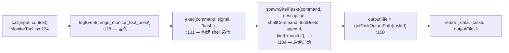
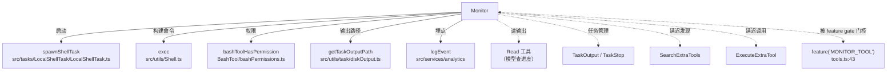

# MonitorTool 工具详解

> 这是工具系统逐个拆解系列的监控类工具。`Monitor` 是一个**中等复杂度**的后台任务工具：它把一条长时间运行、持续产生输出的 shell 命令（如 `tail -f`、`watch`、轮询循环）作为后台 shell task 启动，立即返回任务 ID 和输出文件路径。模型随后可以用 `Read` 工具读输出文件来查看进度，进程退出时会收到通知。它与 `Bash` 的区别在于"Bash 等命令结束才返回，Monitor 立即返回让命令在后台跑"。

---

## 一、工具定位（一句话总结）

**`Monitor` = 启动长时流式 shell 命令的后台监控器，立即返回任务句柄。**

| 维度 | 值 |
|---|---|
| 工具名 | `Monitor`（常量 `MONITOR_TOOL_NAME`，`MonitorTool.tsx:16`，**内联定义**无独立 prompt.ts） |
| 一句话 | 启动一条流式输出的 shell 命令作为后台监控器，返回 taskId + outputFile |
| 是否进 system prompt | ❌ **不在 `CORE_TOOLS` 白名单内**（`constants/tools.ts:137-179` 无 Monitor）→ **是延迟工具**，走 SearchExtraTools → ExecuteExtraTool 两步式发现路径 |
| 注册条件（tools.ts） | `feature('MONITOR_TOOL')` 门控（`tools.ts:43-46`、`:265`）—— 构建/Dev 期由 feature flag 决定是否注册，运行期不可动态开关 |
| feature gate | `MONITOR_TOOL`（CLAUDE.md 列为"工作流"类，build 默认启用） |
| 只读 / 破坏性 | **破坏性**（`isReadOnly() → false`，`MonitorTool.tsx:81-84`）—— 执行 shell 命令可能有副作用 |
| 是否可并发 | ✅ **可并发**（`isConcurrencySafe() → true`，`:77-79`）—— 多个监控器互不干扰 |
| `strict` 模式 | ✅ `strict: true`（`:48`）—— 严格模式，schema 外字段报错 |
| 核心依赖 | `src/tasks/LocalShellTask/LocalShellTask.ts`（`spawnShellTask`）+ `src/utils/Shell.ts`（`exec`）+ BashTool 的 `bashToolHasPermission` |
| 互补方 | `Bash`（一次性命令）、`Read`（读监控输出文件）、`TaskOutput`/`TaskStop`（任务管理） |

**为什么需要它？** 有些命令天生是"长时间运行 + 持续吐输出"的——`tail -f /var/log/app.log`、`while true; do curl health; sleep 5; done`、`inotifywait -m -r ./src`。用 `Bash` 跑这些会**阻塞直到命令结束**（而它们可能永远不结束）。`Monitor` 让命令在后台跑，工具立即返回，模型可以继续干别的，需要时 `Read` 输出文件查进度，进程退出时收到通知。

> **关于延迟属性**：Monitor 不在 `CORE_TOOLS`，因此即便 feature gate 启用了它，它依然是延迟工具。`isDeferredTool()`（`SearchExtraToolsTool/prompt.ts:69-78`）只看 `CORE_TOOLS` 集合和 `alwaysLoad` 标志。模型需要监控能力时，先 `SearchExtraTools`（用 `searchHint` 的英文关键词 "start long-running background monitor for streaming events" 做 TF-IDF 匹配），再 `ExecuteExtraTool` 调用。注意本工具的 `searchHint` 是**英文**（与其他工具的中文 searchHint 不同），这是因为它面向英文 prompt 意图。

---

## 二、关键文件清单

```
MonitorTool/
└── MonitorTool.tsx   ← 全部逻辑在这一个 .tsx 文件（180 行）
```

| 文件 | 角色 | 必看行号 |
|---|---|---|
| `MonitorTool.tsx` | 工具主体：schema + call + 权限 + 校验 + 渲染全在这 | `buildTool:44`、`call:124`、`checkPermissions:90`、`validateInput:106`、`MONITOR_TOOL_NAME:16` |

> **结构特点**：MonitorTool 是"单文件主体 + .tsx"型——和 GlobTool 类似所有逻辑集中在一个文件，但用 `.tsx` 因为 `renderToolResultMessage`（`:173`）直接返回 JSX（`<Text>` 组件）。**没有独立的 `prompt.ts`**——工具名常量、描述、prompt 文本全部内联在 `MonitorTool.tsx` 里（`:16`、`:57-59`、`:60-75`）。这与 CronCreate（有独立 prompt.ts）形成对比，因为 Monitor 是单一工具，无需共享文案。

---

## 三、Tool 接口字段实现（`buildTool` 逐字段）

### 标识字段

```ts
name: MONITOR_TOOL_NAME,  // "Monitor"（MonitorTool.tsx:16，内联）
searchHint: 'start long-running background monitor for streaming events',  // :46，英文
maxResultSizeChars: 10_000,  // :47，比 Glob 的 10 万小——监控结果本就简短（taskId + 路径）
strict: true,                // :48，严格 schema
```

> **`maxResultSizeChars: 10_000`**：Monitor 的输出只有 `{ taskId, outputFile }` 两个字段，1 万字符阈值绰绰有余。对比 Glob 的 10 万（要装文件路径列表），可见阈值按业务规模设定。

### 模型面字段

```ts
async description() { return 'Start a long-running background monitor' }  // :57-59，英文
async prompt()      { return `Use Monitor to start a long-running...` }   // :60-75，详细英文 prompt
get inputSchema()   { return inputSchema() }   // getter，懒加载
get outputSchema()  { return outputSchema() }
```

**输入 schema**（`:18-31`，`z.strictObject` + `lazySchema`）：
```ts
{
  command:     string,  // 必填，要执行的 shell 命令（应产生流式输出）
  description: string,  // 必填，监控内容的清晰描述（用作后台任务 UI 标签）
}
```

注意**两个字段都必填**——`validateInput`（`:106-122`）会拒绝空 command 或空 description。`description` 必填是个好设计：后台任务 UI 需要标签来区分多个监控器。

**输出 schema**（`:35-40`）：
```ts
{
  taskId:    string,  // 后台任务 ID（由 spawnShellTask 生成）
  outputFile: string,  // 输出文件路径（getTaskOutputPath(taskId)）
}
```

### 行为字段（重点）

| 字段 | 实现 | 说明 |
|---|---|---|
| `call()` | `:124` | 核心逻辑（见下节） |
| `validateInput()` | `:106` | 校验 command/description 非空 |
| `checkPermissions()` | `:90` | **复用 BashTool 的 `bashToolHasPermission`** |
| `isConcurrencySafe()` | `:77` → `true` | 多个监控器互不干扰 |
| `isReadOnly()` | `:81` → `false` | 执行 shell 命令可能有副作用 |
| `toAutoClassifierInput()` | `:86` → `"Monitor: ${command}"` | 自动审批分类器输入 |
| `userFacingName()` | `:95` → `"Monitor"` | 用户面显示名 |
| `getActivityDescription()` | `:99` → `"Monitoring: ${description}"` | 活动描述（用于 UI 状态栏） |

### 渲染字段

```ts
renderToolUseMessage(input, {verbose})  // :160，显示 "Monitor: ${desc}"
mapToolResultToToolResultBlockParam(...) // :165，给模型的 tool_result 文本
renderToolResultMessage(output)          // :173，JSX 渲染 <Text>
```

---

## 四、核心执行流程：`call()`

`MonitorTool.call()`（`MonitorTool.tsx:124-158`）是后台任务启动的典型流程：



**关键点逐条**：

1. **埋点先行**（`:128`）：`logEvent('tengu_monitor_tool_used', {})`——记录工具使用事件。这是 Claude Code 工具的通用模式（用于产品分析）。
2. **exec 构建命令**（`:131`）：`exec(command, abortController.signal, 'bash')`——用 `'bash'` 作为 shell，传入中断信号。注意这里只是**构建** shell command 对象，尚未执行。
3. **spawnShellTask 后台启动**（`:134-148`）：核心调用。传入：
   - `command` / `description`：原始输入
   - `shellCommand`：上一步构建的命令对象
   - `toolUseId` / `agentId`：来自 context，用于任务归属追踪
   - `kind: 'monitor'`：**任务类型标记为 'monitor'**——这与 Bash 启动的后台任务区分开，UI 和通知系统据此分类
   - `{ abortController, getAppState, setAppState }`：app 状态访问器，供任务回写进度
4. **输出文件路径**（`:150`）：`getTaskOutputPath(handle.taskId)`——每个后台任务有独立的磁盘输出文件，模型可用 `Read` 工具读它查进度。
5. **立即返回**（`:152-157`）：`{ data: { taskId, outputFile } }`——**不等待命令结束**。这是 Monitor 与 Bash 的根本区别：Bash 的 `call()` 会阻塞到命令退出，Monitor 的 `call()` 立即返回让命令在后台跑。
6. **进程退出通知**：由 `spawnShellTask` 注册的回调处理（不在本工具代码内）——进程退出（流结束、脚本失败、被 kill）时，任务系统通过 `setAppState` 触发通知，模型在下一轮收到 `<task-completed>` 类信号。

> **没有 yield 流式输出**：`call()` 返回 `{ data }` 同步对象，不是 async generator。流式输出写到磁盘文件，模型主动 `Read` 拉取，而非工具推送。这是"pull 模型"而非"push 模型"——避免长时监控器持续占用 context。

---

## 五、权限与安全

MonitorTool 的权限模型有个关键设计：**复用 BashTool 的权限管道**。

### `checkPermissions`（`:90-93`，第 4 步）

```ts
async checkPermissions(input, context) {
  return bashToolHasPermission({ command: input.command }, context)
}
```

**委托给 `bashToolHasPermission`**（来自 `../BashTool/bashPermissions.ts`）——把 Monitor 的 `command` 当作 Bash 命令走相同的权限判定。这是合理的：Monitor 本质是"后台跑 shell 命令"，命令本身的安全性和 Bash 一样，没必要重新发明权限逻辑。

> **设计启示**：当一个工具的核心操作与另一个工具重叠时，**复用权限函数**而非重写。Monitor 复用 Bash 权限，既保证一致性（同样的 allow/deny 规则对两条路径都生效），又减少维护负担。

### `validateInput`（`:106-122`，第 3 步）

两项校验，都在 `call()` 之前：
- `command` 为空或纯空白（`:107-113`）→ `errorCode: 1`
- `description` 为空或纯空白（`:114-120`）→ `errorCode: 2`

> 这是纯输入合法性校验，失败直接 emit `tool_use_error`，不走 `canUseTool`。`description` 必填是 Monitor 的特色——后台任务需要人类可读标签。

### `isReadOnly` 明确返回 false（`:81-84`）

```ts
isReadOnly() {
  // Monitor executes shell commands which may have side effects
  return false
}
```

注释明确——Monitor 执行 shell 命令可能有副作用，因此标记为非只读。这影响自动审批分类器：只读工具更容易自动批准，Monitor 不会。

### 安全考量

- **kind: 'monitor' 分类**（`:142`）：任务类型标记让 UI 和通知系统能区分监控器与普通后台 bash 任务，便于分类管理和安全审计。
- **abortController 透传**（`:130`、`:144`）：用户 ESC 中断时，中断信号传到 exec 和 spawnShellTask，后台进程会被终止。
- **输出文件隔离**（`:150`）：每个任务独立输出文件，避免多监控器输出混杂。

---

## 六、与其他系统/工具的关系



- **与 `Bash` 的关系**：互补关系。Bash 用于"一次性、快速完成"的命令（阻塞到结束）；Monitor 用于"长时、流式输出"的命令（立即返回后台跑）。`prompt.ts:65-66`（即 `MonitorTool.tsx:65-66` 的 prompt 文本）明确——"Do NOT use Monitor for one-shot commands that finish quickly — use Bash for those"。两者共享 `bashToolHasPermission` 权限管道。
- **与 `Read` 的关系**：Monitor 返回 `outputFile`，模型用 `Read` 读它查监控进度。这是 pull 模型——模型主动拉取而非工具推送。
- **与 `TaskOutput` / `TaskStop` 的关系**：返回的 `taskId` 可传给 TaskOutput（查看任务状态）和 TaskStop（终止监控器）。Monitor 是任务系统的"生产者"，TaskOutput/TaskStop 是"管理者"。
- **与 `LocalShellTask` 的关系**：`spawnShellTask` 是后台 shell 任务的工厂。Monitor 用 `kind: 'monitor'` 标记，与 Bash 的后台任务（`kind: 'bash'` 或类似）区分。
- **与延迟工具发现系统的关系**：不在 `CORE_TOOLS`，是延迟工具。但额外受 `feature('MONITOR_TOOL')` 门控——**双层门控**：feature flag 决定是否注册，CORE_TOOLS 决定是否延迟。
- **与 `getActivityDescription` 的关系**（`:99-104`）：返回 `"Monitoring: ${description}"`，用于 REPL 状态栏显示当前活动。这是后台任务可观测性的一部分。

---

## 七、亮点与设计取舍

1. **复用 BashTool 权限管道**（`:90-93`）：`checkPermissions` 直接委托 `bashToolHasPermission`。当一个工具的核心操作与另一个工具重叠时，复用而非重写——保证 allow/deny 规则一致性，减少维护负担。这是"DRY 在权限层"的体现。

2. **`kind: 'monitor'` 任务分类**（`:142`）：通过 kind 字段区分监控器与普通后台任务。这让 UI 能分类展示、通知系统能分类触发、安全审计能分类追溯。一个字符串字段承载了多维度分类语义。

3. **pull 模型而非 push 模型**：Monitor 不流式推送输出到 context（那会撑爆 context），而是写磁盘文件，模型按需 `Read`。对比"工具 yield 中间进度"的 push 模式（如 BashTool 多次 yield），Monitor 选择 pull——因为长时监控器的输出量不可预测，pull 让模型主动控制读取节奏。

4. **`description` 必填**（`:114-120`）：后台任务需要人类可读标签。`validateInput` 强制要求非空 description，`getActivityDescription`（`:99`）用它生成状态栏文本。这是"可观测性优先"的设计——多个监控器同时跑时，没有标签就无法区分。

5. **立即返回 + 退出通知**（`:152` + spawnShellTask 回调）：`call()` 不阻塞，进程退出时任务系统通过 setAppState 触发通知。这让模型能"启动监控后继续干别的，退出时再回来处理"——真正的异步后台执行。

6. **双层门控的延迟工具**：Monitor 同时受 `feature('MONITOR_TOOL')`（注册门控）和 `CORE_TOOLS`（延迟判定）约束。feature flag 关闭时根本不注册；开启注册后，因为不在 CORE_TOOLS，仍是延迟工具。读代码时要区分这两层。

7. **英文 searchHint + 英文 prompt**：与其他工具的中文 searchHint 不同，Monitor 的 searchHint（`:46`）和 prompt（`:60-75`）都是英文。这反映了它的目标场景——监控类意图多用英文表达（"watch logs"、"tail file"），TF-IDF 索引按实际查询语言优化。

8. **`maxResultSizeChars: 10_000` 按业务规模设定**：输出只有两字段，1 万阈值足够。对比 Glob 的 10 万，可见阈值不是统一常量而是按工具输出规模定制。

---

## 八、源码导航（书签速查）

| 想看什么 | 去哪里 |
|---|---|
| 工具名常量（内联） | `MonitorTool.tsx:16` |
| `buildTool` 字段填充 | `MonitorTool.tsx:44-180` |
| 输入/输出 schema | `MonitorTool.tsx:18-40` |
| `call()` 核心逻辑 | `MonitorTool.tsx:124-158` |
| `checkPermissions`（复用 Bash） | `MonitorTool.tsx:90-93` |
| `validateInput`（非空校验） | `MonitorTool.tsx:106-122` |
| `isReadOnly` / `isConcurrencySafe` | `MonitorTool.tsx:77-84` |
| `getActivityDescription`（状态栏） | `MonitorTool.tsx:99-104` |
| `mapToolResultToToolResultBlockParam` | `MonitorTool.tsx:165-171` |
| 后台任务工厂 | `src/tasks/LocalShellTask/LocalShellTask.ts:spawnShellTask` |
| Bash 权限管道（复用） | `BashTool/bashPermissions.ts:bashToolHasPermission` |
| 输出文件路径 | `src/utils/task/diskOutput.ts:getTaskOutputPath` |
| feature gate 注册 | `src/tools.ts:43-46,265` |
| 延迟工具判定（只看 CORE_TOOLS） | `SearchExtraToolsTool/prompt.ts:69-78` |

---

## 九、学习建议与验证清单

**怎么读这章**：先扫"一、工具定位"理解 Monitor 与 Bash 的根本区别（立即返回 vs 阻塞），再跳到"四、call()"看后台启动流程，最后对照"五、权限与安全"理解为什么复用 Bash 权限。

**验证清单（读完自测）**：
- [ ] 能说出 Monitor 与 Bash 的分工（长时流式 vs 一次性快速）
- [ ] 能指出 Monitor **不在** `CORE_TOOLS`，因此是延迟工具（走 SearchExtraTools 发现）
- [ ] 能解释为什么 `checkPermissions` 复用 `bashToolHasPermission`（核心操作重叠，保证规则一致）
- [ ] 能说出 `kind: 'monitor'` 任务分类的多维度作用（UI/通知/审计）
- [ ] 能解释 pull 模型（写磁盘 + Read 拉取）相比 push 模型（yield 到 context）的优势（避免 context 爆炸）
- [ ] 能指出 `description` 必填的可观测性动机（后台任务需要标签）
- [ ] 能说出双层门控（feature('MONITOR_TOOL') 注册 + CORE_TOOLS 延迟）
- [ ] 能解释为什么 `isReadOnly` 返回 false（shell 命令可能有副作用）

**配合动作**：
1. 让 Claude `Monitor` 一个 `while true; do date; sleep 2; done`，观察返回的 taskId 和 outputFile
2. 用 `Read` 读 outputFile，确认输出持续增长
3. 用 `TaskStop` 终止监控器，验证任务管理闭环
4. 在 `MonitorTool.tsx:134` 加日志，观察 spawnShellTask 的返回 handle 结构
5. 对比 Bash 跑同样命令的行为（Bash 会阻塞），体会"立即返回"的差异
