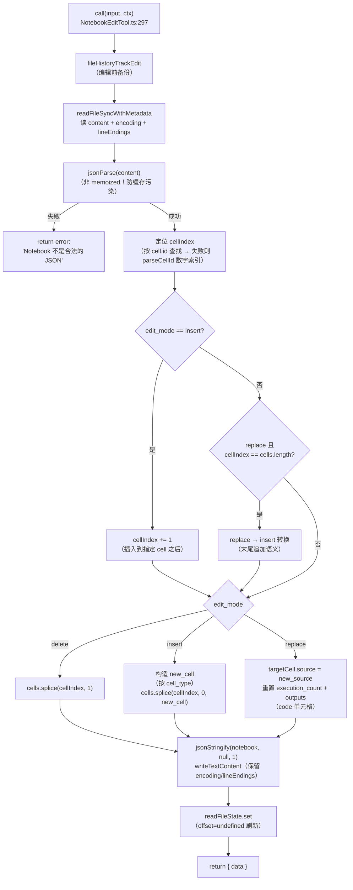
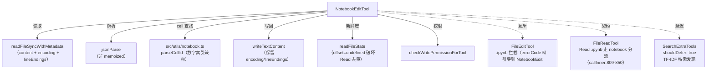

# NotebookEditTool（NotebookEdit）工具详解

> 这是工具系统逐个拆解系列的**写工具篇之三**。`NotebookEdit`（`NOTEBOOK_EDIT_TOOL_NAME = 'NotebookEdit'`）专门编辑 Jupyter notebook（`.ipynb`）的**单元格**——这是 FileEdit 无法胜任的场景，因为 notebook 是结构化 JSON，字符串替换会破坏 JSON 语法。它支持三种模式（replace/insert/delete）、cell_id 兼容真实 ID 与数字索引、按 nbformat 版本决定是否生成 cell ID、replace 末尾自动转 insert。它与 FileEdit 互斥——FileEdit 的 validateInput 会拦截 `.ipynb` 并引导到此工具。

---

## 一、工具定位（一句话总结）

**`NotebookEdit` = 编辑 Jupyter notebook 单元格的结构化写工具（replace/insert/delete）。**

| 维度 | 值 |
|---|---|
| 工具名 | `NotebookEdit`（常量 `NOTEBOOK_EDIT_TOOL_NAME`，`constants.ts:2`） |
| 一句话 | 对 `.ipynb` 文件的单元格做 replace/insert/delete，就地在 JSON 上修改并写回 |
| 是否进 system prompt | ✅ 默认注册（`tools.ts:232`）；`NOTEBOOK_EDIT_TOOL_NAME` 在 `CORE_TOOLS` 白名单（`constants/tools.ts:18`、`:145`） |
| 只读 / 破坏性 | **破坏性**（写盘，无 `isReadOnly()`） |
| 是否可并发 | ❌ **不可并发**（无 `isConcurrencySafe()`） |
| 是否延迟加载 | ✅ `shouldDefer: true`（`:94`）——可被 TF-IDF 工具搜索延迟发现 |
| 核心依赖 | `src/utils/notebook.ts`（readNotebook/parseCellId）、`src/utils/fileRead.ts:readFileSyncWithMetadata`、`src/utils/file.ts:writeTextContent` |
| 定位互补方 | `FileEdit`（互斥，.ipynb 由此工具专管）、`Read`（读取 notebook 的前置契约） |

**为什么需要它？** Jupyter notebook 是数据科学/研究的标准格式，结合代码、文本、可视化。它是 **JSON 结构**（`{cells: [...], metadata, nbformat}`），用 FileEdit 的字符串替换编辑会破坏 JSON 转义/结构。NotebookEdit 直接在解析后的对象上做**结构化操作**（splice 插入/删除、修改 cell.source），再 `jsonStringify` 写回，保证 JSON 合法性。FileEdit 的 prompt 明确："本工具无法编辑 .ipynb，请用 NotebookEdit。"

---

## 二、关键文件清单

```
NotebookEditTool/
├── NotebookEditTool.ts   ← buildTool({...}) 主体（493 行），validateInput + call 全在这
├── prompt.ts             ← DESCRIPTION + PROMPT（含 cell_number 索引说明）
├── constants.ts          ← NOTEBOOK_EDIT_TOOL_NAME 常量（独立文件防循环依赖）
├── UI.tsx                ← Ink 渲染（renderToolUseMessage/renderToolResultMessage）
└── src/
    ├── types/message.ts      ← 桩
    └── utils/
        ├── fileHistory.ts    ← 桩
        ├── messages.ts       ← 桩
        └── theme.ts          ← 桩
```

| 文件 | 角色 | 必看行号 |
|---|---|---|
| `NotebookEditTool.ts` | 工具主体：schema + validateInput + call + 权限 + 渲染 | `buildTool:90-493`、`validateInput:176-296`、`call:297-492`、`checkPermissions:125-132`、`shouldDefer:94`、`mapToolResultToToolResultBlockParam:133-171` |
| `prompt.ts` | 描述（cell_number 索引、edit_mode 说明） | `DESCRIPTION:1-2`、`PROMPT:3` |
| `constants.ts` | 工具名（独立文件防循环依赖） | `NOTEBOOK_EDIT_TOOL_NAME:2` |
| `UI.tsx` | 渲染 | `getToolUseSummary`、`renderToolResultMessage` |

> **结构特点**：NotebookEditTool 是"单文件主体"型——493 行全在 `NotebookEditTool.ts`，无独立 utils（notebook 操作逻辑直接内联，因为强耦合 JSON 结构）。`shouldDefer: true` 让它可被延迟发现，与其他 4 个文件操作工具（始终加载）不同。

---

## 三、Tool 接口字段实现（`buildTool` 逐字段）

### 标识字段

```ts
name: NOTEBOOK_EDIT_TOOL_NAME,                    // "NotebookEdit"
searchHint: '编辑 Jupyter notebook 单元格（.ipynb）',
maxResultSizeChars: 100_000,
shouldDefer: true,                                // ⭐ 延迟加载（唯一一个）
```

> **`shouldDefer: true`**：这是 5 个文件操作工具中**唯一**设为延迟的。意味着它不进默认 system prompt，而是通过 `SearchExtraTools` 的 TF-IDF 搜索按需发现。原因推测：notebook 编辑是低频场景，常驻 system prompt 占位不划算。但 `NOTEBOOK_EDIT_TOOL_NAME` 仍在 `CORE_TOOLS` 白名单——这是"可延迟但仍是核心工具"的设计。

### 模型面字段

```ts
async description() { return DESCRIPTION }
async prompt()      { return PROMPT }
userFacingName()    { return '编辑 Notebook' }   // 静态，无输入特判
get inputSchema()   { return inputSchema() }
get outputSchema()  { return outputSchema() }
```

**输入 schema**（`:30-57`）：
```ts
{
  notebook_path: string,                  // 必填，绝对路径
  cell_id:      string?,                  // 单元格 ID 或数字索引（cell-N）
  new_source:   string,                   // 必填，新 source
  cell_type:    'code'|'markdown'?,       // insert 时必填
  edit_mode:    'replace'|'insert'|'delete'?,  // 默认 replace
}
```

**输出 schema**（`:60-85`）：
```ts
{
  new_source:    string,
  cell_id?:      string,
  cell_type:     'code'|'markdown',
  language:      string,           // notebook 语言（metadata.language_info.name ?? 'python'）
  edit_mode:     string,
  error?:        string,           // 失败时（is_error: true）
  notebook_path: string,
  original_file: string,           // 修改前 JSON
  updated_file:  string,           // 修改后 JSON
}
```

### 行为字段（重点）

| 字段 | 实现位置 | 说明 |
|---|---|---|
| `call()` | `:297-492` | 核心逻辑（见下节） |
| `validateInput()` | `:176-296` | 扩展名、edit_mode、insert+cell_type、先读后写、JSON 合法性、cell_id 查找 |
| `checkPermissions()` | `:125-132` | 委托 `checkWritePermissionForTool` |
| `getPath()` | `:122-124` | `notebook_path` |
| `toAutoClassifierInput()` | `:115-121` | feature('TRANSCRIPT_CLASSIFIER') 时返回 `${path} ${mode}: ${new_source}`，否则空 |
| `getActivityDescription()` | `:105-108` | "正在编辑 notebook X" |

> **注意缺失**：无 `backfillObservableInput`/`preparePermissionMatcher`（Edit/Write/Read 都有）——notebook 编辑不展开路径（用 `isAbsolute` + `resolve(getCwd())` 内联处理），权限匹配靠默认。无 `extractSearchText`。`toAutoClassifierInput` 受 feature gate（其他工具无此 gating）。

### 渲染字段

```ts
renderToolUseMessage,
renderToolUseRejectedMessage,
renderToolUseErrorMessage,
renderToolResultMessage,
```

---

## 四、核心执行流程：`call()`

`call()`（`:297-492`）在解析后的 notebook 对象上做结构化操作。整体流程：



**关键点逐条**：

1. **非 memoized jsonParse**（`:333-334` 注释）：**必须用 `jsonParse` 而非 `safeParseJSON`**。`safeParseJSON` 按内容字符串缓存并返回共享对象引用，但下方会**就地修改** notebook（`cells.splice`、`targetCell.source = ...`）。用 memoized 版本会污染 `validateInput()` 及后续相同文件内容的 call() 缓存。这是对**缓存与可变性冲突**的精确防范。
2. **cell_id 双重查找**（`:355-366`）：先按真实 `cell.id` 查（`findIndex`），失败则 `parseCellId` 尝试数字索引（`cell-N` 格式）。兼容两种 cell 引用方式。
3. **insert 的 cellIndex 偏移**（`:368-370`）：insert 模式 `cellIndex += 1`——插入到指定 ID 的单元格**之后**。无 cell_id 时默认 `cellIndex = 0`（插到开头）。
4. **replace→insert 自动转换**（`:374-380`）：在末尾（`cellIndex == cells.length`）再 replace 时，转换为 insert——"末尾 replace"语义上等价于"追加"。未指定 cell_type 时默认 code。
5. **nbformat 版本感知的 cell ID 生成**（`:384-393`）：仅当 `nbformat > 4` 或 `(nbformat==4 && nbformat_minor>=5)` 时生成 cell ID。insert 生成随机 ID（`Math.random().toString(36).substring(2,15)`），replace 保留原 cell_id。旧格式 notebook 不要求 cell ID。
6. **replace 重置执行状态**（`:419-431`）：替换 code 单元格的 source 后，`execution_count = null`、`outputs = []`——内容变了，旧的执行结果失效。若指定了 cell_type 且与当前不同，还会切换类型。
7. **JSON 缩进写回**（`:433-435`）：`jsonStringify(notebook, null, 1)`（缩进 1 空格）+ `writeTextContent`（保留原 encoding/lineEndings）。
8. **readFileState 刷新**（`:436-445`）：`offset:undefined` 刷新时间戳。注释（`:437-439`）特别说明：offset=undefined 会**破坏 FileReadTool 的去重匹配**——否则同一毫秒内的 Read→NotebookEdit→Read 会针对过期内容返回 `file_unchanged` 桩。这是与 Read 去重逻辑的**精细协同**。
9. **错误内联返回**（`:460-491`）：catch 错误后不抛，而是 `return { data: { error: ... } }`——`mapToolResultToToolResultBlockParam`（`:137-143`）检测 `error` 字段返回 `is_error: true` 的 tool_result。这是"软失败"模式（对比 Edit 的硬抛错）。

---

## 五、权限与安全

### `validateInput`（`:176-296`，第 3 步）

| 校验项 | 行号 | errorCode | 说明 |
|---|---|---|---|
| UNC 路径 | `:185-187` | — | `\\`/`//` 跳过（防 NTLM） |
| 扩展名 | `:189-196` | 2 | 非 `.ipynb` 拒绝，引导到 FileEdit |
| edit_mode 合法性 | `:198-208` | 4 | 必须 replace/insert/delete |
| insert + cell_type | `:210-216` | 5 | insert 时 cell_type 必填 |
| 先读后写 | `:221-229` | 9 | `readFileState` 无记录则拒绝（"文件尚未被读取"） |
| mtime 新鲜度 | `:230-237` | 10 | `getFileModificationTime > readTimestamp` 则拒绝 |
| 文件存在 | `:239-251` | 1 | ENOENT 拒绝 |
| JSON 合法性 | `:252-259` | 6 | `safeParseJSON` 失败拒绝 |
| cell_id 查找 | `:260-293` | 7/8 | 非 insert 时必填；按 id 查找失败则 parseCellId 数字索引 |

> **与 Edit 的 validateInput 差异**：NotebookEdit 的校验聚焦"notebook 结构合法性"——JSON 解析、cell 存在性、edit_mode 语义。无"old_string 找不到/多处匹配"（因为是结构化操作非字符串替换）。但**保留了先读后写契约**（errorCode 9/10），与 Edit/Write 一致——注释（`:218-220`）强调：否则模型可能编辑从未见过的 notebook，或基于过期视图编辑造成静默数据丢失。

### 安全细节

- **UNC 豁免**（`:185-187`）：与其他文件工具一致的 NTLM 防护。
- **非 memoized jsonParse 防缓存污染**（`:328-332` 注释）：见关键点 1。这是本工具独有的缓存安全考量——`safeParseJSON` 的 memoization 与就地修改不兼容。
- **readFileState offset=undefined 破坏 Read 去重**（`:437-439` 注释）：见关键点 8。与 FileReadTool 去重逻辑的精细协同——防止 Read→Edit→Read 返回过期内容。

### `checkPermissions`（`:125-132`，第 4 步）

委托 `checkWritePermissionForTool`——与 Edit/Write 共用。注意 NotebookEdit **无** `preparePermissionMatcher`/`backfillObservableInput`（其他文件工具都有），路径处理用 `isAbsolute` + `resolve(getCwd())` 内联。

---

## 六、与其他系统/工具的关系



- **与 `FileEdit` 的互斥**（**最重要**）：FileEdit 的 validateInput（`:262-269`）拦截 `.ipynb`（errorCode 5），文案："File is a Jupyter Notebook. Use the NotebookEdit to edit this file." 反向地，NotebookEdit 的 validateInput（`:189-196`）拦截非 `.ipynb`（errorCode 2），引导到 FileEdit。两者形成**按文件类型的分工契约**。
- **与 `Read` 的双向契约**：Read 的 callInner 对 `.ipynb` 走专门分流（`FileReadTool.ts:809-850`），`readNotebook` 读 JSON、`readFileState.set` 记录 cellsJson。NotebookEdit 的 validateInput 检查 `readFileState` 有无记录（errorCode 9）——**Read 是 NotebookEdit 的前置依赖**。且 NotebookEdit 写入的 `offset:undefined` 条目会破坏 Read 的去重，两者精细协同。
- **与 `FileWrite` 的关系**：FileWrite **不拦截** `.ipynb`（可整文件覆盖 notebook），但 prompt 引导"改已有文件优先 Edit 类工具"。整文件重写 notebook 时用 Write，单元格级编辑用 NotebookEdit。
- **与延迟加载的关系**：`shouldDefer: true` 让 NotebookEdit 不进默认 system prompt，通过 SearchExtraTools 的 TF-IDF 搜索发现。`searchHint: '编辑 Jupyter notebook 单元格（.ipynb）'` 提升自然语言命中率。但名字在 `CORE_TOOLS` 白名单——"可延迟但核心"。

---

## 七、亮点与设计取舍

1. **结构化操作 vs 字符串替换**：本工具存在的根本理由。notebook 是 JSON，字符串替换会破坏转义/结构。直接在解析对象上 splice/赋值，再 jsonStringify 写回，保证 JSON 合法性。这是"**用对的数据结构做对的事**"。
2. **非 memoized jsonParse 防缓存污染**（`:328-332`）：精确识别 `safeParseJSON` 的 memoization 与就地修改的冲突。注释把原因写得清清楚楚——这是对**共享缓存可变性陷阱**的典范处理。
3. **cell_id 双重查找**（`:355-366`、`:270-292`）：兼容真实 cell.id 与 `cell-N` 数字索引两种引用。对模型友好——不必知道 notebook 的真实 ID 体系。
4. **replace→insert 末尾自动转换**（`:374-380`）：在末尾 replace 语义上等价于追加。这种"**语义等价自动转换**"减少了模型的失败率——不必区分末尾是 replace 还是 insert。
5. **nbformat 版本感知的 cell ID**（`:384-393`）：按 `nbformat`/`nbformat_minor` 决定是否生成 ID。对旧格式 notebook 不强加 ID，避免破坏兼容性。
6. **replace 重置执行状态**（`:419-427`）：改 code 单元格 source 后清空 `execution_count`/`outputs`——内容变了旧结果失效。这是对 notebook 语义的尊重。
7. **软失败模式**（`:460-491`）：错误内联返回 `{ data: { error } }` + mapper 标 `is_error: true`，而非硬抛。让模型收到结构化错误而非中断。对比 Edit 的硬抛 `FILE_UNEXPECTEDLY_MODIFIED_ERROR`——不同工具选择不同错误策略。
8. **`shouldDefer: true` 的延迟加载**：5 个文件操作工具中唯一延迟的。notebook 编辑低频，常驻 system prompt 不划算。但 `CORE_TOOLS` 白名单保留"核心"地位——延迟是性能优化，非功能降级。
9. **`toAutoClassifierInput` 的 feature gate**（`:115-121`）：仅 `feature('TRANSCRIPT_CLASSIFIER')` 启用时返回分类输入，否则空。其他文件工具无此 gating——notebook 编辑的自动审批分类受独立开关控制。

---

## 八、源码导航（书签速查）

| 想看什么 | 去哪里 |
|---|---|
| 工具名常量 | `constants.ts:2` |
| 描述（cell_number/edit_mode 说明） | `prompt.ts:1-3` |
| 输入/输出 schema | `NotebookEditTool.ts:30-85` |
| `buildTool` 字段填充 | `NotebookEditTool.ts:90-493` |
| `validateInput`（扩展名/edit_mode/先读后写/JSON/cell_id） | `NotebookEditTool.ts:176-296` |
| `call()` 结构化操作 | `NotebookEditTool.ts:297-492` |
| cell_id 双重查找 | `NotebookEditTool.ts:355-366` |
| replace→insert 末尾转换 | `NotebookEditTool.ts:374-380` |
| nbformat 版本感知 cell ID | `NotebookEditTool.ts:384-393` |
| replace 重置执行状态 | `NotebookEditTool.ts:419-431` |
| 非 memoized jsonParse 注释 | `NotebookEditTool.ts:328-332` |
| readFileState offset=undefined 注释 | `NotebookEditTool.ts:437-439` |
| 软失败 + is_error | `NotebookEditTool.ts:460-491`、`:133-143` |
| `shouldDefer: true` | `NotebookEditTool.ts:94` |
| FileEdit 的 .ipynb 拦截（互斥） | `FileEditTool/FileEditTool.ts:262-269` |
| 写权限通用管道 | `src/utils/permissions/filesystem.ts:checkWritePermissionForTool` |

---

## 九、学习建议与验证清单

**怎么读这章**：在读完 FileEdit/Write 后，本篇重点是"**结构化 vs 字符串**"的对比。先看"一、定位"理解为何需要专用工具（JSON 结构），再跳到"四、call()"看就地修改 + jsonStringify 写回的模式。然后重点啃"非 memoized jsonParse"和"readFileState offset=undefined 破坏 Read 去重"两条注释——它们体现了跨工具的精细协同。最后看"七、亮点"的 replace→insert 自动转换，体会"语义等价转换"的模型友好设计。

**验证清单（读完自测）**：
- [ ] 能说出 NotebookEdit 存在的根本理由（notebook 是 JSON，字符串替换破坏结构）
- [ ] 能解释为何必须用非 memoized 的 jsonParse（safeParseJSON 缓存共享对象引用，就地修改会污染缓存）
- [ ] 能说出 cell_id 的两种查找方式（真实 cell.id + cell-N 数字索引）
- [ ] 能解释 replace→insert 末尾自动转换的语义（末尾 replace 等价于追加）
- [ ] 能指出 nbformat 版本如何决定 cell ID 生成（nbformat>4 或 4.x+minor>=5）
- [ ] 能说出 replace code 单元格后会重置什么（execution_count=null, outputs=[]）
- [ ] 能解释 readFileState offset=undefined 为何破坏 Read 去重（Read 去重要求 offset 有定义）
- [ ] 能指出 NotebookEdit 与 FileEdit 的互斥关系（.ipynb 双向拦截引导）
- [ ] 能说出 `shouldDefer: true` 的含义（延迟加载，TF-IDF 按需发现）及其独特性（5 个文件工具中唯一）
- [ ] 能解释软失败模式（错误内联返回 + is_error:true，对比 Edit 硬抛）

**配合动作**：
1. 创建一个 `.ipynb`，让 Claude `NotebookEdit` replace 一个单元格，验证 execution_count 清空
2. 尝试用 `FileEdit` 编辑 `.ipynb`，观察 errorCode 5 的引导文案
3. 在末尾 replace 一个单元格，观察自动转换为 insert
4. 用 cell_id 数字索引（cell-0）引用单元格，验证 parseCellId 兼容
5. 读 → NotebookEdit → 读 同一 notebook（同毫秒），验证不返回 file_unchanged 桩
