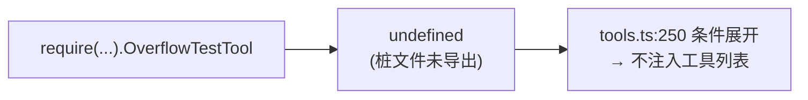
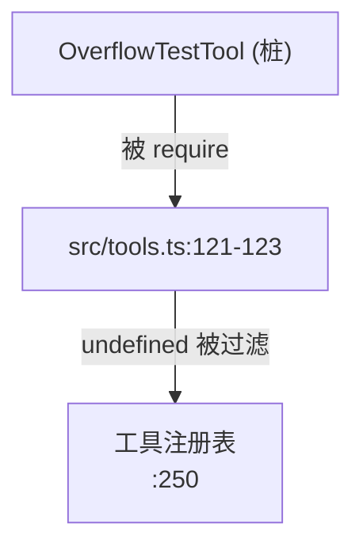

# OverflowTestTool 工具详解

> 这是工具系统逐个拆解系列的一篇。`OverflowTestTool` 是一个**纯 stub / 测试工具**：整个文件只有 3 行有效代码，导出一个空字符串常量 `OVERFLOW_TEST_TOOL_NAME`。它是"自动生成的桩文件"（注释明确），用于工具系统的边界测试（如上下文溢出、工具注册空值等场景），没有任何业务逻辑。

---

## 一、工具定位（一句话总结）

**`OverflowTestTool` = 自动生成的桩文件，仅提供空工具名常量，用于工具系统测试。**

| 维度 | 值 |
|---|---|
| 工具名 | `''`（空字符串，`OVERFLOW_TEST_TOOL_NAME`，`:3`） |
| 一句话 | 无实际工具实现，仅导出常量占位 |
| 是否进 system prompt | ❌ 不在 `CORE_TOOLS`；`tools.ts:121-123` 受 `feature('OVERFLOW_TEST_TOOL')` 门控，`:250` 条件注册 |
| 只读 / 破坏性 | N/A（无 `buildTool`，无 `Tool` 对象） |
| 是否可并发 | N/A |
| 激活门控 | `feature('OVERFLOW_TEST_TOOL')`（构建期，默认禁用） |
| 核心依赖 | 无 |

**为什么需要它？** 这是逆向/反编译代码库的产物——原始 OverflowTestTool 用于 Anthropic 内部测试工具系统的边界条件（上下文溢出 overflow、空工具注册等）。反编译后未恢复真实实现，保留为桩文件占位，维持 `tools.ts` 的 `require` 路径不报错。

---

## 二、关键文件清单

```
OverflowTestTool/
└── OverflowTestTool.ts   ← 全部内容（3 行有效代码）
```

| 文件 | 角色 | 必看行号 |
|---|---|---|
| `OverflowTestTool.ts` | 桩文件，仅导出空常量 | `OVERFLOW_TEST_TOOL_NAME:3` |

整个文件内容：
```ts
// 自动生成的桩文件 —— 请替换为真实实现
export {}
export const OVERFLOW_TEST_TOOL_NAME: string = ''
```

> **结构特点**：本批最小的工具。没有 `buildTool`、没有 `Tool` 对象、没有 schema、没有 `call()`。`tools.ts:121-123` 的 `require(...).OverflowTestTool` 在 feature 启用时会得到 `undefined`，被 `:250` 的 `...(OverflowTestTool ? [OverflowTestTool] : [])` 安全过滤。

---

## 三、Tool 接口字段实现

**无。** 本工具未实现 `Tool` 接口，没有 `buildTool({...})` 调用。

- `tools.ts:122-123` 尝试 `require(...).OverflowTestTool`，但桩文件只导出 `OVERFLOW_TEST_TOOL_NAME`，不导出 `OverflowTestTool`，故解构得到 `undefined`。
- `:250` `...(OverflowTestTool ? [OverflowTestTool] : [])` 因 `undefined` 为 falsy，不注入任何工具。

---

## 四、核心执行流程：`call()`

**无 `call()`。** 本工具无任何执行逻辑。



---

## 五、权限与安全

**不适用。** 无工具实现即无权限模型。

---

## 六、与其他系统/工具的关系



- **与 `tools.ts`**：唯一的联系点。`tools.ts:121-123` 在 `feature('OVERFLOW_TEST_TOOL')` 启用时 `require` 本文件，但因桩文件不导出 `OverflowTestTool`，结果为 `undefined`，被条件展开安全过滤。
- **与工具系统测试**：推测原始用途是测试工具系统在边界条件（overflow）下的行为，但当前桩文件不具备此能力。

---

## 七、亮点与设计取舍

1. **诚实的 stub 标注**（`:1`）：注释"自动生成的桩文件 —— 请替换为真实实现"明确告知这是占位。
2. **空常量而非完整 Tool 对象**：选择最小占位（只导出常量），而非伪造一个空 `buildTool`——避免误导读者以为有真实逻辑。
3. **`tools.ts` 的防御性过滤**（`:250`）：`...(OverflowTestTool ? [OverflowTestTool] : [])` 保证即使 require 得到 undefined 也不会破坏工具注册。
4. **feature gate 默认禁用**（`OVERFLOW_TEST_TOOL` 不在 `DEFAULT_BUILD_FEATURES`）：测试工具不进入生产构建。

---

## 八、源码导航（书签速查）

| 想看什么 | 去哪里 |
|---|---|
| 桩文件全部内容 | `OverflowTestTool/OverflowTestTool.ts:1-3` |
| 空工具名常量 | `OverflowTestTool.ts:3` |
| feature gate 注册 | `src/tools.ts:121-123` |
| 条件展开过滤 | `src/tools.ts:250` |

---

## 九、学习建议与验证清单

**怎么读这章**：这是本批最简单的工具。核心认知：它是桩文件，不是真实工具，不要试图从中学习工具实现模式。

**验证清单（读完自测）**：
- [ ] 能说出本工具是自动生成的桩文件（注释 `:1`）
- [ ] 能解释为什么 `tools.ts` 的 require 得到 undefined（桩文件不导出 `OverflowTestTool`）
- [ ] 能指出 feature gate（`OVERFLOW_TEST_TOOL`，默认禁用）
- [ ] 能说出 `:250` 的条件展开如何安全过滤 undefined

**配合动作**：
1. 阅读完整文件（仅 3 行），确认无业务逻辑
2. 在 `tools.ts:121-123` 确认 require 路径与桩文件导出的不匹配
3. 不要尝试启用本工具——它没有实现，启用只会得到 undefined 被过滤
