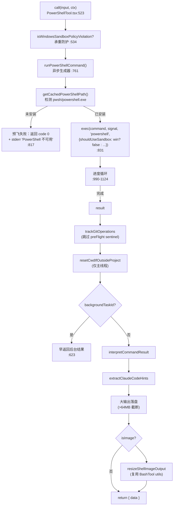
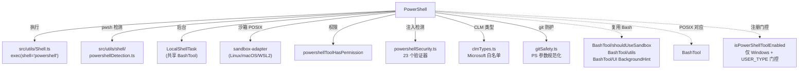

# PowerShell 工具详解

> `PowerShell` 是 `Bash` 的 **Windows 对应物**。两者结构高度相似（同样有 `call()` 编排器 + 异步生成器 + 三种后台化 + 30K 结果阈值），甚至**复用**了 BashTool 的 `shouldUseSandbox`、`utils`（图像/截断/cwd 重置）、`BackgroundHint` 组件。但 PowerShell 有**自己独立的安全引擎**——因为 PS 语法（cmdlet、splatting、子表达式 `$(...)`、stop-parsing `--%`、`Invoke-Expression`）与 bash 完全不同，注入向量也不同。本篇重点讲它与 BashTool 的**差异面**：Windows 专属的门控、PS 特有的攻击向量、版本感知的 prompt。

---

## 一、工具定位（一句话总结）

**`PowerShell` = Windows 平台执行 PowerShell 命令的执行类工具，BashTool 的 Windows 镜像。**

| 维度 | 值 |
|---|---|
| 工具名 | `PowerShell`（常量 `POWERSHELL_TOOL_NAME`，`toolName.ts:2`） |
| 一句话 | 给定一条 PowerShell 命令，在 Windows 上执行并返回 stdout/stderr |
| 是否进 system prompt | ✅ 在 `CORE_TOOLS` 内（经 `SHELL_TOOL_NAMES` 展开，`constants/tools.ts:139`） |
| 只读 / 破坏性 | **动态判定**（`isReadOnly()` 逐命令求值） |
| 是否可并发 | ⚠️ **仅当 `isReadOnly()` 为真才可并发**（`PowerShellTool.tsx:355`） |
| 核心依赖 | `src/utils/Shell.ts` 的 `exec()`（shell='powershell'）+ `getCachedPowerShellPath()` + 复用 BashTool 的 `shouldUseSandbox/utils/BackgroundHint` |
| 定位互补方 | `Bash`（POSIX 对应物）、`Agent`（开放式探索） |
| 注册门控 | **仅 Windows 启用**（`isPowerShellToolEnabled()`，`shellToolUtils.ts`） |

**注册条件**（`src/utils/shell/shellToolUtils.ts`）：`getPlatform() !== 'windows'` 时返回 false；Windows 上 ant 用户默认启用（`CLAUDE_CODE_USE_POWERSHELL_TOOL=0` 关闭），外部用户默认关闭（`=1` 开启）。`tools.ts:175-179` 用惰性 `getPowerShellTool()` 按需 require。

---

## 二、关键文件清单

```
PowerShellTool/
├── PowerShellTool.tsx        ← buildTool 主体（42KB，call/权限/渲染/runPowerShellCommand 生成器）
├── prompt.ts                 ← system prompt（含 PS 版本感知语法指导）
├── toolName.ts               ← POWERSHELL_TOOL_NAME 常量
├── UI.tsx                    ← Ink 渲染（命令展示/进度/结果）
├── powershellPermissions.ts  ← 【核心】权限引擎（66KB，powershellToolHasPermission 主入口）
├── powershellSecurity.ts     ← 【核心】PS 命令注入校验（36KB，23 个验证器）
├── readOnlyValidation.ts     ← 只读判定（67KB，isReadOnlyCommand + cmdlet 白名单）
├── pathValidation.ts         ← 路径约束校验（72KB，Win32 路径规范化）
├── modeValidation.ts         ← 权限模式校验（acceptEdits 放行文件系统 cmdlet）
├── commandSemantics.ts       ← 退出码语义解释（findstr/robocopy/fc 等）
├── destructiveCommandWarning.ts ← 破坏性命令正则告警（Remove-Item -Recurse -Force 等）
├── gitSafety.ts              ← git 攻击防护（裸仓库/git 内部路径，PS 参数规范化）
├── commonParameters.ts       ← PS 通用参数集（-Verbose/-ErrorAction 等）
├── clmTypes.ts               ← Constrained Language Mode 允许类型白名单
└── src/                      ← 内部子模块（hooks/useCanUseTool、state/AppState）
```

| 文件 | 角色 | 必看行号 |
|---|---|---|
| `PowerShellTool.tsx` | 主体：schema + call() + 字段 + runPowerShellCommand | `buildTool:341`、`call:523`、`runPowerShellCommand:761`、`isReadOnly:369`、`validateInput:425` |
| `powershellPermissions.ts` | 权限引擎主入口 | `powershellToolHasPermission:638` |
| `powershellSecurity.ts` | 命令注入校验 | `powershellCommandIsSafe:1025`（23 个验证器，`:1037-1062`） |
| `readOnlyValidation.ts` | 只读判定 | `isReadOnlyCommand:1155`、`hasSyncSecurityConcerns:1099`、`resolveToCanonical:971` |
| `gitSafety.ts` | git 攻击防护（PS 专属） | `isGitInternalPathPS:134`、`isDotGitPathPS:152`、`normalizeGitPathArg:44` |
| `clmTypes.ts` | CLM 允许类型（约束语言模式） | `CLM_ALLOWED_TYPES:18` |
| `prompt.ts` | system prompt | `getPrompt:73`、`getEditionSection:51`（版本感知） |

> **结构特点**：与 BashTool 一一对应的"多文件主体"型。每个 bash 侧的安全模块都有一个 PS 侧的对应物（`bashPermissions` ↔ `powershellPermissions`、`bashSecurity` ↔ `powershellSecurity`、`readOnlyValidation` 各自一份）。这种对称结构让两个 shell 工具共享执行管道但各自处理语法差异。

---

## 三、Tool 接口字段实现（`buildTool` 逐字段）

PowerShellTool 的字段实现与 BashTool **高度对称**，本节聚焦差异点。

### 标识字段

```ts
name: POWERSHELL_TOOL_NAME,             // "PowerShell"
searchHint: '执行 Windows PowerShell 命令',
maxResultSizeChars: 30_000,             // 同 BashTool
strict: true,
isEnabled(): true,                      // 硬编码 true（运行时门控在 tools.ts 的 getPowerShellTool）
```

### 输入 schema（`PowerShellTool.tsx:255-272`）

```ts
{
  command: string,
  timeout?: number,
  description?: string,
  run_in_background?: boolean,
  dangerouslyDisableSandbox?: boolean,
}
```

> **与 BashTool 的差异**：**没有** `_simulatedSedEdit` 内部字段——PS 侧没有 sed 预览直写的等价物。

### 行为字段差异

| 字段 | 实现 | 与 BashTool 的差异 |
|---|---|---|
| `isReadOnly()` | `:369` | **先用 `hasSyncSecurityConcerns` 同步启发式检查**（`$(...)`/splatting/成员调用/赋值），再调 `isReadOnlyCommand`。BashTool 直接调 `checkReadOnlyConstraints`。 |
| `isSearchOrReadCommand()` | `:359` | 用 `isSearchOrReadPowerShellCommand`（PS_SEARCH_COMMANDS = `select-string/get-childitem/findstr`，PS_READ_COMMANDS = `get-content/get-item/test-path` 等） |
| `validateInput()` | `:425` | **额外检查 `isWindowsSandboxPolicyViolation`**（企业策略要求沙箱但 Windows 原生无沙箱 → 拒绝执行） |
| `call()` | `:523` | **承重防护**：即使绕过 validateInput 的直接调用者（promptShellExecution.ts）也在 call() 内再次检查沙箱策略违规 |
| `checkPermissions()` | `:447` | 委托 `powershellToolHasPermission`（而非 bashToolHasPermission） |

### `isReadOnly` 的两段式（`:369-385`）

PowerShellTool 的 `isReadOnly` 是**两段式**，因为 Tool 接口的 `isReadOnly` 是同步的，而完整 AST 解析是异步的：

1. **同步启发式**（`hasSyncSecurityConcerns`，`readOnlyValidation.ts:1099`）：正则检测 `$(...)`（子表达式）、`@var`（splatting）、`.Method()`（成员调用）、`$var =`（赋值）、`--%`（stop-parsing）、`\\`（UNC 路径）、`::`（静态方法）。任何命中 → 非只读。
2. **cmdlet 白名单**（`isReadOnlyCommand`，`:1155`）：无 AST 时对简单单 token 命令用白名单；有 AST 时（在 `powershellToolHasPermission` 步骤 4.5）真正异步判定只读。

注释（`:377-384`）说明：没有 AST 时 `isReadOnlyCommand` 无法分割管道/语句，对复杂命令保守返回 false——真正的只读自动允许在异步权限检查中发生。

### Windows 沙箱策略违规（`:240-248`）

```ts
const WINDOWS_SANDBOX_POLICY_REFUSAL = '企业策略要求沙箱化，但原生 Windows 上不可用沙箱化...'
function isWindowsSandboxPolicyViolation(): boolean {
  return getPlatform() === 'windows' &&
    SandboxManager.isSandboxEnabledInSettings() &&
    !SandboxManager.areUnsandboxedCommandsAllowed();
}
```

**设计取舍**：沙箱（bwrap/sandbox-exec）是 POSIX 专属，Windows 原生不支持。如果企业策略要求沙箱且禁止非沙箱命令，PowerShell **无法遵守**——选择**拒绝执行**而非静默绕过策略。这个检查在 `validateInput`（干净的工具运行器错误，errorCode 11）**和** `call()`（承重防护，覆盖绕过 validateInput 的直接调用者）中都做。

---

## 四、核心执行流程：`call()` + `runPowerShellCommand`

`call()`（`:523-755`）与 BashTool 的 `call()` 结构对称，本节聚焦差异。



### 与 BashTool 的 call() 差异

1. **Windows 沙箱策略承重防护**（`:534`）：`promptShellExecution.ts` 和 `processBashCommand.tsx` 直接调用 `PowerShellTool.call()`，绕过 validateInput。call() 内重复检查策略违规，覆盖所有调用者。
2. **pwsh 预飞检测**（`:816-827`）：`getCachedPowerShellPath()` 检测 PowerShell 是否安装。未安装时返回 code 0 + stderr（优雅呈现而非抛 ShellError，因为命令从未运行，无有意义的退出码）。
3. **沙箱平台判断**（`:846`）：`shouldUseSandbox: getPlatform() === 'windows' ? false : shouldUseSandbox(...)`——Windows 原生不沙箱；Linux/macOS/WSL2 上 pwsh 是原生二进制，沙箱像 bash 一样工作。
4. **preFlight sentinel 哨兵**（`:594`）：`code === 0 && !stdout && stderr && !backgroundTaskId` 是预飞失败的标志，跳过 `trackGitOperations`（否则会把从未运行的命令误计为 git 操作）。
5. **后台化早返回**（`:623-638`）：有 `backgroundTaskId` 时**提前返回**（BashTool 没有这个早返回——BashTool 的后台化结果流经单一提取点）。先剥离 hints，使中断后台化的 fullOutput 不泄漏标签到模型。
6. **用户中断后台化**（`:1049-1064`）：用户提交新消息时（`abortController.signal.reason === 'interrupt'`）**后台化而非杀死**命令——匹配 BashTool 的"中断即后台"设计，避免丢失运行中的工作。

### runPowerShellCommand 的后台化设计（`:761-1137`）

与 BashTool 的 `runShellCommand` 完全对称的三种触发：超时（`:935`）、助手模式 15 秒（`:944-957`）、用户 Ctrl+B（`:1067-1078`）。`finally` 块（`:1125-1136`）确保每个退出路径都清理流监听器，匹配 main #21105。

---

## 五、权限与安全

PowerShellTool 的安全子系统与 BashTool 对称，但针对 PS 语法有**专属攻击向量**的防护。

### 5.1 总入口：`powershellToolHasPermission`（`powershellPermissions.ts:638`）

管道结构与 `bashToolHasPermission` 对称，但有 PS 特有的顺序处理：

```ts
// 1. 精确匹配（deny 优先）
exactMatchResult = powershellToolCheckExactMatchPermission(...)
if (deny) return deny;

// 2. 前缀/通配规则
{ matchingDenyRules, matchingAskRules } = matchingRulesForInput(...)

// 2b. ask 规则延迟到 decisions[]（不早返回）
// 注释 :693-700：以前 ask 早返回会掩盖后续子命令 deny
let preParseAskDecision = askRules[0] ? {...} : null;

// UNC 路径也延迟（同上原因）
if (preParseAskDecision === null && containsVulnerableUncPath(command)) {
  preParseAskDecision = { behavior: 'ask', ... }
}

// 解析 + 后续校验...
```

**关键修复**（`:693-700`）：以前 ask 规则早返回，导致 `Get-Process; Invoke-Expression evil` 带 `ask(Get-Process:*)` + `deny(Invoke-Expression:*)` 会显示 ask 对话框而 deny 从不触发。现在 ask 延迟到 decisions[]，让子命令 deny 优先生效。

### 5.2 PS 命令注入校验：`powershellSecurity.ts`

`powershellCommandIsSafe`（`:1025`）运行 **23 个验证器**（`:1037-1062`），任何一条 ask 则整体 ask：

| 验证器 | 防的攻击 |
|---|---|
| `checkInvokeExpression` | `Invoke-Expression` / `iex`（等价 eval） |
| `checkDynamicCommandName` | 动态拼接的命令名 |
| `checkEncodedCommand` | `-EncodedCommand`（base64 混淆代码） |
| `checkPwshCommandOrFile` | `pwsh -c` / `pwsh -File`（嵌套执行） |
| `checkDownloadCradles` | 下载摇篮（`IEX(New-Object Net.WebClient).DownloadString(...)`） |
| `checkDownloadUtilities` | `Invoke-WebRequest`/`Start-BitsTransfer` 等下载工具 |
| `checkAddType` | `Add-Type`（编译并加载任意 C#） |
| `checkComObject` | `New-Object -ComObject`（COM 劫持） |
| `checkDangerousFilePathExecution` | 执行危险路径下的文件 |
| `checkInvokeItem` | `Invoke-Item`（执行任意文件） |
| `checkScheduledTask` | 注册计划任务（持久化） |
| `checkForEachMemberName` | `ForEach-Object -MemberName`（动态调用） |
| `checkStartProcess` | `Start-Process`（派生进程） |
| `checkScriptBlockInjection` | 脚本块 `{...}` 注入 |
| `checkSubExpressions` | `$(...)` 子表达式执行任意代码 |
| `checkExpandableStrings` | 可展开字符串（`"$var"`） |
| `checkSplatting` | `@var` splatting 传递任意参数 |
| `checkStopParsing` | `--%` stop-parsing 符号绕过 PS 解析 |
| `checkMemberInvocations` | `.Method()` 调用任意 .NET 方法 |
| `checkTypeLiterals` | `[Type]` 类型字面量（不在 CLM 白名单则 ask） |
| `checkEnvVarManipulation` | 环境变量操纵 |
| `checkModuleLoading` | `Import-Module` 加载任意模块 |
| `checkRuntimeStateManipulation` | 运行时状态操纵 |
| `checkWmiProcessSpawn` | WMI 派生进程 |

> **与 bashSecurity 的对比**：bash 侧防的是 `$()`/`${}`/进程替换/Zsh builtins；PS 侧防的是 `Invoke-Expression`/splatting/子表达式/stop-parsing/Add-Type/COM 对象——攻击向量完全不同，所以需要独立的安全引擎。

### 5.3 Constrained Language Mode 类型白名单：`clmTypes.ts`

`CLM_ALLOWED_TYPES`（`:18`）是 Microsoft 的 CLM 允许类型列表。不在白名单的类型字面量 → ask。注释（`:1-17`）说明：这是反向使用 Microsoft 的列表——一次规范化检查替代逐一枚举危险类型（命名管道、反射、进程派生、P/Invoke 封送）。**安全细节**（`:22-26`）：`adsi`/`adsisearcher` 被刻意移除——它们强转时会执行网络绑定（`[adsi]'LDAP://evil.com/...'` → 连接 LDAP 服务器），Microsoft 允许是因为面向可信域管理员，但本工具的目标不会被校验。

### 5.4 git 攻击防护：`gitSafety.ts`（PS 专属）

PS 侧的 git 攻击防护需要处理 **PS 参数语法的路径规范化**——这是与 bash 侧 `pathValidation.ts` 最大的差异。

`normalizeGitPathArg`（`:44`）把 PS 参数文本规范化为规范路径，顺序严格：
1. 结构性剥离（横杠字符 `–—―`、引号、反引号转义、`FileSystem::` provider 前缀、`C:` 驱动器相对前缀）
2. NTFS 按组件尾部剥离（Win32 `CreateFileW` 会剥离尾部空格和点：`hooks .` → `hooks`，`...` → '' → `.`）
3. `posix.normalize`（解析 `..`、`.`、`//`）
4. 大小写折叠（Windows 路径不区分大小写）

`isGitInternalPathPS`（`:134`）检测参数是否解析为 cwd 中的 git 内部路径（`HEAD`/`objects`/`refs`/`hooks`），覆盖裸仓库攻击。`resolveCwdReentry`（`:21`）处理 `../<cwd-basename>/hooks` 这种通过父目录重新进入 cwd 的逃逸——`posix.normalize` 保留前导 `..`（无 cwd 上下文），所以需要针对实际 cwd 解析。

### 5.5 同步安全启发式：`hasSyncSecurityConcerns`（`readOnlyValidation.ts:1099`）

这是 `isReadOnly` 同步阶段的快速筛查（正则）：
- `\$\(`（子表达式）、`@\w+`（splatting）、`\.\w+\s*\(`（成员调用）、`\$\w+\s*[+\-*/]?=`（赋值）、`--%`（stop-parsing）、`\\\\`（UNC）、`::`（静态方法）

任何命中 → 非只读（保守地走完整权限检查）。

### 5.6 破坏性告警：`destructiveCommandWarning.ts`

`DESTRUCTIVE_PATTERNS`（`:11`）匹配 PS 破坏性命令（`Remove-Item -Recurse -Force` 及别名 `rm/del/rd/rmdir/ri`）。正则用 `(?:^|[|;&\n({])` 锚定语句开头，`[^|;&\n}]*` 限定同一语句内——这样 `git rm --force` 不会误匹配（`\b` 会在任何单词边界后匹配 `rm`）。

### 5.7 通用参数：`commonParameters.ts`

`COMMON_PARAMETERS`（`:27`）是所有 PS cmdlet 通过 `[CmdletBinding()]` 可用的通用参数（`-Verbose`/`-ErrorAction`/`-OutVariable` 等）。由 `pathValidation.ts`（合并到每个 cmdlet 的已知参数集合）和 `readOnlyValidation.ts`（合并到 safeFlags 检查）共享——拆分出来是为了打破导入循环。

---

## 六、与其他系统/工具的关系



- **与 `Bash` 的关系（重点）**：两者是"共享执行基础设施 + 独立安全引擎"的镜像设计。PowerShellTool **复用**了 BashTool 的：
  - `shouldUseSandbox`（沙箱判定）
  - `utils.ts` 的 `buildImageToolResult`/`isImageOutput`/`resetCwdIfOutsideProject`/`resizeShellImageOutput`/`stripEmptyLines`
  - `UI.tsx` 的 `BackgroundHint` 组件（Ctrl+B 后台化）
  - `shared/gitOperationTracking`（git 使用指标）

  但**各自独立**的安全/权限/只读/路径校验引擎——因为 bash 和 PS 的注入向量、参数语法、路径规范完全不同。
- **与 pwsh 检测的关系**：`getCachedPowerShellPath()`（`src/utils/shell/powershellDetection.ts`）检测系统安装的 PowerShell 版本（5.1 desktop 或 7+ core），结果缓存并用于 prompt 的版本感知语法指导。
- **与注册门控的关系**：`tools.ts:175-179` 用惰性 `getPowerShellTool()`，非 Windows 或门控关闭时返回 null，工具不出现在列表中。

---

## 七、亮点与设计取舍

1. **镜像设计，共享执行 + 独立安全**：与 BashTool 共享 Shell.ts/任务系统/沙箱/utils，但安全引擎完全独立。这是"DRY 到语法边界"的体现——执行管道 shell 无关，安全校验必须 shell 相关。
2. **版本感知 prompt**（`prompt.ts:51`）：`getPowerShellEdition` 检测 5.1 还是 7+，注入不同的语法指导（5.1 不支持 `&&`/`??`/`?:`，7+ 支持）。避免模型在 5.1 上发出 7+ 语法导致解析错误。
3. **Windows 沙箱策略拒绝执行**（`:240`）：企业策略要求沙箱但 Windows 原生无沙箱时，**拒绝执行而非静默绕过**——安全优先于可用性。承重防护在 call() 重复，覆盖绕过 validateInput 的调用者。
4. **23 个 PS 专属验证器**：从 `Invoke-Expression` 到 `checkWmiProcessSpawn`，覆盖 PS 的完整攻击面。`checkTypeLiterals` 用 Microsoft 的 CLM 白名单做反向检查，一个列表替代逐一枚举危险类型。
5. **PS 参数规范化深坑**（`gitSafety.ts:44`）：Win32 `CreateFileW` 按组件剥离尾部空格和点（`hooks .` → `hooks`），NTFS 8.3 短名（`.git` → `GIT~1`），provider 前缀（`FileSystem::`），驱动器相对（`C:foo`）——PS 侧的路径规范化比 bash 侧复杂得多，需要专项处理。
6. **ask 延迟到 decisions[]**（`:693-700`）：修复 ask 早返回掩盖后续子命令 deny 的 bug。`Get-Process; Invoke-Expression evil` 带 ask+deny 规则时，deny 优先生效。
7. **CLM 类型白名单移除 adsi/adsisearcher**（`:22-26`）：Microsoft 允许是因为面向可信域管理员，本工具移除是因为目标不会被校验——Active Directory 类型强转会执行网络绑定。安全细节的体现。
8. **preFlight sentinel 跳过 git 跟踪**（`:594`）：预飞失败（pwsh 未安装）返回 code 0 + 空 stdout + stderr，跳过 `trackGitOperations` 避免误计从未运行的命令。
9. **中断即后台**（`:1049`）：用户提交新消息时后台化而非杀死运行中的命令——避免丢失工作，匹配 BashTool 设计。

---

## 八、源码导航（书签速查）

| 想看什么 | 去哪里 |
|---|---|
| 工具名常量 | `PowerShellTool/toolName.ts:2` |
| `buildTool` 字段填充 | `PowerShellTool/PowerShellTool.tsx:341-759` |
| 输入/输出 schema | `PowerShellTool.tsx:255-297` |
| `call()` 编排器 | `PowerShellTool.tsx:523-755` |
| `runPowerShellCommand` 生成器 | `PowerShellTool.tsx:761-1137` |
| Windows 沙箱策略拒绝 | `PowerShellTool.tsx:240-248` |
| 权限引擎主入口 | `powershellPermissions.ts:638` |
| PS 命令注入校验 | `powershellSecurity.ts:1025`（23 验证器 `:1037-1062`） |
| 只读判定 | `readOnlyValidation.ts:1155`（isReadOnlyCommand）/ `:1099`（hasSyncSecurityConcerns） |
| cmdlet 规范化 | `readOnlyValidation.ts:971`（resolveToCanonical） |
| git 攻击防护（PS） | `gitSafety.ts:134`（isGitInternalPathPS）/ `:44`（normalizeGitPathArg） |
| CLM 类型白名单 | `clmTypes.ts:18` |
| 通用参数集 | `commonParameters.ts:27` |
| 破坏性告警 | `destructiveCommandWarning.ts:11` |
| 退出码语义 | `commandSemantics.ts:129` |
| system prompt 构造 | `prompt.ts:73`（getPrompt）/ `:51`（getEditionSection 版本感知） |
| pwsh 检测（外部） | `src/utils/shell/powershellDetection.ts` |
| 注册门控（外部） | `src/utils/shell/shellToolUtils.ts`（isPowerShellToolEnabled） |

---

## 九、学习建议与验证清单

**怎么读这章**：这是 BashTool 的姊妹篇。**强烈建议先读 BashTool**，再来读本篇——两者结构对称，本篇聚焦差异。重点对比"五、权限与安全"的验证器列表（bash 侧 vs PS 侧的注入向量差异）和 gitSafety 的 PS 参数规范化深坑。

**验证清单（读完自测）**：
- [ ] 能说出 PowerShellTool 复用了 BashTool 的哪些模块（shouldUseSandbox/utils/BackgroundHint/gitOperationTracking）
- [ ] 能解释为何安全引擎必须独立（bash 与 PS 注入向量、参数语法、路径规范完全不同）
- [ ] 能指出 Windows 沙箱策略违规时的处理（拒绝执行而非静默绕过，承重防护在 call()）
- [ ] 能说出 `isReadOnly` 为何是两段式（同步接口 + 异步 AST 解析的矛盾）
- [ ] 能列出 `hasSyncSecurityConcerns` 检测的 7 种模式（`$()`/splatting/成员调用/赋值/`--%`/UNC/`::`）
- [ ] 能解释版本感知 prompt 的作用（5.1 vs 7+ 语法差异，避免解析错误）
- [ ] 能说出 ask 延迟到 decisions[] 修复了什么 bug（ask 早返回掩盖子命令 deny）
- [ ] 能指出 CLM 白名单为何移除 adsi/adsisearcher（强转执行网络绑定）
- [ ] 能解释 preFlight sentinel 的作用（跳过 git 跟踪，避免误计未运行命令）
- [ ] 能说出注册门控的条件（仅 Windows + USER_TYPE 门控）

**配合动作**：
1. 在 Windows 上让 Claude 执行 `Get-ChildItem`，观察只读自动放行
2. 让 Claude 执行 `Invoke-Expression "rm file"`，观察权限对话框（checkInvokeExpression 触发）
3. 让 Claude 执行 `Select-String`（grep 等价物），观察 isSearch 标记与可折叠显示
4. 在 5.1 系统上让 Claude 用 `&&`，观察解析错误与 prompt 的版本指导
5. 对比 BashTool 与 PowerShellTool 的 `call()`，确认后台化逻辑对称
