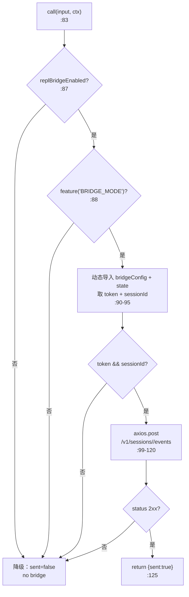
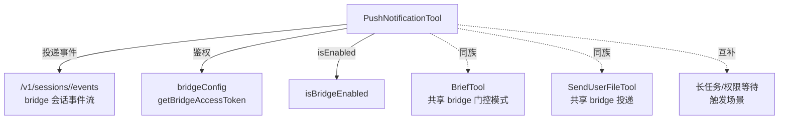

# PushNotification 工具详解

> 这是工具系统逐个拆解系列的一篇。`PushNotification` 是一个**中等复杂度**的通信工具：让模型在用户可能没盯着终端时（长任务完成、等待权限、紧急事项）主动向其移动设备推送通知。它依赖 Remote Control bridge，通过 `/v1/sessions/<id>/events` 端点投递。无 bridge 时优雅降级为"未送达"。

---

## 一、工具定位（一句话总结）

**`PushNotification` = 经 bridge 向用户移动设备推送通知的异步提醒工具。**

| 维度 | 值 |
|---|---|
| 工具名 | `PushNotification`（常量定义在文件内 `:9`） |
| 一句话 | 发送 title/body/priority 到用户手机，需 Remote Control 配置 |
| 是否进 system prompt | ❌ 不在 `CORE_TOOLS`；`tools.ts:51-54` 受 `feature('BRIDGE_MODE')` 门控，`:268` 条件注册 |
| 只读 / 破坏性 | **标注只读**（`isReadOnly() → true`，`:58`），但有用户可见副作用 |
| 是否可并发 | ✅ **可并发**（`:55`） |
| 激活门控 | `feature('BRIDGE_MODE')`（构建期） + `isBridgeEnabled()`（运行时 `:52`） |
| 核心依赖 | `axios`（动态导入）、bridge token、session ID |

**为什么需要它？** 助手模式 / 后台任务下，用户可能不在终端前。当长任务跑完、权限提示等待输入、或出现紧急情况时，模型需要一种"主动呼叫用户回来"的机制。推送通知填补了"终端静默 ↔ 用户在场"之间的鸿沟。

---

## 二、关键文件清单

```
PushNotificationTool/
└── PushNotificationTool.ts   ← 单文件主体（149 行），全部逻辑集中
```

| 文件 | 角色 | 必看行号 |
|---|---|---|
| `PushNotificationTool.ts` | schema + call() + bridge 投递 + 降级 | `buildTool:28`、`call:83`、bridge 投递 `:87-135` |

> **结构特点**：单文件主体，无独立 prompt.ts（描述内联）。与 BriefTool 共享 `isBridgeEnabled` 门控模式，但投递路径独立（sessions/events 而非 file_upload）。

---

## 三、Tool 接口字段实现（`buildTool` 逐字段）

### 标识字段

```ts
name: PUSH_NOTIFICATION_TOOL_NAME,  // "PushNotification"
searchHint: 'push notification mobile alert notify user',
maxResultSizeChars: 1_000,
strict: true,
```

### 模型面字段

```ts
async description() { return "Send a push notification to the user's mobile device" }
async prompt()      { return `Send a push notification...via Remote Control...` }
get inputSchema()   // lazySchema + z.strictObject
```

**输入 schema**（`:11-22`）：
```ts
{
  title: string,                      // 通知标题
  body: string,                       // 通知正文
  priority?: 'normal' | 'high',       // 可选优先级，阻塞/权限用 high
}
```

**输出类型**（`:26`）：
```ts
{ sent: boolean }
```

### 行为字段

| 字段 | 实现 | 说明 |
|---|---|---|
| `call()` | `:83` | bridge 投递 + 降级（见下节） |
| `isEnabled()` | `:52` → `isBridgeEnabled()` | 运行时门控 |
| `isConcurrencySafe()` | `:55` → `true` | 多条通知互不干扰 |
| `isReadOnly()` | `:58` → `true` | 标注只读 |
| `userFacingName()` | `:62` → `'Notify'` | |
| `renderToolUseMessage` | `:66` → `Push: <title>` | |
| `mapToolResultToToolResultBlockParam` | `:70` | `Notification sent.` / `Failed to send notification.` |

---

## 四、核心执行流程：`call()`

`call()`（`:83-148`）尝试 bridge 投递，失败则降级：



**关键点逐条**：

1. **双层 bridge 门控**（`:87` + `:88`）：先查运行时 `replBridgeEnabled`，再查构建期 `feature('BRIDGE_MODE')`。两者都满足才尝试投递。
2. **动态导入隔离依赖**（`:90-93`、`:98`）：`bridgeConfig`、`bootstrap/state`、`axios` 全部动态 `import()`，让这些依赖在非 bridge 构建中被 tree-shaking（与 BriefTool/upload.ts 同一策略）。
3. **事件载荷**（`:102-109`）：投递的是 `{type:'push_notification', title, body, priority}`，`priority` 缺省 `'normal'`（`:107`）。
4. **鉴权头**（`:112-115`）：`Authorization: Bearer <token>`、`anthropic-version: 2023-06-01`。
5. **`validateStatus: s => s < 500`**（`:118`）：4xx 也视为正常响应（由后续 `:121` 判 2xx），只有 5xx 才抛异常——避免 4xx 触发 axios throw 掩盖真实状态。
6. **降级返回**（`:141-147`）：无 bridge 或投递失败时返回 `{sent:false, error:'No Remote Control bridge configured...'}`，让模型知道通知没送达。

> **错误吞噬**：整个 bridge 投递包在 try/catch（`:89-133`），任何异常都只 `logForDebugging` 不抛出——这是"尽力而为"的推送语义：推送失败不应中断主流程。

---

## 五、权限与安全

- **无 `checkPermissions` / `validateInput`**：靠 `strict: true` + `isEnabled` 门控。
- **`isEnabled: isBridgeEnabled()`**（`:52`）：未配置 bridge 时工具直接不可用，模型看不到它。
- **Bearer token 鉴权**：每次投递带 `getBridgeAccessToken()`，无 token 则跳过（`:107-110`）。
- **`validateStatus: s < 500`**：故意不把 4xx 当异常，便于精确区分"客户端错误"与"服务端错误"。

> prompt（`:49`）提到尊重用户通知设置（`taskCompleteNotifEnabled`、`inputNeededNotifEnabled`、`agentPushNotifEnabled`），但这些检查不在本工具内——应在 bridge 服务端或事件路由层执行。

---

## 六、与其他系统/工具的关系



- **与 bridge 系统**：核心依赖。token、base URL、session ID 全部来自 bridge 配置。
- **与 `BriefTool` / `SendUserFileTool`**：三者都是"经 bridge 触达用户"的工具族，共享 `isBridgeEnabled` + `feature('BRIDGE_MODE')` 双门控和动态导入策略。
- **与 Remote Control Server**：投递的 `/v1/sessions/<id>/events` 由 RCS 处理，再路由到用户移动设备。

---

## 七、亮点与设计取舍

1. **动态导入隔离 axios**（`:98`）：避免 axios 进入非 bridge 构建的产物。
2. **`validateStatus: s < 500`**（`:118`）：精细的 HTTP 状态处理，区分 4xx（正常响应，由业务判 2xx）与 5xx（真正异常）。
3. **尽力而为 + 优雅降级**（`:141`）：推送失败不中断主流程，返回 `sent:false` 让模型知情。
4. **`priority` 字段路由**（`:107,15-18`）：`high` 用于阻塞/权限，`normal` 用于普通通知，下游据此决定通知行为。
5. **`isConcurrencySafe: true`**：多条通知并发投递安全（不同的 HTTP 请求）。
6. **完整 try/catch 包裹**（`:89-133`）：网络工具的健壮性标配。

---

## 八、源码导航（书签速查）

| 想看什么 | 去哪里 |
|---|---|
| 工具名常量 | `PushNotificationTool.ts:9` |
| `buildTool` 字段填充 | `PushNotificationTool.ts:28-149` |
| 输入 schema | `PushNotificationTool.ts:11-22` |
| `call()` bridge 投递 | `PushNotificationTool.ts:83-148` |
| 事件载荷构造 | `PushNotificationTool.ts:102-109` |
| feature gate 注册 | `src/tools.ts:51-54, 268` |

---

## 九、学习建议与验证清单

**怎么读这章**：核心是"四、call()"的双层门控与降级路径。重点理解为什么 axios 要动态导入、为什么 `validateStatus` 设为 `<500`。

**验证清单（读完自测）**：
- [ ] 能说出两层 bridge 门控（`replBridgeEnabled` + `feature('BRIDGE_MODE')`）
- [ ] 能解释 `validateStatus: s < 500` 的用意（4xx 不抛异常，精确区分错误类型）
- [ ] 能说出降级时的返回（`{sent:false, error:'No Remote Control bridge...'}`）
- [ ] 能指出 `priority` 字段的语义（normal vs high，阻塞用 high）
- [ ] 能解释为什么 axios 动态导入（非 bridge 构建可 tree-shaking）

**配合动作**：
1. 启用 bridge 模式，让模型在长任务完成时调用 PushNotification
2. 在 `:99` 的 axios.post 前加日志，观察事件载荷
3. 断开 bridge，观察降级返回的 `sent:false`
