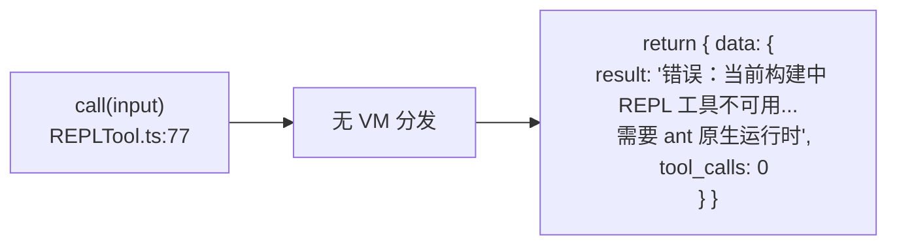
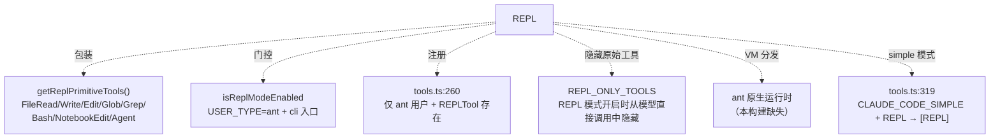

# REPL 工具详解

> `REPL` 是一个**特殊的"工具包装器"**：它不在 VM 中执行任意 JS 代码，而是把 `Read`/`Write`/`Edit`/`Glob`/`Grep`/`Bash`/`NotebookEdit`/`Agent` 这 8 个"原始工具"作为函数 API 暴露在一个 VM 上下文里，让模型用一段代码批量调用它们。**重点：在本逆向/学习版中，`REPLTool` 是一个 stub**——`call()` 直接返回"REPL 不可用"的错误字符串，真正的 VM 分发由 ant 原生运行时提供。本篇如实说明它的 stub 状态、注册门控、以及它如何通过 `REPL_ONLY_TOOLS` 与 `primitiveTools.ts` 改变工具可见性。

---

## 一、工具定位（一句话总结）

**`REPL` = 批量调用原始工具的 VM 包装器，当前构建中为 stub。**

| 维度 | 值 |
|---|---|
| 工具名 | `REPL`（常量 `REPL_TOOL_NAME`，`constants.ts:11`） |
| 一句话 | 在 REPL/VM 环境中执行代码，可访问所有原始工具（当前 stub，返回不可用错误） |
| 是否进 system prompt | ❌ **不在** `CORE_TOOLS` 白名单内（条件注册，见下） |
| 只读 / 破坏性 | **破坏性**（`isReadOnly() → false`，`:49`） |
| 是否可并发 | ❌ **不可并发**（`isConcurrencySafe() → false`，`:46`） |
| 核心依赖 | ant 原生运行时提供 VM 分发（本构建中缺失） |
| 定位互补方 | `Bash`/`Read`/`Write`/`Edit`/`Glob`/`Grep`/`NotebookEdit`/`Agent`（被包装的原始工具） |
| 注册门控 | **ant 用户 + REPL 模式启用**（`tools.ts:260` + `isReplModeEnabled`） |

**注册条件**（`tools.ts:16-19`、`:260`）：REPLTool 通过 `require()` 惰性加载（非顶层 import），仅在 `process.env.USER_TYPE === 'ant'` 且 `REPLTool` 存在时加入工具列表。`constants.ts:23-30` 的 `isReplModeEnabled` 进一步要求：`CLAUDE_CODE_REPL` 非假 +（`CLAUDE_REPL_MODE=1` 或 ant 用户 + cli 入口）。

---

## 二、关键文件清单

```
REPLTool/
├── REPLTool.ts        ← buildTool 主体（2.6KB，极简，call() 是 stub）
├── constants.ts       ← REPL_TOOL_NAME + isReplModeEnabled + REPL_ONLY_TOOLS
└── primitiveTools.ts  ← getReplPrimitiveTools（被隐藏的原始工具列表）
```

| 文件 | 角色 | 必看行号 |
|---|---|---|
| `REPLTool.ts` | 工具主体（极简 schema + stub call） | `buildTool:21`、`call:77`（stub） |
| `constants.ts` | 名称 + 门控函数 + REPL_ONLY_TOOLS | `REPL_TOOL_NAME:11`、`isReplModeEnabled:23`、`REPL_ONLY_TOOLS:37` |
| `primitiveTools.ts` | 原始工具惰性列表 | `getReplPrimitiveTools:27` |

> **结构特点**：REPLTool 是"极简单文件"型——只有 3 个文件，主体 90 行。这是因为它是一个**接口壳**，真正逻辑（VM 分发）在 ant 原生运行时，本构建中不存在。对比 BashTool 的 19 个文件，REPLTool 的极简恰恰反映了它的 stub 状态。

---

## 三、Tool 接口字段实现（`buildTool` 逐字段）

REPLTool 只实现了**最小字段集**，缺失大量标准字段（无 `checkPermissions`、无 `validateInput`、无 `renderToolResultMessage`、无 `preparePermissionMatcher`）。

### 标识字段

```ts
name: REPL_TOOL_NAME,                  // "REPL"
searchHint: 'repl execute batch code read write edit glob grep bash',
maxResultSizeChars: 100_000,           // 比 Bash/Glob 高（10 万字符）
strict: true,
```

### 输入 schema（`:7-15`）

```ts
{
  code: string  // 在 REPL 中执行的代码，可通过 API 调用任何原始工具
}
```

**输出类型**（`:19`，无 lazySchema）：
```ts
type REPLOutput = { result: string; tool_calls: number }
```

### 行为字段

| 字段 | 实现 | 说明 |
|---|---|---|
| `call()` | `:77` | **stub**：直接返回"REPL 工具不可用"错误（见下） |
| `isConcurrencySafe()` | `:46` → `false` | 不可并发（可能写文件） |
| `isReadOnly()` | `:49` → `false` | 破坏性 |
| `isTransparentWrapper()` | `:52` → `true` | 标记为"透明包装器"——它包装的是原始工具 |
| `description()` | `:31` | `'在 REPL 环境中执行代码，可访问所有原始工具'` |
| `prompt()` | `:34` | 说明 REPL 场景：批量操作、多步骤转换、合并搜索与编辑 |
| `userFacingName()` | `:56` | 返回 `'REPL'` |
| `renderToolUseMessage()` | `:60` | `REPL: <code 前 77 字符>`（超长截断） |
| `mapToolResultToToolResultBlockParam()` | `:66` | 直接把 `content.result` 作为 tool_result 内容 |

### `isTransparentWrapper: true` 的含义

这是 REPLTool 的关键标记。它告诉系统：这个工具**不自己做实际工作**，而是包装其他工具。这与 `call()` 是 stub 一致——真正的执行委托给被包装的原始工具。

---

## 四、核心执行流程：`call()`（stub）



`call()` 的完整实现（`:77-89`）：

```ts
async call(_input: REPLInput) {
  // REPL 执行引擎由 ant 原生运行时提供。
  // 此存根仅满足工具接口；实际的 VM 分发
  // 在 ant 构建中连接。没有 ant 运行时的情况下，REPL 不可用，
  // 应告知调用方。
  return {
    data: {
      result: '错误：当前构建中 REPL 工具不可用。REPL 执行引擎需要 ant 原生运行时。',
      tool_calls: 0,
    },
  }
}
```

**如实说明**：在本逆向/学习版中，REPLTool 不可用。注释明确：VM 分发在 ant 原生构建中连接，本构建缺失。调用 `call()` 会返回错误字符串，模型会被告知 REPL 不可用。

> **设计意图**（从 prompt 推断）：完整的 REPL 应该在一个 VM 上下文中执行 `code`，代码可通过函数 API 调用 `Read(path)`、`Bash(command)` 等原始工具，每次调用的结果被收集并一并返回。适用场景：跨多文件的批量操作、复杂多步骤转换、合并搜索结果与编辑。`tool_calls` 字段记录本次 REPL 执行中调用的工具次数。

---

## 五、权限与安全

REPLTool **没有** `checkPermissions` 字段，也没有 `validateInput`。这意味着：

- **无输入校验**：`code` 字段不经过任何校验。
- **无权限检查**：不调用 `canUseTool` 管道。

> **如实说明**：这是 stub 状态的体现。完整的 REPL 实现应该在 VM 内部对每个原始工具调用应用各自的权限检查（`Bash` 调用走 bash 权限管道、`Write` 调用走文件写权限管道）。本构建中 stub 不执行任何操作，所以权限检查也无意义。

**唯一的安全相关属性**：
- `isReadOnly() → false`：标记为破坏性，不会被自动放行或并发。
- `isConcurrencySafe() → false`：不可并发。

---

## 六、与其他系统/工具的关系



### REPL 模式如何改变工具可见性（重点）

`REPL_ONLY_TOOLS`（`constants.ts:37-46`）定义了 8 个工具：`Read`/`Write`/`Edit`/`Glob`/`Grep`/`Bash`/`NotebookEdit`/`Agent`。**当 REPL 模式启用时，这些工具从模型的直接调用中被隐藏**，迫使模型通过 REPL 执行批量操作。

`primitiveTools.ts` 的 `getReplPrimitiveTools`（`:27-38`）返回**完全相同的 8 个工具实例**——它们在模型面隐藏，但仍可在 REPL VM 上下文中访问。惰性 getter（`_primitiveTools ??=`）避免循环依赖（`collapseReadSearch.ts → primitiveTools.ts → FileReadTool.tsx → 工具注册表` 的 TDZ 问题）。

### 注册的两个门控层（`tools.ts`）

1. **顶层工具列表**（`:260`）：`process.env.USER_TYPE === 'ant' && REPLTool ? [REPLTool] : []`——仅 ant 用户加入。
2. **simple 模式 REPL 替换**（`:319-328`）：`CLAUDE_CODE_SIMPLE` + REPL 模式时，用 `[REPLTool]` 替换 `[BashTool, FileReadTool, FileEditTool]`——因为 REPL 在 VM 内部包装这些工具。

### SDK 入口默认关闭（`constants.ts:16-22`）

注释明确：SDK 入口（sdk-ts/sdk-py/sdk-cli）默认**不开启** REPL 模式——SDK 使用者会脚本化直接调用工具，而 REPL 模式会隐藏这些工具。`USER_TYPE` 是构建时 `--define`，不加判断会导致 ant 原生二进制对每个 SDK 子进程强制开启 REPL，忽略调用方传入的环境变量。

---

## 七、亮点与设计取舍

1. **stub 如实暴露**：`call()` 直接返回"不可用"错误，不假装执行。注释明确说明 VM 分发在 ant 原生运行时，本构建缺失——这是逆向项目的诚实体现。
2. **`isTransparentWrapper` 标记**：声明本工具是"透明包装器"，包装的是原始工具而非自己做工作。系统可据此做特殊处理。
3. **REPL_ONLY_TOOLS 隐藏机制**：REPL 模式开启时，8 个原始工具从模型直接调用中隐藏，迫使模型用 REPL 批量操作——这是一个"减少工具调用往返"的设计，适合跨多文件的批量操作场景。
4. **惰性 getter 破循环依赖**（`primitiveTools.ts:11`）：顶层 const 会触发 `Cannot access before initialization`（TDZ），延迟到调用时执行可避免。
5. **直接引用而非 getAllBaseTools**（`primitiveTools.ts:24-26`）：注释说明，`getAllBaseTools()` 在 `hasEmbeddedSearchTools()` 为 true 时会排除 Glob/Grep，但 REPL 需要完整 8 个工具，所以直接引用。
6. **双层注册门控**：`USER_TYPE === 'ant'` + `isReplModeEnabled()`，且 SDK 入口默认关闭——避免 ant 原生二进制对 SDK 子进程强制开启。
7. **100K 结果阈值**：`maxResultSizeChars: 100_000`，高于 Bash/Glob（30K/100K）——批量操作可能产生更多输出。

---

## 八、源码导航（书签速查）

| 想看什么 | 去哪里 |
|---|---|
| 工具名常量 | `REPLTool/constants.ts:11` |
| `buildTool` 字段填充 | `REPLTool/REPLTool.ts:21-90` |
| stub `call()` 实现 | `REPLTool.ts:77-89` |
| 输入/输出 schema | `REPLTool.ts:7-19` |
| REPL 模式门控 | `constants.ts:23`（isReplModeEnabled） |
| REPL_ONLY_TOOLS 隐藏列表 | `constants.ts:37` |
| 原始工具惰性列表 | `primitiveTools.ts:27`（getReplPrimitiveTools） |
| 注册（tools.ts） | `src/tools.ts:16-19`（惰性 require）/ `:260`（ant 用户注册）/ `:319`（simple 模式替换） |

---

## 九、学习建议与验证清单

**怎么读这章**：这是本系列中**唯一一个 stub 工具**的样例。先理解"REPL 是包装器"的设计意图（通过 prompt 与 REPL_ONLY_TOOLS 推断），再确认它的 stub 状态（call() 返回错误），最后看注册门控如何控制它的可见性。

**验证清单（读完自测）**：
- [ ] 能说出 REPLTool 在本构建中是 stub（call() 返回"不可用"错误）
- [ ] 能指出 REPL 包装的 8 个原始工具（Read/Write/Edit/Glob/Grep/Bash/NotebookEdit/Agent）
- [ ] 能解释 `isTransparentWrapper: true` 的含义（透明包装器，不自己做工作）
- [ ] 能说出 REPL 模式开启时 REPL_ONLY_TOOLS 的作用（从模型直接调用中隐藏原始工具）
- [ ] 能指出 REPL 模式的两个门控条件（USER_TYPE=ant + isReplModeEnabled）
- [ ] 能解释为何 SDK 入口默认关闭 REPL 模式（SDK 脚本化直接调用，REPL 会隐藏工具）
- [ ] 能找到 simple 模式下 REPL 替换原始工具的位置（tools.ts:319）
- [ ] 能解释 `primitiveTools.ts` 为何用惰性 getter（破 TDZ 循环依赖）

**配合动作**：
1. 在 ant 用户 + cli 入口下启用 REPL 模式（`CLAUDE_CODE_REPL=1`），观察工具列表中原始工具被 REPL 替换
2. 调用 `REPL` 工具，观察返回的"不可用"错误字符串
3. 阅读 `primitiveTools.ts`，确认 8 个工具与 `REPL_ONLY_TOOLS` 一致
4. 对比 BashTool 的 19 个文件与 REPLTool 的 3 个文件，理解 stub 与完整实现的规模差异
5. 在 `tools.ts:319` 加日志，验证 simple + REPL 模式下工具列表的替换行为
