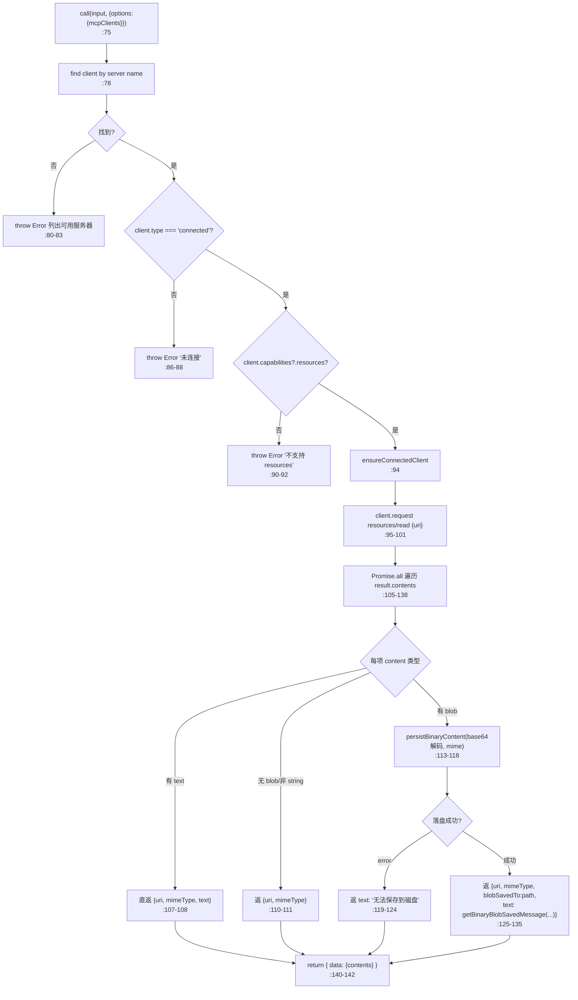
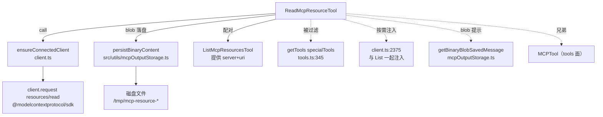

# ReadMcpResourceTool 工具详解

> 这是 MCP 协议 resources 面的**读取工具**，与 `ListMcpResourcesTool` 配对。给定 `server` + `uri`，它调 MCP 协议的 `resources/read` 拉资源内容。它的核心亮点是**二进制 blob 落盘拦截**（`:103-138`）：MCP resource 可能返回 base64 编码的二进制（图片、PDF、音频），如果直接序列化进上下文会瞬间撑爆 token。本工具拦截所有 blob，解码后按 MIME 推导扩展名写入磁盘，用文件路径替换 base64——把潜在的上下文炸弹转成一行路径文本。和 `ListMcpResourcesTool` 一样，它也是被 `getTools()` 过滤、由 `client.ts` 按需注入的特殊内部工具。

---

## 一、工具定位（一句话总结）

**`ReadMcpResourceTool` = 按 server+uri 读取单个 MCP resource 的只读工具，含 blob 落盘保护。**

| 维度 | 值 |
|---|---|
| 工具名 | `'ReadMcpResourceTool'`（`ReadMcpResourceTool.ts:60`，字面量） |
| 一句话 | 从指定 MCP 服务器读取指定 URI 的 resource，blob 落盘保护 |
| 是否进 system prompt | ⚠️ **特殊**：在 `getAllBaseTools()`（`tools.ts:276`），被 `getTools()` 的 `specialTools` 过滤（`tools.ts:345`），由 `client.ts:2375` 按需注入 |
| 只读 / 破坏性 | **只读**（`isReadOnly: () => true`，`:53`） |
| 是否可并发 | ✅ **可并发**（`isConcurrencySafe: () => true`，`:51`） |
| 是否延迟 | ✅ `shouldDefer: true`（`:59`） |
| 核心依赖 | `client.ts` 的 `ensureConnectedClient`；`mcpOutputStorage` 的 `persistBinaryContent` |
| 兄弟工具 | `ListMcpResourcesTool`（列出 resources）、`MCPTool`（tools 面） |

**为什么需要它？** 列出 resources 只是第一步，模型要真正消费资源内容（读文档、查 schema、看配置）必须有读取工具。它和 `ListMcpResourcesTool` 构成标准两步检索：list 拿 uri → read 拿内容。没有它，resources 面就只是"可见不可用"的摆设。

---

## 二、关键文件清单

```
ReadMcpResourceTool/
├── ReadMcpResourceTool.ts ← buildTool({...}) 主体（158 行），含 blob 落盘逻辑
├── prompt.ts              ← DESCRIPTION + PROMPT（无工具名常量导出，字面量）
└── UI.tsx                 ← Ink 渲染 + userFacingName 导出
```

| 文件 | 角色 | 必看行号 |
|---|---|---|
| `ReadMcpResourceTool.ts` | 主体：schema + call() + blob 落盘 + mapToolResult | `buildTool:49`、`call:75`、blob 拦截 `:103-138`、`mapToolResultToToolResultBlockParam:150` |
| `prompt.ts` | 描述（含参数说明 + 用法示例） | `DESCRIPTION:1-8`、`PROMPT:10-16` |
| `UI.tsx` | 渲染 + `userFacingName` 导出 | `renderToolUseMessage:11`、`userFacingName:18`、`renderToolResultMessage:22` |
| `src/tools.ts` | 过滤逻辑（specialTools） | `:345`（过滤）、`:276`（注册） |
| `src/services/mcp/client.ts` | 按需注入（与 List 配套） | `:2375`（注入） |
| `src/utils/mcpOutputStorage.ts` | `persistBinaryContent` + `getBinaryBlobSavedMessage` | blob 落盘 + 提示消息生成 |

> **结构特点**：标准三文件，但 `call()` 是这批资源工具里逻辑最复杂的——主要是 blob 落盘分支多。它没有独立的 `checkPermissions`（走默认权限管道）。

---

## 三、Tool 接口字段实现（`buildTool` 逐字段）

### 标识字段

```ts
name: 'ReadMcpResourceTool',                  // :60（字面量，prompt.ts 没导出常量）
searchHint: '按 URI 读取特定 MCP 资源',       // :61
maxResultSizeChars: 100_000,                  // :62
shouldDefer: true,                            // :59
userFacingName,                               // UI.tsx:18 → 'readMcpResource'
```

> **工具名是字面量而非常量导出**：与 `ListMcpResourcesTool`（导出 `LIST_MCP_RESOURCES_TOOL_NAME`）不同，这里直接写 `'ReadMcpResourceTool'`。`tools.ts:345` 的过滤也用字面量 `.name` 对比——保持一致即可。

### 模型面字段

```ts
async description() { return DESCRIPTION },  // :63
async prompt()      { return PROMPT },        // :66
get inputSchema()   { return inputSchema() }, // :69
get outputSchema()  { return outputSchema() },// :72
```

**输入 schema**（`:22-27`）：
```ts
{
  server: string,  // 必填，MCP 服务器名
  uri:    string,  // 必填，资源 URI（来自 ListMcpResourcesTool）
}
```

**输出 schema**（`:30-44`）：
```ts
{
  contents: Array<{
    uri: string,
    mimeType?: string,
    text?: string,          // 文本内容 或 落盘提示消息
    blobSavedTo?: string,   // 二进制落盘路径（仅 blob 分支）
  }>
}
```

### 行为字段

| 字段 | 实现 | 说明 |
|---|---|---|
| `call()` | `:75-143` | 核心逻辑（见下节），含 blob 落盘 |
| `isConcurrencySafe()` | `:51` → `true` | 并发读不同 resource 安全 |
| `isReadOnly()` | `:53` → `true` | 纯读（blob 落盘是缓存，不改 server 状态） |
| `toAutoClassifierInput(input)` | `:56` → `${input.server} ${input.uri}` | 自动审批分类器输入 |
| `isResultTruncated(output)` | `:147` | 基于 JSON 序列化长度判截断 |
| `mapToolResultToToolResultBlockParam` | `:150-156` | 直接 JSON 序列化 |

### 渲染字段

```ts
renderToolUseMessage,      // UI.tsx:11 → '从服务器 X 读取资源 "uri"'
userFacingName,            // UI.tsx:18 → 'readMcpResource'
renderToolResultMessage,   // UI.tsx:22 → 空/有内容两路，pretty JSON
```

---

## 四、核心执行流程：`call()`

`call()`（`:75-143`）拉取 resource 内容，并对每个 content block 做分支处理（text 直返、blob 落盘）。



**关键点逐条**：

1. **三级前置校验**（`:78-92`）：
   - 找不到 server 名 → 抛错列出可用服务器（`:80-83`，帮模型纠正）。
   - server 未连接（`client.type !== 'connected'`）→ 抛错（`:86-88`）。
   - server 不支持 resources（`!client.capabilities?.resources`）→ 抛错（`:90-92`）。
   
   三级校验逐层收窄，每层都有面向模型的友好错误消息。

2. **直接调 MCP 协议**（`:95-101`）：用 `connectedClient.client.request({method:'resources/read', params:{uri}}, ReadResourceResultSchema)`。注意它**不走** `MCPTool` 的 `call()` 模板——本工具是独立工具，直接持 MCP SDK 的 client 引用。

3. **`ensureConnectedClient`**（`:94`）：与 ListMcpResourcesTool 一样，确保连接健康（`onclose` 后返回新连接）。

4. **blob 落盘拦截**（`:103-138`）——**最关键的逻辑**：
   - **text 分支**（`:107-108`）：content 带 `text` 字段，直返。
   - **无效 blob 分支**（`:110-111`）：无 `blob` 或 `blob` 非 string，返最小 `{uri, mimeType}`。
   - **blob 分支**（`:113-118`）：调 `persistBinaryContent(Buffer.from(blob, 'base64'), mimeType, persistId)`，把解码后的字节按 MIME 推导的扩展名写入磁盘。
   - **落盘失败**（`:119-124`）：返 `text: '二进制内容无法保存到磁盘：<error>'`，不抛出。
   - **落盘成功**（`:125-135`）：返 `blobSavedTo: filepath` + `text: getBinaryBlobSavedMessage(filepath, mime, size, '[Resource from ...]')`——text 是给模型看的"已保存到 X，类型 Y，大小 Z"提示。

5. **`persistId` 唯一性**（`:113`）：`mcp-resource-${Date.now()}-${i}-${Math.random().toString(36).slice(2,8)}`——时间戳 + 索引 + 随机后缀，防并发调用落盘冲突。

6. **返回结构**（`:140-142`）：`{ data: { contents } }`——contents 是处理后的数组，每个元素已把 blob 替换成路径提示。

### `mapToolResultToToolResultBlockParam`（`:150-156`）

```ts
content: jsonStringify(content)
```

直接 JSON 序列化整个 `{contents}`。模型看到的是结构化 JSON（含 text 提示或 blobSavedTo 路径）。**没有空结果特殊提示**（与 ListMcpResourcesTool 不同）——空 contents 由 `call()` 的校验层保证不会到达此处（找不到 server / 未连接 / 不支持都会先抛错）。

---

## 五、权限与安全

ReadMcpResourceTool **没有定义 `checkPermissions`**——走默认权限管道。但因为读取内容可能涉及敏感数据，实际调用会经用户确认（除非用户配了 allow 规则）。

**安全特性**：

1. **blob 落盘保护**（**核心安全设计**，`:103-138`）：
   - **问题**：MCP resource 可返回任意大的 base64 二进制（PDF、图片、音频）。直接序列化进 `tool_result` 会瞬间撑爆上下文（一个 1MB PDF 的 base64 约 1.3M 字符 ≈ 30 万 token）。
   - **方案**：拦截所有 blob，解码后写磁盘，用路径替换。模型只看到"已保存到 /tmp/xxx.pdf，类型 application/pdf，大小 1.2MB"——一行文本。
   - **意义**：把潜在的上下文炸弹转成可管理的文件路径。模型若需进一步处理可再用 Read/FileRead 工具读路径（或交给其他工具）。

2. **三级前置校验**（`:78-92`）：防无效调用——找不到 server / 未连接 / 不支持 resources 都先抛错，不发起无意义的 `resources/read` 请求。

3. **纯只读标记**（`isReadOnly: true`）：虽然落盘写文件，但那是缓存产物，不改 server 状态。标记为只读让调度器能并发执行、自动审批。

4. **落盘失败降级**（`:119-124`）：写盘失败不抛出，返友好错误文本——保证工具可用性（磁盘满等场景不至于让整个 read 崩溃）。

5. **依赖 MCP 协议授权**：本工具只能读 server 主动暴露的 resource URI，不能越权访问未暴露的资源。

---

## 六、与其他系统/工具的关系



- **与 `ListMcpResourcesTool` 的关系**：配对工具。List 返回 `{uri, server, ...}`，Read 消费 `{server, uri}`。标准两步检索：list 探路 → read 取内容。模型通常先调 List 拿到候选 URI，再调 Read 读具体内容。

- **与 `MCPTool` 的关系**：兄弟工具，覆盖 MCP 协议不同面。注意 ReadMcpResourceTool **不经过** MCPTool 的 `call()` 模板——它是独立工具，直接持 SDK client 引用调 `resources/read`。它也没有 `isMcp: true` 标记（因为它不是 tools 面的工具实例）。

- **与 `mcpOutputStorage`（`src/utils/mcpOutputStorage.ts`）的关系**：核心依赖。
  - `persistBinaryContent(buffer, mime, id)`——把字节写磁盘，按 MIME 推导扩展名。
  - `getBinaryBlobSavedMessage(filepath, mime, size, prefix)`——生成给模型看的"已保存到 X"提示文本。
  - 这两个函数也被 MCPTool 的渲染层（`UI.tsx`）复用，处理 MCP tool 返回的 blob——统一的二进制处理管道。

- **与 `tools.ts` 注册/过滤的关系**（同 ListMcpResourcesTool）：
  - 注册在 `getAllBaseTools()`（`:276`）。
  - 过滤在 `getTools()` 的 `specialTools` set（`:345`）。
  - 注入在 `getMcpToolsCommandsAndResources`（`client.ts:2375`），与 ListMcpResourcesTool 一起、当首个 supportsResources server 出现时追加。

- **与文件读取工具链的关系**：blob 落盘后，模型若需查看文本内容可用 `FileReadTool` 读 `blobSavedTo` 路径。形成"MCP resource → 落盘 → 文件读取"的跨工具数据流。

---

## 七、亮点与设计取舍

1. **blob 落盘拦截**（`:103-138`）——**最大亮点**：把潜在的上下文炸弹（base64 二进制）转成文件路径。这是处理异构 MCP resource 输出的工程化方案——不假设 resource 是文本，不强撑上下文，优雅降级到文件系统。

2. **三级前置校验**（`:78-92`）：逐层收窄（server 存在 → 已连接 → 支持 resources），每层给模型可操作的错误消息（列出可用服务器名等）。防止无效请求消耗网络往返。

3. **落盘失败降级**（`:119-124`）：写盘失败返友好文本而非抛出——保证工具在磁盘满/权限不足等异常下仍可用（至少告诉模型发生了什么）。

4. **`persistId` 防并发冲突**（`:113`）：时间戳 + 索引 + 随机后缀。并发读多个 blob 不会因文件名碰撞互相覆盖。

5. **直接持 SDK client**（不走 MCPTool 模板）：resources 面的工具不需要 MCPTool 的进度协议/passthrough 权限骨架那套（那是给 tools/call 用的）。直接简洁地 request → 处理 → 返回。

6. **统一的 blob 处理管道**（`mcpOutputStorage`）：ReadMcpResourceTool 和 MCPTool 渲染层共用 `persistBinaryContent` / `getBinaryBlobSavedMessage`。避免两套二进制处理逻辑分叉。

7. **"注册-过滤-按需注入"三段式**（同 ListMcpResourcesTool）：保证没有 resources 服务器时这两个工具不污染工具池。

8. **`shouldDefer: true`**（`:59`）：延迟工具。resource 读取是低频操作，不进初始 system prompt 省 token。

---

## 八、源码导航（书签速查）

| 想看什么 | 去哪里 |
|---|---|
| `buildTool` 主体 | `ReadMcpResourceTool/ReadMcpResourceTool.ts:49-157` |
| 描述（含参数说明） | `ReadMcpResourceTool/prompt.ts:1-16` |
| `call()` 主体 | `ReadMcpResourceTool.ts:75-143` |
| 三级前置校验 | `ReadMcpResourceTool.ts:78-92` |
| **blob 落盘拦截** | `ReadMcpResourceTool.ts:103-138` |
| `persistBinaryContent` 调用 | `ReadMcpResourceTool.ts:114-118` |
| 落盘提示消息 | `ReadMcpResourceTool.ts:130-135` |
| 输入/输出 schema | `ReadMcpResourceTool.ts:22-44` |
| **过滤逻辑**（specialTools） | `src/tools.ts:343-349` |
| **按需注入** | `src/services/mcp/client.ts:2372-2376` |
| blob 落盘实现 | `src/utils/mcpOutputStorage.ts:persistBinaryContent` |
| 落盘提示生成 | `src/utils/mcpOutputStorage.ts:getBinaryBlobSavedMessage` |
| 渲染 + userFacingName | `ReadMcpResourceTool/UI.tsx:11,18,22` |

---

## 九、学习建议与验证清单

**怎么读这章**：先看"一、工具定位"理解它与 List 的配对关系，再跳到"四、call()"重点看 **blob 落盘拦截**（`:103-138`）——这是它最核心的工程亮点。三级前置校验（`:78-92`）也值得留意，是防御性编程的好例子。最后理解它和 List 共享的"注册-过滤-按需注入"特殊性（同 ListMcpResourcesTool 单篇）。

**验证清单（读完自测）**：
- [ ] 能说出 ReadMcpResourceTool 与 ListMcpResourcesTool 的配对关系（list 提供 uri+server，read 消费）
- [ ] 能解释为什么 blob 要落盘（base64 二进制会撑爆上下文，转成路径文本）
- [ ] 能指出三级前置校验的顺序（server 存在 → 已连接 → 支持 resources）
- [ ] 能说出落盘失败时的行为（返友好文本，不抛出）
- [ ] 能解释 `persistId` 的构成（时间戳+索引+随机，防并发冲突）
- [ ] 能指出它与 `mcpOutputStorage` 的关系（`persistBinaryContent` + `getBinaryBlobSavedMessage`）
- [ ] 能说出它为什么不经过 MCPTool 的 `call()` 模板（resources 面独立工具，直接持 SDK client）
- [ ] 能找到它与 List 一起被注入的条件（`client.ts:2375`，supportsResources 时）

**配合动作**：
1. 装一个返回二进制 resource 的 MCP 服务器（如返回图片），调用 ReadMcpResourceTool，观察 `blobSavedTo` 路径和 `text` 提示消息
2. 在 `:114` 的 `persistBinaryContent` 处加日志，观察传入的 buffer 大小和 MIME
3. 故意传一个不存在的 server 名，验证三级校验第一层抛错并列出可用服务器
4. 对比一个返回 text 的 resource 和返回 blob 的 resource，观察 contents 数组里两种元素的字段差异（text vs blobSavedTo）
