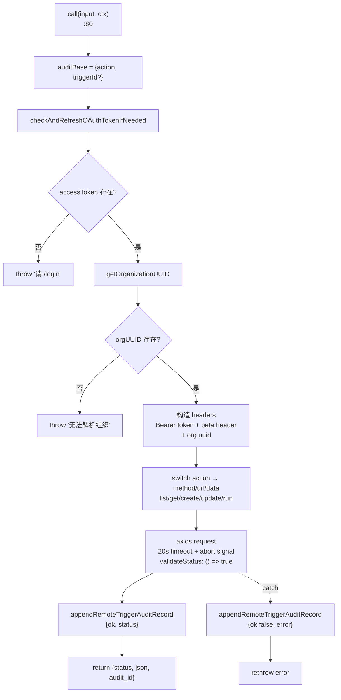
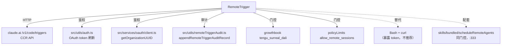

# RemoteTrigger 工具详解

> `RemoteTrigger` 是 Claude Code 与 claude.ai 远程触发器（CCR, Claude Code Remote）API 对接的工具。它支持对"计划内远程 agent 触发器"的 list/get/create/update/run 五种操作。核心设计亮点：**OAuth token 在进程内自动注入，永不到达 shell**——这是相对 `curl` 的关键安全优势。每次调用（无论成功失败）都写审计记录。属于"中等复杂度"的网络型工具。

---

## 一、工具定位（一句话总结）

**`RemoteTrigger` = 进程内调用 claude.ai CCR API 管理远程触发器的网络工具。**

| 维度 | 值 |
|---|---|
| 工具名 | `RemoteTrigger`（常量 `REMOTE_TRIGGER_TOOL_NAME`，`prompt.ts:1`） |
| 一句话 | list/get/create/update/run 远程触发器，token 进程内注入 + 全程审计 |
| 是否进 system prompt | ❌ 受 feature flag `AGENT_TRIGGERS_REMOTE` 门控（`tools.ts:39`） |
| 只读 / 破坏性 | **动态**——`list`/`get` 只读，`create`/`update`/`run` 写入（`:68-70`） |
| 是否可并发 | ✅ **可并发**（`isConcurrencySafe() → true`，`:65`） |
| 启用条件 | `getFeatureValue('tengu_surreal_dali') && isPolicyAllowed('allow_remote_sessions')`（`:59-64`） |
| 核心依赖 | axios、OAuth（`src/utils/auth.ts`）、`appendRemoteTriggerAuditRecord` |
| 定位互补方 | `Bash`（curl 替代品，但暴露 token） |

**为什么需要它？** claude.ai 提供"远程触发器"功能——可以计划在远端启动一个 Claude Code agent 执行任务。管理这些触发器需要调 API。模型**本可以用 Bash + curl**，但那会把 OAuth token 暴露给 shell 历史/进程列表。RemoteTrigger 在进程内注入 token，并提供统一审计，是安全合规的官方路径。

---

## 二、关键文件清单

```
RemoteTriggerTool/
├── RemoteTriggerTool.ts   ← buildTool({...}) 主体（182 行），call() 含 HTTP + 审计
├── prompt.ts              ← 工具名 + DESCRIPTION + PROMPT（API 路径说明）
├── UI.tsx                 ← renderToolUseMessage + renderToolResultMessage
└── __tests__/
    └── RemoteTriggerTool.test.ts   ← 审计记录单测
```

| 文件 | 角色 | 必看行号 |
|---|---|---|
| `RemoteTriggerTool.ts` | 工具主体：schema + call（HTTP+审计）+ 结果映射 | `buildTool:48`、`call:80`、HTTP 分派 `:111-140`、审计 `:151-171` |
| `prompt.ts` | 工具名 + 描述 + API 操作说明 | `REMOTE_TRIGGER_TOOL_NAME:1`、`DESCRIPTION:3`、`PROMPT:6` |
| `UI.tsx` | 渲染（显示 action + HTTP 状态 + 行数） | `renderToolResultMessage:11` |
| `__tests__/...test.ts` | 审计记录单测（成功/失败两路径） | `:79-114` |

> **结构特点**：标准三文件（主体 + prompt + UI）+ 测试。`prompt.ts` 同时承载工具名常量、DESCRIPTION、PROMPT 三者——与 TeamCreate 拆 `constants.ts` 不同，这里合并因为内容紧密相关。

---

## 三、Tool 接口字段实现（`buildTool` 逐字段）

### 标识字段

```ts
name: REMOTE_TRIGGER_TOOL_NAME,    // "RemoteTrigger"
searchHint: 'manage scheduled remote agent triggers',
maxResultSizeChars: 100_000,
shouldDefer: true,                 // 延迟工具
```

### 模型面字段

```ts
async description() { return DESCRIPTION }
async prompt()      { return PROMPT }
get inputSchema()  { return inputSchema() }
get outputSchema() { return outputSchema() }   // 显式 outputSchema
```

**输入 schema**（`:19-32`）：
```ts
{
  action: 'list'|'get'|'create'|'update'|'run',  // 必填，操作类型
  trigger_id?: string,    // get/update/run 必需，正则 /^[\w-]+$/
  body?: Record<string, unknown>,  // create/update 的 JSON body
}
```

> **`trigger_id` 正则约束**（`:24`）：`/^[\w-]+$/`——只允许字母数字下划线和连字符，防止路径注入（trigger_id 会拼进 URL）。

**输出 schema**（`:36-43`）：
```ts
{
  status: number,         // HTTP 状态码
  json: string,           // API 返回的原始 JSON（字符串化）
  audit_id?: string,      // 审计记录 ID
}
```

### 行为字段

| 字段 | 实现 | 说明 |
|---|---|---|
| `call()` | `:80` | HTTP 请求 + 审计（见下节） |
| `isEnabled()` | `:59` | **双重门控**：growthbook flag + policy |
| `isConcurrencySafe()` | `:65` → `true` | HTTP 请求可并发 |
| `isReadOnly(input)` | `:68` | **动态**：`list`/`get` 只读，其余写入 |
| `toAutoClassifierInput(input)` | `:71` | `RemoteTrigger {action} {trigger_id}` |
| `mapToolResultToToolResultBlockParam` | `:173` | `HTTP {status}\n{json}` |
| `renderToolUseMessage` | `UI.tsx:7` | 显示 `action trigger_id` |
| `renderToolResultMessage` | `UI.tsx:11` | 显示 `HTTP {status} ({lines} 行)` |

> **亮点字段**：
> - **`isEnabled()` 双重门控**（`:59-64`）：`getFeatureValue_CACHED_MAY_BE_STALE('tengu_surreal_dali', false) && isPolicyAllowed('allow_remote_sessions')`——growthbook 功能灰度 + 组织策略限制，两层都要过。
> - **动态 `isReadOnly(input)`**（`:68-70`）：根据 `action` 判断只读性——这是少数让 `isReadOnly` 依赖输入的工具（多数是常量布尔）。

---

## 四、核心执行流程：`call()`

`call()`（`RemoteTriggerTool.ts:80-172`）是标准的"鉴权 → 构造请求 → 发送 → 审计"流程：



**关键点逐条**：

1. **审计基座**（`:81-84`）：`auditBase = { action, ...(trigger_id ? {triggerId} : {}) }`——每次调用先构造审计基座，无论后续成功失败都记录。
2. **OAuth 刷新**（`:86`）：`checkAndRefreshOAuthTokenIfNeeded()` 确保 token 有效（可能自动刷新）。
3. **token 存在性检查**（`:87-92`）：无 token 抛"请运行 /login"——友好引导而非裸错误。
4. **组织 UUID 解析**（`:93-96`）：`getOrganizationUUID()` 从 OAuth 客户端获取，作为 `x-organization-uuid` header。
5. **请求头构造**（`:99-105`）：含 `Authorization: Bearer {token}`、`anthropic-version`、`anthropic-beta: ccr-triggers-2026-01-30`（`:46`，触发器 beta 标识）、`x-organization-uuid`。**token 在进程内注入，永不到达 shell**。
6. **action 分派**（`:111-140`）：switch 映射 action → HTTP method + URL + data：
   - `list` → GET `/v1/code/triggers`
   - `get` → GET `/v1/code/triggers/{id}`（需 trigger_id）
   - `create` → POST `/v1/code/triggers`（需 body）
   - `update` → POST `/v1/code/triggers/{id}`（需 trigger_id + body）
   - `run` → POST `/v1/code/triggers/{id}/run`（需 trigger_id，data 为空对象）
   - 每种操作的必需参数缺失立即抛错（如 `:117` `get 操作需要 trigger_id`）。
7. **axios 请求**（`:142-150`）：`timeout: 20_000`、`signal: context.abortController.signal`（支持中断）、`validateStatus: () => true`（**不因 4xx/5xx 抛错**，把状态码原样返回——让调用方判断）。
8. **成功审计**（`:151-155`）：`appendRemoteTriggerAuditRecord({...auditBase, ok: status>=200 && <300, status})`，返回 `auditId`。
9. **失败审计 + 重抛**（`:164-171`）：catch 块记录 `{ok:false, error}` 后 `throw error`——**审计先于重抛**，保证失败也有记录。测试 `:98-113` 验证此路径。
10. **返回**（`:157-163`）：`{status, json: jsonStringify(res.data), audit_id}`。

---

## 五、权限与安全

RemoteTrigger 的安全设计是本系列的标杆：

1. **`isEnabled()` 双重门控**（`:59-64`）：growthbook flag `tengu_surreal_dali` + policy `allow_remote_sessions`。前者控制功能灰度，后者控制组织级权限（`policyLimits/index.ts`）。`src/commands/remote-env/index.ts:10` 显示 remote-env 命令也用同样的门控。
2. **进程内 token 注入**（`:99-105`）：OAuth token 在 Node.js 进程内组装到 header，**永不经 shell**。对比 `curl -H "Authorization: Bearer xxx"`，token 会进 shell 历史/进程参数。PROMPT（`prompt.ts:6`）明确强调此优势。
3. **`trigger_id` 正则约束**（`:24`）：`/^[\w-]+$/` 防止路径注入（trigger_id 拼进 URL）。
4. **全程审计**（`:151-171`）：每次调用（成功/失败）都写 `appendRemoteTriggerAuditRecord`，含 action、triggerId、ok、status/error。失败时**审计先于重抛**。
5. **`validateStatus: () => true`**（`:149`）：不因 HTTP 状态码抛错——让调用方根据 `status` 字段决策，避免 4xx/5xx 被误判为工具崩溃。
6. **OAuth 自动刷新**（`:86`）：`checkAndRefreshOAuthTokenIfNeeded` 处理 token 过期，避免手动重新登录。
7. **`isReadOnly` 动态判定**（`:68-70`）：`list`/`get` 标记为只读，权限管道宽松；`create`/`update`/`run` 标记为写入，走更严格审批。

---

## 六、与其他系统/工具的关系



- **与 CCR API**：调用 claude.ai 的 `/v1/code/triggers` 端点，beta header `ccr-triggers-2026-01-30`（`:46`）。这是 Claude Code Remote 触发器系统的管理接口。
- **与 OAuth 系统**：依赖 `src/utils/auth.ts`（token 刷新）和 `src/services/oauth/client.ts`（组织 UUID）。完整的 OAuth 流程在进程内闭环。
- **与审计系统**：`src/utils/remoteTriggerAudit.ts` 的 `appendRemoteTriggerAuditRecord` 持久化每次调用记录，支持事后追溯。
- **与 growthbook/policy**：双重门控与 `skills/bundled/scheduleRemoteAgents.ts:333-334` 共享同一条件——skill 和工具用同一套启用逻辑。
- **与 `Bash`**：功能上可被 curl 替代，但安全上 RemoteTrigger 是官方推荐路径（PROMPT 明确："请使用本工具而非 curl"）。

---

## 七、亮点与设计取舍

1. **进程内 token 注入**（`:99-105`）：本工具最核心的安全卖点。PROMPT 把它作为首要宣传点——"OAuth token 会在进程内自动添加，且永不会暴露"。
2. **双重门控 `isEnabled()`**（`:59-64`）：growthbook（功能灰度）+ policy（组织权限），两层独立，任一关闭即禁用。这是对敏感远程操作的标准防护。
3. **动态 `isReadOnly(input)`**（`:68-70`）：根据 action 区分只读/写入，让权限管道能对 `run`/`create` 等危险操作更严格。这是工具接口设计的细致之处。
4. **`validateStatus: () => true`**（`:149`）：不因 HTTP 状态抛错，把 4xx/5xx 作为正常返回——让模型看到完整的 API 响应（含错误信息），而非被工具层吞掉。
5. **审计先于重抛**（`:164-171`）：catch 块先写审计再 throw，保证网络异常/鉴权失败也有记录。测试专门验证此路径（`:98-113`）。
6. **`trigger_id` 正则防注入**（`:24`）：`/^[\w-]+$/` 简单有效，防止 trigger_id 被构造成路径穿越或额外路径段。
7. **`shouldDefer: true`**：远程触发器是低频功能，延迟加载避免每个会话都加载 OAuth/审计依赖。
8. **20s 超时 + abort signal**（`:147-148`）：网络请求标配，支持用户 ESC 中断。

---

## 八、源码导航（书签速查）

| 想看什么 | 去哪里 |
|---|---|
| 工具名 + 描述 + PROMPT | `RemoteTriggerTool/prompt.ts:1,3,6` |
| `buildTool` 字段填充 | `RemoteTriggerTool/RemoteTriggerTool.ts:48-182` |
| 输入 schema（含 trigger_id 正则） | `RemoteTriggerTool.ts:19-32` |
| 输出 schema | `RemoteTriggerTool.ts:36-43` |
| `call()` HTTP + 审计 | `RemoteTriggerTool.ts:80-172` |
| action → method/url 分派 | `RemoteTriggerTool.ts:111-140` |
| 双重门控 isEnabled | `RemoteTriggerTool.ts:59-64` |
| 审计记录 | `RemoteTriggerTool.ts:151-171` |
| beta header 常量 | `RemoteTriggerTool.ts:46` |
| 审计单测 | `RemoteTriggerTool/__tests__/RemoteTriggerTool.test.ts:79-114` |
| feature flag 注册 | `src/tools.ts:39-42` |

---

## 九、学习建议与验证清单

**怎么读这章**：先看"一、定位"理解 RemoteTrigger 是 curl 的安全替代品，再跳到"四、call()"的流程图理解鉴权→请求→审计三段式，最后对照"五、安全"体会进程内 token + 双重门控 + 全程审计的设计。

**验证清单（读完自测）**：
- [ ] 能说出 RemoteTrigger 相对 curl 的核心优势（进程内 token 注入）
- [ ] 能指出双重门控（growthbook `tengu_surreal_dali` + policy `allow_remote_sessions`）
- [ ] 能说出五种 action 对应的 HTTP method 和 URL（list/get/create/update/run）
- [ ] 能解释 `validateStatus: () => true` 的意义（不因 HTTP 状态抛错，让模型看完整响应）
- [ ] 能说出审计先于重抛的设计（catch 块先写审计再 throw）
- [ ] 能解释动态 `isReadOnly(input)`（list/get 只读，其余写入）
- [ ] 能指出 `trigger_id` 正则 `/^[\w-]+$/` 的防注入作用

**配合动作**：
1. 运行 `RemoteTriggerTool.test.ts`（`bun test .../RemoteTriggerTool.test.ts`），观察审计记录两路径
2. 读 `src/utils/remoteTriggerAudit.ts`，理解审计记录的持久化格式
3. 对比 `Bash` 工具，思考"为何对敏感 API 操作提供专用工具而非让模型用 curl"
