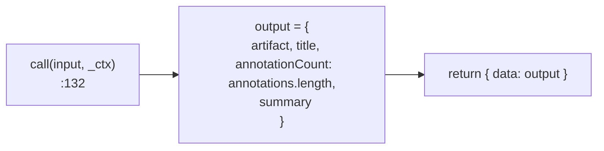
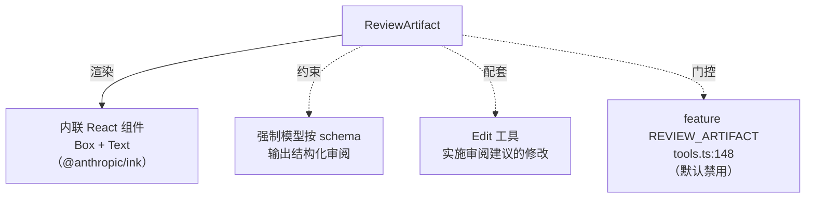

# ReviewArtifact 工具详解

> `ReviewArtifact` 是一个**纯展示型工具**：它不检索、不修改、不联网，唯一的职责是把 Claude 对一段代码/文档的审阅意见（含逐行标注和严重级别）以结构化方式呈现给用户。`call()` 体只是把输入回包成输出（`annotationCount: annotations.length`）。它的价值全部在 schema 契约和渲染层——强制模型用"标题 + 产出物 + 标注列表 + 总结"的规范格式表达审阅，而非散漫的自然语言。

---

## 一、工具定位（一句话总结）

**`ReviewArtifact` = 结构化呈现代码/文档审阅结果的纯展示工具。**

| 维度 | 值 |
|---|---|
| 工具名 | `ReviewArtifact`（常量 `REVIEW_ARTIFACT_TOOL_NAME`，`:7`） |
| 一句话 | 接收产出物 + 标注列表，回包输出用于结构化渲染 |
| 是否进 system prompt | ❌ 受 feature flag `REVIEW_ARTIFACT` 门控（`tools.ts:148`），默认禁用 |
| 只读 / 破坏性 | **只读**（`isReadOnly() → true`，`:80`）——无任何副作用 |
| 是否可并发 | ✅ **可并发**（`isConcurrencySafe() → true`，`:77`） |
| 启用条件 | `feature('REVIEW_ARTIFACT')` 为真才注册（`tools.ts:148-151`） |
| 核心依赖 | 无（纯数据搬运） |
| 定位互补方 | `Edit`（实施修改）、`AskUserQuestion`（交互） |

**为什么需要它？** 审阅代码时，模型可以用纯文本罗列问题，但缺乏结构——无法精确指向某一行、无法区分严重级别、无法给出总结。ReviewArtifact 强制模型按 `{artifact, title, annotations[], summary}` 契约输出，渲染层就能展示带行号高亮、严重级别图标的审阅视图。它是"用工具 schema 约束模型输出格式"的典型案例。

> **注意**：CLAUDE.md 明确 `REVIEW_ARTIFACT` 在 build features 的"已禁用"列表中，故默认环境下该工具不注册。

---

## 二、关键文件清单

```
ReviewArtifactTool/
└── ReviewArtifactTool.ts   ← 全部逻辑（141 行，单文件，含 React 渲染）
```

| 文件 | 角色 | 必看行号 |
|---|---|---|
| `ReviewArtifactTool.ts` | 工具主体：schema + call + 内联 React 渲染全在这 | `buildTool:58`、`call:132`、inputSchema `:12-43`、outputSchema `:46-53`、渲染 `:96-131` |

> **结构特点**：单文件，且**渲染逻辑（React 组件）内联在主文件**，没有独立的 `UI.tsx`。这是因为渲染逻辑简单（一个 Box + 几个 Text），不值得拆分。对比 GlobTool 复用 Grep 的 UI 组件，ReviewArtifact 的 UI 是自包含的。

---

## 三、Tool 接口字段实现（`buildTool` 逐字段）

### 标识字段

```ts
name: REVIEW_ARTIFACT_TOOL_NAME,    // "ReviewArtifact"（内联，:7）
searchHint: 'review code or documents with inline annotations',
maxResultSizeChars: 100_000,
```

> **无 `shouldDefer`、无 `strict`**：与 SubscribePR/SuggestBackgroundPR 不同，ReviewArtifact 既未声明延迟也未声明严格模式。

### 模型面字段

```ts
async description(input) {                    // 注意：description 接收 input！
  return input.title
    ? `Claude 想要审阅：${input.title}`
    : 'Claude 想要审阅一个产出物'
}
async prompt() { return `使用本工具呈现对代码片段...的审阅结果...` }
get inputSchema()  { return inputSchema() }
get outputSchema() { return outputSchema() }  // 有显式 outputSchema
```

**输入 schema**（`:12-43`）：
```ts
{
  artifact: string,          // 必填，待审阅内容
  title?: string,            // 可选，标题/文件路径
  annotations: [{            // 必填，标注列表
    line?: number,           //   行号（1-based）
    message: string,         //   标注消息
    severity?: 'info'|'warning'|'error'|'suggestion',
  }],
  summary?: string,          // 可选，总体总结
}
```

**输出 schema**（`:46-53`）——有显式 `outputSchema`，这是少数工具才有的：
```ts
{
  artifact: string,
  title?: string,
  annotationCount: number,   // = annotations.length
  summary?: string,
}
```

### 行为字段

| 字段 | 实现 | 说明 |
|---|---|---|
| `call()` | `:132` | 纯数据搬运（见下节） |
| `isConcurrencySafe()` | `:77` → `true` | 无副作用 |
| `isReadOnly()` | `:80` → `true` | 纯展示 |
| `toAutoClassifierInput()` | `:83` | `input.title ?? input.artifact.slice(0, 200)` |
| `description(input)` | `:62` | **动态描述**，根据 title 变化 |
| `renderToolUseMessage` | `:96` | verbose 模式显示标注数 |
| `renderToolResultMessage` | `:107` | 内联 React，verbose 模式展示标题+总结 |
| `mapToolResultToToolResultBlockParam` | `:89` | 文本：`已完成审阅，共 N 条标注` |

> **亮点字段**：
> - `description(input)` 是**动态描述**——少数工具会让 description 依赖输入（多数是常量）。
> - 显式 `outputSchema`——大部分工具只有 inputSchema，ReviewArtifact 双 schema 齐全，便于序列化/UI 推导。

---

## 四、核心执行流程：`call()`

`call()`（`ReviewArtifactTool.ts:132-140`）是本系列中最纯粹的"数据搬运"：

```ts
async call({ artifact, title, annotations, summary }, _context) {
  const output: Output = {
    artifact,
    title,
    annotationCount: annotations.length,  // 唯一计算
    summary,
  }
  return { data: output }
}
```



**关键点**：

1. **无任何外部调用**：不读文件、不联网、不查状态。纯输入到输出的映射。
2. **唯一计算**：`annotationCount: annotations.length`——把标注数组转为计数，因为输出 schema 不保留完整 annotations（只保留计数），完整标注在渲染层通过 input 已知。
3. **`_context` 未使用**：连 `abortController` 都不需要——没有可中断的操作。
4. **解构入参**：`{ artifact, title, annotations, summary }` 直接解构，比 `input.xxx` 简洁。

> **为何 call 这么简单？** 因为 ReviewArtifact 的全部价值在**契约约束**和**渲染呈现**，不在执行逻辑。模型调用这个工具，意味着它承诺按 schema 输出结构化审阅；`call()` 只是确认契约被满足并回包。真正的"工作"在模型生成 `annotations` 时就完成了。

---

## 五、权限与安全

ReviewArtifact 没有自定义 `checkPermissions()`，安全控制极简：

1. **feature flag 门控**（`tools.ts:148-151`）：`feature('REVIEW_ARTIFACT')` 为真才注册。CLAUDE.md 明确该 flag 在"已禁用"列表，默认不注册。
2. **`isReadOnly() → true`**：纯展示，权限管道宽松。
3. **无副作用**：不接触文件系统、网络、状态——即使无权限校验也无风险。

> 由于是纯展示工具，权限模型几乎不适用。它不会修改任何东西，只是把模型的审阅意见结构化呈现。

---

## 六、与其他系统/工具的关系



- **与渲染系统**：使用 `@anthropic/ink` 的 `Box`/`Text` 组件（`:5`），内联在主文件。verbose 模式下展示标题、标注数、总结；非 verbose 模式只显示"审阅完成：N 条标注"。
- **与 `Edit`/`FileEditTool`**：审阅与修改是配套——ReviewArtifact 提出 `suggestion`/`warning` 标注，Edit 实施修改。但两者独立，模型可只审阅不修改。
- **与模型契约**：本工具的核心作用是**用 schema 约束模型输出格式**。没有它，模型可能用散漫文本描述审阅；有了它，模型被迫按 `{line, message, severity}` 结构组织意见。
- **与 `description(input)` 动态描述**：让工具调用在 UI 上显示"Claude 想要审阅：xxx"，比静态描述更直观。

---

## 七、亮点与设计取舍

1. **纯展示工具的范式**：call 体几乎空，价值全在 schema + 渲染。这示范了"工具不一定执行外部动作，约束模型输出格式本身就有价值"。
2. **动态 `description(input)`**（`:62`）：少数工具让 description 依赖输入，让 UI 反馈更具体。
3. **显式 `outputSchema`**（`:46-53`）：双 schema 齐全，便于 UI 推导渲染结构、便于序列化校验。
4. **`severity` 四级枚举**（`:32`）：`info/warning/error/suggestion`——区分审阅意见的轻重缓急，suggestion 是建设性建议（区别于 error 的强制性）。
5. **渲染内联而非拆 UI.tsx**（`:96-131`）：逻辑简单时不强行拆分，避免文件碎片化。用 `React.createElement` 而非 JSX（因 `.ts` 扩展名，非 `.tsx`）。
6. **`mapToolResultToToolResultBlockParam` 极简文本**（`:89`）：给模型看的只是"已完成审阅，共 N 条标注"——模型不需要看到完整标注（它自己生成的），只需确认工具调用成功。
7. **verbose/非 verbose 双模式渲染**（`:96-131`）：verbose 模式信息丰富（标题+标注数+总结），非 verbose 极简（一行计数），适应不同用户偏好。

---

## 八、源码导航（书签速查）

| 想看什么 | 去哪里 |
|---|---|
| 工具名 + 描述常量 | `ReviewArtifactTool/ReviewArtifactTool.ts:7,9` |
| `buildTool` 字段填充 | `ReviewArtifactTool.ts:58-141` |
| 输入 schema（含 severity 枚举） | `ReviewArtifactTool.ts:12-43` |
| 输出 schema | `ReviewArtifactTool.ts:46-53` |
| 纯搬运 `call()` | `ReviewArtifactTool.ts:132-140` |
| 动态 `description(input)` | `ReviewArtifactTool.ts:62-67` |
| 内联 React 渲染 | `ReviewArtifactTool.ts:96-131` |
| feature flag 门控 | `src/tools.ts:148-151` |

---

## 九、学习建议与验证清单

**怎么读这章**：把 ReviewArtifact 当作"纯展示型工具"的典范。重点不是 call（几乎没有），而是 schema 如何约束模型输出、渲染如何呈现结构化数据。

**验证清单（读完自测）**：
- [ ] 能说出 ReviewArtifact 的 call 体几乎空，价值在 schema + 渲染
- [ ] 能指出 feature flag 门控（`REVIEW_ARTIFACT`，默认禁用）
- [ ] 能说出 severity 的四种级别（info/warning/error/suggestion）
- [ ] 能解释动态 `description(input)` 的作用（UI 显示具体审阅目标）
- [ ] 能指出显式 `outputSchema` 的存在（多数工具只有 inputSchema）
- [ ] 能说出渲染逻辑为何内联而非拆 UI.tsx（逻辑简单，避免碎片化）

**配合动作**：
1. 设置 `FEATURE_REVIEW_ARTIFACT=1` 运行 dev 模式，观察工具出现
2. 调用 ReviewArtifact，传入一段代码 + 几条标注，观察 verbose/非 verbose 渲染差异
3. 对比 `Edit` 工具，理解"审阅（只读）→ 修改（写入）"的配套关系
