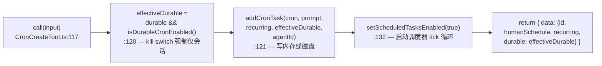
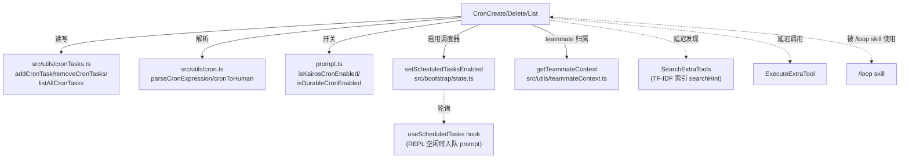

# ScheduleCronTool（CronCreate / CronDelete / CronList）工具详解

> 这是工具系统逐个拆解系列的调度类工具之一。`ScheduleCronTool` 是一个目录，里面装着**三个紧密关联的工具**——`CronCreate`（安排）、`CronDelete`（取消）、`CronList`（列出）——它们共用一套 `prompt.ts`（开关、常量、描述构造器）和 `UI.tsx`（渲染）。合在一起构成了 Claude Code 的"定时调度子系统"：把 prompt 在未来某个时间点（或周期性地）入队执行。这是 `/loop` 技能、proactive 自动化、teammate 协作的底层基础设施。

---

## 一、工具定位（一句话总结）

**`ScheduleCronTool` = 三个工具组成的 cron 调度三件套：创建 / 取消 / 列出未来要执行的 prompt。**

| 维度 | 值 |
|---|---|
| 工具名 | `CronCreate` / `CronDelete` / `CronList`（常量在 `prompt.ts:56-58`） |
| 一句话 | 用 5 字段 cron 表达式把 prompt 排到未来运行；支持一次性或周期性、会话级或磁盘持久化 |
| 是否进 system prompt | ❌ **三个工具都不在 `CORE_TOOLS` 白名单内**（`constants/tools.ts:137-179` 里没有 cron 工具）→ **是延迟工具**，走 SearchExtraTools → ExecuteExtraTool 两步式发现路径 |
| 注册条件（tools.ts） | `cronTools` 数组**无条件**展开（`tools.ts:31-38`、`:263`），但每个工具的 `isEnabled()` 受运行期开关 `isKairosCronEnabled()` 门控 |
| 运行期总开关 | `isKairosCronEnabled()`（`prompt.ts:35-37`）—— 默认 `true`，`CLAUDE_CODE_DISABLE_CRON=1` 可杀掉整个调度器 |
| 运行期持久化开关 | `isDurableCronEnabled()`（`prompt.ts:48-54`）—— GrowthBook `tengu_kairos_cron_durable`，默认 `true`，5 分钟刷新；关掉只强制 `durable: false`，不影响仅会话任务 |
| 只读 / 破坏性 | Create/Delete 有副作用（写磁盘或改内存存储）；List **只读**（`isReadOnly() → true`，`CronListTool.ts:54-56`） |
| 是否可并发 | 仅 CronList 显式返回 `isConcurrencySafe() → true`（`CronListTool.ts:51-53`）；Create/Delete 未声明（默认按不安全处理，因为它们改共享存储） |
| 核心依赖 | `src/utils/cronTasks.ts`（`addCronTask`/`removeCronTasks`/`listAllCronTasks`/`nextCronRunMs`）+ `src/utils/cron.ts`（`parseCronExpression`/`cronToHuman`） |
| 触发执行方 | `useScheduledTasks` hook（REPL）轮询 `setScheduledTasksEnabled` 标志，空闲时入队 prompt |

**为什么需要它？** 用户经常要求"5 分钟后提醒我"、"每天早上 9 点检查部署"、"工作日每小时轮询一次"——这些都需要把 prompt 推迟到未来。直接用 `Bash(sleep ...)` 会占用 shell 进程且随会话结束而消失；cron 三件套提供了可列举、可取消、可持久化、带抖动的调度原语。

> **关于"延迟工具"的精确说明**：三个 cron 工具的 `buildTool` 里都写了 `shouldDefer: true`（如 `CronCreateTool.ts:60`），但实际生效的是**不在 `CORE_TOOLS`**这一条。`isDeferredTool()`（`SearchExtraToolsTool/prompt.ts:69-78`）的判定逻辑只看 `alwaysLoad` 标志和 `CORE_TOOLS` 集合，**并不读取 `shouldDefer` 字段**。`shouldDefer` 是 `Tool.ts:458` 声明的元信息字段，目前主要用于文档化意图。因此这三个工具是"事实上的延迟工具"，模型在需要时必须先 `SearchExtraTools` 发现它们、再 `ExecuteExtraTool` 调用。

---

## 二、关键文件清单

```
ScheduleCronTool/
├── CronCreateTool.ts   ← CronCreate 主体（157 行），schedule 的核心
├── CronDeleteTool.ts   ← CronDelete 主体（96 行），按 id 取消
├── CronListTool.ts     ← CronList 主体（98 行），列出当前任务（只读）
├── prompt.ts           ← 三工具共享：开关函数 + 名称常量 + 描述/prompt 构造器
└── UI.tsx              ← 三工具共享：renderToolUseMessage / renderToolResultMessage
```

| 文件 | 角色 | 必看行号 |
|---|---|---|
| `CronCreateTool.ts` | 创建工具：schema + 4 项校验 + call + 人类可读结果 | `buildTool:56`、`validateInput:82`、`call:117`、`MAX_JOBS:25` |
| `CronDeleteTool.ts` | 取消工具：按 id 查找 + teammate 归属校验 | `validateInput:61`、`call:82` |
| `CronListTool.ts` | 列出工具：teammate 过滤、人类可读时间 | `call:63`、`isReadOnly:54`、`isConcurrencySafe:51` |
| `prompt.ts` | 开关 + 常量 + 描述/prompt 文本（durable 分支） | `isKairosCronEnabled:35`、`isDurableCronEnabled:48`、`buildCronCreatePrompt:66`、`DEFAULT_MAX_AGE_DAYS:8` |
| `UI.tsx` | 六个 render 函数（每工具 use+result 各一） | `renderCreateResultMessage:15`、`renderListResultMessage:47` |

> **结构特点**：这是"三工具共目录"型——三个工具实现各自一个文件，但**共享 `prompt.ts` 和 `UI.tsx`**。这与单文件主体型（如 GlobTool）不同：因为三个工具语义耦合（Create 返回的 id 正是 Delete/List 的输入），共享开关逻辑和文案避免重复。`prompt.ts` 里的 `buildCronCreateDescription/Prompt` 都接受 `durableEnabled: boolean` 参数，根据持久化开关返回不同文案——**这是动态 system prompt 的典型模式**。

---

## 三、Tool 接口字段实现（`buildTool` 逐字段）

三个工具的字段填充有共性也有差异。下面以 `CronCreateTool` 为主线，差异处单独标注。

### 标识字段

```ts
name: CRON_CREATE_TOOL_NAME,        // "CronCreate"（prompt.ts:56）
searchHint: '安排一个周期性或一次性的 prompt',  // TF-IDF 索引关键词，延迟工具发现靠它
maxResultSizeChars: 100_000,        // 结果截断阈值
shouldDefer: true,                  // 文档化意图（实际延迟判定靠 CORE_TOOLS，见上文）
```

> **延迟工具的 `searchHint` 更关键**：因为这三个工具不在 system prompt 里，模型只有通过 `SearchExtraTools`（TF-IDF 语义搜索）才能发现它们。`searchHint` 的中文关键词"安排""周期性""一次性"直接进入索引，提升"提醒我""每小时检查"这类自然语言意图的命中率。

### 开关字段（重点）

```ts
isEnabled() {
  return isKairosCronEnabled()      // CronCreateTool.ts:67-69 / CronDeleteTool.ts:46-48 / CronListTool.ts:48-50
}
```

三个工具**共用同一个 `isEnabled`**。`isKairosCronEnabled()`（`prompt.ts:35-37`）只读环境变量 `CLAUDE_CODE_DISABLE_CRON`——这是本地 kill switch，优先级高于 GrowthBook。注意它**已经去掉了 GrowthBook 查询**（注释 `prompt.ts:21-34` 说明历史），现在 GB 开关纯粹用作全集群级 kill switch。

### 模型面字段

```ts
async description() { return buildCronCreateDescription(isDurableCronEnabled()) }
async prompt()      { return buildCronCreatePrompt(isDurableCronEnabled()) }
get inputSchema()   { return inputSchema() }   // getter，懒加载
get outputSchema()  { return outputSchema() }
```

**关键设计**：`description()` 和 `prompt()` 都接受 `isDurableCronEnabled()` 的运行期布尔——**根据持久化开关动态切换文案**。当 durable 关闭时，描述里不提"写入 .claude/scheduled_tasks.json"，避免模型误用。这是"运行期裁剪 system prompt"的典范。

### 输入 schema（CronCreate，`CronCreateTool.ts:27-42`）

```ts
{
  cron:      string,   // 必填，5 字段 cron："M H DoM Mon DoW"
  prompt:    string,   // 必填，每次触发要入队的 prompt
  recurring?: boolean, // true（默认）= 周期性；false = 一次性触发后自删
  durable?:  boolean,  // true = 写磁盘跨重启；false（默认）= 仅本次会话内存
}
```

注意 `recurring` 和 `durable` 都用 `semanticBoolean(z.boolean().optional())` 包裹——`semanticBoolean` 是把模糊布尔（"yes"/"true"/1 等）规范化为严格 boolean 的工具，避免模型幻觉。

### 输出 schema

- **CronCreate**（`:45-52`）：`{ id, humanSchedule, recurring, durable? }`——`id` 是 8 位十六进制 UUID 切片（`cronTasks.ts:203`），`humanSchedule` 是 `cronToHuman(cron)` 的人类可读时间。
- **CronDelete**（`:27-31`）：`{ id }`。
- **CronList**（`:20-33`）：`{ jobs: [{ id, cron, humanSchedule, prompt, recurring?, durable? }] }`。

### 行为字段对比

| 字段 | CronCreate | CronDelete | CronList |
|---|---|---|---|
| `call()` | `:117` 写入存储 + 启用调度器 | `:82` 调 `removeCronTasks` | `:63` 读 + teammate 过滤 |
| `validateInput()` | `:82` 4 项校验 | `:61` 存在性 + 归属 | ❌ 无（只读，无需校验） |
| `checkPermissions()` | ❌ 未声明 | ❌ 未声明 | ❌ 未声明 |
| `isReadOnly()` | ❌ 未声明（默认破坏性） | ❌ 未声明 | `:54` → `true` |
| `isConcurrencySafe()` | ❌ 未声明 | ❌ 未声明 | `:51` → `true` |
| `getPath()` | `:79` → `getCronFilePath()` | `:58` 同 | ❌ 无 |
| `toAutoClassifierInput()` | `:70` → `"${cron}: ${prompt}"` | `:49` → `input.id` | ❌ 无 |

> **没有 `checkPermissions`**：三个工具都没有声明权限检查函数。这意味着它们走默认权限管道——通常是无特殊权限要求的工具操作。调度本身不触碰文件系统敏感区域（durable 写的是 `.claude/scheduled_tasks.json` 这个受控路径），所以无需细粒度权限。

---

## 四、核心执行流程：`call()`

三个工具的 `call()` 都很简洁，但 CronCreate 是心脏。

### CronCreate.call()（`CronCreateTool.ts:117-141`）



**关键点逐条**：

1. **kill switch 软降级**（`:120`）：`effectiveDurable = durable && isDurableCronEnabled()`。即便模型传了 `durable: true`，若运行期 durable 开关被关掉，也会**静默降级为仅会话**。注释 `:118-119` 明确——这样做是为了"schema 保持稳定，即便开关在会话中途切换，模型也不会看到校验错误"。这是一种优雅的运行期降级策略。
2. **agentId 透传**（`:126`）：`getTeammateContext()?.agentId`——teammate 创建的 cron 会打上创建者标记，后续 Delete/List 用它做归属过滤（见下文）。
3. **启用调度器**（`:132`）：`setScheduledTasksEnabled(true)` 写入 bootstrap state。REPL 的 `useScheduledTasks` hook 轮询该标志，下一 tick 开始监听。注释 `:128-131` 解释——对 durable:false 任务，文件从不改变（直接读会话存储），但 enable 标志依然是启动 tick 循环的入口。
4. **返回形式**：`{ data: output }` 同步返回，非 async generator。调度是"注册即返回"，没有流式中间状态。

### CronDelete.call()（`CronDeleteTool.ts:82-85`）

```ts
async call({ id }) {
  await removeCronTasks([id])
  return { data: { id } }
}
```

极简——校验已在 `validateInput` 完成（任务存在 + 归属正确），call 只需删除。`removeCronTasks`（`cronTasks.ts:230-247`）有个巧妙设计：**先清会话存储，若全部命中则跳过文件读写**（`:239`），避免不必要的磁盘 I/O。

### CronList.call()（`CronListTool.ts:63-79`）

```ts
async call() {
  const allTasks = await listAllCronTasks()
  const ctx = getTeammateContext()
  const tasks = ctx ? allTasks.filter(t => t.agentId === ctx.agentId) : allTasks
  const jobs = tasks.map(t => ({ id, cron, humanSchedule, prompt, ...recurring, ...durable }))
  return { data: { jobs } }
}
```

**teammate 可见性过滤**（`:66-69`）：teammate 只能看到自己的 cron；team lead（无 ctx）能看到全部。这是多租户隔离的体现。字段映射用了条件展开（`:75-76`）——`recurring` 只在为 true 时出现，`durable` 只在为 false 时出现，省 token。

---

## 五、权限与安全

Cron 三件套的权限模型有几个值得学习的细节：

### CronCreate.validateInput（`:82-116`，4 项校验）

| 校验 | errorCode | 含义 |
|---|---|---|
| `parseCronExpression(cron)` 失败 | 1 | cron 表达式格式错误（不是 5 字段） |
| `nextCronRunMs(cron, now) === null` | 2 | 表达式合法但未来一年内不匹配任何日期（如 `0 0 31 2 *`） |
| `tasks.length >= MAX_JOBS`（50） | 3 | 任务数达上限，防资源泄漏 |
| `durable && getTeammateContext()` | 4 | teammate 不支持 durable（teammate 不跨会话保留，会变孤儿） |

> **`MAX_JOBS = 50`（`:25`）** 是硬上限。注释 `cronTasks.ts:333-345` 解释——cron 是多日会话的主要驱动力，无限制的循环任务会让 Tier-1 堆泄漏无限累积。50 个 + 7 天自动过期共同限制最坏情况。

### CronDelete.validateInput（`:61-81`，2 项校验）

1. 任务不存在（`:64`）→ `errorCode: 1`。
2. **teammate 归属校验**（`:72-79`）：`task.agentId !== ctx.agentId` → `errorCode: 2`"该任务归属另一个 agent"。**这是跨租户删除防护**——teammate A 不能删 teammate B 的 cron。

### 无 `checkPermissions`

三个工具都没有声明 `checkPermissions`，意味着它们不走细粒度权限匹配。这是因为：
- durable 写入路径固定（`.claude/scheduled_tasks.json`，受控）。
- 仅会话任务只改内存存储，无文件系统副作用。
- 真正的"谁能调度什么"由 `isEnabled()`（总开关）和 `validateInput`（teammate 归属）两层把控。

### 调度器侧的安全机制

虽然不在工具代码内，但 `prompt.ts` 和 `cronTasks.ts` 体现了几个调度安全设计：
- **抖动防惊群**（`cronTasks.ts:348-355`）：`DEFAULT_CRON_JITTER_CONFIG` 让周期任务最多延迟周期的 10%（上限 15 分钟），一次性任务落在 `:00/:30` 最多提前 90 秒。`prompt.ts:96-108` 明确引导模型"避免 :00/:30 分钟"。
- **7 天自动过期**（`recurringMaxAgeMs`，`:354`）：周期任务到期自动删除，限制会话生命周期。
- **仅空闲触发**（`prompt.ts:107`）：任务只在 REPL 空闲时入队，不打断进行中的查询。

---

## 六、与其他系统/工具的关系



- **与 `useScheduledTasks` hook 的关系**：工具只负责"注册任务 + 翻 enable 标志"，真正的定时触发由 REPL 的 `useScheduledTasks` hook 完成。它轮询 `setScheduledTasksEnabled`，空闲时计算 `jitteredNextCronRunMs` 并入队 prompt。工具与调度器是**生产者-消费者**关系。
- **与 teammate 系统的关系**：`getTeammateContext()` 贯穿三个工具——Create 打 agentId 标记，Delete 做归属校验，List 做可见性过滤。teammate 创建的 cron 会路由到该队友的 `pendingUserMessages` 队列（`constants/tools.ts:100-104` 注释）。三个工具都在 `IN_PROCESS_TEAMMATE_ALLOWED_TOOLS`（`constants/tools.ts:102-104`）白名单内。
- **与延迟工具发现系统的关系**：因为不在 `CORE_TOOLS`，三个工具是延迟工具。模型需要时先 `SearchExtraTools`（用 `searchHint` 的中文关键词做 TF-IDF 匹配），再 `ExecuteExtraTool` 调用。`shouldDefer: true` 字段是文档化意图，但实际延迟判定只看 `CORE_TOOLS`。
- **与 `/loop` 技能的关系**：`/loop` skill 是 cron 三件套的上层封装，已 GA（`prompt.ts:28-29`）。skill 把"每 5 分钟跑 X"翻译成 `CronCreate` 调用。
- **与 proactive 自动化的关系**：`isKairosCronEnabled` 的命名来自 KAIROS feature（proactive 自动化的代号）。cron 是 proactive"模型主动安排未来工作"的基础设施。

---

## 七、亮点与设计取舍

1. **三工具共目录 + 共享 prompt/UI**：Create/Delete/List 语义耦合（id 是纽带），共享 `prompt.ts` 的开关函数和文案构造器，避免重复。`buildCronCreateDescription(durableEnabled)` 根据运行期开关动态裁剪文案——**动态 system prompt 的典范**。

2. **kill switch 软降级而非硬拒绝**（`CronCreateTool.ts:120`）：durable 开关被关时，`effectiveDurable = durable && isDurableCronEnabled()` 静默降级为仅会话，**不报错**。注释解释——保持 schema 稳定，避免会话中途切换开关导致模型看到校验错误。对比"硬拒绝"方案，软降级对模型更友好。

3. **双层 kill switch**（`prompt.ts`）：
   - `isKairosCronEnabled()`（`:35`）：杀掉整个调度器（含仅会话任务），读 `CLAUDE_CODE_DISABLE_CRON` 环境变量。
   - `isDurableCronEnabled()`（`:48`）：只杀磁盘持久化，读 GrowthBook `tengu_kairos_cron_durable`。
   
   两个开关作用范围不同，注释 `:39-47` 解释——这样 Bedrock/Vertex/Foundry 用户（GB 被禁）仍能获得 durable cron。

4. **teammate 归属全链路**：Create 打标记 → Delete 校验归属 → List 过滤可见。三工具协同实现多租户隔离，防跨租户删除。

5. **抖动 + 过期 + 空闲触发的三重调度安全**：抖动防惊群（`cronTasks.ts:348`）、7 天过期防泄漏（`:354`）、仅空闲触发防打断（`prompt.ts:107`）。这些不在工具代码内，但 `prompt.ts` 的文案引导模型配合（"避免 :00/:30"、"告知用户 7 天限制"）。

6. **`shouldDefer` 字段 vs 实际延迟判定**：三个工具都写了 `shouldDefer: true`，但 `isDeferredTool()`（`SearchExtraToolsTool/prompt.ts:69-78`）实际只看 `CORE_TOOLS` 和 `alwaysLoad`，**不读 `shouldDefer`**。这是一个值得注意的"文档与实现不完全对齐"——字段表达了意图，但运行期判定走的是集合查表。读代码时要注意区分。

7. **短 ID 设计**（`cronTasks.ts:203`）：`randomUUID().slice(0, 8)`——8 位十六进制对 `MAX_JOBS=50` 足够，避免在工具层（显示短 ID）和磁盘之间做 slice/prefix 操作。这是"ID 长度匹配业务规模"的权衡。

---

## 八、源码导航（书签速查）

| 想看什么 | 去哪里 |
|---|---|
| 工具名常量 + 开关函数 | `ScheduleCronTool/prompt.ts:35,48,56-58` |
| `DEFAULT_MAX_AGE_DAYS`（7 天）来源 | `prompt.ts:8-9`（除法自 `recurringMaxAgeMs`） |
| CronCreate `buildTool` 字段 | `CronCreateTool.ts:56-156` |
| CronCreate `validateInput` 4 项校验 | `CronCreateTool.ts:82-116` |
| CronCreate `call()` 核心逻辑 | `CronCreateTool.ts:117-141` |
| CronDelete `validateInput` 归属校验 | `CronDeleteTool.ts:61-81` |
| CronList teammate 过滤 | `CronListTool.ts:63-79` |
| `mapToolResultToToolResultBlockParam`（人类可读结果） | `CronCreateTool.ts:142-153` |
| 抖动配置 + 7 天过期 | `src/utils/cronTasks.ts:348-355` |
| `addCronTask`（写内存/磁盘 + 短 ID） | `src/utils/cronTasks.ts:194-219` |
| `removeCronTasks`（先会话后文件优化） | `src/utils/cronTasks.ts:230-247` |
| 延迟工具判定（只看 CORE_TOOLS） | `SearchExtraToolsTool/prompt.ts:69-78` |
| 工具注册（无条件展开 cronTools） | `src/tools.ts:31-38,263` |
| teammate 白名单（含三个 cron） | `src/constants/tools.ts:94-105` |

---

## 九、学习建议与验证清单

**怎么读这章**：先扫"一、工具定位"理解"三件套"的分工和延迟属性，再跳到"四、call()"看 CronCreate 的心脏（kill switch 软降级是亮点），最后对照"五、权限与安全"理解 teammate 归属链路。

**验证清单（读完自测）**：
- [ ] 能说出三个 cron 工具**不在** `CORE_TOOLS`，因此是延迟工具（走 SearchExtraTools 发现）
- [ ] 能解释 `shouldDefer: true` 字段与实际延迟判定的差异（字段是文档，判定靠 `CORE_TOOLS` 集合）
- [ ] 能指出 `isEnabled()` 共用 `isKairosCronEnabled()`，而它现在只读环境变量（已去 GrowthBook）
- [ ] 能说出双层 kill switch 的分工（`isKairosCronEnabled` 杀调度器 vs `isDurableCronEnabled` 杀持久化）
- [ ] 能解释 durable kill switch 的软降级策略（`effectiveDurable = durable && isDurableCronEnabled()`，不报错）
- [ ] 能指出 teammate 归属校验在 Create/Delete/List 三处的体现（打标记/校验/过滤）
- [ ] 能说出 `MAX_JOBS=50` + 7 天过期的资源泄漏防护动机
- [ ] 能解释为什么 `prompt.ts` 引导模型"避免 :00/:30 分钟"（抖动防惊群）

**配合动作**：
1. 让 Claude `CronCreate` 一个 `*/2 * * * *` 的周期任务，观察返回的短 ID 和 `humanSchedule`
2. `CronList` 确认任务出现，再用 `CronDelete` 取消，验证 id 往返
3. 设 `CLAUDE_CODE_DISABLE_CRON=1` 重启，确认 `isEnabled()` 返回 false 工具不可见
4. 在 `CronCreateTool.ts:120` 加日志，对比 durable 开关开关时 `effectiveDurable` 的值
