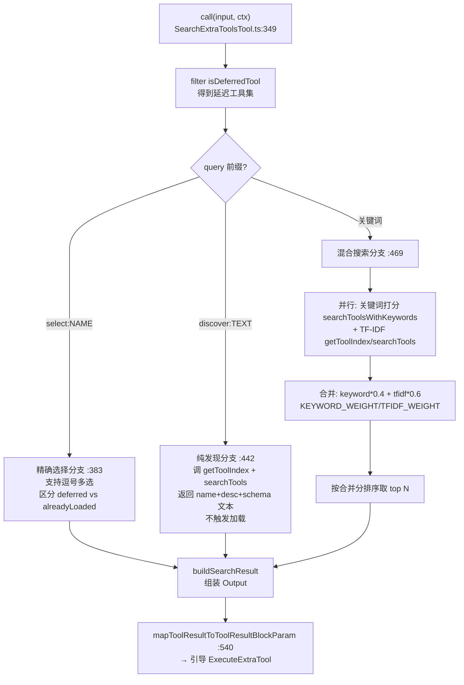
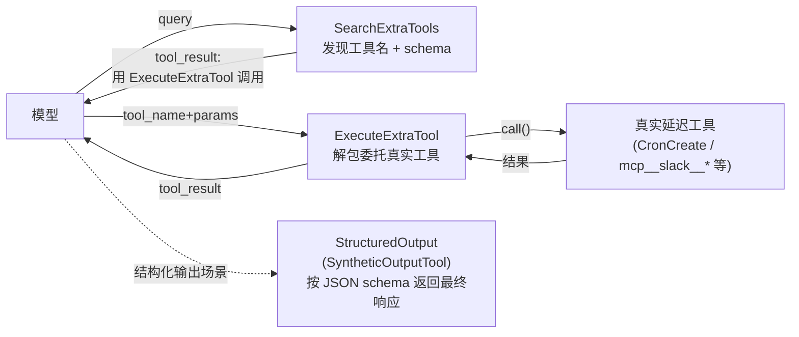

# SearchExtraTools 工具详解

> 这是**延迟工具发现三件套**的第一件（Search → Execute → Synthetic），也是整个工具系统最精妙的设计。`SearchExtraTools` 是一个**复杂**的只读检索工具：它本身是核心工具（始终加载），但它的使命是帮模型发现"按需加载的延迟工具"——那些非核心内置工具和所有 MCP 工具。理解了它，你就理解了 Claude Code 如何在 60+ 工具（含任意数量的 MCP 工具）的场景下不让工具定义撑爆 system prompt。

---

## 一、工具定位（一句话总结）

**`SearchExtraTools` = 延迟工具发现入口，模型用它把"还没进入 prompt 的工具"按需召唤出来。**

| 维度 | 值 |
|---|---|
| 工具名 | `SearchExtraTools`（常量 `SEARCH_EXTRA_TOOLS_TOOL_NAME`，`constants.ts:1`） |
| 一句话 | 用 `select:` 精确选名、`discover:` 只读预览、或关键词搜索，返回匹配的延迟工具名 |
| 是否进 system prompt | ✅ 在 `CORE_TOOLS` 白名单内（`src/constants/tools.ts:176`），且**条件注册**（`tools.ts:279`，乐观门控） |
| 只读 / 破坏性 | **只读**（`isReadOnly() → true`） |
| 是否可并发 | ✅ **可并发**（`isConcurrencySafe() → true`） |
| 核心依赖 | `src/services/searchExtraTools/toolIndex.ts`（TF-IDF 索引）+ 自建关键词打分 |
| 定位互补方 | `ExecuteExtraTool`（搜索完去执行）、`StructuredOutput`（动态 schema 工具） |

**为什么需要它？** Claude Code 内置 60+ 工具，加上用户接入的 MCP 服务器（每个可能几十个工具），全部塞进 system prompt 会瞬间撑爆 context。解法是"延迟加载"——核心工具（`CORE_TOOLS` 白名单 38 个）始终加载，其余全部 `defer` 掉，只在模型真正需要时，通过 `SearchExtraTools` 发现、`ExecuteExtraTool` 调用。这就是工具系统的"context 瘦身"策略。

---

## 二、关键文件清单

```
SearchExtraToolsTool/
├── SearchExtraToolsTool.ts   ← buildTool({...}) 主体（600 行），搜索/合并/输出全在这
├── prompt.ts                 ← 工具名 + isDeferredTool() + getPrompt() + formatDeferredToolLine()
├── constants.ts              ← SEARCH_EXTRA_TOOLS_TOOL_NAME 常量（仅 1 行）
└── __tests__/                ← 测试目录
```

| 文件 | 角色 | 必看行号 |
|---|---|---|
| `SearchExtraToolsTool.ts` | 主体：schema + 三路查询分支 + 关键词打分 + TF-IDF 合并 + 结果转 tool_result | `buildTool:325`、`call:349`、`select 分支:383`、`discover 分支:442`、关键词分支:469、`mapToolResultToToolResultBlockParam:540` |
| `prompt.ts` | `isDeferredTool()`（延迟判定核心）、`getPrompt()`（系统提示） | `isDeferredTool:69`、`getPrompt:89`、`getToolLocationHint:17` |
| `constants.ts` | 工具名常量 | `:1` |
| `src/services/searchExtraTools/toolIndex.ts` | TF-IDF 索引构建与搜索（外部依赖） | `buildToolIndex:80`、`searchTools:159`、`getToolIndex:244`（缓存） |
| `src/utils/searchExtraTools.ts` | 启用判定 + 发现集提取（外部依赖） | `isSearchExtraToolsEnabledOptimistic:208`、`extractDiscoveredToolNames:489` |

> **结构特点**：这是"单文件主体 + 外部索引模块"型——搜索调度逻辑在 `SearchExtraToolsTool.ts`，但 TF-IDF 算法引擎独立放在 `src/services/searchExtraTools/toolIndex.ts`，便于复用和测试。两处都各自做缓存（描述 memoize + 索引缓存）。

---

## 三、Tool 接口字段实现（`buildTool` 逐字段）

### 标识字段

```ts
name: SEARCH_EXTRA_TOOLS_TOOL_NAME,   // "SearchExtraTools"
maxResultSizeChars: 100_000,          // 结果截断阈值
userFacingName() { return 'SearchExtraTools' }
```

> 注意：**没有 `searchHint` 字段**。本工具自身就是搜索入口，不需要再被别的工具搜索到（它始终在核心工具里）。

### 启用与并发门控

```ts
isEnabled()               { return isSearchExtraToolsEnabledOptimistic() }  // 乐观门控
isConcurrencySafe()       { return true }   // 只读检索，可并发
isReadOnly()              { return true }
```

> **`isEnabled` 的双层设计**：`isEnabled()` 只做**乐观检查**（`isSearchExtraToolsEnabledOptimistic`，`searchExtraTools.ts:208`）——只要不是 `standard` 模式就返回 true，用于决定工具是否注册（`tools.ts:279`）。真正的**权威检查**（含阈值、模型兼容性、可用性）是 `isSearchExtraToolsEnabled()`（`searchExtraTools.ts:296`），在 `claude.ts` 发请求时才判定，决定延迟工具是否真正 defer。

### 模型面字段

```ts
async description() { return getPrompt() }   // → API tool schema 描述
async prompt()      { return getPrompt() }    // → system prompt 片段
get inputSchema()   { return inputSchema() }  // Zod schema（lazySchema 懒加载）
get outputSchema()  { return outputSchema() }
```

**输入 schema**（`:37-50`）：
```ts
{
  query: string          // 必填，支持三种格式：select:/discover:/关键词
  max_results?: number   // 可选，默认 5
}
```

**输出 schema**（`:53-62`）：
```ts
{
  matches: string[]                 // 匹配到的工具名
  query: string                     // 原始查询
  total_deferred_tools: number      // 延迟工具总数（让模型感知池子大小）
  pending_mcp_servers?: string[]    // 仍在连接的 MCP 服务器（无匹配时附带）
  already_loaded?: string[]         // 匹配项里已是核心工具的（提示模型直接调用）
}
```

### 行为字段（重点）

| 字段 | 实现 | 说明 |
|---|---|---|
| `call()` | `:349` | 三路分发：select/discover/关键词（见下节） |
| `renderToolUseMessage` | `:529` | 显示 `"${query}"` |
| `mapToolResultToToolResultBlockParam` | `:540` | 把结构化 Output 翻译成引导模型用 `ExecuteExtraTool` 的文本 |
| `validateInput` | 无 | 省略——query 是任意字符串，无需预校验 |
| `checkPermissions` | 无 | 省略——只读，走默认放行 |

---

## 四、核心执行流程：`call()`

`call()`（`:349-528`）是三件套里最复杂的一个。它按 query 前缀分**三路**，外加一个合并算法：



### 分支一：`select:` 精确选择（`:383-437`）

模型已知工具名时最快。正则 `^select:(.+)$` 解析，支持逗号多选 `select:A,B,C`。对每个名字：
- 先在 `deferredTools` 找，找不到回退到完整 `tools`（核心工具也算"找到"，但标记为 `alreadyLoaded`——提示模型"这个已经是核心工具，直接调用即可，别用 ExecuteExtraTool 包装"）。
- 全找不到 → 返回空 + `pending_mcp_servers`（如果有 MCP 还在连接）。

### 分支二：`discover:` 纯发现（`:442-467`）

**不触发加载**，只返回工具的 `name + description + inputSchema` 文本块。调 `getToolIndex(deferredTools)` 拿 TF-IDF 索引，再 `searchTools(discoverQuery, index, max_results)`。用途：模型在调用前先"打量"工具长什么样、要什么参数。

### 分支三：关键词混合搜索（`:469-527`）—— 最精妙

**并行跑两路**：
1. **关键词打分**（`searchToolsWithKeywords`，`:208-323`）：自建启发式。快速路径处理精确名匹配、`mcp__` 前缀匹配；否则按 `+term`（必需）/ 普通词拆分，对每个工具的 `parseToolName` 分词 + 描述 + `searchHint` 做词边界正则匹配，累加权重分（MCP 名 12 分、普通名 10、部分包含 5/6、searchHint 4、描述 2）。
2. **TF-IDF 语义搜索**（`toolIndex.ts`）：`tokenizeAndStem` 分词 → `computeWeightedTf`（name 权重 3.0 / searchHint 2.5 / desc 1.0）→ `computeIdf` → `cosineSimilarity`。含 CJK bigram 防误匹配（`:198-204`）和名称兜底（`score = max(score, 0.75)`，`:206`）。

**合并**（`:478-499`）：关键词结果按排名转归一化分 `(len-rank)/len * 0.4`，TF-IDF 结果用原始分 `* 0.6`，相加后排序。权重可由环境变量 `SEARCH_EXTRA_TOOLS_WEIGHT_KEYWORD` / `SEARCH_EXTRA_TOOLS_WEIGHT_TFIDF` 调（`:30-35`，默认 0.4/0.6）。

### 缓存机制（两层）

- **描述 memoize**（`:84-104`）：`getToolDescriptionMemoized` 按工具名缓存其 `prompt()` 输出，避免关键词搜索反复算描述。`maybeInvalidateCache`（`:109`）监测延迟工具集合变化（名字拼串做 key），变化即清缓存。
- **TF-IDF 索引缓存**（`toolIndex.ts:241-260`）：`getToolIndex` 按全工具名拼串缓存整个索引，MCP 服务器增减时重建。

---

## 五、权限与安全

SearchExtraTools 是**只读检索**，权限模型极简：
- 无 `validateInput`、无 `checkPermissions`——走默认放行。
- `isReadOnly() → true` + `isConcurrencySafe() → true`，可安全并发。

**真正的"安全"在别处**——它控制的是**信息可见性**而非文件访问：
- 延迟工具默认对模型不可见（不在 API 的 tools 数组里，见 `claude.ts:1252`），只有被 `SearchExtraTools` 发现后，模型才知道它们的存在和 schema。
- `select:` 对已加载核心工具的"软放行"（`:394-405`）是有意设计：避免模型对已加载工具反复搜索，但结果里明确标记 `already_loaded`，`mapToolResultToToolResultBlockParam` 会警告"别用 ExecuteExtraTool 包装核心工具"（`:567-573`）。

---

## 六、与其他系统/工具的关系（三件套协作链路）



- **与 `ExecuteExtraTool` 的关系（强耦合）**：Search 只负责"发现"，真正的调用必须走 Execute。`mapToolResultToToolResultBlockParam`（`:540`）的输出文本明确引导 `"请使用 ExecuteExtraTool（{"tool_name": ...}）来调用"`。这是**两步工作流**（prompt.ts:28-50 反复强调）。
- **与 `isDeferredTool()`（`prompt.ts:69-78`）的关系**：这是延迟判定的**唯一真理源**——`alwaysLoad: true` 退出、在 `CORE_TOOLS` 里退出，其余全延迟。`toolIndex.ts`、`searchExtraTools.ts`、`ExecuteTool.ts` 都从这里导入。
- **与 `claude.ts` 请求层的关系**：`claude.ts:1244-1252` 在发请求时把延迟工具从 API tools 数组排除；`extractDiscoveredToolNames`（`searchExtraTools.ts:489`）扫描消息历史中被发现过的工具，让它们在后续请求里重新可见。
- **与 `StructuredOutput`（SyntheticOutputTool）的关系**：**独立**。StructuredOutput 是 SDK 结构化输出场景的动态工具，与三件套的延迟工具发现**没有协作关系**（详见各自报告）。
- **与 TF-IDF 引擎 `toolIndex.ts` 的关系**：复用 `src/services/skillSearch/localSearch.ts` 的 `tokenizeAndStem`/`computeWeightedTf`/`computeIdf`/`cosineSimilarity`——技能搜索和工具搜索共享同一套语义检索算法。

---

## 七、亮点与设计取舍

1. **三路前缀分发**（`:383/442/469`）：`select:` 求速度、`discover:` 求预览、关键词求召回——一个工具覆盖三种使用姿势，避免模型在"已知名/想看 schema/模糊找"间反复试错。
2. **关键词 + TF-IDF 双引擎融合**（`:471-499`）：关键词打分精确（词边界、权重分级），TF-IDF 召回广（语义相似）。0.4/0.6 权重 + 环境变量可调，是工程上对"精确 vs 召回"的稳健折中。
3. **两层缓存**（描述 memoize + 索引缓存）：延迟工具的 `prompt()` 较贵（要拼权限上下文），缓存让重复搜索近乎零成本。缓存键用工具名拼串，集合变化自动失效。
4. **`already_loaded` 区分**（`:502`、`:560-582`）：把"匹配到核心工具"和"匹配到真延迟工具"分开输出，前者直接劝退模型别包装，后者才引导走 Execute——避免无效的 ExecuteExtraTool 往返。
5. **`pending_mcp_servers` 友好降级**（`:511-518`、`:548-552`）：无匹配时如果 MCP 还在连接，明确告诉模型"稍后再搜"，而不是让模型误判工具不存在。
6. **CJK bigram 防误匹配**（`toolIndex.ts:198-204`）：中文查询若只有 1 个 bigram 命中且无 ASCII 命中则置零——防止中文单字误命中大量工具。
7. **`isDeferredTool` 的真理源设计**：判定函数放在 `prompt.ts` 而非独立文件，但被 `toolIndex.ts`、`searchExtraTools.ts`、`ExecuteTool.ts` 三处导入——单一真理源，改一处全联动。
8. **`mapToolResultToToolResultBlockParam` 的教学性输出**（`:540-598`）：不返回原始 JSON，而是返回**引导性自然语言**——这是为了让模型可靠地走两步工作流，减少"搜了不调"或"直接调延迟工具"的错误。

---

## 八、源码导航（书签速查）

| 想看什么 | 去哪里 |
|---|---|
| 工具名常量 | `SearchExtraToolsTool/constants.ts:1` |
| `isDeferredTool` 延迟判定 | `SearchExtraToolsTool/prompt.ts:69-78` |
| 系统提示 `getPrompt` | `prompt.ts:89-94`（`PROMPT_HEAD/TAIL` 在 `:10/:26`） |
| `buildTool` 字段填充 | `SearchExtraToolsTool.ts:325-600` |
| 输入/输出 schema | `SearchExtraToolsTool.ts:37-63` |
| `call()` 三路分发 | `SearchExtraToolsTool.ts:349-528` |
| `select:` 分支 | `:383-437` |
| `discover:` 分支 | `:442-467` |
| 关键词打分 `searchToolsWithKeywords` | `:208-323` |
| 关键词 + TF-IDF 合并 | `:471-499` |
| 结果转 tool_result | `:540-598` |
| TF-IDF 索引构建 | `src/services/searchExtraTools/toolIndex.ts:80-157` |
| TF-IDF 搜索 + CJK 处理 | `toolIndex.ts:159-239` |
| 索引缓存 | `toolIndex.ts:241-266` |
| 启用判定（乐观/权威） | `src/utils/searchExtraTools.ts:208-231`、`:296-377` |
| 发现集提取 | `searchExtraTools.ts:489-556` |
| 延迟工具排除出 API | `src/services/api/claude.ts:1244-1331` |

---

## 九、学习建议与验证清单

**怎么读这章**：先读 `prompt.ts:69` 的 `isDeferredTool` 理解"什么是延迟工具"，再跳到 `call()` 看三路分发的心智模型，最后对照 `toolIndex.ts` 理解 TF-IDF 引擎。三件套里这一篇信息密度最高。

**验证清单（读完自测）**：
- [ ] 能说出三件套的协作链路：Search 发现 → Execute 执行（StructuredOutput 与之独立）
- [ ] 能解释 `select:` / `discover:` / 关键词三种 query 的区别和适用场景
- [ ] 能指出关键词与 TF-IDF 的融合权重（0.4 / 0.6）和可调环境变量
- [ ] 能说出 `isDeferredTool` 的三条判定（alwaysLoad 退出、CORE_TOOLS 退出、其余延迟）
- [ ] 能解释为什么需要"乐观检查"（`isEnabled`）和"权威检查"（`isSearchExtraToolsEnabled`）两层
- [ ] 能指出 `already_loaded` 字段的作用（区分核心工具，避免无效 Execute 包装）
- [ ] 能说出两层缓存（描述 memoize + 索引缓存）各自的失效条件

**配合动作**：
1. 设 `ENABLE_SEARCH_EXTRA_TOOLS=1`，让 Claude `SearchExtraTools({"query": "select:CronCreate"})`，观察返回的引导文本
2. 用 `discover:CronCreate` 对比，看 schema 是否被返回
3. 在 `call()` 的 `:475` 加日志，对比关键词与 TF-IDF 两路各自命中哪些工具
4. 接入一个 MCP 服务器，观察 `total_deferred_tools` 数量变化和缓存重建
