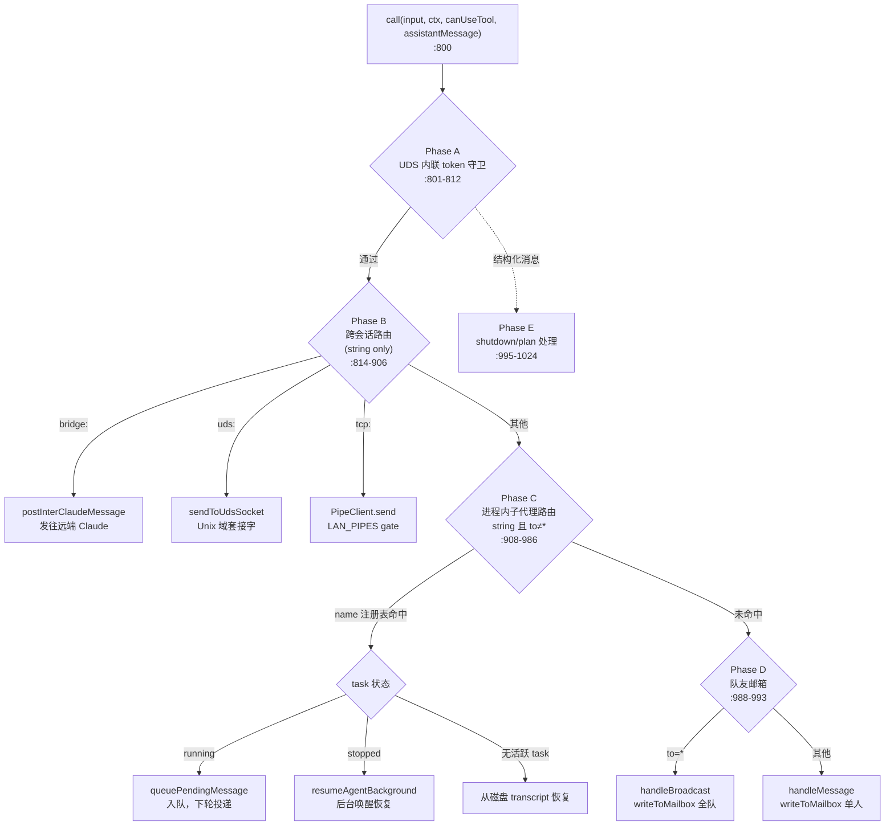
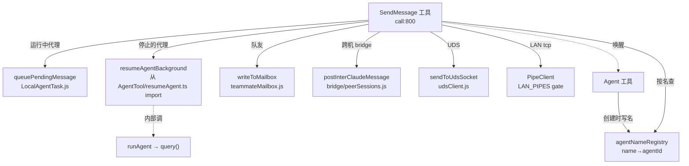

# SendMessage 工具详解

> 这是工具系统逐个拆解系列中**Agent 协作篇**的第二篇。如果说 `Agent` 工具是"派一个新代理去干活"，那么 `SendMessage` 就是"给已经在干活的代理再发一句话"。它是一个**纯通信路由工具**——本身不调用大模型，只负责把消息按地址投递到正确的通道：正在跑的子代理（入队）、已停止的子代理（唤醒恢复）、队友（写邮箱）、跨会话的远端 Claude（bridge/UDS/TCP）。理解了它，就理解了 Claude Code 多代理系统里"消息如何流动"。

---

## 一、工具定位（一句话总结）

**`SendMessage` = 向另一个 agent（或通道）发送消息，让已存在的代理继续对话而非新建一个。**

| 维度 | 值 |
|---|---|
| 工具名 | `SendMessage`（常量 `SEND_MESSAGE_TOOL_NAME`，`constants.ts:1`） |
| 一句话 | 按 `to` 地址把消息投递给目标代理/队友/远端会话；运行中的子代理入队，停止的自动恢复 |
| 是否进 system prompt | ❌ **不在 `CORE_TOOLS` 白名单**（`src/constants/tools.ts` 只 import 不入数组） |
| 加载方式 | `shouldDefer: true`（`SendMessageTool.ts:567`）+ `alwaysLoad: isAgentSwarmsEnabled()`（`:568`）——延迟工具，仅当多代理团队开启时才预加载 |
| 注册位置 | `src/tools.ts:255`（`getSendMessageTool()` in `getAllBaseTools()`），并在 `:325`（replSimple）、`:337`（COORDINATOR simpleTools）条件性 push |
| 只读 / 破坏性 | 通信类工具，副作用是"改变另一个代理的状态/唤醒进程"；权限由 `to` 的 scheme 决定 |
| 核心依赖 | `queuePendingMessage`（投递运行中代理）、`resumeAgentBackground`（唤醒停止的代理，复用自 AgentTool）、`writeToMailbox`（队友邮箱） |
| 定位互补方 | `Agent`（创建新代理）；本工具**续发**已有代理 |

**为什么需要它？** `Agent` 工具是"一次性任务"——子代理跑完返回结果就结束。但很多场景需要**持续对话**：主代理派子代理调研，看完初报后想追问"再深挖一下 X"；team lead 给多个 teammate 分配任务后要逐个催促进度。如果每次都新建代理，上下文全丢、还得重述背景。`SendMessage` 让已存在的代理接着上次的记忆继续，是多代理从"单次委派"升级到"持续协作"的关键。

---

## 二、关键文件清单

SendMessageTool 是单文件主体型，逻辑集中但篇幅大（1029 行，因为要处理多种投递通道）。

```
SendMessageTool/
├── SendMessageTool.ts   ← 主体（1029 行）：schema + call() 路由 + 权限 + 校验 + 结构化消息处理
├── constants.ts         ← SEND_MESSAGE_TOOL_NAME = 'SendMessage'
├── prompt.ts            ← getPrompt()：注入 system prompt 的使用说明（49 行）
├── UI.tsx               ← Ink 渲染（37 行，仅渲染结构化消息/结果）
└── __tests__/
    └── udsRecipientSanitization.test.ts  ← UDS 内联 token 脱敏测试（181 行）
```

| 文件 | 角色 | 必看行号 |
|---|---|---|
| `SendMessageTool.ts` | 工具主体：路由 `call()` + `validateInput` + `checkPermissions` + 结构化消息处理器 | `buildTool:553`、`call:800`、`validateInput:650`、`checkPermissions:623`、in-process 路由:908、结构化:995 |
| `constants.ts` | 工具名 | `:1` |
| `prompt.ts` | 使用说明（含"必须用此工具，纯文本队友看不到"等关键提示） | `DESCRIPTION:3`、`getPrompt:5` |
| `UI.tsx` | 仅渲染 plan_approval 等结构化消息 | `renderToolUseMessage:7`、`renderToolResultMessage:17` |

> **结构特点**：单文件 1029 行，按职责分段——helper（findTeammateColor 等）、广播/邮箱处理（handleBroadcast/handleMessage）、结构化消息处理（handleShutdown*/handlePlan*）、schema、权限校验、`call()` 路由。没有像 AgentTool 那样拆子模块，因为各通道逻辑相对独立、不需要共享状态。

---

## 三、Tool 接口字段实现（`buildTool` 逐字段）

### 标识字段

```ts
name: SEND_MESSAGE_TOOL_NAME,   // "SendMessage"（SendMessageTool.ts:555）
userFacingName() { return 'SendMessage' },   // :561
shouldDefer: true,              // 延迟加载（:567）
alwaysLoad: isAgentSwarmsEnabled(),  // 多代理团队开启时预加载（:568）
```

> **`shouldDefer: true` + `alwaysLoad` 的组合**：这是延迟工具的典型配置。`shouldDefer` 让它不进默认 tool schema（省 token），`alwaysLoad` 在特定条件（swarm 开启）下绕过延迟直接加载。普通单代理场景下这个工具根本不暴露给模型。

### 模型面字段

```ts
async description() { return DESCRIPTION }   // '向另一个 agent 发送消息'（prompt.ts:3）
async prompt({ appState }) { return getPrompt() }  // 详细使用文档
get inputSchema() { return inputSchema() }   // 懒加载 getter
```

**输入 schema**（`SendMessageTool.ts:67-87`，`lazySchema`）：
```ts
{
  to: string,          // 收件人：队友名 | "*"（广播）| "uds:<path>" | "bridge:<session>" | "tcp:<host>:<port>"
  summary?: string,    // 5-10 词 UI 预览；字符串消息时必填
  message: string | StructuredMessage   // 正文 或 结构化消息
}
```

**`StructuredMessage`**（`:46-65`，`z.discriminatedUnion('type', ...)`）三种：
```ts
{ type: 'shutdown_request', reason?: string }
| { type: 'shutdown_response', request_id: string, approve: semanticBoolean(), reason?: string }
| { type: 'plan_approval_response', request_id: string, approve: semanticBoolean(), feedback?: string }
```

**输出 schema**（`:127-132`）union：`MessageOutput | BroadcastOutput | RequestOutput | ResponseOutput`。`MessageRouting`（`:92-99`）携带 sender/target/summary/content/colors。

### 行为字段

| 字段 | 实现 | 说明 |
|---|---|---|
| `call()` | `:800-1025` | 五阶段路由（见下节），纯路由不调模型 |
| `validateInput()` | `:650-777` | 大量校验：空 to、地址 scheme、UDS token、`@` 符号、bridge 连接、summary 必填、结构化消息约束 |
| `checkPermissions()` | `:623-648` | 按 scheme 决定：bridge/tcp → `ask`，其余 → `allow` |
| `mapToolResultToToolResultBlockParam()` | `:787-798` | 结果包成单个文本块（`jsonStringify`） |
| 渲染 | `UI.tsx` | 仅渲染结构化消息（plan_approval 等） |

---

## 四、核心执行流程：`call()`（五阶段路由）

`call()`（`:800-1025`）是一个**纯路由分发器**——根据 `to` 的 scheme 和 `message` 的类型，把消息扔进不同通道。它**不等待回复**，是 fire-and-forget 模式。



### 各阶段要点

**Phase A — UDS 内联 token 守卫（`:801-812`）**
若 `message` 是字符串且 `parseAddress(to).scheme === 'uds'` 且含内联 `#token=` 标记，立即失败。这是 `validateInput` 之后的**第二道防线**——防止 UDS 鉴权 token 通过消息体泄露。

**Phase B — 跨会话路由（`:814-906`，仅 string 消息）**
- **bridge scheme**（`:816-846`）：**重新检查** `getReplBridgeHandle()` && `isReplBridgeActive()`（因为 `checkPermissions` 到现在可能过了几分钟，bridge 可能已断）。断了就失败；否则 `require('src/bridge/peerSessions.js').postInterClaudeMessage(addr.target, input.message)` 把消息作为 user prompt 发给远端 Claude。
- **uds scheme**（`:847-870`）：`require('src/utils/udsClient.js').sendToUdsSocket(addr.target, message)`，收件人显示用 `recipientForDisplay`（token 已剥离）。
- **tcp scheme**（`:871-905`，`LAN_PIPES` gate）：`parseTcpTarget` → `new PipeClient(to, 'send-<pid>', ep)` → `connect(5000)` → `client.send({type:'chat', data: message})` → `disconnect()`。

> **Phase B 全部被 `feature('UDS_INBOX')` / `feature('LAN_PIPES')` 包裹**。CLAUDE.md 明确这两个 flag 在生产构建里**已禁用**，所以这些分支在外部构建里会被编译器删除——这也是为什么 UDS/TCP 测试单独放在 `__tests__/udsRecipientSanitization.test.ts`。

**Phase C — 进程内子代理路由（`:908-986`，string 消息且 `to !== '*'`）**

**这是"给已存在子代理续发消息"的核心逻辑**：

1. **查找收件人**（`:912-913`）：
   ```ts
   const registered = appState.agentNameRegistry.get(input.to)   // name → agentId
   const agentId = registered ?? toAgentId(input.to)             // 兜底：直接当 agentId 解析
   ```
   `agentNameRegistry` 是 AppState 上的 `Map<name, agentId>`——AgentTool 创建子代理时把 name 写进去。`toAgentId` 只在 `to` 本身符合 `createAgentId` 格式时才成功，所以普通队友名不会误命中。

2. **命中且是 LocalAgentTask（非主会话）**：
   - **running**（`:917-929`）：`queuePendingMessage(agentId, message, setAppState)` 把消息塞进待投递队列，返回 `"消息已排队，将在 <name> 的下一个工具轮次投递。"` —— **不打断当前轮**。
   - **stopped**（`:930-954`）：`await resumeAgentBackground({ agentId, prompt: message, toolUseContext, canUseTool, invokingRequestId })` —— **后台唤醒恢复**，返回 outputFile 路径 + "完成时会通知你"。

3. **task 已不在 state 里**（`:955-984`）：仍调 `resumeAgentBackground`——从磁盘 transcript 恢复。无 transcript 才报错。

> **关键洞察**：SendMessage 给运行中代理发消息时**不调 `query()`、不调 `runAgent`**，只是入队——运行中的代理在自己的轮循环里会自己取。给停止的代理发消息才调 `resumeAgentBackground`（从 AgentTool import，复用恢复机制）。这就是"fire-and-forget"——**不等回复**，回复会作为新的异步消息回流。

**Phase D — 队友邮箱（`:988-993`）**
`to === '*'` → `handleBroadcast(message, summary, context)`；否则 `handleMessage(to, message, summary, context)`。两者最终都 `writeToMailbox(recipientName, {from, text, summary, timestamp, color}, teamName)`（`src/utils/teammateMailbox.js`）——写文件，收件人轮询。

**Phase E — 结构化消息（`:995-1024`）**
`to === '*'` → 抛 `"结构化消息不能广播"`。按 `input.message.type` switch：
- `shutdown_request` → `handleShutdownRequest`
- `shutdown_response`：approve → `handleShutdownApproval`（`:338-432`，定位自己的 paneId/backendType，in-process 则 `task.abortController.abort()`，否则 `gracefulShutdown`）；reject → `handleShutdownRejection(request_id, reason!)`
- `plan_approval_response`：approve → `handlePlanApproval`（仅 team lead 可批）；reject → `handlePlanRejection(... feedback ?? 'Plan 需要修改')`

### 投递后如何拿到回复？

**拿不到——至少不在这次工具调用里。** prompt.ts 明说：*"Messages from teammates are delivered automatically; you don't check an inbox"*（队友的消息会自动送达，你不用查邮箱）。回复会作为**新的入站消息**异步出现在对话里，而不是作为 SendMessage 的 tool_result。这种设计让多代理协作不被同步等待阻塞。

---

## 五、权限与安全

### `checkPermissions`（`:623-648`）——按 scheme 分流

```ts
async checkPermissions(input, _context) {
  if (feature('UDS_INBOX') && scheme === 'bridge') {
    return { behavior: 'ask', message: '...Remote Control session...', decisionReason: { type:'safetyCheck', classifierApprovable: false } }
  }
  if (feature('LAN_PIPES') && scheme === 'tcp') { /* 同样 'ask' */ }
  return { behavior: 'allow', updatedInput: input }
}
```

**设计**：本地队友名/广播/UDS 一律 `allow`（进程内/同机，风险低）；**跨机器**的 bridge/tcp 必须 `ask`（要用户明确同意把消息发到另一台机器/另一个 Claude 会话）。`classifierApprovable: false` 确保这种跨机发送**永远走人工确认**，不能被自动分类器批准。

### `validateInput`（`:650-777`）——10 项校验，返回 `{result:false, message, errorCode:9}`

1. `to` 为空（`:651`）
2. bridge/uds/tcp scheme 但 target 空（`:658`）
3. uds 含内联 token（`:671`）
4. `to.includes('@')`（`:679`）——"必须是裸队友名或 `*`"，单会话单团队
5. bridge scheme 下发结构化消息（`:690`）——结构化消息不能跨会话
6. bridge scheme 但 `!getReplBridgeHandle() || !isReplBridgeActive()`（`:702`）——注释（`:698-701`）解释这覆盖了初始化窗口期和 CCR 镜像只写模式
7. UDS/LAN string 消息短路放行（`:712`）
8. string 消息必须带 `summary`（`:726`）
9. 结构化消息不能广播（`:737`）或跨会话（`:744`）
10. `shutdown_response` 必须发给 `TEAM_LEAD_NAME`（`:753`），且 reject 时 `reason` 必填（`:764`）

> **校验密度高是有原因的**：这个工具能唤醒进程、跨机发消息、批准/拒绝 plan、关停队友——每一条校验都是一道安全栏。`errorCode: 9` 是统一的"输入非法"码。

### UDS token 脱敏（6 个专用测试）

UDS 地址可能带鉴权 token（`uds:/path.sock#token=secret`）。工具用三个 helper（`:133-164`）——`redactObservableInlineUdsToken`、`recipientForDisplay`、`redactInlineUdsTokenForRejection`——把 token 从所有可观测路径（日志、UI、错误消息、分类器输入）剥离。`udsRecipientSanitization.test.ts`（181 行）专测这一点。这是防止凭据通过错误消息泄露的防御性设计。

---

## 六、与其他系统/工具的关系



- **与 `Agent` 工具的关系**：**互补不重叠**。Agent **创建**新代理（一次性任务返回结果）；SendMessage **续发**已存在的代理。两者通过 `agentNameRegistry`（name→agentId）连接——Agent 创建时写名，SendMessage 按名查。SendMessage 还直接 import AgentTool 的 `resumeAgentBackground`（`:41`），复用唤醒机制。两者在 `src/tools.ts` 里也被成对注册（`:325` replSimple、`:337` COORDINATOR）。
- **与 `LocalAgentTask` 的关系**：`queuePendingMessage` 来自 `src/tasks/LocalAgentTask/LocalAgentTask.js`——运行中的子代理任务类型。SendMessage 把消息塞进它的待投递队列，任务自己在下个工具轮取。
- **与 bridge/UDS/LAN 系统的关系**：这三条跨会话通道分别接 `src/bridge/`、`src/utils/udsClient.js`、`PipeClient`，全被 `feature('UDS_INBOX')` / `feature('LAN_PIPES')` 门控——生产构建里编译消除。
- **与 `canUseTool` 的关系**：SendMessage 把 `canUseTool` 和 `invokingRequestId`（`assistantMessage?.requestId`）透传给 `resumeAgentBackground`，把唤醒的后台任务关联回父轮次。
- **与 prompt 系统的关系**：`prompt.ts:20` 的关键提示——*"Your plain text output is NOT visible to other agents — to communicate, you MUST call this tool"*（你的纯文本输出队友看不到，必须调此工具才能通信）。这是引导模型正确使用多代理通信的核心约束。

---

## 七、亮点与设计取舍

1. **纯路由分发，不调模型**（`:800`）：`call()` 只决定"消息往哪走"，没有任何 LLM 调用。这让消息投递极快、可预测，复杂度全在通道选择上。
2. **fire-and-forget + 异步回流**（prompt.ts）：不等回复，回复作为新消息自动送达。避免了"发一条等一条"的同步阻塞，让多代理能真正并发。
3. **复用 AgentTool 的恢复机制**（`:41`）：SendMessage 不自己实现唤醒，直接 import `resumeAgentBackground`。DRY 原则的体现——"唤醒停止的代理"逻辑只有一处真相。
4. **`classifierApprovable: false` 的跨机安全栏**（`:624`）：bridge/tcp 发送永远人工确认，自动分类器不能越权批准。把"消息出本机"当成需要人盯的高危动作。
5. **UDS token 三重脱敏**（`:133-164` + 181 行测试）：token 从日志/UI/错误/分类器输入全剥离。安全细节做到位，防凭据通过错误消息泄露。
6. **按 name 注册表路由**（`:912`）：`agentNameRegistry` 让模型用人类可读的名字（"researcher"）而非 UUID 寻址——prompt.ts 明确 *"Refer to teammates by name, never by UUID"*。对模型友好。
7. **10 项 `validateInput` 校验**（`:650-777`）：每条都是安全栏（禁 `@`、禁跨会话结构化消息、shutdown 必须发 lead、reject 必填理由）。高权限工具必须严校验。
8. **`shouldDefer + alwaysLoad` 按需加载**（`:567-568`）：单代理场景根本不暴露此工具，只在多代理团队开启时才加载——省 token、减少模型误用。
9. **Phase B 的 bridge 活性复检**（`:821`）：`checkPermissions` 到 `call()` 之间可能间隔很久，bridge 可能已断。在执行前再查一次是防御性编程的典范——"权限通过不代表现在还能执行"。
10. **结构化消息用 discriminatedUnion**（`:46-65`）：shutdown/plan 三种结构化消息用 `z.discriminatedUnion('type', ...)`——类型安全，避免模型幻觉出非法结构。

---

## 八、源码导航（书签速查）

| 想看什么 | 去哪里 |
|---|---|
| 工具名常量 | `SendMessageTool/constants.ts:1` |
| `buildTool` 字段填充 | `SendMessageTool.ts:553-568` |
| 输入 schema（含 StructuredMessage） | `SendMessageTool.ts:46-87` |
| `call()` 五阶段路由 | `SendMessageTool.ts:800-1025` |
| 进程内子代理路由（核心） | `SendMessageTool.ts:908-986` |
| queuePendingMessage（运行中入队） | `SendMessageTool.ts:917-929` |
| resumeAgentBackground（停止唤醒） | `SendMessageTool.ts:932-954` |
| 跨会话 bridge/uds/tcp | `SendMessageTool.ts:814-906` |
| 结构化消息处理 | `SendMessageTool.ts:995-1024` |
| `checkPermissions`（scheme 分流） | `SendMessageTool.ts:623-648` |
| `validateInput`（10 项校验） | `SendMessageTool.ts:650-777` |
| UDS token 脱敏 helper | `SendMessageTool.ts:133-164` |
| handleShutdownApproval | `SendMessageTool.ts:338-432` |
| 使用说明 prompt | `SendMessageTool/prompt.ts:5-49` |
| 注册位置 | `src/tools.ts:255,325,337` |

---

## 九、学习建议与验证清单

**怎么读这章**：先读"一、定位"建立"SendMessage = 路由器"的心智，再跳到"四、call()"看流程图理清五条通道，最后对照"五、权限"理解为什么跨机要 `ask`。Phase C（进程内子代理路由）是重中之重——它是"给已存在代理续发消息"的核心。

**验证清单（读完自测）**：
- [ ] 能说出 SendMessage 与 Agent 的分工（续发已有 vs 创建新代理）
- [ ] 能指出工具名常量位置（`constants.ts:1`）和它**不在 CORE_TOOLS** 的事实
- [ ] 能解释 `shouldDefer + alwaysLoad: isAgentSwarmsEnabled()` 的加载策略（按需，省 token）
- [ ] 能说出运行中代理如何收消息（`queuePendingMessage` 入队，下轮取，不打断当前轮）
- [ ] 能说出停止的代理如何收消息（`resumeAgentBackground` 后台唤醒，复用自 AgentTool）
- [ ] 能解释为什么不等回复（fire-and-forget，回复作为新消息异步回流）
- [ ] 能指出 bridge/tcp 为何 `classifierApprovable: false`（跨机发送永不自动批准）
- [ ] 能说出 Phase B 为何要复检 bridge 活性（权限通过后 bridge 可能已断）
- [ ] 能找到 UDS token 脱敏的三个 helper（`:133-164`）及其测试文件

**配合动作**：
1. 先用 `Agent` 创建一个具名子代理，再用 `SendMessage(to=<那个名字>, ...)` 续发，观察消息如何出现在子代理的对话里。
2. 让一个后台代理跑长任务时给它发消息，验证 `queuePendingMessage` 的"下轮投递"行为（不打断当前轮）。
3. 在 `call()` 的 `:912` 加日志，确认 `agentNameRegistry` 的 name→agentId 解析。
4. 读 `__tests__/udsRecipientSanitization.test.ts`，理解 token 脱敏的 6 个测试用例覆盖了哪些泄露路径。
5. 构造一条 bridge scheme 的消息，确认触发 `behavior: 'ask'` 人工确认。
