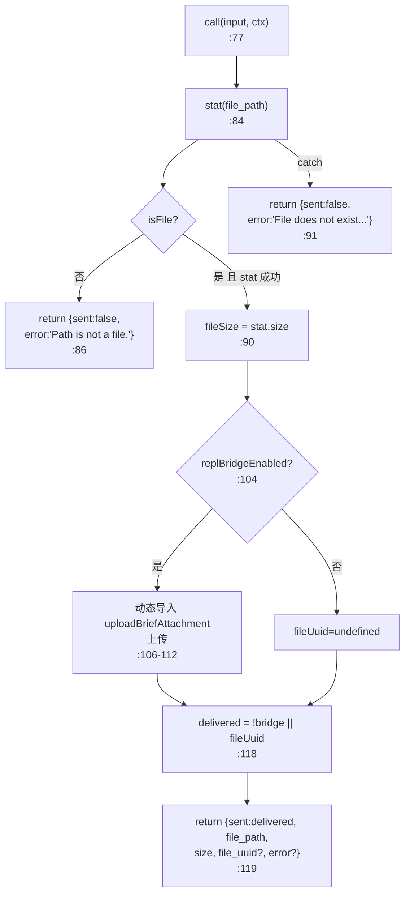
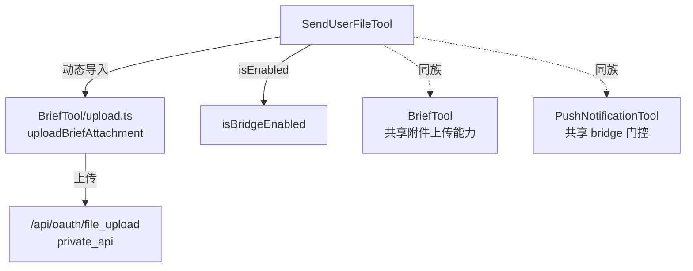

# SendUserFile 工具详解

> 这是工具系统逐个拆解系列的一篇。`SendUserFile` 是一个**简单**的文件投递工具：在 KAIROS 助手模式下，当用户请求文件或文件与对话相关时，把本地文件发送到用户设备。它复用 BriefTool 的 `uploadBriefAttachment` 进行 bridge 上传，体现"工具间共享上传能力"的设计。

---

## 一、工具定位（一句话总结）

**`SendUserFile` = 助手模式下把本地文件投递给用户设备（经 bridge 上传）的工具。**

| 维度 | 值 |
|---|---|
| 工具名 | `SendUserFile`（常量 `SEND_USER_FILE_TOOL_NAME`，`prompt.ts:1`） |
| 一句话 | 校验文件存在 → bridge 上传 → 返回 file_uuid 或本地路径 |
| 是否进 system prompt | ❌ 不在 `CORE_TOOLS`；`tools.ts:47-50` 受 `feature('KAIROS')` 门控，`:267` 条件注册 |
| 只读 / 破坏性 | **只读**（`:52`，只读文件不修改） |
| 是否可并发 | ✅ **可并发**（`:49`） |
| 激活门控 | `feature('KAIROS')`（构建期） + `isBridgeEnabled()`（运行时 `:46`） |
| 核心依赖 | `fs/promises.stat`、`BriefTool/upload.ts` 的 `uploadBriefAttachment` |

**为什么需要它？** 助手模式下用户可能在移动端 / web 端。当对话涉及一个文件（如生成的报告、截图、日志），用户希望能直接在设备上查看，而非 SSH 到 Claude 的机器。本工具把文件上传到 private_api，返回 `file_uuid` 供 web 查看器预览。

---

## 二、关键文件清单

```
SendUserFileTool/
├── SendUserFileTool.ts   ← buildTool({...}) 主体（131 行）
└── prompt.ts             ← 工具名常量（2 行）
```

| 文件 | 角色 | 必看行号 |
|---|---|---|
| `SendUserFileTool.ts` | 主体：schema + call() + 文件校验 + bridge 上传 | `buildTool:24`、`call:77` |
| `prompt.ts` | 工具名常量 | `SEND_USER_FILE_TOOL_NAME:1` |

> **结构特点**：单文件主体 + 极简 prompt.ts。关键在于它**跨工具复用** BriefTool 的上传逻辑——通过动态 `import('.../BriefTool/upload.js')` 调用 `uploadBriefAttachment`（`:106-108`）。

---

## 三、Tool 接口字段实现（`buildTool` 逐字段）

### 标识字段

```ts
name: SEND_USER_FILE_TOOL_NAME,   // "SendUserFile"
searchHint: 'send file to user mobile device upload share',
maxResultSizeChars: 5_000,
strict: true,
```

### 模型面字段

```ts
async description() { return '将文件发送给用户（KAIROS 助手模式）' }
async prompt()      { return `将文件发送到用户设备...` }
get inputSchema()   // lazySchema + z.strictObject
```

**输入 schema**（`:8-18`）：
```ts
{
  file_path: string,       // 必填，绝对路径
  description?: string,    // 可选，文件描述
}
```

**输出类型**（`:22`）：
```ts
{ sent: boolean, file_path: string }
```

### 行为字段

| 字段 | 实现 | 说明 |
|---|---|---|
| `call()` | `:77` | 文件校验 + bridge 上传（见下节） |
| `isEnabled()` | `:46` → `isBridgeEnabled()` | 运行时门控 |
| `isConcurrencySafe()` | `:49` → `true` | |
| `isReadOnly()` | `:52` → `true` | 只读文件 |
| `userFacingName()` | `:56` → `'SendFile'` | |
| `renderToolUseMessage` | `:60` → `Send file: <path>` | |
| `mapToolResultToToolResultBlockParam` | `:64` | `File sent: <path>` / `Failed...` |

---

## 四、核心执行流程：`call()`

`call()`（`:77-130`）分三步：校验 → 上传 → 组装结果：



**关键点逐条**：

1. **文件校验先于上传**（`:83-99`）：`stat` 检查路径存在且是普通文件。非文件 → `Path is not a file.`；异常 → `File does not exist or is not readable.`。错误用 return 而非 throw，保持工具语义。
2. **动态导入 BriefTool 上传**（`:106-108`）：`import('@claude-code-best/builtin-tools/tools/BriefTool/upload.js')`——跨工具复用 `uploadBriefAttachment`。动态导入让 upload.ts（axios/crypto）在非 bridge 构建中可 tree-shaking。
3. **上传失败容忍**（`:113-115`）：catch 块注释"best-effort upload——本地路径始终可用"。上传失败不阻断，文件在本地仍可访问。
4. **`delivered` 判定**（`:118`）：`!replBridgeEnabled || Boolean(fileUuid)`——无 bridge 时视为 delivered（本地可用）；有 bridge 时必须有 file_uuid 才算成功。
5. **结果组装**（`:119-128`）：条件展开 `file_uuid`（成功时）与 `error`（失败时）。

---

## 五、权限与安全

- **无 `checkPermissions` / `validateInput`**：靠 `stat` 内联校验 + `strict: true`。
- **`isEnabled: isBridgeEnabled()`**（`:46`）：未配 bridge 时工具不可见。
- **文件存在性校验**（`:83-99`）：拒绝不存在的路径和非文件路径。
- **上传鉴权**：委托给 `uploadBriefAttachment`（Bearer token、30MB 上限、201 校验，详见 BriefTool 报告）。
- **best-effort 上传**（`:113`）：上传失败不抛错，本地路径兜底——但这意味着 web 用户可能看到无 file_uuid 的失效卡片（upload.ts 注释提及此风险）。

---

## 六、与其他系统/工具的关系



- **与 `BriefTool`**：核心关系——复用 `uploadBriefAttachment`。这正是 `attachments.ts` / `upload.ts` 放在 BriefTool 目录的原因（BriefTool 报告"二、文件清单"已说明）。
- **与 bridge 系统**：上传依赖 bridge token、base URL、session。
- **与 private_api**：上传的文件存储在与 SpaceMessage 同一后端，web 查看器通过 file_uuid 预览。

---

## 七、亮点与设计取舍

1. **跨工具复用上传逻辑**（`:106`）：不重复实现上传，直接动态导入 BriefTool 的 `uploadBriefAttachment`。DRY 原则的体现，也解释了 upload.ts 的模块归属。
2. **best-effort + 本地兜底**（`:113,118`）：web 端可能失效，但本地端始终可用——在"远程预览"与"本地访问"之间做权衡。
3. **`delivered` 双语义**（`:118`）：无 bridge = 本地 delivered；有 bridge = 必须上传成功。诚实反映两种部署下的"送达"含义。
4. **错误用 return 而非 throw**（`:86,91`）：工具语义要求结构化结果，throw 会被当成工具错误而非业务结果。
5. **动态导入隔离依赖**（`:106`）：与 BriefTool 同策略，保护非 bridge 构建。

---

## 八、源码导航（书签速查）

| 想看什么 | 去哪里 |
|---|---|
| 工具名常量 | `SendUserFileTool/prompt.ts:1` |
| `buildTool` 字段填充 | `SendUserFileTool/SendUserFileTool.ts:24-131` |
| 输入 schema | `SendUserFileTool.ts:8-18` |
| `call()` 文件校验 | `SendUserFileTool.ts:77-99` |
| `call()` bridge 上传 | `SendUserFileTool.ts:101-116` |
| `delivered` 判定 | `SendUserFileTool.ts:118` |
| 上传实现（复用） | `BriefTool/upload.ts:91-173` |
| feature gate 注册 | `src/tools.ts:47-50, 267` |

---

## 九、学习建议与验证清单

**怎么读这章**：核心是"四、call()"的三步流程，重点理解跨工具复用 uploadBriefAttachment 的设计与 best-effort 上传策略。建议先读 BriefTool 报告了解 upload.ts 细节。

**验证清单（读完自测）**：
- [ ] 能说出 SendUserFile 如何复用 BriefTool 的上传能力（动态导入 `uploadBriefAttachment`）
- [ ] 能解释 `delivered` 的双语义（无 bridge=本地；有 bridge=需 file_uuid）
- [ ] 能说出 best-effort 上传失败时的兜底（本地路径可用）
- [ ] 能找到 feature gate（`KAIROS`，`tools.ts:47`）
- [ ] 能指出文件校验的两个失败分支（非文件 / 不存在）

**配合动作**：
1. 启用 KAIROS + bridge，让模型发送一个日志文件，观察 file_uuid 返回
2. 传入不存在的路径，观察 `sent:false` 错误消息
3. 断开 bridge，观察 `delivered` 是否仍为 true（本地路径）
