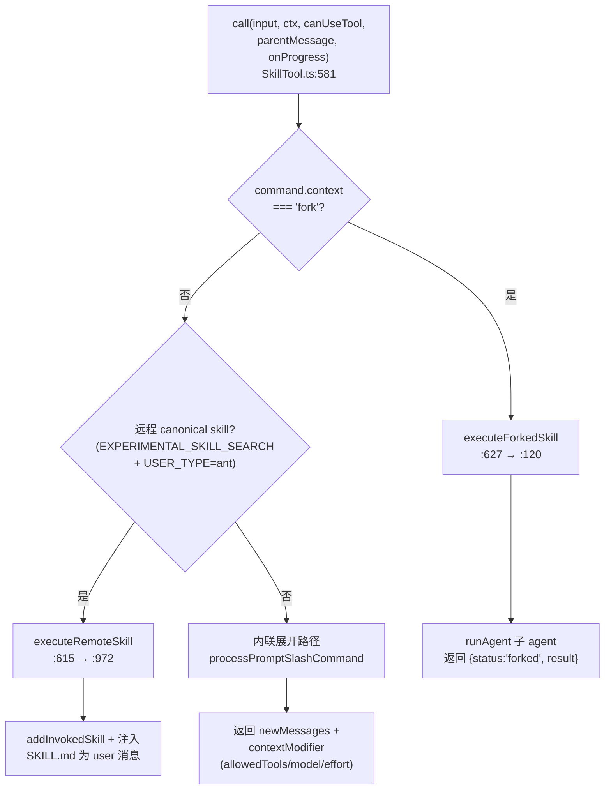
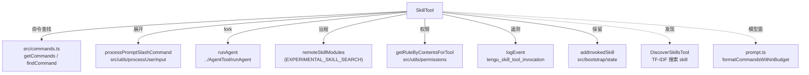

# SkillTool 工具详解

> 这是工具系统逐个拆解系列之一。`Skill` 是一个**复杂**工具：模型（或用户键入 `/xxx`）给一个 skill 名，工具负责查找、校验、权限判定，然后要么把 skill 的 prompt **内联展开**注入会话，要么**fork 一个子 agent** 隔离执行。它横跨命令系统、权限系统、agent 系统、遥测系统四大子系统，是理解"一个工具如何编排整个 CLI"的最佳样本。

---

## 一、工具定位（一句话总结）

**`Skill` = 把 skill 名（斜杠命令）解析并注入/执行的工具。**

| 维度 | 值 |
|---|---|
| 工具名 | `Skill`（常量 `SKILL_TOOL_NAME`，`constants.ts:1`） |
| 一句话 | 输入 skill 名 + 可选 args，查找命令、校验、权限判定，展开为 prompt 注入会话或 fork 子 agent 执行 |
| 是否进 system prompt | ✅ 在 `CORE_TOOLS` 白名单内（`src/constants/tools.ts:167`），schema 完整注入、永不延迟 |
| 注册条件 | 无条件注册（`src/tools.ts:238`，非 feature-gated） |
| 只读 / 破坏性 | **非只读**——会向会话注入消息、修改 toolPermissionContext、可能 fork 子 agent 调用任意工具 |
| 是否可并发 | ❌ **不可并发**（默认；一次只应运行一个 skill，因为工具会展开 prompt 让 Claude 先处理） |
| 核心依赖 | `src/commands.ts`（命令注册表）、`processPromptSlashCommand`、`runAgent`（fork 路径）、`remoteSkillModules`（实验性远程 skill） |
| 定位互补方 | `DiscoverSkills`（发现可用 skill 名）、`LocalMemoryRecall`（回忆用户笔记，非 skill） |

**为什么需要它？** Skill 是 Claude Code 的"能力扩展原语"——bundled（内置）/ plugin（插件）/ user-defined（用户自定义）/ mcp（MCP 提供）四类能力统一建模成 `Command`（prompt 类型）。模型无法直接"运行"一个 markdown 文件，必须通过 `SkillTool` 把它展开成 `newMessages` 注入对话。用户敲 `/commit` 和模型主动判断"应该用 commit skill"走的是同一个工具。

---

## 二、关键文件清单

```
SkillTool/
├── SkillTool.ts        ← buildTool({...}) 主体（1108 行），全部逻辑都在这
├── prompt.ts           ← 进 system prompt 的描述 + skill 列表预算裁剪算法
├── constants.ts        ← SKILL_TOOL_NAME 常量
├── UI.tsx              ← Ink 渲染（6 个 render 函数）
└── src/                ← 内部子模块（commands / permissions / telemetry / types / utils）
```

| 文件 | 角色 | 必看行号 |
|---|---|---|
| `SkillTool.ts` | 工具主体：schema + validateInput + checkPermissions + call（inline/fork/remote 三路） | `buildTool:333`、`validateInput:356`、`checkPermissions:433`、`call:581`、`executeForkedSkill:120`、`executeRemoteSkill:972`、`SAFE_SKILL_PROPERTIES:878` |
| `prompt.ts` | system prompt 文本 + skill 列表的字符预算裁剪（`formatCommandsWithinBudget`） | `getPrompt:174`、`formatCommandsWithinBudget:71`、`MAX_LISTING_DESC_CHARS:30` |
| `constants.ts` | 工具名常量 | `SKILL_TOOL_NAME:1` |
| `UI.tsx` | 渲染：成功/进度/fork 完成/被拒/错误 5 种状态 | `renderToolResultMessage:23` |

> **结构特点**：与 GlobTool 的"单文件主体"不同，SkillTool 虽然逻辑集中在 `SkillTool.ts`，但它**动态 import** 了 4 个子系统（命令、权限、agent、遥测），并条件 `require` 了实验性的 `remoteSkillModules`（`SkillTool.ts:106-114`）。这是一个"扇出极广"的编排型工具。

---

## 三、Tool 接口字段实现（`buildTool` 逐字段）

### 标识字段

```ts
name: SKILL_TOOL_NAME,              // "Skill"
searchHint: 'invoke a slash-command skill',
maxResultSizeChars: 100_000,
```

> `Skill` 在 `CORE_TOOLS` 内，本不需要 `searchHint` 进 TF-IDF 索引，但保留它无副作用。

### 模型面字段

```ts
description: async ({ skill }) => `执行 skill：${skill}`,   // 动态描述，带上 skill 名
prompt: async () => getPrompt(getProjectRoot()),             // system prompt 片段（memoize）
get inputSchema  // { skill: string, args?: string }
get outputSchema // union: inline 输出 | forked 输出
```

**输入 schema**（`SkillTool.ts:293-300`，注意用 `z.object` 而非 `z.strictObject`）：
```ts
{
  skill: string          // 必填，skill 名，如 "commit"
  args?:  string         // 可选，传给 skill 的参数
}
```

**输出 schema**（`:303-328`，union 类型）：
```ts
// inline 路径
{ success: boolean, commandName: string, allowedTools?: string[], model?: string, status?: 'inline' }
// fork 路径
{ success: boolean, commandName: string, status: 'forked', agentId: string, result: string }
```

> 输出 schema 是 union，因为 inline 和 fork 两条路径返回结构完全不同。`mapToolResultToToolResultBlockParam`（`:846`）用 `'status' in result` 做判别式分发。

### 行为字段（重点）

| 字段 | 实现 | 说明 |
|---|---|---|
| `call()` | `:581` | 核心逻辑（见下节，三路分发） |
| `validateInput()` | `:356` | 校验 skill 名格式、存在性、`disableModelInvocation`、是否 prompt 类型 |
| `checkPermissions()` | `:433` | deny → remote 自动 allow → allow 规则 → safe-properties 自动 allow → ask |
| `toAutoClassifierInput()` | `:354` | 返回 skill 名（供自动审批分类器 + skill-coach） |
| 无 `isReadOnly` / `isConcurrencySafe` | — | 默认 false（会改会话状态，不能并发） |

### 渲染字段

```ts
renderToolUseMessage,          // 显示 "执行 skill：xxx"
renderToolResultMessage,       // inline 成功 / fork 完成
renderToolUseProgressMessage,  // fork 子 agent 的中间消息
renderToolUseRejectedMessage,  // 被权限拒绝
renderToolUseErrorMessage,     // 错误
```

---

## 四、核心执行流程：`call()`

`call()`（`:581-844`）不是单一流程，而是**三路分发器**。`validateInput` 已保证到 `call()` 时 skill 合法，`call()` 根据 skill 类型选择执行路径：



### 路径一：内联展开（最常见）

`:638-843`。绝大多数 bundled/plugin/user skill 走这里：

1. **`getAllCommands`**（`:81`）：合并本地命令 + MCP skill（`loadedFrom === 'mcp'`），用 `uniqBy` 去重。
2. **`processPromptSlashCommand`**（`:642`）：把 skill 名 + args 经由 `processSlashCommand` 处理——展开 `!command`、插值 `$ARGUMENTS`、应用 frontmatter、注册 hooks、返回 `messages`。
3. **`tagMessagesWithToolUseID`**（`:739`）：给生成的 user/attachment/system 消息打上 `sourceToolUseID`，使其在工具解析完成前保持 transient（`utils.ts`）。
4. **`contextModifier`**（`:778`）：返回一个闭包，按需修改下游 context：
   - `allowedTools` → 合并进 `toolPermissionContext.alwaysAllowRules.command`；
   - `model` → `resolveSkillModelOverride`（保留 `[1m]` 后缀，防 opus[1m] 被降到 200K 触发 autocompact，注释 `:812`）；
   - `effort` → 覆盖 `effortValue`。
5. **返回** `{ data: {success, commandName, allowedTools, model}, newMessages, contextModifier }`——注意带 `newMessages`，这些消息会被注入会话历史。

### 路径二：fork 子 agent（`:120-291`）

当 skill 的 `context === 'fork'` 时（`:626`），在隔离的子 agent 中执行：
- `prepareForkedCommandContext` 构造 agent 定义 + prompt 消息；
- `runAgent({...})` 跑子 agent，**实时 yield 消息**，对含 `tool_use`/`tool_result` 的消息调 `onProgress` 上报进度（`:252`）；
- `extractResultText` 提取最终文本结果；
- `finally` 块 `clearInvokedSkillsForAgent(agentId)` 释放 skill 内容内存；
- 返回 `{ status: 'forked', agentId, result }`。

> fork 路径让 skill 拥有独立 token 预算，适合重型/多轮 skill。

### 路径三：远程 canonical skill（`:972-1108`，仅 ant 实验性）

`feature('EXPERIMENTAL_SKILL_SEARCH') && USER_TYPE === 'ant'` 时，`_canonical_<slug>` 名被拦截：
- `loadRemoteSkill` 从 AKI/GCS 拉 SKILL.md（带本地缓存）；
- `parseFrontmatter` 剥离 YAML；
- 注入 `Base directory for this skill:` header + 替换 `${CLAUDE_SKILL_DIR}` / `${CLAUDE_SESSION_ID}`；
- `addInvokedSkill` 注册到 compaction 保留状态；
- 直接把内容包装成 `isMeta: true` 的 user 消息注入。

---

## 五、权限与安全

SkillTool 的权限模型（`checkPermissions:433-579`）是分层 cascade，**顺序至关重要**：

### 1. deny 规则优先（`:471-487`）

`getRuleByContentsForTool(..., 'deny')` 取所有 deny 规则，用 `ruleMatches`（`:452`）逐条匹配。匹配支持：
- **精确匹配**：`commit` 匹配 `commit`；
- **前缀匹配**：`review:*` 匹配 `review-pr`（`:463` 去掉 `:*` 后 `startsWith`）。

命中即 `behavior: 'deny'`。

### 2. 远程 canonical skill 自动 allow（`:493-505`）

放在 deny 之后，确保用户配置的 `Skill(_canonical_:*)` deny 仍生效。理由：远程 skill 内容是 canonical/精选的，非用户自创。

### 3. allow 规则（`:508-524`）

同样用 `ruleMatches`，命中即 allow。

### 4. safe-properties 自动 allow（`:530-539` + `:878-936`）

**这是 SkillTool 最精巧的安全设计。** `skillHasOnlySafeProperties` 检查 `Command` 对象的所有属性是否都在 `SAFE_SKILL_PROPERTIES` 白名单内：

```ts
const SAFE_SKILL_PROPERTIES = new Set([
  'type', 'progressMessage', 'contentLength', 'argNames', 'model', 'effort',
  'source', 'pluginInfo', 'disableNonInteractive', 'skillRoot', 'context',
  'agent', 'getPromptForCommand', 'frontmatterKeys',
  /* CommandBase 属性 */ 'name', 'description', ...
])
```

**默认拒绝原则**：未来新增到 `PromptCommand` 的属性，在显式审查并加入白名单前，**默认都需要权限**（注释 `:876-877`）。只有空值/空数组/空对象的非白名单属性会被忽略（`:920-932`）。

### 5. ask（`:543-578`）

都不命中则 `behavior: 'ask'`，附带两条 suggestions：精确 skill allow + `prefix:*` 前缀 allow，写入 `localSettings`。

### `validateInput` 的 errorCode 体系（`:356-431`）

| errorCode | 含义 |
|---|---|
| 1 | skill 名为空 |
| 2 | 未知 skill（找不到命令） |
| 4 | `disableModelInvocation`（skill 禁止模型调用） |
| 5 | 非 prompt 类型命令 |
| 6 | 远程 skill 未在本次会话被发现 |

> 注意 `validateInput` 对远程 canonical skill（`:378-397`）有特殊拦截：`_canonical_<slug>` 名在本地命令查找**之前**就被处理，因为远程 skill 不在本地注册表里。

---

## 六、与其他系统/工具的关系



- **与命令系统**：`getAllCommands`（`:81`）合并本地 + MCP skill，是 SkillTool 的数据源。
- **与 AgentTool**：fork 路径直接复用 `runAgent`（`:221`），共享子 agent 执行基础设施。
- **与 DiscoverSkillsTool**：互补——Discover 用 TF-IDF 找 skill 名，Skill 执行找到的 skill。远程 skill 必须先 Discover 才能被 Skill 的 `validateInput` 通过（`:388-393`）。
- **与权限系统**：通过 `getRuleByContentsForTool` 接入按内容的 ACL。
- **与 compaction**：`addInvokedSkill` 把 skill 内容注册到保留状态，确保 compaction 后 skill 上下文不丢（远程路径 `:1088`，本地路径在 `processPromptSlashCommand` 内完成）。
- **与遥测**：`tengu_skill_tool_invocation` 事件记录 skill 名（脱敏 `command_name` + PII 标签 `_PROTO_skill_name` 双写）、execution_context（inline/fork/remote）、plugin 信息等。

---

## 七、亮点与设计取舍

1. **三路分发架构**：inline / fork / remote 三条路径在同一 `call()` 里分发，`outputSchema` 用 union + `status` 判别字段统一。这让一个工具覆盖从"轻量 prompt 注入"到"重型子 agent"到"远程拉取"的全部场景。

2. **`SAFE_SKILL_PROPERTIES` 默认拒绝白名单**（`:878-936`）：安全工程的典范——新增属性默认需权限，而非默认放行。避免新属性（可能是危险能力）静默绕过权限。

3. **`remoteSkillModules` 条件 require**（`:106-114`）：用 `feature()` 守卫 + `require()` 而非静态 import，避免 `akiBackend.ts` 的模块级副作用（memoize/lazySchema 常量）在 tree-shaking 后仍保留，污染非实验构建。

4. **遥测双写脱敏**（`:681-687` 等）：`command_name`（脱敏）+ `_PROTO_skill_name`（PII 标签未脱敏）双列写入，让通用仪表盘用脱敏值、特权分析用原值。`isOfficialSkill ? name : 'third-party'` 对非官方 plugin 名统一脱敏为 `third-party`（`:722`）。

5. **`contextModifier` 链式应用**（`:778-842`）：捕获 `previousGetAppState` 而非闭包外的 `context.getAppState`，确保多个 contextModifier 能正确链式叠加（注释 `:788`）。

6. **保留 `[1m]` 后缀**（`:812-823`）：`resolveSkillModelOverride` 防止 `model: opus` 的 skill 在 `opus[1m]` 会话中把窗口降到 200K 触发 autocompact——一个极易被忽略的边界情况。

7. **fork 路径的内存释放**（`:271` + `:289`）：`agentMessages.length = 0` 释放消息数组，`finally` 清 `invokedSkills`，避免长 skill 泄漏内存。

8. **prompt.ts 的预算裁剪算法**（`prompt.ts:71-172`）：skill 列表占上下文 1%（`SKILL_BUDGET_CONTEXT_PERCENT`），bundled skill 永不截断、其他 skill 按比例截断描述，极端情况只保留名称——一套渐进降级策略。

---

## 八、源码导航（书签速查）

| 想看什么 | 去哪里 |
|---|---|
| 工具名常量 | `SkillTool/constants.ts:1` |
| `buildTool` 字段填充 | `SkillTool/SkillTool.ts:333-872` |
| 输入/输出 schema | `SkillTool.ts:293-331` |
| `validateInput`（errorCode 体系） | `SkillTool.ts:356-431` |
| `checkPermissions`（5 层 cascade） | `SkillTool.ts:433-579` |
| `call()` 三路分发 | `SkillTool.ts:581-844` |
| fork 子 agent 执行 | `SkillTool.ts:120-291` |
| 远程 canonical skill | `SkillTool.ts:972-1108` |
| safe-properties 白名单 | `SkillTool.ts:878-936` |
| system prompt + 预算裁剪 | `SkillTool/prompt.ts:71-197` |
| 注册位置 | `src/tools.ts:238` |
| CORE_TOOLS 白名单 | `src/constants/tools.ts:167` |

---

## 九、学习建议与验证清单

**怎么读这章**：先看"一、工具定位"理解 skill 是什么，再看"四、call()"的三路分发图建立全局，最后精读"五、权限"的 cascade——那是 SkillTool 安全设计最密集的部分。

**验证清单（读完自测）**：
- [ ] 能说出 inline / fork / remote 三条路径的触发条件（`context==='fork'` / 远程 canonical / 默认）
- [ ] 能说出 `checkPermissions` 的 5 层顺序（deny → remote auto-allow → allow → safe-properties → ask）
- [ ] 能解释 `SAFE_SKILL_PROPERTIES` 为什么是"默认拒绝"白名单（新增属性默认需权限）
- [ ] 能指出 `remoteSkillModules` 为什么用条件 `require` 而非静态 import（避免副作用污染）
- [ ] 能说出 `resolveSkillModelOverride` 保留 `[1m]` 后缀的原因（防 autocompact）
- [ ] 能指出 `Skill` 在 `CORE_TOOLS`（`src/constants/tools.ts:167`）、`DiscoverSkills` 是 feature-gated 延迟加载（`src/tools.ts:144`）

**配合动作**：
1. 让 Claude `Skill` 一个 bundled skill（如 `commit`），观察内联展开注入的 newMessages
2. 构造一个 `Skill(commit)` 的 deny 规则，验证 `ruleMatches` 的精确 + 前缀匹配
3. 在 `checkPermissions:530` 加日志，观察 `skillHasOnlySafeProperties` 对不同 skill 的判定
4. 启用 `FEATURE_EXPERIMENTAL_SKILL_SEARCH=1` + `USER_TYPE=ant`，用 DiscoverSkills 发现远程 skill 再用 Skill 执行，观察 `executeRemoteSkill` 路径
