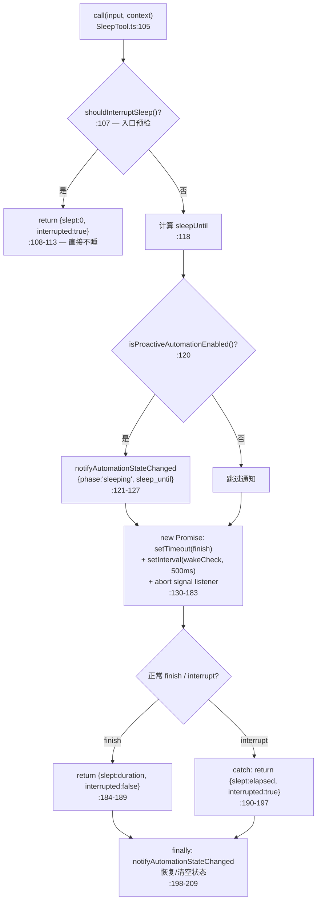
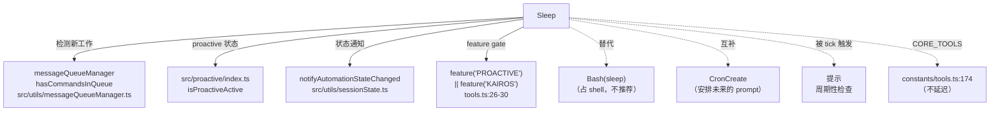

# SleepTool 工具详解

> 这是工具系统逐个拆解系列的调度类工具之一。`Sleep` 是一个**中等复杂度**的等待工具：让 Claude 睡眠指定秒数。表面看像 `Bash(sleep N)` 的等价物，但它有三个本质区别——**不占 shell 进程**、**可被新工作提前唤醒**、**与 proactive 自动化状态机联动**。它是 Claude Code "proactive 自动化"（模型主动安排未来工作）基础设施的一部分，与 CronCreate 三件套互补（Cron 是"安排未来的 prompt"，Sleep 是"模型自己现在歇会儿"）。

---

## 一、工具定位（一句话总结）

**`Sleep` = 可中断、可提前唤醒、不占 shell 的等待原语。**

| 维度 | 值 |
|---|---|
| 工具名 | `Sleep`（常量 `SLEEP_TOOL_NAME`，`prompt.ts:3`） |
| 一句话 | 睡眠指定秒数；用户可中断，新工作到来或 proactive 禁用时提前唤醒 |
| 是否进 system prompt | ✅ **在 `CORE_TOOLS` 白名单内**（`constants/tools.ts:174`，`SLEEP_TOOL_NAME`）—— 核心工具，schema 完整注入，**不延迟** |
| 注册条件（tools.ts） | `feature('PROACTIVE') || feature('KAIROS')` 门控（`tools.ts:26-30`、`:262`）—— 构建期决定是否注册 |
| feature gate | `PROACTIVE` 或 `KAIROS`（满足其一即注册） |
| 只读 / 破坏性 | **只读**（`isReadOnly() → true`，`SleepTool.ts:75-77`）—— 纯等待，无副作用 |
| 是否可并发 | ✅ **可并发**（`isConcurrencySafe() → true`，`:72-74`）—— prompt.ts 明确"可与其他工具并发调用" |
| 中断行为 | `interruptBehavior() → 'cancel'`（`:78-80`）—— 用户 ESC 时取消睡眠 |
| `strict` 模式 | ✅ `strict: true`（`:59`） |
| 核心依赖 | `src/utils/messageQueueManager.ts`（命令队列，检测新工作）+ `src/proactive/index.ts`（proactive 状态）+ `src/utils/sessionState.ts`（自动化状态通知） |
| 互补方 | `CronCreate`（安排未来的 prompt）、Bash(sleep)（占 shell，不推荐） |

**为什么需要它？** 在 proactive 自动化场景下，模型可能"现在无事可做，等一会儿再检查"。直接 `Bash(sleep 300)` 有三个问题：占用 shell 进程、无法被新工作提前唤醒、不与自动化状态机通信。`Sleep` 解决了这三点——它是个专用的"模型休息"原语。

> **关于 CORE_TOOLS 与 feature gate 的关系**：Sleep 的特殊之处在于——它**既在 `CORE_TOOLS` 里（不延迟）**，**又受 feature gate 控制（可能不注册）**。当 `PROACTIVE` 和 `KAIROS` 都关闭时，Sleep 根本不注册（tools.ts:262 条件展开）；当任一开启时，Sleep 注册并在 CORE_TOOLS 里，schema 完整注入 system prompt，**不走延迟发现**。这是"核心但可选"的工具——一旦启用就立即可见，不像 Cron/Monitor 那样需要 SearchExtraTools 发现。

---

## 二、关键文件清单

```
SleepTool/
├── SleepTool.ts          ← 工具主体（211 行），call() 含完整睡眠/中断逻辑
├── prompt.ts             ← 工具名常量 + DESCRIPTION + SLEEP_TOOL_PROMPT 文本
└── __tests__/
    └── SleepTool.test.ts ← 单元测试（40 行，测中断行为 + 提前唤醒）
```

| 文件 | 角色 | 必看行号 |
|---|---|---|
| `SleepTool.ts` | 工具主体：schema + call + 中断逻辑 + proactive 联动 | `buildTool:55`、`call:105`、`shouldInterruptSleep:51`、`SLEEP_WAKE_CHECK_INTERVAL_MS:9` |
| `prompt.ts` | 工具名 + 描述 + 详细 prompt（含 `<tick>` 提示说明） | `SLEEP_TOOL_NAME:3`、`DESCRIPTION:5`、`SLEEP_TOOL_PROMPT:7-17` |
| `__tests__/SleepTool.test.ts` | 测试：cancel 中断行为 + 队列工作提前唤醒 | `:14-39` |

> **结构特点**：SleepTool 是"单文件主体 + 独立 prompt.ts + 有测试"型。和 GlobTool 类似主体逻辑在一个文件，但**多了测试目录**（GlobTool 无独立测试）。`prompt.ts` 独立是因为 prompt 文本较长（含 `<tick>` 提示机制说明）且引用了 `TICK_TAG` 常量（`prompt.ts:1`，来自 `src/constants/xml.ts`）。

---

## 三、Tool 接口字段实现（`buildTool` 逐字段）

### 标识字段

```ts
name: SLEEP_TOOL_NAME,                      // "Sleep"（prompt.ts:3）
searchHint: 'wait pause sleep rest idle duration timer',  // :57，英文关键词簇
maxResultSizeChars: 1_000,                  // :58，极小——输出只有 slept_seconds + interrupted
strict: true,                               // :59
```

> **`searchHint` 是英文关键词簇**：虽然 Sleep 在 CORE_TOOLS 不延迟，但 searchHint 仍进 TF-IDF 索引（提升自然语言意图命中率）。六个同义词 "wait pause sleep rest idle duration timer" 覆盖了各种"等待"表达。

> **`maxResultSizeChars: 1_000`**：输出 schema 只有 `{ slept_seconds, interrupted }`，1 千字符足够。这是所有工具里最小的阈值之一，反映"等待结果本就简短"。

### 模型面字段

```ts
async description() { return DESCRIPTION }       // → "等待指定的时长"（prompt.ts:5）
async prompt()      { return SLEEP_TOOL_PROMPT }  // → 详细 prompt（prompt.ts:7-17）
get inputSchema()   { return inputSchema() }      // getter，懒加载
```

注意 Sleep **没有 outputSchema getter**——输出类型 `SleepOutput = { slept_seconds: number; interrupted: boolean }`（`:23`）是纯 TypeScript 类型，不走 Zod schema。这是因为输出极简，无需 schema 校验。

**输入 schema**（`:11-19`，`z.strictObject` + `lazySchema`）：
```ts
{
  duration_seconds: number,  // 必填，睡眠时长（秒）
}
```

### 行为字段（重点）

| 字段 | 实现 | 说明 |
|---|---|---|
| `call()` | `:105` | 核心逻辑（见下节） |
| `validateInput()` | ❌ 未声明 | 无需校验（duration 是 number，Zod 已保证类型） |
| `checkPermissions()` | ❌ 未声明 | 只读等待，无权限要求 |
| `isConcurrencySafe()` | `:72` → `true` | 可与其他工具并发 |
| `isReadOnly()` | `:75` → `true` | 纯等待无副作用 |
| `interruptBehavior()` | `:78` → `'cancel'` | 用户 ESC 时取消（而非 resume） |
| `userFacingName()` | `:82` → `"Sleep"` | 用户面显示名 |
| `toAutoClassifierInput()` | ❌ 未声明 | — |
| `getPath()` | ❌ 未声明 | 无文件系统操作 |

### 渲染字段

```ts
renderToolUseMessage(input)  // :86，显示 "睡眠：${secs}s"
mapToolResultToToolResultBlockParam(content, toolUseID)  // :91，区分 interrupted/正常
```

`mapToolResultToToolResultBlockParam`（`:91-103`）根据 `interrupted` 标志返回不同文本：
- `interrupted: true` → `"睡眠在 ${slept_seconds}s 后被中断"`
- `interrupted: false` → `"已睡眠 ${slept_seconds}s"`

注意 Sleep **没有 `renderToolResultMessage`**（无 JSX 渲染）——因为 `.ts` 文件而非 `.tsx`，结果只通过 `mapToolResultToToolResultBlockParam` 转纯文本给模型。

---

## 四、核心执行流程：`call()`

`SleepTool.call()`（`SleepTool.ts:105-210`）是三个工具里最复杂的——它不只是 `setTimeout`，而是个完整的中断/唤醒状态机。



**关键点逐条**：

1. **入口预检**（`:107-114`）：`shouldInterruptSleep()` 为 true 时**直接不睡**，返回 `{ slept_seconds: 0, interrupted: true }`。这处理"模型决定等待期间 proactive 被禁用或有新工作到来"的竞态——避免无谓睡眠。

2. **proactive 状态通知**（`:120-127`）：若 proactive 自动化启用，调用 `notifyAutomationStateChanged({ enabled: true, phase: 'sleeping', sleep_until })` 通知会话状态机"模型进入睡眠"。这让外部观察者（如 UI 状态栏、自动化编排器）知道当前状态。`finally` 块（`:198-209`）负责恢复——睡眠结束后清空 `sleep_until` 和 `phase`。

3. **三路中断源的 Promise**（`:130-183`）：核心是个 `new Promise`，内部注册三个中断源：
   - **正常超时**（`:165`）：`setTimeout(finish, duration_seconds * 1000)`——到点正常结束。
   - **用户 ESC 中断**（`:161-163`、`:172-174`）：监听 `context.abortController.signal` 的 `abort` 事件，触发 `interrupt()`。`interruptBehavior() → 'cancel'` 决定了中断后取消（而非 resume）。
   - **新工作提前唤醒**（`:178-182`）：`setInterval(wakeCheck, 500ms)` 每 500ms 调一次 `shouldInterruptSleep()`，若 true 则 `interrupt()`。这是"提前唤醒"的核心——**不等到完整时长**就因为新工作而醒来。

4. **`settled` 防重入**（`:133`、`:148`、`:155`）：三个中断源都可能触发，用 `settled` 标志保证只有第一个生效，后续的 no-op。`cleanup()`（`:135-145`）清理所有定时器和事件监听，防内存泄漏。

5. **结果分支**：
   - 正常 finish → `{ slept_seconds: duration_seconds, interrupted: false }`（`:184-189`）
   - interrupt（catch）→ `{ slept_seconds: elapsed, interrupted: true }`（`:190-197`），`elapsed` 是实际已睡秒数（`Math.round((now - startTime)/1000)`）

6. **`finally` 状态恢复**（`:198-209`）：无论正常结束还是中断，都调用 `notifyAutomationStateChanged` 恢复状态——proactive 启用时清空 sleep 字段，否则传 null。

> **`SLEEP_WAKE_CHECK_INTERVAL_MS = 500`**（`:9`）：唤醒检查间隔 500ms。这是个权衡——太短浪费 CPU，太长延迟感知新工作。500ms 让新工作最多半秒内被感知。

---

## 五、权限与安全

SleepTool 的权限模型是最简的——**纯只读等待，无副作用，无需权限**。

### 无 `validateInput`

Sleep 没有声明 `validateInput`。输入只有 `duration_seconds: number`，Zod schema 已保证类型正确性。极端值（如负数或超大数）不校验——`setTimeout` 对负数立即触发，对超大数正常等待（用户可 ESC 中断）。这是"输入足够简单时省略校验"的体现。

### 无 `checkPermissions`

Sleep 没有声明 `checkPermissions`。因为它：
- 不触碰文件系统
- 不执行 shell 命令
- 不访问网络
- 纯内存等待

走默认权限管道，无需特殊审批。

### `isReadOnly` + `isConcurrencySafe`（`:72-77`）

```ts
isConcurrencySafe() { return true }  // 可与其他工具并发
isReadOnly()        { return true }  // 纯等待无副作用
```

`prompt.ts:13-14`（SLEEP_TOOL_PROMPT）明确——"本工具可与其他工具并发调用——不会相互干扰"。这让模型可以同时 Sleep + 干别的（虽然语义上 Sleep 是"歇会儿"，但技术上支持并发）。

### `interruptBehavior: 'cancel'`（`:78-80`）

用户 ESC 中断时，睡眠被**取消**（而非 resume 到后台继续）。`SleepTool.test.ts:14-16` 测试了这一点：
```ts
test('declares cancel interrupt behavior', () => {
  expect(SleepTool.interruptBehavior()).toBe('cancel')
})
```

### 安全考量

- **不占 shell 进程**（`prompt.ts:15`）："请优先使用本工具而非 `Bash(sleep ...)`——它不会占用 shell 进程"。这是 Sleep 相对 Bash(sleep) 的核心安全/资源优势。
- **可中断**：用户随时 ESC，不会被迫等到完整时长。
- **proactive 联动**：与自动化状态机通信，避免"模型睡了但系统以为它在工作"的状态不一致。

---

## 六、与其他系统/工具的关系



- **与 `messageQueueManager` 的关系**：`hasQueuedWakeSignal()`（`:45-49`）调 `hasCommandsInQueue()` 检测是否有排队的工作。这是"提前唤醒"的数据源——新 prompt 入队时，Sleep 的 wakeCheck 会感知到并 interrupt。
- **与 proactive 自动化的关系**：Sleep 是 proactive 基础设施的一部分。`isProactiveAutomationEnabled()`（`:25-33`）和 `isProactiveSleepAllowed()`（`:35-43`）都动态 require `src/proactive/index.ts`（注意是**惰性 require**，避免模块加载循环）。`shouldInterruptSleep()`（`:51-53`）= `!isProactiveSleepAllowed() || hasQueuedWakeSignal()`。
- **与 `notifyAutomationStateChanged` 的关系**（`:6`、`:121`、`:199`）：睡眠前后通知会话状态机，让 UI/编排器感知"模型在睡眠"。这是自动化可观测性的关键。
- **与 `CronCreate` 的关系**：互补。Cron 是"安排一个**未来的 prompt**"（模型不在场，到点被唤醒入队）；Sleep 是"**模型现在自己歇会儿**"（模型在场，被动等待）。Cron 持久化跨会话，Sleep 随会话结束。
- **与 `Bash(sleep)` 的关系**：Sleep 是 Bash(sleep) 的推荐替代品。`prompt.ts:15` 明确引导模型优先用 Sleep。区别：Sleep 不占 shell、可提前唤醒、与 proactive 联动。
- **与 `<tick>` 提示的关系**（`prompt.ts:11`）：Sleep 的 prompt 提到"你可能会收到 `<tick>` 提示——这些是周期性检查。在睡眠前先寻找有用的工作来做"。`<tick>` 是 Claude Code 的周期性唤醒机制，Sleep 与之配合——tick 唤醒模型，模型决定是否 Sleep。
- **与 `CORE_TOOLS` 的关系**：Sleep 在 CORE_TOOLS（`:174`），一旦注册就完整注入 system prompt，**不延迟**。这与 Cron/Monitor（延迟工具）形成对比。

---

## 七、亮点与设计取舍

1. **三路中断源的状态机**（`:130-183`）：Sleep 不是简单 setTimeout，而是同时监听"正常超时 + 用户 ESC + 新工作唤醒"三个源。`settled` 标志防重入，`cleanup()` 防泄漏。这是"等待"语义的完整实现——真正的可中断、可唤醒。

2. **惰性 require 避免循环**（`:31-32`、`:41-42`、`:47-48`）：对 `src/proactive/index.ts` 和 `messageQueueManager` 用 `require()` 而非顶层 `import`。注释 `:30` 隐含——proactive 模块可能反向依赖 SleepTool 所在的模块图，顶层 import 会循环。惰性 require 把依赖解析推迟到调用时，打破循环。这是 monorepo 中常见的模块解耦技巧。

3. **入口预检避免无谓睡眠**（`:107-114`）：`call()` 一开始就检查 `shouldInterruptSleep()`，若已有新工作或 proactive 禁用，直接返回 `{ slept: 0, interrupted: true }`。这处理"模型决定等待的瞬间，状态已变"的竞态——避免注册一堆定时器又立即 interrupt。

4. **proactive 状态通知的对称性**（`:120-127` + `:198-209`）：睡眠前通知 `phase: 'sleeping'`，结束后（finally）清空。这种"进入-退出"对称通知让外部观察者能准确追踪状态。finally 块保证无论正常结束还是中断都恢复——防状态泄漏。

5. **不占 shell 进程**（`prompt.ts:15`）：这是 Sleep 相对 Bash(sleep) 的核心价值。shell 进程是有限资源（BashTool 有并发限制），Sleep 用纯 JS 定时器（setTimeout/setInterval）实现，不消耗 shell 池。

6. **`interruptBehavior: 'cancel'`**（`:78-80`）：明确声明中断行为为 cancel。这让工具执行框架知道——用户 ESC 时直接取消 Promise（reject），而非尝试 resume。对比某些工具可能用 `'resume'`（中断后后台继续），Sleep 选择 cancel 因为"睡眠被中断=用户有新意图"，没必要继续睡。

7. **在 CORE_TOOLS 但受 feature gate**：Sleep 的独特定位——核心工具（不延迟）但可选（feature gate）。一旦 PROACTIVE/KAIROS 启用，Sleep 立即可见于 system prompt，无需 SearchExtraTools 往返。这反映了"proactive 启用后 Sleep 是高频原语"的设计判断。

8. **无 outputSchema 的极简输出**：输出类型是纯 TS 类型（`:23`），不走 Zod。因为 `{ slept_seconds, interrupted }` 极简且只供模型读，无需 schema 校验/序列化。这是"按需引入 schema 复杂度"的体现。

9. **500ms 唤醒检查间隔的权衡**（`:9`）：`SLEEP_WAKE_CHECK_INTERVAL_MS = 500`。太短浪费 CPU 轮询，太长延迟感知新工作。500ms 让新工作最多半秒内被感知——对"提醒我"类场景足够灵敏，对 CPU 友好。

---

## 八、源码导航（书签速查）

| 想看什么 | 去哪里 |
|---|---|
| 工具名常量 + 描述 + prompt | `SleepTool/prompt.ts:3,5,7-17` |
| `<tick>` 提示说明 | `prompt.ts:11`（引用 `TICK_TAG`） |
| `buildTool` 字段填充 | `SleepTool.ts:55-211` |
| 输入 schema | `SleepTool.ts:11-19` |
| `call()` 核心逻辑（状态机） | `SleepTool.ts:105-210` |
| `shouldInterruptSleep()`（唤醒判定） | `SleepTool.ts:51-53` |
| 三路中断源（setTimeout/abort/wakeCheck） | `SleepTool.ts:130-183` |
| proactive 状态通知 | `SleepTool.ts:120-127,198-209` |
| `interruptBehavior: 'cancel'` | `SleepTool.ts:78-80` |
| `SLEEP_WAKE_CHECK_INTERVAL_MS`（500ms） | `SleepTool.ts:9` |
| 命令队列（新工作检测） | `src/utils/messageQueueManager.ts:hasCommandsInQueue` |
| proactive 状态 | `src/proactive/index.ts:isProactiveActive` |
| 自动化状态通知 | `src/utils/sessionState.ts:notifyAutomationStateChanged` |
| feature gate 注册 | `src/tools.ts:26-30,262` |
| CORE_TOOLS 白名单（不延迟） | `src/constants/tools.ts:174` |
| 测试（中断 + 提前唤醒） | `SleepTool/__tests__/SleepTool.test.ts:14-39` |

---

## 九、学习建议与验证清单

**怎么读这章**：先扫"一、工具定位"理解 Sleep 与 Bash(sleep) 的本质区别（不占 shell + 可唤醒 + proactive 联动），再跳到"四、call()"看三路中断状态机（这是最复杂的部分），最后对照"六、与其他系统"理解 proactive 生态。

**验证清单（读完自测）**：
- [ ] 能说出 Sleep 与 Bash(sleep) 的三个本质区别（不占 shell、可提前唤醒、proactive 联动）
- [ ] 能指出 Sleep **在** `CORE_TOOLS`（不延迟），但受 `feature('PROACTIVE')||feature('KAIROS')` 门控
- [ ] 能解释三路中断源（正常超时 / 用户 ESC / 新工作唤醒）和 `settled` 防重入机制
- [ ] 能说出 `shouldInterruptSleep()` 的两个判定条件（`!isProactiveSleepAllowed() || hasQueuedWakeSignal()`）
- [ ] 能解释为什么用惰性 `require` 而非顶层 import（打破 proactive 模块循环依赖）
- [ ] 能指出入口预检（`:107-114`）处理的竞态场景（决定等待瞬间状态已变）
- [ ] 能解释 `notifyAutomationStateChanged` 的进入-退出对称性（phase:sleeping → 清空，finally 保证恢复）
- [ ] 能说出 `interruptBehavior: 'cancel'` 的语义（ESC 时取消而非 resume）
- [ ] 能解释 500ms 唤醒检查间隔的权衡（CPU vs 灵敏度）
- [ ] 能说出 Sleep 与 CronCreate 的分工（模型现在歇会儿 vs 安排未来 prompt）

**配合动作**：
1. 让 Claude `Sleep` 5 秒，观察返回的 `slept_seconds` 和 `interrupted: false`
2. Sleep 期间 ESC 中断，验证 `interrupted: true` 和实际已睡秒数
3. 运行 `SleepTool.test.ts`（`bun test .../SleepTool.test.ts`），观察"队列工作提前唤醒"测试
4. 在 `:178` wakeCheck 加日志，观察 500ms 轮询频率
5. 对比 `Bash(sleep 5)` 的行为，体会"不占 shell"的资源差异
6. 启用 proactive（`feature('PROACTIVE')`），观察 `notifyAutomationStateChanged` 的状态变化
