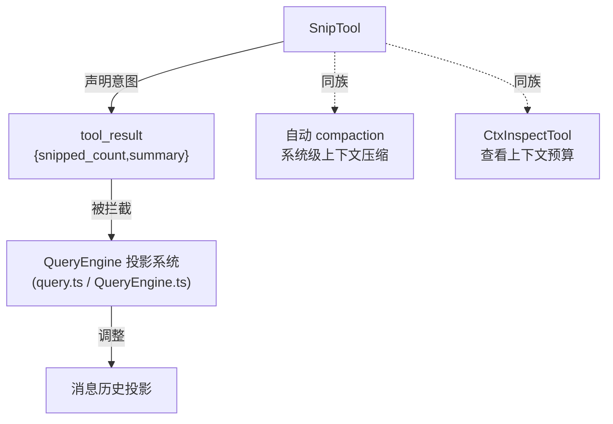

# Snip 工具详解

> 这是工具系统逐个拆解系列的一篇。`Snip` 是一个**中等复杂度**的上下文管理工具：它让模型主动从历史中剪除不再需要的消息（尤其是大型工具输出），被剪除的内容会被替换为简短总结。它的特别之处在于——`call()` 本身几乎不做事，真正的剪除逻辑由**查询引擎的投影系统**拦截工具结果来实现。这是"工具作为意图声明、引擎作为执行者"模式的典型范例。

---

## 一、工具定位（一句话总结）

**`Snip` = 让模型主动剪除历史消息以释放上下文窗口的上下文管理工具。**

| 维度 | 值 |
|---|---|
| 工具名 | `Snip`（常量 `SNIP_TOOL_NAME`，`prompt.ts:1`） |
| 一句话 | 指定 message_ids 列表，引擎把这些消息替换为紧凑总结 |
| 是否进 system prompt | ❌ 不在 `CORE_TOOLS` 白名单；在 `tools.ts:140-142` 受 `feature('HISTORY_SNIP')` 门控，`:272` 条件注册 |
| 只读 / 破坏性 | **破坏性**（`isReadOnly() → false`，`SnipTool.ts:58`）——会移除消息内容 |
| 是否可并发 | ❌ **不可并发**（`isConcurrencySafe() → false`，`:54`）——修改共享历史 |
| 激活门控 | `feature('HISTORY_SNIP')`（构建期，`tools.ts:140`） |
| 核心依赖 | 查询引擎的投影系统（外部拦截，本文件无直接依赖） |

**为什么需要它？** 上下文窗口有限，模型在长会话中会积累大量大型工具输出（文件读取、命令输出）。与其等系统自动 compaction，不如让模型在"确信不再需要逐字引用"时主动剪除。这给了模型对上下文预算的主动控制权。

---

## 二、关键文件清单

```
SnipTool/
├── SnipTool.ts   ← buildTool({...}) 主体（92 行），全部逻辑集中
└── prompt.ts     ← 工具名常量 SNIP_TOOL_NAME（2 行）
```

| 文件 | 角色 | 必看行号 |
|---|---|---|
| `SnipTool.ts` | 主体：schema + call() + 权限标记 | `buildTool:27`、`call:81`、`prompt:40` |
| `prompt.ts` | 工具名常量 | `SNIP_TOOL_NAME:1` |

> **结构特点**：极简单文件主体。工具名常量拆出 `prompt.ts` 仅含一行。真正的剪除实现不在本目录——它由查询引擎（`QueryEngine.ts` / `query.ts` 的投影系统）拦截本工具的结果来执行。

---

## 三、Tool 接口字段实现（`buildTool` 逐字段）

### 标识字段

```ts
name: SNIP_TOOL_NAME,                                // "Snip"
searchHint: 'snip trim history remove old messages compact context',
maxResultSizeChars: 5_000,
strict: true,                                        // 严格模式
```

### 模型面字段

```ts
async description() { return '从对话历史中剪除消息以释放上下文空间' }
async prompt()      { return `从对话历史中剪除消息以释放上下文窗口空间...` }
get inputSchema()   // lazySchema + z.strictObject
```

**输入 schema**（`:7-21`）：
```ts
{
  message_ids: string[],   // 必填，要剪除的消息 ID
  reason?: string,         // 可选，剪除原因，用于总结替换
}
```

**输出类型**（`:25`，无 outputSchema getter）：
```ts
{ snipped_count: number, summary: string }
```

### 行为字段

| 字段 | 实现 | 说明 |
|---|---|---|
| `call()` | `:81` | 仅返回意图数据，不执行真正剪除（见下节） |
| `isConcurrencySafe()` | `:54` → `false` | 修改共享历史，不可并发 |
| `isReadOnly()` | `:58` → `false` | 破坏性（移除内容） |
| `userFacingName()` | `:61` → `'Snip'` | |
| `renderToolUseMessage` | `:65` → `剪除：N 条消息` | |
| `mapToolResultToToolResultBlockParam` | `:70` | `已剪除 N 条消息。总结：<summary>` |

> **注意**：本工具**没有** `validateInput` / `checkPermissions` / `isEnabled`。权限与校验完全由 `strict: true` + 引擎层处理。

---

## 四、核心执行流程：`call()`

`call()`（`SnipTool.ts:81-91`）是本工具最反直觉的部分——**它不执行真正的剪除**：

```ts
async call(input: SnipInput) {
  // 剪除的实现由查询引擎的投影系统处理。
  // 工具调用本身仅记录意图；查询引擎会拦截
  // 剪除工具的结果，并相应调整其消息投影。
  return {
    data: {
      snipped_count: input.message_ids.length,
      summary: input.reason ?? `已剪除 ${input.message_ids.length} 条消息`,
    },
  }
}
```


**关键点**：

1. **工具即意图声明**：`call()` 只是把模型的剪除意图结构化为 `{snipped_count, summary}`。注释 `:82-84` 明确——真正的剪除由查询引擎的投影系统在拦截到本工具的 `tool_result` 时执行。
2. **总结来源**（`:88`）：优先用 `input.reason`（模型给出的人类可读原因），否则用默认文案 `已剪除 N 条消息`。
3. **`isConcurrencySafe: false`** 的原因：剪除会修改所有调用方共享的历史投影，并发执行会产生竞态。

> 这种"工具声明意图、引擎执行副作用"的架构，让剪除逻辑集中在引擎层（单一真相源），工具层保持薄。对比 `BriefTool` 把上传逻辑拉进工具内部——两种风格各有取舍。

---

## 五、权限与安全

SnipTool 没有自定义 `checkPermissions` / `validateInput`：

- **`strict: true`**（`:31`）：Zod 严格模式拦截非法输入（多余字段报错）。
- **破坏性标记**：`isReadOnly() → false`（`:58`）让权限/审批系统知道这是有副作用的操作。
- **真实剪除逻辑在引擎层**：本文件无法看到具体的安全校验（如是否允许剪除特定消息、是否需要用户确认）。这部分属于 `QueryEngine.ts` 的投影系统职责。

> 由于剪除不可撤销（`prompt` 明确"原始内容会从上下文中移除"），引擎层理应有保护机制，但这超出了本工具文件的范畴。

---

## 六、与其他系统/工具的关系



- **与查询引擎投影系统**：核心关系。工具只是前端，引擎是后端执行者。模型调用 Snip → 引擎拦截结果 → 调整后续 API 调用看到的历史。
- **与自动 compaction**：互补关系。compaction 是系统在接近窗口上限时自动触发；Snip 是模型主动、选择性地剪除。Snip 给了模型更细粒度的控制。
- **与 `CtxInspectTool`**：配套使用——先 CtxInspect 看上下文预算，再 Snip 剪除冗余。

---

## 七、亮点与设计取舍

1. **"工具即意图、引擎即执行"架构**（`:82-84`）：把剪除这种有状态、影响全局的副作用集中在引擎层，工具层只做意图声明。这是处理"需要跨调用方协调的副作用"的优雅模式。
2. **`reason` 字段双用途**（`:88`）：既是给总结的内容，也是模型解释剪除动机的记录。
3. **`isConcurrencySafe: false` + `isReadOnly: false`**：诚实标记破坏性与不可并发性，让权限/调度系统正确对待。
4. **`strict: true`**：防止模型幻觉多余参数。
5. **不设 `outputSchema` getter**：只用 TS 类型 `SnipOutput`（`:25`），输出结构简单到不需要运行时 schema 校验。

---

## 八、源码导航（书签速查）

| 想看什么 | 去哪里 |
|---|---|
| 工具名常量 | `SnipTool/prompt.ts:1` |
| `buildTool` 字段填充 | `SnipTool/SnipTool.ts:27-92` |
| 输入 schema | `SnipTool.ts:7-21` |
| `call()`（意图声明） | `SnipTool.ts:81-91` |
| prompt 描述（使用准则） | `SnipTool.ts:41-51` |
| feature gate 注册 | `src/tools.ts:140-142, 272` |

---

## 九、学习建议与验证清单

**怎么读这章**：核心是理解"四、call()"里工具不执行真正剪除这一反直觉设计。读完要明白 Snip 是"前端意图声明"，引擎投影系统才是"后端执行者"。

**验证清单（读完自测）**：
- [ ] 能解释为什么 `call()` 不执行真正的剪除（由引擎投影系统拦截执行）
- [ ] 能说出 `isConcurrencySafe` 返回 `false` 的原因（修改共享历史）
- [ ] 能找到 feature gate（`HISTORY_SNIP`，`tools.ts:140`）
- [ ] 能说出 `reason` 字段的双重作用（总结内容 + 动机记录）
- [ ] 能指出 Snip 与自动 compaction 的区别（模型主动选择性 vs 系统自动全量）

**配合动作**：
1. 在 `call()` 返回处加日志，确认它确实只返回意图
2. 在 `QueryEngine.ts` 搜索 `Snip` / `snipped`，找到投影系统的拦截逻辑（本报告未深入引擎层）
3. 构造长会话，让模型在上下文接近上限时调用 Snip，观察历史是否被压缩
