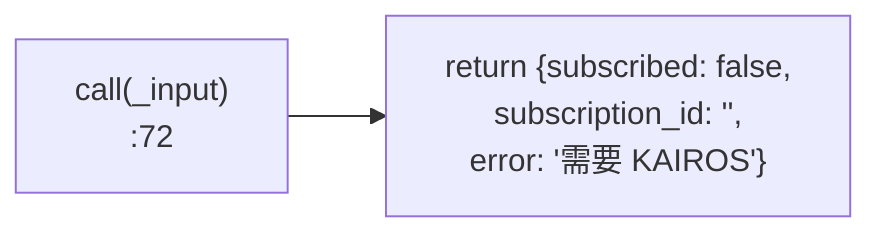
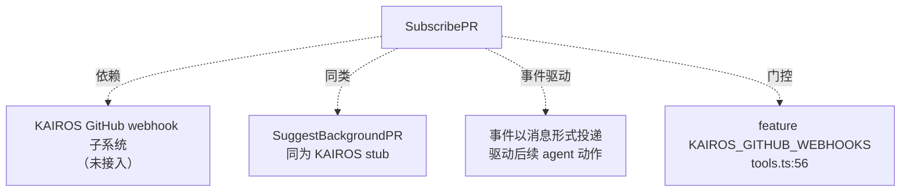

# SubscribePR 工具详解

> `SubscribePR` 在当前代码库中是一个 **stub（桩）工具**：它的 schema、描述、渲染层齐全，但 `call()` 体不执行任何真实订阅逻辑，直接返回 `{subscribed: false, error: '需要 KAIROS GitHub webhook 子系统'}`。真实实现依赖 KAIROS runtime，而该 runtime 在本逆向版中未启用。它代表了一类"接口已就位、后端未接通"的工具——理解它的价值在于看 Claude Code 如何为外部子系统预留工具接口。

---

## 一、工具定位（一句话总结）

**`SubscribePR` = 预留给 KAIROS webhook 子系统的 PR 事件订阅工具（当前 stub）。**

| 维度 | 值 |
|---|---|
| 工具名 | `SubscribePR`（常量 `SUBSCRIBE_PR_TOOL_NAME`，`SubscribePRTool.ts:6`） |
| 一句话 | 订阅 GitHub PR 的评论/评审/CI/合并/关闭事件；无 KAIROS 时返回失败 |
| 是否进 system prompt | ❌ 受 feature flag `KAIROS_GITHUB_WEBHOOKS` 门控（`tools.ts:56`），默认禁用 |
| 只读 / 破坏性 | **只读**（`isReadOnly() → true`，`:45`）——订阅本身被视为无副作用查询 |
| 是否可并发 | ✅ **可并发**（`isConcurrencySafe() → true`，`:42`） |
| 启用条件 | `feature('KAIROS_GITHUB_WEBHOOKS')` 为真才注册（`tools.ts:56-59`） |
| 核心依赖 | 无（call 体无外部调用） |
| 定位互补方 | `SuggestBackgroundPR`（同为 KAIROS 相关 stub） |

**为什么需要它？** 在完整的 KAIROS 工作流中，Claude 可以监控自己创建或正在评审的 PR——当 PR 收到评论、CI 状态变化、被合并时，事件以可处理的消息投递回来，驱动后续 agent 动作。本工具是这条事件驱动链的订阅入口。但在当前逆向版中，KAIROS runtime 未接入，故保留为 stub。

---

## 二、关键文件清单

```
SubscribePRTool/
└── SubscribePRTool.ts   ← 全部逻辑（83 行，单文件）
```

| 文件 | 角色 | 必看行号 |
|---|---|---|
| `SubscribePRTool.ts` | 工具主体：schema + 描述 + stub call + 渲染全在这 | `buildTool:23`、`call:72`、schema `:8-17` |

> **结构特点**：极简单文件工具。没有独立的 `prompt.ts`/`UI.tsx`/`constants.ts`——工具名、prompt、渲染都内联在主文件里。这与 GlobTool 的"多文件分离"形成对比，适合逻辑极简的工具。

---

## 三、Tool 接口字段实现（`buildTool` 逐字段）

### 标识字段

```ts
name: SUBSCRIBE_PR_TOOL_NAME,       // "SubscribePR"（内联常量，:6）
searchHint: 'subscribe pull request github webhook events watch',
maxResultSizeChars: 5_000,          // 比 GlobTool 的 10 万小很多——结果简单
strict: true,                       // 严格模式
```

> **`strict: true`**：该标志启用工具的严格调用模式（模型必须严格遵循 schema，多余字段报错）。GlobTool 没有此字段。

### 模型面字段

```ts
async description() { return '通过 GitHub webhook 订阅 pull request 事件' }
async prompt()      { return `订阅 GitHub pull request 上的事件...` }  // 内联
get inputSchema()  { return inputSchema() }
```

**输入 schema**（`:8-17`）：
```ts
{
  repo: string,                                        // 必填，owner/repo 格式
  pr_number: number,                                   // 必填，PR 编号
  events?: ('comment'|'review'|'ci'|'merge'|'close')[] // 可选，默认全部
}
```

**输出类型**（`:21`）：
```ts
{ subscribed: boolean, subscription_id: string }  // 注：call 还附加 error 字段
```

### 行为字段

| 字段 | 实现 | 说明 |
|---|---|---|
| `call()` | `:72` | **stub**——直接返回失败（见下节） |
| `isConcurrencySafe()` | `:42` → `true` | 订阅查询可并发 |
| `isReadOnly()` | `:45` → `true` | 无副作用（订阅被视为查询） |
| `userFacingName()` | `:49` → `'SubscribePR'` | UI 显示名 |
| `renderToolUseMessage` | `:53` | 显示"订阅 PR：owner/repo#123" |
| `mapToolResultToToolResultBlockParam` | `:59` | 按 `subscribed` 布尔值返回不同文本 |

> **缺失的字段**：没有 `validateInput`、`checkPermissions`、`isEnabled`、`getPath`、`shouldDefer`。这是一个"最小可用工具"的字段集——只够声明 + 渲染 + 返回。

---

## 四、核心执行流程：`call()`

`call()`（`SubscribePRTool.ts:72-82`）是本系列中最简单的——**什么都不做，直接返回失败**：

```ts
async call(_input: SubscribeInput) {
  // webhook 订阅由 KAIROS GitHub webhook 子系统管理。
  // 没有 KAIROS runtime 时，该工具不可用。
  return {
    data: {
      subscribed: false,
      subscription_id: '',
      error: 'SubscribePR 需要 KAIROS GitHub webhook 子系统。',
    },
  }
}
```



**关键点**：

1. **`_input` 下划线前缀**：参数未使用，仅保留签名以符合 Tool 接口。
2. **注释明确归属**（`:73-74`）：真实订阅逻辑在 KAIROS GitHub webhook 子系统中，本工具只是接口层。
3. **返回 `error` 字段**：虽然 Output 类型（`:21`）只声明 `subscribed` 和 `subscription_id`，但实际返回多了 `error` 字段——这是 stub 的典型模式，向模型/用户传达"为何不可用"。
4. **`mapToolResultToToolResultBlockParam`**（`:59-70`）：根据 `subscribed` 布尔值返回"已订阅（id：xxx）"或"订阅失败"。stub 场景下模型会看到"订阅 PR 事件失败"，从而知道功能未接通。

> **与真实工具的对比**：GlobTool 的 `call()` 调用 `glob()` 核心实现并返回真实数据；SubscribePR 的 `call()` 是空壳。这种"接口先行、后端后接"的模式在大型系统中常见——先定义工具契约，让模型学会调用，再逐步接通后端。

---

## 五、权限与安全

SubscribePR 没有自定义 `checkPermissions()`，安全控制极简：

1. **feature flag 门控**（`tools.ts:56-59`）：`feature('KAIROS_GITHUB_WEBHOOKS')` 为真才注册。默认（CLAUDE.md 列出的 build features）该 flag **未启用**，所以工具根本不出现在工具列表。
2. **`isReadOnly() → true`**：订阅被视为只读查询，权限管道相对宽松。
3. **stub 不接触敏感数据**：call 体无网络调用、无文件写入，即使被调用也无副作用——这是 stub 的"安全兜底"。

> 由于是 stub，权限模型几乎不适用。真实实现接入后，订阅可能涉及 GitHub token、webhook 注册等敏感操作，届时需补充权限校验。

---

## 六、与其他系统/工具的关系



- **与 KAIROS 子系统**：本工具是 KAIROS GitHub webhook 子系统的"工具面入口"。KAIROS 是一个更大的后台任务/事件驱动框架（CLAUDE.md 列为 P2 feature `KAIROS`、`KAIROS_BRIEF`）。
- **与 `SuggestBackgroundPR`**：同为 KAIROS 相关的 stub 工具，结构几乎一致（schema + stub call），都受 feature flag 门控（SuggestBackgroundPR 受 `USER_TYPE==='ant'` 限制，见 `tools.ts:21-25`）。
- **与事件驱动 agent**：完整实现下，PR 事件会作为消息投递给 agent，形成"订阅 → 事件 → 响应"的闭环。

---

## 七、亮点与设计取舍

1. **接口契约完整、后端空缺**：schema、描述、渲染、结果映射全部就位，只有 `call()` 体待实现。这种"先占坑"的方式让模型在 KAIROS 接入后无需重新学习工具调用。
2. **`strict: true`**：启用严格调用模式，确保未来接入后端时模型不会传多余参数。
3. **stub 返回 `error` 字段**：超出 Output 类型声明，但向调用方清晰传达"为何不可用"，比静默失败更友好。
4. **feature flag 双重门控**：注册层（`tools.ts:56`）+ 运行时（call 内的逻辑，虽未显式检查 flag）。注册层门控保证默认环境下工具不可见，避免误导模型。
5. **`maxResultSizeChars: 5_000`**：远小于 GlobTool 的 10 万——因为订阅结果就是一两个字段，无需大缓冲。
6. **事件类型枚举预定义**（`:13`）：`comment/review/ci/merge/close` 五种事件类型用 `z.enum` 固化，为未来实现提供清晰的契约边界。

---

## 八、源码导航（书签速查）

| 想看什么 | 去哪里 |
|---|---|
| 工具名常量（内联） | `SubscribePRTool/SubscribePRTool.ts:6` |
| `buildTool` 字段填充 | `SubscribePRTool.ts:23-83` |
| 输入 schema | `SubscribePRTool.ts:8-17` |
| stub `call()` | `SubscribePRTool.ts:72-82` |
| 结果文本映射 | `SubscribePRTool.ts:59-70` |
| feature flag 门控 | `src/tools.ts:56-59` |

---

## 九、学习建议与验证清单

**怎么读这章**：把 SubscribePR 当作"stub 工具的标准范式"来读。重点不是它的业务逻辑（没有），而是 Claude Code 如何为未接通的外部子系统预留工具接口。

**验证清单（读完自测）**：
- [ ] 能说出 SubscribePR 当前是 stub，`call()` 直接返回失败
- [ ] 能指出 feature flag 门控位置（`tools.ts:56`，`KAIROS_GITHUB_WEBHOOKS`）
- [ ] 能说出五种事件类型（comment/review/ci/merge/close）
- [ ] 能解释 `strict: true` 的作用（严格调用模式）
- [ ] 能说出 stub 为何返回额外 `error` 字段（向调用方传达不可用原因）
- [ ] 能对比 SubscribePR 与 GlobTool 的结构差异（单文件内联 vs 多文件分离）

**配合动作**：
1. 设置 `FEATURE_KAIROS_GITHUB_WEBHOOKS=1` 运行 dev 模式，观察工具是否出现在列表
2. 调用 SubscribePR，验证返回 `{subscribed: false, error: ...}`
3. 对比 `SuggestBackgroundPRTool.ts`，观察两个 stub 的结构相似性
