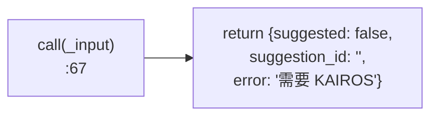
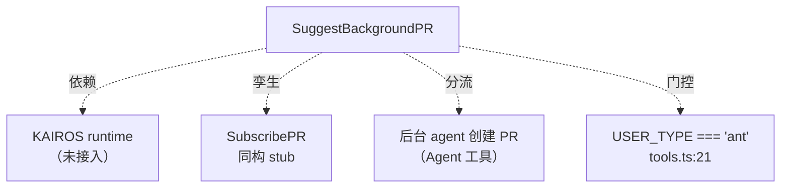

# SuggestBackgroundPR 工具详解

> `SuggestBackgroundPR` 与 `SubscribePR` 是一对孪生 stub：schema/描述/渲染齐全，但 `call()` 体直接返回 `{suggested: false, error: '需要 KAIROS runtime'}`。它的语义是"识别出应做但不属于当前任务的改进，建议在后台开 PR 处理"，属于 KAIROS 后台任务框架的工具面。理解它的价值在于：它是 Claude Code "非阻塞式工作分流"理念的接口体现——把次要工作推迟到后台，保持当前会话专注。

---

## 一、工具定位（一句话总结）

**`SuggestBackgroundPR` = 建议后台 agent 创建 PR 的 stub 工具（当前无后端）。**

| 维度 | 值 |
|---|---|
| 工具名 | `SuggestBackgroundPR`（常量 `SUGGEST_BACKGROUND_PR_TOOL_NAME`，`:6`） |
| 一句话 | 记录一个"后台 PR 建议"；无 KAIROS 时返回失败 |
| 是否进 system prompt | ❌ 受 `USER_TYPE === 'ant'` 门控（`tools.ts:21-25`），仅内部用户可见 |
| 只读 / 破坏性 | **只读**（`isReadOnly() → true`，`:43`）——"建议"本身不产生副作用 |
| 是否可并发 | ✅ **可并发**（`isConcurrencySafe() → true`，`:39`） |
| 启用条件 | `process.env.USER_TYPE === 'ant'`（`tools.ts:22`） |
| 核心依赖 | 无（call 体空） |
| 定位互补方 | `SubscribePR`（同为 KAIROS stub）、`Agent`（后台任务的实际执行者） |

**为什么需要它？** 在 agent 工作中，常遇到"顺手能改但偏离当前任务"的改进（如重构、补注释、修小 bug）。直接做会分散当前会话焦点；忽略又显得低效。SuggestBackgroundPR 提供第三条路：把改进记为"建议"，由后台 agent 异步开 PR。这实现了**关注点分离**——当前会话保持专注，次要工作进入后台队列。当前 stub 状态意味着这条链路的后端（KAIROS）未接通。

---

## 二、关键文件清单

```
SuggestBackgroundPRTool/
└── SuggestBackgroundPRTool.ts   ← 全部逻辑（77 行，单文件）
```

| 文件 | 角色 | 必看行号 |
|---|---|---|
| `SuggestBackgroundPRTool.ts` | 工具主体：schema + 描述 + stub call + 渲染全在这 | `buildTool:20`、`call:67`、schema `:8-14` |

> **结构特点**：与 SubscribePR 完全同构——单文件、内联常量/prompt/渲染。这两个工具几乎是模板复制的关系，差异仅在业务语义（订阅事件 vs 建议改进）。

---

## 三、Tool 接口字段实现（`buildTool` 逐字段）

### 标识字段

```ts
name: SUGGEST_BACKGROUND_PR_TOOL_NAME,  // "SuggestBackgroundPR"（内联，:6）
searchHint: 'suggest background pr pull request create',
maxResultSizeChars: 5_000,
strict: true,
```

### 模型面字段

```ts
async description() { return '建议为后续改动创建后台 PR' }
async prompt()      { return `建议在后台创建一个 pull request...` }  // 内联
get inputSchema()  { return inputSchema() }
```

**输入 schema**（`:8-14`）：
```ts
{
  title: string,        // 必填，建议的 PR 标题
  description: string,  // 必填，PR 要做的改动描述
  branch?: string,      // 可选，分支名（省略时自动生成）
}
```

**输出类型**（`:18`）：
```ts
{ suggested: boolean, suggestion_id: string }  // call 附加 error 字段
```

### 行为字段

| 字段 | 实现 | 说明 |
|---|---|---|
| `call()` | `:67` | **stub**——直接返回失败 |
| `isConcurrencySafe()` | `:39` → `true` | 建议记录可并发 |
| `isReadOnly()` | `:43` → `true` | 无副作用 |
| `userFacingName()` | `:47` → `'SuggestPR'` | UI 显示名（注意：不同于工具名） |
| `renderToolUseMessage` | `:50` | 显示"建议 PR：{title}" |
| `mapToolResultToToolResultBlockParam` | `:54` | 按 `suggested` 返回不同文本 |

> **`userFacingName` 与 `name` 不一致**：工具名是 `SuggestBackgroundPR`，但 `userFacingName()` 返回 `'SuggestPR'`（`:47`）。这是有意的 UI 简化——终端显示用更短的名称。对比 SubscribePR 的 `userFacingName()` 返回 `'SubscribePR'`（与工具名一致）。

---

## 四、核心执行流程：`call()`

`call()`（`SuggestBackgroundPRTool.ts:67-77`）与 SubscribePR 同构——**直接返回失败**：

```ts
async call(_input: SuggestInput) {
  // 后台 PR 建议需要 KAIROS runtime。
  return {
    data: {
      suggested: false,
      suggestion_id: '',
      error: 'SuggestBackgroundPR 需要 KAIROS runtime。',
    },
  }
}
```



**关键点**：

1. **`_input` 未使用**：参数仅保留签名。
2. **注释归属**（`:68`）：明确真实逻辑需要 KAIROS runtime。
3. **返回 `error` 字段**：超出 Output 类型（`:18`）声明，向调用方传达不可用原因。
4. **`mapToolResultToToolResultBlockParam`**（`:54-65`）：`suggested` 为真返回"已记录 PR 建议（id：xxx）"，为假返回"记录失败"。stub 下模型看到"记录 PR 建议失败"，从而知道功能未接通。

> **完整实现下的预期行为**（基于 prompt 推断）：建议会呈现给用户，用户批准后后台 agent 创建该 PR。这是"人机协作的后台工作分流"——agent 提议，人决策，后台执行。

---

## 五、权限与安全

SuggestBackgroundPR 没有自定义 `checkPermissions()`，安全控制极简：

1. **`USER_TYPE === 'ant'` 门控**（`tools.ts:21-25`）：仅 Anthropic 内部用户可见。注意这是**比 SubscribePR 更严格**的门控——SubscribePR 用 feature flag（`KAIROS_GITHUB_WEBHOOKS`），SuggestBackgroundPR 用环境变量（`USER_TYPE`）。两者机制不同。
2. **`isReadOnly() → true`**：建议记录无副作用。
3. **stub 无副作用**：call 体无网络/文件操作。

> **门控差异的意义**：`USER_TYPE === 'ant'` 是"内部用户"硬门控（编译期/启动期决定），feature flag 是"功能灰度"软门控（可动态开关）。SuggestBackgroundPR 用前者，说明它更接近内部实验功能，未到灰度阶段。

---

## 六、与其他系统/工具的关系



- **与 KAIROS 子系统**：同 SubscribePR，是 KAIROS 后台任务框架的工具面。KAIROS 负责后台 agent 调度、PR 创建执行。
- **与 `SubscribePR`**：结构孪生（schema + stub call），差异在门控（USER_TYPE vs feature flag）和业务语义（建议 vs 订阅）。
- **与 `Agent` 工具**：完整实现下，SuggestBackgroundPR 记录的建议会被 KAIROS 转化为后台 agent 任务（通过 Agent 工具执行）。
- **与 `SendMessage`/通知系统**：后台 PR 完成后可能通过通知机制告知用户。

---

## 七、亮点与设计取舍

1. **"建议而非执行"的语义**：工具名叫 `Suggest...` 而非 `Create...`——明确这是非阻塞的提议，最终决策权在用户。这体现了 agent 设计中"主动但不越权"的原则。
2. **必填 `description`**（`:11`）：与 SubscribePR 的 `events` 可选不同，SuggestBackgroundPR 要求必填描述——因为建议必须说清"要改什么"，否则后台 agent 无从执行。
3. **`userFacingName` 简化**（`:47`）：UI 显示 `'SuggestPR'` 而非冗长的 `'SuggestBackgroundPR'`，终端空间有限时的优化。
4. **stub 返回 `error` 字段**：与 SubscribePR 一致的 stub 模式，友好传达不可用原因。
5. **更严格的门控**（`USER_TYPE === 'ant'`）：比 SubscribePR 的 feature flag 更保守，暗示这是更内部的功能。
6. **`branch` 可选自动生成**（`:12`）：schema 描述"省略时自动生成"——为未来实现预留便利，模型无需纠结分支命名。

---

## 八、源码导航（书签速查）

| 想看什么 | 去哪里 |
|---|---|
| 工具名常量（内联） | `SuggestBackgroundPRTool/SuggestBackgroundPRTool.ts:6` |
| `buildTool` 字段填充 | `SuggestBackgroundPRTool.ts:20-77` |
| 输入 schema | `SuggestBackgroundPRTool.ts:8-14` |
| stub `call()` | `SuggestBackgroundPRTool.ts:67-77` |
| 结果文本映射 | `SuggestBackgroundPRTool.ts:54-65` |
| 门控条件 | `src/tools.ts:21-25`（`USER_TYPE === 'ant'`） |

---

## 九、学习建议与验证清单

**怎么读这章**：把 SuggestBackgroundPR 与 SubscribePR 对照读，理解 Claude Code 的 stub 工具范式。重点体会"建议而非执行"的语义设计——这是 agent 非阻塞工作分流的关键理念。

**验证清单（读完自测）**：
- [ ] 能说出 SuggestBackgroundPR 当前是 stub，`call()` 直接返回失败
- [ ] 能指出门控条件是 `USER_TYPE === 'ant'`（不同于 SubscribePR 的 feature flag）
- [ ] 能说出 `userFacingName()` 返回 `'SuggestPR'`（与工具名不一致）
- [ ] 能解释"建议而非执行"的语义（非阻塞提议，用户决策）
- [ ] 能说出必填字段 `title` + `description`，可选 `branch`
- [ ] 能对比 SuggestBackgroundPR 与 SubscribePR 的结构相似性与门控差异

**配合动作**：
1. 设置 `USER_TYPE=ant` 运行 dev 模式，观察工具是否出现
2. 调用 SuggestBackgroundPR，验证返回 `{suggested: false, error: ...}`
3. 对比 `SubscribePRTool.ts`，确认两者结构同构、门控不同
