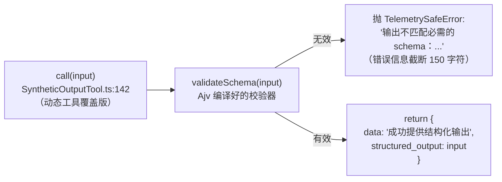
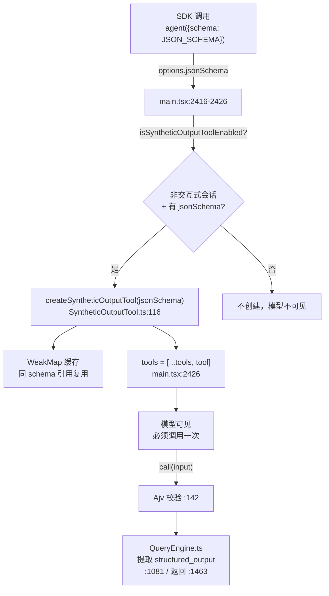

# SyntheticOutputTool（StructuredOutput）详解

> 这是工具系统里**最特殊**的一个。`SyntheticOutputTool`（工具名 `StructuredOutput`）是一个**中等复杂度**的内部工具：它不在 `getTools()` 的常规输出里（被 `specialTools` 集合过滤掉），而是在 SDK 非交互式会话、且用户传入了 JSON schema 时，由 `createSyntheticOutputTool(jsonSchema)` **动态创建**并注入工具列表。它的职责是让模型按指定的 JSON schema 返回**结构化输出**——不是"把别的工具结果显示成真实工具名"，而是 SDK/工作流场景下让模型产出符合契约的 JSON。

> **关于"延迟工具三件套"的澄清**：本工具目录名常被归入"三件套"（Search/Execute/Synthetic），但源码事实是——`StructuredOutput` 与 `SearchExtraTools`/`ExecuteExtraTool` **没有协作关系**。它独立服务于结构化输出场景。三件套的真正协作链路是 **Search 发现 → Execute 执行**（两件套）。本报告如实记录源码行为，纠正"把 ExecuteExtraTool 结果挂回真实工具名"的说法——代码里不存在该逻辑。

---

## 一、工具定位（一句话总结）

**`StructuredOutput` = SDK 结构化输出的动态 schema 工具，让模型按用户给的 JSON schema 校验并返回最终响应。**

| 维度 | 值 |
|---|---|
| 工具名 | `StructuredOutput`（常量 `SYNTHETIC_OUTPUT_TOOL_NAME`，`SyntheticOutputTool.ts:20`） |
| 一句话 | 接收任意对象，用动态注入的 JSON schema（Ajv）校验，通过则原样作为 `structured_output` 返回 |
| 是否进 system prompt | ⚠️ **特殊**：在 `CORE_TOOLS` 白名单内（`src/constants/tools.ts:178`），但被 `getTools()` 的 `specialTools` 过滤掉（`tools.ts:346`），**默认对模型不可见** |
| 何时对模型可见 | 仅 SDK 非交互式会话 + 传入 `jsonSchema` 时，由 `createSyntheticOutputTool` 动态创建并追加（`main.tsx:2420-2426`） |
| 只读 / 破坏性 | **只读**（`isReadOnly() → true`，只校验并返回数据） |
| 是否可并发 | ✅ **可并发**（`isConcurrencySafe() → true`） |
| 核心依赖 | `ajv`（JSON schema 校验）+ `WeakMap` 缓存（`createSyntheticOutputTool`） |
| 定位互补方 | `SearchExtraTools`/`ExecuteExtraTool`（**独立**，无协作）；`QueryEngine.ts`（消费 `structured_output`） |

**为什么需要它？** Claude SDK 的 `agent({schema: BUGS_SCHEMA})` 模式要求模型返回符合特定 JSON schema 的结构化数据。Anthropic 原生 API 有 `modelSupportsStructuredOutputs` 路径（`claude.ts:1720`），但**工具路径**用这个动态创建的 `StructuredOutput` 工具实现——模型在响应末尾必须调用一次它，传入符合 schema 的对象，工具用 Ajv 校验通过后作为 `structured_output` 字段返回给调用方。工作流脚本每次运行会调 30-80 次（注释 `:105-108`），所以 schema 校验做了 `WeakMap` 缓存。

---

## 二、关键文件清单

```
SyntheticOutputTool/
└── SyntheticOutputTool.ts   ← 全部逻辑（163 行）：静态原型 + createSyntheticOutputTool 动态工厂
```

| 文件 | 角色 | 必看行号 |
|---|---|---|
| `SyntheticOutputTool.ts` | 静态原型 `SyntheticOutputTool` + 动态工厂 `createSyntheticOutputTool` + Ajv 校验 + WeakMap 缓存 | `SYNTHETIC_OUTPUT_TOOL_NAME:20`、`isSyntheticOutputToolEnabled:22`、`SyntheticOutputTool buildTool:28`、`createSyntheticOutputTool:116`、`buildSyntheticOutputTool:127` |

| 外部消费方 | 角色 | 必看行号 |
|---|---|---|
| `src/main.tsx` | 动态创建入口 | `:2416`（条件）、`:2421`（创建）、`:2426`（追加到 tools） |
| `src/tools.ts` | 过滤逻辑（`specialTools`） | `:343-349` |
| `src/QueryEngine.ts` | 消费 `structured_output` | `:451-463`（注册强制）、`:1081-1082`（提取）、`:1463`（返回） |
| `src/constants/tools.ts` | `CORE_TOOLS` 白名单 + `ASYNC_AGENT_ALLOWED_TOOLS` + `COORDINATOR_MODE_ALLOWED_TOOLS` | `:83`、`:128`、`:178` |

> **结构特点**：单文件，但有两个导出——`SyntheticOutputTool`（静态原型，`call()` 无 schema 校验，直接返回 input）和 `createSyntheticOutputTool(jsonSchema)`（动态工厂，返回带 schema 校验的新工具）。生产中用的是后者。

---

## 三、Tool 接口字段实现（`buildTool` 逐字段）

### 标识字段

```ts
isMcp: false,
name: SYNTHETIC_OUTPUT_TOOL_NAME,        // "StructuredOutput"
searchHint: 'return the final response as structured JSON',
maxResultSizeChars: 100_000,
```

### 启用与并发字段

```ts
isEnabled()          { return true }     // 一旦创建就始终启用（创建本身有门控）
isConcurrencySafe()  { return true }
isReadOnly()         { return true }
isOpenWorld()        { return false }    // 非开放世界工具
```

> **`isEnabled` 恒 true 的原因**（`:30-34` 注释）：工具的"是否启用"门控不在 `isEnabled`，而在**创建时机**——`main.tsx:2416` 的 `isSyntheticOutputToolEnabled({isNonInteractiveSession})` 在创建前就判过了（仅非交互式会话创建）。一旦创建进 tools 数组，就始终启用。

### 模型面字段

```ts
async description() { return '按请求的格式返回结构化输出' }
async prompt()      {
  return '使用此工具按请求的结构化格式返回最终响应。你必须在响应末尾精确调用一次此工具以提供结构化输出。'
}
```

> `prompt()` 明确要求模型**在响应末尾精确调用一次**——这是强制契约，QueryEngine 会校验是否调用（`:1081`、`:1278` 的 `error_max_structured_output_retries`）。

### Schema 字段（关键）

**静态原型的 schema**（`:11-18`）：
```ts
inputSchema  = z.object({}).passthrough()   // 允许任意输入对象
outputSchema = z.string()                    // 输出是字符串
```

**动态工具的 schema**（`:140-141`）：
```ts
inputJSONSchema = jsonSchema   // 用户传入的 JSON schema，覆盖静态 schema
```

> 静态原型的 `inputSchema` 用 `passthrough()`（允许任意键），是因为 schema 是动态注入的。动态工厂通过 `inputJSONSchema` 字段（`Tool` 接口的可选字段）注入用户 schema，模型看到的 tool 定义就是用户的 JSON schema。

### 行为字段

| 字段 | 静态原型 | 动态工具（`buildSyntheticOutputTool`） |
|---|---|---|
| `call()` | `:59-65` 直接返回 `{data, structured_output: input}`（无校验） | `:142-157` Ajv 校验，失败抛 `TelemetrySafeError` |
| `checkPermissions` | `:66-72` 返回 `allow`（始终允许） | 继承静态原型 |

---

## 四、核心执行流程：`call()`（动态版）

动态工具的 `call()`（`:142-157`）极简——校验 + 返回：



**关键点**：
1. **校验器预编译**（`:136`）：`ajv.compile(jsonSchema)` 在工具创建时就编译好，`call()` 里直接调用编译产物 `validateSchema(input)`——每次调用零编译开销。
2. **错误用异常而非 newMessages**（`:148-151`）：与 `ExecuteExtraTool` 不同，这里校验失败**抛 `TelemetrySafeError`**。错误信息分两层——面向用户的中文 `输出不匹配必需的 schema：${errors}` + 遥测安全的长信息（截断 150 字符）。这是因为结构化输出失败是硬错误，需要 QueryEngine 的重试逻辑（`:1278`）捕获后让模型重试。
3. **返回 `structured_output` 字段**（`:155`）：这是 QueryEngine 识别的契约字段——`QueryEngine.ts:1081` 扫描 attachment 提取 `structured_output`，`:1463` 把它放进最终返回结构。

### 静态原型 `call()`（`:59-65`，生产中不直接用）

静态原型不做校验，直接 `return {data: '成功提供结构化输出', structured_output: input}`。它是动态工厂的"基底"——`buildSyntheticOutputTool` 用 `{...SyntheticOutputTool, call: 覆盖版}` 继承所有字段，只覆盖 `inputJSONSchema` 和 `call()`。

---

## 五、权限与安全

SyntheticOutputTool 是**纯数据工具**，权限极简：

### `checkPermissions` 返回 `allow`（`:66-72`）

```ts
async checkPermissions(input) {
  return { behavior: 'allow', updatedInput: input }
}
```

**始终允许**——它只是校验并返回数据，无副作用、无文件访问、无网络。`updatedInput` 原样回传。

### 真正的"安全"在创建门控

工具不暴露给普通用户——只有 SDK 非交互式会话 + 传入 schema 时才创建（`main.tsx:2416`）。`isSyntheticOutputToolEnabled`（`:22-26`）的判定就是 `opts.isNonInteractiveSession`——交互式 REPL 永远看不到这个工具。

### Ajv schema 校验防注入

`buildSyntheticOutputTool`（`:127-163`）在创建工具时先用 `ajv.validateSchema(jsonSchema)` 校验 schema 本身是否合法（`:132-135`）——非法 schema 返回 `{error}`，`main.tsx:2436` 记录 `tengu_structured_output_failure` 事件，不创建工具。这是防御性编程，防止恶意/错误 schema 导致 Ajv 编译崩溃。

---

## 六、与其他系统/工具的关系



- **与 `SearchExtraTools`/`ExecuteExtraTool` 的关系：无**。这是必须澄清的重点。三件套里 Search/Execute 是延迟工具发现链路，StructuredOutput 是结构化输出链路，**两者完全独立**。源码中没有任何"把 ExecuteExtraTool 结果挂回真实工具名"的逻辑——ExecuteExtraTool 的 `mapToolResultToToolResultBlockParam`（`ExecuteTool.ts:194`）只是 `JSON.stringify`，不涉及本工具。
- **与 `main.tsx` 的关系（创建入口）**：`:2416` 条件判定、`:2421` 创建、`:2426` 追加。注释（`:2423-2425`）明确——本工具被 `getTools()` 正常过滤排除（`tools.ts:346`），是"结构化输出的实现细节，而非用户控制的工具"。
- **与 `tools.ts` 的关系（过滤）**：`:343-349` 的 `specialTools` 集合包含 `SYNTHETIC_OUTPUT_TOOL_NAME`，`getAllBaseTools().filter(tool => !specialTools.has(tool.name))` 把它从常规输出里剔除。
- **与 `QueryEngine.ts` 的关系（消费）**：`:451-463` 检测工具存在并注册强制执行钩子 `registerStructuredOutputEnforcement`；`:834-852` 追踪调用计数（防无限重试）；`:1081-1082` 从 attachment 提取 `structured_output`；`:1278` 超过重试上限抛 `error_max_structured_output_retries`；`:1463` 把 `structured_output` 放进最终返回。
- **与 `CORE_TOOLS` 的关系（白名单但被过滤）**：`:178` 在 `CORE_TOOLS` 里（说明它是"一等核心工具"），`tools.ts:83` 在 `ASYNC_AGENT_ALLOWED_TOOLS` 里（异步代理可用），`:128` 在 `COORDINATOR_MODE_ALLOWED_TOOLS` 里（coordinator 模式可用）。**在 CORE_TOOLS 却被 getTools 过滤**——这是有意设计：白名单保证它不被 `isDeferredTool` 判为延迟（从而不进 SearchExtraTools 索引），过滤保证它不污染普通交互式会话的工具列表。
- **与 `claude.ts` 原生结构化输出的关系**：`:1720` 的 `modelSupportsStructuredOutputs(options.model)` 是另一条路径——原生 API 级别的结构化输出。本工具是**工具路径**的补充实现，两者择一。

---

## 七、亮点与设计取舍

1. **静态原型 + 动态工厂的双层设计**（`:28` + `:116`）：`SyntheticOutputTool` 是无 schema 的基底，`createSyntheticOutputTool(jsonSchema)` 用 `{...SyntheticOutputTool, inputJSONSchema, call}` 继承所有字段只覆盖两处。这是"用对象 spread 实现工具特化"的优雅模式。
2. **`WeakMap` 缓存省 Ajv 开销**（`:109-125`）：工作流脚本同 schema 引用调用 30-80 次，缓存把 80 次 Ajv 编译从 ~110ms 降到 ~4ms（注释 `:105-108`）。用 `WeakMap` 而非 `Map`——schema 对象可被 GC 回收时缓存自动清理，无内存泄漏。
3. **schema 合法性预检**（`:132-135`）：创建工具前先 `ajv.validateSchema`，非法 schema 返回 `{error}` 不创建——防御性编程，防 Ajv 编译崩溃。
4. **`inputJSONSchema` 字段注入**（`:141`）：通过 `Tool` 接口的可选 `inputJSONSchema` 字段动态覆盖 schema，模型看到的 tool 定义就是用户的 JSON schema——无需为每个 schema 写新工具类。
5. **错误用异常而非 newMessages**（`:148`）：与 ExecuteExtraTool 的"错误注入对话"策略相反。这里校验失败抛 `TelemetrySafeError`，由 QueryEngine 的重试逻辑捕获（`:1278`）——因为结构化输出失败是契约违背，需要主动重试而非让模型自由发挥。
6. **`TelemetrySafeError` 双信息**（`:148-151`）：用户面中文 + 遥测面英文（截断 150 字符）——防止 schema 细节（可能含敏感结构）泄露到遥测。
7. **CORE_TOOLS 白名单 + getTools 过滤的矛盾设计**：白名单让它"不算延迟工具"（不进 Search 索引），过滤让它"不进普通会话工具列表"——两个机制配合，精确控制它的可见范围（仅 SDK 结构化输出场景）。
8. **强制单次调用契约**（`prompt()` + QueryEngine 校验）：`prompt()` 要求"精确调用一次"，QueryEngine 计数防多调/漏调——这是把"返回结构化 JSON"的软约定硬化为工具调用契约。

---

## 八、源码导航（书签速查）

| 想看什么 | 去哪里 |
|---|---|
| 工具名常量 | `SyntheticOutputTool.ts:20` |
| 启用门控 `isSyntheticOutputToolEnabled` | `:22-26` |
| 静态原型 `buildTool` | `:28-101` |
| 静态 `call()`（无校验） | `:59-65` |
| 静态 `checkPermissions`（allow） | `:66-72` |
| 渲染字段（最小化，面向 SDK） | `:74-100` |
| WeakMap 缓存 | `:109` |
| 动态工厂 `createSyntheticOutputTool` | `:116-125` |
| `buildSyntheticOutputTool`（Ajv 校验） | `:127-163` |
| 动态 `call()`（Ajv 校验 + 抛错） | `:142-157` |
| 创建入口（main.tsx） | `src/main.tsx:2416-2440` |
| 过滤逻辑（tools.ts） | `src/tools.ts:343-349` |
| 消费逻辑（QueryEngine） | `src/QueryEngine.ts:451-463`、`:1081-1082`、`:1278`、`:1463` |
| 原生结构化输出路径 | `src/services/api/claude.ts:1720` |

---

## 九、学习建议与验证清单

**怎么读这章**：先看"一、工具定位"的**澄清**——理解本工具与三件套的 Search/Execute **无关**，是独立的结构化输出工具。然后看"四、call()"的 Ajv 校验，再看"六、关系"的创建-消费全链路（main.tsx 创建 → 模型调用 → QueryEngine 消费）。

**验证清单（读完自测）**：
- [ ] 能说出本工具与 Search/Execute **没有协作关系**（纠正"三件套"误解）
- [ ] 能解释为什么它在 `CORE_TOOLS` 却被 `getTools()` 过滤（白名单防延迟 + 过滤防污染交互式会话）
- [ ] 能说出动态创建的两个条件（非交互式会话 + 传入 jsonSchema）
- [ ] 能指出 `createSyntheticOutputTool` 用 `WeakMap` 缓存的动机（工作流同 schema 调 30-80 次，省 Ajv 编译）
- [ ] 能解释静态原型与动态工具 `call()` 的区别（前者无校验，后者 Ajv 校验 + 抛错）
- [ ] 能说出校验失败为何用异常而非 `newMessages`（契约违背，需 QueryEngine 重试）
- [ ] 能指出 QueryEngine 如何消费 `structured_output`（`:1081` 提取、`:1463` 返回）
- [ ] 能说出 `TelemetrySafeError` 双信息的用意（防 schema 细节泄露到遥测）

**配合动作**：
1. 用 SDK 模式 `agent({schema: {type:'object', properties:{bugs:{...}}}})`，观察模型在响应末尾调用 StructuredOutput，验证返回的 `structured_output` 符合 schema
2. 故意让 schema 要求必填字段，让模型漏填，观察 `TelemetrySafeError` 抛出与 QueryEngine 重试（`:1278`）
3. 在交互式 REPL 里确认本工具不可见（`getTools` 过滤生效）
4. 在 `buildSyntheticOutputTool` 的 `:136` 加日志，验证同 schema 引用第二次创建走 WeakMap 缓存（不重新 compile）
