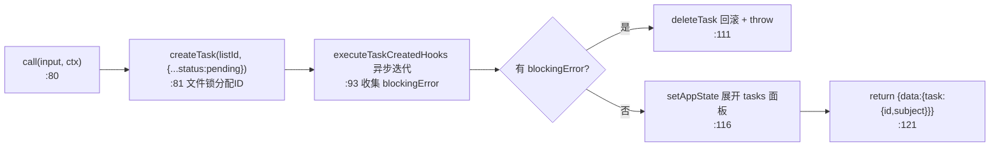
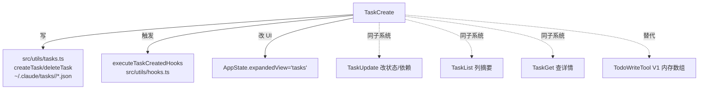

# TaskCreate 工具详解

> 这是 Task 子系统系列的第一篇。`TaskCreate` 是任务列表的**唯一写入入口**：它把一条 `{subject, description, ...}` 落盘为磁盘上的 JSON 文件，触发 `TaskCreated` hooks，并自动展开任务面板。它和 `TaskUpdate`（改）/`TaskList`（查摘要）/`TaskGet`（查详情）共享同一套基于 `~/.claude/tasks/<listId>/*.json` 的存储层（`src/utils/tasks.ts`）。读完这一篇，就掌握了整个 TodoV2 子系统的数据模型。

---

## 一、工具定位（一句话总结）

**`TaskCreate` = 在会话/团队共享的任务列表里新建一条任务（pending 态）的写入工具。**

| 维度 | 值 |
|---|---|
| 工具名 | `TaskCreate`（常量 `TASK_CREATE_TOOL_NAME`，`constants.ts:1`） |
| 一句话 | 给定 subject/description（+可选 activeForm/metadata），创建任务并返回其 ID |
| 是否进 system prompt | ⚠️ **条件注册**——仅当 `isTodoV2Enabled()` 为真时才进工具列表（`tools.ts:247-249`）；在 `CORE_TOOLS` 白名单内（`constants/tools.ts:152`） |
| 只读 / 破坏性 | **写入**（创建磁盘文件 + 触发 hooks + 改 AppState） |
| 是否可并发 | ✅ **可并发**（`isConcurrencySafe() → true`，底层文件锁保证一致性） |
| 核心依赖 | `src/utils/tasks.ts` 的 `createTask()` / `deleteTask()`；`src/utils/hooks.ts` 的 `executeTaskCreatedHooks` |
| 协作方 | `TaskUpdate`（改状态/依赖）、`TaskList`（列）、`TaskGet`（查） |

**为什么需要它？** TodoV2 用"每条任务一个 JSON 文件 + 文件锁"替代了 V1 的单一内存数组（`TodoWriteTool`），让多 agent / swarm teammate 能并发读写同一份任务列表而不互相覆盖。`TaskCreate` 是这个持久化模型的"INSERT"。

---

## 二、关键文件清单

```
TaskCreateTool/
├── TaskCreateTool.ts   ← buildTool({...}) 主体（139 行），schema + call() + 结果映射全在这
├── prompt.ts           ← DESCRIPTION + getPrompt()（含 teammate 分支文案）
└── constants.ts        ← TASK_CREATE_TOOL_NAME = 'TaskCreate'
```

| 文件 | 角色 | 必看行号 |
|---|---|---|
| `TaskCreateTool.ts` | 主体：schema + call + hook 执行 + 失败回滚 | `buildTool:48`、`call:80`、`inputSchema:18`、`mapToolResultToToolResultBlockParam:130` |
| `prompt.ts` | 工具描述 + 进 system prompt 的使用指南（中英混合） | `DESCRIPTION:3`、`getPrompt:5`、teammate 分支 `:6-14` |
| `constants.ts` | 工具名常量 | `:1` |

> **结构特点**：典型的"单文件主体 + prompt + constants"三件套，没有独立 UI.tsx（`renderToolUseMessage` 直接返回 `null`——任务创建不显示调用摘要，因为任务面板会实时展示）。

---

## 三、Tool 接口字段实现（`buildTool` 逐字段）

### 标识字段

```ts
name: TASK_CREATE_TOOL_NAME,           // "TaskCreate"
searchHint: '在任务列表中创建一个任务',  // TF-IDF 索引额外关键词
maxResultSizeChars: 100_000,
shouldDefer: true,                     // 延迟工具——按需通过 SearchExtraTools 加载
```

> **`shouldDefer: true` 的含义**：尽管 TaskCreate 在 `CORE_TOOLS` 白名单里，`shouldDefer` 标记它可被延迟发现。配合 `isTodoV2Enabled()` 的 `isEnabled` 门控，非交互式会话默认不加载。

### 门控字段

```ts
isEnabled() { return isTodoV2Enabled() }   // TaskCreateTool.ts:68
```

`isTodoV2Enabled()`（`tasks.ts:133-139`）逻辑：`CLAUDE_CODE_ENABLE_TASKS=1` 强制开；否则**非交互式会话返回 false**（即 SDK/headless 默认走老的 `TodoWriteTool`，交互式 REPL 才启用 Task 工具）。

### 模型面字段

```ts
async description() { return DESCRIPTION }   // "在任务列表中创建一个新任务"
async prompt()      { return getPrompt() }   // 动态拼装，含 teammate 分支
get inputSchema()   { return inputSchema() }  // 懒加载 getter
```

**输入 schema**（`TaskCreateTool.ts:18-33`，`z.strictObject`）：
```ts
{
  subject:    string,                  // 必填，祈使句标题
  description:string,                  // 必填，详细需求
  activeForm: string?,                 // 可选，in_progress 时 spinner 文案
  metadata:   Record<string, unknown>?,// 可选，任意元数据
}
```

**输出 schema**（`:36-43`）：
```ts
{ task: { id: string, subject: string } }
```

### 行为字段

| 字段 | 实现 | 说明 |
|---|---|---|
| `call()` | `:80` | 核心（见下节） |
| `isConcurrencySafe()` | `:71` → `true` | 多 agent 并发创建靠底层文件锁串行化 |
| `toAutoClassifierInput()` | `:74` | 返回 `input.subject`——自动审批分类器按标题判断 |
| `renderToolUseMessage()` | `:77` → `null` | 不在消息流显示调用摘要（任务面板已展示） |
| 无 `checkPermissions` / `validateInput` | — | 创建任务无副作用风险，直接进 `call()` |

---

## 四、核心执行流程：`call()`

`call()`（`TaskCreateTool.ts:80-129`）分四步：



**关键点逐条**：

1. **固定初始状态为 `pending`**（`:85`）：`createTask` 收到的对象硬编码 `status: 'pending', owner: undefined, blocks: [], blockedBy: []`——模型无法在创建时直接指定状态/负责人，必须随后用 `TaskUpdate`。这强制了"先创建后流转"的工作流。

2. **TaskCreated hooks 的阻塞性语义**（`:93-108`）：`executeTaskCreatedHooks` 是 async generator，逐个 yield hook 结果。若任一 hook 返回 `blockingError`，收集后**整批回滚**——调用 `deleteTask` 删掉刚建的文件再 throw。这给了外部系统（如审批、配额）否决任务创建的能力。

3. **自动展开任务面板**（`:116-119`）：`context.setAppState` 把 `expandedView` 设为 `'tasks'`，让 REPL 立刻显示任务列表。注意先判 `prev.expandedView === 'tasks'` 避免无谓重渲染。

4. **返回 `{data}` 而非 yield**：创建是原子的，无中间进度。

**`mapToolResultToToolResultBlockParam`**（`:130-137`）：把 `Output` 翻成给模型看的 `任务 #${id} 创建成功：${subject}`。注意是"非错误形式"返回（即使 hook 失败也是 throw，不会到这里）。

---

## 五、权限与安全

TaskCreate **没有** `checkPermissions` 也没有 `validateInput`——创建任务不触碰用户文件系统（只写 `~/.claude/tasks/`）、不需要权限审批。安全边界完全由底层 `tasks.ts` 保证：

- **文件锁**（`tasks.ts:284-308` `createTask`）：用 `lockfile.lock` + 30 次退避重试串行化并发创建，防止多 agent 同时分配到同一个 ID。
- **路径消毒**（`tasks.ts:217-219` `sanitizePathComponent`）：`taskListId` 经 `replace(/[^a-zA-Z0-9_-]/g, '-')` 处理，防止路径穿越。
- **高水位文件**（`tasks.ts:125`）：`.highwatermark` 记录历史最大 ID，删除/重置后 ID 不复用。

> hooks 的 `blockingError` 是**业务层**的否决（非安全层），用于配额、审批等策略。

---

## 六、与其他系统/工具的关系



- **存储共享**：四个 TodoV2 工具（Create/Update/List/Get）全部经 `getTaskListId()`（`tasks.ts:199-210`）定位同一份任务目录。listId 解析优先级：`CLAUDE_CODE_TASK_LIST_ID` > 进程内 teammate 的 teamName > `CLAUDE_CODE_TEAM_NAME` > leaderTeamName > sessionId。这让 swarm 里所有 teammate 共享 leader 的任务列表。
- **与 TaskUpdate 的协作**：Create 只能产出 `pending` 任务；状态流转（pending→in_progress→completed）、依赖建立（blocks/blockedBy）、负责人分配全部交给 TaskUpdate。这是**关注点分离**——Create 负责"INSERT"，Update 负责"UPDATE"。
- **与 hooks 系统**：`TaskCreated` / `TaskCompleted`（后者在 TaskUpdate 触发）是任务生命周期的两个埋点，供外部 agent/审批流介入。
- **与 TodoWriteTool 的关系**：TodoV2 是 V1 的持久化、并发安全、团队共享升级版。V1 是单会话内存数组；V2 是文件系统 + 锁。`isTodoV2Enabled()` 决定走哪套。

---

## 七、亮点与设计取舍

1. **创建即 pending 的硬约束**（`:85`）：不让模型在创建时设状态，强制走 Update 流转。好处是 hook 能在每次状态变更时介入；坏处是多一次工具调用。权衡偏向"可观测性"。
2. **hook 失败自动回滚**（`:110-113`）：`deleteTask` + throw 的组合保证"要么创建成功且 hooks 全过，要么完全不创建"——原子性。
3. **`shouldDefer: true` + `isEnabled` 双门控**：既支持延迟加载（省启动开销），又支持运行时按会话类型开关。
4. **teammate 文案动态拼装**（`prompt.ts:6-14`）：`isAgentSwarmsEnabled()` 为真时，prompt 会追加"在 description 里给 teammate 写够细节""用 TaskUpdate 的 owner 分配"等指引。一份代码服务两种部署形态。
5. **`renderToolUseMessage → null`**：任务创建不在消息流占行，因为任务面板（`expandedView: 'tasks'`）会实时展示。避免重复信息。

---

## 八、源码导航（书签速查）

| 想看什么 | 去哪里 |
|---|---|
| 工具名常量 | `TaskCreateTool/constants.ts:1` |
| 描述 + 使用指南（含 teammate 分支） | `TaskCreateTool/prompt.ts:3,5` |
| `buildTool` 字段填充 | `TaskCreateTool/TaskCreateTool.ts:48-138` |
| 输入/输出 schema | `TaskCreateTool.ts:18-43` |
| `call()` 核心逻辑 | `TaskCreateTool.ts:80-129` |
| hook 执行 + 失败回滚 | `TaskCreateTool.ts:93-113` |
| 注册条件（TodoV2 门控） | `src/tools.ts:247-249` |
| CORE_TOOLS 白名单条目 | `src/constants/tools.ts:152` |
| 底层存储 createTask | `src/utils/tasks.ts:284-308` |
| listId 解析（team 共享） | `src/utils/tasks.ts:199-210` |
| TodoV2 启用判定 | `src/utils/tasks.ts:133-139` |

---

## 九、学习建议与验证清单

**怎么读这章**：先看"一、定位"理解 TaskCreate 是 INSERT，再跳到"四、call()"看 hook 回滚机制，最后结合"六、关系"理解它如何与 Update/List/Get 组成子系统。本篇是整个 Task 系列的存储模型基础，后续 5 篇都建立在这之上。

**验证清单（读完自测）**：
- [ ] 能说出 TaskCreate 为什么创建出的任务一定是 `pending`（硬编码，强制走 Update 流转）
- [ ] 能指出 hook 失败时的回滚路径（`deleteTask` + throw，`:111-112`）
- [ ] 能解释 `isTodoV2Enabled()` 在交互式 vs SDK 会话下的差异（交互式默认开，SDK 默认关）
- [ ] 能说出四个 TodoV2 工具如何定位同一份任务列表（`getTaskListId` 优先级链）
- [ ] 能指出底层并发安全靠什么保证（`lockfile.lock` + 30 次退避，`tasks.ts:284`）
- [ ] 能解释 `shouldDefer: true` 与 `CORE_TOOLS` 白名单并存的原因（白名单控制 schema 注入，shouldDefer 控制按需加载）

**配合动作**：
1. 在 REPL 让 Claude `TaskCreate` 一个任务，观察 `~/.claude/tasks/<sessionId>/1.json` 的生成
2. 在 `call()` 的 `:104` 加日志，验证 hook generator 的迭代顺序
3. 设 `CLAUDE_CODE_ENABLE_TASKS=1` 在 SDK 模式下启用，对比默认行为
