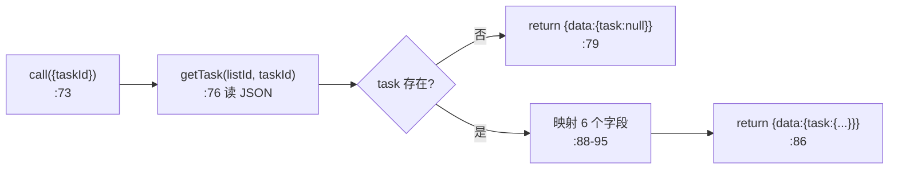
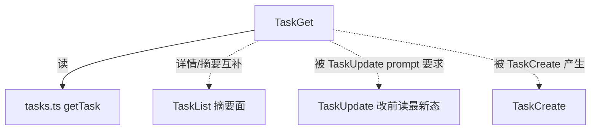

# TaskGet 工具详解

> 这是 Task 子系统系列的第四篇。`TaskGet`（129 行）是 TaskList 的"详情面"搭档：给它一个 `taskId`，返回该任务的完整字段（含 description、blocks、blockedBy）。它和 TaskList 共享只读语义，但一个给摘要、一个给详情，刻意分离以控制 context 占用。

---

## 一、工具定位（一句话总结）

**`TaskGet` = 按 taskId 读取单个任务的全部字段（含 description 和双向依赖）。**

| 维度 | 值 |
|---|---|
| 工具名 | `TaskGet`（常量 `TASK_GET_TOOL_NAME`，`constants.ts:1`） |
| 一句话 | 输入 taskId，返回该任务的完整详情（不存在则 task=null） |
| 是否进 system prompt | ⚠️ 条件注册——`isTodoV2Enabled()`（`tools.ts:247-249`）；在 `CORE_TOOLS`（`constants/tools.ts:153`） |
| 只读 / 破坏性 | **只读**（`isReadOnly() → true`，`:64`） |
| 是否可并发 | ✅ `true`（`:61`） |
| 核心依赖 | `tasks.ts` 的 `getTask()` |
| 协作方 | `TaskList`（摘要面）、`TaskUpdate`（改前读最新态） |

**为什么需要它？** TaskList 只给摘要（省 context），但模型在真正开始干活前需要完整的 description、要确认 blocks/blockedBy 全貌。TaskGet 提供这个"放大镜"。TaskUpdate 的 prompt（`prompt.ts:49`）明确要求"更新前用 TaskGet 读最新状态"——多 agent 并发下任务可能已被他人改过。

---

## 二、关键文件清单

```
TaskGetTool/
├── TaskGetTool.ts   ← 主体（129 行）
├── prompt.ts        ← DESCRIPTION + PROMPT（英文使用指南）
└── constants.ts     ← TASK_GET_TOOL_NAME = 'TaskGet'
```

| 文件 | 角色 | 必看行号 |
|---|---|---|
| `TaskGetTool.ts` | 主体 | `buildTool:38`、`call:73`、`mapToolResultToToolResultBlockParam:99` |
| `prompt.ts` | 描述 + 英文 prompt | `DESCRIPTION:1`、`PROMPT:3-24` |
| `constants.ts` | 工具名 | `:1` |

> **结构特点**：三件套，无 UI.tsx。是四个 TodoV2 工具里 prompt 唯一用纯英文静态字符串（`PROMPT`）而非 `getPrompt()` 函数的——因为它没有 teammate 分支需要动态拼装。

---

## 三、Tool 接口字段实现（`buildTool` 逐字段）

### 标识字段

```ts
name: TASK_GET_TOOL_NAME,
searchHint: '按 ID 获取任务',
shouldDefer: true,
isEnabled() { return isTodoV2Enabled() },   // :58
isConcurrencySafe() { return true },        // :61
isReadOnly() { return true },               // :64
```

### 模型面字段

```ts
async description() { return DESCRIPTION },
async prompt() { return PROMPT },   // 静态字符串，非函数
get inputSchema() { return inputSchema() },
```

**输入 schema**（`:13-17`）：
```ts
{ taskId: string }   // 必填
```

**输出 schema**（`:20-33`）：
```ts
{
  task: {
    id, subject, description, status,
    blocks: string[],     // 我阻塞了谁
    blockedBy: string[],  // 谁阻塞了我
  } | null   // 不存在时为 null
}
```

> 对比 TaskList 的输出：TaskGet **多了 description 和 blocks**，**没有 owner**。这是因为详情查询关心任务内容与完整依赖图，而 owner 是摘要信息（List 已提供）。

### 行为字段

| 字段 | 实现 | 说明 |
|---|---|---|
| `call()` | `:73` | 核心（见下节） |
| `toAutoClassifierInput()` | `:67` | 返回 `input.taskId` 供自动审批分类 |
| `isReadOnly()` | `:64` → `true` | 只读 |
| `renderToolUseMessage()` | `:70` → `null` | 不显示调用摘要 |

---

## 四、核心执行流程：`call()`

`call()`（`:73-98`）是最直白的一个：读 + 映射 + 返回。



**关键点**：

1. **不存在返回 null 而非报错**（`:78-84`）：`task: null` 是合法输出。`mapToolResultToToolResultBlockParam`（`:101-106`）把它翻成"未找到任务"。这是软处理——和 TaskUpdate 的"任务不存在软失败"哲学一致，避免良性错误打断流程。

2. **显式字段映射**（`:88-95`）：不直接返回 `getTask` 的原始对象，而是逐字段挑选 `{id, subject, description, status, blocks, blockedBy}`。这过滤掉了磁盘上的 `activeForm`、`metadata` 等字段——它们对"开始干活前的需求理解"不是必需的，且 metadata 可能含敏感/内部数据。

3. **返回双向依赖**（`:93-94`）：同时给 `blocks` 和 `blockedBy`。这让模型一次性看清"我阻塞了谁、谁阻塞了我"的完整依赖图（TaskList 只给单向 blockedBy）。

**`mapToolResultToToolResultBlockParam`**（`:99-127`）：多行渲染——标题行、状态行、描述行，条件追加"被阻塞于"和"阻塞"行。空任务返回"未找到任务"。

---

## 五、权限与安全

纯只读，**无 `checkPermissions` / `validateInput`**。

- **只读单文件**：`getTask`（`tasks.ts:310`）只 `readFile` 一个 JSON。
- **字段白名单**：call 里显式挑选 6 个字段返回，磁盘上的 metadata 等不暴露给模型——这是**数据最小化**原则。
- **不存在的 taskId 软处理**：返回 null 而非抛错，配合"未找到任务"文案。

---

## 六、与其他系统/工具的关系



- **与 TaskList 的分工**：List 给摘要（多任务、省 context），Get 给详情（单任务、完整字段）。prompt（`prompt.ts:23`）"用 TaskList 看摘要"互相指引。这是典型的"列表页 + 详情页"模式。
- **与 TaskUpdate 的协作**：TaskUpdate 的 prompt（`TaskUpdateTool/prompt.ts:49`）明确要求"更新前用 TaskGet 读最新状态"。多 agent 并发下，TaskGet 是避免"基于过时状态修改"的第一道防线（底层文件锁是第二道）。
- **与任务面板 UI**：面板订阅 `tasksUpdated` 信号实时刷新，TaskGet 工具是给模型用的按需查询入口，两者消费者不同。

---

## 七、亮点与设计取舍

1. **静态 PROMPT 而非 getPrompt()**（`:46`）：四个 TodoV2 工具里唯一不用函数的。因为 TaskGet 没有 teammate/swarm 分支需要动态拼装——它对所有上下文行为一致。
2. **字段白名单映射**（`:88-95`）：不透传磁盘原始对象，显式挑 6 个字段。过滤掉 metadata 等可能敏感的字段——数据最小化。
3. **null 而非报错**（`:78-84`）：不存在的任务返回 `task: null`，软处理。和 TaskUpdate 的软失败哲学一致，避免良性错误打断并发工具链。
4. **双向依赖 vs TaskList 单向**：Get 给 blocks+blockedBy（完整图），List 只给 blockedBy（认领决策够用）。按场景裁剪输出。
5. **`isReadOnly: true`**：和 TaskList 一样标只读，参与只读并发优化。

---

## 八、源码导航（书签速查）

| 想看什么 | 去哪里 |
|---|---|
| 工具名常量 | `TaskGetTool/constants.ts:1` |
| 描述 + 英文 prompt | `TaskGetTool/prompt.ts:1,3` |
| `buildTool` 字段 | `TaskGetTool/TaskGetTool.ts:38-128` |
| 输入/输出 schema | `TaskGetTool.ts:13-33` |
| `call()` 核心逻辑 | `TaskGetTool.ts:73-98` |
| 字段白名单映射 | `TaskGetTool.ts:88-95` |
| null 软处理 | `TaskGetTool.ts:78-84` |
| 结果映射（多行渲染） | `TaskGetTool.ts:99-127` |
| 注册条件 | `src/tools.ts:247-249` |
| 底层 getTask | `src/utils/tasks.ts:310` |

---

## 九、学习建议与验证清单

**怎么读这章**：和 TaskList 对照读。两者都是只读查询，区别在"摘要面 vs 详情面"、"单向依赖 vs 双向依赖"、"多任务 vs 单任务"。理解这个对称设计后，Task 子系统的查询侧就完整了。

**验证清单（读完自测）**：
- [ ] 能说出 TaskGet 与 TaskList 的字段差异（Get 多 description+blocks、无 owner；List 反之）
- [ ] 能解释为什么 TaskGet 用静态 PROMPT 而非 getPrompt()（无 teammate 分支，`:46`）
- [ ] 能指出不存在的 taskId 返回什么（`task: null`，软处理，`:79`）
- [ ] 能说出字段白名单映射过滤掉了什么（activeForm、metadata 等，`:88-95`）
- [ ] 能解释 TaskUpdate prompt 为什么要求"改前用 TaskGet"（多 agent 并发，读最新态）
- [ ] 能指出 TaskGet 返回双向依赖而 TaskList 只返回单向的原因（详情场景需完整依赖图）

**配合动作**：
1. TaskCreate 后调 TaskGet，对比返回字段和磁盘 JSON 的差异（确认 metadata 被过滤）
2. 用不存在的 taskId 调 TaskGet，验证返回 `task: null` 和"未找到任务"文案
3. 建立 A blocks B 的依赖，TaskGet B 确认 blocks 和 blockedBy 双向都正确
