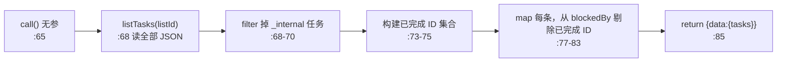
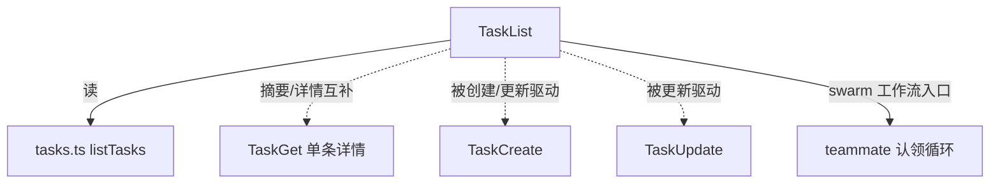

# TaskList 工具详解

> 这是 Task 子系统系列的第三篇。`TaskList`（117 行）是四个 TodoV2 工具里最轻量的一个：无入参，返回所有任务的 `{id, subject, status, owner, blockedBy}` 摘要。但它有两个不显然的处理——过滤 `_internal` 内部任务、从 `blockedBy` 里剔除已完成的依赖 ID——让模型看到的是"干净的可用任务视图"。

---

## 一、工具定位（一句话总结）

**`TaskList` = 无参列出当前任务列表所有（非内部）任务的摘要视图。**

| 维度 | 值 |
|---|---|
| 工具名 | `TaskList`（常量 `TASK_LIST_TOOL_NAME`，`constants.ts:1`） |
| 一句话 | 无入参，返回每个任务的 id/subject/status/owner/blockedBy 摘要 |
| 是否进 system prompt | ⚠️ 条件注册——`isTodoV2Enabled()`（`tools.ts:247-249`）；在 `CORE_TOOLS`（`constants/tools.ts:154`） |
| 只读 / 破坏性 | **只读**（`isReadOnly() → true`，`:59`） |
| 是否可并发 | ✅ `true`（`:56`） |
| 核心依赖 | `tasks.ts` 的 `listTasks()` |
| 协作方 | `TaskGet`（查单条详情）、`TaskUpdate`（认领/流转）、`TaskCreate`（产生条目） |

**为什么需要它？** teammate 完成任务后要"找下一个可做的"；leader 要看整体进度；模型要判断哪些任务被阻塞。TaskList 提供这个"鸟瞰图"，是 swarm 协作循环的枢纽（prompt 明确把它列为 teammate 工作流的第一步）。

---

## 二、关键文件清单

```
TaskListTool/
├── TaskListTool.ts   ← 主体（117 行），schema + call + 结果映射
├── prompt.ts         ← DESCRIPTION + getPrompt()（含 teammate 工作流分支）
└── constants.ts      ← TASK_LIST_TOOL_NAME = 'TaskList'
```

| 文件 | 角色 | 必看行号 |
|---|---|---|
| `TaskListTool.ts` | 主体 | `buildTool:33`、`call:65`、`mapToolResultToToolResultBlockParam:91` |
| `prompt.ts` | 描述 + teammate 工作流 | `DESCRIPTION:3`、`getPrompt:5`、teammate workflow `:15-26` |
| `constants.ts` | 工具名 | `:1` |

> **结构特点**：三件套，无 UI.tsx（`renderToolUseMessage → null`）。schema 是 `z.strictObject({})`——空对象，唯一一个无参的 Task 工具。

---

## 三、Tool 接口字段实现（`buildTool` 逐字段）

### 标识字段

```ts
name: TASK_LIST_TOOL_NAME,
searchHint: '列出所有任务',
shouldDefer: true,
isEnabled() { return isTodoV2Enabled() },   // :53
isConcurrencySafe() { return true },        // :56
isReadOnly() { return true },               // :59  ← 四个工具里只有 List/Get 标只读
```

### 模型面字段

```ts
async description() { return DESCRIPTION },
async prompt() { return getPrompt() },   // 动态：swarm 模式追加 teammate 工作流
get inputSchema() { return inputSchema() },  // z.strictObject({}) 空对象
```

**输入 schema**（`:13`）：`z.strictObject({})`——无参。用 strictObject 而非 object，传入多余字段会报错。

**输出 schema**（`:16-28`）：
```ts
{
  tasks: Array<{
    id: string,
    subject: string,
    status: 'pending'|'in_progress'|'completed',
    owner?: string,
    blockedBy: string[],   // 注意：只输出 blockedBy，不输出 blocks
  }>
}
```

> 输出**不含 description、activeForm、metadata、blocks**——这些是 TaskGet 的职责。TaskList 是"摘要面"，TaskGet 是"详情面"。

### 行为字段

| 字段 | 实现 | 说明 |
|---|---|---|
| `call()` | `:65` | 核心（见下节） |
| `isReadOnly()` | `:59` → `true` | 唯一只读标记，意味着可参与只读并发优化 |
| `renderToolUseMessage()` | `:62` → `null` | 任务面板已实时展示 |
| 无 `toAutoClassifierInput` | — | 无入参，无需分类 |

---

## 四、核心执行流程：`call()`

`call()`（`:65-90`）极简，三步：



**关键点逐条**：

1. **过滤内部任务**（`:68-70`）：`t => !t.metadata?._internal`。带 `_internal` 标记的任务（如系统创建的临时任务）不对模型展示。这让系统能用同一套任务存储放"用户可见"和"内部"两类条目。

2. **清理已完成依赖**（`:73-83`）：先建一个 `resolvedTaskIds` 集合（所有 completed 任务的 ID），然后 map 时把每条任务的 `blockedBy` 里属于这个集合的 ID 过滤掉。**效果**：一个任务若只被已完成的任务阻塞，它的 `blockedBy` 会显示为空——即"现在可做了"。这让模型无需自己判断"阻塞我的任务完成没"，直接看 blockedBy 是否为空就能认领。

3. **不返回 blocks**：输出 schema 只有 `blockedBy` 没有 `blocks`。这是刻意的摘要设计——"我被谁阻塞"对认领决策更重要；"我阻塞了谁"属于详情（TaskGet 才有）。

**`mapToolResultToToolResultBlockParam`**（`:91-115`）：把 tasks 渲染成多行文本，每行格式 `#${id} [${status}] ${subject}${owner?}${blocked?}`。空列表返回"未找到任务"。

---

## 五、权限与安全

和 TaskGet 一样是纯只读工具，**无 `checkPermissions` / `validateInput`**。安全边界：

- **只读磁盘**：`listTasks`（`tasks.ts:443-456`）只 `readdir` + `readFile`，无写入。
- **无路径入参**：空 schema，不存在路径穿越/注入风险。
- **`_internal` 过滤是显示层逻辑**：内部任务仍在磁盘上，只是不通过此工具暴露给模型。其他系统（如 UI 面板）可能有自己的过滤策略。

---

## 六、与其他系统/工具的关系



- **与 TaskGet 的分工**：List 是摘要面（id/subject/status/owner/blockedBy），Get 是详情面（加 description/activeForm/blocks/metadata）。prompt（`prompt.ts:47`）明确"用 TaskGet 看完整详情"。
- **与 TaskUpdate/TaskCreate 的协作**：这俩写入后，模型调 TaskList 看变化；teammate 完成 TaskUpdate(completed) 后，结果文案（TaskUpdate `:385`）主动提示"调 TaskList 找下一个"——形成闭环。
- **与 swarm teammate 系统**：prompt 的 `teammateWorkflow` 段（`prompt.ts:15-26`）把 TaskList 列为 teammate 工作流第 1 步："完成后调 TaskList → 找 pending/无 owner/无 blockedBy 的 → 优先低 ID → TaskUpdate 认领"。TaskList 是 swarm 任务分发的事实入口。
- **与任务面板 UI**：`tasksUpdated` 信号（`tasks.ts:43`）在每次写操作后 emit，UI 面板订阅它实时刷新。TaskList 工具本身是给**模型**用的查询入口，与给用户看的面板是两个消费者。

---

## 七、亮点与设计取舍

1. **无参 `strictObject({})`**（`:13`）：唯一无参的 Task 工具。用 strictObject 而非 object，防止模型幻觉传参。
2. **`_internal` 过滤**（`:68`）：用 metadata 约定区分用户任务和系统内部任务，一套存储服务两类消费者。
3. **已完成依赖清理**（`:73-83`）：这是最有价值的设计——把"阻塞我的任务完成了吗"的判断从模型侧挪到工具侧。模型只需看 `blockedBy.length === 0` 就能认领，降低推理负担。
4. **摘要/详情分离**（List vs Get）：避免一次返回所有任务的完整 description（可能很长）撑爆 context。模型按需用 Get 取详情。
5. **teammate 工作流写进 prompt**（`prompt.ts:15-26`）：不是靠模型猜，而是把"找可用任务→优先低 ID→认领"的协作协议显式写进 system prompt。
6. **`isReadOnly: true`**：四个 TodoV2 工具里只有 List 和 Get 标只读，让权限/并发系统能对它们做只读优化。

---

## 八、源码导航（书签速查）

| 想看什么 | 去哪里 |
|---|---|
| 工具名常量 | `TaskListTool/constants.ts:1` |
| 描述 + teammate 工作流 | `TaskListTool/prompt.ts:3,5,15` |
| `buildTool` 字段 | `TaskListTool/TaskListTool.ts:33-116` |
| 空 schema + 输出 schema | `TaskListTool.ts:13-28` |
| `call()` 核心逻辑 | `TaskListTool.ts:65-90` |
| `_internal` 过滤 | `TaskListTool.ts:68-70` |
| 已完成依赖清理 | `TaskListTool.ts:73-83` |
| 结果映射（多行渲染） | `TaskListTool.ts:91-115` |
| 注册条件 | `src/tools.ts:247-249` |
| 底层 listTasks | `src/utils/tasks.ts:443-456` |

---

## 九、学习建议与验证清单

**怎么读这章**：最简单的一篇。先看"一、定位"确认它是无参只读 SELECT，重点理解"四、call()"里的两个过滤（`_internal` + 已完成依赖清理），这是它区别于"直接返回原始数据"的关键。

**验证清单（读完自测）**：
- [ ] 能说出 TaskList 为什么是空 schema（`z.strictObject({})`，唯一无参 Task 工具）
- [ ] 能解释 `_internal` 过滤的作用（区分用户任务和系统内部任务，`:68`）
- [ ] 能指出已完成依赖清理的逻辑（建 resolvedTaskIds 集合，map 时剔除，`:73-83`）
- [ ] 能说出 TaskList 输出为什么没有 `blocks` 字段（摘要/详情分离，blocks 属于 Get）
- [ ] 能解释 TaskList 在 swarm teammate 工作流中的角色（认领循环入口，prompt `:15-26`）
- [ ] 能指出四个 TodoV2 工具里哪两个标了 `isReadOnly`（List 和 Get）

**配合动作**：
1. 创建几个带依赖的任务（TaskCreate + TaskUpdate addBlockedBy），完成阻塞者后调 TaskList，观察被阻塞任务的 blockedBy 变空
2. 创建一个带 `metadata._internal` 的任务（需绕过工具直接写文件），验证它不出现在 TaskList
3. 对比 TaskList 输出和 TaskGet 单条输出，确认字段差异
