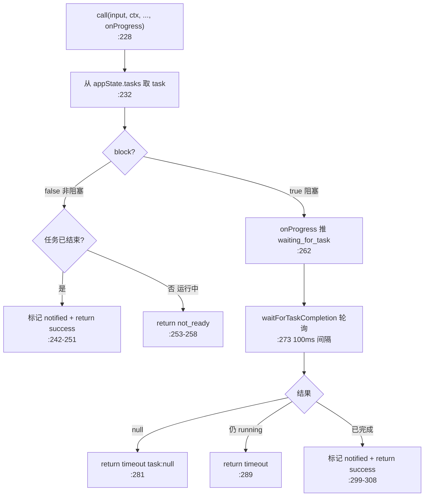
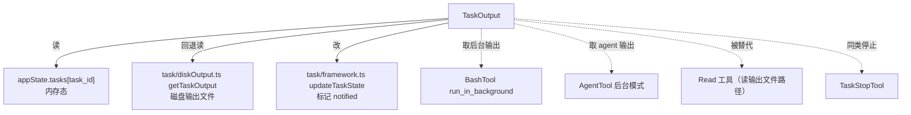

# TaskOutput 工具详解

> 这是后台任务子系统系列的第一篇。注意：`TaskOutput` 属于**后台任务系统**（`src/tasks/`，管理 BashTool/AgentTool 后台化的任务），**不是** TodoV2 任务列表（`src/utils/tasks.ts`）的一部分。两者同名"Task"但完全不同。`TaskOutput`（517 行 .tsx）从 `appState.tasks` 读取后台任务的输出，支持 `block=true` 阻塞等待完成或 `block=false` 非阻塞轮询，且已被标记为 **DEPRECATED**（建议改用 Read 读任务输出文件路径）。

---

## 一、工具定位（一句话总结）

**`TaskOutput` = 按 task_id 读取后台任务（shell/agent/远程）的输出，可阻塞等待或非阻塞轮询。**

| 维度 | 值 |
|---|---|
| 工具名 | `TaskOutput`（常量 `TASK_OUTPUT_TOOL_NAME`，`constants.ts:1`） |
| 一句话 | 给定 task_id，返回后台任务的输出+状态；block=true 等完成，block=false 立即返回 |
| 别名 | `aliases: ['AgentOutputTool', 'BashOutputTool']`（`:164`，重命名后的向后兼容） |
| 是否进 system prompt | ✅ **无条件注册**（`tools.ts:222`，不在 TodoV2 门控内）；在 `CORE_TOOLS`（`constants/tools.ts:150`） |
| 只读 / 破坏性 | **只读**（`isReadOnly() → true`，`:186`） |
| 是否可并发 | ✅ 跟随 isReadOnly（`:178-180`） |
| 核心依赖 | `appState.tasks[task_id]`（内存态）；`src/utils/task/diskOutput.ts` getTaskOutput；`src/utils/task/framework.ts` updateTaskState |
| 废弃状态 | ⚠️ **DEPRECATED**（description `:175` + prompt `:194` 明示，建议改用 Read 读输出文件） |

**为什么需要它？** BashTool 的 `run_in_background` 和 AgentTool 的后台模式产生的任务，模型需要后续读取输出。TaskOutput 是这个"异步任务 → 同步取结果"的桥梁。但现在后台任务结果会带输出文件路径 + task-notification，直接 Read 文件更简单，所以被废弃。

---

## 二、关键文件清单

```
TaskOutputTool/
├── TaskOutputTool.tsx   ← 主体（517 行），唯一一个 .tsx 的 Task 工具
└── constants.ts         ← TASK_OUTPUT_TOOL_NAME = 'TaskOutput'
```

| 文件 | 角色 | 必看行号 |
|---|---|---|
| `TaskOutputTool.tsx` | 全部逻辑 + Ink 渲染组件 | `buildTool:158`、`call:228`、`validateInput:205`、`getTaskOutputData:64`、`waitForTaskCompletion:124`、`TaskOutputResultDisplay:385` |
| `constants.ts` | 工具名 | `:1` |

> **结构特点**：**没有独立 prompt.ts/constants 拆分 prompt**——DESCRIPTION 内联在 call 里（`:175`、`:194`）。是 Task 系列里唯一把工具定义和 React 渲染组件混在一个 .tsx 的（因为渲染逻辑复杂，按任务类型分 4 种展示）。constants.ts 只放工具名。

---

## 三、Tool 接口字段实现（`buildTool` 逐字段）

### 标识字段

```ts
name: TASK_OUTPUT_TOOL_NAME,
searchHint: 'read output/logs from a background task',
maxResultSizeChars: 100_000,
shouldDefer: true,
aliases: ['AgentOutputTool', 'BashOutputTool'],   // :164 向后兼容
userFacingName() { return 'Task Output' },
isEnabled() { return process.env.USER_TYPE !== 'ant' },   // :182 ant 用户禁用
```

### 模型面字段

```ts
async description() { return '[已废弃] — 建议改用 Read 读取任务输出文件路径' },   // :175
async prompt() { return `DEPRECATED: Prefer using the Read tool...` },            // :194
```

**输入 schema**（`:30-36`）：
```ts
{
  task_id: string,                          // 必填
  block:   boolean (default true),          // 是否等待完成
  timeout: number (default 30000, max 600000),  // 最大等待毫秒
}
```

> `block` 用 `semanticBoolean(z.boolean().default(true))`——语义化布尔包装器，让模型更容易理解 true/false 含义。

**输出类型**（`:55-58`，TS type 非 Zod）：
```ts
{
  retrieval_status: 'success' | 'timeout' | 'not_ready',
  task: TaskOutput | null,
}
```

`TaskOutput`（`:42-53`）是覆盖所有任务类型的联合结构：`task_id, task_type, status, description, output, exitCode?, error?, prompt?, result?`。

### 行为字段

| 字段 | 实现 | 说明 |
|---|---|---|
| `call()` | `:228` | 核心（见下节） |
| `validateInput()` | `:205` | 校验 task_id 非空 + 任务存在于 appState |
| `isReadOnly()` | `:186` → `true` | 只读 |
| `isConcurrencySafe()` | `:178` | 跟随 isReadOnly |
| `toAutoClassifierInput()` | `:189` | 返回 task_id |

### 渲染字段（Task 系列最丰富的）

| 字段 | 行号 | 说明 |
|---|---|---|
| `renderToolUseMessage` | `:343` | block=false 显示"非阻塞"，否则空 |
| `renderToolUseTag` | `:351` | 显示 task_id 标签 |
| `renderToolUseProgressMessage` | `:358` | 等待时显示"正在等待任务 (按 esc)" |
| `renderToolResultMessage` | `:372` | 委托 `TaskOutputResultDisplay` 组件 |
| `renderToolUseRejectedMessage` | `:376` | 复用 Fallback 组件 |
| `renderToolUseErrorMessage` | `:380` | 复用 Fallback 组件 |

---

## 四、核心执行流程：`call()`

`call()`（`:228-310`）分 block / non-block 两条路径：



**关键点逐条**：

1. **`validateInput` 先行**（`:205-226`）：校验 task_id 非空（errorCode 1）+ 任务存在于 `appState.tasks`（errorCode 2）。这是第 3 步，失败直接 emit tool_use_error，不进 call。

2. **非阻塞路径**（`:238-259`）：`block=false` 时立即返回。任务已结束（非 running/pending）→ `success` + 标记 `notified:true`（`:244`，表示模型已看过输出，UI 不再高亮）；运行中 → `not_ready`。

3. **阻塞路径 + 进度推送**（`:262-309`）：`block=true` 时先通过 `onProgress` 推一条 `waiting_for_task` 进度消息（`:263-270`），让 UI 显示"正在等待任务"。然后 `waitForTaskCompletion`（`:124-156`）以 100ms 间隔轮询 `appState.tasks`，直到任务离开 running/pending 态或超时。

4. **`waitForTaskCompletion` 的 abort 支持**（`:134-136`）：每次循环检查 `abortController.signal.aborted`，用户 ESC 时抛 `AbortError`。

5. **`getTaskOutputData` 按类型取输出**（`:64-121`）：
   - **local_bash**（`:66-78`）：优先从 `shellCommand.taskOutput` 内存对象取 stdout/stderr；否则回退磁盘 `getTaskOutput`。附加 `exitCode`。
   - **local_agent**（`:97-110`）：**优先用内存 result 的干净最终答案**，而非磁盘原始 JSONL（磁盘是完整会话记录含所有工具调用，内存 result 只是最终 assistant 文本）。附加 `prompt`/`result`/`error`。
   - **remote_agent**（`:112-118`）：附加 `prompt=command`。
   - 注释（`:99-101`）明确解释了这个取舍：磁盘输出是符号链接到完整会话记录，不是 subagent 的答案。

6. **`mapToolResultToToolResultBlockParam` 用 XML 标签包裹**（`:312-341`）：输出用 `<retrieval_status>`、`<task_id>`、`<output>`、`<error>` 等 XML 标签结构化，便于模型解析。

---

## 五、权限与安全

- **`validateInput` 校验任务存在**（`:205`）：防止模型用任意 task_id 探测，只能访问 appState 里真实存在的后台任务。
- **`isEnabled: USER_TYPE !== 'ant'`**（`:182`）：ant（Anthropic 内部）用户禁用此工具——内部可能用别的机制取后台输出。
- **只读 + 不触碰用户文件**：只读 appState 内存态和 `~/.claude` 下的任务输出文件，无破坏性。
- **abort 支持**：阻塞等待时可被用户 ESC 中断（`:134`）。
- **`notified` 标记防重复高亮**（`:244, :299`）：模型取过输出后标记，UI 不再把该任务当"未读"。

---

## 六、与其他系统/工具的关系



- **与 BashTool/AgentTool 的关系**：这俩工具的后台模式产生 `appState.tasks` 条目，TaskOutput 是读取它们输出的入口。构成了"提交后台任务 → 后续取结果"的异步闭环。
- **与 TaskStopTool 的关系**：同属后台任务子系统（注意：不是 TodoV2）。TaskStop 停止运行中的任务，TaskOutput 读取（运行中或已完成）任务的输出。两者都读 `appState.tasks`。
- **与 Read 工具的关系（废弃原因）**：prompt（`:194`）明示——后台任务结果会带输出文件路径，完成时还有 `<task-notification>` 推同一路径，直接 Read 文件比经 TaskOutput 更直接。TaskOutput 被废弃是"文件即接口"理念的体现。
- **与渲染系统的深度集成**：唯一一个按任务类型分 4 种渲染的 Task 工具（`TaskOutputResultDisplay:385`）——local_bash 复用 BashToolResultMessage、local_agent 用 AgentPromptDisplay/AgentResponseDisplay、remote_agent 简化展示、默认兜底。

---

## 七、亮点与设计取舍

1. **`semanticBoolean` 包装 block 参数**（`:33`）：比裸 boolean 更利于模型理解 true/false 的语义。
2. **内存优先、磁盘回退的输出取法**（`:66-78`）：local_bash 优先从内存 taskOutput 对象取（快、新鲜），回退磁盘。local_agent 更进一步——优先内存 result（干净答案）而非磁盘 JSONL（完整会话含噪音），注释（`:99-101`）解释了这个关键取舍。
3. **block/non-block 双模式**（`:238-309`）：block=true 配合 `waitForTaskCompletion` 轮询 + 进度推送 + abort 支持；block=false 立即返回 not_ready。覆盖"等结果"和"瞄一眼状态"两种需求。
4. **`notified` 标记**（`:244, :299`）：模型取过输出后标记，配合 UI 避免"未读任务"高亮重复打扰。这是工具与 UI 协作的细节。
5. **XML 标签结构化输出**（`:312-341`）：用 `<output>`、`<error>` 等标签包裹，比纯文本更利于模型解析多字段结果。
6. **4 种渲染分支**（`:385-515`）：local_bash 复用 Bash 渲染、local_agent 分 verbose/非 verbose、remote_agent 简化、默认兜底——一个组件适配全任务类型。
7. **废弃但仍保留 + 别名兼容**（`:164, :175`）：`aliases` 保留旧名 AgentOutputTool/BashOutputTool，description 标废弃。这是"向后兼容不破坏老记录/SDK 用户"的典型处理。

---

## 八、源码导航（书签速查）

| 想看什么 | 去哪里 |
|---|---|
| 工具名常量 | `TaskOutputTool/constants.ts:1` |
| 废弃 description + prompt | `TaskOutputTool.tsx:175,194` |
| `buildTool` 字段 + 渲染 | `TaskOutputTool.tsx:158-383` |
| 输入 schema（block/timeout） | `TaskOutputTool.tsx:30-36` |
| `validateInput` 任务存在校验 | `TaskOutputTool.tsx:205-226` |
| `call()` 双路径核心 | `TaskOutputTool.tsx:228-310` |
| `getTaskOutputData` 按类型取输出 | `TaskOutputTool.tsx:64-121` |
| `waitForTaskCompletion` 轮询 | `TaskOutputTool.tsx:124-156` |
| 内存优先磁盘回退（agent） | `TaskOutputTool.tsx:99-110` |
| XML 标签结果映射 | `TaskOutputTool.tsx:312-341` |
| 4 种渲染分支 | `TaskOutputTool.tsx:385-515` |
| 别名（向后兼容） | `TaskOutputTool.tsx:164` |
| 注册（无条件） | `src/tools.ts:222` |
| CORE_TOOLS 白名单 | `src/constants/tools.ts:150` |

---

## 九、学习建议与验证清单

**怎么读这章**：先区分清楚——这个 TaskOutput 属于**后台任务系统**（`appState.tasks`，管理 Bash/Agent 后台化），不是 TodoV2 任务列表（`~/.claude/tasks/*.json`）。两者同名"Task"极易混淆。然后重点理解"四、call()"的双路径（block/non-block）和"内存优先磁盘回退"的输出取法。最后看"七、亮点"里为什么被废弃（文件即接口）。

**验证清单（读完自测）**：
- [ ] 能区分 TaskOutput（后台任务系统）和 TaskCreate/List/Get/Update（TodoV2 任务列表）是完全不同的两套系统
- [ ] 能说出 block=true 和 block=false 的行为差异（轮询等待 vs 立即返回 not_ready）
- [ ] 能指出 local_agent 输出为什么优先内存 result 而非磁盘 JSONL（磁盘是完整会话含噪音，内存是干净答案，`:99-101`）
- [ ] 能解释 `notified` 标记的作用（模型取过输出后标记，UI 不再高亮，`:244`）
- [ ] 能说出 TaskOutput 为什么被废弃（后台任务结果带文件路径，直接 Read 更简单，`:194`）
- [ ] 能指出 `aliases` 的用途（重命名后兼容旧名 AgentOutputTool/BashOutputTool，`:164`）
- [ ] 能解释 `validateInput` 为什么校验任务存在于 appState（防任意 task_id 探测，`:214`）

**配合动作**：
1. 用 BashTool `run_in_background` 起一个 sleep 任务，用 TaskOutput(block=false) 观察返回 not_ready，任务结束后 TaskOutput(block=true) 取输出
2. 对比 local_bash 任务经 TaskOutput 和直接 Read 输出文件路径的结果差异
3. 在 `waitForTaskCompletion` 的 `:150` 加日志，观察 100ms 轮询节奏
4. 验证 ESC 中断阻塞等待时抛出 AbortError
